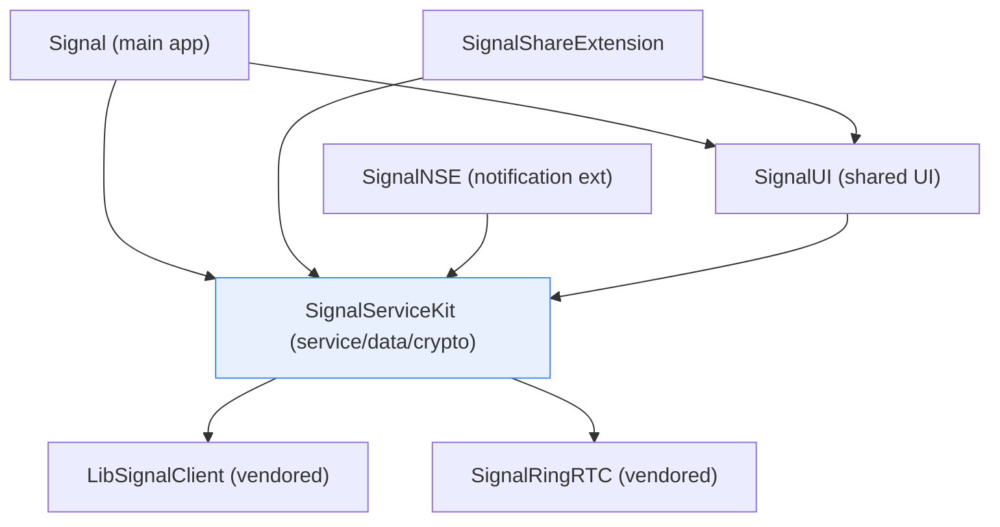
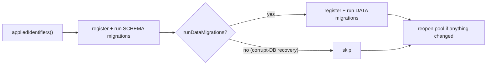
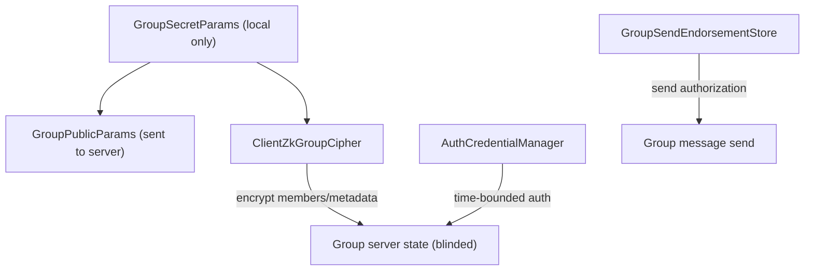
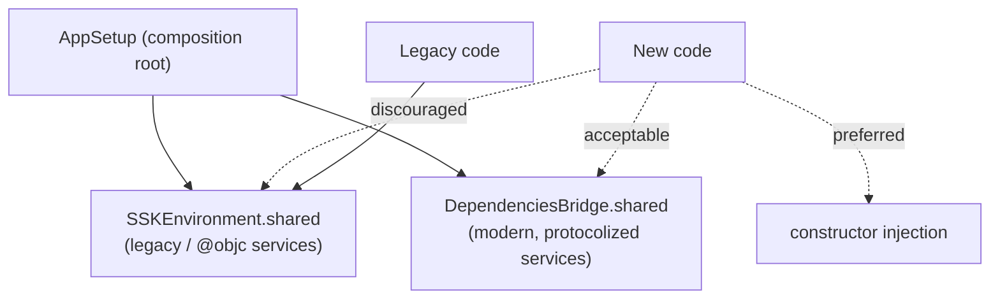

# Architecture Decisions

This document enumerates the **key architectural decisions** evident in the
Signal-iOS source tree. It is a decision register, not a subsystem reference: each
entry states the **context** (the problem/forces), the **decision** (what the code
actually does), and the **evidence** (file + line citations). Where a subsystem is
already documented in depth under [docs/](.), this document references that doc
rather than re-deriving it.

> **Confidence labels.** Claims about *purpose/behavior* carry a label:
> - **[High]** — directly observed: the file was read and the claim is explicit in
>   source, or produced by tooling in this session.
> - **[Medium]** — inferred from signatures, naming, directory structure, or
>   cross-file convention; not every referenced file was read in full, or the claim
>   depends on an out-of-tree collaborator (e.g. LibSignal, the Signal server).
> - **[Low]** — educated inference from naming/comments alone.
>
> **Citations.** Given as `path` or `path:line`. Line numbers reflect the tree at
> authoring time and may drift; use the cited symbol name to relocate. **Any
> uncited claim about behavior is a defect.** Where the source gives no evidence of
> *why* a decision was made, the text says **"intent undetermined — no evidence in
> source"** and distinguishes the observable *what* (citable) from the unobservable
> *why*.
>
> **Scope boundary.** This repository is the **iOS client**. The server, the
> wire-level cryptographic protocols, and the zero-knowledge group system live in
> out-of-tree collaborators (the Signal service; `LibSignalClient`; `SignalRingRTC`).
> Decisions about *client-side* adoption of those systems are citable here; the
> *internal* design of those systems is not in this tree and is marked accordingly.

---

## Decision index

| # | Decision | Primary evidence |
|---|----------|------------------|
| 1 | Layered module split: `SignalServiceKit` (service/data) vs `SignalUI` (shared UI) vs app/extension targets | `Podfile:53-87`, `SignalUI/AppLaunch/SUIEnvironment.swift:5` |
| 2 | Encrypted local store on **GRDB + SQLCipher** behind `SDSDatabaseStorage` | `Podfile:23-27`, `SDSDatabaseStorage.swift`, `GRDBDatabaseStorageAdapter.swift` |
| 3 | Forward-only, two-phase (schema then data) incremental migrations | `GRDBSchemaMigrator.swift:50-69` |
| 4 | DB key in keychain, `AfterFirstUnlockThisDeviceOnly`; terminate if unreadable | `GRDBDatabaseStorageAdapter.swift:189-203`, `SSKKeychainStorage.swift:70` |
| 5 | Vendor the protocol/crypto core via **LibSignalClient** (pinned pod) | `Podfile:14-15`, 647 import sites |
| 6 | Groups V2 built on server-blinded **zkgroup** credentials | `Groups/GroupsV2Impl.swift`, `Groups/GroupV2Params.swift` |
| 7 | Sealed sender / unidentified delivery via `OWSUDManager` + LibSignal cipher | `Messages/UD/OWSUDManager.swift`, `Messages/UD/SMKSecretSessionCipher.swift` |
| 8 | Composition-root DI with two transitional global containers (`SSKEnvironment`, `DependenciesBridge`) | `Environment/SSKEnvironment.swift:8`, `Environment/DependenciesBridge.swift:8-26`, `Environment/AppSetup.swift` |
| 9 | Protobuf wire types are **code-generated** + hand-wrapped | `SignalServiceKit/Protos/Makefile`, `Scripts/protos/ProtoWrappers.py` |
| 10 | Vendor forks pinned by git tag / prebuild checksum | `Podfile:14-30` |

---

## 1. Layered module split — `SignalServiceKit` vs `SignalUI` vs app/extensions

**Context.** The product ships as a main app plus two app extensions (Share
Extension, Notification Service Extension), all of which need the same networking,
storage, crypto, and messaging logic, and the main app + Share Extension additionally
share UI. App extensions run under tight memory/lifecycle constraints and cannot link
UI-only code paths that assume a full `UIApplication`.

**Decision.** Split the code into a UI-free **service/data layer** (`SignalServiceKit`)
and a **shared UI layer** (`SignalUI`), then compose them per target. The dependency
direction is **one-way**: UI depends on the service kit, never the reverse.

**Evidence.**
- The `Podfile` declares distinct targets `Signal`, `SignalShareExtension`,
  `SignalUI`, `SignalServiceKit`, `SignalNSE`, each with scoped pods
  (`Podfile:53-87`). **[High]** UI-only pods (`BonMot`, `PureLayout`, `lottie-ios`,
  MobileCoin) are grouped in `ui_pods` and applied to `Signal`, `SignalShareExtension`,
  and `SignalUI` but **not** to `SignalServiceKit`, which instead gets `CocoaLumberjack`
  (`Podfile:44-50`, `Podfile:78-79`). **[High]**
- `SignalUI` imports `SignalServiceKit`: `SignalUI/AppLaunch/SUIEnvironment.swift:5`
  (`public import SignalServiceKit`). **[High]**
- The reverse import **does not occur**: a tree-wide search for `import SignalUI`
  under `SignalServiceKit/` returned **0 matches** (session tooling). **[High]** This
  is the concrete evidence for the one-way dependency direction.
- `SignalUI`'s top-level directories are UI concerns (`Views/`, `ViewControllers/`,
  `ConversationView/`, `AttachmentApproval/`, `ImageEditor/`, `Stories/`, `Fonts/`,
  `Appearance/`, …), listed from the tree (`SignalUI/`). **[High]**
- The Share Extension is documented separately and consumes both frameworks (see
  [SignalShareExtension/README.md](SignalShareExtension/README.md)); the whole
  target/directory map is in [APPLICATION_MAP.md](APPLICATION_MAP.md) and
  [INVENTORY.md](INVENTORY.md). This document does not re-derive that map. **[High]**

> **Why this split (intent).** The *observable* decision — the module boundary and
> import direction — is cited above. The *rationale* (extension memory limits, build
> isolation, testability) is **inferred [Medium]** from the extension-aware build
> flags in the `Podfile` (`PURELAYOUT_APP_EXTENSIONS=1`,
> `Podfile:116-120`) and from `SUIEnvironment` guarding environment swaps behind
> `isRunningTests` (`SignalUI/AppLaunch/SUIEnvironment.swift:16-23`). A written
> rationale statement is **intent undetermined — no evidence in source**.

---

## 2. Encrypted local store on GRDB + SQLCipher behind `SDSDatabaseStorage`

**Context.** The client persists all messages, threads, attachments metadata, keys,
and app state locally and must keep that data encrypted at rest, support concurrent
readers with a single writer, and allow the same database to be opened from multiple
processes (main app + extensions).

**Decision.** Use **SQLite via GRDB.swift**, compiled against **SQLCipher** for
transparent full-database encryption, and funnel *all* database access through a
single Swift façade `SDSDatabaseStorage` (conforming to the `DB` protocol), which owns
a `GRDBDatabaseStorageAdapter` wrapping a GRDB `DatabasePool`.

**Evidence.**
- Pods: `pod 'GRDB.swift/SQLCipher'` (`Podfile:23`) and a forked SQLCipher pinned to a
  barrier-fsync build `pod 'SQLCipher', git: '…/signalapp/sqlcipher.git', tag:
  'v4.6.1-f_barrierfsync'` (`Podfile:26`). **[High]** The SQLCipher subspec of GRDB is
  the explicit choice (not vanilla GRDB). **[High]**
- Façade: `SDSDatabaseStorage: NSObject, DB`
  (`SignalServiceKit/Storage/Database/SDSDatabaseStorage/SDSDatabaseStorage.swift:10`),
  holding `grdbStorage: GRDBDatabaseStorageAdapter` and exposing `pool: DatabasePool`
  (`GRDBDatabaseStorageAdapter.swift:120-122`, `SDSDatabaseStorage.swift:34-38`).
  **[High]**
- Encryption is applied at connection open: `prepareDatabase` runs
  `PRAGMA key = "…"`, `PRAGMA cipher_plaintext_header_size = 32`,
  `PRAGMA checkpoint_fullfsync = ON`, and enables barrier fsync
  (`GRDBDatabaseStorageAdapter.swift:204-209`). **[High]**
- Single-writer / many-reader concurrency is provided by GRDB's `DatabasePool`
  (`GRDBDatabaseStorageAdapter.swift:120`, `:615`); async/awaitable writes are
  serialized via `asyncWriteQueue` and a `ConcurrentTaskQueue(concurrentLimit: 1)`
  (`SDSDatabaseStorage.swift:11-12`). **[High]**
- Multi-process coordination: `SDSCrossProcess` (`SignalServiceKit/Storage/Database/
  SDSCrossProcess.swift:13`) drives a callback when another process writes; it is wired
  in `SDSDatabaseStorage.init` to `handleCrossProcessWrite()`
  (`SDSDatabaseStorage.swift:48-51`). The adapter also watches a Darwin notification for
  *database path* changes, calling `exit(0)` if a sibling process relocated the DB
  (`GRDBDatabaseStorageAdapter.swift:155-166`). **[High]**
- Extension-specific tuning: in a non-main-app process the per-connection page cache is
  shrunk based on `maximumReaderCountInExtensions`
  (`GRDBDatabaseStorageAdapter.swift:210-218`); the reader count itself is `10` in the
  main app vs `4` in extensions (`GRDBDatabaseStorageAdapter.swift:671`, `:692`).
  **[High]** This directly supports Decision 1 (extensions run constrained).
- The attachment subsystem's own records/stores sit on this same storage; see
  [SignalServiceKit/Attachments/Store-and-Records.md](SignalServiceKit/Attachments/Store-and-Records.md).
  Not re-documented here.

> **Why SQLCipher over iOS Data Protection alone (intent).** Not stated in these
> files — **intent undetermined — no evidence in source**. The *what* (SQLCipher is
> used, with a plaintext-header pragma so the file is identifiable while the body is
> encrypted) is cited above. **[High]**

---

## 3. Forward-only, two-phase incremental migrations (schema then data)

**Context.** A long-lived local database must evolve its schema across app versions
without data loss, and some evolutions require backfilling/transforming existing rows
(data migrations) separately from structural changes (schema migrations).

**Decision.** Maintain an append-only, enumerated list of migration identifiers and
run them incrementally with GRDB's `DatabaseMigrator`, applying **all schema
migrations first, then data migrations**. Data migrations can be skipped (e.g. when
recovering a corrupted database).

**Evidence.**
- `GRDBSchemaMigrator.migrateDatabase(…, runDataMigrations:)` →
  `_runIncrementalMigrations` reads already-applied identifiers, registers schema
  migrations, migrates, then (optionally) registers + migrates data migrations
  (`GRDBSchemaMigrator.swift:19-69`). **[High]**
- The two-phase ordering is explicit in source: *"First do the schema migrations. (See
  the comment within `MigrationId` for why schema and data migrations are separate.)"*
  (`GRDBSchemaMigrator.swift:50-51`) and *"Finally, do data migrations."*
  (`GRDBSchemaMigrator.swift:58`). **[High]** A further comment notes data migrations
  must run *after* any schema migrations (`GRDBSchemaMigrator.swift:387`). **[High]**
- Migrations are identified by a `CaseIterable` enum `MigrationId` beginning with
  `createInitialSchema` (`GRDBSchemaMigrator.swift:74-82`), i.e. an ordered,
  append-only list. **[High]**
- The `runDataMigrations: false` escape hatch exists specifically for corrupted-DB
  recovery, per the doc comment (`GRDBSchemaMigrator.swift:18`). **[High]**
- Migrations are driven from `SDSDatabaseStorage.runGrdbSchemaMigrations()` /
  `runGrdbDataMigrations()`, with a GRDB pool reopen if incremental migrations ran
  (`SDSDatabaseStorage.swift:70-96`). **[High]** The app-launch sequencing of these
  phases lives in `AppSetup`'s `SchemaMigrationContinuation`
  (`SignalServiceKit/Environment/AppSetup.swift:29-60`). **[High]**

---

## 4. Database key in the keychain (`AfterFirstUnlockThisDeviceOnly`); fail-closed if unreadable

**Context.** The SQLCipher key must persist securely, be unavailable to other devices
(no iCloud keychain migration of the DB key), and be reachable by background
extensions after a reboot — but only once the device has been unlocked at least once.

**Decision.** Store the DB key in the keychain with accessibility
`kSecAttrAccessibleAfterFirstUnlockThisDeviceOnly`; generate-and-store it on first run;
and if it cannot be fetched (e.g. push arrives before first unlock), **terminate the
process** rather than operate without encryption.

**Evidence.**
- Accessibility class: `kSecAttrAccessible … kSecAttrAccessibleAfterFirstUnlockThisDeviceOnly`
  (`SignalServiceKit/Storage/SSKKeychainStorage.swift:70`). **[High]**
- Fail-closed behavior and its rationale are stated in-source:
  `ensureDatabaseKeySpecExists` comments that because of the accessibility class the
  keychain is unreadable until first unlock, so if a push arrives first the app
  *"should just terminate by throwing an uncaught exception"*
  (`GRDBDatabaseStorageAdapter.swift:189-203`). **[High]**
- On first run (`KeychainError.notFound`) it generates and stores the key, then
  re-fetches as a belt-and-suspenders check (`GRDBDatabaseStorageAdapter.swift:
  195-201`). **[High]**
- The key is fetched and applied as the SQLCipher `PRAGMA key` at every connection
  open (`GRDBDatabaseStorageAdapter.swift:204-206`, via `GRDBKeyFetcher`,
  `SDSDatabaseStorage.swift:28,38`). **[High]**

---

## 5. Vendor the protocol & crypto core via LibSignalClient

**Context.** Signal's end-to-end encryption (X3DH/PQXDH, Double Ratchet, sealed
sender, zkgroup, SVR) is implemented once in a cross-platform Rust library. The iOS
client should not re-implement these primitives.

**Decision.** Depend on **`LibSignalClient`** as a pinned CocoaPod and build the
client's crypto-adjacent Swift code *on top of* its types (`Aci`, `Pni`, `ServiceId`,
`PublicKey`, `SenderCertificate`, `GroupSecretParams`, protocol stores, etc.) rather
than owning the primitives. The iOS code is responsible for *orchestration and
persistence*; the primitives live in LibSignal.

**Evidence.**
- Pinned dependency: `pod 'LibSignalClient', git: '…/signalapp/libsignal.git', tag:
  'v0.103.1', testspecs: ["Tests"]` with a prebuild FFI checksum pinned via
  `LIBSIGNAL_FFI_PREBUILD_CHECKSUM` (`Podfile:14-15`). **[High]**
- Breadth of adoption: `import LibSignalClient` appears across **647 files** in the
  tree (session count), spanning `SignalServiceKit/`, `Signal/`, and `SignalUI/`.
  **[High]** Representative service-layer anchors: `Groups/GroupsV2Impl.swift:7`,
  `Groups/GroupV2Params.swift:7`, `Messages/UD/OWSUDManager.swift:7`,
  `Environment/DependenciesBridge.swift:7`. **[High]**
- The in-tree code conforms *to* LibSignal protocols rather than defining the crypto:
  e.g. the Sender Key adapters conform to `LibSignalClient.SenderKeyStore`; see the
  existing deep-dive [SignalServiceKit/Cryptography/sealed-sender.md](SignalServiceKit/Cryptography/sealed-sender.md)
  and [sessions-and-ratchet.md](SignalServiceKit/Cryptography/sessions-and-ratchet.md),
  which already establish the scope boundary. Not re-documented here. **[High]**
- RingRTC (calls) follows the same vendor-and-pin pattern: `pod 'SignalRingRTC', …,
  tag: 'v2.72.0'` with `RINGRTC_PREBUILD_CHECKSUM` (`Podfile:19-20`); the WebRTC
  integration is documented in [SignalServiceKit/Calls/webrtc-and-app-services.md](SignalServiceKit/Calls/webrtc-and-app-services.md).
  **[High]**

> **Scope boundary.** The *internal* design of the Double Ratchet, sealed-sender
> envelope encryption, and zkgroup is **out of tree** (LibSignal/Rust). Claims about
> their internals are **intent/implementation undetermined — no evidence in source**
> within this repository. **[High]**

---

## 6. Groups V2 on server-blinded zero-knowledge credentials (zkgroup)

**Context.** Group membership and metadata must be stored on and synced through the
server without the server learning members' identities, profile keys, or the group's
contents. The client needs a way to prove membership and read/write encrypted group
state.

**Decision.** Implement **Groups V2** against the server's group API using **zkgroup**
credentials and ciphers from LibSignal: the client holds per-group *secret params*,
derives *public params* for the server, and encrypts/decrypts member and metadata
blobs locally with a `ClientZkGroupCipher`. Auth to the group endpoints uses
server-issued, time-bounded **auth credentials**, and send authorization uses **group
send endorsements**.

**Evidence.**
- `GroupsV2Impl: GroupsV2` is the concrete implementation
  (`Groups/GroupsV2Impl.swift:8`), importing `LibSignalClient`
  (`Groups/GroupsV2Impl.swift:7`), and routing requests through the storage-service
  URL session (`Groups/GroupsV2Impl.swift:9-12`). **[High]**
- Credential plumbing is a first-class dependency of the impl: it holds an
  `AuthCredentialStore`, `AuthCredentialManager`, and `GroupSendEndorsementStore`
  (`Groups/GroupsV2Impl.swift:13-26`). **[High]** The endorsement store/records are
  distinct types (`Groups/GroupSendEndorsementStore.swift`,
  `Groups/GroupSendEndorsements.swift`, `Groups/GroupSendEndorsementRecord.swift`).
  **[High]**
- Zero-knowledge params: `GroupV2Params` wraps `GroupSecretParams` and derives
  `GroupPublicParams` (`Groups/GroupV2Params.swift:9-21`), obtained from a group
  model's stored `secretParamsData` (`Groups/GroupV2Params.swift:25-29`). **[High]**
- Local encryption/decryption of group blobs uses LibSignal's `ClientZkGroupCipher`
  (`Groups/GroupV2Params.swift:48-50`, with string/blob helpers at
  `Groups/GroupV2Params.swift:36-50`). **[High]**
- Protocol framing and change diffs are isolated into dedicated files:
  `Groups/GroupsV2Protos.swift`, `Groups/GroupsV2IncomingChanges.swift`,
  `Groups/GroupsV2OutgoingChangesImpl.swift`, `Groups/GroupV2UpdatesImpl.swift`
  (listed from `Groups/`). **[High]** The on-wire schema is the generated
  `Groups.proto` (`SignalServiceKit/Protos/Specifications/Groups.proto`; see
  Decision 9). **[High]**
- The V2 model coexists with a legacy model type (`TSGroupModel` / `TSGroupModelV2`,
  `Groups/TSGroupModel.swift`), i.e. V2 was introduced alongside, not by deleting, V1.
  **[Medium]** (inferred from the `V2` suffix and both types' presence; versioned-model
  intent is **[Medium]**).

> **Scope boundary.** The zkgroup credential math and the server's blinded storage are
> **out of tree** (LibSignal + server). What is citable here is the client's *use* of
> those params/ciphers/credentials. **[High]**

---

## 7. Sealed sender / unidentified delivery via `OWSUDManager` + LibSignal cipher

**Context.** To reduce metadata exposure, a sender should be able to deliver a message
without presenting its own identity credential to the server ("sealed sender"). The
client needs to manage recipients' *unidentified access* state, obtain its own
*sender certificate*, and perform the sealed-sender envelope encryption.

**Decision.** Centralize unidentified-delivery policy in **`OWSUDManager`**
(per-recipient `UnidentifiedAccessMode`, unidentified-access-key derivation, and
sender-certificate fetch/caching), and delegate the actual sealed-sender envelope
crypto to a cipher (`SMKSecretSessionCipher`) layered over LibSignal.

**Evidence.**
- `OWSUDManager` protocol defines the policy surface: per-`Aci`
  `UnidentifiedAccessMode` get/set, `udAccessKey(for:)`, `udAccess(for:)`,
  `fetchAllAciUakPairs`, and `fetchSenderCertificates()`
  (`Messages/UD/OWSUDManager.swift:70-91`, protocol declared at `:70`). **[High]**
- Access modes are an explicit enum `unknown / enabled / disabled / unrestricted`
  (`Messages/UD/OWSUDManager.swift:16-20`); `unrestricted` means the recipient accepts
  sealed sender from anyone. **[High]** `OWSUDAccess` can only be constructed when the
  mode is *not* confirmed-invalid (`Messages/UD/OWSUDManager.swift:50-57`, type at `:50`). **[High]**
- Two sender certificates are managed — a full cert and a UUID-only cert
  (`SenderCertificates { defaultCert; uuidOnlyCert }`,
  `Messages/UD/OWSUDManager.swift:63-66`) — selectable per the user's phone-number
  sharing preference. **[Medium]** (two-cert intent inferred from the `uuidOnly`
  naming; **[Medium]**.)
- Trust anchors for sealed-sender certs are LibSignal `PublicKey` trust roots exposed
  by the manager (`Messages/UD/OWSUDManager.swift:72`). **[High]**
- The envelope cipher lives in `Messages/UD/SMKSecretSessionCipher.swift` and the UAK
  type in `Messages/UD/SMKUDAccessKey.swift` (directory listing of `Messages/UD/`).
  **[High]** The whole directory is the one the task flags, and the deeper mechanics
  (Sender Keys for group fan-out, SKDM delivery tracking) are already documented in
  [SignalServiceKit/Cryptography/sealed-sender.md](SignalServiceKit/Cryptography/sealed-sender.md);
  that doc also records that the certificate *path* was not fully traced there, so this
  entry adds the `OWSUDManager` certificate/access-mode surface as the citable
  complement. **[High]**
- `OWSUDManager` is wired as a top-level dependency (`udManagerRef`) in the service
  environment (`Environment/SSKEnvironment.swift:45`). **[High]**

> **Scope boundary.** The sealed-sender *envelope encryption algorithm* itself is in
> LibSignal; `SMKSecretSessionCipher` orchestrates it. The algorithm internals are
> **intent/implementation undetermined — no evidence in source** in this tree. **[High]**

---

## 8. Composition-root dependency injection with two transitional global containers

**Context.** The codebase is migrating from pervasive global singletons toward
explicit constructor injection, but a wholesale rewrite is infeasible. New code should
take dependencies on `init`; legacy code still reaches for globals.

**Decision.** Build all services once at a **composition root** (`AppSetup`) and expose
them through two shared containers with deliberately different ergonomics:
`SSKEnvironment` (the older container, `@objc`-friendly, Obj-C-era services) and
`DependenciesBridge` (Swift-only, explicitly documented as a *temporary bridge* whose
members must themselves be constructor-injected and testable). New code is steered
toward constructor injection, then toward `DependenciesBridge`, and away from the
legacy `Dependencies` accessor pattern.

**Evidence.**
- Composition root: `AppSetup` with a staged `start → migrateDatabaseSchema →
  Globals…` pipeline (`Environment/AppSetup.swift:11-60`). **[High]**
- `SSKEnvironment: NSObject` is a singleton container (`setShared`/`shared`,
  `Environment/SSKEnvironment.swift:8-20`) holding `let` references to the Obj-C-era
  managers (`contactManagerRef`, `networkManagerRef`, `udManagerRef`,
  `databaseStorageRef`, `groupsV2Ref`, …) with several `@objc` members and explicit
  `*ImplRef` down-casts marked *"This should be deprecated."*
  (`Environment/SSKEnvironment.swift:22-70`). **[High]**
- `DependenciesBridge` is a Swift-only singleton whose header documents the migration
  intent verbatim: it is a *"Temporary bridge between [legacy code that uses global
  accessors] and [new code that expects references … explicitly passed around]"*,
  listing advantages over `Dependencies` and stating *"It is preferred NOT to use this
  class, and to take dependencies on init instead, but it is better to use this class
  than to use `Dependencies`."* (`Environment/DependenciesBridge.swift:8-26`). **[High]**
  Its many `let` members are the modern, protocolized services
  (`Environment/DependenciesBridge.swift:49-70`). **[High]**
- The direction-of-travel (init-injection preferred) is explicit in that same doc
  comment. **[High]** This is one of the few decisions where the *why* is citable
  rather than inferred.

---

## 9. Protobuf wire types are code-generated and hand-wrapped

**Context.** The client exchanges many message types with the server and across the
sealed-sender/storage-service/groups/backup surfaces, all defined as Protocol Buffers.
Hand-writing serialization is error-prone; raw generated types are also awkward
(optionality, builders).

**Decision.** Keep `.proto` specifications in-tree, generate Swift types with
`protoc`/SwiftProtobuf, and additionally run a project-specific wrapper generator
(`ProtoWrappers.py`) that emits ergonomic `…Proto` wrapper types around the raw
generated `.pb.swift`.

**Evidence.**
- Specifications live under `SignalServiceKit/Protos/Specifications/` and
  `.../Backups/` (14 `.proto` files incl. `SignalService.proto`, `Groups.proto`,
  `StorageService.proto`, `Provisioning.proto`, `Backup.proto`; glob listing). **[High]**
- Codegen is a `Makefile`: `PROTOC=protoc --proto_path=Specifications` and
  `WRAPPER_SCRIPT=../../Scripts/protos/ProtoWrappers.py …`
  (`SignalServiceKit/Protos/Makefile:8-9`). For `SignalService.proto` it runs
  `protoc --swift_out=Generated` **then** the wrapper script to emit the `SSKProto`
  wrapper (`SignalServiceKit/Protos/Makefile:12-14`). **[High]** The same two-step
  pattern recurs for IOS, StorageService, Groups, DeviceTransfer protos
  (`Makefile:22-39`). **[High]**
- The dependency on `SwiftProtobuf` is pinned: `pod 'SwiftProtobuf', "1.38.1"`
  (`Podfile:12`). **[High]**
- Generated outputs are committed, e.g. `SignalServiceKit/Protos/Generated/SSKProto.swift`
  (wrapper) and `.../Generated/SignalService.pb.swift` (raw) (session search). **[High]**
- Some protos are generated without a wrapper (e.g. `SessionRecord.proto`, `svr2.proto`,
  `MobileCoinExternal.proto` have only the `protoc` step) — i.e. wrapping is applied
  selectively (`SignalServiceKit/Protos/Makefile:41-48`). **[High]**

> **Why hand-wrap (intent).** Not stated in the Makefile — **intent undetermined — no
> evidence in source** beyond the observable fact that wrappers are generated for the
> larger message surfaces and omitted for simple record protos. **[Medium]**

---

## 10. Vendor dependencies pinned by git tag and prebuild checksum

**Context.** Several core dependencies are Signal forks or native binaries where a
drifting or substituted artifact would be a correctness/security hazard.

**Decision.** Pin forked and binary pods to explicit **git tags** and verify native
prebuilt artifacts against **hardcoded checksums** set as environment variables before
the pod is declared.

**Evidence.**
- `LibSignalClient` pinned to `tag: 'v0.103.1'` with
  `ENV['LIBSIGNAL_FFI_PREBUILD_CHECKSUM'] = 'db25764…'` set immediately before it
  (`Podfile:14-15`). **[High]**
- `SignalRingRTC` pinned to `tag: 'v2.72.0'` with
  `ENV['RINGRTC_PREBUILD_CHECKSUM'] = 'dc1826c…'` (`Podfile:19-20`). **[High]**
- Forked `SQLCipher` pinned to a custom tag `v4.6.1-f_barrierfsync` from
  `signalapp/sqlcipher` (`Podfile:26`); forked `libPhoneNumber-iOS` pinned to a Signal
  branch (`Podfile:33`). **[High]**
- `post_install` applies deterministic build fixups (strip, bitcode off, armv7
  excluded, warning-flags-as-errors, RingRTC symlink fix) rather than relying on pod
  defaults (`Podfile:89-99`, with the fixup functions defined below). **[High]** The build
  environment is documented in
  [BUILD_ENV.md](BUILD_ENV.md); not re-derived here.

> **Why checksums (intent).** The checksum variables are present and consumed by the
> pods' prebuild scripts; the *stated reason* (supply-chain integrity) is **[Medium]**
> inferred from the "PREBUILD_CHECKSUM" naming — **intent undetermined — no explicit
> rationale comment in source**.

---

## Cross-references (already-documented subsystems)

These subsystems embody further decisions documented in depth elsewhere; this register
links rather than re-derives them:

- Networking (chat websocket vs REST, censorship circumvention, proxy):
  [SignalServiceKit/Network/01-architecture.md](SignalServiceKit/Network/01-architecture.md)
  and siblings.
- Attachments V2 model, content validation, up/download pipeline:
  [SignalServiceKit/Attachments/README.md](SignalServiceKit/Attachments/README.md).
- Identity, registration, PNI, device linking, SVR/PIN:
  [SignalServiceKit/Account/identity-and-registration.md](SignalServiceKit/Account/identity-and-registration.md),
  [SignalServiceKit/SecureValueRecovery/secure-value-recovery.md](SignalServiceKit/SecureValueRecovery/secure-value-recovery.md),
  [SignalServiceKit/Devices/device-linking-and-sync.md](SignalServiceKit/Devices/device-linking-and-sync.md).
- Sessions/ratchet, prekeys, sealed sender / sender keys, key transparency:
  [SignalServiceKit/Cryptography/README.md](SignalServiceKit/Cryptography/README.md).
- Calls (RingRTC / WebRTC, call links, call records):
  [SignalServiceKit/Calls/README.md](SignalServiceKit/Calls/README.md).
- Whole-repo target/directory map and module boundaries:
  [APPLICATION_MAP.md](APPLICATION_MAP.md), [INVENTORY.md](INVENTORY.md),
  [GLOSSARY.md](GLOSSARY.md).

## Open items / undetermined intent

- The **rationale** behind several decisions is not written in source and is marked
  *intent undetermined* above: the SSK/UI split motivation (Decision 1), SQLCipher vs
  Data-Protection choice (Decision 2), selective proto wrapping (Decision 9), and the
  checksum-pinning rationale (Decision 10). Only the **observable mechanics** of each
  are cited **[High]**.
- Line numbers are anchors as of authoring and may drift; relocate by the cited symbol
  names.
