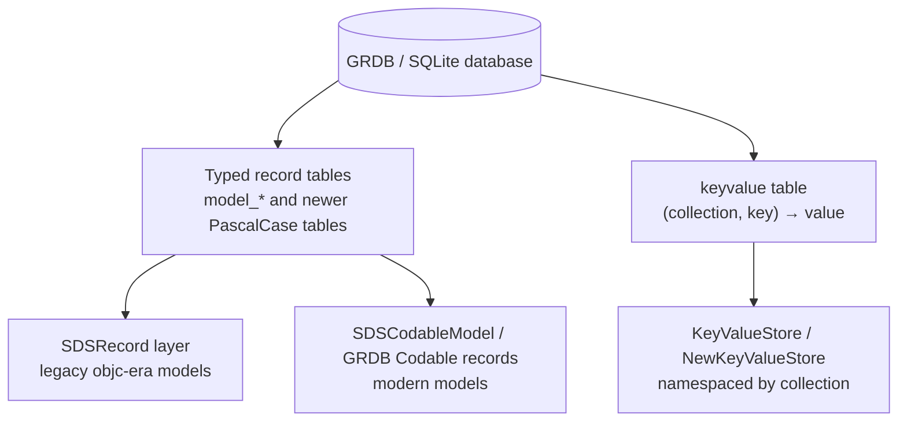
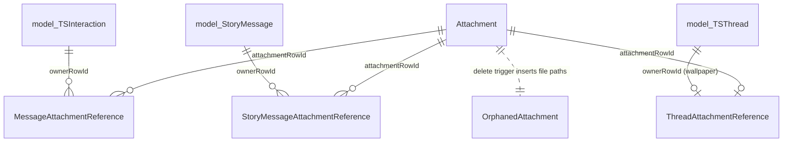
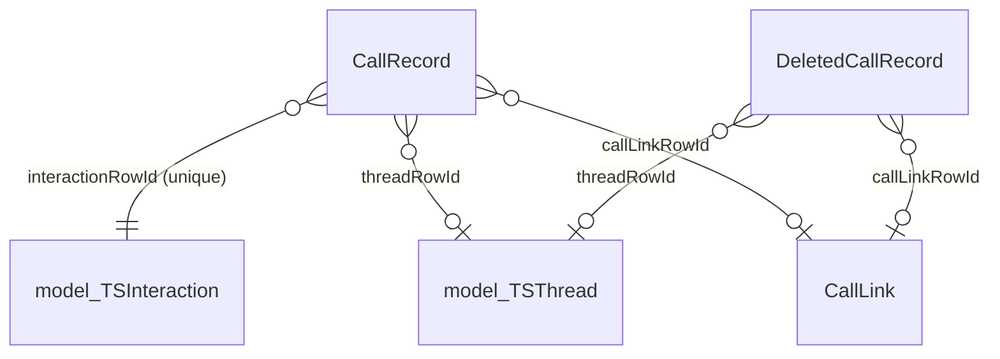
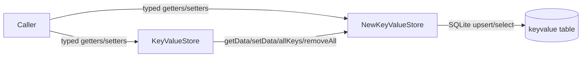

# Persisted Data Model (GRDB schema + key-value stores)

This document describes **what Signal iOS persists**: the GRDB/SQLite tables and record
types, and the key-value stores layered on top of them. It focuses on the *shape of the
data* — table purposes, important columns, indexes, foreign keys, triggers, and
collection namespacing.

**Scope boundary.** The *mechanics* of the Storage subsystem — `SDSDatabaseStorage`, the
migration machinery (`GRDBSchemaMigrator` orchestration), corruption detection and
recovery (`DatabaseRecovery.swift`, `DatabaseCorruptionState.swift`) — are documented
separately. This doc cross-references those, and does not re-explain how migrations run or
how the database is opened. Where it cites `GRDBSchemaMigrator.swift`, it does so as the
*authoritative definition of the schema*, not to describe the migration engine.

## Conventions & confidence

Every factual claim cites `file:line`. An uncited claim is a defect.

- **HIGH** — directly read in source at the cited line(s).
- **MEDIUM** — inferred from strong but indirect evidence (naming, adjacent code).
- **LOW** — plausible but weakly evidenced.
- *"intent undetermined — no evidence in source"* — where behavior is observable but the
  rationale is not stated.

Line numbers reference the repository state at authoring time. `GRDBSchemaMigrator.swift`
is ~8600 lines; its schema is built incrementally across migrations, so a table's
*current* shape is the union of its `CREATE TABLE` plus all later `ALTER`/rename/recreate
migrations. Citations below give the defining migration; later column additions are noted
where read.

---

## 1. Two persistence layers

Signal persists to a single GRDB-backed SQLite database that contains **two conceptually
distinct kinds of storage**:

1. **Typed record tables** — one SQLite table per model family (`model_TSInteraction`,
   `Attachment`, `CallRecord`, …). Rows are serialized/deserialized by the SDS record
   layer (§2) or by GRDB `Codable` records (`SDSCodableModel`, §2.3).
2. **The `keyvalue` key-value store** — a single generic `(collection, key) → value`
   table (§5) used for scalar settings and small blobs, namespaced by `collection`.



The schema is defined entirely in
`SignalServiceKit/Storage/Database/GRDBSchemaMigrator.swift`. The initial schema is one
large multi-statement SQL string in the `.createInitialSchema` migration
(`GRDBSchemaMigrator.swift:581`); every subsequent table/column is added by a later
registered migration (`GRDBSchemaMigrator.swift` `MigrationId` enum, `:73`–`:467`).

Latest schema version constant: `grdbSchemaVersionLatest: UInt = 160`
(`GRDBSchemaMigrator.swift:497`); default is `0` (`:496`). Confidence: HIGH.

---

## 2. Record types & serialization layers

### 2.1 `SDSRecord` (legacy models)

`SDSRecord` (`SDSRecord.swift:9`) is the base protocol for the older Objective-C-era
models. It is `Codable, FetchableRecord, PersistableRecord` and requires `id: Int64?`,
`uniqueId: String`, and a `tableMetadata: SDSTableMetadata` (`SDSRecord.swift:9-14`).
Confidence: HIGH.

Key properties of this layer (all `SDSRecord.swift`, HIGH):

- **Upsert by `uniqueId`.** `sdsSave(saveMode:)` (`:36`) resolves the GRDB row `id` by
  looking up the `uniqueId` (`grdbIdByUniqueId`, `:76`) via
  `SELECT id FROM <table> WHERE uniqueId=?` (`:97-99`). If present it updates, else it
  inserts. In DEBUG builds a mismatch between intent (insert vs. update) and DB contents
  triggers `owsFailDebug` (`:46`, `:51`).
- Consequence for the schema: every legacy `model_*` table has an `id INTEGER PRIMARY KEY
  AUTOINCREMENT` plus a `uniqueId TEXT NOT NULL UNIQUE` plus a `recordType INTEGER NOT
  NULL` column (see §3; e.g. `model_TSThread` at `GRDBSchemaMigrator.swift:596-610`).

### 2.2 `recordType` discriminator — `SDSRecordType`

Legacy tables store a numeric class discriminator in the `recordType` column. The values
are the `SDSRecordType` enum (`SDSRecordType.swift:13-37`), a generated file
(`SDSRecordType.swift:10-11` note: generated by `sds_generate.py`, do not hand-edit).
Confidence: HIGH.

The enum is sparse (values are not contiguous), reflecting the class hierarchy of
interactions. Examples (`SDSRecordType.swift`):

| Value | Case | Line |
|------:|------|-----:|
| 9 | `errorMessage` | 18 |
| 10 | `infoMessage` | 19 |
| 11 | `message` | 20 |
| 16 | `interaction` | 22 |
| 19 | `incomingMessage` | 24 |
| 21 | `outgoingMessage` | 26 |
| 65 | `groupCallMessage` | 32 |
| 81 | `releaseNotesMessage` | 37 |

(Full list: `SDSRecordType.swift:14-36`.) These values appear directly in SQL migrations —
e.g. marking all group-call messages read uses
`WHERE recordType = \(SDSRecordType.groupCallMessage.rawValue)`
(`GRDBSchemaMigrator.swift:3358`; an `assert(... == 65)` is at `:7403`), and
story-recipient migration keys off `recordType = 72` (`:7634`) while group-thread
migration keys off `recordType = 26` (`:8266`). Confidence: HIGH. The *meaning* of the
specific numeric literals `72`/`26` (private-story thread, group thread) is inferred from
surrounding migration logic — MEDIUM.

### 2.3 `SDSCodableModel` (modern models)

Newer models conform to `SDSCodableModel` (`SDSCodableModel.swift:73`), an
`AnyObject, Encodable, FetchableRecord, PersistableRecord` protocol with an associated
`CodingKeys` that double as GRDB `Columns` (`SDSCodableModel.swift:73-90`). It supports a
`RowId = Int64` `id` and a `uniqueId` plus the `anyWill*/anyDid*` lifecycle hooks
(`:85-89`). Confidence: HIGH.

The large doc-comment (`SDSCodableModel.swift:10-72`) explains why classes with
*inheritance* must use factory initialization (`NeedsFactoryInitializationFromRecordType`
/ `FactoryInitializableFromRecordType`) instead of the default `FetchableRecord`
conformance, citing a Swift issue where overridden `init(from:)` is ignored in static
contexts (`:24-72`). `JobRecord` is called out as the canonical example (`:22`). Intent:
HIGH (explicitly documented in source).

The newest tables (PascalCase names such as `Attachment`, `CallRecord`, `SenderKey`) are
plain GRDB `Codable` records and typically **do not** carry `recordType`/`uniqueId`
columns; they use an integer primary key and real foreign keys instead (see §4).
Confidence: HIGH (contrast `model_*` definitions in §3 vs. §4 definitions).

### 2.4 `SDSTableMetadata`

`SDSTableMetadata` (`SDSTableMetadata.swift:37`) pairs a `tableName` with an ordered list
of `SDSColumnMetadata` (`:20`), each describing `columnName`, `columnType`
(`SDSColumnType`: `unicodeString/blob/bool/int/int64/double/primaryKey`,
`SDSTableMetadata.swift:10-18`), `isOptional`, `isUnique` (`:23-35`). This metadata is what
the legacy `SDSRecord` upsert machinery uses to find the table name
(`SDSRecord.swift:96`). The source carries a `// TODO: We need to revise this.`
(`SDSTableMetadata.swift:9`). Confidence: HIGH.

---

## 3. Initial-schema tables (`.createInitialSchema`)

All tables below are created by the single SQL blob in the `.createInitialSchema`
migration (`GRDBSchemaMigrator.swift:581`). Each legacy table follows the pattern
`id` (autoincrement PK) + `recordType` + `uniqueId` (UNIQUE ON CONFLICT FAIL) + a
per-table `index_model_<Name>_on_uniqueId`. Many of these have since been altered,
dropped, or recreated by later migrations — see §4 and the per-table notes. Confidence:
HIGH for the as-defined columns at the cited lines.

| Table | Defined at | Purpose (per name/columns) | Notable columns |
|-------|-----------:|----------------------------|-----------------|
| `keyvalue` | `:585` | Generic key-value store (§5) | `KEY TEXT`, `collection TEXT`, `VALUE BLOB`, `PRIMARY KEY (KEY, collection)` |
| `model_TSThread` | `:598` | Conversations (1:1 and group) | `conversationColorName`, `isArchived`, `lastInteractionRowId`, `mutedUntilDate`, `shouldThreadBeVisible`, `contactPhoneNumber`, `contactUUID`, `groupModel BLOB` |
| `model_TSInteraction` | `:625` | All timeline items (messages, calls, info/error messages) | `receivedAtTimestamp`, `timestamp`, `uniqueThreadId`, `body`, `callType`, `expiresAt`/`expiresInSeconds`/`expireStartedAt`, `read`, `recipientAddressStates BLOB`, `storedMessageState` |
| `model_StickerPack` | `:690` | Installed/known sticker packs | `cover BLOB`, `info BLOB`, `isInstalled`, `items BLOB` |
| `model_InstalledSticker` | `:713` | Individual installed stickers | `emojiString`, `info BLOB` |
| `model_KnownStickerPack` | `:731` | Referenced-but-not-installed packs | `info BLOB`, `referenceCount` |
| `model_TSAttachment` | `:750` | **Legacy** attachment model (v1) | `contentType`, `byteCount`, `encryptionKey`, `digest`, `localRelativeFilePath`, `state` — **dropped later**, see §4 |
| `model_SSKJobRecord` | `:788` | Durable job queue records | `failureCount`, `label`, `status`; many later `ALTER`-added columns (§4) |
| `model_OWSMessageContentJob` | `:814` | Decrypt/content job queue | `envelopeData BLOB`, `plaintextData BLOB`, `wasReceivedByUD` — **table dropped later** (`dropMessageContentJobTable`) |
| `model_OWSRecipientIdentity` | `:834` | Per-recipient identity keys / verification | `accountId`, `identityKey BLOB`, `isFirstKnownKey`, `verificationState` |
| `model_ExperienceUpgrade` | `:855` | One-time UI upgrade/megaphone tracking | later recreated with extra columns (`recreateExperienceUpgradeWithNewColumns`) |
| `model_OWSDisappearingMessagesConfiguration` | `:871` | Per-thread DM timer config | `durationSeconds`, `enabled` |
| `model_SignalRecipient` | `:889` | Canonical recipient (ACI/PNI/E164 ⇄ devices) | `devices BLOB`, `recipientPhoneNumber`, `recipientUUID`; later `isPhoneNumberDiscoverable`, `pni`, `status`, `unregisteredAtTimestamp` (§4) |
| `model_SignalAccount` | `:908` | System-contacts-linked accounts | `contact BLOB`, `multipleAccountLabelText`; later contact-name columns (§4) |
| `model_OWSUserProfile` | `:928` | Signal profiles (name, avatar, profile key) | `avatarFileName`, `avatarUrlPath`, `profileKey BLOB`, `profileName`, `username` (`username` dropped later) |
| `model_TSRecipientReadReceipt` | `:951` | Outgoing read-receipt tracking | `recipientMap BLOB`, `sentTimestamp` |
| `model_OWSLinkedDeviceReadReceipt` | `:969` | Read receipts from linked devices | `messageIdTimestamp`, `readTimestamp`, `senderUUID` |
| `model_OWSDevice` | `:989` | Linked devices | `deviceId`, `createdAt`, `lastSeenAt`, `name` — **superseded by `Device`**, see §4 |
| `model_OWSContactQuery` | `:1009` | CDS contact-intersection throttling | `lastQueried`, `nonce BLOB` — **dropped** (`dropContactQuery`, `:1457`) |
| `model_TestModel` | `:1027` | Test-only model | numeric/date columns for round-trip tests — **dropped** (`dropTableTestModel`) |

### 3.1 Initial indexes (selected)

The initial schema also creates many indexes (`GRDBSchemaMigrator.swift:1049-1296`,
HIGH). Representative examples:

| Index | On | Columns | Line |
|-------|----|---------|-----:|
| `index_interactions_on_threadUniqueId_and_id` | `model_TSInteraction` | `uniqueThreadId, id` | 1051 |
| `index_jobs_on_status_and_label_and_id` | `model_SSKJobRecord` | `label, status, id` | 1065 |
| `index_interactions_on_view_once` | `model_TSInteraction` | `isViewOnceMessage, isViewOnceComplete` | 1073 |
| `index_key_value_store_on_collection_and_key` | `keyvalue` | `collection, key` | 1080 |
| `index_thread_on_shouldThreadBeVisible` | `model_TSThread` | `shouldThreadBeVisible, isArchived, lastInteractionRowId` | 1145 |
| `index_interactions_on_expiresInSeconds_and_expiresAt` | `model_TSInteraction` | `expiresAt, expiresInSeconds` | 1209 |

(The `index_thread_on_shouldThreadBeVisible` index is later rebuilt with a different column
set, `GRDBSchemaMigrator.swift:3455`.)

### 3.2 Full-text search

The initial schema creates an FTS5 virtual table `signal_grdb_fts(collection, uniqueId,
ftsIndexableContent)` with `tokenize='unicode61'` (`GRDBSchemaMigrator.swift:1237-1245`).
Confidence: HIGH.

This was later replaced by a content table + external-content FTS pair in the
`createIndexableFTSTable` migration (`:1411`): a real `indexable_text` table (`id`,
`collection`, `uniqueId`, `ftsIndexableContent`, `:1411-1419`), a unique index
`index_indexable_text_on_collection_and_uniqueId` (`:1423`), and an `indexable_text_fts`
FTS5 virtual table synchronized to it via `table.synchronize(withTable: "indexable_text")`
(`:1429-1446`, synchronize at `:1439`), after which `signal_grdb_fts` is dropped (`:1450`).
The tokenizer is `unicode61` (removes diacritics); a comment notes porter stemming was
considered and left as a GRDB TODO (`:1430-1435`). Intent partially documented: HIGH for
what; the stem-vs-no-stem choice is *"undetermined — GRDB TODO in source"* (`:1435`).

A searchable-name FTS pair also exists: `SearchableNameFTS` (FTS5, `unicode61`,
synchronized to `SearchableName`, `GRDBSchemaMigrator.swift:3334-3340`). Confidence: HIGH.

---

## 4. Modern / later-migration tables

These are added by individual registered migrations. Each is cited to its `create(table:)`
call site. Tables fall into functional families.

### 4.1 Attachments (v2 model)

The v2 attachment system replaces `model_TSAttachment` (§3). It is content-addressed with
reference edges and GC triggers. See the Attachments docs
(`docs/SignalServiceKit/Attachments/`) for the application-layer store; the schema itself:

- **`Attachment`** (`GRDBSchemaMigrator.swift:6404`) — the content-addressed attachment
  row. Columns include `sha256ContentHash` (UNIQUE, `:6409`), `mediaName` (UNIQUE,
  `:6412`), `encryptedByteCount`/`unencryptedByteCount`, `mimeType NOT NULL` (`:6420`),
  `encryptionKey NOT NULL` (`:6422`), `digestSHA256Ciphertext`, `localRelativeFilePath`,
  `contentType` (validated-type integer, `:6436`), transit-tier columns
  (`transitCdnNumber`/`transitCdnKey`/`transitUploadTimestamp`/… `:6441-6447`), media-tier
  columns (`mediaTierCdnNumber`/`mediaTierUploadEra`/… `:6451-6454`), thumbnail columns
  (`:6458-6460`), and cached media metadata (`cachedAudioDurationSeconds`,
  `cachedMediaHeightPixels`, `audioWaveformRelativeFilePath`,
  `videoStillFrameRelativeFilePath`, `:6473-6484`). Index
  `index_attachment_on_contentType_and_mimeType` (`:6490-6497`). Confidence: HIGH.
  Later: `originalAttachmentIdForQuotedReply` self-reference column + index
  (`addOriginalAttachmentIdForQuotedReplyColumn`, `:6820-6834`).
- **`MessageAttachmentReference`** (`:6500`) — owner edge message→attachment. `ownerType`
  (0 body / 1 long-text / 2 link-preview / 3 quoted-reply / 4 sticker, documented inline
  `:6501-6507`), `ownerRowId → model_TSInteraction(id) ON DELETE CASCADE` (`:6509-6510`),
  `attachmentRowId → Attachment(id) ON DELETE CASCADE` (`:6513-6514`), `receivedAtTimestamp`,
  mirrored `contentType`, `renderingFlag` (`:6525`), `threadRowId → model_TSThread(id)`
  (`:6533-6534`), sticker columns. Several indexes incl. a wide all-media index
  (`:6616-6633`). Confidence: HIGH.
- **`StoryMessageAttachmentReference`** (`:6623`) — owner edge story→attachment
  (`ownerRowId → model_StoryMessage`, `attachmentRowId → Attachment`, `:6646-6652`).
  Confidence: HIGH.
- **`ThreadAttachmentReference`** (`:6678`) — one wallpaper attachment per thread;
  `ownerRowId → model_TSThread` UNIQUE (`:6681-6683`). Confidence: HIGH.
- **`OrphanedAttachment`** (`:6707`) — "double-commit" deletion queue of on-disk file paths
  (`:6704-6713`). Confidence: HIGH.

**Triggers (ownership GC)** — `GRDBSchemaMigrator.swift:6717-6782`, HIGH:

- `__Attachment_contentType_au` mirrors `Attachment.contentType` onto
  `MessageAttachmentReference` on update (`:6719-6726`).
- For each of the three reference tables, an `AFTER DELETE` trigger deletes the `Attachment`
  if no references remain across all three tables (`:6734-6749`). Source states the
  app layer must guarantee attachments are never inserted unowned, and that this is
  "unenforceable in SQL" (`:6728-6731`). Intent: HIGH (documented).
- `__Attachment_ad` `AFTER DELETE ON Attachment` inserts the file paths into
  `OrphanedAttachment` for later on-disk cleanup (`:6751-6767`).



Attachment-queue tables (download/upload/backup pipelines), all HIGH:
`AttachmentDownloadQueue` (`:3598`), `BackupAttachmentDownloadQueue` (`:3766`, recreated
`:4437`), `AttachmentUploadRecord` (`:3780`), `AttachmentValidationBackfillQueue`
(`:3967`), `BackupAttachmentUploadQueue` (`:3996`, recreated `:4404`),
`BackupStickerPackDownloadQueue` (`:4017`), `OrphanedBackupAttachment` (`:4035`),
`ListedBackupMediaObject` (`:4529`), `BackupOversizeTextCache` (`:4573`, recreated
`:4600`), `MessageBackupAvatarFetchQueue` (`:4156`),
`BackupLocalFileAttachment{Export,Import,Metadata}` (`:5440`, `:5446`, `:5453`).

### 4.2 Calls

- **`CallRecord`** — originally created at `GRDBSchemaMigrator.swift:3026` (and `:3056`),
  then **recreated** as `new_CallRecord`→`CallRecord` to support call links
  (`dropOldAndCreateNewCallRecordTable`, `:7109`). Current columns (`:7109-7124`, HIGH):
  `id` PK, `callId TEXT NOT NULL`, `interactionRowId → model_TSInteraction(id)` UNIQUE,
  `threadRowId → model_TSThread(id)`, `callLinkRowId → CallLink(id)`, `type`, `direction`,
  `status`, `unreadStatus`, `callBeganTimestamp`, `callEndedTimestamp`,
  `groupCallRingerAci`. Two `CHECK` constraints enforce the thread-vs-link mutual exclusion
  (`:7125-7126`). Unique partial indexes on `(threadRowId, callId)` and
  `(callLinkRowId, callId)` plus timestamp indexes (`:7155-7179`).
- **`DeletedCallRecord`** (`:3194`, recreated `:7136`) — tombstones for deleted calls;
  `callId`, `threadRowId`/`callLinkRowId`, `deletedAtTimestamp` with the same
  thread-vs-link `CHECK` (`:7136-7144`). HIGH.
- **`CallLink`** (`createCallLinkTable`, body at `GRDBSchemaMigrator.swift:7042`) —
  `roomId BLOB NOT NULL UNIQUE` (len 32, `:7055`), `rootKey BLOB NOT NULL`,
  `adminPasskey`, `adminDeletedAtTimestampMs`, `activeCallId`, `isUpcoming`,
  `pendingActionCounter`, `name`, `restrictions`, `revoked`, `expiration`, with several
  `CHECK`s (`:7055-7059`). Partial indexes `CallLink_Upcoming`/`_Pending`/`_AdminDeleted`
  (`createCallLinkIndexes`, `:7064-7085`). HIGH. (See `docs/SignalServiceKit/Calls/`.)
- **`CancelledGroupRing`** (`:2753`) — HIGH.



### 4.3 Recipients, profiles, names, contacts

- **`model_SignalRecipient`** (base §3) gained `isPhoneNumberDiscoverable`
  (`addPhoneNumberSharingAndDiscoverability`, `:3250`), `pni`
  (`addRecipientPniColumn`), `status INTEGER NOT NULL DEFAULT 0` + index `Recipient_Status`
  (`addRecipientStatus`, `:7876-7883`), and `unregisteredAtTimestamp`
  (`addUnregisteredAtTimestampToSignalRecipient`). HIGH for the cited migrations.
- **`model_SignalAccount`** gained `cnContactId`, `givenName`, `familyName`, `nickname`,
  `fullName` (NONNULL, used to distinguish modern vs. legacy encoding)
  (`expandSignalAccountContactFields`, `:3390-3399`). HIGH.
- **`SearchableName`** (`:3317`) — denormalized searchable names across entity types.
  Mutually-exclusive owner id columns, each UNIQUE: `threadId`, `signalAccountId`,
  `userProfileId`, `signalRecipientId`, `usernameLookupRecordId`, plus `value TEXT NOT
  NULL` (`:3317-3324`), with foreign keys to each owner table (`:3326-3331`). Backed by
  `SearchableNameFTS` (§3.2). Later `nicknameRecordRecipientId` column
  (`addNicknamesToSearchableName`, `:3407`). HIGH.
- **`NicknameRecord`** (`:3380`) — per-recipient nickname/note;
  `recipientRowID` PK `→ model_SignalRecipient(id) ON DELETE CASCADE`, `givenName`,
  `familyName`, `note` (`:3380-3386`). HIGH.
- **`UsernameLookupRecord`** (`:2841`, `databaseTableName`) — ACI→username cache; later
  uniquified (`uniquifyUsernameLookupRecord`, `:3357`). HIGH.
- **`BlockedRecipient`** (`migrateBlockedRecipients`, `:6787`) — `recipientId` PK
  `→ model_SignalRecipient(id) ON DELETE CASCADE` (`:6788-6790`). The migration backfills
  from the `kOWSBlockingManager_Blocked*` key-value entries (`:6792-6798`). HIGH. Later
  `inKnownMessageRequestState` column (`addInKnownMessageRequestStateToHiddenRecipient`).
- **`HiddenRecipient`** (`:2953`, `databaseTableName`) — hidden-recipient set. HIGH.
- **`CdsPreviousE164`** (`:2781`) — CDS prior-E164 tracking. HIGH.

### 4.4 Identity / crypto key material

- **`PreKey`** (`:7733`) — `rowId` PK, `identity`, `namespace`, `keyId`, `isOneTime`,
  `replacedAt` (date), `serializedRecord BLOB` (`:7734-7740`), with a `CHECK` tying
  namespace→isOneTime (`:7741`). Unique index `PreKey_Unique(identity, namespace, keyId)`
  (`:7744-7748`) plus partial indexes `PreKey_Obsolete` (replacedAt not null, `:7750-7755`)
  and `PreKey_Replaced` (replacedAt null, `:7757-7762`). HIGH.
- **`Session`** (`:7859`) — `id` PK, `recipientId → model_SignalRecipient(id) ON DELETE
  CASCADE` (`:7861-7862`), `localIdentity`, `deviceId` (CHECK 1..127, `:7866`),
  `serializedRecord BLOB` (`:7860-7865`); unique index
  `Session_Unique(recipientId, localIdentity, deviceId)` (`:7868-7873`). HIGH.
- **`SenderKey`** (`:5398`) and **`SenderKeySentToDevice`** (`:5421`, WITHOUT ROWID). HIGH.
- **`KyberPreKeyUse`** (`:4899`, WITHOUT ROWID). HIGH.
- **`model_OWSRecipientIdentity`** (base §3) — identity keys + verification state.
- **`KeyTransparency`** (`createKeyTransparencyTable`, `:7930`) — `aci BLOB` PK,
  `libsignalBlob BLOB NOT NULL` (`:7930-7933`); later wiped (`wipeKeyTransparencyTable`).
  HIGH.
- **`Device`** (`addDevice`, `:7937`) — replaces `model_OWSDevice`. `deviceId` PK,
  `createdAt`, `lastSeenAt`, `name` (`:7937-7942`); the migration copies valid rows
  (deviceId 1..127) from `OWSDevice` then drops it (`:7943-7950`). HIGH.

See `docs/SignalServiceKit/Cryptography/` for how these are used.

### 4.5 Threads, groups, pinning, associated data

- **`thread_associated_data`** (`:2014`) — per-thread mutable state (originally held
  mute/hidden/story state; later partly moved out, see `moveFromThreadAssociatedData`).
  HIGH for creation.
- **`GroupRecord`** (`:8221`) — `rowId` PK, `groupId BLOB NOT NULL UNIQUE`,
  `threadId BLOB UNIQUE → model_TSThread(id) ON DELETE SET NULL`, `masterKey BLOB`
  (`:8221-8226`). Backfilled from group `TSThread`s and the obsolete
  `TSGroupThread.uniqueIdMappingStore` key-value collection
  (`migrateGroupMasterKeys`, `:8252-8266`). HIGH.
- **`PinnedThread`** (`:8066`) — `id` PK, mutually-exclusive `constantId`/`groupId`/
  `recipientId` (each UNIQUE), with a `CHECK` requiring exactly one non-null
  (`:8066-8075`). Backfilled from the `PinnedConversationManager`/`pinnedThreadIds`
  key-value entry (`migratePinnedThreads`, `:8078-8086`). HIGH.
- **`model_TSGroupMember`** (`:1947`) and **`model_TSMention`** (`:1715`). HIGH.
- **`BlockedGroup`** (`:4321`, WITHOUT ROWID). HIGH.
- Group-send endorsements: **`CombinedGroupSendEndorsement`** (`:4335`, recreated
  `:8353`) and **`IndividualGroupSendEndorsement`** (`:4341`). HIGH.

### 4.6 Stories

- **`model_StoryMessage`** (`:2379`) — `id`/`recordType`/`uniqueId` + `timestamp`,
  `authorUuid NOT NULL`, `groupId BLOB`, `direction`, `manifest BLOB NOT NULL`,
  `attachment BLOB NOT NULL` (`:2379-2397`). Indexes include a functional index on
  `json_extract(manifest, '$.incoming.viewedTimestamp')` (`:2411-2422`). HIGH.
- **`StoryContextAssociatedData`** (`createStoryContextAssociatedData`, body at
  `GRDBSchemaMigrator.swift:6010`) — `id`/`recordType`/`uniqueId` + `contactAci`,
  `groupId`, `isHidden`, `latestUnexpiredTimestamp`, `lastReceivedTimestamp`,
  `lastViewedTimestamp` (`:6010-6025`), plus contact/group indexes (`:6027-6035`). HIGH.
- **`StoryRecipient`** (`:7621`, WITHOUT ROWID) — composite PK `(threadId, recipientId)`,
  both foreign keys (`→ model_TSThread`, `→ model_SignalRecipient`, both ON DELETE CASCADE)
  (`:7621-7626`); backfilled from private-story thread `addresses`
  (`migrateStoryRecipients`, `:7629-7666`). HIGH.

### 4.7 Payments, donations, misc.

- **`model_TSPaymentModel`** (`:1890`), **`TSPaymentsActivationRequestModel`** (`:2982`),
  **`ArchivedPayment`** (`:3700`). HIGH.
- **`model_DonationReceipt`** (`:2450`), **`model_ProfileBadgeTable`** (`:2345`). HIGH.
- **`model_OWSReaction`** (`createReaction`, `:1333`) — `emoji NOT NULL`, `reactorE164`,
  `reactorUUID`, `receivedAtTimestamp`, `sentAtTimestamp`, `uniqueMessageId NOT NULL`
  (`:1333-1351`), with reactor indexes (`:1357-1370`). HIGH.
- **`SpamReportingTokenRecord`** (`:2822`). HIGH.
- **`StoredReleaseNote`** (`:5265`, `databaseTableName`). HIGH.
- Message Send Log: **`MessageSendLog_Payload`**/`_Message`/`_Recipient` (`:2059`/`:2081`/
  `:2100`, recreated `:2214`/`:2229`/`:2245`). HIGH.
- Group-messaging job: **`model_IncomingGroupsV2MessageJob`** (`:1475`). HIGH.
- Receipt queues: **`pending_read_receipts`** (`:1542`), **`pending_viewed_receipts`**
  (`:1989`). HIGH.
- **`VersionedDMTimerCapabilities`** (`:3821`) — later removed
  (`removeVersionedDMTimerCapabilities`). HIGH.
- Migration scaffolding tables (not permanent model data): **`media_gallery_items`**
  (`:1305`, later dropped by `dropMediaGalleryItemTable`), **`TSAttachmentMigration`**
  (`:3729`, recreated `:various`), **`AvatarDefaultColor`** (`addAvatarDefaultColorTable`),
  and test-only **`model_TestModel`** (dropped). MEDIUM on "scaffolding" classification
  (inferred from migration names such as `dropMediaGalleryItemTable`).

> Note on completeness: this enumerates the principal tables. The authoritative, exhaustive
> list is the set of `create(table:)` / `CREATE TABLE` sites in
> `GRDBSchemaMigrator.swift` (≈79 call sites; see the `.create(table:` occurrences across
> the file, e.g. `:1305`–`:8353`). Confidence that these are *all* the tables: MEDIUM —
> some tables are created, renamed, and dropped across migrations, so the live set is the
> net result of applying every migration in order.

---

## 5. Key-value stores (the `keyvalue` table)

### 5.1 Schema

A single table backs all key-value storage:

```sql
keyvalue (
    KEY TEXT NOT NULL,
    collection TEXT NOT NULL,
    VALUE BLOB NOT NULL,
    PRIMARY KEY (KEY, collection)
)
```

Defined in `.createInitialSchema` (`GRDBSchemaMigrator.swift:585-593`), with index
`index_key_value_store_on_collection_and_key` on `(collection, key)`
(`:1080-1084`). The code-side table/column names are centralized in
`NewKeyValueStore.TableMetadata` — `tableName = "keyvalue"` (`NewKeyValueStore.swift:27`),
columns `collection`/`key`/`value` (`:22-24`). Confidence: HIGH.

### 5.2 Namespacing by `collection`

**A key-value store is a namespace.** Both store types take a `collection: String` at
init (`KeyValueStore.init(collection:)` `KeyValueStore.swift:14-16`;
`NewKeyValueStore.init(collection:)` `NewKeyValueStore.swift:35`). All reads/writes are
scoped to that collection: every SQL statement filters/includes `collection`
(`NewKeyValueStore.swift:131-141` fetch, `:144-153` keys, `:156-186` upsert/delete,
`:189-197` removeAll). The `(key, collection)` composite primary key means the same key may
exist independently in multiple collections. Confidence: HIGH.

Collections are declared ad hoc by callers as string literals, e.g. (HIGH):

| Collection | Declared at |
|-----------|-------------|
| `kOWSProfileManager_Metadata` | `OWSProfileManager.swift:19` |
| `kOWSProfileManager_GroupWhitelistCollection` | `OWSProfileManager.swift:20` |
| `OWSProfileManager.storageServiceStore` | `OWSProfileManager.swift:779` |
| `TSStorageManagerCallKitIdToPhoneNumberCollection` | `Signal/Calls/CallKitIdStore.swift:13` |
| `AuthorMergeMetadata` | `AuthorMergeHelper.swift:54` |
| `MigrationSideEffects` (`migrationSideEffectsCollectionName`) | `GRDBSchemaMigrator.swift:11` |

There is no central registry enforcing collection names; the string is the namespace.
Confidence: HIGH. Intent of this design: *undetermined — no explicit rationale in source*.

### 5.3 Two store implementations

There are **two** store types over the same table, and `KeyValueStore` now delegates its
on-disk work to `NewKeyValueStore`:



**`NewKeyValueStore`** (`NewKeyValueStore.swift:19`) — the efficient, modern store. Its
doc-comment states it stores bool/int/double/string/data in **SQLite-native
representations** and is *not* for complex NSKeyedArchiver/JSON objects (callers convert to
`Data` themselves); it is *not* backwards-compatible with `KeyValueStore` except for `Data`
(`:9-18`). Values are written via SQLite `UPSERT` (`INSERT … ON CONFLICT(key,collection) DO
UPDATE`, `:160-174`); writing `nil` is a `DELETE` (`:176-184`). Supported value types are
declared via the `KeyValueStoreValue` protocol (`:214`): `Data`, `String`, `Bool`,
`Double`, `Int64`, `UInt64` (stored as `Int64` via `bitPattern`, `:245-248`), and `Date`
(stored as `Double` epoch seconds, `:250-253`). Confidence: HIGH.

**`KeyValueStore`** (`KeyValueStore.swift:7`) — the legacy, richer-typed store. It exposes
many typed accessors (`getString`/`getBool`/`getUInt`/`getDate`/`getCodableValue`/
`getObject`/`getDictionary`/`getArray`/`getSet`, …). Its table/column names are aliased to
`NewKeyValueStore` (`:8-9`), and its primitive persistence is delegated:
`getData`/`setData` call `NewKeyValueStore.fetchValue(Data.self)`/`writeValue`
(`:84`, `:88`); `removeAll`/`allKeys` likewise delegate (`:198`, `:222`). Confidence: HIGH.

Key behavioral differences (HIGH):

- **Encoding.** `KeyValueStore` archives objects with `NSKeyedArchiver`
  (`requiringSecureCoding: true`, `KeyValueStore.swift:347-357`) and reads them back with
  `NSKeyedUnarchiver` (`:286-313`); numbers/strings/dates are boxed as `NSNumber`/`NSString`
  /`NSDate` and archived. `NewKeyValueStore` stores primitives natively. So the *same
  logical value* is byte-for-byte different depending on which store wrote it (except
  `Data`). This is the stated backwards-incompatibility (`NewKeyValueStore.swift:15-17`).
- **Codable.** `KeyValueStore.setCodable`/`getCodableValue` JSON-encode to `Data`
  (`KeyValueStore.swift:238-280`).
- **Dates.** `KeyValueStore.getDate` is permissive — it accepts both `NSDate` and
  `NSNumber` encodings for legacy reasons (`:36-45`).

### 5.4 Migration & lifecycle helpers

- **`KeyValueStoreMigrator`** (`NewKeyValueStore.swift:257`) — migrates a single
  `NSKeyedArchiver`-encoded value in a collection to the new native representation
  (`migrateKey`, `:279-324`), with typed helpers `migrateString`/`migrateDate`/`migrateUInt`
  /`migrateUInt32`/`migrateInt64`/`migrateUInt64`/`migrateBool`/`migrateDouble`
  (`:326-352`). Malformed legacy values are **deleted** rather than failing, matching the
  old store's silent-ignore behavior (`:279-281`, `:305-312`). HIGH. (Used by migrations
  such as `migrateTSAccountManagerKeyValueStore`, `migrateGroupKeyValueStores`,
  `migrateSomeKeyValueStores`, `migrate2FAStore`, `migrateAutoDownloadStore`,
  `migrateNotificationPreferences`, `migrateSecureValueRecovery` — see `MigrationId` enum,
  HIGH that these migrations exist.)
- **`KeyValueStoreRenamer`** (`KeyValueStoreRenamer.swift:8`) — renames a `(collection,
  key)` to a new `(collection, key)` with a single `UPDATE keyvalue SET collection=?, key=?
  WHERE collection=? AND key=?` (`:12-17`). HIGH.
- **`KeyValueStoreDeleter`** (`NewKeyValueStore.swift:355`) — garbage-collects
  **deprecated collections**. It holds a hardcoded `deprecatedCollections` allowlist
  (`:362-423`, ~70 entries such as `ChangePhoneNumber`, `PreKeyManager`,
  `SecureValueRecovery2Impl`, `kOWS2FAManager_Collection`,
  `kOWSProfileManager_UserWhitelistCollection`), then `cleanUpDeprecatedCollections()`
  (`:422`) selects the distinct collections currently present, intersects with the
  allowlist, and `removeAll`s each (`:422-442`). HIGH. This list is itself documentation of
  which former key-value namespaces have been retired.

---

## 6. Cross-references

- **Storage mechanics** (open/close, transactions, migration engine, corruption/recovery):
  `SDSDatabaseStorage/SDSDatabaseStorage.swift`, `GRDBDatabaseStorageAdapter.swift`,
  `DatabaseRecovery.swift`, `DatabaseCorruptionState.swift`, `SDSCrossProcess.swift`,
  and the `Snapshots/` change-observation files — documented in the Storage subsystem
  recipe (not duplicated here).
- **Attachments model** (application-layer stores over the §4.1 tables):
  `docs/SignalServiceKit/Attachments/Store-and-Records.md`, `.../V2-Model.md`,
  `.../OrphanedAttachments.md`.
- **Calls** (CallRecord/CallLink usage): `docs/SignalServiceKit/Calls/`
  (`call-records-and-sync.md`, `call-links.md`).
- **Identity/keys/sessions/prekeys**: `docs/SignalServiceKit/Cryptography/`.
- **Record finders** (query helpers over these tables, not schema):
  `SignalServiceKit/Storage/Database/Records/InteractionFinder.swift`, `ThreadFinder.swift`,
  `InboxFilter.swift`.

---

## 7. Open questions / undetermined intent

- The sparse, non-contiguous `SDSRecordType` numbering (`SDSRecordType.swift:14-36`) encodes
  a historical class hierarchy; the exact removed/renumbered cases are *undetermined — no
  evidence in this file* (it is generated; `:10-11`).
- Whether FTS should use porter stemming is explicitly left open in source
  (`GRDBSchemaMigrator.swift:1439`, "GRDB TODO").
- The rationale for maintaining two key-value store implementations rather than fully
  migrating is *undetermined — no evidence in source* beyond the stated
  backwards-incompatibility of encodings (`NewKeyValueStore.swift:9-18`).
