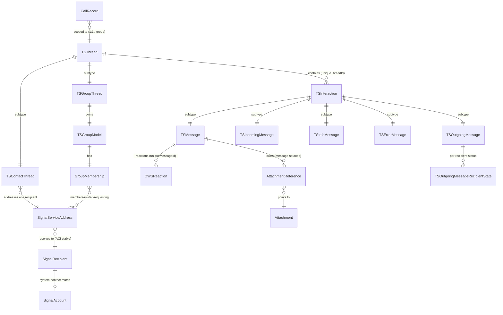
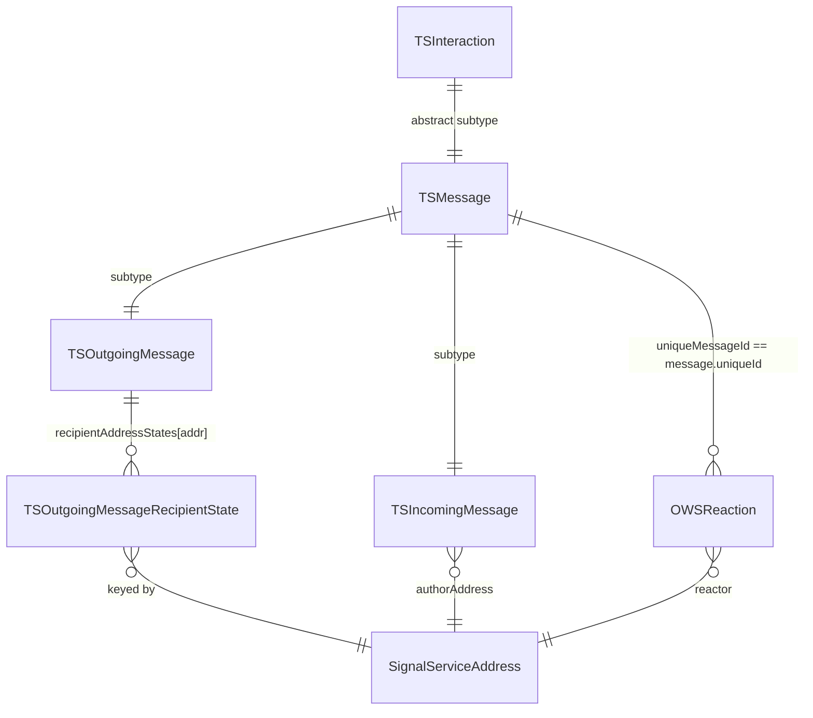
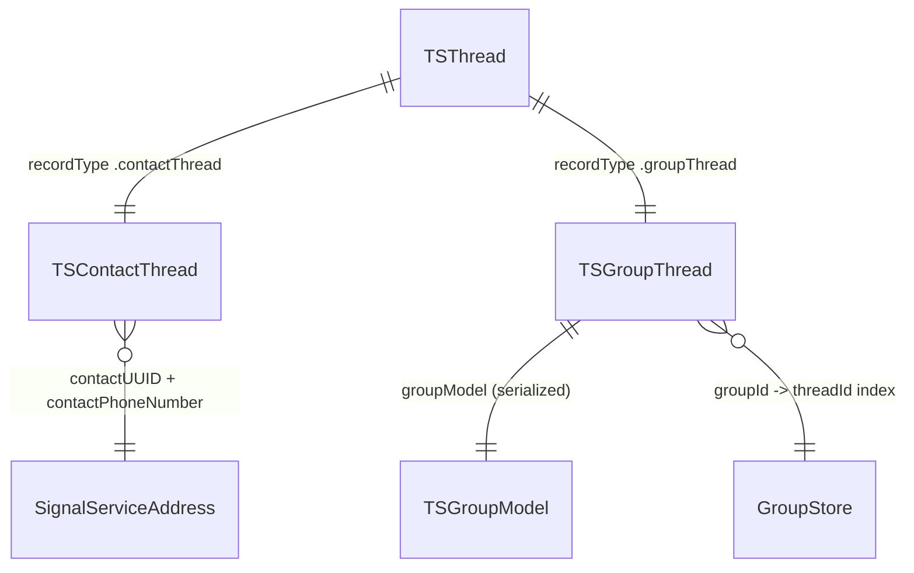
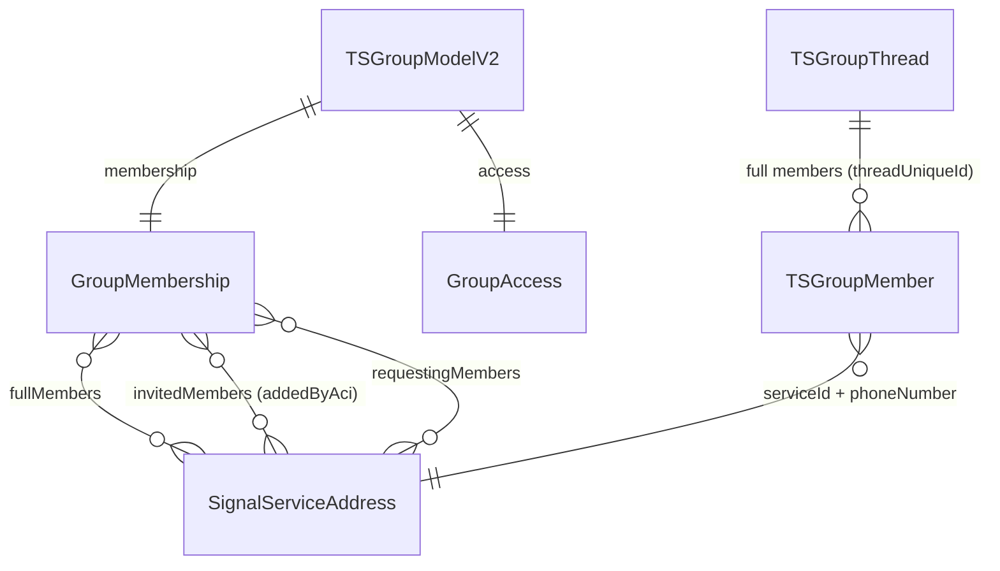
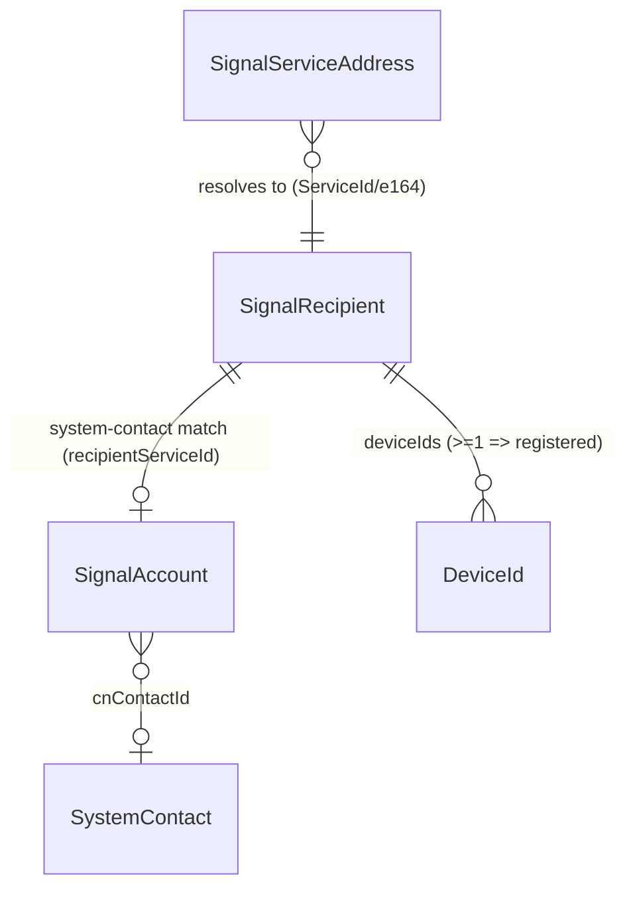
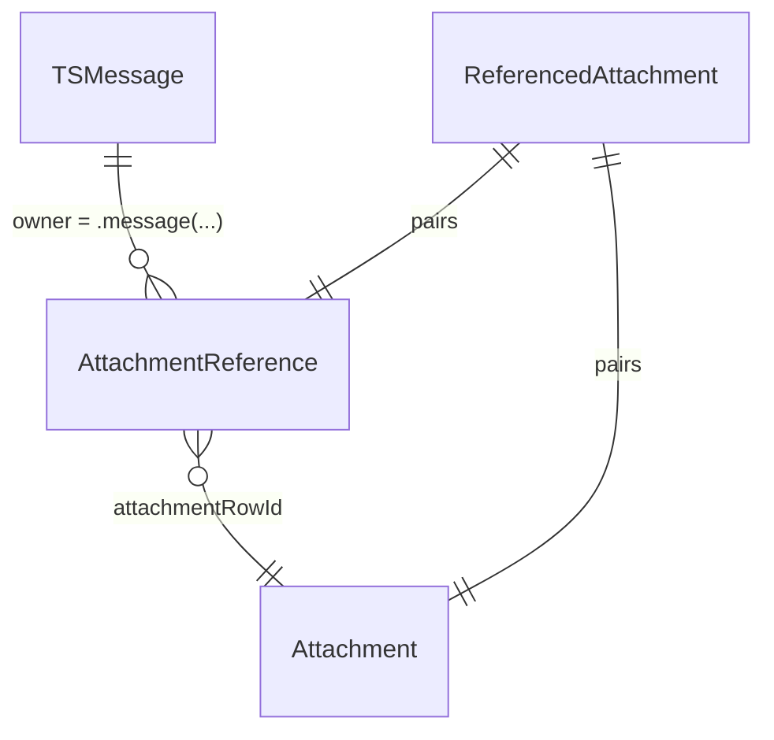
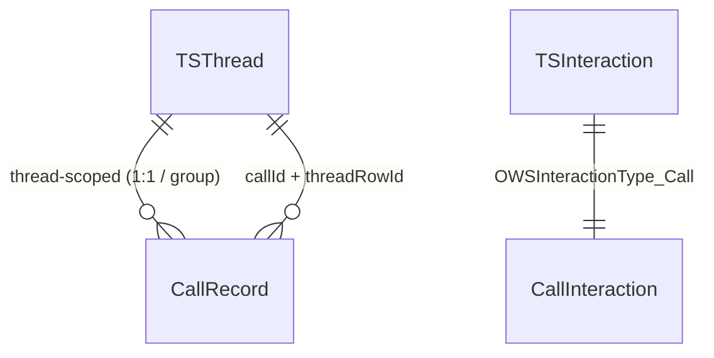

# Domain Model

A conceptual synthesis of Signal iOS's core domain: **messages/interactions**,
**threads** (conversations), **groups**, **contacts/recipients**, **attachments**,
and **calls** — and how they relate. This document explains *entities* and their
*relationships*. It is deliberately **not** a line-by-line restatement of each
file, and it does **not** re-document already-covered subsystems in depth; where a
subsystem has its own doc, this file cross-references it rather than duplicating it.

For file-level detail see:
- Attachments: [SignalServiceKit/Attachments/](SignalServiceKit/Attachments/) (esp.
  [V2-Model.md](SignalServiceKit/Attachments/V2-Model.md),
  [Store-and-Records.md](SignalServiceKit/Attachments/Store-and-Records.md)).
- Calls: [SignalServiceKit/Calls/](SignalServiceKit/Calls/) (esp.
  [README.md](SignalServiceKit/Calls/README.md),
  [call-records-and-sync.md](SignalServiceKit/Calls/call-records-and-sync.md)).
- Identity / recipients root material:
  [SignalServiceKit/Account/identity-and-registration.md](SignalServiceKit/Account/identity-and-registration.md).
- Disappearing messages:
  [SignalServiceKit/DisappearingMessages/README.md](SignalServiceKit/DisappearingMessages/README.md).
- Module/path classification: [INVENTORY.md](INVENTORY.md); directory map:
  [APPLICATION_MAP.md](APPLICATION_MAP.md); vocabulary: [GLOSSARY.md](GLOSSARY.md).

## Conventions

- **Citations** are `path:line` (or `path:line-range`). Line numbers reflect the
  tree at authoring time and may drift; relocate via the symbol name. **Any
  uncited claim is a defect.**
- **Confidence labels** on claims about *purpose/behavior*:
  - **HIGH** — directly read from the cited source in this session.
  - **MEDIUM** — inferred from strong local evidence (signatures, comments,
    naming, cross-file convention) without tracing every path.
  - **LOW** — plausible inference from naming alone.
- Where the source gives no evidence of design intent, the text says
  **"intent undetermined — no evidence in source."**

---

## 1. The big picture

At the center of the domain sits the **thread** (a conversation) and the
**interaction** (anything that appears in a conversation's timeline). Every
interaction belongs to exactly one thread, referenced by the thread's `uniqueId`
string, not by a foreign-key row id: `TSInteraction` persists `uniqueThreadId`
(`SignalServiceKit/Messages/Interactions/TSInteraction.h:95`) and resolves its
thread lazily via `thread(tx:)`
(`SignalServiceKit/Messages/Interactions/TSInteraction.h:131`). **HIGH**

Threads come in concrete subtypes keyed by `TSThreadType`
(`SignalServiceKit/Contacts/TSThread.swift:16-22`): `.contactThread` (1:1),
`.groupThread`, `.privateStoryThread`, and `.releaseNotesThread`, dispatched by
`TSThread.concreteType(forRecordType:)`
(`SignalServiceKit/Contacts/TSThread.swift:30-39`). **HIGH** A **contact thread**
points at a single recipient; a **group thread** owns a **group model**
describing the group and its membership.

Recipients (the people/accounts you talk to) are modeled by `SignalRecipient`,
whose stable identity is an **ACI**
(`SignalServiceKit/Contacts/SignalRecipient/SignalRecipient.swift:9-18`), and are
addressed throughout the codebase by the polymorphic `SignalServiceAddress`
(ServiceId and/or phone number)
(`SignalServiceKit/Contacts/SignalServiceAddress.swift:11-55`). **HIGH**

Messages (`TSMessage` and subclasses) are the dominant interaction type and
aggregate rich content: attachments, quotes, reactions, link previews, stickers,
contact shares, and mentions. Attachments are linked to messages indirectly via
the V2 `AttachmentReference` ownership edge (see §6). Calls appear in the timeline
too, via call-related interactions and the separate `CallRecord` persistence (see §7).

---

## 2. Interactions & messages

### 2.1 `TSInteraction` — the timeline base class

`TSInteraction` is the abstract base for everything that can appear in a
conversation (`SignalServiceKit/Messages/Interactions/TSInteraction.h:39`). Its
`OWSInteractionType` enumerates the kinds: incoming/outgoing message, error,
call, info, typing indicator, thread details, unread indicator, date header,
unknown-thread warning, disappearing-timer, collapse set, release notes
(`SignalServiceKit/Messages/Interactions/TSInteraction.h:12-26`). **HIGH**

Key shared fields (**HIGH**, read from the header):
- `uniqueThreadId` — the owning thread's `uniqueId`
  (`SignalServiceKit/Messages/Interactions/TSInteraction.h:95`).
- `sortId` — monotonic ordering within the conversation
  (`SignalServiceKit/Messages/Interactions/TSInteraction.h:97`).
- `timestamp` — a generic client timestamp; for incoming messages derived from
  the sender's `Envelope.timestamp`, but may be a local "now" for other kinds
  (`SignalServiceKit/Messages/Interactions/TSInteraction.h:99-116`).
- `receivedAtTimestamp` — always locally generated "when we received it"
  (`SignalServiceKit/Messages/Interactions/TSInteraction.h:118-131`).

Timestamps are "almost always immutable"; the documented exception is placeholder
interactions, whose timestamp is decremented on failure so a placeholder error
message and its would-be replacement can coexist
(`SignalServiceKit/Messages/Interactions/TSInteraction.h:168-182`). **HIGH**

"Dynamic" interactions (block offers, unseen-message indicators, etc.) are
view-driven and are neither messages nor static events
(`SignalServiceKit/Messages/Interactions/TSInteraction.h:143-148`). **HIGH**

> The non-message interaction subclasses are large in number — `TSInfoMessage`
> and its many extensions (group updates, profile changes, payments, polls,
> pinned messages, thread merge, session switchover), `TSErrorMessage`,
> `OWSVerificationStateChangeMessage`, `TSUnreadIndicatorInteraction`,
> `TSReleaseNotesMessage` — all present under
> `SignalServiceKit/Messages/Interactions/` (directory listed this session). **HIGH**
> This document focuses on the message types; the info/error families are a
> conceptual sibling branch of `TSInteraction` and are not re-documented in depth
> here.

### 2.2 `TSMessage` — the rich message base

`TSMessage : TSInteraction` is the abstract message class
(`SignalServiceKit/Messages/Interactions/TSMessage.h:21-93`). It carries the
renderable payload shared by incoming and outgoing messages (**HIGH**):
- `body` + `bodyRanges` (styles/mentions)
  (`SignalServiceKit/Messages/Interactions/TSMessage.h:96-97`).
- Per-conversation disappearing-message fields: `expiresInSeconds`,
  `expireStartedAt`, `expiresAt`, `expireTimerVersion`
  (`SignalServiceKit/Messages/Interactions/TSMessage.h:100-120`). See
  [DisappearingMessages/README.md](SignalServiceKit/DisappearingMessages/README.md).
- Attached content as embedded value objects: `quotedMessage`, `contactShare`,
  `linkPreview`, `messageSticker`, `giftBadge`
  (`SignalServiceKit/Messages/Interactions/TSMessage.h:122-126`).
- `editState` for edit history (`TSEditState` enum)
  (`SignalServiceKit/Messages/Interactions/TSMessage.h:30-85`,
  `:128-130`). **HIGH**
- View-once / remote-delete flags: `isViewOnceMessage`, `isViewOnceComplete`,
  `wasRemotelyDeleted` (`SignalServiceKit/Messages/Interactions/TSMessage.h:132-134`).
- Story-reply context (`storyTimestamp`, `storyAuthorAci`, `isStoryReply`,
  `isGroupStoryReply`) (`SignalServiceKit/Messages/Interactions/TSMessage.h:149-162`).
- `isPoll` (`SignalServiceKit/Messages/Interactions/TSMessage.h:165`). **HIGH**

Note `deprecated_attachmentIds` (`SignalServiceKit/Messages/Interactions/TSMessage.h:88`)
is explicitly "DO NOT USE" — attachments are now linked through the V2
`AttachmentReference` table, not an id array on the message (see §6). **HIGH**

### 2.3 `TSOutgoingMessage` — a message we send

`TSOutgoingMessage : TSMessage`
(`SignalServiceKit/Messages/Interactions/TSOutgoingMessage.h:59`). Its defining
relationship is **per-recipient send state**: a dictionary
`recipientAddressStates: [SignalServiceAddress: TSOutgoingMessageRecipientState]`
(`SignalServiceKit/Messages/Interactions/TSOutgoingMessage.h:197-199`). **HIGH**
The aggregate `messageState` is derived
(`SignalServiceKit/Messages/Interactions/TSOutgoingMessage.h:195`) from the
`TSOutgoingMessageState` enum (`sending`/`failed`/`sent`/`pending`, plus obsolete
cases) (`SignalServiceKit/Messages/Interactions/TSOutgoingMessage.h:22-37`). **HIGH**

Each `TSOutgoingMessageRecipientState` holds a per-recipient `status`
(`OWSOutgoingMessageRecipientStatus`), a `statusTimestamp`, a `wasSentByUD`
sealed-sender flag, and an optional `errorCode`
(`SignalServiceKit/Messages/Interactions/TSOutgoingMessageRecipientState.swift:8-45`).
Status progression is monotonic via `priorityValue` — `updateStatusIfPossible`
ignores any update that would move backwards (e.g. from `delivered` back to
`sent`)
(`SignalServiceKit/Messages/Interactions/TSOutgoingMessageRecipientState.swift:78-88`,
`:225-242`). The status cases are
`failed/sending/skipped/sent/delivered/read/viewed/pending`
(`SignalServiceKit/Messages/Interactions/TSOutgoingMessageRecipientState.swift:193-223`). **HIGH**

> This is the core modeling device for fan-out: a single outgoing message row
> tracks independent delivery/read/view state for every recipient, which is how
> group sends and read receipts coexist on one timeline row. **HIGH** (derived
> from the per-recipient dictionary + monotonic status above.)

An outgoing message designated-initializer can compute `recipientAddressStates`
on the fly from the thread's intended recipients, which is why it requires a
transaction
(`SignalServiceKit/Messages/Interactions/TSOutgoingMessage.h:116-137`). **HIGH**

### 2.4 `TSIncomingMessage` — a message we received

`TSIncomingMessage : TSMessage` conforms to `OWSReadTracking`
(`SignalServiceKit/Messages/Interactions/TSIncomingMessage.h:16`). Its defining
fields identify the **author** and the server-side provenance (**HIGH**):
- `authorAddress` / `authorPhoneNumber` / `authorUUID`
  (`SignalServiceKit/Messages/Interactions/TSIncomingMessage.h:189-191`) — the
  sending recipient. In a group thread this is the specific member who sent it;
  in a contact thread it is the single counterpart.
- `serverTimestamp` (sender upload time), `serverDeliveryTimestamp` (when we
  popped it off the queue), `serverGuid`
  (`SignalServiceKit/Messages/Interactions/TSIncomingMessage.h:18-32`).
- `wasReceivedByUD` (sealed sender)
  (`SignalServiceKit/Messages/Interactions/TSIncomingMessage.h:34`).
- Read/viewed tracking: `read` column semantics (interacting with `TSEditState`,
  see the long note in `TSMessage.h`) and `viewed`/`markAsViewedAtTimestamp(...)`
  (`SignalServiceKit/Messages/Interactions/TSIncomingMessage.h:193-200`). **HIGH**

### 2.5 Reactions — `OWSReaction`

Reactions are a **separate table** related to a message by the message's
`uniqueId`, not embedded on the message row. `OWSReaction` stores
`uniqueMessageId`, `emoji`, the reactor (`reactorAci` / `reactorPhoneNumber`),
`sentAtTimestamp`, and a `read` flag
(`SignalServiceKit/Messages/Reactions/OWSReaction.swift:10-56`). **HIGH** The
reactor is reconstructed into a `SignalServiceAddress`
(`SignalServiceKit/Messages/Reactions/OWSReaction.swift:37-39`). A message
retrieves a reactor's reaction via `TSMessage.reaction(for:tx:)`, which delegates
to a `ReactionFinder`
(`SignalServiceKit/Messages/Interactions/TSMessage.swift:159-161`); the store/finder
query by `uniqueMessageId`
(`SignalServiceKit/Messages/Reactions/ReactionStore.swift:46-55`,
`SignalServiceKit/Messages/Reactions/ReactionFinder.swift:21`,`:63`). **HIGH**

---

## 3. Threads (conversations)

`TSThread` is the base conversation entity (`SDSCodableModel`, table
`model_TSThread`) (`SignalServiceKit/Contacts/TSThread.swift:25-27`). **HIGH**
(Note: the base class lives under `Contacts/`, while the concrete subtypes live
under `Threads/` — directory listings this session.) Shared thread state includes
`uniqueId`, `isArchived`, `isMarkedUnread`, `lastInteractionRowId`,
`messageDraft` + `messageDraftBodyRanges`, mute/notify preferences,
`shouldThreadBeVisible`, `storyViewMode`, and draft-ordering fields
(`SignalServiceKit/Contacts/TSThread.swift:41-73`). **HIGH**

The relationship from thread to interactions is **by `uniqueId`**: the thread's
`uniqueId` is written into each interaction's `uniqueThreadId`
(see §1; `ThreadStore.fetchThread(for interaction:)` resolves it via
`interaction.uniqueThreadId`,
`SignalServiceKit/Threads/ThreadStore.swift:114`). **HIGH**

### 3.1 `TSContactThread` — 1:1 conversations

A contact thread stores the counterpart's identity as `contactUUID` (an uppercase
ServiceId string — the name is historical and "may not contain a valid UUID
string") and `contactPhoneNumber`
(`SignalServiceKit/Threads/TSContactThread.swift:8-16`). **HIGH** It can resolve
back to a `SignalServiceAddress` via
`TSContactThread.contactAddress(fromThreadId:transaction:)`
(`SignalServiceKit/Threads/TSContactThread.swift:165`). **HIGH** So a contact
thread's relationship to a recipient is address-valued, resolved against the
recipient store at use-time.

### 3.2 `TSGroupThread` — group conversations

A group thread **owns a `TSGroupModel`** value object (serialized with the thread
row via legacy SDS archiving)
(`SignalServiceKit/Threads/TSGroupThread.swift:17-35`). **HIGH** The thread's
`groupId` is just the model's group id
(`SignalServiceKit/Threads/TSGroupThread+OWS.swift:10`), and group threads use a
`"g"` unique-id prefix
(`SignalServiceKit/Threads/TSGroupThread+OWS.swift:19`). **HIGH** Lookups go by
group id: `TSGroupThread.fetchThread(forGroupId:tx:)` and `forGroupIdData:`
(`SignalServiceKit/Threads/TSGroupThread.swift:242-251`); a `GroupIdentifier` can
be derived from the raw `groupId`
(`SignalServiceKit/Threads/TSGroupThread.swift:234-238`). **HIGH**

> The thread↔group-id mapping is persisted in a `GroupStore`/`GroupRecord` index
> (`GroupStore().fetchThreadId(forGroupIdData:tx:)`,
> `SignalServiceKit/Threads/TSGroupThread+OWS.swift:25-30`;
> `ThreadStore.fetchThread(forGroupId:tx:)`,
> `SignalServiceKit/Threads/ThreadStore.swift:76`). **HIGH**

Other subtypes (`TSPrivateStoryThread`, `TSReleaseNotesThread`) exist under
`SignalServiceKit/Threads/` (directory listed this session) and are conceptual
siblings; they are out of scope for this synthesis. **HIGH** (existence),
intent beyond the type name — undetermined — no evidence in source read here.

---

## 4. Groups

### 4.1 `TSGroupModel` / `TSGroupModelV2`

`TSGroupModel` is an `NSSecureCoding` value object (not an SDS row of its own; it
is embedded in the group thread). It holds `groupMembers` (addresses, including
admins), `groupName`, `groupId`, `addedByAddress`, avatar data, `groupsVersion`,
and a `groupMembership`
(`SignalServiceKit/Groups/TSGroupModel.h:28-55`). **HIGH** `GroupsVersion` is
`V1`/`V2` (`SignalServiceKit/Groups/TSGroupModel.h:18-21`); the V2 group id length
is 32 bytes (`SignalServiceKit/Groups/TSGroupModel.m:27`). **HIGH**

`TSGroupModelV2` extends the base with the V2 server contract: `membership`
(a `GroupMembership`), `access` (a `GroupAccess`), `secretParamsData`, `revision`,
`avatarUrlPath`, `inviteLinkPassword`, `isAnnouncementsOnly`,
`isJoinRequestPlaceholder`, and migration flags
(`SignalServiceKit/Groups/TSGroupModel.swift:11-26`, `:115-124`). **HIGH** The
class comment warns it is tightly coupled to `TSGroupModelBuilder`
(`SignalServiceKit/Groups/TSGroupModel.h:23-26`). **HIGH**

### 4.2 `GroupMembership` — the membership relation

`GroupMembership` is the heart of the group↔recipient relationship. Internally
each member maps to a private `GroupMemberState`
(`SignalServiceKit/Groups/GroupMembership.swift:9-19`) that is one of:
- `.fullMember(role, didJoinFromInviteLink, didJoinFromAcceptedJoinRequest)`
- `.invited(role, addedByAci)`
- `.requesting`

(`SignalServiceKit/Groups/GroupMembership.swift:11-19`). **HIGH** `role` is a
`TSGroupMemberRole` (`normal`/`administrator`, via
`isAdministrator`/`.administrator`)
(`SignalServiceKit/Groups/GroupMembership.swift:31-33`, `:21-29`). **HIGH**

Public accessors expose the three membership partitions as address sets —
`fullMembers`, `invitedMembers`, `requestingMembers`, plus
`fullMemberAdministrators` and per-address predicates like `isFullMember(_:)`
(`SignalServiceKit/Groups/GroupMembership.swift:462-492`, `:526`, `:561`). **HIGH**

### 4.3 `TSGroupMember` — the queryable full-member row

Distinct from the embedded `GroupMembership`, `TSGroupMember` is a persisted SDS
row (`model_TSGroupMember`) representing **only full members** of a group, keyed
by `(serviceId, phoneNumber, threadUniqueId)` with a `lastInteractionTimestamp`
(`SignalServiceKit/Groups/TSGroupMember.swift:28-60`). **HIGH** The doc-comment is
explicit that invited and requesting members are *not* represented here, and that
V2 full members are identified by ACI while legacy V1 phone-number members may
carry a PNI
(`SignalServiceKit/Groups/TSGroupMember.swift:8-27`). **HIGH**

> So "membership" exists in two forms: the authoritative embedded
> `GroupMembership` (all three partitions, serialized inside the group model) and
> the denormalized `TSGroupMember` table (full members only, for efficient
> queries such as recency ordering). This is a modeling tradeoff — intent of the
> denormalization beyond "queryability" is **undetermined — no evidence in source**
> read here. **HIGH** for the dual representation; the reason is inference.

> The V2 group *protocol* machinery (`GroupsV2Impl`, `GroupManager`,
> `GroupV2UpdatesImpl`, incoming/outgoing changes, send endorsements) lives in
> `SignalServiceKit/Groups/` (directory listed this session) and is the behavioral
> layer that mutates these entities. **HIGH** (existence). This document models
> the *entities*; the change-protocol flow is intentionally not expanded here.

---

## 5. Contacts & recipients

This area has multiple overlapping identity entities. Conceptually:

- **`SignalServiceAddress`** — the *addressing* abstraction used everywhere: an
  optional `ServiceId` (ACI or PNI) and/or a phone number
  (`SignalServiceKit/Contacts/SignalServiceAddress.swift:11-55`). The `serviceId`
  is optional because old recipients or "find-by-phone-number" windows may only
  have an e164 (`SignalServiceKit/Contacts/SignalServiceAddress.swift:25-37`).
  **HIGH** It is a *value/handle*, not the stored source of truth.

- **`SignalRecipient`** — the *source-of-truth account record* (`model_SignalRecipient`).
  Its stable identity is an ACI that never changes once assigned; phone number and
  PNI may change over time
  (`SignalServiceKit/Contacts/SignalRecipient/SignalRecipient.swift:9-18`,
  `:46-60`). It stores `aciString`, `pni`, `phoneNumber` (with an `isDiscoverable`
  flag), and `deviceIds`; **an account is "registered" iff it has at least one
  device** (`SignalServiceKit/Contacts/SignalRecipient/SignalRecipient.swift:14-16`,
  `:33-62`). Its `address` normalizes stored identifiers into a
  `SignalServiceAddress`, deliberately not revealing redundant identifiers
  (`SignalServiceKit/Contacts/SignalRecipient/SignalRecipient.swift:70-85`). **HIGH**

- **`SignalAccount`** — the join between a `SignalRecipient` and a **system
  (device) address-book contact** (`model_SignalAccount`). It carries the
  recipient key (`recipientServiceId` / `recipientPhoneNumber`), the system
  contact id (`cnContactId`), display-name parts, and a multi-account label;
  `isFromLocalAddressBook` is true exactly when `cnContactId != nil`
  (`SignalServiceKit/Contacts/SignalAccount.swift:9-41`). **HIGH**

So the chain is: an interaction/thread holds an **address** →
the address resolves to a **recipient** (keyed by ACI) → the recipient may be
matched to a **system contact** via a `SignalAccount`.

Supporting entities in `SignalServiceKit/Contacts/` (directory listed this
session) include `E164`, `PhoneNumber`, `ProfileName`/`DisplayName`,
`UserProfile*`, nickname records, contact discovery (`Discovery/`), and the
various mergers (`RecipientMerger`, `ThreadMerger`, `UserProfileMerger`,
`SignalAccountMergeObserver`) that reconcile identities when a phone number moves
between accounts. **HIGH** (existence) The merge *algorithms* are a behavioral
subsystem and are not expanded here; the relevant stable-identity rules (ACI is
immutable; phone/PNI mutable) are stated above from
`SignalRecipient.swift:9-18`. **HIGH**

> Identity roots (ACI/PNI/E164, `LocalIdentifiers`, device ids) are documented in
> depth in
> [Account/identity-and-registration.md](SignalServiceKit/Account/identity-and-registration.md);
> this section only models the *recipient/contact* entities and their links.

---

## 6. Attachments

Attachments are **not** embedded in the message row (the old `attachmentIds`
array is deprecated — see §2.2). Instead the V2 model separates the **file**
(`Attachment`) from the **ownership edge** (`AttachmentReference`): a
`ReferencedAttachment` pairs them. A single `Attachment` may thus be referenced by
multiple owners. **HIGH** (This mirrors the detailed treatment in
[Attachments/V2-Model.md](SignalServiceKit/Attachments/V2-Model.md), which is the
authoritative source; summarized here only for its relationship to messages.)

The ownership edge's `Owner.ID` enumerates the message-scoped attachment roles —
`messageBodyAttachment`, `messageOversizeText`, `messageLinkPreview`,
`quotedReplyAttachment` (whose row id is the *containing* message), `messageSticker`,
`messageContactAvatar` — alongside story- and thread-scoped roles
(see [Attachments/V2-Model.md § AttachmentReference.Owner](SignalServiceKit/Attachments/V2-Model.md),
citing `AttachmentReference+Owner.swift:14-37`). **HIGH** (verified this session:
the `Owner` enum and its `Owner.ID` message-scoped cases were read directly.)

Thus a message relates to its media *through* attachment references keyed by the
message's row/owner, which is how one message can own body media, a link-preview
image, a sticker, a quoted-reply thumbnail, and a contact avatar simultaneously.
Quotes themselves are the embedded `TSQuotedMessage` value object on `TSMessage`
(`SignalServiceKit/Messages/Interactions/TSMessage.h:122`), with their attachment
bytes represented via the quoted-reply attachment reference. **HIGH**

> Attachment lifecycle (upload, download, content validation, backup tiers,
> orphan GC, stores/records) is covered in the
> [Attachments/](SignalServiceKit/Attachments/) docs and is **not** repeated here.

---

## 7. Calls

Calls relate to the domain in two ways:

1. **As interactions.** `OWSInteractionType_Call` is a first-class interaction
   type (`SignalServiceKit/Messages/Interactions/TSInteraction.h:17`), so a call
   event can appear in a conversation timeline like any other interaction. **HIGH**

2. **As `CallRecord` persistence.** The calling subsystem maintains its own
   `CallRecord`/`DeletedCallRecord` tables, scoped to a thread (1:1 or group) and
   feeding the Calls Tab and call-event/call-log sync, as documented in
   [Calls/call-records-and-sync.md](SignalServiceKit/Calls/call-records-and-sync.md)
   and [Calls/README.md](SignalServiceKit/Calls/README.md). **HIGH** (cross-referenced.)

Call *signalling/media* (RingRTC, SFU, CallKit, group-call peeking, call links)
is an integration/behavioral layer, fully covered under
[Calls/](SignalServiceKit/Calls/). This document only records the two
*relationships* above: calls as timeline interactions, and call records as
thread-scoped domain rows.

> The `CallRecord` field/relationship detail (status model, callId, direction,
> group vs. ad-hoc) is intentionally deferred to
> [Calls/call-records-and-sync.md](SignalServiceKit/Calls/call-records-and-sync.md);
> re-stating it here would duplicate an already-covered subsystem.

---

## 8. Cross-cutting relationships (summary)

- **Thread ↔ Interaction**: 1-to-many, by `uniqueThreadId` string, not FK row id
  (`TSInteraction.h:95`, `:131`; `ThreadStore.swift:114`). **HIGH**
- **Contact thread ↔ Recipient**: by address (`contactUUID` + `contactPhoneNumber`)
  resolved at use-time (`TSContactThread.swift:8-16`, `:165`). **HIGH**
- **Group thread ↔ Group model**: 1-to-1, model serialized into the thread
  (`TSGroupThread.swift:17-35`). **HIGH**
- **Group model ↔ Membership**: embedded `GroupMembership` with full/invited/
  requesting partitions (`TSGroupModel.swift:115`, `GroupMembership.swift:11-19`,
  `:462-561`); full members also denormalized to `TSGroupMember`
  (`TSGroupMember.swift:28-60`). **HIGH**
- **Membership/author/recipient ↔ Identity**: everything is addressed by
  `SignalServiceAddress`, resolving to the ACI-stable `SignalRecipient`
  (`SignalServiceAddress.swift:11-55`; `SignalRecipient.swift:9-18`). **HIGH**
- **Outgoing message ↔ Recipients**: per-recipient monotonic send state map
  (`TSOutgoingMessage.h:197-199`; `TSOutgoingMessageRecipientState.swift:78-88`).
  **HIGH**
- **Message ↔ Reactions**: separate `OWSReaction` rows keyed by `uniqueMessageId`
  (`OWSReaction.swift:10-56`; `TSMessage.swift:159-161`). **HIGH**
- **Message ↔ Attachments**: via V2 `AttachmentReference` ownership edges, not an
  id array (`TSMessage.h:88`; cross-ref V2-Model.md). **HIGH**
- **Thread ↔ Calls**: calls as `OWSInteractionType_Call` interactions and as
  thread-scoped `CallRecord`s (`TSInteraction.h:17`; cross-ref Calls docs). **HIGH**

### Confidence posture

Every entity relationship above was read directly from the cited source in this
session and is labeled **HIGH**, except: the *reason* for the dual
`GroupMembership`/`TSGroupMember` representation (§4.3) and the design intent of
the non-contact thread subtypes (§3.2), which are marked **undetermined — no
evidence in source**. Attachment- and call-internal detail is cross-referenced to
their dedicated docs rather than re-derived, consistent with this document's
synthesis scope.
