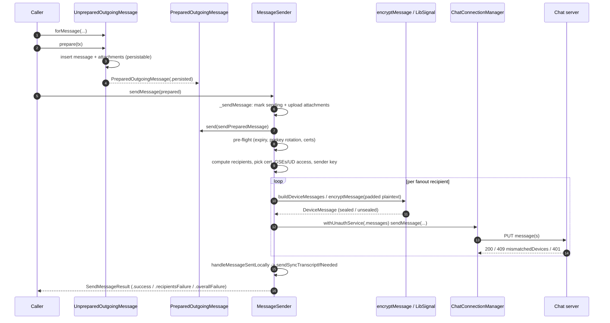
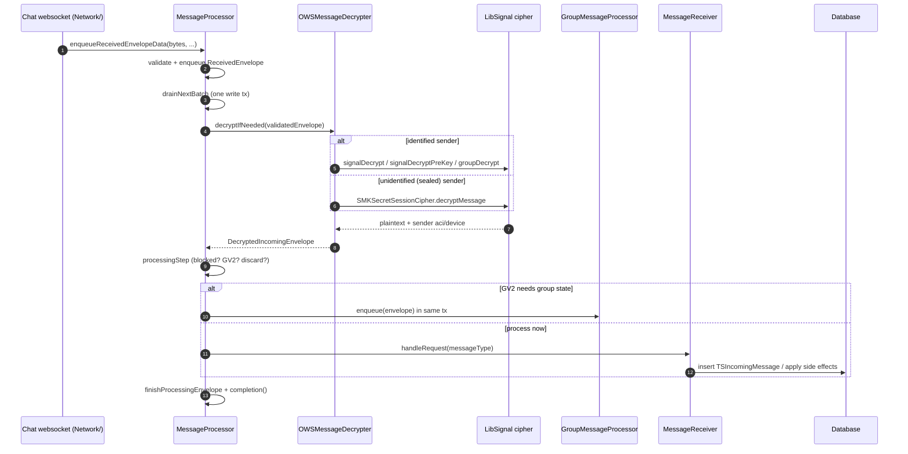
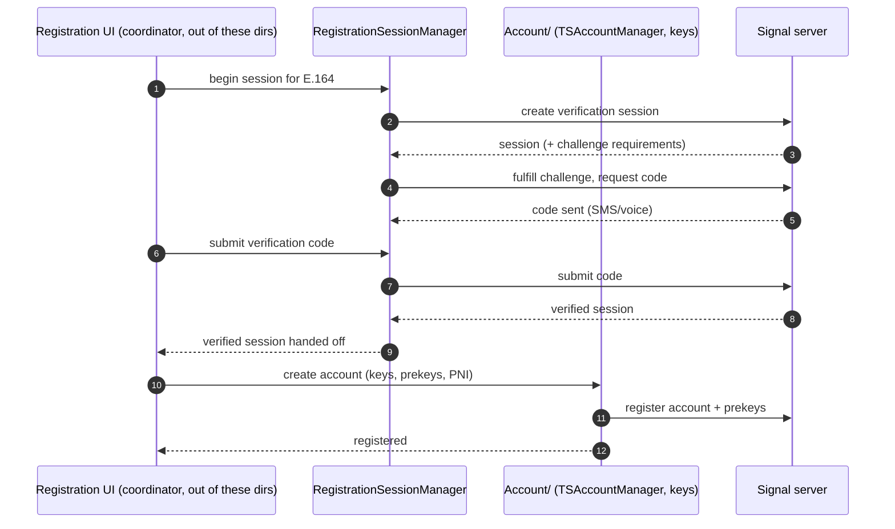
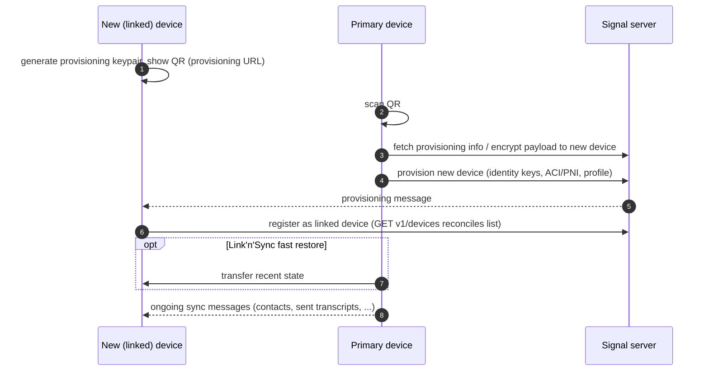
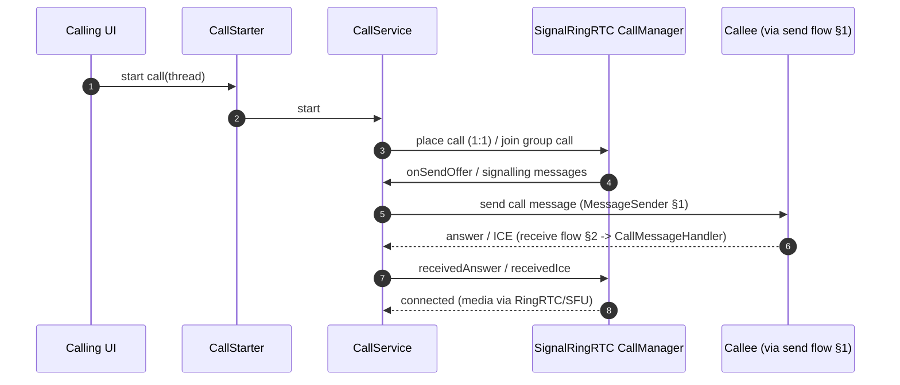
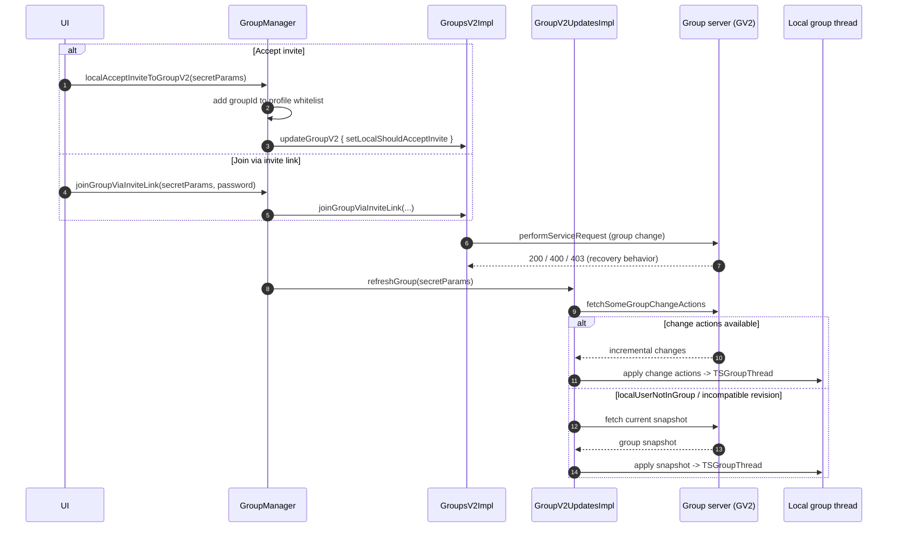

# Critical End-to-End Flows

This document narrates the **critical end-to-end flows** of Signal iOS as prose
plus Mermaid sequence diagrams. It is a *flow-oriented* companion to the
module-oriented docs under `docs/SignalServiceKit/`: where those docs describe
what each file/type *is*, this document describes what happens *in order* when a
user performs a key action.

Six flows are covered:

| Flow | Primary first-party code | Documented here |
| --- | --- | --- |
| [1. Send a message](#1-send-a-message) | `MessageSender.swift`, `OutgoingMessagePreparer/`, `PreparedOutgoingMessage.swift` | In depth |
| [2. Receive & decrypt a message](#2-receive--decrypt-a-message) | `MessageProcessor.swift`, `MessageReceiver.swift`, `OWSMessageDecrypter.swift` | In depth |
| [3. Register](#3-register) | `SignalServiceKit/Registration/`, `Account/` | Summary + cross-link |
| [4. Link a device](#4-link-a-device) | `SignalServiceKit/Devices/` | Summary + cross-link |
| [5. Start a call](#5-start-a-call) | `SignalServiceKit/Calls/` | Summary + cross-link |
| [6. Join a group](#6-join-a-group) | `GroupManager.swift`, `GroupV2UpdatesImpl.swift` | In depth |

> **Confidence labels.** Every documented claim carries a confidence label:
> **[High]** = directly read from the cited source at the stated lines;
> **[Medium]** = inferred from strong local evidence (naming, call sites,
> comments) but not every branch was traced, or depends on an out-of-tree
> collaborator (LibSignalClient, SignalRingRTC, the chat server); **[Low]** =
> plausible inference not fully verified. Citations use `path:line` ranges from
> the state of the tree at the time of writing; **line numbers may drift** as the
> code changes. An uncited factual claim in this document is a **defect**. Where
> the code does not reveal *why* something is done, this document says so rather
> than guessing: look for "**intent undetermined — no evidence in source**".

> **Scope boundary.** The Signal Protocol session ratchet, the Sealed Sender /
> `UnidentifiedSenderMessageContent` encryption, the Sender Key symmetric ratchet,
> and the group-change-action zero-knowledge crypto all live in **LibSignalClient**
> (out of tree). This document traces the first-party Swift that *calls into* those
> primitives; the primitives themselves are only summarized. See
> [`Cryptography/sessions-and-ratchet.md`](SignalServiceKit/Cryptography/sessions-and-ratchet.md),
> [`Cryptography/sealed-sender.md`](SignalServiceKit/Cryptography/sealed-sender.md),
> and [`Cryptography/prekeys.md`](SignalServiceKit/Cryptography/prekeys.md).

---

## 1. Send a message

A send proceeds through three conceptual stages:

1. **Prepare** — turn an in-memory `TSOutgoingMessage` into a
   `PreparedOutgoingMessage` by inserting it (and its attachments) into the
   database.
2. **Send** — enqueue uploads, build/encrypt per-device ciphertexts, and submit
   them to the chat server (via Sealed Sender, Sender Key, or an unsealed
   fanout).
3. **Finalize** — on success, send ourselves a sync transcript and update local
   send state.

### 1.1 Prepare: `UnpreparedOutgoingMessage` → `PreparedOutgoingMessage`

Callers first build an `UnpreparedOutgoingMessage`, which "hasn't been inserted,
its attachments haven't been inserted, nothing"
(`OutgoingMessagePreparer/UnpreparedOutgoingMessage.swift:8-14`). **[High]** The
factory `forMessage(_:body:…)` splits transient messages (not saved to the
Interactions table) from persistable ones: a message that is a
`TransientOutgoingMessage` goes down the `.transient` path, otherwise it must
have `shouldBeSaved == true` and becomes `.persistable`
(`UnpreparedOutgoingMessage.swift:17-61`). **[High]** Sibling factories exist for
edit messages (`forEditMessage`, `:63-77`) and story messages
(`forOutgoingStoryMessage`, `:79-88`). **[High]**

`prepare(tx:)` dispatches on the message type
(`UnpreparedOutgoingMessage.swift:91-96`, `:197-220`). **[High]** The persistable
path (`preparePersistableMessage`, `:242-410`) is the substantive one: **[High]**

- It resolves the message's `thread` (throwing `OWSAssertionError` if missing)
  (`:255-260`). **[High]**
- It validates and attaches the **link preview**, **quoted reply**, **sticker**,
  and **contact share** drafts, calling `message.update(with:…)` for each
  (`:262-291`). **[High]**
- It inserts the message row (`message.message.anyInsert(transaction: tx)`), then
  reads back the assigned `sqliteRowId`, throwing if the insert failed
  (`:297-302`). **[High]**
- It then creates attachment streams for oversize body text, body media, link
  preview image, quoted-reply thumbnail, sticker, and contact avatar — each via
  `attachmentManager.createAttachmentStream(from:…)` with an owner that references
  `messageRowId` (`:311-404`). **[High]**
- It returns `.persisted(…)` carrying the `rowId` and the message
  (`:406-409`). **[High]**

The result is a `PreparedOutgoingMessage` — "a TSOutgoingMessage that is already
inserted to the database … and has had any attachments created and inserted"
(`OutgoingMessagePreparer/PreparedOutgoingMessage.swift:7-13`). **[High]** Its
`messageForSending` accessor is deliberately `private` to prevent callers abusing
the many `TSMessage` fields (`PreparedOutgoingMessage.swift:308-322`). **[High]**
`PreparedOutgoingMessage` also exposes `attachmentIdsForUpload(tx:)`
(`:155-200`), `attachmentUploadOperations(tx:)` which wrap each id in an
`attachmentUploadManager.uploadTransitTierAttachment` closure (`:243-250`), and a
`send(_:)` method that simply hands `messageForSending` to a supplied async
closure (`:235-237`). **[High]**

> There are also `preprepared(…)` constructors used for resends, story messages,
> and transient messages that skip insertion/attachment prep because they need no
> preparing (`PreparedOutgoingMessage.swift:17-71`). **[High]** A prepared message
> can be serialized to / restored from a `MessageSenderJobRecord` for durable
> sending (`restore(from:tx:)` `:76-110`; `asMessageSenderJobRecord(…)`
> `:289-305`). **[High]**

### 1.2 Send: `MessageSender.sendMessage(_:)`

`MessageSenderImpl.sendMessage(_ preparedOutgoingMessage:)` is the public async
entry point; it returns a `SendMessageResult`
(`MessageSender.swift:378`). **[High]** It logs, calls the private
`_sendMessage`, and maps thrown errors to `.overallFailure` or per-recipient
failures to `.recipientsFailure` (`MessageSender.swift:378-391`). **[High]**

`_sendMessage` (`MessageSender.swift:394-411`): **[High]**

1. Marks all unsent recipients as "sending" in a write transaction
   (`:395-397`). **[High]**
2. Runs the attachment **upload operations** concurrently in a throwing task
   group, each gated through `Upload.uploadQueue` (`:399-409`). **[High]**
3. Calls `preparedOutgoingMessage.send(self.sendPreparedMessage(_:))` — i.e.
   unwraps the private `messageForSending` and passes it to `sendPreparedMessage`
   (`:410`; closure definition `PreparedOutgoingMessage.swift:235-237`). **[High]**

`sendPreparedMessage(_ message:)` (`MessageSender.swift:578-658`) performs
pre-flight checks and orchestration: **[High]**

- Throws `AppExpiredError` if the app build has expired, and confirms
  registration state (`:579-583`). **[High]**
- For a persisted (non-transient) outgoing message, it re-fetches the latest copy
  and throws `MessageDeletedBeforeSentError` if it was deleted or remotely deleted
  (`:584-592`). **[High]**
- Awaits any needed **pre-key rotation** via `waitForPreKeyRotationIfNeeded()`,
  which loops while `preKeyManager.isAppLockedDueToPreKeyUpdateFailures` holds and
  rotates signed pre-keys (`:594`, `:414-447`). **[High]**
- Fetches **sender certificates** from `udManager.fetchSenderCertificates()` and
  the local device id (`:595-600`). **[High]**
- Calls the recursive `sendPreparedMessage(_:recoveryState:senderCertificates:…)`
  (`:602-609`). **[High]**
- Afterwards, if the send succeeded (overall, or to any recipient) it calls
  `handleMessageSentLocally(…)` to send the sync transcript; it then returns the
  failure, if any (`:611-657`). **[High]**

The recursive core (`sendPreparedMessage(_:recoveryState:…)`,
`MessageSender.swift:699-908`) computes, inside a single write transaction, a
`SendMessageNextAction` and then acts on it: **[High]**

- Resolves the thread; throws `MessageSenderError.threadMissing` if absent
  (`:707-709`). **[High]**
- `checkIfCanSendMessage(_:toThread:)` rejects GV1 threads, non-member GV2 sends,
  terminated groups, and announcement-only groups when we're not an admin (unless
  the message is a reaction/poll-vote/delete)
  (`:711`, `:900-931`). **[High]**
- `unsentRecipients(of:in:…)` computes the recipient set: for a group thread it is
  the intersection of the message's "sending" recipients with the *current*
  full/invited members, minus self and blocked addresses; for a 1:1 thread it is
  the contact (throwing `blockedContactRecipient` if blocked); sync messages go to
  our own ACI (`:713`, `:465-570`). **[High]**
- Phone-number-only recipients trigger `.lookUpPhoneNumbersAndTryAgain` (a CDS
  lookup, then retry) on the first pass (`:720-726`, `:571-576`). **[High]**
- The **Note to Self** special case short-circuits with `.skipSend` for most
  message types (regular data messages are sent only via their sync transcript)
  (`:731-742`). **[High]**
- `buildAndRecordMessage(_:in:tx:)` serializes the plaintext via
  `message.buildPlaintextData(inThread:tx:)` and records it in the **Message Send
  Log** (`:749`, `:1311-1319`). **[High]**
- A **sender certificate** is chosen based on phone-number-sharing mode
  (`.everybody` → default cert, `.nobody` → uuid-only cert) (`:751-758`). **[High]**
- Sealed-sender access (`udAccessMap`) and group-send endorsements (`GSE`s) are
  fetched; expiring GSEs trigger `.fetchGroupSendEndorsementsAndTryAgain`
  (`:760-786`). **[High]**
- If the thread `usesSenderKey`, `prepareSenderKeyMessageSend(…)` partitions
  recipients into a Sender-Key group plus a fanout remainder; on failure it falls
  back to pure fanout (`:788-824`). **[High]** (Sender Key crypto itself: see
  [`sealed-sender.md`](SignalServiceKit/Cryptography/sealed-sender.md).)
- The resulting `.sendPreparedMessage` state carries the fanout recipients
  (`serviceIds` minus Sender-Key recipients), the optional Sender-Key closure, the
  cert, UD access, and endorsements (`:826-836`). **[High]**

The retryable actions (`:842-902`) each mutate an `OuterRecoveryState` flag and
recurse: look up phone numbers, refresh GSEs, disable multi-recipient Sealed
Sender on `invalidAuthHeader`, or handle multi-recipient mismatched devices
(`:843-901`). **[High]**

### 1.3 Per-recipient encryption & submission

`sendPreparedMessage(message:serializedMessage:in:viaFanoutTo:viaSenderKey:…)`
(`MessageSender.swift:933-991`) fans out in a task group: if present, it adds the
Sender-Key task; then for each fanout `serviceId` it builds an `OWSMessageSend`
and `SealedSenderParameters` (nil for self) and adds a task calling
`performMessageSend` (`:942-985`). Errors are collected per `(ServiceId, Error)`
(`:987-989`). **[High]**

`performMessageSend` serializes per-`ServiceId` work through a
`KeyedConcurrentTaskQueue` (concurrency 1 per key) and calls
`performMessageSendAttempt` (`:1334-1346`). **[High]** The attempt
(`:1349-1430`): **[High]**

- Builds device messages via `buildDeviceMessages(messageSend:…)`
  (`:1363-1366`). **[High]**
- If none were built, checks whether the account exists (`checkIfAccountExists`,
  throwing `MessageSenderNoSuchSignalRecipientError`) and rebuilds
  (`:1367-1385`). **[High]**
- Calls `sendDeviceMessages(…)` (`:1387-1391`). **[High]**
- On `requestUnauthorized`/`udAuthFailure` with Sealed Sender, retries the whole
  attempt **unsealed** (`:1392-1400`). **[High]** On `mismatchedDevices` or
  `rateLimitChallengeError`, retries once with the corresponding recovery flag
  cleared (`:1401-1409`). **[High]**

`buildDeviceMessages(serviceId:isSelfSend:…)` is "heavily optimized for the fast
path where a session already exists for all of the recipient's devices"
(`MessageSender.swift:1457-1491`). **[High]** When sessions are missing and the
message is not transient, it fetches pre keys over the network to establish
sessions (`:1467-1474`, documented behavior in the doc comment). **[High]** The
actual encryption is `encryptMessage(…)` (`MessageSender.swift:2072-2144`):
**[High]**

- The plaintext is padded (`plainText.paddedMessageBody`, `:2083`). **[High]**
- **With Sealed Sender**: an `SMKSecretSessionCipher` encrypts for the recipient's
  `ProtocolAddress`, producing a `.sealedSender(SingleOutboundSealedSenderMessage)`
  carrying the device id, remote registration id, and ciphertext (`:2091-2120`).
  **[High]**
- **Without**: `signalEncrypt(…)` produces a `.unsealed(SingleOutboundUnsealedMessage)`
  (`:2122-2143`). **[High]**

`sendDeviceMessages(_:messageSend:…)` (`MessageSender.swift:1682-1709`) routes to
`sendSealedDeviceMessages` or `sendUnsealedDeviceMessages`, then calls
`messageSendDidSucceed` / `messageSendDidFail` (`:1688-1708`). **[High]** The
sealed path tries, in order: **story auth** for story sends; a **group-send
endorsement** if available; then the recipient's **unidentified-access key**,
storing a fallback error and advancing on `requestUnauthorized`
(`sendSealedDeviceMessages`, `:1711-1771`). **[High]** The actual network write is
`_sendSealedDeviceMessages`, which calls
`chatConnectionManager.withUnauthService(.messages) { $0.sendMessage(to:timestamp:contents:auth:onlineOnly:urgent:) }`
(`:1822-1842`). **[High]** (The chat connection itself is documented in
[`Network/02-chat-websocket.md`](SignalServiceKit/Network/02-chat-websocket.md).)

### 1.4 Finalize: sync transcript & local state

`handleMessageSentLocally(_:sendResult:…)` (`MessageSender.swift:1164-1197`): on a
1:1 send it may un-hide the recipient; it completes view-once messages; it calls
`sendSyncTranscriptIfNeeded(…)`; and for Note-to-Self it marks the message read/
viewed only *after* the sync transcript is sent (`:1170-1196`). **[High]** The
decision to send the sync transcript is made by the caller: send it if the overall
send succeeded, or if the message reached any recipient
(`sendPreparedMessage`, `:613-623`). **[High]**

---

## 2. Receive & decrypt a message

Inbound messages arrive as **envelopes** over the chat websocket, are enqueued in
`MessageProcessor`, decrypted by `OWSMessageDecrypter`, and finally turned into
interactions (or side effects) by `MessageReceiver`. Group v2 messages that need
updated group state are instead handed to the group message processor.

### 2.1 Fetch & enqueue

Envelope *fetching* completeness is observed via `MessageFetcherJob`, which
exposes `hasCompletedInitialFetch` by asking
`chatConnectionManager.hasEmptiedInitialQueue`
(`MessageFetcherJob.swift:9-24`). **[High]** (The websocket/REST machinery that
actually delivers envelopes lives in
[`Network/`](SignalServiceKit/Network/02-chat-websocket.md).)

Callers hand raw envelope bytes to
`MessageProcessor.enqueueReceivedEnvelopeData(_:serverDeliveryTimestamp:envelopeSource:completion:)`
(`MessageProcessor.swift:76-90`). **[High]** `_enqueueReceivedEnvelopeData`
rejects empty data, timestamps that don't fit in Int64, unparseable envelopes,
and envelopes whose content exceeds `maxEnvelopeByteCount` (256 KiB), then wraps
them in a `ReceivedEnvelope` and enqueues (`:96-146`, constant at `:149`).
**[High]**

### 2.2 Drain the queue

`drainPendingEnvelopes()` guards on `shouldProcessIncomingMessages`, registration
state, a valid local device id, and `isMessageProcessingPermitted`, then drains
batches on a serial processing queue until empty, posting
`messageProcessorDidDrainQueue` when done
(`MessageProcessor.swift:168-190`). **[High]** `drainNextBatch()`
(`:196-290`): **[High]**

- Uses a batch size of 1 in the background, else up to the message/receipt batch
  limits (16 / 32) (`:201-212`, constants `:12-15`). **[High]**
- Opens one write transaction and, per envelope, calls `buildNextCombinedRequest`
  then `handle(relatedRequests:…)` (`:226-271`). **[High]**
- Delivery receipts for the same message are coalesced into one request group; a
  non-receipt envelope is handled immediately "to avoid keeping potentially large
  decrypted envelopes in memory" (`buildNextCombinedRequest`, `:294-316`).
  **[High]**
- After the transaction, processed server GUIDs are remembered in
  `recentlyProcessedGuids` (dedup window) and the processed envelopes are removed
  from the pending queue (`:272-287`). **[High]**

### 2.3 Decrypt

For each envelope, `ProcessingRequestBuilder.build(tx:)` calls
`receivedEnvelope.decryptIfNeeded(…)` (`MessageProcessor.swift:435-451`).
**[High]** `decryptIfNeeded` builds a `ValidatedIncomingEnvelope` and switches on
its `kind` (`:617-663`): **[High]**

- `.serverReceipt` → wrapped as a `ServerReceiptEnvelope` (no decryption)
  (`:644-645`). **[High]**
- `.identifiedSender(cipherType)` →
  `messageDecrypter.decryptIdentifiedEnvelope(…)` (`:646-654`). **[High]**
- `.unidentifiedSender` →
  `messageDecrypter.decryptUnidentifiedSenderEnvelope(…)` (`:655-662`). **[High]**

`decryptIdentifiedEnvelope` (`OWSMessageDecrypter.swift:391-511`) validates the
source `(Aci, DeviceId)`, then switches on `cipherType`
(`:400-467`): **[High]**

- `.whisper` → `signalDecrypt(message:…)` on a `SignalMessage`, plus a reactive
  profile-key send if needed (`:418-429`). **[High]**
- `.preKey` → `signalDecryptPreKey(message:…)` on a `PreKeySignalMessage`; when
  registered, it kicks off `preKeyManager.checkPreKeysIfNecessary()` in a Task
  (`:430-449`). **[High]**
- `.senderKey` → `groupDecrypt(…)` via a `SenderKeyReceivingManager` (`:450-457`).
  **[High]**
- `.plaintext` → the `PlaintextContent` body is used directly (`:458-460`).
  **[High]**
- Any other type is a `failedToDecryptMessage` error (`:462-467`). **[High]**

Decryption failures are routed through `processError(…)`, wrapping an
`UnsealedEnvelope` (`:470-485`). **[High]** On success it builds a
`DecryptedIncomingEnvelope` with `wasReceivedByUD: false` and calls
`processDecryptedEnvelope(…)` to merge the sender recipient (`:487-510`). **[High]**

`decryptUnidentifiedSenderEnvelope` (`OWSMessageDecrypter.swift:546-642`) uses an
`SMKSecretSessionCipher.decryptMessage(trustRoots:…)` to unwrap the Sealed Sender
layer, recovering the real sender ACI/device, which it then stamps onto a rebuilt
envelope (`:562-621`). **[High]** It sets `wasReceivedByUD` based on whether the
outer envelope lacked a source service id (`:619`), kicks off a pre-key check for
`.prekey` results (`:607-614`), and merges the recipient via
`recipientMerger.applyMergeFromSealedSender(…)` (`:623-637`). **[High]** Known-
sender decryption errors are routed through
`handleUnidentifiedSenderDecryptionError(…)`, which short-circuits self-sent
messages (`:587-603`, `:644-685`). **[High]** (The Sealed Sender envelope crypto
is in LibSignal; see
[`sealed-sender.md`](SignalServiceKit/Cryptography/sealed-sender.md).) **[Medium]**

### 2.4 Route the decrypted envelope

Back in `MessageProcessor`, `processingRequest(for decryptedEnvelope:tx:)`
(`:500-574`): **[High]**

- Pre-processes the envelope in the decryption transaction
  (`messageReceiver.preprocessEnvelope`) (`:508`). **[High]**
- Drops envelopes from **blocked** senders (`:511-515`). **[High]**
- If delivered to our **PNI** identity, records that we should share our phone
  number with the sender (`:517-520`). **[High]**
- `processingStep(for:tx:)` decides: non-GV2 content → `.processNow`; GV2 content
  that can't be processed immediately → `.enqueueForGroupProcessing`; GV2 content
  whose `discardMode` says so → `.discard` or `.processNow(shouldDiscardVisibleMessages:)`
  (`:522`, `:457-498`). **[High]**
- `.enqueueForGroupProcessing` re-serializes the decrypted envelope and enqueues it
  on the group message processor **in the same transaction** that decrypted it, to
  prevent data loss (`:528-540`). **[High]**
- `.processNow` runs `checkForUnknownLinkedDevice`, then
  `MessageReceiverRequest.buildRequest(…)`, yielding `.discard`, `.noContent`
  (clear placeholders only), or `.request(…)` (`:542-573`). **[High]**

`reallyHandleProcessingRequest(_:…)` (`MessageProcessor.swift:329-350`) dispatches
the request state: group enqueue, `messageReceiver.handleRequest`,
clear-placeholders, or server-receipt handling — each followed by
`finishProcessingEnvelope` (`:329-349`). **[High]**

`MessageReceiverRequest.buildRequest` (`MessageReceiver.swift:2710-2748`) discards
duplicates (`isDuplicate` checks the Interactions table), returns `.noContent` for
contentless envelopes, discards call messages when visible messages are being
discarded, and enforces story-message content rules (`:2715-2748`). **[High]**

### 2.5 Apply the message

`MessageReceiver.handleRequest(_:…)` (`MessageReceiver.swift:187-242`) logs then
switches on `request.messageType`, dispatching to the appropriate
`handleIncomingEnvelope(request:…)` overload for sync / data / call / typing /
null / receipt / decryption-error / story / edit messages (`:202-241`). **[High]**
A received **sync message** additionally marks
`deviceManager.setHasReceivedSyncMessage` (`:204`). **[High]**

The **data message** handler (`handleIncomingEnvelope(request:dataMessage:…)`,
`MessageReceiver.swift:972-1020`): rejects too-large timestamps and blocked
groups; stores a valid profile key; calls `preprocessDataMessage(…)` (which may
create the group thread / respond to group-info requests, and returns `nil` to
abort); then handles expiration-timer / profile-key-update flags or calls
`processFlaglessDataMessage(…)` to generate the user-visible `TSIncomingMessage`;
and finally, for messages received via UD, enqueues a **delivery receipt**
(`:977-1020`). **[High]**

Sync-transcript (`sent`) messages are applied by
`handleIncomingEnvelope(request:syncMessage:…)` only if the sender ACI equals our
own (otherwise `owsFailDebug`) — enforcing that sync messages come only from our
linked devices (`MessageReceiver.swift:365-379`). **[High]**

---

## 3. Register

> **Fully documented elsewhere — summarized here.** Primary docs:
> [`SignalServiceKit/Registration/registration-sessions.md`](SignalServiceKit/Registration/registration-sessions.md)
> and
> [`SignalServiceKit/Account/identity-and-registration.md`](SignalServiceKit/Account/identity-and-registration.md).

Registration has two halves. The `Registration/` directory implements the
**phone-number verification session**: establishing a server session for an
E.164, satisfying anti-abuse challenges, requesting an SMS/voice code, and
submitting it. It explicitly "does **not** itself create the account — a verified
session is handed off to the broader registration coordinator (outside these
directories) which then performs account creation using identifiers/keys from
`Account/`" (`docs/SignalServiceKit/Registration/registration-sessions.md:1-10`).
**[High]**

The `Account/` directory then holds the resulting durable state: the identity
primitives (ACI/PNI/E164), the `TSAccountManager` registration state, the
`RegistrationStateChangeManager` that orchestrates state transitions, phone-number
discoverability, PNI distribution to linked devices, and the root key material
(`MasterKey` / `AccountEntropyPool` / `AccountKeyStore`)
(`docs/SignalServiceKit/Account/identity-and-registration.md:1-19`). **[High]**

Pre-key generation and registration (needed before the account can send/receive)
are covered in
[`Cryptography/prekeys.md`](SignalServiceKit/Cryptography/prekeys.md); the Secure
Value Recovery PIN flow that gates re-registration is in
[`SecureValueRecovery/secure-value-recovery.md`](SignalServiceKit/SecureValueRecovery/secure-value-recovery.md).

*The precise coordinator state machine lives outside `Registration/`/`Account/`;
its internals are **intent/implementation undetermined — no evidence in source**
within the directories this document was scoped to read.* **[High]**

---

## 4. Link a device

> **Fully documented elsewhere — summarized here.** Primary doc:
> [`SignalServiceKit/Devices/device-linking-and-sync.md`](SignalServiceKit/Devices/device-linking-and-sync.md).

The `Devices/` directory implements multi-device support: provisioning/linking a
new linked device, the "Link'n'Sync" fast-restore flow, the local list of linked
devices, device-name encryption, and the family of sync messages (and received
transcripts) that keep a primary and its linked devices consistent
(`docs/SignalServiceKit/Devices/device-linking-and-sync.md:1-6`). **[High]**

Key points from that doc relevant to the end-to-end flow:

- The local device list lives in table `Device` via `OWSDevice` / `OWSDeviceStore`;
  `refreshDevices()` does `GET v1/devices`, decrypts each device's name/createdAt
  with the ACI identity key, and reconciles the local recipient's device ids
  (`device-linking-and-sync.md`, §1, §"OWSDeviceService"). **[High]**
- Device names and the server-sealed `createdAt` are decrypted with the ACI
  identity key pair (same doc). **[High]**
- Linking is covered under "Provisioning (linking a new device)" and the fast
  "Link'n'Sync" path (same doc, §3–§4). **[High]**

Once linked, the sync-message machinery intersects the **send** flow (§1.4: sync
transcripts) and the **receive** flow (§2.5: sync messages accepted only from our
own ACI). The received-transcript handling (`OWSIncomingSentMessageTranscript`) is
in `Messages/DeviceSyncing/` and documented in the Devices doc's "Sent-message
transcript receiver" section. **[High]**

*The provisioning-cipher and QR/URL specifics are detailed in the Devices doc;
cross-device transport that depends on the server/LibSignal is **[Medium]**
(out-of-tree collaborators).*

---

## 5. Start a call

> **Fully documented elsewhere — summarized here.** Primary docs: the
> [`SignalServiceKit/Calls/`](SignalServiceKit/Calls/README.md) doc set,
> especially
> [`individual-calls.md`](SignalServiceKit/Calls/individual-calls.md),
> [`group-calls.md`](SignalServiceKit/Calls/group-calls.md),
> [`call-message-handling.md`](SignalServiceKit/Calls/call-message-handling.md),
> and
> [`webrtc-and-app-services.md`](SignalServiceKit/Calls/webrtc-and-app-services.md).

Signalling and media transport are implemented by the external `SignalRingRTC`
framework and `LibSignalClient`; the first-party code is "primarily the
*integration layer* between Signal's data/model/network stack and RingRTC's
`CallManager`, `GroupCall`, and `SFUClient`"
(`docs/SignalServiceKit/Calls/README.md:11-18`). **[High]**

From the Calls README's high-level architecture: **[High]**

- `CallService` constructs a `CallManager<SignalCall, CallService>` from
  `SignalRingRTC`, wires itself as its delegate, and owns the per-mode call
  services (`Signal/Calls/CallService.swift:18-205`, per the README). **[High]**
- A call is placed through `CallStarter` → `CallService`, which drives the
  `IndividualCallService` (1:1) or `GroupCallManager` (group), each talking to
  RingRTC; the group path peeks the SFU via `GroupCallPeekClient` → `CallHTTPClient`
  (README architecture diagram). **[High]**
- Inbound call messages enter via the `CallMessageHandler` protocol
  (`SignalServiceKit/Calls/CallMessageHandler.swift:19-44`), whose production
  implementation routes offers/answers/ICE to the individual-call service or group
  manager (`Signal/Calls/WebRTCCallMessageHandler.swift:11-156`, per README).
  **[High]**

The outbound RingRTC signalling messages are themselves sent as regular outgoing
messages, so the **send** flow (§1) is the transport for call offers/answers/ICE
(see
[`call-message-handling.md`](SignalServiceKit/Calls/call-message-handling.md)).
**[Medium]** (inferred from the message-handling doc's split of inbound routing vs.
outbound RingRTC signalling)

*ICE server fetching, CallKit/audio integration, and the per-call state machines
are detailed in the Calls doc set; media transport is **[Medium]** (RingRTC/WebRTC,
out of tree).*

---

## 6. Join a group

Joining or accepting membership in a Group v2 is expressed as a **group change**
that is sent to the group server, after which the local group state is refreshed
from the service. Two common entry points live in `GroupManager`:

### 6.1 Accept an invite

`GroupManager.localAcceptInviteToGroupV2(secretParams:waitForMessageProcessing:)`
(`GroupManager.swift:364-386`): **[High]**

1. Optionally waits for message fetching/processing to settle
   (`:369-371`). **[High]**
2. Derives the `groupId` from the secret params and adds it to the **profile
   whitelist** in a write transaction (`:372-379`). **[High]**
3. Calls `updateGroupV2(secretParams:description:changesBlock:)` with a change set
   that calls `setLocalShouldAcceptInvite()` (`:381-385`). **[High]**

### 6.2 Join via invite link

`GroupManager.joinGroupViaInviteLink(secretParams:inviteLinkPassword:downloadedAvatar:)`
(`GroupManager.swift:472-497`): **[High]**

1. Ensures the local profile has a commitment
   (`ensureLocalProfileHasCommitmentIfNecessary()`) (`:481`). **[High]**
2. Delegates to `groupsV2Ref.joinGroupViaInviteLink(…)` (`:482-486`). **[High]**
3. Adds the group id to the profile whitelist afterward (`:488-496`). **[High]**

### 6.3 Apply a change to the service

Both accept-invite and the various mutating helpers funnel through
`GroupManager.updateGroupV2(secretParams:description:…changesBlock:)`
(`GroupManager+GenericGroupUpdates.swift:52-70`), which serializes updates per
group id on a `groupUpdateQueues`, ensures a profile commitment, and runs a
`GenericGroupUpdateOperation` (`:52-70`, and the inner
`updateGroupV2(secretParams:isDeletingAccount:changesBlock:)` at
`GroupManager+GenericGroupUpdates.swift:40-48`). **[High]**

That operation calls `groupsV2Ref.updateGroupV2(…)`
(`GroupsV2Impl.swift:1062-1069`), which constructs a `GroupsV2OutgoingChanges`,
runs the caller's `changesBlock` against it, and calls
`updateExistingGroupOnService(changes:isDeletingAccount:)` (`:1062-1069`).
**[High]** The actual GV2 server request is made through `performServiceRequest`,
which retries with backoff, fetches a group auth credential, and classifies 400/
403 responses into recovery behaviors (`GroupsV2Impl.swift:1111-1136`). **[High]**

### 6.4 Refresh local group state

After (and sometimes instead of) applying a change, local group state is brought
up to date by `GroupV2Updates`. The public entry `refreshGroup(secretParams:…)`
forwards to `refreshGroupImpl(…)` (`GroupsV2.swift:221-231`). **[High]**
`refreshGroupImpl` (`GroupV2UpdatesImpl.swift:289-351`): **[High]**

- Chooses a task queue based on the fetch source — a dummy immediate queue for
  `.groupMessage` (to avoid deadlocking group-message processing) vs. the shared
  `operationQueue` for `.other` (`:296-307`). **[High]**
- Honors a 5-minute throttle (when `.throttle` is set) and refuses to refresh a
  blocked group unless we're leaving it (`:309-331`). **[High]**
- Runs `runUpdateOperation(…)` which, for `.other`, first waits for message
  fetching/processing to finish, then calls `refreshGroupFromService(…)`
  (`:333`, `:361-406`). **[High]**

`refreshGroupFromService` (`GroupV2UpdatesImpl.swift:416-470`) first tries to fetch
and apply **incremental change actions**
(`fetchAndApplyChangeActionsFromService`); on certain non-network errors — notably
`localUserNotInGroup` ("if we are joining via an invite link we will be unable to
fetch change actions") or `groupChangeProtoForIncompatibleRevision` — it fails over
to fetching and applying the **latest snapshot**
(`fetchAndApplyCurrentGroupV2SnapshotFromService`) (`:421-469`). **[High]** This
snapshot failover is precisely how a freshly-joined member (who can't read the
change history) obtains the current group state. **[High]**

Incoming group messages that reference a revision we don't yet have also trigger a
refresh: `MessageProcessor` enqueues such GV2 messages for the group message
processor (§2.4), which drives `GroupV2Updates` with `source: .groupMessage`.
**[Medium]** (inferred from `GroupChangeActionFetchSource.groupMessage` handling at
`GroupV2UpdatesImpl.swift:296-350` and `:488-500`; the enqueue path is at
`MessageProcessor.swift:528-540`)

The individual change-action application (`updateGroupWithChangeActions`,
`GroupV2UpdatesImpl.swift:211-…`) and the GV2 change protobuf decoding
(`GroupsV2IncomingChanges.swift`) perform the zero-knowledge group crypto via
LibSignal and are only summarized here. **[Medium]**

---

## Appendix: cross-references

| Topic | Doc |
| --- | --- |
| Repository inventory / module map | [`INVENTORY.md`](INVENTORY.md) |
| Terminology | [`GLOSSARY.md`](GLOSSARY.md) |
| Chat websocket / REST transport | [`SignalServiceKit/Network/`](SignalServiceKit/Network/01-architecture.md) |
| Signal Protocol sessions & ratchet | [`sessions-and-ratchet.md`](SignalServiceKit/Cryptography/sessions-and-ratchet.md) |
| Sealed Sender & Sender Keys | [`sealed-sender.md`](SignalServiceKit/Cryptography/sealed-sender.md) |
| Pre-keys | [`prekeys.md`](SignalServiceKit/Cryptography/prekeys.md) |
| Identity & keys | [`identity-and-keys.md`](SignalServiceKit/Cryptography/identity-and-keys.md) |
| Registration sessions | [`registration-sessions.md`](SignalServiceKit/Registration/registration-sessions.md) |
| Account / registration state | [`identity-and-registration.md`](SignalServiceKit/Account/identity-and-registration.md) |
| Device linking & sync | [`device-linking-and-sync.md`](SignalServiceKit/Devices/device-linking-and-sync.md) |
| Calls | [`SignalServiceKit/Calls/README.md`](SignalServiceKit/Calls/README.md) |
| Attachments (upload/download) | [`SignalServiceKit/Attachments/README.md`](SignalServiceKit/Attachments/README.md) |
