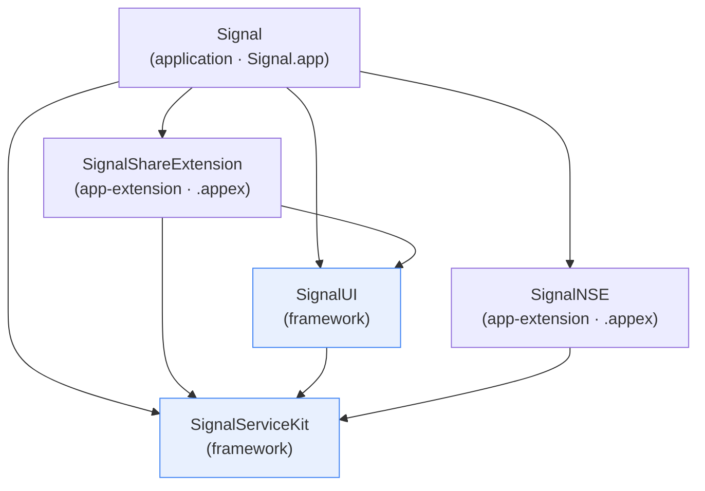
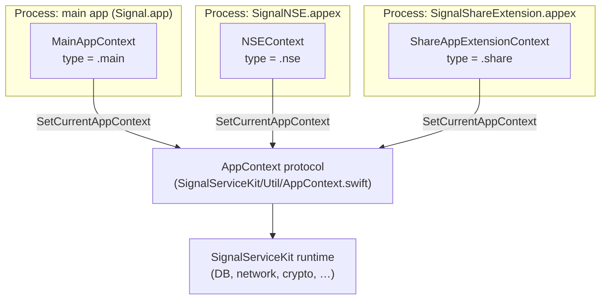
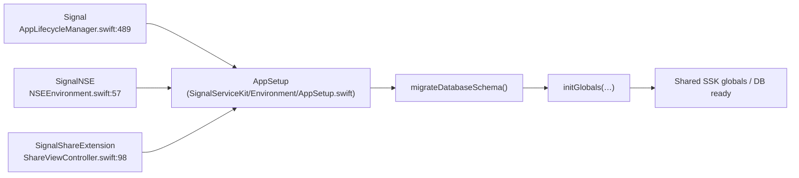

# Signal iOS — Project Overview & Target Architecture

This is a **synthesis / overview** document. It describes what Signal iOS is, how
its build targets relate, and how a running process is bootstrapped. It does **not**
re-document subsystems already covered under `docs/` (Attachments, Network, Calls,
Cryptography, Account, Registration, Devices, SecureValueRecovery, VoiceMessage,
ChangePhoneNumber, ShareExtension) — see those documents for subsystem internals.

> **Conventions** (matching the rest of `docs/`):
> - **Citations** are `File:line` / `File:line-range`, pointing at the state of the
>   tree at authoring time. Line numbers are anchors and may drift; use the cited
>   symbol/filename to relocate.
> - **Confidence labels** on behavioral claims:
>   - **[High]** — read directly from source; the claim is explicit in code/config.
>   - **[Medium]** — inferred from signatures / cross-file reading with reasonable
>     certainty, or depends on collaborators outside the cited file.
>   - **[Low]** — inferred from naming/structure; not fully verified in-tree.
> - Where intent cannot be established from source, the text says
>   **"intent undetermined — no evidence in source."**

## What Signal iOS is

Signal is a free and open source messaging app for private communication
(`README.md:3`). **[High]** This repository is the **iOS** client; companion
Android and Desktop clients live in separate repositories (`README.md:7`). **[High]**

The repo is a CocoaPods-based Xcode workspace: development is done by opening
`Signal.xcworkspace` (`BUILDING.md:38-41`) after running `make dependencies`
(`BUILDING.md:33`, `Makefile:5-7`). **[High]** The minimum deployment target is
iOS 15.0 (`Podfile:1`). **[High]**

## Repository layout (first-party source roots)

| Directory | Role | Xcode product type |
|---|---|---|
| `Signal/` | The main Signal application (UI, app lifecycle, settings, conversations). | `com.apple.product-type.application` (`Signal.xcodeproj/project.pbxproj:16223`) |
| `SignalServiceKit/` | Core service/business-logic framework shared by every other target. | `com.apple.product-type.framework` (`Signal.xcodeproj/project.pbxproj:16263`) |
| `SignalUI/` | Shared UI framework (reusable views/components built on top of SSK). | `com.apple.product-type.framework` (`Signal.xcodeproj/project.pbxproj:16157`) |
| `SignalShareExtension/` | iOS share-sheet app extension ("SAE"). | `com.apple.product-type.app-extension` (`Signal.xcodeproj/project.pbxproj:16197`) |
| `SignalNSE/` | Notification Service Extension (processes push notifications). | `com.apple.product-type.app-extension` (`Signal.xcodeproj/project.pbxproj:16137`) |

Approximate first-party Swift source volume per target (as a rough sense of scale),
measured by counting `*.swift` files under each root at authoring time: **[Medium]**
— the number reflects files on disk, which is a proxy for, not a guarantee of, what
each target compiles:

- `SignalServiceKit/`: 1464 `.swift` files
- `Signal/`: 893
- `SignalUI/`: 271
- `SignalShareExtension/`: 7
- `SignalNSE/`: 5

(There are also test targets `SignalTests`, `SignalUITests`, `SignalServiceKitTests`
in the project — see `Signal.xcodeproj/project.pbxproj:16226`, `:16160`, `:16266` —
which are out of scope for this overview.)

## The five main targets and their product kinds

All five targets are defined as `PBXNativeTarget`s in
`Signal.xcodeproj/project.pbxproj` (section begins at `:16119`) and as CocoaPods
targets in the `Podfile`: **[High]**

- `target 'Signal'` — `Podfile:53` (block)
- `target 'SignalShareExtension'` — `Podfile:66-68`
- `target 'SignalUI'` — `Podfile:70` (block)
- `target 'SignalServiceKit'` — `Podfile:78` (block)
- `target 'SignalNSE'` — `Podfile:86-87`

Note the main app target's internal `productName` is historically `RedPhone`
(`Signal.xcodeproj/project.pbxproj:16221`), but its `name` is `Signal`
(`:16220`) and it produces `Signal.app` (`:16222`). **[High]**

### Product references

- `Signal` → `Signal.app` (`Signal.xcodeproj/project.pbxproj:16222`) **[High]**
- `SignalServiceKit` → `SignalServiceKit.framework`
  (`Signal.xcodeproj/project.pbxproj:16262`) **[High]**
- `SignalUI` → `SignalUI.framework` (`:16156`) **[High]**
- `SignalShareExtension` → `SignalShareExtension.appex` (`:16196`) **[High]**
- `SignalNSE` → `SignalNSE.appex` (`:16136`) **[High]**

## Target dependency graph

The Xcode target dependencies are declared in each target's `dependencies = ( … )`
list, resolved through the `PBXTargetDependency` section
(`Signal.xcodeproj/project.pbxproj:20884-20955`). Resolving each proxy ID to its
`target`: **[High]**

- **`Signal`** (`:16214-16219`) depends on:
  - `SignalShareExtension` (`453518711F…` → `:20910-20913`)
  - `SignalUI` (`34A954BC27…` → `:20900-20903`)
  - `SignalNSE` (`342FFE8E27…` → `:20885-20888`)
  - `SignalServiceKit` (`F9C5C8A9…` → `:20950-20953`)
- **`SignalShareExtension`** (`:16190-16193`) depends on:
  - `SignalServiceKit` (`725465682B…` → `:20915-20918`)
  - `SignalUI` (`34A954D1…` → `:20905-20908`)
- **`SignalUI`** (`:16151-16153`) depends on:
  - `SignalServiceKit` (`7254656E…` → `:20930-20933`)
- **`SignalNSE`** (`:16131-16133`) depends on:
  - `SignalServiceKit` (`7254656C…` → `:20925-20928`)
- **`SignalServiceKit`** (`:16247` target block) depends on: **nothing in-project** —
  its `dependencies` list is empty (`dependencies = ( );` at `:16258-16259`). **[High]**

Key structural facts visible in the graph: **[High]**

- `SignalServiceKit` is the **leaf / foundation** — every other target depends on it,
  and it depends on no other first-party target.
- `SignalUI` sits above SSK and below the UI-bearing targets (`Signal`,
  `SignalShareExtension`).
- `SignalNSE` depends on SSK **only** — it does **not** depend on `SignalUI`. This
  is corroborated at the source level: there are no `import SignalUI` statements in
  `SignalNSE/` (grep over `SignalNSE/*.swift` returns none), whereas nearly all
  `SignalShareExtension/` Swift files — 6 of the 7 — import `SignalUI`
  (the one exception is `SignalShareExtension/ShareAppExtensionContext.swift`, which
  does not; e.g. the import is present at `SignalShareExtension/ShareViewController.swift:10`).
  The `SignalShareExtension → SignalUI` link itself is declared in the project graph
  (`Signal.xcodeproj/project.pbxproj:16190-16193`, dependency `34A954D1`). **[High]**
  This matches the extension's constrained UI role (background push processing vs.
  share-sheet UI).
  `SignalNSE/` (grep over `SignalNSE/*.swift` returns none), whereas every file in
  `SignalShareExtension/` imports `SignalUI` (e.g. `SignalShareExtension/ShareViewController.swift:8`).
  **[High]** This matches the extension's constrained UI role (background push
  processing vs. share-sheet UI).
- The main `Signal` app depends on both app extensions (`SignalShareExtension`,
  `SignalNSE`) so that they are embedded in the app bundle. The main app bundle's
  build phases include an "Embed Foundation Extensions" phase that embeds
  `SignalNSE.appex` (`Signal.xcodeproj/project.pbxproj:329`) and
  `SignalShareExtension.appex` (`:553`). **[High]**

### Source-level dependency corroboration

The pbxproj target graph is reinforced by Swift `import` directions
(a module can only `import` a module it links against): **[Medium]** — imports prove
the dependency exists but are a sample, not an exhaustive enumeration.

- `SignalUI` imports `SignalServiceKit` broadly (222 files under `SignalUI/` contain
  `import SignalServiceKit`, e.g. `SignalUI/AV/AudioPlayer.swift`). **[High]**
- `Signal` entry points import both lower frameworks, e.g.
  `Signal/AppLaunch/AppDelegate.swift:6` (`import SignalServiceKit`) and
  `Signal/AppLaunch/SignalApp.swift:6-7` (`import SignalServiceKit` / `import SignalUI`). **[High]**
- `SignalShareExtension/ShareViewController.swift:9` imports `SignalServiceKit` and
  `:10` `public import SignalUI` (`:8` is `import PureLayout`). **[High]**
- `SignalNSE/NotificationService.swift:5` imports `SignalServiceKit` (and no
  `SignalUI`; `:6` is `import UIKit`). **[High]**
- `SignalShareExtension/ShareViewController.swift:7-9` imports `SignalServiceKit`
  and `SignalUI`. **[High]**
- `SignalNSE/NotificationService.swift:6` imports `SignalServiceKit` (and no
  `SignalUI`). **[High]**

### CocoaPods dependency grouping

The `Podfile` layers third-party pods onto these targets consistently with the graph: **[High]**

- UI-oriented pods (`BonMot`, `PureLayout`, `lottie-ios`, MobileCoin) are grouped in
  `ui_pods` (`Podfile:44-51`) and applied to `Signal`, `SignalShareExtension`, and
  `ui_pods` (`Podfile:44-54`) and applied to `Signal`, `SignalShareExtension`, and
  `SignalUI` (`Podfile:57`, `:67`, `:71`) — the three UI-bearing targets.
- `SignalServiceKit` additionally pulls `CocoaLumberjack` (`Podfile:79`).
- `SignalNSE` declares no extra pods of its own (`Podfile:86-87`); it inherits what
  it needs transitively via its dependency on `SignalServiceKit`. **[Medium]**
- Shared foundational pods declared at `Podfile` top level — `SwiftProtobuf`
  (`:12`), `LibSignalClient` (`:15`), `SignalRingRTC` (`:20`),
  `GRDB.swift/SQLCipher` (`:23`), `SQLCipher` (`:26`), `libPhoneNumber-iOS`
  (`:33`) — are available to the pod tree generally. Exact pinned
  versions/tags appear in `Podfile.lock` under `CHECKOUT OPTIONS` (`Podfile.lock:103`)
  and `SPEC CHECKSUMS` (`Podfile.lock:127`). **[High]**

## How the pieces relate at runtime

### `SignalServiceKit` — the shared foundation

`SignalServiceKit` is the framework that holds the data model, networking, crypto,
account/registration, messaging pipeline, attachments, calls, etc. Its umbrella
Objective-C header `SignalServiceKit/SignalServiceKit.h` re-exports the ObjC model
layer (interactions, messages, group models, verification state, etc.) —
e.g. `SignalServiceKit/SignalServiceKit.h:14-50`. **[High]** The deeper subsystem
breakdown is documented under `docs/SignalServiceKit/` and is intentionally **not**
repeated here.

### The `AppContext` abstraction — one framework, three host processes

Because `SignalServiceKit` runs inside three distinct processes (the main app, the
NSE, and the share extension), it abstracts "which process am I in and what can I do"
behind the `AppContext` protocol (`SignalServiceKit/Util/AppContext.swift:32`) and
the `AppContextType` enum with cases `main`, `nse`, `share`
(`SignalServiceKit/Util/AppContext.swift:13-16`). **[High]** The current context is a
process-global set once at startup via
`SetCurrentAppContext(_:isRunningTests:)` and read via `CurrentAppContext()`
(`SignalServiceKit/Util/AppContext.swift:162`, `:169`). **[High]**

Each host target provides its own `AppContext` conformer:

- Main app: `MainAppContext` with `type == .main`
  (`Signal/AppLaunch/MainAppContext.swift:11-12`). **[High]**
- NSE: `NSEContext`, installed in `NSEEnvironment.init()` via
  `SetCurrentAppContext(self.appContext, isRunningTests: false)`
  (`SignalNSE/NSEEnvironment.swift:13-16`). **[High]**
- Share extension: `ShareAppExtensionContext`, installed as "the first thing we do"
  in `ShareViewController.loadView()`
  (`SignalShareExtension/ShareViewController.swift:36-38`). **[High]** The
  per-file breakdown of `ShareAppExtensionContext` is covered in
  `docs/SignalShareExtension/` and is not repeated here.

Why this matters: the three processes may run concurrently and all read/write the
same shared app-group data store, so SSK code branches on `CurrentAppContext()`
rather than assuming it is the foreground app. **[Medium]** — the shared-storage
coordination rationale is partly inferred from the multi-process structure; the exact
app-group container wiring lives in the context conformers and entitlements
(e.g. `SignalShareExtension/SignalShareExtension.entitlements`,
`SignalNSE/SignalNSE.entitlements`). The precise coordination contract across
processes is **intent undetermined — no evidence in source** beyond the context
abstraction itself.

### Shared bootstrap — `AppSetup`

All three host processes bring up the SSK runtime through the same builder entry
point, `AppSetup` (`SignalServiceKit/Environment/AppSetup.swift:10`), whose
`start(appContext:databaseStorage:)` begins a continuation chain
(`SignalServiceKit/Environment/AppSetup.swift:18-26`). **[High]** Each host calls it:

- Main app: `AppSetup().start(…)` (`Signal/AppLaunch/AppLifecycleManager.swift:489`)
  then `migrateDatabaseSchema()` (`:493`) / `initGlobals(…)` (`:494`). **[High]**
- Main app: `AppSetup().start(…)` then `migrateDatabaseSchema()` / `initGlobals(…)`
  in `Signal/AppLaunch/AppLifecycleManager.swift:489`. **[High]**
- NSE: `await AppSetup().start(…)` in `SignalNSE/NSEEnvironment.swift:57`
  (returns an `AppSetup.FinalContinuation`, `:44`). **[High]**
- Share extension: `await AppSetup().start(…)` in
  `SignalShareExtension/ShareViewController.swift:98`. **[High]**

### Main app entry & lifecycle

The main app's UIKit entry point is `AppDelegate`, marked `@main`
(`Signal/AppLaunch/AppDelegate.swift:11-13`). **[High]** It is intentionally thin:
it holds `AppLifecycleManager.shared` (`Signal/AppLaunch/AppDelegate.swift:16`) and
forwards UIKit callbacks to it — e.g. `application(_:didFinishLaunchingWithOptions:)`
calls `lifecycleManager.didFinishLaunching(launchOptions:)`
(`Signal/AppLaunch/AppDelegate.swift:19-25`). **[High]** The file's own doc comment
states that UI-scene events arrive in `SceneDelegate` instead
(`Signal/AppLaunch/AppDelegate.swift:9-12`; the `SceneDelegate` note is at `:12`;
see `Signal/AppLaunch/SceneDelegate.swift`). **[High]**
(`Signal/AppLaunch/AppDelegate.swift:8-10`; see `Signal/AppLaunch/SceneDelegate.swift`). **[High]**
`SignalApp` (`Signal/AppLaunch/SignalApp.swift:16`) is the app-level coordinator that,
for example, swaps the window's root between registration, provisioning, and the
chat list (`LaunchInterface`, `Signal/AppLaunch/SignalApp.swift:10-13`). **[High]**

### Notification Service Extension (`SignalNSE`)

The NSE's principal class is `NotificationService: UNNotificationServiceExtension`
(`SignalNSE/NotificationService.swift:33`). **[High]** Its lifecycle is documented in
the file's header comment: the system instantiates the extension when a push arrives,
calls `didReceive` in the background, the extension processes messages and must call
the content handler, and iOS terminates it if it exceeds ~30s
(`SignalNSE/NotificationService.swift:10-27`). **[High]** A single `NSEEnvironment`
singleton is kept per process so that app context, database, and logging are set up
only once (`SignalNSE/NotificationService.swift:28-30`; `globalEnvironment` at `:31`).
(`SignalNSE/NotificationService.swift:9-22`). **[High]** A single `NSEEnvironment`
singleton is kept per process so that app context, database, and logging are set up
only once (`SignalNSE/NotificationService.swift:25-31`; `globalEnvironment` at `:31`).
**[High]** The NSE depends on `SignalServiceKit` only (see graph above), consistent
with it having no first-party UI framework dependency. **[High]**

### Share extension (`SignalShareExtension`)

The share extension is a separate app-extension process whose principal class is
`ShareViewController` (`SignalShareExtension/ShareViewController.swift:13`). **[High]**
It installs its `AppContext` and then boots SSK via `AppSetup`
(`SignalShareExtension/ShareViewController.swift:36-38`, `:98`). **[High]** Its
internal component structure (load/lock/thread-picker view controllers, delegate,
progress sheet) is already documented in `docs/SignalShareExtension/` and is **not**
repeated here.

### `SignalUI`

`SignalUI` is a framework target (`Signal.xcodeproj/project.pbxproj:16157`) that
layers reusable UI on top of `SignalServiceKit` and is consumed by both the main app
and the share extension (graph above). Its umbrella header
`SignalUI/SignalUI.h` imports `UIKit` (`SignalUI/SignalUI.h:6`) and re-exports UI
helpers (e.g. `SignalUI/SignalUI.h:8`). **[High]** The specific catalog of components it exports
`SignalUI/SignalUI.h` imports `UIKit` and re-exports UI helpers
(`SignalUI/SignalUI.h:5-7`). **[High]** The specific catalog of components it exports
is broad (271 Swift files) and is **not** enumerated here — this is an overview, not a
component reference.

## Summary

- `SignalServiceKit` is the dependency-free foundation framework; everything builds
  on it. **[High]** (`project.pbxproj:16258-16259` empty deps.)
- `SignalUI` adds shared UI atop SSK and is used by the UI-bearing targets `Signal`
  and `SignalShareExtension`. **[High]**
- The main `Signal` app embeds and depends on both app extensions (`SignalNSE`,
  `SignalShareExtension`) plus `SignalUI` and `SignalServiceKit`. **[High]**
- `SignalNSE` is deliberately lean: SSK-only, no `SignalUI`. **[High]**
- The three host processes (main / nse / share) share one SSK codebase, selecting
  behavior through `AppContext`/`AppContextType` and bootstrapping through the common
  `AppSetup` builder. **[High]**

For subsystem-level detail, follow the documents under `docs/SignalServiceKit/` and
`docs/SignalShareExtension/`.
