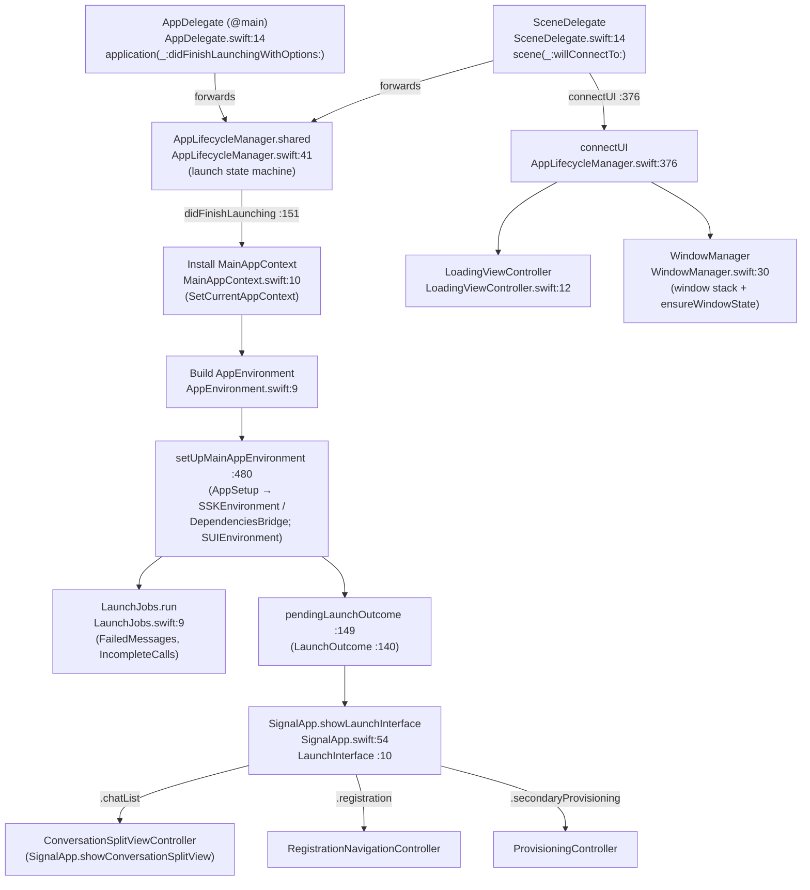

# `Signal/AppLaunch/` — Process Entry, Launch & App Composition

Folder-level map of `Signal/AppLaunch/`, the directory that owns the `Signal` target's
**process entry points, launch state machine, dependency composition, scene/window
management, and the loading UI**. This document covers the *folder itself*: what each
file is, how the files relate, and the launch sequencing/state that ties them together.

It is an orientation + index. The per-file deep dives already exist as sibling documents
under [../](../) and are **not** restated here — this doc points into them. For the
whole-target scope and the conventions below, see [../README.md](../README.md).

> This README documents the `AppLaunch` folder. The end-to-end launch narrative lives in
> [../launch-sequence.md](../launch-sequence.md) (not edited by this doc).

## Conventions (recap)

- **Citations** are `path:line` (declaration) or `path` (file/dir). Line numbers reflect
  the working tree at authoring time and may drift; relocate via the symbol name. Every
  behavioral claim cites a path.
- **Confidence**: **[High]** = directly observed (file read / declaration located this
  session); **[Medium]** = inferred from signatures/names/cross-file convention;
  **[Low]** = inference from naming alone.
- Where source shows no design intent, the text says **intent undetermined — no evidence
  in source**.
- The folder listing and file sizes were produced by listing the working tree this
  session **[High]**.

## 1. What's in the folder

Ten Swift files **[High]** (listed by role, largest-impact first):

| File | Role | Primary type(s) | Deep dive |
|---|---|---|---|
| `AppLifecycleManager.swift` (~91 KB) | The launch **state machine** + all UIKit lifecycle behavior; everything else forwards here. | `final class AppLifecycleManager` (`AppLifecycleManager.swift:41`), `static let shared` (`:43`) | [../launch-sequence.md](../launch-sequence.md), [../scene-window-management.md](../scene-window-management.md) |
| `AppDelegate.swift` | `@main` app-wide UIKit lifecycle entry; thin forwarder. | `final class AppDelegate: UIResponder, UIApplicationDelegate` (`AppDelegate.swift:13-14`) | [../launch-sequence.md](../launch-sequence.md) §0 |
| `SceneDelegate.swift` | UI/scene lifecycle entry (single declared scene); thin forwarder. | `final class SceneDelegate: UIResponder, UIWindowSceneDelegate` (`SceneDelegate.swift:14`) | [../scene-window-management.md](../scene-window-management.md) §1 |
| `SignalApp.swift` | Top-level UI presentation controller + the `LaunchInterface` switch; also app-wide navigation helpers and destructive reset/exit flows. | `public class SignalApp` (`SignalApp.swift:16`), `enum LaunchInterface` (`SignalApp.swift:10`) | [../launch-sequence.md](../launch-sequence.md) (final presentation) |
| `AppEnvironment.swift` | Main-app dependency container; cron + on-launch job wiring. | `public class AppEnvironment: NSObject` (`AppEnvironment.swift:9`) | [../app-environment.md](../app-environment.md) |
| `MainAppContext.swift` | The main-app implementation of SSK's `AppContext`. | `class MainAppContext: NSObject, AppContext` (`MainAppContext.swift:10`) | [../app-environment.md](../app-environment.md) |
| `WindowManager.swift` | UIWindow stack + visibility arbiter (root / call / return-to-call / screen-block / clock-skew). | `class WindowManager` (`WindowManager.swift:30`) | [../scene-window-management.md](../scene-window-management.md) §3 |
| `LoadingViewController.swift` | The launch/loading screen (indistinguishable from Launch Screen until a slow launch reveals progress UI). | `class LoadingViewController: UIViewController` (`LoadingViewController.swift:12`) | [../scene-window-management.md](../scene-window-management.md) §4 |
| `ViewControllerContext.swift` | Scoped DI bundle for view controllers / view models. | `public class ViewControllerContext` (`ViewControllerContext.swift:17`) | [../app-environment.md](../app-environment.md) |
| `LaunchJobs.swift` | One-shot pre-chat-list database jobs. | `enum LaunchJobs` (`LaunchJobs.swift:9`) | [../app-environment.md](../app-environment.md) |

> The folder contains exactly the ten Swift files listed above; the directory listing
> this session showed no other files (no tests, mocks, generated protobufs, or asset
> catalogs live in `Signal/AppLaunch/`) **[High]**.

## 2. Responsibility of the folder

The folder owns the answer to *"how does the `Signal` process start and become a usable
app?"* Concretely it is responsible for **[High]**:

1. **Being the process/UI entry.** `AppDelegate` is `@main` (`AppDelegate.swift:13-14`);
   `SceneDelegate` is the single scene's delegate (`SceneDelegate.swift:14`). Both are
   deliberately logic-free and forward every callback to
   `AppLifecycleManager.shared` (`AppDelegate.swift:16`, `SceneDelegate.swift:16`)
   **[High]**.
2. **Running the launch state machine.** `AppLifecycleManager.didFinishLaunching`
   (`AppLifecycleManager.swift:151`) performs synchronous setup, then an async pipeline
   opens the database, builds the dependency containers, migrates, and resolves a launch
   outcome; the private `enum LaunchOutcome` (`AppLifecycleManager.swift:140-143`,
   `.failure` / `.launchInterface`) is held in `pendingLaunchOutcome`
   (`AppLifecycleManager.swift:149`) until a scene can consume it **[High]**.
3. **Composing dependencies.** It wires two app-owned containers —
   `MainAppContext` (`MainAppContext.swift:10`) and `AppEnvironment`
   (`AppEnvironment.swift:9`) — and bridges into the framework boundaries
   `SSKEnvironment`/`DependenciesBridge` (via `AppSetup`) and `SUIEnvironment`
   (SignalUI), from `setUpMainAppEnvironment` (`AppLifecycleManager.swift:480`) **[High]**.
   See [../app-environment.md](../app-environment.md).
4. **Owning the window stack & loading UI.** `connectUI`
   (`AppLifecycleManager.swift:376`) joins the windowless launch pipeline to the UI,
   installing a `LoadingViewController` (`LoadingViewController.swift:12`) and handing the
   `WindowManager` (`WindowManager.swift:30`) a root window **[High]**.
5. **Presenting the chosen interface.** `SignalApp.showLaunchInterface`
   (`SignalApp.swift:54`) switches on `LaunchInterface` (`SignalApp.swift:10`:
   `.registration` / `.secondaryProvisioning` / `.chatList`) and installs the matching
   top-level view controller **[High]**.

The folder treats `SignalServiceKit` and `SignalUI` as **boundaries**: it consumes them
through global accessors (`SSKEnvironment.shared`, `DependenciesBridge.shared`,
`SUIEnvironment.shared`) and supplies main-app implementations into them, but does not
document their internals (those have their own docs) **[High]**.

## 3. How the files relate (launch sequencing)

The launch path moves through the folder in a fixed order; the authoritative, step-by-step
narrative with all error/edge cases is [../launch-sequence.md](../launch-sequence.md). The
folder-level shape **[High]**:

Key sequencing facts (**[High]**):

- **Context before everything.** `MainAppContext` is installed first thing in
  `didFinishLaunching` via `SetCurrentAppContext(...)`; thereafter it is reachable as
  `CurrentAppContext()` and is handed to SSK as its `AppContext`
  (see [../app-environment.md](../app-environment.md); [../launch-sequence.md](../launch-sequence.md) §1) **[High]**.
- **Launch is windowless until a scene connects.** The pipeline can finish before (or
  without) a scene connecting; the resolved outcome waits in `pendingLaunchOutcome`
  (`AppLifecycleManager.swift:149`), and `connectUI` (`:376`) consumes it when the scene
  arrives — showing `LoadingViewController` meanwhile, or the launch-failure UI, or the
  real interface **[High]**. This is why `WindowManager`'s `SceneWindows` must tolerate the
  absence of windows (see [../scene-window-management.md](../scene-window-management.md)).
- **One-shot DB jobs gate chat-list launch.** On the non-registration path,
  `LaunchJobs.run(databaseStorage:)` (`LaunchJobs.swift:9-10`) runs `FailedMessagesJob`
  then `IncompleteCallsJob` before launch completes (`LaunchJobs.swift:19-23`) **[High]**.
- **Final presentation is a three-way switch.** `SignalApp.showLaunchInterface`
  (`SignalApp.swift:54`) requires `appReadiness.isAppReady`, then presents registration,
  secondary provisioning, or the conversation split view, and calls
  `appReadiness.setUIIsReady()` (`SignalApp.swift:54-85`) **[High]**.

## 4. Important state held in the folder

- **`AppLifecycleManager.pendingLaunchOutcome`** (`AppLifecycleManager.swift:149`) — the
  bridge between the windowless launch pipeline and scene connection; its
  `LaunchOutcome` cases are `.failure(LaunchFailure)` / `.launchInterface(LaunchInterface)`
  (`:140-143`) **[High]**.
- **`AppEnvironment.shared`** (`AppEnvironment.swift:9-19`) — install-once singleton
  (`owsPrecondition(self._shared == nil)`) holding main-app-only objects (window manager,
  call service, badge/backup/provisioning managers, cron jobs) **[High]**.
- **`MainAppContext` reported application state** (`MainAppContext.swift`) — bridges UIKit
  foreground/background/active notifications into SSK's app-agnostic ones; this is the
  folder's source of truth for "is the app active?" **[High]**
  (see [../app-environment.md](../app-environment.md)).
- **`WindowManager` visibility state** (`WindowManager.swift`) — `ensureWindowState()` is
  the central arbiter choosing which window (screen-block / call / clock-skew / root) is
  visible; its `SceneWindows` are scoped to a connected scene **[High]**
  (see [../scene-window-management.md](../scene-window-management.md) §3).
- **`SignalApp.conversationSplitViewController`** (`SignalApp.swift:17`) — a weak
  reference to the live chat-list split view, used by the app-wide navigation helpers
  (`presentConversationForThread`, `showAppSettings`, `showNewConversationView`, …) **[High]**.

## 5. Interactions with the rest of the Signal module and the app

Within the `Signal` target, this folder is the **composition root**: it instantiates and
hands out the containers that the rest of the target reads from, and `SignalApp` installs
the top-level view controllers that the folder-external
`Signal/src/ViewControllers/` tree lives under (see
[../view-controllers-map.md](../view-controllers-map.md)) **[High]**.

Notable outward interactions (**[High]**):

- **Navigation surface.** `SignalApp` (`SignalApp.swift:16`) exposes entry points other
  parts of the app call to navigate: `presentConversationForAddress` /
  `presentConversationForThread` (`SignalApp.swift`), `showAppSettings`,
  `showCameraCaptureView`, `showNewConversationView`, `showMyStories` — all delegating to
  the live `ConversationSplitViewController` **[High]**.
- **Spam/captcha.** On `showLaunchInterface`, `SignalApp` observes
  `SpamChallengeResolver.NeedsCaptchaNotification` and presents
  `SpamCaptchaViewController` into `WindowManager.captchaWindow` (`SignalApp.swift:54-99`)
  **[High]**.
- **Destructive reset flows.** `SignalApp.resetAppData` / `resetAppDataAndExit` /
  `resetLinkedAppDataAndExit` (`SignalApp.swift`) wipe keychain, user defaults, shared/doc/
  caches/temp directories, notifications, badge, and shortcut items — explicitly documented
  as "extremely destructive … used in launch flows, before global singletons are
  available" **[High]**. Intent beyond unlink/transfer/reset recovery — undetermined; no
  further evidence in source.
- **Framework boundaries.** The folder is where the app supplies main-app implementations
  into `SSKEnvironment`/`DependenciesBridge` (via `AppSetup` in
  `setUpMainAppEnvironment`, `AppLifecycleManager.swift:480`) and initializes
  `SUIEnvironment` from SignalUI; thereafter the whole target consumes those services
  through the global accessors **[High]** (see [../app-environment.md](../app-environment.md)).

## 6. Where to read more

| Topic | Document |
|---|---|
| End-to-end launch, all error/edge cases, feature flags | [../launch-sequence.md](../launch-sequence.md) |
| Scenes, window stack, visibility arbitration, loading UI | [../scene-window-management.md](../scene-window-management.md) |
| Dependency containers, cron/on-launch jobs, framework wiring | [../app-environment.md](../app-environment.md) |
| Map of the target's view-controller layer (folder-external) | [../view-controllers-map.md](../view-controllers-map.md) |
| Target scope + conventions | [../README.md](../README.md) |
