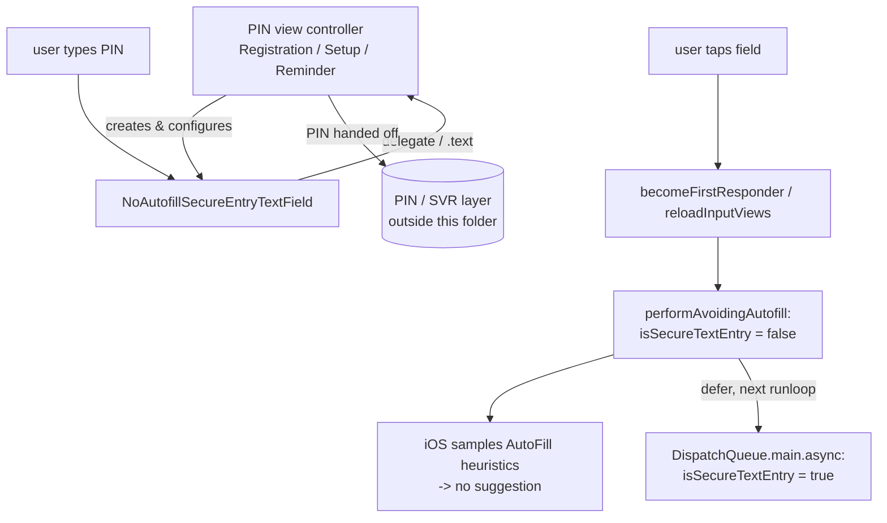

# Autofill

Covers `Signal/Autofill/`:

- `NoAutofillSecureEntryTextField.swift`

This folder is small (one file, one type). It exists to solve a single, narrow UIKit/iOS
problem: Signal needs secure-entry (masked) text fields for **PIN entry** that do **not**
trigger iOS Authentication Services' Password AutoFill — the OS otherwise offers to autofill
a saved password or generate a strong password/throwaway email, which is nonsensical and
intrusive for a Signal PIN. The subsystem has no model, no persistence, and no network
surface; it is a presentation-layer UIKit shim consumed by the app's PIN view controllers.

---

## Scope & boundaries

In scope: a single `UITextField` subclass that lets callers get `isSecureTextEntry == true`
behavior while suppressing Password AutoFill suggestions
(`Signal/Autofill/NoAutofillSecureEntryTextField.swift:20`) **[High]**.

Out of scope / boundaries: the subsystem depends only on `UIKit` and on `SignalServiceKit`
for the `owsFailDebug` assertion helper (`:5-6`) **[High]**. It does not touch
`SignalServiceKit`'s PIN/KBS/SVR logic, Keychain, or the registration state machine — it is
purely how a PIN *input field* is rendered and how it talks to the OS AutoFill heuristics.
The PIN values themselves are handled by the consuming view controllers and the service layer
(see [SecureValueRecovery](../../SignalServiceKit/SecureValueRecovery/secure-value-recovery.md)).

## Conventions

- **Citations** are `path:line` (specific declaration) or `path` (file). Line numbers reflect
  the working tree at authoring time and may drift; relocate via the symbol name. Every
  factual claim about behavior cites a path.
- **Confidence labels**:
  - **[High]** — directly observed (file read / declaration located in this session).
  - **[Medium]** — inferred from signatures, names, and cross-file convention.
  - **[Low]** — educated inference from naming alone.

## One-paragraph orientation

`NoAutofillSecureEntryTextField` is a `final class … : UITextField`
(`Signal/Autofill/NoAutofillSecureEntryTextField.swift:20`) whose only job is to game iOS's
Password AutoFill heuristics. Those heuristics decide whether to offer autofill based on opaque
signals including `isSecureTextEntry` and `textContentType`; per the type's own doc comment, on
iOS 26 `isSecureTextEntry == true` "unequivocally" triggers an autofill suggestion
(`:9-18`) **[High]**. The class works around this by flipping `isSecureTextEntry` **off** for the
exact window in which UIKit samples these heuristics (becoming first responder / reloading input
views), running the real work, then asynchronously restoring secure entry on the next main-loop
turn (`:52-59`) **[High]**.

---

## `NoAutofillSecureEntryTextField` — `NoAutofillSecureEntryTextField.swift:20`

Confidence: **[High]** (read in full).

### Responsibility
Provide a masked PIN input field that does not surface Password AutoFill / strong-password
suggestions, while still presenting as `isSecureTextEntry == true` to the rest of the app
(doc comment, `:9-18`).

### State
- `private var warnWhenSettingSecureTextEntry: Bool = true` (`:21`) — a guard flag so that the
  class can mutate its own `isSecureTextEntry` internally without tripping its own developer
  assertion **[High]**.

### Guardrails against external misuse
The type overrides two properties purely to assert that callers must not set them manually:

| Member | Line | Behavior |
|--------|------|----------|
| `isSecureTextEntry` (override) | 23 | `didSet` fires `owsFailDebug("Do not manually set isSecureTextEntry on this type!")` **unless** `warnWhenSettingSecureTextEntry == false` (i.e. unless the class set it itself). **[High]** |
| `textContentType` (override) | 31 | `didSet` always fires `owsFailDebug("Do not manually set textContentType on this type!")` — the type owns these AutoFill-relevant signals and callers must not override them. **[High]** |

`owsFailDebug` is the `SignalServiceKit` debug-assertion helper (imported at `:5`); it crashes in
debug builds and logs in production, so these are developer guardrails, not runtime guarantees
**[Medium]**.

### The AutoFill-avoidance mechanism
| Member | Line | Behavior |
|--------|------|----------|
| `becomeFirstResponder()` (override) | 38 | Returns `performAvoidingAutofill { super.becomeFirstResponder() }` (`@discardableResult`). First-responding is the key moment UIKit may offer autofill. **[High]** |
| `reloadInputViews()` (override) | 44 | Wraps `super.reloadInputViews()` in `performAvoidingAutofill` for the same reason. **[High]** |
| `performAvoidingAutofill<T>(_:)` | 50 | Sets `isSecureTextEntry = false` via `setIsSecureTextEntry`, runs the block, and in a `defer` schedules `DispatchQueue.main.async { self?.setIsSecureTextEntry(true) }` to restore secure entry on the next run-loop turn (weak `self`). The net effect: UIKit samples the AutoFill heuristics while `isSecureTextEntry == false`, so no suggestion is offered, but the field is masked again moments later. **[High]** |
| `setIsSecureTextEntry(_:)` | 61 | Flips `warnWhenSettingSecureTextEntry` to `false`, assigns `isSecureTextEntry`, then restores the flag to `true` — the only sanctioned path to mutate secure entry without tripping the assertion in the `didSet` at `:23`. **[High]** |

### Important behavioral note
Secure masking is briefly `false` and is restored **asynchronously** (`DispatchQueue.main.async`,
`:54`). There is therefore a short window where the field is not masked; this is intentional and
scoped to first-responder/input-reload transitions **[High]**. Intent for choosing async restore
over synchronous: not stated in source — likely to let UIKit finish its autofill sampling pass
before re-masking **[Low]**.

---

## Interactions with the rest of the app

The type is a drop-in `UITextField` replacement; all three consumers assign it to a
`private lazy var pinTextField: UITextField` and then configure only cosmetic/behavioral
properties (font, alignment, colors, kerning, `delegate`, iOS 26 `cornerConfiguration`) — never
`isSecureTextEntry` or `textContentType`, consistent with the guardrails above **[High]**.

| Consumer | Line | Context |
|----------|------|---------|
| `RegistrationPinViewController` | `Signal/Registration/UserInterface/RegistrationPinViewController.swift:227` | PIN entry during registration. **[High]** |
| `PinSetupViewController` | `Signal/src/ViewControllers/PinSetupViewController.swift:75` | Creating/confirming a PIN. **[High]** |
| `PinReminderViewController` | `Signal/src/ViewControllers/PinReminderViewController.swift:37` | Periodic PIN reminder/re-entry. **[High]** |

Build membership: the file is compiled into the main `Signal` app target
(`Signal.xcodeproj/project.pbxproj:3430`, `:7837`, `:14523`, `:18450`) **[High]**. The grep for
usages was truncated, so there may be additional consumers beyond the three listed; those three
are the ones directly observed **[Medium]**.

## Data flow

There is no data flow *through* this subsystem beyond the user's keystrokes into a standard
`UITextField`. The entered PIN text is read by the consuming view controller (via its
`UITextFieldDelegate` conformance / the field's `text`) and handed to the PIN/registration/SVR
layers outside this folder; this file neither stores nor transmits the PIN **[High]**.

Edge cases / caveats (confidence: **[High]** unless noted): manually setting
`isSecureTextEntry` or `textContentType` trips `owsFailDebug` (debug crash); re-masking is
asynchronous so there is a brief unmasked window during focus transitions; the autofill-heuristic
behavior described in the doc comment is Apple's and is version-sensitive (the comment calls out
iOS 26 specifically, `:14-15`) — if Apple changes those heuristics the workaround may need
revisiting **[Medium]**.
