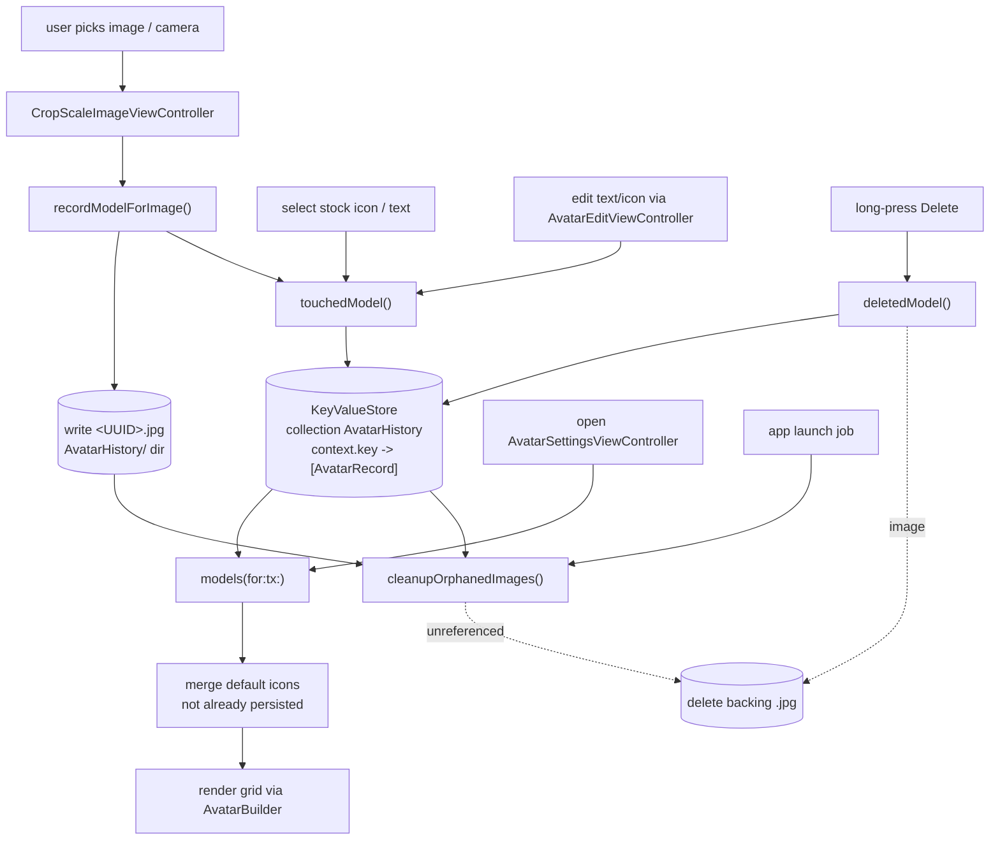

# `Signal/Avatars/` — Avatar History Persistence

Documents the **first-party `Signal/Avatars/` app-target folder only**. At authoring
time this folder contains a single file:

- `AvatarHistoryManager.swift` — persists the history of user-selected avatars.

This is *not* a tests/mocks/generated/asset folder — it is one substantive production
class, so this doc describes it in full and traces its interactions with the rest of
the app target and with `SignalServiceKit`.

The avatar *model types* (`AvatarModel`, `AvatarType`, `AvatarIcon`, `AvatarTheme`,
`AvatarBuilder`, `AvatarDefaultColorManager`) live in `SignalServiceKit/Avatars/` and
are treated here as a **boundary**: this doc covers *how the app target uses them*, not
their internals. The avatar-editing/selection **UI** lives in
`Signal/src/ViewControllers/Avatars/` and is covered only as the primary consumer. For
the whole-repository map see [../../APPLICATION_MAP.md](../../APPLICATION_MAP.md); for
the app-target overview see [../README.md](../README.md).

## Conventions

- **Citations** are `path:line` (specific declaration) or `path` (file/directory). Line
  numbers reflect the working tree at authoring time and may drift; relocate via the
  symbol name. Every factual claim about behavior cites a path.
- **Confidence labels** on claims about *purpose/behavior*:
  - **[High]** — directly observed (file read / declaration located in this session).
  - **[Medium]** — inferred from signatures, names, and cross-file convention; not every
    referenced file was read in full.
  - **[Low]** — educated inference from naming alone.
- Any uncited claim is a defect.

## Responsibility

`AvatarHistoryManager` persists the **history of avatars a user has selected** for a
given context (a group or the local profile) so they can be re-offered in the avatar
picker. The class doc is explicit (`Signal/Avatars/AvatarHistoryManager.swift:9-14`):
the history includes *custom images*, *stock icons*, and *custom text over a colored
background*, but **not** default avatars like "contact initials over a colored
background" **[High]**. Default-avatar color selection is delegated elsewhere, to
`AvatarDefaultColorManager` (`:14` `- SeeAlso`), which lives in `SignalServiceKit`
**[High]**.

## Key types

### `AvatarHistoryManager` — `AvatarHistoryManager.swift:16`
A plain (non-singleton) `class`, instantiated once by the app environment (see
Interactions). It owns three dependencies set at init
(`AvatarHistoryManager.swift:30-45`) **[High]**:

- `db: any DB` — the database, source of read/write transactions.
- `keyValueStore: KeyValueStore` — collection `"AvatarHistory"`; stores per-context
  arrays of persisted records.
- `imageHistoryDirectory: URL` — `<appSharedDataDirectory>/AvatarHistory/`, where
  custom-image avatar files are written as `<UUID>.jpg`.

> Note: the `init` accepts an `appReadiness` parameter but, as written, does not store
> or use it (`AvatarHistoryManager.swift:32-45`) — intent undetermined, no further
> evidence in source **[High]**.

### `AvatarHistoryManager.Context` — `AvatarHistoryManager.swift:17-27`
Keys the history by scope **[High]**:

| Case | `key` | Meaning |
|------|-------|---------|
| `.groupId(Data)` | `"group.<hex>"` | per-group avatar history |
| `.profile` | `"profile"` | local-user profile avatar history |

The `key` (`:20-26`) is the `KeyValueStore` key under which that context's record array
is stored.

### `AvatarRecord` (private) — `AvatarHistoryManager.swift:208-224`
The **on-disk persistence shape**. A comment (`:204-207`) explains the deliberate design
decision: `AvatarModel` is *not* encoded directly, to future-proof against changes to
the `AvatarIcon`/`AvatarType`/`AvatarTheme` enums, because `Codable` is "brittle when it
encounters things it doesn't know about" **[High]**. `AvatarRecord` is a flat `Codable`
struct with a `Kind` (`icon`/`text`/`image`), `identifier`, optional `imageUrl`,
optional `text`, and a `theme` stored as its raw `String` **[High]**.

### Boundary types (`SignalServiceKit/Avatars/AvatarModel.swift`)
Referenced throughout but owned by `SignalServiceKit` **[High]**:

- `AvatarModel` (`AvatarModel.swift:9`) — `identifier` + `type: AvatarType` +
  `theme: AvatarTheme`; `Equatable`.
- `AvatarType` (`AvatarModel.swift:29`) — `.image(URL)` / `.icon(AvatarIcon)` /
  `.text(String)`, with `isEditable` (icon/text editable, image not; `:34-41`) and
  `isDeletable` (image/text deletable, icon not; `:43-49`) flags that drive the UI.
- `AvatarIcon` (`AvatarModel.swift:67`) — the stock-icon enum; `rawValue` doubles as the
  model `identifier` for icons, plus `defaultGroupIcons` / `defaultProfileIcons`
  (`:98-127`) used to seed the picker.
- `AvatarTheme` (`AvatarModel.swift:129`) — the color palette (`A100`–`A210`) with
  fore/background colors and `forIcon(_:)` defaults; also maps to/from the Storage
  Service and Backup proto `AvatarColor` enums (`:170-205`, `:328-369`) **[High]**.

## Public API (`AvatarHistoryManager`)

| Method | Line | Behavior |
|--------|------|----------|
| `models(for:tx:)` | `186` | Load the context's `[AvatarRecord]` from the KV store and decode into `[AvatarModel]`. Validates each record: an `.icon` whose `identifier` is not a valid `AvatarIcon`, an `.image` whose file no longer exists, or a `.text` with no text are each skipped via `owsFailDebug` (`:195-233`) **[High]**. |
| `touchedModel(_:in:tx:)` | `87` | Move/insert `model` at the front of the context's list (most-recently-used ordering): remove any existing entry with the same `identifier`, insert at index 0, re-serialize to `[AvatarRecord]`, and write back (`:88-111`) **[High]**. |
| `deletedModel(_:in:tx:)` | `113` | Remove `model` from the list; if it's an `.image`, delete the backing file from disk; re-serialize and write back (`:114-138`) **[High]**. |
| `recordModelForImage(_:in:tx:)` | `140` | Persist a newly-picked `UIImage`: ensure the history dir exists, allocate a `<UUID>.jpg` path, encode via `OWSProfileManager.avatarData(avatarImage:)`, write the file, build an `.image` `AvatarModel` with `.default` theme, and `touchedModel` it. Returns the new model (nil on failure) (`:140-165`) **[High]**. |
| `cleanupOrphanedImages()` | `47` | `async` sweep: read all persisted records across all contexts, compute the set of image paths still referenced, enumerate files under the history directory, and delete any file not referenced; logs the orphan count (`:47-85`) **[High]**. |

All failures are **non-throwing / best-effort**: decode, file-write, and file-delete
errors are reported via `owsFailDebug` and the method continues or returns a safe
default rather than propagating (`:51-56`, `:106-110`, `:150-162`, `:217-220`) **[High]**.

## Interactions with the rest of the app

### Ownership & lifecycle (`Signal/AppLaunch/AppEnvironment.swift`)
`AvatarHistoryManager` is a main-app-target dependency, not an `SSKEnvironment`
service **[High]**:

- Declared `private(set) var avatarHistoryManager: AvatarHistoryManager!`
  (`AppEnvironment.swift:33`).
- Constructed during environment setup with `DependenciesBridge.shared.db`
  (`AppEnvironment.swift:89-92`).
- The orphan sweep is scheduled as a fire-and-forget launch job:
  `Task { await self.avatarHistoryManager.cleanupOrphanedImages() }`
  (`AppEnvironment.swift:448-450`) **[High]**.

### Primary consumer: `AvatarSettingsViewController`
`Signal/src/ViewControllers/Avatars/AvatarSettingsViewController.swift` is the avatar
picker/editor and the main caller **[High]**:

- Holds the `AvatarHistoryManager.Context` it was opened for
  (`AvatarSettingsViewController.swift:14`, init `:62-66`).
- Reads history via `AppEnvironment.shared.avatarHistoryManager.models(for:tx:)` when
  building the grid (`:250`), then **merges** in default icons
  (`AvatarIcon.defaultGroupIcons` / `defaultProfileIcons`, chosen by context) that
  aren't already persisted (`:256-271`) **[High]**.
- On selecting/confirming a model, writes via `touchedModel(...)`
  (done button `:112`; text/edit completion `:398`, `:496`) inside
  `DependenciesBridge.shared.db.asyncWrite` **[High]**.
- Picking a photo/camera image goes image-picker
  (`imagePickerController(...)`, `:465`) → `CropScaleImageViewController` →
  `recordModelForImage(croppedImage, in:tx:)` (`:474`) **[High]**.
- Long-press "Delete" on a deletable option calls `deletedModel(...)`
  (`didDeleteOptionView`, `:514`), and if the deleted model was selected the header is
  cleared **[High]**.
- Rendering of each `AvatarModel` to a `UIImage` is delegated to
  `SSKEnvironment.shared.avatarBuilderRef.avatarImage(model:…)`
  (`AvatarBuilder`, boundary) — `AvatarHistoryManager` itself never rasterizes avatars
  **[High]**.

Editing text/icon models is handed to `AvatarEditViewController`
(`Signal/src/ViewControllers/Avatars/AvatarEditViewController.swift`), whose completion
again routes back through `touchedModel(...)` **[High]**.

## Data flow / state

State notes **[High]**:

- **Two stores, kept in sync by convention.** The `KeyValueStore` is the index
  (per-context ordered record list); the `AvatarHistory/` directory holds image bytes.
  Image records reference files by URL; `cleanupOrphanedImages` reconciles the directory
  against the index, and `deletedModel` deletes the file inline when an image record is
  removed (`AvatarHistoryManager.swift:47-85`, `:124-126`) **[High]**.
- **MRU ordering.** `touchedModel` always re-inserts at index 0, so the most recently
  used avatar sorts first in the picker (`:90-92`) **[High]**.
- **Resilience to schema drift.** Because only the flat `AvatarRecord` is persisted and
  `models(for:tx:)` revalidates each record on load, stale icons, missing image files,
  or malformed text records are dropped rather than crashing (`:195-233`,
  comment `:204-207`) **[High]**.
- **Themes round-trip to sync/backup.** `AvatarTheme` ↔ `StorageServiceProtoAvatarColor`
  and ↔ `BackupProto_AvatarColor` conversions exist in the boundary type
  (`AvatarModel.swift:170-205`, `:328-369`), i.e. the chosen color participates in
  Storage Service / Backups — though `AvatarHistoryManager` only stores the raw string
  `theme` and is not itself part of that sync path **[Medium]**.

## Notable UI considerations

These are in the consumer VC (`Signal/src/ViewControllers/Avatars/`), summarized here
because they shape how the history data is surfaced **[High]**:

- **Editability/deletability drive affordances.** `AvatarType.isEditable` /
  `isDeletable` (boundary, `AvatarModel.swift:34-49`) decide whether an option shows the
  edit overlay and whether the long-press action sheet offers Edit/Delete
  (`AvatarSettingsViewController.swift` `OptionView.handleLongPress`/`updateSelectionState`)
  **[High]**.
- **Responsive grid.** The picker computes avatars-per-row and avatar size from the
  available width (`configureAvatarsCell`, `:233-242`), and the header avatar size is
  `min(160, width*0.4)` (`avatarImageViewSize`, `:149-151`) **[High]**.
- **Rasterization is centralized.** The VC always asks `AvatarBuilder` for the rendered
  `UIImage` at the needed diameter (points for the grid, pixels for the saved avatar via
  `OWSProfileManager.maxAvatarDiameterPixels`), keeping rendering out of the history
  manager **[High]**.
- **Orientation.** On non-iPad the editor forces portrait (`init` `:76`,
  `supportedInterfaceOrientations` `:80-82`) **[High]**.

## Edge cases

- `recordModelForImage` returns `nil` (and the UI logs `owsFailDebug`) if
  `OWSProfileManager.avatarData` yields nil or the file write throws
  (`AvatarHistoryManager.swift:148-162`) **[High]**.
- `cleanupOrphanedImages` returns early if the history directory doesn't exist, and
  treats a failed record decode as "no records," which would make existing image files
  look orphaned on a corrupt read (`:48`, `:50-57`) — behavior noted, intent
  undetermined beyond the `owsFailDebug` **[High]**.
- Deleting an image model that is *also* the currently-selected avatar clears the header
  selection in the VC (`didDeleteOptionView` completion) **[High]**.
