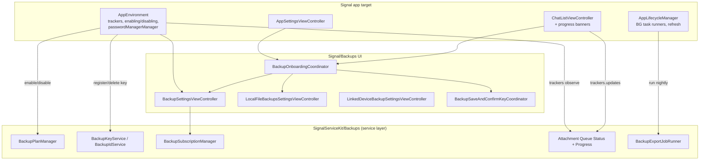

# `Signal/Backups/` — Backups UI & App-Level Orchestration

This document covers the **first-party app-target** Backups subsystem under
`Signal/Backups/` — the *UI, onboarding flows, settings screens, progress
trackers, and app-lifecycle hooks* that let a user enable, configure, monitor,
and disable Backups. It is deliberately distinct from
[`../../SignalServiceKit/Backups/`](../../SignalServiceKit/Backups), which
documents the **service layer** (archive/export, restore/import, encryption,
attachment queues, CDN/server, plan/settings stores). This target *drives* that
service layer; it does not implement archiving, encryption, or networking
itself.

For the broader app target see [`../README.md`](../README.md); for the
view-controller landscape see
[`../view-controllers-map.md`](../view-controllers-map.md).

> **Confidence labels** used throughout:
> - **[High]** — directly read from source in this session; behavior explicit in code.
> - **[Medium]** — inferred from signatures/names or dependent on collaborators
>   defined outside this directory (notably the `SignalServiceKit` Backups stores,
>   managers, and `AppEnvironment`/`AppLifecycleManager` wiring).
> - **[Low]** — inferred from naming/comments alone; not fully verified in-tree.
>
> Where the code does not reveal *why* something is done, this is stated as
> "intent undetermined — no evidence in source". File+line citations refer to the
> working tree at authoring time; line numbers are approximate anchors — relocate
> via the cited symbol name if they have drifted.

---

## Responsibility

`Signal/Backups/` is the **presentation and app-level control plane** for
Backups. Its jobs are:

1. **Onboarding** a user into Backups (remote or local-file), including the
   mandatory Recovery Key (Account Entropy Pool / AEP) save-and-confirm step.
2. **Enabling / disabling** Backups — orchestrating the StoreKit purchase (paid
   tier), registering Backup ID / Backup Key, flipping `BackupPlan`, and the
   asynchronous remote-disable + local cleanup.
3. **Settings UI** — the large `BackupSettingsViewController` (remote), the
   read-only `LinkedDeviceBackupSettingsViewController`, the
   `LocalFileBackupsSettingsViewController`, and the landing page that chooses
   between them.
4. **Progress & status surfacing** — `BackupAttachmentUploadTracker` /
   `BackupAttachmentDownloadTracker` adapt the service layer's queue-status and
   progress observers into `AsyncStream`s consumed by SwiftUI/UIKit views
   (settings screens and chat-list banners).
5. **Scheduled background work** — `BackupBGProcessingTaskRunner` and
   `LocalFileBackupBGProcessingTaskRunner` are `BGProcessingTaskRunner`s that run
   the nightly export job; `BackupRefreshManager` keeps a remote backup from
   expiring.

Everything here calls into `SignalServiceKit` for the actual
archive/upload/download/key work. **[High]** — observed throughout: every file
`import SignalServiceKit`, and the managers hold `SignalServiceKit` types
(`BackupPlanManager`, `BackupKeyService`, `BackupIdService`,
`BackupSubscriptionManager`, `BackupAttachment*QueueStatusManager`,
`BackupExportJobRunner`, etc.).

---

## File inventory

| File | Role | Confidence |
| --- | --- | --- |
| `BackupSettingsViewController.swift` (~155 KB) | The main **remote** Backups settings screen: a SwiftUI `BackupSettingsView` driven by `BackupSettingsViewModel`, with subviews for subscription, upload/download progress, export progress, manual-backup controls, view-key, and failure/badge state. **[High]** per symbols at `:12`, `:1693`, `:1893`. | High |
| `LinkedDeviceBackupSettingsViewController.swift` | Read-only Backups status for a **linked (non-primary) device** (`OWSTableViewController2`), modeling display tier / last-backup / subscription state. `:9` | High |
| `LocalFileBackupsSettingsViewController.swift` (~47 KB) | Settings for **local-file** backups: archive/restore progress, folder selection, enable/disable. `:9` | High |
| `BackupEnablingManager.swift` | App-level **enable** orchestration: registration check, Backup ID/Key registration, StoreKit purchase + redemption, `BackupPlan` transition, enable notification. `:11` | High |
| `BackupDisablingManager.swift` | App-level **disable** orchestration: set `.disabling` locally, drain the download queue, remotely delete the Backup Key (indefinite network retry), then set `.disabled` and wipe outdated local state; optionally rotates the AEP as a side-effect. `:10` | High |
| `BackupRefreshManager.swift` | Periodically **refreshes** the remote backup (message + media tiers) so it doesn't expire (~30-day expiry; refresh every 3 days). `:12` | High |
| `BackupBGProcessingTaskRunner.swift` | `BGProcessingTaskRunner` that runs the remote **export job** nightly (requires network + external power). `:9` | High |
| `LocalFileBackupBGProcessingTaskRunner.swift` | Same, for the **local-file** export job (requires external power, no network; offset 3:30am to avoid overlap). `:9` | High |
| `BackupAttachmentUploadTracker.swift` | Adapts `BackupAttachmentUploadQueueStatusManager` + `BackupAttachmentUploadProgress` into an `AsyncStream<UploadUpdate>`. `:14` | High |
| `BackupAttachmentDownloadTracker.swift` | Adapts the download queue-status + progress into an `AsyncStream<DownloadUpdate>`. `:11` | High |
| `BackupSubscriptionLoader.swift` | Loads a user-facing `LoadedBackupSubscription` state (free/paid/expiring/expired/failed-to-renew/…) from `BackupPlanManager` + `BackupSubscriptionManager`. `:28` | High |
| `ChooseBackupPlanViewController.swift` | Free-vs-paid plan picker (`HostingController<ChooseBackupPlanView>`); confirming calls back into `BackupEnablingManager.PlanSelection`. `:10` | High |
| `BackupPlanUpsellViewController.swift` / `BackupPlanUpsellConfiguration.swift` | Paid-plan upsell sheet and the loader that fetches its subscription configuration + StoreKit price. `:9` / `:11` | High |
| `BackupPlanOptionView.swift`, `BackupPlanTermsAndConditionsView.swift` | SwiftUI building blocks for the plan picker/upsell. | Medium |
| `PulsingProgressBar.swift` | A SwiftUI progress bar with a looping "pulse" animation layered over `UIProgressView`. `:9` | High |
| `BackupSubscriptionAlreadyRedeemedSheet.swift`, `CannotRotateAEPActionSheet.swift`, `LocalFileBackupSelectHeroSheet.swift`, `LocalFileBackupFolderPicker.swift`, `LocalFileBackupChooseFolderErrorActionSheet.swift` | Small sheets / action sheets / pickers for specific error and selection cases. `CannotRotateAEPActionSheet` deep-links back into Backups settings. | High |
| `Onboarding/BackupOnboardingCoordinator.swift` | `@MainActor` **coordinator** that drives the remote/local onboarding flow end-to-end: intro → key intro → save+confirm key → choose plan → enable → settings. `:11` | High |
| `Onboarding/BackupSettingsLandingPageViewController.swift` | Landing page choosing between remote and local backups. `:9` | High |
| `Onboarding/BackupOnboardingIntroViewController.swift`, `BackupOnboardingKeyIntroViewController.swift`, `LocalFileBackupOnboardingIntroViewController.swift`, `LocalFileBackupSelectFolderHeroSheetViewController.swift` | Onboarding step screens / hero sheets. | High |
| `RecoveryKey/BackupSaveAndConfirmKeyCoordinator.swift` | `@MainActor` coordinator for the **save-and-confirm Recovery Key** flow, choosing between password-manager (iOS 26.2+) and manual paths. `:11` | High |
| `RecoveryKey/BackupRecoveryKeyReminderCoordinator.swift` | Coordinator that **re-prompts** the user to confirm their saved key, with a "forgot key" escape into the save-and-confirm flow. `:11` | High |
| `RecoveryKey/PasswordManagerManager.swift` | Wraps `AuthenticationServices` to **save/fetch** the Recovery Key to/from the system password manager (iOS 26.2+ for save). `:14` | High |
| `RecoveryKey/BackupSaveKeyViewController.swift`, `BackupConfirmKeyViewController.swift`, `EnterAccountEntropyPoolViewController.swift`, `AccountEntropyPoolTextView.swift`, `DisplayableAccountEntropyPool.swift` | The Recovery Key display / entry / confirmation UI and its text model. `EnterAccountEntropyPoolViewController` is the shared base for AEP entry. `:9` | High |
| `RecoveryKey/BackupNeverShareRecoveryKeySheet.swift`, `BackupKeepKeySafeSheet.swift` | Educational hero sheets about key safety. | High |

---

## How the app target wires these in

The app-scoped singletons live on **`AppEnvironment`** and are constructed
during app setup. **[High]**
`Signal/AppLaunch/AppEnvironment.swift` declares and builds:

- `backupAttachmentDownloadTracker` (`AppEnvironment.swift:34`, built at `:95`)
- `backupAttachmentUploadTracker` (`:35`, built at `:99`)
- `backupDisablingManager` (`:36`, built at `:103`)
- `backupEnablingManager` (`:37`, built at `:119`)
- `passwordManagerManager` (`:47`, built at `:180`)

The two **background-task runners** and the **refresh manager** are instantiated
in the launch/lifecycle layer: `BackupBGProcessingTaskRunner` and
`LocalFileBackupBGProcessingTaskRunner` at
`Signal/AppLaunch/AppLifecycleManager.swift:284` and `:294`, and
`BackupRefreshManager` at `:797`. **[High]** — grep of `AppLifecycleManager.swift`.

Entry points into the UI:

- **App Settings** → Backups: `AppSettingsViewController.swift:268` constructs a
  `BackupOnboardingCoordinator`. **[High]**
- **Chat list** navigation to `.backups(page:)`:
  `ChatListViewController.swift:1430`+ chooses the landing page, the remote
  onboarding coordinator (`:1443`), or local (`:1458`), consulting
  `BackupSettingsStore.shouldOverrideShowBackupsOnboarding` /
  `haveBackupsEverBeenEnabled` to decide whether to skip onboarding. **[High]**
- **Chat-list banners**: `ChatListViewController+BackupDownloadProgressView.swift`
  and `ChatListViewController+BackupExportProgressView.swift` consume
  `AppEnvironment.shared.backupAttachment{Download,Upload}Tracker.updates()`
  to show in-list progress. **[High]** — `…+BackupDownloadProgressView.swift:84`,
  `…+BackupExportProgressView.swift:176`.
- **Account deletion**: `DeleteAccountConfirmationViewController.swift` references
  the disabling manager (grep hit) — **[Medium]** likely to disable Backups as
  part of deletion; not read in full this session.

---

## Key data flows & state

### Enabling Backups

`BackupEnablingManager.enableBackups(fromViewController:planSelection:)` is
`@MainActor` and presents a `ModalActivityIndicatorViewController` while it:
checks registration (must be a **primary** device —
`owsPrecondition(registeredState.isPrimary, …)`), waits for any in-flight remote
*disable* to finish, registers the Backup ID then the Backup Key, clears stale
subscription-issue flags, and finally transitions `BackupPlan`. **[High]** —
`BackupEnablingManager.swift:62` onward; precondition at `:76`.

The paid path branches on the `avoidStoreKitForTesters` build flag: normally it
runs `backupSubscriptionManager.purchaseNewSubscription()` and
`redeemSubscriptionIfNecessary()`, otherwise it renews a TestFlight entitlement.
Purchase results map to UI outcomes: `.success` → set `.paid`; `.pending` →
enable as `.free` for now; `.userCancelled` → `SheetDisplayableError.userCancelled`.
A failed redemption that is "already redeemed" throws a `HeroSheetDisplayableError`
presenting `BackupSubscriptionAlreadyRedeemedSheet`. **[High]** —
`BackupEnablingManager.swift` `enablePaidPlanWithStoreKit`.

Errors are surfaced via a `SheetDisplayableError` protocol (`.networkError`,
`.genericError`, `ActionSheetDisplayableError`, `HeroSheetDisplayableError`) that
the coordinator renders with `error.showSheet(from:)`. **[High]** — see
`BackupOnboardingCoordinator.enableBackups`.

### Disabling Backups

`BackupDisablingManager.startDisablingBackups(aepSideEffect:)` immediately sets
`BackupPlan` to `.disabling` in a write transaction, kicks off the remote-disable
`Task`, and returns the current *download-queue status* (because **draining
offloaded-media downloads is a prerequisite** to disabling). **[High]** —
`BackupDisablingManager.swift` doc comment + `startDisablingBackups`.

`_disableRemotelyIfNecessary()` waits for downloads to reach a terminal state,
then deletes the Backup Key with `Retry.performWithIndefiniteNetworkRetries`
(retries 5xx/network forever). On completion it sets `.disabled` and wipes
outdated state: last-backup details, cellular-upload preference, export-job and
list-media state, Backups banners, and **all** Backup auth/CDN credentials. If an
`AEPSideEffect.rotate(newAEP:)` was requested, the new AEP (stashed in this
class's KV store) is applied here. Failure is recorded under
`remoteDisablingFailed`, queryable via `disableRemotelyFailed(tx:)`. The work is
serialized with a `ConcurrentTaskQueue(concurrentLimit: 1)`. **[High]**

### Progress trackers (status + progress fusion)

Both trackers follow the same pattern **[High]**:

- `updates()` returns an `AsyncStream`; a private `Tracker` registers a
  **queue-status** observer (via `NotificationCenter` on
  `.backupAttachment{Upload,Download}QueueStatusDidChange(…, for: .fullsize)`) and
  a **progress** observer, both for `.fullsize` only (thumbnails ignored).
- State is held in a `SeriallyAccessedState<State>`; each status/progress event
  recomputes and `yield`s a combined `UploadUpdate`/`DownloadUpdate`.
- Notable rules: the upload tracker emits `.noUploadsToReport` when
  `totalUnitCount == 0` (only attachments present when Backups was enabled count);
  both trackers **suppress updates while `.appBackgrounded`** so the UI keeps the
  last pre-background value; the download tracker suppresses the first
  zero-progress "running" update and computes `.outOfDiskSpace(bytesRequired:)`
  from remaining bytes vs. the minimum required disk space.
- On stream cancellation, `continuation.onTermination` calls `tracker.stop()` to
  remove observers; a `.finished` termination is treated as a bug
  (`owsFailDebug`). **[High]**

These states map to the human-readable rows in `BackupSettingsViewController`
(`BackupAttachmentUploadProgressView` at `:2624`,
`BackupAttachmentDownloadProgressView` at `:2456`) and the chat-list banners.
**[High]** (symbols) / **[Medium]** (exact row mapping not read line-by-line).

### Scheduled export

Both BG runners share the shape: `run()` wraps work in `runWithChatConnection`,
cancels any already-running export, starts a new run in `mode: .bgProcessingTask`,
and records a `lastCompletionDate` in a private KV store. `startCondition()`
returns `.never` unless registered (+ primary, for remote) and the relevant plan
is enabled, then `.asSoonAsPossible` if >1.5 days since last run, otherwise
`.after(…)` targeting ~3:00am (remote) / 3:30am (local) local time. The distinct
KV-store date is intentional so nightly runs don't piggyback on the shared
`BackupSettingsStore` last-backup date. **[High]** —
`BackupBGProcessingTaskRunner.swift` / `LocalFileBackupBGProcessingTaskRunner.swift`.

### Recovery Key (AEP) save/confirm

The onboarding coordinator gates the key step behind
`LocalDeviceAuthentication().performBiometricAuth()` and reads the AEP from
`AccountKeyStore`. **[High]** — `BackupOnboardingCoordinator.showSaveAndConfirmKey`.
`BackupSaveAndConfirmKeyCoordinator` filters options by iOS availability:
`showSaveKeyToPasswordManager` is dropped unless iOS 26.2+ (the comment notes
Swift can't `@available`-gate enum cases with associated values, so it's filtered
at runtime). If only the manual option remains, it skips straight to it. The
password-manager path saves via `PasswordManagerManager.saveDisplayableAEP`
(behind a confirmation sheet + modal spinner) and then confirms by fetching the
credential back and comparing it to the expected AEP. **[High]**

`PasswordManagerManager` uses `ASCredentialDataManager`/`ASAuthorizationController`,
keyed by the local ACI (`serviceIdUppercaseString`) and host `signal.org`, and
bridges the delegate callbacks to `async` via per-controller
`CheckedContinuation`s stored in an `AtomicValue`. **[High]**

---

## Notable UI considerations

- **SwiftUI + UIKit mix.** The remote settings and plan screens are SwiftUI
  (`HostingController<…>`, `BackupSettingsView`/`BackupSettingsViewModel`), while
  linked-device and local-file settings are `OWSTableViewController2`. Progress is
  shown via a custom `PulsingProgressBar` (SwiftUI wrapping `UIProgressView`) whose
  animation deliberately **no-ops under 20%** and **stops after 3s of no updates**
  to avoid a jittery bar. **[High]** — `PulsingProgressBar.swift`.
- **Coordinators own navigation and self-retention.** `BackupOnboardingCoordinator`
  weakly holds the nav controller but is **strongly retained through the view
  controller callbacks** so it survives the multi-screen flow and is released only
  when onboarding is dismissed. **[High]** — comment at
  `BackupOnboardingCoordinator.prepareForPresentation`.
- **Primary-device safety.** Remote onboarding/enabling asserts the device is
  primary (`owsPrecondition`), and the linked-device screen is read-only. **[High]**
- **Error presentation is uniform** via `SheetDisplayableError` →
  `ActionSheetDisplayableError` / `HeroSheetDisplayableError`, with rate-limit
  (HTTP 429) special-casing that formats the `Retry-After` interval into the
  message. **[High]** — `BackupEnablingManager._enableBackups`.
- **Deep links between settings pages.** `CannotRotateAEPActionSheet` routes the
  user to the exact page that blocks AEP rotation
  (`SignalApp.shared.showAppSettings(mode: .backups(page: .local / .remote()))`),
  showing only one restriction at a time. **[High]** — `CannotRotateAEPActionSheet.swift`.
- **Optimize-local-storage conflict.** Enabling local-file backups while paid-tier
  "optimize local storage" is on prompts a warning action sheet offering to jump to
  that setting. **[High]** — `BackupOnboardingCoordinator` local intro path.

---

## Boundaries (what is *not* here)

- Archiving, encryption, proto streaming, restore/import, attachment queues,
  CDN/server interaction, and the `BackupPlan`/settings/subscription **stores and
  managers** all live in `SignalServiceKit/Backups/` — see that doc set. This
  target only *invokes* them. **[High]**
- Registration/restore-from-backup during initial setup is part of the
  Registration subsystem, not this folder. **[Medium]**
- Tests for these types live under `Signal/test/Backups/`
  (`BackupAttachmentUploadTrackerTest.swift`,
  `BackupAttachmentDownloadTrackerTest.swift`) and are not documented here. **[High]**
