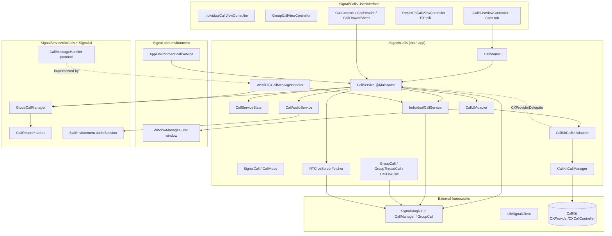
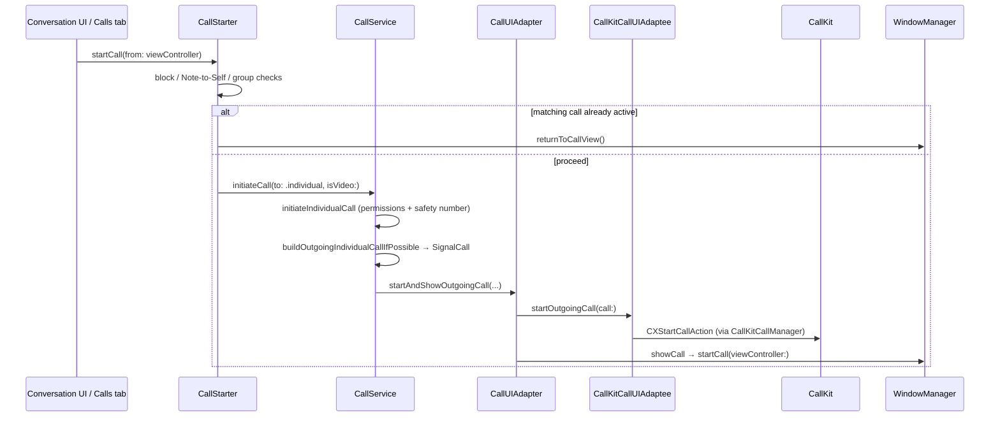

# `Signal/Calls/` — App-Level Calling Subsystem

Documentation of the **main-app (`Signal/` target) calling subsystem**: the live
`CallService`, the per-call app-side state models, the CallKit / audio / WebRTC
integration glue, and the entire calling **UI** (`Signal/Calls/UserInterface/`).

This set treats `SignalServiceKit/` and `SignalUI/` as **boundaries**: it documents
*how the app target uses them*, not their internals. The framework-level,
UI-independent calling logic (protocols, persistence, SFU/HTTP clients, sync-message
handling, RingRTC configuration) lives in `SignalServiceKit/Calls/` and is documented
separately in [../../SignalServiceKit/Calls/](../../SignalServiceKit/Calls/). Where the
two overlap, this doc points across that boundary rather than restating it.

Signalling and media transport are implemented by the external **`SignalRingRTC`**
framework (a Swift wrapper over RingRTC/WebRTC) and **`LibSignalClient`**. This
subsystem is primarily the *integration layer* between those frameworks, the app's
window/UI layer, CallKit, the audio session, and `SignalServiceKit`'s data/model/network
stack.

> **Confidence labels.** Every documented claim carries a confidence label:
> **[High]** = directly read from the cited source in this session;
> **[Medium]** = inferred from strong local evidence (signatures, call sites,
> comments) but not every path was traced in full;
> **[Low]** = plausible inference from naming alone, not fully verified.
> Citations use `path:line` from the state of the tree at authoring time; line
> numbers may drift as the code changes — relocate via the symbol name. Any uncited
> claim about behavior is a defect.

## Scope

In scope — all under `Signal/Calls/` and `Signal/Calls/UserInterface/`:

- **Live coordinator**: `CallService` (`Signal/Calls/CallService.swift:18`) and its
  current-call container `CallServiceState` (`Signal/Calls/CallServiceState.swift:21`).
- **App-side call models**: `SignalCall` / `CallMode` (`Signal/Calls/SignalCall.swift`),
  `IndividualCall` (`Signal/Calls/IndividualCall.swift`), `GroupCall` /
  `GroupThreadCall` / `CallLinkCall`
  (`Signal/Calls/GroupCall.swift`, `GroupThreadCall.swift`, `CallLinkCall.swift`),
  `CommonCallState` (`Signal/Calls/CommonCallState.swift`), `CallTarget`
  (`Signal/Calls/CallTarget.swift`), `CurrentCall` (`Signal/Calls/CurrentCall.swift`).
- **Per-mode services**: `IndividualCallService` (`Signal/Calls/IndividualCallService.swift`),
  group-call accessory/record helpers (`GroupCallAccessoryMessageDelegate.swift`,
  `GroupCallRecordRingingCleanupManager.swift`, `GroupCallRemoteVideoManager.swift`,
  `AdHocCallStateObserver.swift`).
- **Call starting / routing**: `CallStarter` (`Signal/Calls/CallStarter.swift`),
  `WebRTCCallMessageHandler` (`Signal/Calls/WebRTCCallMessageHandler.swift`).
- **CallKit / audio / WebRTC glue**: `CallUIAdapter` + `CallUIAdaptee`
  (`UserInterface/CallUIAdapter.swift`), `CallKitCallUIAdaptee`
  (`UserInterface/CallKitCallUIAdaptee.swift`), `SimulatorCallUIAdaptee`
  (`UserInterface/SimulatorCallUIAdaptee.swift`), `CallKitCallManager`
  (`Signal/Calls/CallKitCallManager.swift`), `CallKitIdStore`
  (`Signal/Calls/CallKitIdStore.swift`), `CallAudioService`
  (`Signal/Calls/CallAudioService.swift`), `AudioSource` / `AudioSession+WebRTC`,
  `RTCIceServerFetcher` (`Signal/Calls/RTCIceServerFetcher.swift`).
- **Call links (app side)**: `CallLinkManager`, `CallLinkStateUpdater`,
  `CallLinkAdminManager`, `CallLinkFetchJobRunner`, `CallLinkUpdateMessageSender`,
  plus the call-link UI under `UserInterface/`.
- **Calling UI**: `IndividualCallViewController`, `GroupCallViewController`,
  `CallsListViewController` (the Calls tab), `CallControls`, `CallHeader`,
  `CallDrawerSheet`, `CallMemberView` family, `ReturnToCallViewController` (the
  picture-in-picture pill), reactions/raised-hands overlays, and the call-quality
  survey (`UserInterface/Survey/`).
- **Misc**: `CallStrings` (`Signal/Calls/CallStrings.swift`), `CallRecordLoader`
  (`Signal/Calls/CallRecordLoader.swift`), `CallQualitySurvey`, `CallingAssetsFetcher`.

Out of scope (documented elsewhere): the `CallMessageHandler` protocol,
`GroupCallManager`, `GroupCallPeekClient`, `CallHTTPClient`, `CallRecordStore`, the
various `*SyncMessageManager`s, and RingRTC field-trial configuration — all in
[../../SignalServiceKit/Calls/](../../SignalServiceKit/Calls/).

## One-paragraph orientation

`CallService` is the `@MainActor` hub that exists while the main app runs; it owns the
`CallManager<SignalCall, CallService>` from `SignalRingRTC` and wires itself as that
manager's delegate (`Signal/Calls/CallService.swift:18-19,110-152`) **[High]**. It is
constructed once during launch and stored on `AppEnvironment`
(`Signal/AppLaunch/AppLifecycleManager.swift:511`,
`Signal/AppLaunch/AppEnvironment.swift:40,136`), so the rest of the app reaches calling
behavior through `AppEnvironment.shared.callService` **[High]**. The *current* call is
held in `CallServiceState` as an `AtomicValue<SignalCall?>` that must be written on the
main thread (`Signal/Calls/CallServiceState.swift:26-50`) **[High]**. Outbound calls are
started through `CallStarter` (block/permission/registration checks) →
`CallService.initiateCall(to:isVideo:)` (`Signal/Calls/CallService.swift:817`) **[High]**.
Inbound call messages arrive via `WebRTCCallMessageHandler` (the production
`CallMessageHandler`), which routes 1:1 signalling to `IndividualCallService` and group
updates to the `GroupCallManager` (`Signal/Calls/WebRTCCallMessageHandler.swift:9-156`)
**[High]**. System call UI (incoming/outgoing reporting, mute, hangup) is mediated by
`CallUIAdapter` and its CallKit-backed adaptee; the on-screen call UI is presented in a
dedicated window via `WindowManager`
(`Signal/Calls/UserInterface/CallUIAdapter.swift:252-273`,
`Signal/AppLaunch/WindowManager.swift:334`) **[High]**.

## High-level architecture

[High] `CallService` builds the `CallManager`, retains the `CallHTTPClient` that backs
it, and constructs the per-mode services inside its initializer
(`Signal/Calls/CallService.swift:110-152`). [High] The CallKit path is `CallService →
CallUIAdapter → CallUIAdaptee`; on device the adaptee is `CallKitCallUIAdaptee` (which is
both a `CallUIAdaptee` and a `CXProviderDelegate`), on the simulator it is
`SimulatorCallUIAdaptee` (`Signal/Calls/UserInterface/CallUIAdapter.swift:68-74`). [High]
`CallKitCallUIAdaptee` delegates transaction requests to `CallKitCallManager`, which wraps
`CXCallController` and builds `CX*CallAction`s
(`Signal/Calls/CallKitCallManager.swift:21,128-200`).

## Key types and responsibilities

### `CallService` — the live coordinator  [High]
`@MainActor final class CallService` manages events for both 1:1 and group calls while
the app runs (`Signal/Calls/CallService.swift:13-19`). It:

- Owns `callManager: CallManager<SignalCall, CallService>` and is its delegate
  (`Signal/Calls/CallService.swift:21-24,150`).
- Holds the per-mode service `individualCallService`, plus
  `groupCallRemoteVideoManager`, `callLinkManager`, `callLinkFetcher`,
  `callLinkStateUpdater`, and the lazily-built `callUIAdapter`
  (`Signal/Calls/CallService.swift:42-48,116-146`).
- Reaches `SignalServiceKit`/`SignalUI` singletons lazily through
  `DependenciesBridge.shared`, `SSKEnvironment.shared`, and `SUIEnvironment.shared`
  (e.g. `groupCallManager`, `audioSession`, `callLinkStore`,
  `Signal/Calls/CallService.swift:26-39`).
- Observes app lifecycle (`OWSApplicationDidEnterBackground` /
  `…DidBecomeActive`), reachability, call-preference changes, and (on phones) device
  orientation to drive data-mode reconfiguration and icon rotation
  (`Signal/Calls/CallService.swift:154-181,689-740`).
- Schedules periodic `Cron` jobs to fetch and clean up calling assets (ringtones etc.)
  via `CallingAssetsFetcher` (`Signal/Calls/CallService.swift:189-220`).
- Exposes the call-start entry point `initiateCall(to:isVideo:)`
  (`Signal/Calls/CallService.swift:817`) and the group-call builders
  `buildAndConnectGroupCall` / `buildAndConnectCallLinkCall`
  (`Signal/Calls/CallService.swift:629,670`), and the failure handler
  `handleFailedCall(…)` (`Signal/Calls/CallService.swift:520`).

### `CallServiceState` — current-call container  [High]
Wraps an `AtomicValue<SignalCall?>`. The current call **must be set on the main thread**
(`setCurrentCall` is `@MainActor`), though it may be *read* off-main for a quick check,
with the caveat that other call state may race
(`Signal/Calls/CallServiceState.swift:21-50`). It fans out `CallServiceStateObserver`
notifications (`didUpdateCall(from:to:)`) and a `CallServiceStateDelegate` termination
callback. An `owsAssertDebug` enforces that the app never transitions directly from one
call to another (one must go to `nil` first)
(`Signal/Calls/CallServiceState.swift:40-44`) **[High]**.

### `SignalCall` / `CallMode` — the per-call model  [High]
`SignalCall` is a `CallManagerCallReference` whose single `mode` is one of
`.individual(IndividualCall)`, `.groupThread(GroupThreadCall)`, or
`.callLink(CallLinkCall)` (`Signal/Calls/SignalCall.swift:177-220`). `CallMode` bridges the
1:1 and group concepts behind common accessors (`joinState`, `isOutgoingAudioMuted`,
`caller`, `videoCaptureController`, `matches(_:)`)
(`Signal/Calls/SignalCall.swift:12-158`). `CallError` enumerates terminal failure causes
and whether a call should be dropped silently (DND / blocked contact)
(`Signal/Calls/SignalCall.swift:160-175`).

- **`IndividualCall`** — data model for a WebRTC 1:1 voice/video call. Its
  `CallState` enum encodes the full 1:1 state machine, including the two-phase local
  ringing (`localRinging_Anticipatory` vs `localRinging_ReadyToAnswer`) that exists
  because CallKit may ring before RingRTC is ready to answer
  (`Signal/Calls/IndividualCall.swift:13-36,71-74`). State **must only be accessed on
  the main queue** (`Signal/Calls/IndividualCall.swift:70-73`) **[High]**.
- **`GroupCall`** — base class wrapping `SignalRingRTC.GroupCall` and conforming to
  `GroupCallDelegate`; it maintains observers, raised hands, and the connected-date
  bookkeeping, and auto-mutes on join above a member threshold
  (`Signal/Calls/GroupCall.swift:52-116`). Its two concrete subclasses are
  `GroupThreadCall` (adds ring state/restrictions and group-membership watching,
  `Signal/Calls/GroupThreadCall.swift:14-200`) and `CallLinkCall` (adds admin passkey /
  approval semantics, `Signal/Calls/CallLinkCall.swift:11-45`).
- **`CommonCallState`** — shared bookkeeping across all modes: a per-call `localId:
  UUID` (used by CallKit), the monotonic `connectedDate`, the audio activity, and the
  `SystemState` machine (`notReported → pending → reported → removed`) that tracks
  whether the call has been reported to the OS (`Signal/Calls/CommonCallState.swift`)
  **[High]**.
- **`CallTarget`** — the "what to call" value (`.individual(TSContactThread)`,
  `.groupThread(GroupIdentifier)`, `.callLink(CallLink)`), plus `canCall`
  extensions that gate Note-to-Self and non-full/terminated groups
  (`Signal/Calls/CallTarget.swift`) **[High]**.
- **`CurrentCall`** — a read-only façade over the shared `AtomicValue<SignalCall?>`
  conforming to `CurrentCallProvider` so framework code can ask "is there a current
  call / what's its group id" without importing the app model
  (`Signal/Calls/CurrentCall.swift`) **[High]**.

### `IndividualCallService` — 1:1 call logic  [High]
`final class IndividualCallService: CallServiceStateObserver` holds the `callManager` and
`callServiceState` and drives the 1:1 lifecycle: outgoing call setup, and the inbound
`handleReceivedOffer/Answer/IceCandidates/Hangup/Busy` handlers that
`WebRTCCallMessageHandler` calls into (`Signal/Calls/IndividualCallService.swift:16-70`,
`Signal/Calls/WebRTCCallMessageHandler.swift:34-100`). It also owns the 1:1 call timer
started/stopped on current-call changes (`…IndividualCallService.swift:48-57`). Its state
"should only be accessed on the main queue" (`…IndividualCallService.swift:14`) **[High]**.
Deeper 1:1 semantics (offer handling, timeouts) are also covered framework-side in
[../../SignalServiceKit/Calls/individual-calls.md](../../SignalServiceKit/Calls/individual-calls.md).

### `CallStarter` — pre-call checks  [High]
A value type that attempts to start a call "if the conditions are met," performing: unblock
sheet if the thread is blocked; return-to-existing-call if a matching call is ongoing;
rejecting Note-to-Self; rejecting announcement-only groups; requiring a V2 group where the
local user is a full member; then profile-whitelisting and finally calling
`CallService.initiateCall(to:isVideo:)`
(`Signal/Calls/CallStarter.swift:79-137`). Separately, the static
`prepareToStartCall(from:shouldAskForCameraPermission:)` checks registration and prompts
for microphone (and optionally camera) permission before any call begins
(`Signal/Calls/CallStarter.swift:170-205`) **[High]**.

### `WebRTCCallMessageHandler` — inbound routing  [High]
The production implementation of the framework's `CallMessageHandler` protocol. It is a
thin router: 1:1 envelope types (`offer`/`answer`/`iceUpdate`/`hangup`/`busy`) go to
`callService.individualCallService`; `opaque` RingRTC messages are forwarded to
`callManager.receivedCallMessage(…)` on the main queue; group-call update messages trigger
`groupCallManager.peekGroupCallAndUpdateThread(…)`
(`Signal/Calls/WebRTCCallMessageHandler.swift:34-156`) **[High]**. The protocol itself and
its envelope types are documented in
[../../SignalServiceKit/Calls/call-message-handling.md](../../SignalServiceKit/Calls/call-message-handling.md).

## CallKit, audio, and WebRTC integration

### `CallUIAdapter` + `CallUIAdaptee`  [High]
`CallUIAdapter` is the app-facing "notify the user of call activity" surface. It selects a
concrete `CallUIAdaptee` once (rebuilt when relevant call settings change): `CallKitCallUIAdaptee`
on device, `SimulatorCallUIAdaptee` under `targetEnvironment(simulator)`
(`Signal/Calls/UserInterface/CallUIAdapter.swift:60-91`). The adapter:

- Starts the shared audio activity before reporting/starting a call so the audio session
  is not torn down mid-call (`…CallUIAdapter.swift:95-99,146-150`).
- Translates CallKit incoming-call errors (`filteredByDoNotDisturb`,
  `filteredByBlockList`) into `CallError` and routes them through
  `callService.handleFailedCall(…)` (`…CallUIAdapter.swift:109-130`).
- Builds and shows the on-screen call UI in `showCall(_:)`: an
  `IndividualCallViewController` for 1:1, or a `GroupCallViewController.load(…)` for both
  group-thread and call-link calls, then hands the VC to
  `AppEnvironment.shared.windowManagerRef.startCall(viewController:)`
  (`…CallUIAdapter.swift:251-273`) **[High]**.
- Routes mute specifically through the adaptee ("with CallKit, muting is handled by a
  `CXAction`"), while camera-source changes go straight to the `CallService`
  (`…CallUIAdapter.swift:275-290`) **[High]**.

### `CallKitCallUIAdaptee` and `CallKitCallManager`  [High]
`CallKitCallUIAdaptee` is both a `CallUIAdaptee` and `@preconcurrency CXProviderDelegate`
(`Signal/Calls/UserInterface/CallKitCallUIAdaptee.swift:16`). Notable integration details,
documented in code comments:

- A **single shared `CXProvider`** is maintained across adaptee rebuilds via a
  singleton, because instantiating more than one `CXProvider` can cause missed call
  transactions (`…CallKitCallUIAdaptee.swift:23-37`) **[High]**.
- The provider advertises `supportsVideo = true`, `maximumCallsPerCallGroup = 1`, and
  `supportedHandleTypes = [.phoneNumber, .generic]`; a long comment explains why
  `maximumCallGroups` is left at the default of 2 (rapid offer/hangup sequences could
  otherwise hit `…MaximumCallGroupsReached`) (`…CallKitCallUIAdaptee.swift:40-78`) **[High]**.
- `includesCallsInRecents` is tied to the user's "system call log" preference
  (`…CallKitCallUIAdaptee.swift:71`) **[High]**.

`CallKitCallManager` wraps `CXCallController(queue: .main)` and turns intents into
`CXStartCall/EndCall/SetHeld/SetMuted/AnswerCall` transactions
(`Signal/Calls/CallKitCallManager.swift:21,128-200`). It encodes the call target into a
`CXHandle` using prefixed handle schemes — `Signal:` (anonymous), `SignalGroup:`,
`SignalCall:` — and, for anonymous/call-link handles, persists the mapping via
`CallKitIdStore` so an inbound system intent can be decoded back into a `CallTarget`
(`Signal/Calls/CallKitCallManager.swift:24-123`) **[High]**. `CallKitIdStore`
(`Signal/Calls/CallKitIdStore.swift`) is that handle↔target persistence layer **[Medium]**.

### `CallAudioService`  [High]
`CallAudioService` conforms to both `IndividualCallObserver` and `GroupCallObserver`, and is
registered as a `CallServiceStateObserver` so it tracks the current call
(`Signal/Calls/CallAudioService.swift:17-19`, registered at
`Signal/Calls/CallService.swift:76-80`). It configures the RTC audio session (deferring the
Record-permission prompt until the call connects) and observes `AVAudioSession` route
changes, interruptions, and media-services reset/lost notifications
(`Signal/Calls/CallAudioService.swift:40-70`) **[High]**. The underlying audio session
object itself lives in `SignalUI` (`SUIEnvironment.shared.audioSessionRef`) — this class is
the call-specific policy layer on top of it **[Medium]**. `AudioSource` and
`AudioSession+WebRTC` are small supporting types for route/source modeling **[Medium]**.

### `RTCIceServerFetcher`  [High]
Fetches TURN/STUN relay servers from the Signal service (`callingRelaysRequest`), parses the
`CallingRelays` JSON into `RTCIceServer`s (IP-bearing URLs ordered first), and caches the
result until the server-provided TTL expires using a process-wide lock
(`Signal/Calls/RTCIceServerFetcher.swift`) **[High]**.

## Calling UI (`UserInterface/`)

- **`IndividualCallViewController`** — the full-screen 1:1 call screen; an
  `OWSViewController` that is an `IndividualCallObserver` and conforms to
  `CallViewControllerWindowReference`
  (`Signal/Calls/UserInterface/IndividualCallViewController.swift:14,1217`) **[High]**.
- **`GroupCallViewController`** — the full-screen group / call-link screen. Entry
  points: `static load(call:groupCall:tx:)` builds the VC for an already-joined call,
  while `static presentLobby(forGroupId:…)` / `presentLobby(for: callLink)` open the
  pre-join lobby — the latter two are what `CallService.initiateCall` calls for group and
  call-link targets (`Signal/Calls/UserInterface/GroupCallViewController.swift:274,345,359`,
  `Signal/Calls/CallService.swift:819-823`) **[High]**.
- **`CallsListViewController`** — the **Calls tab**. It is a `HomeTabViewController` and
  simultaneously a `CallServiceStateObserver` and `GroupCallObserver`
  (`Signal/Calls/UserInterface/CallsListViewController.swift:21`), backed by the
  `+ViewModelLoader` extension and `CallRecordLoader`
  (`Signal/Calls/CallRecordLoader.swift`). It can return to an active call via
  `windowManagerRef.returnToCallView()`
  (`…CallsListViewController.swift:2183`) **[High]**. The underlying `CallRecord` data and
  Calls-Tab queries are framework-side; see
  [../../SignalServiceKit/Calls/call-records-and-sync.md](../../SignalServiceKit/Calls/call-records-and-sync.md).
- **`ReturnToCallViewController`** — the picture-in-picture "pill" shown when a call is
  active but its full screen is dismissed. It defines the
  `CallViewControllerWindowReference` protocol that both call VCs implement, and
  `WindowManager` owns an instance to display across the app
  (`Signal/Calls/UserInterface/ReturnToCallViewController.swift:10,25`,
  `Signal/AppLaunch/WindowManager.swift:82-86,334,508-522`) **[High]**.
- **Shared call controls / chrome**: `CallControls`, `CallButton`, `CallHeader`,
  `CallDrawerSheet` (+ `CallDrawerSheetDataSource`), `IncomingCallControls`,
  `CallControlsOverflowView`, `CallControlsConfirmationToast`,
  `SupplementalCallControlsForFullscreenLocalMember`, `FlipCameraTooltip` **[Medium]**.
- **Member rendering**: the `CallMemberView` family (`CallMemberView`,
  `CallMemberVideoView`, `CallMemberCameraOffView`, `CallMemberChromeOverlayView`,
  `CallMemberWaitingAndErrorView`), `LocalVideoView`, `RemoteVideoView`, and the group
  grid/overflow views (`GroupCallVideoGrid`, `GroupCallVideoGridLayout`,
  `GroupCallVideoOverflow`, `GroupCallVideoContextMenuConfiguration`) **[Medium]**.
- **In-call overlays**: reactions (`ReactionsSink`, `ReactionsBurstView`,
  `IncomingReactionsView`), raised hands (`RaisedHandsToast`), remote-mute
  (`RemoteMuteToast`), group notifications/errors/toasts
  (`GroupCallNotificationView`, `GroupCallErrorView`, `GroupCallSwipeToastView`),
  and `NewCallViewController` **[Medium]**.
- **Call-link UI**: `CallLinkViewController`, `CreateCallLinkViewController`,
  `EditCallLinkNameViewController`, the approval flow
  (`CallLinkApprovalViewModel`, `CallLinkApprovalRequestView`,
  `CallLinkApprovalRequestDetailsSheet`, `CallLinkBulkApprovalSheet`),
  `CallLinkProfileKeySharingManager`, `CallLinkDeleter` **[Medium]**. The call-link
  model/persistence is framework-side; see
  [../../SignalServiceKit/Calls/call-links.md](../../SignalServiceKit/Calls/call-links.md).
- **Call-quality survey** (`UserInterface/Survey/`): `CallQualitySurveyNavigation`,
  `CallQualitySurveyRatingViewController`, `CallQualitySurveyIssuesViewController`,
  `CallQualitySurveyCustomIssueViewController`, `CallQualitySurveyDebugLogViewController`,
  driven by `CallQualitySurvey` / `CallQualitySurveyManager`
  (`Signal/Calls/CallQualitySurvey.swift`). The survey is shown from
  `GroupCall.groupCall(onEnded:…)` (`Signal/Calls/GroupCall.swift:223`
  handler) **[High]**.

## Important data flows and state

### Outgoing 1:1 call

[High] `CallStarter.startCall(from:)` performs the gating checks and either returns to an
existing matching call or calls `CallService.initiateCall(to:isVideo:)`
(`Signal/Calls/CallStarter.swift:79-137`). [High] For an individual target,
`initiateCall` runs `initiateIndividualCall`, which prepares permissions, presents a
`SafetyNumberConfirmationSheet` as needed, then calls
`callUIAdapter.startAndShowOutgoingCall(…)`
(`Signal/Calls/CallService.swift:817-854`). [High] `startAndShowOutgoingCall` builds the
call via `buildOutgoingIndividualCallIfPossible`, requests the CallKit transaction, and
shows the call window (`Signal/Calls/UserInterface/CallUIAdapter.swift:187-212,251-273`).

### Group / call-link call
[High] `initiateCall` does **not** build the call eagerly for group/link targets; it opens
the lobby UI (`GroupCallViewController.presentLobby(…)`), and the actual RingRTC
`GroupCall` is constructed later via `CallService.buildAndConnectGroupCall` /
`buildAndConnectCallLinkCall` and connected with `joinGroupCallIfNecessary`
(`Signal/Calls/CallService.swift:629,670,754,819-823`). Group peeking/ringing and the SFU
clients are framework-side — see
[../../SignalServiceKit/Calls/group-calls.md](../../SignalServiceKit/Calls/group-calls.md).

### Inbound signalling
[High] `WebRTCCallMessageHandler.receivedEnvelope(…)` is called by the framework message
pipeline; 1:1 envelope types feed `IndividualCallService`, `opaque` RingRTC messages are
handed to `callManager.receivedCallMessage(…)`, and group updates go through
`GroupCallManager.peekGroupCallAndUpdateThread(…)`
(`Signal/Calls/WebRTCCallMessageHandler.swift:34-156`).

### Current-call lifecycle
[High] The single current call lives in `CallServiceState` and is observed by
`CallService`, `CallAudioService`, `GroupCallRemoteVideoManager`, the group accessory
message handler, and the UI (`Signal/Calls/CallService.swift:76-80,152`,
`Signal/Calls/CallServiceState.swift:60-85`). Termination clears the current call (if it
matches) and notifies the `CallServiceStateDelegate`
(`Signal/Calls/CallServiceState.swift:52-66`).

## Concurrency and UI considerations

- **Main-actor isolation.** `CallService` is annotated `@MainActor`
  (`Signal/Calls/CallService.swift:17`). `IndividualCall` and `IndividualCallService`
  state is documented as main-queue-only (`Signal/Calls/IndividualCall.swift:70-73`,
  `Signal/Calls/IndividualCallService.swift:14`). `CallServiceState.setCurrentCall` is
  `@MainActor`; reads are allowed off-main but may observe racing auxiliary state
  (`Signal/Calls/CallServiceState.swift:26-50`) **[High]**.
- **Atomic current-call storage.** The current call is an `AtomicValue<SignalCall?>`
  so framework code (`CurrentCall`/`CurrentCallProvider`) can poll it from any thread
  without blocking on the main actor (`Signal/Calls/CurrentCall.swift`,
  `Signal/Calls/CallServiceState.swift:21-33`) **[High]**.
- **CallKit async nature.** CallKit actions are asynchronous `CXTransaction`s on
  `CXCallController(queue: .main)`; the single-shared-`CXProvider` and
  default-`maximumCallGroups` decisions are explicitly motivated by race conditions in
  rapid call/hangup sequences (`Signal/Calls/CallKitCallManager.swift:21`,
  `Signal/Calls/UserInterface/CallKitCallUIAdaptee.swift:23-78`) **[High]**.
- **CallKit-before-RingRTC ringing.** The 1:1 `CallState` has two local-ringing phases
  (`localRinging_Anticipatory`, `localRinging_ReadyToAnswer`) and an `accepting` state
  precisely because CallKit may ring and the user may answer before RingRTC is ready
  (`Signal/Calls/IndividualCall.swift:19-30`) **[High]**.
- **Debounced group updates.** `GroupCall` debounces remote-device-state changes by
  0.25s via a cancellable `Task` so the group UI is not spammed by membership churn
  (`Signal/Calls/GroupCall.swift` `onRemoteDeviceStatesChanged`) **[High]**.
- **Audio session continuity.** The adapter starts the call's `AudioActivity` before
  reporting/starting a call to prevent the audio session from being torn down mid-call,
  and `GroupCall` enables RTC audio on join
  (`Signal/Calls/UserInterface/CallUIAdapter.swift:95-99,146-150`,
  `Signal/Calls/GroupCall.swift` `onLocalDeviceStateChanged`) **[High]**.
- **Dedicated call window.** The call UI is presented in its own window via
  `WindowManager.startCall(viewController:)`, and `ReturnToCallViewController` provides a
  system-wide picture-in-picture pill to return to it; both call VCs conform to
  `CallViewControllerWindowReference` for this
  (`Signal/AppLaunch/WindowManager.swift:82-86,334,508-522`,
  `Signal/Calls/UserInterface/ReturnToCallViewController.swift:10`) **[High]**.
- **Orientation.** On phones (not iPad), `CallService` listens to
  `orientationDidChange` and rotates in-call *icons* (not the whole screen), suppressing
  rotation for audio-only 1:1 and for group calls
  (`Signal/Calls/CallService.swift:170-180,689-740`) **[High]**.

## Interactions with the rest of the app

- **`AppEnvironment`** constructs and stores the single `CallService` during launch;
  the whole app reaches calling via `AppEnvironment.shared.callService`
  (`Signal/AppLaunch/AppLifecycleManager.swift:511`,
  `Signal/AppLaunch/AppEnvironment.swift:40,136`) **[High]**.
- **`WindowManager`** owns the call window and the return-to-call pill
  (`Signal/AppLaunch/WindowManager.swift:82-86,334,508-522`) **[High]**.
- **Conversation / thread settings / notifications** start or return to calls through
  `CallStarter` / `AppEnvironment.shared.callService` and
  `windowManagerRef.returnToCallView()` (e.g.
  `Signal/src/ViewControllers/ThreadSettings/ConversationHeaderBuilder.swift:815-818`,
  `Signal/Notifications/NotificationActionHandler.swift:12,350`) **[Medium]**.
- **`SignalServiceKit`** provides the inbound `CallMessageHandler` contract (implemented
  here by `WebRTCCallMessageHandler`), `GroupCallManager`, call-record stores, call-link
  persistence, and network requests; **`SignalUI`** provides the audio session, video
  capture/preview, and shared call-link helpers. These boundaries are documented under
  [../../SignalServiceKit/Calls/](../../SignalServiceKit/Calls/).

## Conventions

- **Citations** are `path:line` (specific declaration) or `path` (file). Line numbers
  reflect the working tree at authoring time and may drift; relocate via the symbol
  name. Every factual claim about behavior cites a path.
- **Confidence labels** (`[High]`/`[Medium]`/`[Low]`) are defined at the top of this
  document. Any uncited claim is a defect.
- This document stays on the app side of the `SignalServiceKit`/`SignalUI` boundary and
  defers framework internals to their own docs.
