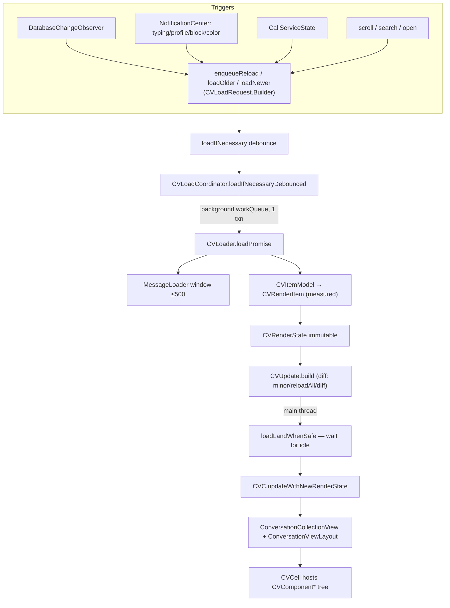

# `Signal/ConversationView/` — The Conversation (Chat History) Subsystem

The first-party app's **open-conversation screen**: the scrollable chat history,
its input toolbar, and the asynchronous load/measure/render pipeline that turns
database interactions into cells. This is the app-target subsystem rooted at
`Signal/ConversationView/`.

> **Distinct from [`../../SignalUI/ConversationView.md`](../../SignalUI/ConversationView.md).**
> That doc covers the *shared, low-level `CV*` rendering primitives* that live in
> `SignalUI/ConversationView/` (e.g. `CVTextValue`, `CVText`, `CVCellMeasurement`,
> `CVView`). This doc covers the *app-side conversation screen* in `Signal/` that
> consumes those primitives — the view controller, its load coordinator, the
> component tree, and the cells. The `CV` prefix is shared across both because the
> app-side types build on the shared ones.

> Confidence: **[High]** read in full / declaration located this session;
> **[Medium]** inferred from signatures, names, and cross-file convention (not every
> file read line-by-line); **[Low]** inferred from naming alone. Citations are
> `path:line` or `path`. Line numbers reflect the working tree at authoring time and
> may drift; relocate via the symbol name. **Any uncited claim is a defect.** Where
> the source gives no evidence of intent, the text says so. Directory listings were
> produced by listing the working tree this session **[High]**.

## Responsibility

Present a single `TSThread`'s message history and let the user read, scroll,
search, select, react to, and reply/send within it. Concretely the subsystem:

- Owns `ConversationViewController` (CVC), the `UIViewController` for an open chat
  (`Signal/ConversationView/ConversationViewController.swift:37`) **[High]**.
- Runs an **asynchronous load pipeline** that reads interactions off the main
  thread, builds immutable render state, measures cells, and lands the result into
  a `UICollectionView` while preserving scroll position
  (`Signal/ConversationView/Loading/CVLoadCoordinator.swift`,
  `Signal/ConversationView/Loading/CVLoader.swift`) **[High]**.
- Hosts the **input toolbar** (text entry, attachments, voice memos, quoted-reply
  preview) via `ConversationInputToolbar` (`~135 KB`,
  `Signal/ConversationView/ConversationInputToolbar.swift`) **[High]** (listed; size
  from tree).
- Renders each history item through a **component tree** (`CVComponent*`) into
  reusable cells (`CVCell`), with manual (non-Auto Layout) measurement for perf
  (`Signal/ConversationView/Components/`, `Signal/ConversationView/CVCell.swift:34`)
  **[High]**.

This subsystem is reached from `ConversationSplitViewController`
(`SignalApp.presentConversationForThread`), per the app map
([../view-controllers-map.md](../view-controllers-map.md) §"The conversation UI")
**[High]**.

## One-paragraph orientation

`ConversationViewController.load(threadViewModel:action:focusMessageId:tx:)` is the
entry point (`ConversationViewController.swift:67`) **[High]**: inside a read
transaction it decides where to open (focus message → oldest-unread divider → last
visible interaction via `lastVisibleInteractionId`), resolves the chat color and
wallpaper, builds a `ConversationStyle`, loads the `ConversationViewModel`, and
constructs the CVC (`ConversationViewController.swift:80`-`:93`) **[High]**. The CVC's
mutable UI state lives in `CVViewState` (`CVViewState.swift:18`); the asynchronous data
flow is driven by `CVLoadCoordinator` (`CVLoadCoordinator.swift:50`), which the CVC
also installs as its collection view's `dataSource`/`delegate` and layout delegate
(`ConversationViewController.swift` `createContents`,
`collectionView.delegate`/`dataSource = self.loadCoordinator` at `:247`-`:248`)
**[High]**. Each load produces an immutable `CVRenderState` (`CVRenderState.swift:13`)
of `CVRenderItem`s (`CVRenderItem.swift:8`); the coordinator diffs it against the
previous render state into a `CVUpdate` (`CVUpdate.swift:9`) and lands it onto the
collection view only when it is "safe" (no animations/context menu in flight)
(`CVLoadCoordinator.swift` `loadLandWhenSafe`, `:594`) **[High]**.

## Key types

### View controller & its state

- **`ConversationViewController`** — the screen. A `final class: OWSViewController`
  (`ConversationViewController.swift:37`) **[High]**. It is deliberately thin and
  split across **~35 `ConversationViewController+*.swift` extension files** (Scroll,
  Selection, Banners, BottomBar, MessageActions, MessageRequest, GiftBadges,
  CVComponentDelegate, ConversationInputToolbarDelegate, PinnedMessages, …) listed in
  the tree **[High]**. It holds `viewState`, `loadCoordinator`, `layout`,
  `collectionView`, and `searchController` (`:40`-`:45`) **[High]**.
- **`CVViewState`** — "a simple place to hang CVC's mutable view state," main-thread
  only (`CVViewState.swift:17`-`:18`) **[High]**. Holds the `ConversationStyle`, the
  `inputToolbar`, UI mode (`ConversationUIMode`), scroll bookkeeping, gesture
  recognizers/handlers, selection/spoiler/text-expansion/swipe sub-states
  (`spoilerState` at `CVViewState.swift:81`), the `CVMediaCache`, and per-session
  ephemeral sets (expanded collapse-sets `:156`, shaken gift IDs `:148`,
  manually-canceled downloads `:160`) **[High]**. A large extension exposes these as
  computed accessors on CVC itself (`CVViewState.swift:255`+) **[High]**.
- **`ConversationUIMode`** — `.normal` / `.search` / `.selection`; `.selection` is the
  only mode with selection UI (`ConversationViewController.swift:9`) **[High]**.
- **`ConversationViewAction`** — the "on open" action (`.compose`, `.voiceCall`,
  `.videoCall`, `.groupCallLobby`, `.newGroupActionSheet`, `.updateDraft`), consumed in
  `viewDidAppear` (`ConversationViewController.swift:25`, switch at
  `ConversationViewController.swift:425`) **[High]**.
- **`ConversationViewModel`** — a small immutable snapshot loaded in a transaction:
  group-call-in-progress, is-system-contact, verification/official badge, and unread
  mention message IDs (`ConversationViewModel.swift:9`, `load(for:tx:)` at `:20`)
  **[High]**.
- **`CVPresentationStatus`** — a monotonic lifecycle enum
  (`notYetPresented`→`firstViewWillAppearHasBegun`→…→`firstViewDidAppearHasCompleted`)
  used to gate work and handle the appearance/first-load race
  (`CVViewState.swift:464`) **[High]**.

### The load pipeline (`Loading/`)

- **`CVLoadCoordinator`** — the orchestrator (`CVLoadCoordinator.swift:50`) **[High]**.
  It owns the current `renderState`, the `MessageLoader`, and a coalescing
  `CVLoadRequest.Builder`; subscribes to `DatabaseChangeObserver` and many
  `NotificationCenter` events (typing, profile/block/chat-color changes, recipient
  association) plus `CallServiceStateObserver`, converting each into an
  `enqueueReload…` call (`CVLoadCoordinator.swift:121`,
  `DatabaseChangeDelegate`/`CallServiceStateObserver` extensions at file end) **[High]**.
  It implements `UICollectionViewDataSource`, `UICollectionViewDelegate`,
  `UIScrollViewDelegate`, and `ConversationViewLayoutDelegate` (extensions,
  `cellForItemAt` at `CVLoadCoordinator.swift:710`) **[High]**.
- **`CVLoadRequest` / `CVLoadRequest.Builder`** — a single coalesced load request plus
  the builder that merges multiple enqueued requests (priority-ordered by
  `CVLoadType`, preserving scroll actions and cache-reuse flags)
  (`CVLoadRequest.swift`, `Builder` at `:116`, `tryToUpdateLoadType` at `:128`)
  **[High]**.
- **`CVLoadType`** — `loadInitialMapping`, `loadSameLocation`, `loadOlder`,
  `loadNewer`, `loadNewest`, `loadPageAroundInteraction`, each with a `priority` used
  for arbitration (`CVLoadRequest.swift:8`) **[High]**.
- **`CVLoader`** — "performs a single load" (`CVLoader.swift:11`). `loadPromise()`
  (`:36`) runs on a background work queue, does the entire load **inside one read
  transaction** for coherency, loads interactions via `MessageLoader`, builds
  `CVItemModel`s and `CVRenderItem`s, measures cells, and returns a `CVUpdate`
  (`CVLoader.swift:50`-`:51` "single transaction" comment) **[High]**.
- **`MessageLoader`** — the paging/windowing engine (`~42 KB`,
  `Loading/MessageLoader.swift:59`) **[High]**. Keeps an LRU-capped window
  (`maxDisplayableInteractionCount = 500`, `MessageLoader.swift:14`) **[High]** of
  interactions via a cursor factory + ordered interaction fetchers
  (`modelReadCaches.interactionReadCache` then `SDSInteractionFetcherImpl`, wired in
  `CVLoadCoordinator.init`, `CVLoadCoordinator.swift:111`) **[High]**. Exposes
  `canLoadOlder`/`canLoadNewer` (`MessageLoader.swift:68`,`:72`) **[High]**.
- **`CVRenderState`** — the immutable, comprehensive snapshot of everything needed to
  render CVC at one instant (`CVRenderState.swift:11`-`:13`) **[High]**. Precomputes
  interaction-id→indexPath map, unread-indicator index path, and collapse-set parent
  map; `isEmptyInitialState` marks the pre-first-load state
  (`CVRenderState.swift:23`) **[High]**.
- **`CVUpdate`** — the diff describing how to transition from the previous render
  state to the new one: `.minor`, `.reloadAll`, or `.diff(items:shouldAnimateUpdate:)`
  (`CVUpdate.swift:9`). The initial load is always `.reloadAll`; animation is only
  allowed for same-location updates (new outgoing/incoming message at the bottom)
  (`CVUpdate.build` at `:59`, `loadInitialMapping` short-circuit at `:79`,
  `shouldAnimateUpdate` at `:147`) **[High]**.
- **`CVItemModel`** — one history item's immutable model: the `TSInteraction`, its
  `CVComponentState` (loaded from DB), its `CVItemViewState` (context-derived
  appearance), and the captured `CVCoreState` (style + media cache)
  (`CVItemModel.swift:13`) **[High]**.
- **`CVViewStateSnapshot`** / **`CVLoadContext`** / **`CVUpdateToken`** — immutable
  carriers that let the background load use a consistent view-state snapshot
  (`Loading/CVViewStateSnapshot.swift`, `Loading/CVLoadContext.swift`), and let the
  main thread capture "before" scroll state at land time (`CVUpdateToken` in
  `CVLoadCoordinator.swift:43`) **[High]**.
- **`CVAvatarBuilder`** — builds avatars during item construction
  (`Loading/CVAvatarBuilder.swift`) **[Medium]** (name + usage in `CVLoader`).

### The component tree (`Components/`)

- **`CVComponent` / `CVRootComponent` / `CVComponentBase`** — the protocol + base for
  "some renderable portion of a conversation item." Components build/configure a
  `CVComponentView`, **measure** themselves off the main thread
  (`measure(maxWidth:measurementBuilder:)`), and handle tap/double-tap/long-press/pan
  (`Components/CVComponent.swift:11`, root protocol at `:93`, base at `:121`) **[High]**.
- **`CVComponentMessage`** — the root component for ordinary messages (`~132 KB`,
  `Components/CVComponentMessage.swift`), composing child components (body text/media,
  footer, sender name/avatar, sticker, quoted reply, link preview, reactions, gift
  badge, view-once, attachments, poll, …) **[High]** (listed; role **[Medium]** —
  not read line-by-line).
- **`CVComponentState`** — the per-item state loaded from the database (`~84 KB`,
  `Components/CVComponentState.swift`); `CVComponentState.build(interaction:…)`
  (`:1011`) is the DB-driven builder (used by
  `CVLoader.buildStandaloneComponentState`, `CVLoader.swift:401`, call at `:454`)
  **[High]**.
- **`CVComponentKey`** — the enumerated set of child-component slots (`footer`,
  `bodyText`, `bodyMedia`, `reactions`, `quotedReply`, …)
  (`Components/CVComponent.swift:354`) **[High]**.
- Dedicated root components for non-message items: `CVComponentSystemMessage`,
  `CVComponentDateHeader`, `CVComponentUnreadIndicator`, `CVComponentTypingIndicator`,
  `CVComponentThreadDetails`, `CVComponentCollapseSet` — selected by
  `CVMessageCellType` in `CVLoader.buildRenderItem` (`CVLoader.swift:464`, message
  default at `:508`-`:512`) **[High]**.
- **`CVComponentDelegate`** — the callback surface the components use to drive the CVC
  (tap body text, long-press media/quote/system message, reactions, polls, audio,
  `enqueueReload`) (`Components/CVComponentDelegate.swift:23`); CVC conforms via
  `ConversationViewController+CVComponentDelegate.swift` (`~57 KB`) **[High]**.

### Cells & cell views

- **`CVCell`** — the `UICollectionViewCell` host; also `CVCellView` for hosting a cell
  **outside** the collection view (e.g. message details)
  (`CVCell.swift:29`, `CVCellView` at `:193`) **[High]**. Reuse identifiers are a small
  fixed set (`CVCellReuseIdentifier`, `CVCell.swift:16`) **[High]**.
- **`CellViews/`** — the concrete rendering views: `CVMediaView`/`CVMediaAlbumView`,
  `CVQuotedMessageView`, `CVLinkPreviewView`, `CVPollView`, `AudioMessageView`,
  `GiftBadgeView`, `CVReactionCountsView`, `MessageTimerView`, `ReusableMediaView`,
  `CVColorOrGradientView`, `CVAttachmentProgressView`, etc. **[High]** (listed; purpose
  **[Medium]** from name).

### Other notable pieces (direct members of the folder)

- **`ConversationViewLayout`** — the custom `UICollectionViewLayout` (`~43 KB`) with
  manual positioning and **scroll-continuity** support (`ScrollContinuity` enum,
  `ConversationViewLayout.swift:9`; `ConversationViewLayoutItem`/`…Delegate` protocols
  at `:52`,`:72`) **[High]**.
- **`ConversationCollectionView`** — the `UICollectionView` subclass
  (`ConversationCollectionView.swift`) **[Medium]**.
- **`ConversationInputToolbar`** (+`+VoiceMemo`, `+QuotedReplyPreview`),
  **`ConversationInputTextView`** — the compose bar **[High]** (listed; the toolbar is
  the single largest file in the subsystem).
- **`ConversationSearch.swift`** — `ConversationSearchController` used by CVC's
  `searchController` (`ConversationViewController.swift:45`,
  `ConversationSearch.swift`) **[High]**.
- **`MessageRequestView` / `MessageRequestDecliner` / `MemberRequestView` /
  `BlockingAnnouncementOnlyView` / `BlockingErrorBottomPanelView` /
  `ConversationBottomPanelView`** — the bottom-bar states shown instead of the input
  toolbar (message requests, announcement-only groups, blocking errors) **[High]**
  (listed; wiring in `ConversationViewController+BottomBar.swift` which assigns
  `requestView` to a `MessageRequestView`/`MemberRequestView`/`BlockingAnnouncementOnlyView`
  at `+BottomBar.swift:151`,`:161`,`:181`) **[High]**.
- **`MessageActions.swift` / `TSInteraction+DeleteActionSheet.swift` /
  `ResendMessagePromptBuilder.swift`** — per-message action menus and prompts
  **[High]** (listed; `MessageActions.{infoMessage,media,text}Actions` consumed in
  `ConversationViewController+CVC.swift:118`,`:123`,`:129`) **[High]**.
- **Audio playback**: `CVAudioPlayback`, `AudioAttachment`, `AudioPresentation`,
  `AudioMessagePresenter` — note CVC stops all audio on disappear via
  `AppEnvironment.shared.cvAudioPlayerRef.stopAll()`
  (`ConversationViewController.swift:490`) **[High]**.
- **`DynamicInteractions/`** — synthetic (non-DB) interactions injected into the
  stream: `TypingIndicatorInteraction`, `UnreadIndicatorInteraction`,
  `ThreadDetailsInteraction`, `DateHeaderInteraction`, `CollapseSetInteraction`,
  `DefaultDisappearingMessageTimerInteraction` **[High]** (listed).
- **`DoubleTapToEdit/`** — `SingleOrDoubleTapGestureRecognizer` (used as CVC's tap
  recognizer, `CVViewState.swift:118`) + its onboarding controller **[High]**.
- **`VoiceMessage/`** — draft state machine for voice memos
  (`VoiceMessageInProgressDraft` / `…InterruptedDraft` / `…SendableDraft`); CVC blocks
  rotation while recording (`ConversationViewController.swift:531` `shouldAutorotate`)
  **[High]**.
- **`Reactions/`** — `ReactionsDetailSheet`, `EmojiReactorsTableView`,
  `EmojiCountsCollectionView`, `InteractionReactionState` **[High]** (listed).
- **`Components/PersistableGroupUpdateItem+CVComponentSystemMessageAction.swift`** —
  maps group-update items to system-message tap actions **[Medium]** (name).

## Important data flows & state

### 1. Open → initial load → first appearance

`ConversationViewController.load(…)` chooses the open position inside a read
transaction (focus id → oldest-unread → last-visible)
(`ConversationViewController.swift:80`-`:93`) **[High]**. The initializer builds
`CVViewState`, the `CVLoadCoordinator`, the `ConversationViewLayout`, the
`ConversationCollectionView`, and wires `loadCoordinator` as the collection view's
data source/delegate/layout delegate (`createContents` at
`ConversationViewController.swift:235`, assignments at `:247`-`:248`) **[High]**.
`loadCoordinator.configure(…)` registers the `DatabaseChangeObserver` delegate and
kicks off `loadInitialMapping(focusMessageIdOnOpen:)` (`CVLoadCoordinator.swift:121`,
`:356`) **[High]**. The appearance and the first async load can land in either order;
`CVPresentationStatus` plus `updateShouldHideCollectionViewContent`
and the `hasAppliedFirstLoad` flag reconcile the race
(`ConversationViewController+CVC.swift` `viewWillAppearForLoad`/`viewSafeAreaInsets…`
at `:321`,`:325`; `updateWithFirstLoad` at `:426`) **[High]**.

### 2. Reload cycle (the steady state)

Any trigger (DB change, typing/profile/block/color notification, user scroll near an
edge, conversation-style change, search) calls one of the `enqueueReload…` /
`loadOlderItems` / `loadNewerItems` / `enqueueLoadAndScrollToInteraction` methods,
which mutate the `CVLoadRequest.Builder` and call `loadIfNecessary()`
(`CVLoadCoordinator.swift:362`-`:410`) **[High]**. `loadIfNecessary` (`:505`) is
debounced via a `DebouncedEvent` (`loadIfNecessaryEvent`, `:511`);
`loadIfNecessaryDebounced` (`:522`) builds one coalesced `CVLoadRequest`, snapshots
view state, constructs a `CVLoader`, and runs `loader.loadPromise()` on a background
queue, then lands the result on the main thread (`CVLoadCoordinator.swift:522`-`:580`)
**[High]**. Only one load builds at a time (`isBuildingLoad = true` at `:534`); when it
finishes it re-checks for pending work **[High]**.

### 3. Build → measure → diff → land

`CVLoader.loadPromise` (background, one transaction) loads the message window,
reuses previous `TSInteraction`s and `CVComponentState`s **unless** the interaction
changed or the load is a reset (`canReuseInteractionModels` /
`canReuseComponentStates`, `CVLoader.swift:89`) **[High]**, expands any
user-expanded collapse-sets (`CVLoader.swift:187`) **[High]**, builds
`CVItemModel`s then `CVRenderItem`s, selects the root component per
`CVMessageCellType`, and **measures each cell** into a `CVCellMeasurement` via
`rootComponent.measure(maxWidth:…)` (`CVLoader.swift` `buildRenderItem` at `:464`,
`buildCellMeasurement` at `:555`) **[High]**. `CVUpdate.build` diffs the new vs.
previous render items (`CVRenderItem.updateMode` returns `.equal`/`.stateChanged`/
`.appearanceChanged`, `CVRenderItem.swift:59`) into a `BatchUpdate`
(`CVUpdate.swift:59`) **[High]**. Back on the main thread,
`loadLandWhenSafe` waits (in a ~1 ms retry loop) until no selection animation,
keyboard animation, context menu, or cell animation is in flight (`canLandLoad` at
`CVLoadCoordinator.swift:601`), then calls
`delegate.willUpdateWithNewRenderState` (which snapshots scroll continuity) and
`delegate.updateWithNewRenderState` (`CVLoadCoordinator.swift:594`-`:640`) **[High]**.
`ConversationViewController.updateWithNewRenderState` applies the new style to the
layout and dispatches on `CVUpdate.type` to `updateForMinorUpdate` /
`updateReloadingAll` / `updateWithDiff` (`ConversationViewController+CVC.swift:191`,
switch at `:260`-`:264`) **[High]**.

### 4. Scroll continuity

Before landing, CVC calls `collectionView.layoutIfNeeded()` (a documented workaround
for Apple radar #28167779) and builds a `CVScrollContinuityToken` from the layout,
plus records the last-known distance from bottom
(`ConversationViewController+CVC.swift:161`-`:181`) **[High]**. The custom
`ConversationViewLayout` then keeps the anchor interaction at a stable offset
(`ScrollContinuity.contentRelativeToViewport`, `ConversationViewLayout.swift:9`)
**[High]**.

### 5. Cell lifecycle & reuse

`CVLoadCoordinator` is the `UICollectionViewDataSource`: `cellForItemAt` dequeues a
`CVCell`, configures it with the `CVRenderItem` + `componentDelegate` +
`messageSwipeActionState` (`CVLoadCoordinator.swift:710`) **[High]**. `CVCell`
hosts a `CVComponentView` through the `CVRootComponentHost` protocol, applies manual
layout attributes, tracks `isCellVisible`, and resets reusable (non-dedicated) cells
in `prepareForReuse` (`CVCell.swift:29`, `prepareForReuse` at `:159`,
`CVRootComponentHost` at `:244`) **[High]**. `willDisplay`/`didEndDisplaying` toggle
`isCellVisible` and trigger `updateScrollingContent` (`CVLoadCoordinator.swift`
`UICollectionViewDelegate` extension) **[High]**.

## Interactions with the rest of the app & modules

- **SignalServiceKit (`import SignalServiceKit`)** — the data source. CVC reads
  `TSThread`/`TSInteraction` via `InteractionFinder`, `ThreadViewModel`,
  `MentionFinder`, `GroupCallInteractionFinder`; subscribes to
  `DependenciesBridge.shared.databaseChangeObserver`; resolves chat color via
  `chatColorSettingStore`; and reads interactions through `modelReadCaches` +
  `SDSInteractionFetcherImpl` (`ConversationViewController.swift:72`,
  `ConversationViewModel.swift:20`, `CVLoadCoordinator.swift:111`,`:121`) **[High]**.
- **SignalUI (`import SignalUI`)** — the shared rendering primitives (`CVText*`,
  `CVCellMeasurement`, `ConversationStyle`, `ManualLayoutView`, `SpoilerRenderState`,
  `WallpaperViewBuilder`, `GroupNameColors`, `SendMessageController`) consumed
  throughout; see [`../../SignalUI/ConversationView.md`](../../SignalUI/ConversationView.md)
  and [`../../SignalUI/README.md`](../../SignalUI/README.md). `CVViewState` holds a
  `SpoilerRenderState` and `WallpaperViewBuilder` (`CVViewState.swift:81`,`:135`)
  **[High]**.
- **App environment** — uses `ViewControllerContext.shared`
  (`ConversationViewController.swift:147`), `AppEnvironment.shared.callService` /
  `cvAudioPlayerRef` (`CVLoadCoordinator.swift:72`,
  `ConversationViewController.swift:490`), `SUIEnvironment.shared`,
  and `SSKEnvironment.shared` singletons **[High]**. See
  [../app-environment.md](../app-environment.md).
- **Calls** — `CVLoadCoordinator` observes `callService.callServiceState` and reloads
  when a group call for this thread starts/ends (`CVLoadCoordinator.swift` end-of-file
  `CallServiceStateObserver`) **[High]**; `ConversationViewController+Calls.swift`
  starts calls from the on-open action **[High]** (listed).
- **Notifications** — on `viewDidAppear`, CVC cancels notifications for the thread and
  marks visible messages read; on `viewDidLoad` it adds its own notification listeners
  (`ConversationViewController.swift:390`,`:395`;
  `ConversationViewController+Notifications.swift`) **[High]**.
- **Entry point** — presented inside `ConversationSplitViewController` via
  `SignalApp.presentConversationForThread` ([../view-controllers-map.md](../view-controllers-map.md))
  **[High]**.

## UI & concurrency considerations

- **Threading contract.** `CVViewState` and the whole landing path are **main-thread
  only** (asserted throughout; `CVViewState.swift:17` comment, `AssertIsOnMainThread()`
  pervasive) **[High]**. The *expensive* work — the DB read, item/component build, and
  cell measurement — runs on `CVUtils.workQueue(isInitialLoad:)` off the main thread
  (`CVLoader.swift:50`) **[High]**. Immutable snapshots (`CVRenderState`,
  `CVItemModel`, `CVViewStateSnapshot`) are the hand-off boundary between threads
  (`CVRenderState.swift:11` "immutable, comprehensive snapshot") **[High]**.
- **Single-transaction coherency.** An entire load is performed in one read
  transaction so the window is internally consistent (`CVLoader.swift:51` comment)
  **[High]**.
- **Coalescing + debounce.** Many triggers can fire per frame; `CVLoadRequest.Builder`
  merges them by priority and the `loadIfNecessaryEvent` `DebouncedEvent`
  (`.lastOnly`) throttles load kick-off (`CVLoadRequest.swift:116` `Builder`,
  `CVLoadCoordinator.swift:511`) **[High]**.
- **"Safe landing."** Loads are held until animations/context-menu/keyboard are idle,
  retried in a tight `asyncAfter(0.001)` loop deliberately chosen so it backs off under
  CPU load (`CVLoadCoordinator.swift:601` `canLandLoad`, loop + comment at `:629`-`:632`)
  **[High]**.
- **Manual layout / measurement caching.** Cells are measured once into
  `CVCellMeasurement` and laid out manually (not Auto Layout) for scroll performance;
  `CVCell.systemLayoutSizeFitting` short-circuits self-sizing (`CVCell.swift:62`,`:75`)
  **[High]**. State vs. appearance changes are distinguished so neighbor-dependent
  re-renders don't force full state rebuilds (`CVRenderItem.updateMode`,
  `CVRenderItem.swift:59`) **[High]**.
- **Perf during first appearance.** Prefetching is disabled until after first
  appearance; the "load older/newer" supplementary headers only show once there are
  enough items (`ConversationViewController.swift:257` `isPrefetchingEnabled = false`;
  `CVLoadCoordinator.swift:848`,`:853` `showLoadOlderHeader`/`showLoadNewerHeader`)
  **[High]**.
- **Cache lifecycle.** The `CVMediaCache` is cleared on `viewDidDisappear`, and audio
  is stopped, drafts saved, and voice recording finalized there
  (`ConversationViewController.swift:483` `viewDidDisappear`,
  `mediaCache.removeAllObjects()` at `:496`) **[High]**.
- **Rotation guard.** Rotation is blocked while a voice message is recording
  (`shouldAutorotate`, `ConversationViewController.swift:531`) **[High]**.
- **iOS-version branches.** There are `@available(iOS 26, *)` branches for scroll-edge
  container interactions and bottom-bar positioning
  (`ConversationViewController.swift:285`,`:656`) **[High]**.

## Diagram

