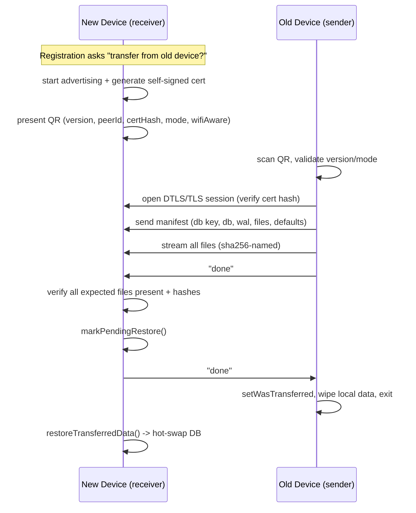

# Device Transfer

Covers `Signal/DeviceTransfer/`:

- `DeviceTransfer.swift` — namespace, protocols, constants, QR-URL scheme
- `DeviceTransferCoordinator.swift` — high-level orchestration for the **new device**
- `IncomingDeviceTransferTask.swift` — new-device (receiver) state machine
- `OutgoingDeviceTransferTask.swift` — old-device (sender) state machine
- `DeviceTransferRestore.swift` — crash-safe, phased restore of received data on the new device
- `TransferStatusState.swift` — UI view-model / `TransferState` state machine
- `ThroughputMonitor.swift` — progress / ETA computation and logging
- `SelfSignedIdentity.swift` — self-signed RSA cert + `SecIdentity` used for DTLS/TLS
- `DeviceTransferStatusViewController.swift` — SwiftUI-hosted status UI (new device)
- `MultiPeerConnectivity/` — MultipeerConnectivity (MPC) transport implementation
- `WiFiAware/` — iOS 26+ WiFi Aware transport implementation

This subsystem **migrates an entire account from an Old Device (OD) to a New Device (ND)** over a
local, device-to-device link (no Signal server involved in the data path). It transfers the
SQLCipher database (and its key), all attachment/avatar/sticker/wallpaper files, and the two
`UserDefaults` suites. It is distinct from *device linking* (see
[Devices](../../SignalServiceKit/Devices/device-linking-and-sync.md)): linking adds a secondary
device sharing one account; transfer moves a whole account and leaves the OD deregistered.

The authoritative prose description of the end-to-end flow lives at the top of
`DeviceTransfer.swift:11-66` (confidence: HIGH — read in full). The summary below is derived from it
plus the implementation.

---

## Namespace, protocols & constants — `DeviceTransfer.swift`

Confidence: HIGH (read in full). `enum DeviceTransfer` (`:67`) is a pure namespace; there is no
instance.

### Error / Mode / Message
- `DeviceTransfer.Error` (`:84`): `assertion`, `backgroundedDevice`, `certificateMismatch`,
  `modeMismatch`, `notEnoughSpace`, `unsupportedVersion`, `otherDeviceTerminated`.
- `DeviceTransfer.Mode` (`:94`): `linked` or `primary`. The OD rejects a QR whose mode doesn't
  match its own registration state (`modeMismatch`), preventing a primary↔linked mixup.
- `DeviceTransfer.Message` (`:99`): control messages serialized as fixed UTF-8 blobs — `done`
  ("Transfer Complete"), `backgroundApp` ("App backgrounded"), `transferFailed` ("Transfer
  Failed") (`:104-110`).

### Constants — `:113`
- `pendingTransferDirectory` = `<appSharedData>/transfer/`, received payload files land in
  `pendingTransferFilesDirectory` = `transfer/files/` (`:115-117`).
- Reserved identifiers: `manifest`, `database`, `database-wal` (`:119-121`).
- `missingFileData`/`missingFileHash` (`:123-124`) — a placeholder sent when a file disappeared
  on the OD mid-transfer; the ND detects the sentinel hash and *skips* that file rather than
  failing.
- `newDeviceServiceIdentifier = "sgnl-new-device"` (`:127`) — the Bonjour service type for MPC
  (comment notes it must match Info.plist).

### UrlConstants (the QR payload) — `:130`
`currentTransferVersion = 1` (`:131`). The QR encodes an `sgnl://transfer?...` URL with query keys
`version`, `peerId`, `certificateHash`, `transferMode`, `wifiAware` (`:133-139`). Bumping the
version intentionally avoids backward-compat burden (`DeviceTransfer.swift:21`).

### Transport abstraction (protocols)
This is the key seam that lets MPC and WiFi Aware coexist:
- `Peer` (`:199`) — `id: Int`, `displayName`.
- `Session` (`@MainActor`, `:205`) — `waitForConnection()`, `disconnect(error:)`, a
  `messages` `AsyncThrowingStream<SessionMessage>`, `send(message:)`, `sendFile(url:name:size:)`.
- `SessionMessage` (`:191`) — `message(Message)`, `startResource(name,size?,Progress?)`,
  `finishResource(name,URL)`.
- `ConnectionFactory` (`:213`) — builds an `OutgoingConnection` (OD) or `IncomingConnection` (ND).
- `PeerDiscovery` / `OutgoingConnection` / `IncomingConnection` (`:220`,`:225`,`:231`) — browse,
  connect, start-advertising, and `waitForConnection(peer:)`.

### Utils — `:144`
- `readManifestFromTransferDirectory()` (`:145`) parses `transfer/manifest` into a
  `DeviceTransferProtoManifest`.
- `resetTransferDirectory(createNewTransferDirectory:)` (`:160`) best-effort wipe (and optional
  recreate) of `transfer/`.
- `bindPeerDiscoveryStream(...)` (`:173`) adapts a `[Peer]` discovery stream into a *paired-peer*
  stream (first new peer after the initial snapshot) plus an *updated-list* stream.

`platformSupportsWifiAware()` (`:69`) gates WiFi Aware on iOS 26 + `WACapabilities`.

---

## New device (receiver)

### `DeviceTransferCoordinator` — `DeviceTransferCoordinator.swift:9`
Confidence: HIGH (read in full). `@MainActor`-constructed orchestrator the UI holds. Chooses the
transport in `init` (`:103`): `WADeviceTransferConnectionFactory` when iOS 26 + `supportsWifiAware`,
else `MPCDeviceTransferConnectionFactory`; wires that factory into an `IncomingDeviceTransferTask`.
- Owns a `TransferStatusViewModel` (`:13`) and republishes discovered peers into it (`:127`).
- `reportTransferMethodChoice()` (`:135`): starts advertising, obtains the QR URL, and reports the
  chosen restore method to `QuickRestoreManager` as `.deviceTransfer(url)` with the
  `restoreMethodToken` — this is how the QR/URL reaches the OD during Quick Restore.
- `waitForTransferFromPeer(peer:)` (`:152`): awaits
  `IncomingDeviceTransferTask.waitForTransferFromOldDevice`, feeding a `Progress` into
  `initializeProgressTracking` (KVO on `fractionCompleted`) which drives the view-model state
  (`transferring` → `finishing` at ≥1.0, then `done`).
- Lifecycle callbacks (`onSuccess`/`onFailure`/`cancelTransferBlock`) wrap the view-model's and
  additionally stop accepting transfers / cancel discovery (`:46`,`:67`,`:189`).

### `IncomingDeviceTransferTask` — `IncomingDeviceTransferTask.swift:9`
Confidence: HIGH (read in full). The receiver state machine (`@MainActor`). Holds the parsed
`manifest`, `receivedFileIds`/`skippedFileIds` (`AtomicValue`), the active `Session`, and a
`ThroughputMonitor`.
- `start(mode:)` (`:72`): blocks sleep and begins advertising; returns the QR URL.
- `waitForTransferFromOldDevice(peer:...)` (`:85`): awaits a connection, then consumes
  `session.messages`, dispatching `startResource`/`finishResource`/`message` and suspending on a
  `CheckedContinuation` until the transfer completes or errors.
- First file received must be `manifest` → `handleReceivedManifest(at:)` (`:187`). Validation gates
  (confidence: HIGH):
  - manifest file size < 1 GiB (`:201`),
  - **refuse if already registered** (`:216`) — never clobber a live account,
  - `grdbSchemaVersion <= grdbSchemaVersionLatest` else `unsupportedVersion` (`:245`) — the ND
    will not import a *newer* DB than it understands,
  - `freeSpaceInBytes > estimatedTotalSize` else `notEnoughSpace` (`:268`).
  On success it sets `setIsTransferInProgress` and starts the throughput monitor.
- Each payload file (`finishReceiving`, `:402`): recompute SHA-256, compare to the hash embedded in
  the resource name; mismatch → fail; the `missingFileHash` sentinel → record as *skipped*
  (`:447`); otherwise move into `transfer/files/<identifier>`.
- On receiving `done` (`processMessage`, `:302`): `verifyTransferCompletedSuccessfully(...)`
  (`:471`) re-reads the manifest from disk and asserts every non-skipped file exists, the DB + WAL
  arrived, and the DB key length equals `GRDBKeyFetcher.Constants.kSQLCipherKeySpecLength` (`:504`).
  Then `markPendingRestore()`, best-effort `done` back to the OD (3s timeout — the ND considers
  itself done even if the OD misses it, `:331`), and `restoreTransferredData()`. A restore failure
  here `owsFail`s so it retries on next launch (`:343`).
- Backgrounding (`didEnterBackground`, `:291`) sends `backgroundApp` to the peer and stops
  (MPC auto-disconnects on background).

### `DeviceTransferRestore` — `DeviceTransferRestore.swift:9`
Confidence: HIGH (read in full). Protocol (`:9`) + `DeviceTransferRestoreImpl` (`:15`); a
`DeviceTransferRestoreMock` exists under `TESTABLE_BUILD` (`:296`).

Restore is a **crash-safe phased state machine** persisted in app `UserDefaults`
(`DeviceTransferRestorationPhase`, `:46`). `RestorationPhase` (`:17`): `noCurrentRestoration` →
`start` → `updateUserDefaults` → `moveManifestFiles` → `allocateNewDatabaseDirectory` →
`moveDatabaseFiles` → `updateDatabase` → `cleanup`. Each phase must be **idempotent and
interruption-safe**; the persisted phase advances only after a phase completes (`:104-111`).

- `markPendingRestore()` (`:117`) sets the phase to `start` so an interrupted ND still restores on
  next launch.
- `restoreTransferredData()` (`:95`) loops phases until `noCurrentRestoration`/`cleanup`.
- `moveManifestFiles` (`:210`) moves payload files from `transfer/files/` into the app-shared data
  dir; tolerates "already exists" (idempotent re-run) and "missing" (a non-essential file that
  disappeared, matching the OD placeholder behavior) (`:220-231`).
- `allocateNewDatabaseDirectory` (`:238`) creates a fresh GRDB transfer directory;
  `moveDatabaseFiles` (`:242`) moves `database`/`database-wal` into it;
  `updateCurrentDatabase` (`:266`) stores the received SQLCipher key via `GRDBKeyFetcher` and calls
  `GRDBDatabaseStorageAdapter.promoteTransferDirectoryToPrimary()` — the atomic **hot-swap** of the
  new DB into place.
- `launchCleanup()` (`:77`) runs at app launch: if `hasIncompleteRestoration`, resume
  `restoreTransferredData()`; then `finalizeRestorationIfNecessary()` (`:278`) wipes `transfer/`,
  flips `setIsTransferComplete`, and performs the one-time `cleanup`
  (`removeOrphanedGRDBDirectories`). Wired from `AppLifecycleManager.swift:184-198` and surfaced via
  `AppEnvironment.deviceTransferRestore` (`AppEnvironment.swift:26`).

---

## Old device (sender)

### `OutgoingDeviceTransferTask` — `OutgoingDeviceTransferTask.swift:11`
Confidence: HIGH (read in full). The sender state machine (`@MainActor`). Constructed by
`OutgoingDeviceRestoreViewModel.swift:96` after the OD scans/receives the ND's URL; the connection
factory is chosen the same way as on the ND.
- `connectToNewDevice(peer:)` (`:68`): blocks sleep and opens a `Session` to the ND.
- `transferAccountToNewDevice(...)` (`:92`): the core flow.
  1. Subscribe to `session.messages` to learn when the ND signals `done`/failure and to attach the
     ND's per-file `Progress` to the throughput monitor.
  2. `setIsTransferInProgress` (`:135`) — this makes the OD **behave as unregistered** and blocks
     WAL checkpoints while transferring (comment `:131`).
  3. `buildManifest()` → send manifest → send all files.
  4. After files flush, `setIsDeregisteredOrDelinked(true, notify: false)` (`:198`) so the OD stays
     deregistered even if the ND dies mid-finish (user can re-register and retry).
  5. Suspend on a continuation until the ND's reply arrives.
- `buildManifest()` (`:300`): assembles `DeviceTransferProtoManifest`:
  - **Database**: the GRDB db file + WAL, plus the SQLCipher key
    (`databaseStorageRef.keyFetcher.fetchData()`, `:349`). The DB is sent as-is (its contents are
    already SQLCipher-encrypted; no extra encryption, per `DeviceTransfer.swift:50`).
  - **Files**: recursive contents of `Attachments/`, `ProfileAvatars/`, `GroupAvatars/`,
    `StickerManager/`, `Wallpapers/`, `Library/Sounds/`, `AvatarHistory/`, `attachment_files/`
    (`:360`). Empty files are skipped.
  - **Defaults**: both `UserDefaults.standard` and the app-group defaults, excluding Apple-managed
    `NS*`/`Apple*` keys, archived with `NSKeyedArchiver` secure coding (`:388-430`).
  - `pathRelativeToAppSharedDirectory` (`:434`) rejects `*`, `~`, `.`, `..` path components (path
    traversal guard).
- `sendAllFiles(...)` (`:242`): first copies the live DB + WAL **inside a write transaction** (with
  a dummy write + `sqlite3_db_cacheflush`) so a consistent, non-empty snapshot is sent — MPC stalls
  on empty files (`:250-258`). Then streams up to 10 files concurrently via a task group, finishing
  with a `done` message. Each `send(...)` (`:287`) names the resource `"<identifier> <sha256hex>"`
  so the receiver can verify integrity; a missing file is replaced with the `missingFileData`
  placeholder (`:300-316`) **except** mandatory DB files which hard-fail.
- On the ND's `done` (`processMessage`, `:443`): `setWasTransferred` (`:454`) then
  `SignalApp.resetAppData(...)` + `showTransferCompleteAndExit()` — the OD **wipes all local data
  and exits** (`:461-464`). Receiving `backgroundApp`/`transferFailed` from the ND aborts.
- `stopTransfer(...)` (`:328`) sends `transferFailed` (unless the peer already terminated),
  cancels tasks, disconnects within a 2s cooperative timeout, and resets registration state.

---

## Transports

Both transports implement the same `ConnectionFactory`/`Session`/`Peer` protocols; the task layer is
transport-agnostic.

### MultipeerConnectivity (`MultiPeerConnectivity/`) — all iOS versions
Confidence: HIGH (read in full).
- `MPCDeviceTransferConnectionFactory` (`MPCDeviceTransferConnectionFactory.swift:8`) builds the
  browser (OD) / advertiser (ND).
- `MPCDeviceTransferAdvertiser` (`MPCDeviceTransferAdvertiser.swift:11`, ND): advertises
  `sgnl-new-device` via Bonjour and, on invite, builds an `MPCDeviceTransferSession`. Builds the QR
  URL in `urlForTransfer(...)` (`:85`) embedding the base64 cert hash + encoded `MCPeerID`.
- `MPCDeviceTransferBrowser` (`MPCDeviceTransferBrowser.swift:11`, OD): parses the scanned URL
  (`parseTransferURL`, `:102` — enforces `currentTransferVersion` and matching `Mode`), browses for
  the exact advertised `MCPeerID`, and invites it with a 30s timeout.
- `MPCDeviceTransferSession` (`MPCDeviceTransferSession.swift:11`): wraps `MCSession` with
  `encryptionPreference: .required` (`:48`). Sends control messages reliably (`done`/`transferFailed`)
  or unreliably (`backgroundApp`) (`:112`). `sendFile` uses `MCSession.sendResource` and bridges its
  `Progress`/completion into the `SessionMessage` stream (`:131`).

### WiFi Aware (`WiFiAware/`) — iOS 26+ only
Confidence: HIGH (read in full). Uses the `Network`/`WiFiAware` frameworks with explicit chunked
file transfer and JSON-coded `NetworkEvent`s.
- `WADeviceTransferConnectionFactory` (`WADeviceTransferConnectionFactory.swift:10`, `@available(iOS
  26.0, *)`).
- `WiFiAware+Extensions.swift`: service name `_sgnl-transfer._tcp` (`:12`), performance mode `.bulk`;
  `NetworkEvent` enum (`:28`: `done`/`appBackgrounded`/`resourceBegin|Data|End`/`transferFailed`);
  `createPeerDiscoveryObserver(...)` (`:35`) streams `WAPairedDevice`s and refreshes on foreground.
- `WADeviceTransferIncomingConnection` (`WADeviceTransferIncomingConnection.swift:11`, ND): runs a
  `NetworkListener` over TLS with the local self-signed identity; restarts the listener when the
  paired-peer set changes (`:118`), and limits allowed connections to the selected device.
- `WADeviceTransferOutgoingConnection` (`WADeviceTransferOutgoingConnection.swift:11`, OD): a
  `NetworkBrowser` finds the selected endpoint, then a `NetworkConnection` opens TLS; its
  `certificateValidator` (`:118`) constant-time-compares the leaf cert hash against the expected
  hash from the URL.
- `WADeviceTransferSession` (`WADeviceTransferSession.swift:11`): chunks files into 65535-byte
  `resourceData` events (`:120`) and reassembles received chunks via `FileHandle`s on the receive
  side.

---

## Cryptography & networking considerations

Confidence: HIGH (code read) except where noted.

- **Session encryption.** MPC sessions require encryption (`.required`,
  `MPCDeviceTransferSession.swift:48`); WiFi Aware wraps the connection in `TLS()`
  (`WADeviceTransferIncomingConnection.swift:168`, `WADeviceTransferOutgoingConnection.swift:98`).
- **Self-signed identity.** `SelfSignedIdentity.create(...)`
  (`SelfSignedIdentity.swift:12`) generates a `DeviceTransferKey` (RSA; cert built via
  LibSignalClient) and composes a `SecIdentity` through the keychain, then **deletes it from the
  keychain** keeping only the in-memory ref (`:63-70`) — nothing persistent is left behind. (Note:
  the top-of-file comment says "RSA 2048" but `createSelfSignedCertificate` requests
  `kSecAttrKeySizeInBits: 4096`, `SelfSignedIdentity.swift:96` — treat the comment as stale;
  confidence: MEDIUM on the exact bit-length intent.)
- **Cert pinning via QR.** The ND's QR carries a SHA-256 hash of its certificate; the OD verifies
  the live session's leaf certificate hash equals it, using a **constant-time** compare
  (`ows_constantTimeIsEqual`) in both transports
  (`MPCDeviceTransferSession.swift:252`, `WADeviceTransferOutgoingConnection.swift:131`). This binds
  the encrypted session to the specific device the user scanned, defeating a MITM. Mismatch →
  reject (`certificateMismatch`).
- **Receiver-side trust.** When the ND has no expected hash (it is the one presenting the QR), the
  MPC session accepts a connection **only if the local device is not registered**
  (`MPCDeviceTransferSession.swift:258`) — a registered device never accepts an incoming transfer.
- **Payload integrity.** Every transferred file is named with its SHA-256; the receiver recomputes
  and compares before accepting it (`IncomingDeviceTransferTask.swift:424`), and a final manifest
  cross-check ensures nothing expected is missing and the DB key is the right length (`:471`).
- **Database handling.** The DB is transferred as the raw SQLCipher file plus its key in the
  manifest — no second encryption layer, since SQLCipher already encrypts at rest
  (`DeviceTransfer.swift:50`, `OutgoingDeviceTransferTask.swift:349`). The DB/WAL are snapshotted
  inside a write transaction to avoid mid-copy mutation (`OutgoingDeviceTransferTask.swift:250`).
- **No server in the data path.** Account data moves directly device-to-device over
  peer-to-peer Wi-Fi/Bluetooth/infra Wi-Fi (MPC decides) or WiFi Aware; the Signal service only
  marks the account "transfer"-eligible and (via Quick Restore) relays the QR URL
  (`DeviceTransferCoordinator.swift:139`).

---

## Supporting UI / utilities

- `TransferStatusViewModel` + `TransferState` (`TransferStatusState.swift:11`,`:30`) — confidence:
  HIGH. The observable state machine driving the status UI (idle → starting → connecting →
  transferring(progress) → finishing → done / cancelled / error), including localized titles and a
  1 Hz throughput/ETA estimator smoothing (`:177`). A `#if DEBUG simulateProgressForPreviews()`
  exists (`:230`).
- `ThroughputMonitor` (`ThroughputMonitor.swift:9`) — confidence: HIGH. `@MainActor` 1 Hz timer that
  maintains a smoothed throughput + estimated-time-remaining on a `Progress`, and logs progress
  (every 1% under `DebugFlags.deviceTransferVerboseProgressLogging`, else every 10%).
- `DeviceTransferStatusViewController` (`DeviceTransferStatusViewController.swift:14`) — confidence:
  HIGH (header read). A `HostingController` wrapping the SwiftUI status view for the **new device**;
  bridges coordinator callbacks (`onSuccess` shows a completion `HeroSheetViewController`,
  paired-peer discovery prompts "continue on other device").

---

## Where it plugs into the app

Confidence: HIGH (grep-verified).
- `AppLifecycleManager.swift:184-198` constructs `DeviceTransferRestoreImpl` and calls
  `launchCleanup()` at launch; the result (`didDeviceTransferRestoreSucceed`) flows into app setup
  (`:259`).
- `AppEnvironment.swift:26,54` holds the shared `deviceTransferRestore`.
- New-device entry points: `ProvisioningController.swift:273,290` and the Registration flow
  (`RegistrationCoordinatorImpl.swift:1924`, `RegistrationNavigationController.swift:365`,
  `RegistrationTransferStatusPresenter.swift`) construct the coordinator / status VC.
- Old-device entry point: `QuickRestore/OutgoingDeviceRestoreViewModel.swift:96` builds the
  `OutgoingDeviceTransferTask`.
