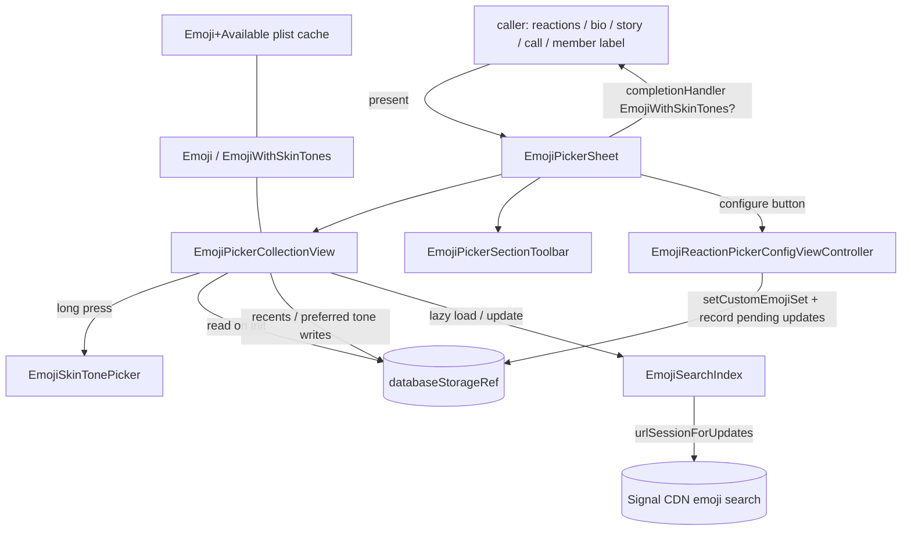

# Emoji — `Signal/Emoji/`

The emoji subsystem of the main `Signal/` app target. It owns (a) a strongly-typed
model of every supported Unicode emoji with skin-tone handling, (b) per-device
availability detection and persistence of user preferences (preferred skin tones,
recently-used emoji), and (c) the UIKit **emoji picker** sheet and its skin-tone and
reaction-configuration companions used wherever the app lets a user choose an emoji
(reactions, profile/bio, group-call reactions, story replies, member labels).

This folder is part of the first-party app target. It treats `SignalServiceKit`
(`KeyValueStore`, `SSKEnvironment`, `ReactionManager`, `OWSReaction`, `TSMessage`,
`DB*Transaction`) and `SignalUI` (`OWSViewController`, `MessageReactionPicker`,
`Theme`, haptics) as boundaries — this doc describes *how the picker uses them*, not
their internals. For the whole-repository map see
[../../APPLICATION_MAP.md](../../APPLICATION_MAP.md); for the app target overview see
[../README.md](../README.md).

## Scope

Hand-written files (all under `Signal/Emoji/`):

- `EmojiWithSkinTones.swift` — the value type pairing a base `Emoji` with skin tones; plus the `Emoji` extensions for preferred-skin-tone persistence and normalization.
- `Emoji+Available.swift` — per-iOS-version availability detection and on-disk cache.
- `EmojiPickerSheet.swift` — the presented picker sheet view controller.
- `EmojiPickerCollectionView.swift` — the scrolling grid, search, recents, and skin-tone long-press host; also the `EmojiSearchIndex` network/cache helper.
- `EmojiPickerSectionToolbar.swift` — the bottom category jump-bar.
- `EmojiSkinTonePicker.swift` — the long-press skin-tone chooser overlay.
- `EmojiReactionPickerConfigViewController.swift` — the "configure reactions" editor.

Generated (listed, not detailed; see the one-line note below):

- `Generated/Emoji.swift`, `Generated/Emoji+Category.swift`, `Generated/Emoji+SkinTones.swift`, `Generated/Emoji+Name.swift`, `Generated/EmojiWithSkinTones+String.swift`.

> **Note on `Generated/`:** these five files are machine-generated by
> `Scripts/EmojiGenerator.swift` (header `// This file is generated by EmojiGenerator.swift, do not manually edit it.`, e.g. `Signal/Emoji/Generated/Emoji.swift:6`) and are large data tables (the `Emoji` case list, `Category`, `SkinTone`, names, and string tables). They are not documented declaration-by-declaration; the model's shape is summarized below from the enum/property definitions. **[High]**

## Conventions

- **Citations** are `path:line` (specific declaration) or `path` (file). Line numbers reflect the working tree at authoring time and may drift; relocate via the symbol name.
- **Confidence labels**:
  - **[High]** — directly observed (file read / declaration located in this session).
  - **[Medium]** — inferred from signatures, names, and cross-file convention.
  - **[Low]** — educated inference from naming alone.

## One-paragraph orientation

A caller presents `EmojiPickerSheet` (`EmojiPickerSheet.swift:11`) with an optional
`TSMessage` and a `completionHandler: (EmojiWithSkinTones?) -> Void`
(`EmojiPickerSheet.swift:12`). The sheet hosts an `EmojiPickerCollectionView`
(`EmojiPickerCollectionView.swift:23`) — a grid of selectable emoji grouped into
*message*, *recents*, and *category* sections — a search bar, and a bottom
`EmojiPickerSectionToolbar` (`EmojiPickerSectionToolbar.swift:14`) for jumping between
categories. Selecting an emoji records it in recents, persists its preferred skin
tone, fires the completion handler, and dismisses. Long-pressing a skin-tone-capable
emoji opens `EmojiSkinTonePicker` (`EmojiSkinTonePicker.swift:9`). The model is the
generated `Emoji` enum plus the hand-written `EmojiWithSkinTones` value type
(`EmojiWithSkinTones.swift:9`); availability per iOS version is computed and cached by
`Emoji+Available.swift`. All persistence (preferred skin tones, recents, search
index, custom reaction set) goes through `KeyValueStore`s and
`SSKEnvironment.shared.databaseStorageRef`. **[High]**

---

## Model

### `Emoji` (generated) — `Generated/Emoji.swift:12`
Confidence: HIGH. `enum Emoji: String, CaseIterable, Equatable` whose raw values are the
emoji glyphs (`case grinning = "😀"`, …). Companion generated extensions provide:

- `Emoji.Category` — `enum Category: String, CaseIterable` with eight cases: `smileysAndPeople`, `animals`, `food`, `activities`, `travel`, `objects`, `symbols`, `flags` (`Generated/Emoji+Category.swift:11`). `localizedName` (`:21`) maps each to an `OWSLocalizedString`; `normalizedEmoji` (`:42`) is the ordered emoji list per category. **[High]**
- `Emoji.SkinTone` — `enum SkinTone: String, CaseIterable` with five Fitzpatrick modifiers `light`/`mediumLight`/`medium`/`mediumDark`/`dark` (`Generated/Emoji+SkinTones.swift:11`). `hasSkinTones` is `emojiPerSkinTonePermutation != nil` (`:19`); `allowsMultipleSkinTones` additionally requires `skinToneComponentEmoji != nil` (`:20`) — i.e. multi-person emoji where each component can carry its own tone. `emojiPerSkinTonePermutation` (`:47`) maps a `[SkinTone]` permutation to the composed glyph. **[High]**
- `Emoji.name` — a human-readable English name per emoji (`Generated/Emoji+Name.swift:11`), used as the default search term when no localized index entry exists. **[High]**
- `Emoji.normalized` — maps duplicate-codepoint emoji to a canonical variant (`Generated/Emoji+Category.swift:3906`). **[High]**

### `EmojiWithSkinTones` — `EmojiWithSkinTones.swift:9`
Confidence: HIGH (read in full). `struct EmojiWithSkinTones: Hashable` pairing a
`baseEmoji: Emoji` with optional `skinTones: [Emoji.SkinTone]?`. The initializer
(`:12`) deduplicates skin tones while preserving order so `[.dark, .dark]` collapses to
`[.dark]` (comment at `:15`). `rawValue` (`:25`) resolves the composed glyph via
`baseEmoji.emojiPerSkinTonePermutation?[skinTones]` (`:27`), falling back to the plain
base glyph. `init?(rawValue:)` (`:35`) parses a glyph string back into base + tones,
rejecting non-single-emoji strings.

Normalization lives here too: `normalized` / `isNormalized` (`:94`), and the array
helpers `removeNonNormalizedDuplicates()` / `removingNonNormalizedDuplicates()`
(in `extension Array where Element == EmojiWithSkinTones`, `:107`; the two methods at
`:114` and `:132`) that drop a non-normalized emoji when its normalized twin is already
present (some emoji have two codepoints with identical appearance). **[High]**

### Preferred skin tones & lookups — `EmojiWithSkinTones.swift:45`
Confidence: HIGH. An `Emoji` extension backed by
`KeyValueStore(collection: "Emoji+PreferredSkinTonePermutation")` (`:46`):

| Member | Line | Behavior |
|---|---|---|
| `allSendableEmojiByCategoryWithPreferredSkinTones(transaction:)` | 48 | For each `Category`, the available emoji mapped to the user's preferred skin tone. Drives the picker grid. |
| `withPreferredSkinTones(transaction:)` | 54 | The stored preferred-tone variant of a single emoji. |
| `setPreferredSkinTones(_:transaction:)` | 59 | Persist (or clear) a preferred permutation keyed by the base glyph. |

### Availability — `Emoji+Available.swift`
Confidence: HIGH (read in full). Not every emoji renders on every iOS version, so
availability is computed empirically and cached.

- `var available` (`:80`) — in-memory lookup against `availableCache` (an `AtomicDictionary`, `:10`), computing on demand if absent.
- `warmAvailableCache()` (`:17`) — off-main-thread (`owsAssertDebug(!Thread.isMainThread)`, `:18`) warm-up. Loads an on-disk plist at `cacheUrl` = `<appSharedData>/Library/Caches/emoji.plist` (`:12`–`:15`), keyed partly by `iosVersion`; if the OS version changed or the cache is missing it recomputes all cases and rewrites the plist. **[High]**
- `isEmojiAvailable(_:)` (`:74`) delegates to `String.isUnicodeStringAvailable` (`:98`), which renders the glyph to a PNG with `UIFont.systemFont(ofSize: 8)` and compares it to the rendering of a known-undefined codepoint `\u{1fff}`; different image ⇒ available. This is the only part of the model that touches UIKit (`import UIKit`, `:7`). **[High]**

---

## UI

### `EmojiPickerSheet` — `EmojiPickerSheet.swift:11`
Confidence: HIGH (read in full). An `OWSViewController` presented as a sheet with
`.medium()`/`.large()` detents and a grabber (`:52`). Layout: a top stack of a
`UISearchBar` (placeholder reuses the conversation-search string, `:21`) plus an
optional "configure reactions" button (`configureButton`, `:27`) gated on
`allowReactionConfiguration` (`:17`, `:76`); the `EmojiPickerCollectionView` fills the
body; the `EmojiPickerSectionToolbar` is pinned to the keyboard layout guide at the
bottom.

Behavior and delegate conformances:
- `EmojiPickerCollectionViewDelegate` (`:190`): on selection, light impact haptic (`:192`), call `completionHandler(emoji)`, dismiss; on scroll, sync the toolbar's selected section (`:197`).
- `EmojiPickerSectionToolbarDelegate` (`:155`): tapping a category (`:156`) clears any active search then scrolls to that section header and maximizes the sheet; `emojiPickerWillBeginDragging` (`:183`) resigns the search bar.
- `UISheetPresentationControllerDelegate` (`:212`): dismissing with no selection calls `completionHandler(nil)` — callers treat `nil` as "cancelled".
- `UISearchBarDelegate` (`:220`): editing maximizes height; text changes forward into `collectionView.searchText`.
- The configure button presents `EmojiReactionPickerConfigViewController` wrapped in a nav controller (`didSelectConfigureButton`, `:135`).

UI considerations **[High]**: explicit `#available(iOS 26, *)` and `iOS 17.0`
branches for background color/traits and a `UIScrollEdgeElementContainerInteraction`
that obscures content under the toolbar (`:66`, `:111`); dark-mode override is
propagated to the sheet's trait overrides and to presented nav controllers; bottom
`contentInset` is recomputed in `viewDidLayoutSubviews` (`:119`) so the last row isn't
trapped behind the toolbar.

### `EmojiPickerCollectionView` — `EmojiPickerCollectionView.swift:23`
Confidence: HIGH (read in full). The core grid; a `UICollectionView` acting as its own
`delegate`/`dataSource`/flow-layout delegate.

**Sections.** `EmojiPickerSection` (`:9`) is `.messageEmoji` / `.recentEmoji` /
`.emojiCategory(categoryIndex:)`. The raw section index ↔ semantic section mapping
depends on whether message-emoji and recents are present (`section(raw:)` `:147`,
`rawSection(from:)` `:173`). `emojiForSection(_:)` (`:205`) returns, respectively, the
emoji already reacted to the message, up to `maxRecentEmoji` (3 rows, `:145`) of
recents, or a category's emoji. During search the view collapses to a single section
of `emojiSearchResults` (`numberOfSections` `:466`).

**Data load (init).** Given an optional `TSMessage`, a single
`databaseStorageRef.read` (`:82`) gathers: existing reactions via
`ReactionFinder(uniqueMessageId:).allReactions` (`:85`), recents via `getRecentEmoji`
(`:29`), and `allSendableEmojiByCategoryWithPreferredSkinTones` (`:92`). Message
reactions are then deduplicated by normalized form (`:108`). **[High]**

**Recents.** `getRecentEmoji(tx:)` (`:29`) reads from
`KeyValueStore(collection: "EmojiPickerCollectionView")` (`:25`) key `"recentEmoji"`
(`:26`) and de-dupes via `removingNonNormalizedDuplicates`.
`recordRecentEmoji(_:transaction:)` (`:252`) normalizes, moves the chosen emoji to the
front, and truncates to 50 stored entries. **[High]**

**Selection & skin tones.** Tapping a cell (`didSelectItemAt`, `:447`) async-writes the
recent + preferred skin tone, then notifies the delegate. A long-press
(`handleLongPress`, `:395`) opens `EmojiSkinTonePicker.present` anchored to the pressed
cell (`:405`); the `.changed`/`.ended` gesture phases are forwarded into the overlay;
the picker's panGesture is required to fail the long-press (`:128`). A tap-gesture
recognizer dismisses an open skin-tone picker and only begins when one is showing. **[High]**

**Search.** `searchText` (`:55`) triggers `searchWithText` → `searchResults` (`:336`):
a single-character query that is itself a valid emoji returns that emoji directly;
otherwise it scans `allSendableEmoji` using per-emoji terms from the localized search
index (falling back to `Emoji.name`, `:353`), ranking exact → anchored (prefix) →
unanchored (substring) matches. **[High]**

**Supplementary views & cells.** Private `EmojiCell` (`:528`) renders a single glyph in
a 32pt bold label with `.byClipping` line break to dodge glyph-width quirks noted in
the source comment (`:546`). `EmojiSectionHeader` (`:558`) renders the localized
section name; header height is measured via a throwaway instance (`:522`). **[High]**

### `EmojiSearchIndex` — `EmojiPickerCollectionView.swift:592`
Confidence: HIGH. An `enum` namespace (same file) backed by
`KeyValueStore(collection: "EmojiSearchIndexKeyValueStore")` providing localized emoji
search terms. `updateManifest()` (`:597`) fetches
`/dynamic/android/emoji/search/manifest.json` via
`SSKEnvironment.shared.signalServiceRef.urlSessionForUpdates()`; if the manifest
version changed it resets the index and then fetches the per-localization file
`/static/android/emoji/search/<version>/<localization>.json` (`:679`), storing an
`[emoji: [tags]]` dictionary. `searchIndexLocalization(forLocale:…)` (`:634`) resolves
the device locale to an available localization (exact, else language prefix). The
collection view loads this lazily in `loadEmojiSearchIfNeeded` (`:300`), kicking off a
background manifest update if the index is missing. **[High]**

> This is the subsystem's only server interaction: an unauthenticated best-effort
> download of search-term data; failures are logged and the picker falls back to
> English `Emoji.name` terms (`EmojiPickerCollectionView.swift:353`). **[High]**

### `EmojiPickerSectionToolbar` — `EmojiPickerSectionToolbar.swift:14`
Confidence: HIGH (read in full). A `UIView` wrapping a horizontal `UICollectionView`
(diffable data source over `ThemeIcon`) that shows one icon per category — the eight
category icons (`:117`) plus a leading `.emojiRecent` icon when the delegate reports
recents exist (`:128`). Tapping an item scrolls it to center and calls
`didSelectSection` (`:281`); `setSelectedSection(_:)` (`:288`) selects programmatically
to stay in sync with scroll position.

UI considerations **[High]**: `#available(iOS 26, *)` renders a floating glass panel
(`UIGlassEffect` capsule, `:147`); otherwise it uses a solid background when
`UIAccessibility.isReduceTransparencyEnabled` (`:170`) or a `UIBlurEffect` panel; both
non-glass backgrounds extend 500pt past the bottom edge to cover the safe area (`:178`,
`:192`). The compositional layout switches between an evenly-distributed row and a
continuously-scrolling row depending on whether all icons fit (`:248`). Selected cells
draw a circular fill via a custom `UIContentConfiguration` (`:28`) because
`UIBackgroundConfiguration` "wasn't updating reliably" per the source comment. **[High]**

### `EmojiSkinTonePicker` — `EmojiSkinTonePicker.swift:9`
Confidence: HIGH (read in full). A transient `UIView` overlay presented via the static
`present(referenceView:emoji:completion:)` (`:17`), which returns `nil` for emoji
without skin tones (`guard emoji.baseEmoji.hasSkinTones`, `:22`). It positions itself
relative to the long-pressed cell, flipping above/below depending on available space
(`:55`), and fades in/out over 0.12s (`:68`, `:74`).

Two modes:
- **Single tone** (`prepareForSingleSkinTone`, `:156`): a "yellow" (no-tone) button, a divider, then one button per `SkinTone`.
- **Multiple tones** (`prepareForMultipleSkinTones`, `:246`): one row of tone buttons per `skinToneComponentEmoji` (`:185`), seeded from `preferredSkinTonePermutation`; a composite preview button is enabled only once every component has a tone (`:213`).

The overlay drives selection from the host's ongoing long-press via
`didChangeLongPress` (`:79`) / `didEndLongPress` (`:96`), with selection-changed
haptics (`SelectionHapticFeedback`, `:91`). Dark/light colors come from
`Theme.isDarkThemeEnabled`. **[High]**

### `EmojiReactionPickerConfigViewController` — `EmojiReactionPickerConfigViewController.swift:9`
Confidence: HIGH (read in full). A `UIViewController` (reached from the picker sheet's
configure button) that edits the user's custom reaction emoji using a
`MessageReactionPicker` (from `SignalUI`) in `.configure` style (`:11`–`:14`). Tapping
a slot opens a nested `EmojiPickerSheet` with `allowReactionConfiguration: false` to
pick a replacement (`:96`). **Reset** (`resetButtonTapped`, `:65`) restores
`ReactionManager.defaultEmojiSet`. **Done** (`doneButtonTapped`, `:75`) persists the
set via `ReactionManager.setCustomEmojiSet` inside a `databaseStorageRef.write`,
notifies the `ReactionPickerConfigurationListener` (`:80`), and triggers
`storageServiceManagerRef.recordPendingLocalAccountUpdates()` (`:81`) so the custom set
syncs across devices. `ReactionPickerConfigurationListener` (`:117`) is a small
callback protocol with `didCompleteReactionPickerConfiguration()` (`:118`). **[High]**

---

## Interactions & callers

Confidence: HIGH for the call sites listed (located via search this session); MEDIUM
for the exact UX each one wires up.

`EmojiPickerSheet` is instantiated from several app surfaces outside this folder:

- `Signal/Calls/UserInterface/CallControlsOverflowView.swift` — group-call reactions.
- `Signal/src/ViewControllers/AppSettings/Profile/ProfileBioViewController.swift` — emoji in profile bio.
- `Signal/src/ViewControllers/ContextMenus/CustomContextMenus/ContextMenuController.swift` — message reaction "more" picker.
- `Signal/src/ViewControllers/HomeView/Stories/Replies & Views Sheets/StoryReplySheet.swift` — story reply reactions.
- `Signal/src/ViewControllers/MemberLabels/MemberLabelViewController.swift` — member label emoji.

Within the folder, `EmojiReactionPickerConfigViewController` also instantiates the
sheet (`:96`), and `EmojiPickerCollectionView` instantiates `EmojiSkinTonePicker`
(`:405`). **[High]**

Boundary dependencies **[High]**: `KeyValueStore`, `SSKEnvironment.shared.databaseStorageRef`,
`ReactionFinder`, `OWSReaction`, `ReactionManager`, `TSMessage`, `signalServiceRef`,
and `storageServiceManagerRef` from `SignalServiceKit`; `OWSViewController`,
`MessageReactionPicker`, `Theme`, `ThemeIcon`, and the haptic helpers
(`ImpactHapticFeedback`, `SelectionHapticFeedback`) from `SignalUI`.

## State & persistence summary

| State | Where | Backing store |
|---|---|---|
| Preferred skin tone (per base emoji) | `EmojiWithSkinTones.swift:46` | `KeyValueStore "Emoji+PreferredSkinTonePermutation"` |
| Recently-used emoji (max 50) | `EmojiPickerCollectionView.swift:25` | `KeyValueStore "EmojiPickerCollectionView"` key `recentEmoji` |
| Localized search index + version | `EmojiPickerCollectionView.swift:593` | `KeyValueStore "EmojiSearchIndexKeyValueStore"` (populated from server) |
| Per-iOS-version availability | `Emoji+Available.swift:12` | plist at `<appSharedData>/Library/Caches/emoji.plist` + in-memory `AtomicDictionary` |
| Custom reaction emoji set | `EmojiReactionPickerConfigViewController.swift:78` | `ReactionManager.setCustomEmojiSet` (+ Storage Service sync) |

