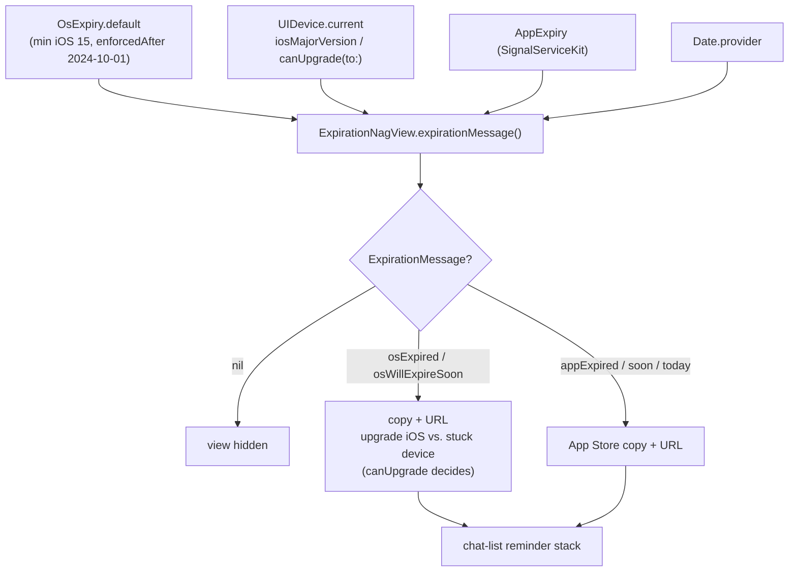

# Expiration — OS/Device version enforcement

Covers `Signal/Expiration/`:

- `OsExpiry.swift`
- `UIDevice+CanUpgradeOperatingSystem.swift`

This folder is tiny (two files, no sub-folders). It defines the **data model and
device-capability check** behind Signal's "your iOS/device is too old" warnings. It
does **not** contain any UI, scheduling, or app-expiry logic of its own; it only
supplies values that the chat-list reminder view (`ExpirationNagView`) consumes to
decide what warning, if any, to show. The sibling concern — *app build* expiry
(`AppExpiry`) — lives in `SignalServiceKit` and is treated here as a boundary.

## Conventions

- **Citations** are `path:line`. Line numbers reflect the working tree at authoring
  time and may drift; relocate via the symbol name.
- **Confidence labels**:
  - **[High]** — directly observed (file read in full this session).
  - **[Medium]** — inferred from signatures/names/cross-file convention.
  - **[Low]** — educated inference from naming alone.

## Responsibility

Provide the two inputs needed to evaluate "is this device/OS still supported, and can
the user do anything about it?":

1. A policy value — the minimum supported iOS major version and the date after which
   that minimum is enforced (`OsExpiry`).
2. A capability check — whether *this physical device* can even upgrade to that
   minimum iOS version (`UpgradableDevice` / the `UIDevice` conformance).

The decision of *what message to show* and *when* is made by
`ExpirationNagView.expirationMessage()`
(`Signal/src/views/ExpirationNagView.swift:95`) **[High]**, which lives outside this
folder.

## Key types

### `OsExpiry` — `Signal/Expiration/OsExpiry.swift:8`

Confidence: **[High]** (read in full). A plain value struct with two stored
properties:

| Member | Line | Meaning |
|--------|------|---------|
| `minimumIosMajorVersion: Int` | `:16` | Lowest iOS major version Signal still supports. |
| `enforcedAfter: Date` | `:17` | Date after which running below the minimum is treated as "OS expired". |
| `static var default` | `:9` | Ships the current policy: `minimumIosMajorVersion: 15` (`:11`), `enforcedAfter` = `Date(timeIntervalSince1970: 1727740800)` (`:13`), i.e. 2024-10-01 00:00:00 UTC (comment at `:12`). |

The struct carries no behavior — it is pure configuration. The hard-coded `default`
is the single source of truth for the current support policy **[High]**; to change the
policy a developer edits this struct (there is no remote-config path in this folder;
remote app-expiry lives elsewhere, see Boundaries).

### `UpgradableDevice` (protocol) — `Signal/Expiration/UIDevice+CanUpgradeOperatingSystem.swift:11`

Confidence: **[High]** (read in full). Two requirements:

- `var iosMajorVersion: Int { get }` (`:12`)
- `func canUpgrade(to iosMajorVersion: Int) -> Bool` (`:14`)

The protocol exists so that the consumer (`ExpirationNagView`) can be unit-tested with
a fake device; the production conformance is on `UIDevice`.

### `extension UIDevice: UpgradableDevice` — `:19`

Confidence: **[High]** (read in full).

- `iosMajorVersion` (`:20`) reads `ProcessInfo().operatingSystemVersion.majorVersion`.
- `canUpgrade(to:)` (`:24`) answers "could this hardware reach `iosMajorVersion`?".
  Design note (from the doc comment at `:21`): the method is deliberately
  **optimistic** — when unsure it returns `true` (allows false positives) to stay
  low-maintenance **[High]**. Logic:
  1. If `systemName` isn't iOS/iPhone/iPad it `owsFailBeta`s and returns `true` (`:33`).
  2. If the device is already at/above the target version, returns `true` (`:40`).
  3. Otherwise it switches on `String(sysctlKey: "hw.machine")` (`:52`) against a
     hard-coded allowlist of old models (iPhone 6S/7/SE-gen1, iPad Mini 4, iPad Air 2,
     iPod Touch gen 7) whose `maxMajorVersion` is `15` (`:72`); any model not in the
     list defaults to `true` (`:74`). Returns `maxMajorVersion >= iosMajorVersion`
     (`:77`).

The comment block (`:42`–`:51`) documents that the model list is intentionally
incomplete: it omits devices with no maximum version and devices too old to run this
code, and assumes any missing device can upgrade **[High]**.

## Interactions with the rest of the app

This folder is **consumed by exactly one production consumer** and one test
(verified by searching for `OsExpiry` / `UpgradableDevice` across `*.swift` this
session — matches in `ExpirationNagView.swift`, `ChatListViewController+Reminders.swift`,
and the two test files) **[High]**.

### `ExpirationNagView` — `Signal/src/views/ExpirationNagView.swift:9`

Confidence: **[High]** (read in full). A `ReminderView` subclass injected with
`dateProvider`, `appExpiry: AppExpiry`, `osExpiry: OsExpiry`, and
`device: UpgradableDevice` (`:18`–`:22`). Its `expirationMessage()`
(`:95`) combines all four inputs into an optional `ExpirationMessage` enum (`:40`):

- Computes `osExpirationDate` = `osExpiry.enforcedAfter` **iff**
  `device.iosMajorVersion < osExpiry.minimumIosMajorVersion`, else `.distantFuture`
  (`:102`) **[High]** — so devices already on a supported OS never see an OS warning.
- Priority of messages (`:106`–`:124`):
  1. OS already expired → `.osExpired(canUpgrade:)` using
     `device.canUpgrade(to: osExpiry.minimumIosMajorVersion)` (`:107`).
  2. Else if the **app** expires before the OS and is within 10 days / today / past →
     `.appExpired` / `.appWillExpireToday` / `.appWillExpireSoon` (`:110`–`:118`).
  3. Else if OS will expire before `.distantFuture` → `.osWillExpireSoon(...)` (`:121`).
  4. Else `nil` → view hidden.
- `ExpirationMessage` maps each case to localized `text`, an `actionTitle`, and a
  `urlToOpen` (`:49`, `:62`, `:73`). OS-upgrade-possible cases point to Apple's
  upgrade page (`.upgradeOsUrl`, `:231`); stuck-device cases point to Signal's
  unsupported-OS support page (`.unsupportedOsUrl`, `:235`); app cases point to the
  App Store (`.appStoreUrl` → `TSConstants.appStoreUrl`, `:227`) **[High]**.

Note the `canUpgrade` boolean is what splits "you can upgrade iOS" copy from
"switch to a newer device" copy — the sole purpose of the `UpgradableDevice`
abstraction **[High]**.

### Chat-list wiring — `ChatListViewController+Reminders.swift`

Confidence: **[High]** (read relevant section). `CLVReminderViews` constructs the
single production `ExpirationNagView` (`:15`–`:18`) with the real dependencies:

```swift
ExpirationNagView(
    dateProvider: Date.provider,
    appExpiry: DependenciesBridge.shared.appExpiry,   // SignalServiceKit boundary
    osExpiry: OsExpiry.default,                        // this folder
    device: UIDevice.current,                          // this folder's conformance
)
```

The view is added to the chat-list reminder stack (`:38`) and refreshed via
`updateExpirationReminderView()` → `expiredView.update()`
(`:223`) **[Medium]** (the `update()`/`expirationMessage()` body is `[High]`; the exact
set of refresh triggers was not exhaustively traced). `hasVisibleReminders` (`:184`)
includes `!expiredView.isHidden` so an active expiry warning affects chat-list layout
**[High]**.

## Boundaries (what is *not* here)

- **App-build expiry** (`AppExpiry`) is a `SignalServiceKit` concern obtained from
  `DependenciesBridge.shared.appExpiry` (`ChatListViewController+Reminders.swift:16`);
  this folder never computes it **[High]**.
- **Localized strings / URLs** for the warnings live as private `String`/`URL`
  extensions inside `ExpirationNagView.swift` (`:131`+, `:224`+), not in this folder
  **[High]**.
- **Scheduling / when to refresh** the warning is the chat list's responsibility
  **[Medium]**.

## Data flow



Edge cases / notes (confidence as marked):
- `OsExpiry.default` is compile-time constant; changing policy requires a code edit
  (`OsExpiry.swift:9`) **[High]**.
- `canUpgrade(to:)` is intentionally optimistic and may return false positives
  (device shown "you can upgrade" when it actually cannot); documented as a
  deliberate maintenance tradeoff (`UIDevice+CanUpgradeOperatingSystem.swift:21`)
  **[High]**.
- The model allowlist is hand-maintained and incomplete by design
  (`UIDevice+CanUpgradeOperatingSystem.swift:42`) **[High]**.
- A non-iOS `systemName` triggers `owsFailBeta` and a permissive `true`
  (`:33`) **[High]**.

## Tests (outside this folder)

`Signal/test/util/ExpirationNagViewTest.swift` exercises `OsExpiry` and a fake
`UpgradableDevice` against `ExpirationNagView` message selection
(e.g. `OsExpiry(minimumIosMajorVersion:enforcedAfter:)` at `:25`, `testOsExpiry()` at
`:67`) — confirming `UpgradableDevice` exists primarily for testability **[High]**
(file located via search; not read in full).
