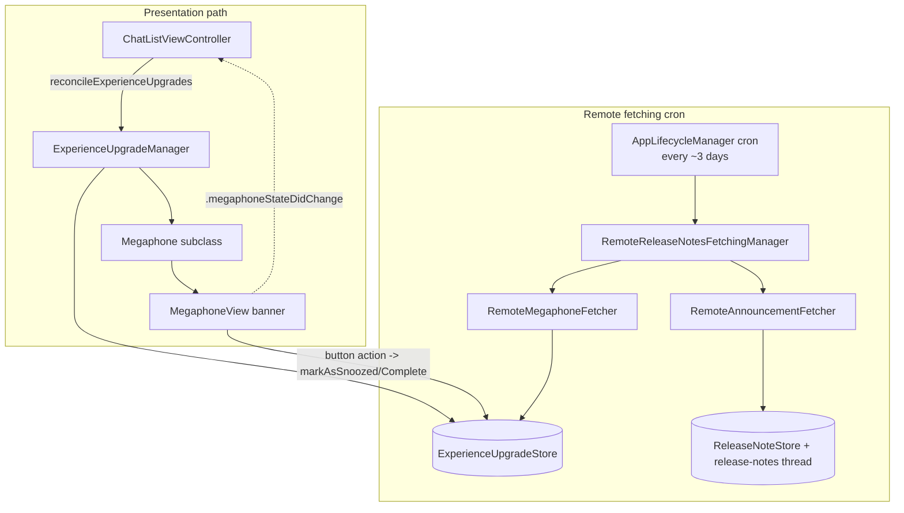

# Megaphones — In-App Promos, Reminders & Remote Announcements

Covers the **first-party `Signal/Megaphones/` app-target directory only**: the
in-app "megaphone" banners shown at the bottom of the chat list, and the
fetchers that pull remote megaphones and release notes from the service.

- `Signal/Megaphones/ExperienceUpgradeManager.swift`
- `Signal/Megaphones/RemoteReleaseNotesFetchingManager.swift`
- `Signal/Megaphones/RemoteReleaseNotesFetcher.swift`
- `Signal/Megaphones/RemoteMegaphoneFetcher.swift`
- `Signal/Megaphones/RemoteAnnouncementFetcher.swift`
- `Signal/Megaphones/UserInterface/MegaphoneView.swift` (the `Megaphone` base class + `MegaphoneView`)
- `Signal/Megaphones/UserInterface/*Megaphone.swift` (one subclass per megaphone kind)

This directory treats `SignalServiceKit/` and `SignalUI/` as **boundaries**. The
persistence model and manifest live in `SignalServiceKit/Megaphones/`
(`ExperienceUpgrade`, `ExperienceUpgradeManifest`, `ExperienceUpgradeStore`,
`RemoteMegaphoneModel`, `RemoteAnnouncementModel`, `ReleaseNoteStore`,
`RemoteReleaseNotesService`); those are referenced here but are not this
directory's responsibility. See [../README.md](../README.md) for the app-target
map and [../../SignalServiceKit/README.md](../../SignalServiceKit/README.md) for
the service layer.

## Conventions

- **Citations** are `path:line` (specific declaration) or `path` (file).
  Line numbers reflect the working tree at authoring time and may drift; relocate
  via the symbol name.
- **Confidence labels** on claims about purpose/behavior:
  - **[High]** — directly observed (file read / declaration located in this session).
  - **[Medium]** — inferred from signatures, names, and cross-file convention.
  - **[Low]** — educated inference from naming alone.
- Directory/file existence and sizes were produced by listing the working tree in
  this session **[High]**.

## One-paragraph orientation

Two independent concerns live here. (1) **Presentation**: `ExperienceUpgradeManager`
(`Signal/Megaphones/ExperienceUpgradeManager.swift:10`) decides, each time the chat
list asks, which single megaphone (if any) to show, builds the matching `Megaphone`
subclass, and presents its `MegaphoneView` as a banner pinned to the bottom of the
chat list **[High]**. (2) **Remote fetching**: `RemoteReleaseNotesFetchingManager`
(`Signal/Megaphones/RemoteReleaseNotesFetchingManager.swift:10`) periodically pulls
remote-megaphone and release-note manifests + localized translations from the
service and writes them into local stores, from where (for remote megaphones) the
presentation path later picks them up **[High]**. The two concerns meet only in the
shared `ExperienceUpgradeStore` / `ExperienceUpgrade` records in
`SignalServiceKit/Megaphones/` **[High]**.

---

## Presentation

### `Megaphone` base class — `UserInterface/MegaphoneView.swift:11`
Confidence: HIGH (read in full). A `@MainActor` model object holding what a banner
displays: `image`/`imageContentMode`, `titleText`, `bodyText`, and 1–2 `Button`s
(`:12`, a `title` + `() -> Void` action). It wraps an `ExperienceUpgrade` record
(`:26`). `buildView()` (`:30`) asserts title/body are set and that there are 1 or 2
buttons, then constructs a `MegaphoneView`. Shared helpers:
- `snoozeButton(...)` (`:50`) — a button that calls
  `markAsSnoozedWithSneakyTransaction()` and shows a "we'll remind you later" toast.
- `markAsSnoozedWithSneakyTransaction()` (`:62`) / `markAsCompleteWithSneakyTransaction()`
  (`:76`) — open their own `DependenciesBridge.shared.db` write, mutate the record via
  `ExperienceUpgradeStore`, and post `.megaphoneStateDidChange` so the chat list
  re-reconciles **[High]**.

### `MegaphoneView` — `UserInterface/MegaphoneView.swift:92`
Confidence: HIGH (read in full). A `UIView` banner.
- Rounded (`cornerRadius = 12`), blurred dark background with a light/dark overlay
  (`:116`) — the card is dark-styled regardless of app theme, with only the overlay
  tracking interface style **[High]**.
- `present(fromViewController:)` (`:150`) builds a horizontal top stack (optional 64pt
  square image container + title/body label stack) over a button stack, adds itself to
  `fromViewController.view`, pins to the leading/trailing/bottom **safe area** with 8pt
  insets, and fades in over 0.2s **[High]**.
- `dismiss()` (`:184`) just `removeFromSuperview()`.
- Button layout (`createButtonsStack`, `:244`): a single button spans full width; two
  buttons are laid out horizontally with a 1pt divider, the first (primary) semibold.
  `owsFail` on any other count **[High]**.

### `ExperienceUpgradeManager` — `ExperienceUpgradeManager.swift:10`
Confidence: HIGH (read in full). The orchestrator. Constructed once in the app
environment (`Signal/AppLaunch/AppEnvironment.swift:147`, stored at
`AppEnvironment.swift:42`) with ~18 injected `SignalServiceKit` stores/managers
**[High]**. Holds a private `NewKeyValueStore(collection: "ExperienceUpgradeManager")`
(`:67`) plus in-memory `lastPresentedMegaphone`/`lastPresentedMegaphoneView` (`:35`).

#### `reconcilePresentedExperienceUpgrade(fromViewController:)` — `:83`
Confidence: HIGH. The single entry point, `@MainActor`, invoked by the chat list
(see Interactions). Algorithm:
1. In one `db.read`, bail unless registered with a known registration date (`:92`).
2. Load `lastMegaphoneDismissDate` from the KV store (default `.distantPast`) (`:102`).
3. Iterate `allKnownExperienceUpgrades(tx:)` (importance-sorted) and pick the **first**
   upgrade passing the generic gate (`:120`): not complete, not snoozed, not past its
   "days to show", past the manifest's `delayAfterRegistration` since registration,
   before the manifest's `expirationDate`, and either we're primary or the manifest
   opts into linked devices (`manifest.showOnLinkedDevices`) **[High]**.
4. For the chosen upgrade, `switch` on `manifest` and run a kind-specific precondition
   check (see below). If it passes, instantiate the matching `Megaphone` subclass into
   `nextMegaphone` **[High]**.
5. After the read: some branches set `shouldClearNewDeviceNotification` /
   `shouldClearBackupsEnabledDetails`, which trigger follow-up `db.write`s to clear
   stored details (`:289`, `:295`) **[High]**.
6. Reconcile against what's already on screen (`:301`):
   - No next megaphone → dismiss whatever is presented and return.
   - Same **type** already presented → no-op.
   - Otherwise, if we just dismissed one, don't immediately present another; else, only
     present if more than a `.day` has elapsed since `lastMegaphoneDismissDate`
     (`:317`) **[High]**.
7. On present: `buildView()`, `present(fromViewController:)`, cache
   `lastPresentedMegaphone(View)`, and `experienceUpgradeStore.markAsViewed(...)` in a
   write (`:330`) **[High]**.

`dismissLastPresented(now:)` (`:386`) writes `now` as `lastMegaphoneDismissDate`,
dismisses the view, clears the cached refs, and returns whether anything was dismissed
**[High]**. This "dismiss debounce" plus the ≥1-day gate is what prevents megaphones
from flickering one after another on the chat list **[Medium]**.

#### `allKnownExperienceUpgrades(tx:)` — `:349`
Confidence: HIGH. Merges persisted `ExperienceUpgrade` records (via
`experienceUpgradeStore.enumerateExperienceUpgrades`, skipping `.unrecognized`) with
freshly-made in-memory models for every `ExperienceUpgradeManifest.wellKnownLocalUpgradeManifests`
that lacks a record, then returns `ExperienceUpgradeManifest.sortedByImportance(...)`
**[High]**. Net effect: locally-defined megaphones work without a prior DB row;
remote megaphones only appear once the fetcher has persisted them **[Medium]**.

#### Per-kind precondition checks (all `check...` methods, `:410`–end)
Confidence: HIGH. Each manifest case maps to a predicate; representative examples:
- `.introducingPins` (`:410`) — reachable, registered primary, has never had a PIN.
- `.notificationPermissionReminder` (`:427`) — synchronously waits (with a 50ms
  timeout) on `UNUserNotificationCenter` authorization and shows only if **not**
  authorized **[High]**.
- `.newLinkedDeviceNotification` (`:466`) — tri-state result
  (`display`/`skip`/`clearNotification`): if notifications are on, clear the stored
  "recently linked device" details instead of nagging **[High]**.
- `.createUsernameReminder` (`:519`) — username explicitly unset, phone-number
  discovery disabled, and ≥3 days since discovery was disabled.
- `.pinReminder` (`:572`) — delegates to `ows2FAManager.isDueForV2Reminder`.
- `.contactPermissionReminder` (`:578`) — `CNContactStore` status is denied/notDetermined.
- `.recoveryKeyReminder` (`:591`) — registered primary, on a backup plan, first backup
  >14 days ago, and no recovery-key reminder within 6 months.
- `.backupsUpsellReminder` (`:625`) — returns a 4-way `BackupsUpsellResult`
  (`genericEnable` / `neverLoseAMessage` / `backUpYourMedia` / `saveSpace`) chosen from
  backup plan, message count (≥1000), and attachment size (≥1GB) → different Backups
  megaphone subclass per case **[High]**.
- `.remoteMegaphone` (`:682`) — version/time/country-bucket gates plus a
  `conditionalCheck` (`standardDonate` / `internalUser`) and validation that each
  declared action is recognized and has text (`:736`, `:759`) **[High]**.

### Megaphone subclasses — `UserInterface/*Megaphone.swift`
Confidence: HIGH (read several; others inferred from identical pattern [Medium]). Each
subclass's `init` sets `titleText`/`bodyText`/`image` from `OWSLocalizedString`s and
wires its buttons. Patterns worth noting:
- Most "not now" buttons use the base `snoozeButton(...)`; action buttons call
  `markAsComplete`/`markAsSnoozed` and present a flow or toast
  (`IntroducingPINsMegaphone.swift:21`, `PinReminderMegaphone.swift:21`,
  `CreateUsernameMegaphone.swift:30`) **[High]**.
- `NotificationPermissionReminderMegaphone.swift:9` embeds a `TurnOnPermissionView`
  (`:85`) action-sheet with numbered steps and a "Go to Settings" deep link **[High]**.
- `NewLinkedDeviceNotificationMegaphone.swift:9` and
  `InactiveLinkedDeviceReminderMegaphone.swift:9` take injected stores and clear/disable
  their source state on dismissal, posting `.megaphoneStateDidChange` **[High]**.
- `RemoteMegaphone.swift:9` is driven entirely by a `RemoteMegaphoneModel`: title/body/
  image from the translation, buttons from `presentablePrimaryAction` /
  `presentableSecondaryAction`, and a `performAction` switch over
  `.snooze`/`.finish`/`.donate`/`.donateFriend`/`.unrecognized` that drives donation
  flows and marks the record complete/snoozed (`RemoteMegaphone.swift:71`) **[High]**.
- Backups subclasses (`BackupsGenericEnableMegaphone`, `BackupsNeverLoseAMessageMegaphone`,
  `BackupsBackUpYourMediaMegaphone`, `BackupsSaveSpaceMegaphone`,
  `BackupsEnabledRecentlyNotificationMegaphone`) deep-link into
  `SignalApp.shared.showAppSettings(mode: .backups(...))`
  (`BackupsBackUpYourMediaMegaphone.swift:42`) **[High]**.

---

## Remote fetching

### `RemoteReleaseNotesFetchingManager` — `RemoteReleaseNotesFetchingManager.swift:10`
Confidence: HIGH (read in full). Owns one `RemoteMegaphoneFetcher` and one
`RemoteAnnouncementFetcher`, both over the shared `RemoteReleaseNotesServiceProtocol`
(`SignalServiceKit`) **[High]**.
- `syncRemoteReleaseNotes()` (`:101`) — fetches both manifest lists
  (`fetchManifests`, retried with backoff, `:134`), runs the megaphone fetcher over all
  megaphone manifests, then runs the announcement fetcher over
  **filtered** announcement manifests; each sub-fetch's failure is logged, not thrown
  **[High]**.
- `filteredAnnouncementManifests(_:)` (`:59`) gates announcements: skip if <1 week since
  registration, skip if <1 week since last fetch (unless a build flag / tests override),
  and drop manifests above the current app version or already stored in
  `ReleaseNoteStore` **[High]**.

Scheduling: wired as a `cron.schedulePeriodically(uniqueKey: .fetchMegaphones,
approximateInterval: 3 * .day, mustBeRegistered: true, mustBeConnected: true, ...)` in
`Signal/AppLaunch/AppLifecycleManager.swift:760` **[High]**. Also triggerable manually
from the internal settings screen (`InternalMiscViewController.swift:46`) **[High]**.

### `RemoteReleaseNotesFetcher<ManifestType, TranslationType>` — `RemoteReleaseNotesFetcher.swift:57`
Confidence: HIGH (read in full). Abstract generic base.
- `run(manifests:)` (`:68`) — fetches a translation per manifest concurrently in a
  `withThrowingTaskGroup`, then calls `updatePersistedData(withFetchedData:)`.
- `fetchTranslation(forManifest:)` (`:82`) — tries locale candidates
  (`possibleTranslationLocaleStrings`, `:11`: language, language_region, then `en`),
  advancing to the next on a 404 and propagating any other error **[High]**.
- `downloadMediaIfNecessary(...)` (`:117`) — downloads an image (with backoff) if the
  translation declares one; returns whether an image exists.
- `fetchTranslationAndImage(...)` (`:148`) and `updatePersistedData(...)` (`:152`) are
  `owsFail` abstract hooks the subclasses override **[High]**.
- Also defines URL helpers: `String.translationUrlPath(...)` →
  `static/release-notes/<id>/<locale>.json` (`:33`) and `URL.mediaFilePath(...)` (`:46`)
  **[High]**.

### `RemoteMegaphoneFetcher` — `RemoteMegaphoneFetcher.swift:10`
Confidence: HIGH (read in full). Overrides `updatePersistedData` to **reconcile**
remote megaphones into `ExperienceUpgradeStore`: enumerate existing
`.remoteMegaphone` records keyed by id, `upsertRemoteMegaphone` for each fetched
manifest/translation (creating a new `ExperienceUpgrade` if none), then `remove` any
local record no longer on the service (`:30`) **[High]**. This is the write side that
feeds the presentation path's `.remoteMegaphone` case.

### `RemoteAnnouncementFetcher` — `RemoteAnnouncementFetcher.swift:10`
Confidence: HIGH (read in full). Overrides `updatePersistedData` to turn an
**announcement** (release note) into a real message in the Release Notes thread rather
than a chat-list banner: sorts manifests by min version, applies country-bucket gating,
optionally downloads/validates an image attachment, builds a styled `MessageBody`
(title bolded, body ranges offset past the title), inserts a `TSReleaseNotesMessage`
into the `TSReleaseNotesThread` (created on demand), attaches media, notifies the user,
and records the note via `storeReleaseNoteAndUpdateLastFetchTime` — showing only the
first eligible note (`:60`) **[High]**. Special-cases: skips if the thread is blocked,
and skips the known "backups" announcement id when backups are already enabled (`:131`)
**[High]**. The `// TODO: [KC] implement boost message` at `:201` marks unfinished work
**[High]**.

---

## Interactions with the rest of the app

- **Chat list is the only presenter.** `ChatListViewController.reconcileExperienceUpgrades()`
  (`Signal/src/ViewControllers/HomeView/Chat List/ChatListViewController.swift:368`)
  resolves `AppEnvironment.shared.experienceUpgradeManager` and calls
  `reconcilePresentedExperienceUpgrade(fromViewController: self)` **[High]**. It is
  invoked via a `.megaphoneStateDidChange` observer
  (`ChatListViewController+Notifications.swift:109`) **[High]**.
- **`.megaphoneStateDidChange`** is the re-reconcile signal. It is `Notification.Name`
  defined in `SignalServiceKit/Megaphones/ExperienceUpgradeStore.swift:7` and posted
  both from within this directory (every `markAs...`/dismiss) and from many unrelated
  places that change megaphone-relevant state — e.g.
  `SignalServiceKit/Backups/Settings/BackupPlanManager.swift:156`,
  `SignalServiceKit/Network/OWSChatConnection.swift:1203`,
  `PinSetupViewController.swift:500`, `AccountSettingsViewController.swift:436`,
  `LinkedDevicesView.swift:358` **[High]**.
- **Dependency wiring** flows through `AppEnvironment` (presentation manager) and
  `AppLifecycleManager`'s cron (fetching manager); both pull their collaborators from
  `SSKEnvironment.shared` / `DependenciesBridge.shared`
  (`Signal/AppLaunch/AppEnvironment.swift:147`,
  `Signal/AppLaunch/AppLifecycleManager.swift:746`) **[High]**.
- **Persistence boundary.** All durable state lives in `SignalServiceKit/Megaphones/`
  stores (`ExperienceUpgradeStore`, `ReleaseNoteStore`) and the remote models; this
  directory never defines its own tables, only a small KV collection for the
  last-dismiss timestamp **[High]**.
- **Deep links out.** Action buttons route into app settings (`SignalApp.shared.showAppSettings`),
  donation flows (`DonateViewController`, `BadgeGiftingChooseBadgeViewController`), PIN
  setup, and username selection — i.e. megaphones are entry points into existing flows,
  not self-contained features **[High]**.

## Data flow & state summary

- **Local megaphone**: no fetch needed → `ExperienceUpgradeManager` instantiates an
  in-memory `ExperienceUpgrade` from a well-known manifest → precondition passes →
  banner shown → button marks the (now-persisted) record snoozed/complete → notification
  re-reconciles **[High]**.
- **Remote megaphone**: cron → `RemoteMegaphoneFetcher` upserts `ExperienceUpgrade`
  records → later chat-list reconcile picks the `.remoteMegaphone` case → `RemoteMegaphone`
  banner → actions drive donation/finish/snooze **[High]**.
- **Release note / announcement**: cron → `RemoteAnnouncementFetcher` inserts a
  `TSReleaseNotesMessage` into the Release Notes thread and notifies the user — **not** a
  chat-list banner **[High]**.
- **In-memory state** (`lastPresentedMegaphone`/`View`) is intentionally transient; the
  only persisted presentation state here is `lastExperienceUpgradeDismissDate` in the
  manager's KV store (`ExperienceUpgradeManager.swift:12`) **[High]**.

## Notable UI considerations

- The banner is **always dark-themed** (dark blur + dark `overrideUserInterfaceStyle`),
  with only a background overlay reacting to light/dark mode
  (`UserInterface/MegaphoneView.swift:116`) **[High]**.
- It pins to the **safe area** at the bottom of the chat list and fades in; dismissal is
  an immediate `removeFromSuperview` (no exit animation)
  (`UserInterface/MegaphoneView.swift:174`, `:184`) **[High]**.
- Exactly **1 or 2 buttons** are supported; violations `owsFail`
  (`UserInterface/MegaphoneView.swift:34`, `:270`) **[High]**.
- Anti-flicker: at most one megaphone is on screen; re-presenting the same type is a
  no-op; and a dismissal both debounces the next present and records a ≥1-day cooldown
  (`ExperienceUpgradeManager.swift:301`) **[High]**.
- The notification-permission check blocks the reconcile read on a 50ms-timeout
  `UNUserNotificationCenter` query (`ExperienceUpgradeManager.swift:427`); a timeout is
  treated as "unknown → don't show" **[High]**.

## Tests & unverified areas

- A test double exists at `Signal/test/Registration/RegistrationCoordinatorTestShims.swift:64`
  and the fetching manager is exercised by
  `Signal/test/RemoteReleaseNotes/RemoteReleaseNotesFetchingManagerTests.swift` **[High]**.
- Several megaphone subclasses were not read line-by-line
  (`ContactPermissionReminderMegaphone`, `RecoveryKeyReminderMegaphone`,
  `InactivePrimaryDeviceReminderMegaphone`, and the remaining Backups subclasses); their
  behavior is inferred from the uniform `Megaphone`-subclass pattern **[Medium]**.
