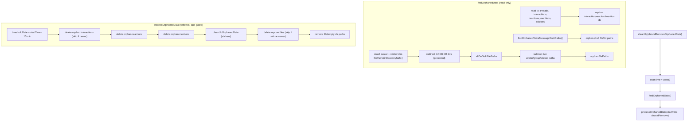

# `Signal/OrphanData/` — Orphaned Data & File Cleanup

Covers `Signal/OrphanData/`:

- `OWSOrphanDataCleaner.swift`

This folder is a single, self-contained **main-app maintenance task**. It periodically audits (and
optionally deletes) *orphaned* data that no longer belongs to anything live: database rows whose
parent is gone (interactions in a deleted thread, reactions/mentions whose message is gone), and
on-disk files no longer referenced by any database row (stale profile/group avatars, sticker files,
interrupted voice-message drafts). It is the broad, cross-cutting "sweep everything" counterpart to
the narrow, attachment-specific
[OrphanedAttachments cleaner](../../SignalServiceKit/Attachments/OrphanedAttachments.md) in
`SignalServiceKit`; the two are independent and run on different schedules.

The entire subsystem is one `enum` with static members — there is no instance state, no stored
service, and nothing registered in a dependency container. Callers invoke it directly.

Confidence: HIGH (the single source file was read in full; callers were read directly).

---

## Responsibility

`OWSOrphanDataCleaner` (`OWSOrphanDataCleaner.swift:23`) does two things in sequence:

1. **Find** orphaned data without mutating anything (`findOrphanedData()`, `:52`).
2. **Process** (audit-log, and optionally delete) what was found (`processOrphanedData(...)`, `:255`).

The single public entry point is `cleanUp(shouldRemoveOrphanedData:)` (`:27`). When
`shouldRemoveOrphanedData` is `false` it is a pure **audit** — it logs what *would* be removed but
deletes nothing (every removal site is gated by `guard shouldRemoveOrphanedData else { ... }`; see
`:282`, `:349`). When `true`, it actually deletes. The run logs `"starting orphan data cleanup"` vs.
`"...audit"` accordingly (`:28`).

> Design note (source comment, `:30`–`:40`): the one real risk of this sweep is deleting data that
> *is* still in use but whose owning database row hasn't been written yet (e.g. a profile avatar
> written to disk before its `OWSUserProfile` is saved). The mitigation is a time threshold —
> nothing newer than ~15 minutes is ever deleted (see **Age threshold** below).

---

## Key type

### `OWSOrphanData` — `OWSOrphanDataCleaner.swift:11`

A private immutable struct — the result of the "find" phase, consumed by the "process" phase. Its
fields enumerate every category the cleaner handles:

| Field | Line | Meaning |
|-------|------|---------|
| `interactionIds` | 12 | `TSInteraction` rows whose `threadUniqueId` is empty or points at a non-existent thread. |
| `filePaths` | 13 | On-disk files (avatars, stickers) not referenced by any live row — deleted individually. |
| `reactionIds` | 14 | `OWSReaction` rows whose `uniqueMessageId` has no corresponding interaction. |
| `mentionIds` | 15 | `TSMention` rows whose `uniqueMessageId` has no corresponding interaction. |
| `fileAndDirectoryPaths` | 16 | Paths removed as files-or-empty-directories (voice-message draft dirs). |
| `hasOrphanedPacksOrStickers` | 17 | Whether `StickerManager` reports orphaned sticker packs/stickers to clean. |

`OWSOrphanDataCleaner` itself is an `enum` (namespace) with `private static let databaseStorage =
SSKEnvironment.shared.databaseStorageRef` (`:25`) as its only "field".

---

## Interactions with the rest of the app / module

The cleaner reaches across many subsystems; it owns none of them. It only knows how to enumerate
"what's on disk / in the DB" vs. "what each subsystem says is still live".

**Callers (the Signal app target):**

- `AppLifecycleManager.swift:643` schedules it via `cron.schedulePeriodically(uniqueKey:
  .cleanUpOrphanedData, approximateInterval: 2 * .week, mustBeRegistered: true, ...)` with
  `shouldRemoveOrphanedData: true`. A local `orphanedDataCleanerFailureCount` throws
  `OWSRetryableError()` once it hits 3 failures, so a repeatedly-timing-out sweep backs off instead
  of looping (source comment notes this replaces the pre-Cron "give up after 3 errors until
  restart" behavior). Confidence: HIGH (read directly).
- `DebugUIDiskUsage.swift:19` ("Audit & Log", `shouldRemoveOrphanedData: false`) and `:23`
  ("Audit & Clean Up", `shouldRemoveOrphanedData: true`) expose both modes manually under the debug
  UI (`#if USE_DEBUG_UI`). Confidence: HIGH.

> A deprecated `KeyValueStore` collection `"OWSOrphanDataCleaner_Collection"` is listed for cleanup
> in `SignalServiceKit/Storage/Database/NewKeyValueStore.swift:390` — remnant of the old
> self-throttling scheme now superseded by Cron scheduling. Confidence: MEDIUM (inferred from the
> deprecated-collections list + the Cron comment).

**Subsystems consulted during "find" (the "live set"):**

- `OWSUserProfile.legacyProfileAvatarsDirPath` / `sharedDataProfileAvatarsDirPath` (`:55`–`:56`) and
  `OWSProfileManager.allProfileAvatarFilePaths(transaction:)` (`:101`) — profile avatars.
- `TSGroupModel.avatarsDirectory` (`:57`) and `TSGroupModel.allGroupAvatarFilePaths(transaction:)`
  (`:107`) — group avatars.
- `StickerManager.cacheDirUrl()` (`:58`), `filePathsForAllInstalledStickers(transaction:)` (`:168`),
  and `hasOrphanedData(tx:)` (`:171`) — sticker files/packs.
- `ThreadFinder().fetchUniqueIds(tx:)` (`:122`) + a raw GRDB cursor over `InteractionRecord`
  (`:126`) — thread/interaction reconciliation.
- `OWSReaction.anyEnumerate` (`:146`) and `TSMention.anyEnumerate` (`:157`) — orphan reactions/mentions.
- `VoiceMessageInterruptedDraftStore.draftVoiceMessageDirectory` /
  `allDraftFilePaths(transaction:)` (`:245`–`:247`) — interrupted voice-memo drafts (see
  [VoiceMessage](../../SignalServiceKit/VoiceMessage/README.md)).
- `GRDBDatabaseStorageAdapter.databaseDirUrl(...)` (`:70`–`:74`) — explicitly *protected*: any file
  under the primary / hotswap / (in-progress) transfer DB directory is subtracted from the delete
  set as a future-proof safety net (`:76`–`:95`).

**Subsystems that perform the actual deletes during "process":**

- `DependenciesBridge.shared.interactionDeleteManager.delete(...)` (`:285`) — orphan interactions.
- `ReactionManager.tryToCleanupOrphanedReaction(...)` (`:295`) — orphan reactions.
- `MentionFinder.tryToCleanupOrphanedMention(...)` (`:312`) — orphan mentions.
- `StickerManager.cleanUpOrphanedData(tx:)` (`:327`) — orphan sticker packs/stickers.
- `OWSFileSystem.deleteFile(...)` (`:352`) — orphan files.
- Raw `unlink` / `rmdir` via `runUnixOperation` (`:408`) — file-or-empty-directory paths.

---

## Data flow / state

The task is stateless between runs; all "state" is derived live each run from the file system +
database. The flow is strictly find-then-process:

**Age threshold (the central safety invariant).** `processOrphanedData` computes
`minimumOrphanAgeSeconds = 15 * .minute` and `thresholdDate = startTime - 15 min` (`:262`–`:263`).
Interactions newer than the threshold are skipped by creation timestamp (`:276`); files newer than
the threshold are skipped by modification date (`:343`); reactions and mentions get the
`thresholdDate` passed into their respective cleanup helpers (`:295`, `:312`). This is what prevents
deleting data that is mid-write but not yet linked. Confidence: HIGH.

**Files-only, never directories (mostly).** The top-of-file comment (`:22`) notes that for the
avatar/sticker sweep it only cleans up *files*, not directories. The one exception is the
voice-message-draft path, handled by `removeFileOrEmptyDirectory` (`:381`), which tries `rmdir`
first (`:384`) and falls back to `unlink` (`:399`), tolerating `ENOENT`/`ENOTEMPTY`/`ENOTDIR`, and
sorts longest-path-first so files are removed before their containing directories (`:368`).

**Best-effort tolerance of races.** `filePaths(inDirectorySafe:)` (`:421`) swallows
`ENOENT`/`fileReadNoSuchFile` while crawling (files can disappear underneath it, `:431`). In the
delete loop, a file whose attributes can't be read is simply skipped (`:338`), and `deleteFile(...,
ignoreIfMissing: true)` tolerates already-gone files (`:352`).

---

## Concurrency considerations

Confidence: HIGH (behaviors are explicit in the source).

- **`async` task, not an actor.** `cleanUp` is `async throws` and runs as a detached `Task` from its
  callers. There is no lock; isolation comes from the database layer.
- **Cancellation is pervasive and cooperative.** `try Task.checkCancellation()` is sprinkled between
  every expensive step and inside every enumeration loop (`:104`, `:110`, `:133`, `:155`, `:166`,
  and in the process loops `:267`, `:293`, `:310`, `:330`). The GRDB interaction cursor loop
  re-throws `CancellationError` but converts other errors to `grdbErrorForLogging` (`:141`–`:144`);
  the `anyEnumerate` closures can't `throw`, so they set the `stop` flag when `Task.isCancelled`
  (`:146`–`:149`, `:157`) and the enclosing code calls `checkCancellation()` afterward. Cancelling a
  run is therefore safe and prompt.
- **Read/write ordering to avoid false positives.** The most subtle piece is in `findOrphanedPaths`
  (`:193`, doc comment `:200`–`:208`): it first enumerates the file system, *then* awaits a no-op
  `databaseStorage.awaitableWrite { _ in }` (`:223`) to drain any pending writes, *then* reads the
  expected paths. Ordering matters — enumerating disk first and flushing writes second guarantees a
  file created inside an earlier transaction is visible as "expected", while a file created by a
  *later* transaction can't be mis-flagged because the disk crawl already finished. This prevents
  racing a concurrent write into deleting a just-created draft file.
- **Per-item write transactions.** The process phase opens a *separate* `awaitableWrite` per orphan
  item (interactions `:268`, reactions `:294`, mentions `:311`) rather than one giant transaction,
  keeping each delete short and cancellation-responsive, at the cost of not being atomic across the
  whole sweep.
- **No reentrancy guard in the subsystem itself.** Nothing here prevents two concurrent `cleanUp`
  runs; serialization is left to the caller. In practice the main-app Cron `uniqueKey:
  .cleanUpOrphanedData` schedule is the single production trigger, and the database write
  serialization makes concurrent runs correct-if-wasteful rather than corrupting.
