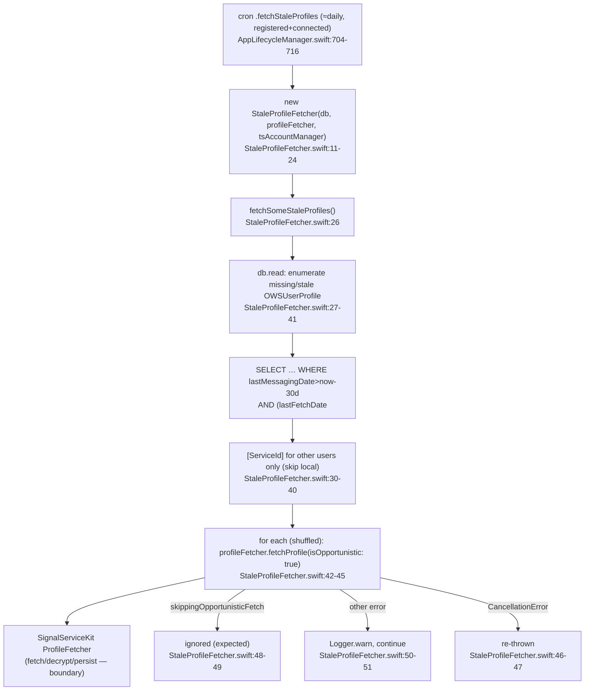

# `Signal/Profiles/` — App-level Profile Maintenance

Documentation of the **first-party `Signal/` app target's** `Profiles/` subdirectory.
This is distinct from the profile subsystem in `SignalServiceKit` (the service/data
layer that owns `OWSUserProfile`, `ProfileFetcher`, profile keys, and the profile
network/storage machinery). This directory is **UI/app-level**: it holds the main app's
scheduled, opportunistic *background refresh* of other users' profiles, built on top of
the SSK primitives. For the SSK side (the actual fetching, decryption, and persistence),
see the `SignalServiceKit` docs. For how this fits into launch/cron, see
[../app-environment.md](../app-environment.md).

## Conventions

- **Citations** are `path:line` (specific declaration) or `path` (file). Line numbers
  reflect the working tree at authoring time and may drift; relocate via the symbol name.
  Every factual claim about behavior cites a path.
- **Confidence labels** on claims about *purpose/behavior*:
  - **[High]** — directly observed (file read / declaration located in this session).
  - **[Medium]** — inferred from signatures, names, and cross-file convention; not every
    referenced file was read in full.
  - **[Low]** — educated inference from naming alone.
- Any uncited claim is a defect.

## Scope

The entire directory is a single file **[High]**:

- `Signal/Profiles/StaleProfileFetcher.swift` (~90 lines).

It is treated as a boundary to `SignalServiceKit`: this doc describes *how the app target
drives profile refresh*, not how SSK fetches/stores profiles.

## One-paragraph orientation

`StaleProfileFetcher` is a small app-target helper that periodically picks a batch of
"stale" user profiles — profiles of *active* conversation partners that haven't been
refreshed recently — and opportunistically re-fetches them through the SSK
`ProfileFetcher` **[High]**. It is not a UI component and presents nothing; it is a
background maintenance task wired into the app's cron scheduler during environment setup
(`Signal/AppLaunch/AppLifecycleManager.swift:704-716`) **[High]**. Its job is to keep
displayed profile data (names, avatars, etc.) reasonably fresh for people the local user
actually talks to, without spending bandwidth on inactive contacts.

## Responsibility

Keep the local profile cache fresh for *active* peers by:

1. Selecting a bounded batch of missing-or-stale `OWSUserProfile` rows from the database
   (`StaleProfileFetcher.swift:62-89`) **[High]**.
2. Re-fetching each one opportunistically via `ProfileFetcher`
   (`StaleProfileFetcher.swift:42-52`) **[High]**.

It explicitly does **not** own profile data, keys, decryption, or persistence — those are
SSK concerns reached through injected dependencies **[High]**.

## Key type

### `class StaleProfileFetcher` (`StaleProfileFetcher.swift:11`)

Dependencies injected via `init` (`StaleProfileFetcher.swift:16-24`) **[High]**:

| Dependency | Type | Source at the call site |
|---|---|---|
| `db` | `any DB` | `DependenciesBridge.shared.db` (`AppLifecycleManager.swift:711`) |
| `profileFetcher` | `any ProfileFetcher` | `SSKEnvironment.shared.profileFetcherRef` (`AppLifecycleManager.swift:712`) |
| `tsAccountManager` | `any TSAccountManager` | `DependenciesBridge.shared.tsAccountManager` (`AppLifecycleManager.swift:713`) |

All three are SSK-defined protocols; the app target supplies the concrete instances from
its two dependency containers **[High]**. (`tsAccountManager` is held but not referenced
in the body as written — intent undetermined; it is likely a convention/placeholder for
registration-state checks — **[Low]**.)

#### `func fetchSomeStaleProfiles() async throws(CancellationError)` (`StaleProfileFetcher.swift:26`)

The entry point **[High]**:

1. In a single `db.read` transaction, enumerate missing/stale profiles and collect the
   `ServiceId`s of **other** users, skipping the local user via
   `userProfile.internalAddress` (`.localUser` returns early; `.otherUser` contributes its
   `address.serviceId` when present) (`StaleProfileFetcher.swift:27-41`) **[High]**.
2. Iterate the collected service IDs in **shuffled** order and fetch each via
   `profileFetcher.fetchProfile(for:context: .init(isOpportunistic: true))`
   (`StaleProfileFetcher.swift:42-45`) **[High]**. Shuffling avoids always refreshing the
   same ordering across runs **[Medium]**.
3. Error handling (`StaleProfileFetcher.swift:46-51`) **[High]**:
   - `CancellationError` is re-thrown (so the surrounding async task can be cancelled);
     this is the only error type the method itself throws (typed `throws(CancellationError)`).
   - `ProfileFetcherError.skippingOpportunisticFetch` is swallowed — expected, because the
     fetch is opportunistic and SSK may decline it.
   - Any other error is logged via `Logger.warn` and the loop continues; one bad profile
     doesn't abort the batch.

#### `static func enumerateMissingAndStaleUserProfiles(now:tx:block:)` (`StaleProfileFetcher.swift:54`)

The selection query, factored out as a `static` so it is unit-testable without the fetch
side effects (`Signal/test/util/GRDBFinderTest.swift:262`) **[High]**. Behavior:

- **Active** = `lastMessagingDate` within the last **30 days**
  (`activeTimestamp = now - 30 * .day`, `StaleProfileFetcher.swift:56`) **[High]** — i.e.
  the local user sent/received a message with that peer recently.
- **Stale** = `lastFetchDate` older than **1 day**, or never fetched (NULL)
  (`staleTimestamp = now - 1 * .day`, `StaleProfileFetcher.swift:60`) **[High]**.
- SQL selects from `OWSUserProfile.databaseTableName` where
  `lastMessagingDate > activeTimestamp` AND (`lastFetchDate < staleTimestamp` OR
  `lastFetchDate IS NULL`), ordered by `lastFetchDate ASC`, `LIMIT 25`
  (`StaleProfileFetcher.swift:76-85`) **[High]**.
- A comment block (`StaleProfileFetcher.swift:63-75`) documents the SQLite NULL-ordering
  subtleties: NULL sorts first under `ORDER BY … ASC` (so never-fetched rows are picked
  first), but NULL fails date comparisons, hence the explicit `IS NULL` test to include
  never-fetched profiles **[High]**.
- A `TODO` asks whether rows without a profile key should be skipped
  (`StaleProfileFetcher.swift:62`) — currently they are **not** filtered out here
  **[High]**.

## Interactions with the rest of the Signal module and the app

- **Scheduling (the only call site).** During `AppEnvironment` setup, the app registers a
  periodic cron job that constructs a fresh `StaleProfileFetcher` and calls
  `fetchSomeStaleProfiles()` (`AppLifecycleManager.swift:704-716`) **[High]**. The job is
  registered as `cron.schedulePeriodically(uniqueKey: .fetchStaleProfiles,
  approximateInterval: .day, mustBeRegistered: true, mustBeConnected: true, operation: …)`
  (`AppLifecycleManager.swift:704-716`) **[High]**:
  - `approximateInterval: .day` — runs roughly once per day **[High]**.
  - `mustBeRegistered: true` — only when the local account is registered **[High]**.
  - `mustBeConnected: true` — only when there's network connectivity **[High]**.
  - A new instance is built per run (no retained state between runs) **[High]**.
- **Service-layer dependencies.** It consumes SSK through `DependenciesBridge.shared`
  (`db`, `tsAccountManager`) and `SSKEnvironment.shared` (`profileFetcherRef`)
  (`AppLifecycleManager.swift:711-713`) **[High]** — the same two global accessors the app
  target uses everywhere (see [../app-environment.md](../app-environment.md)).
- **No UI surface.** Nothing in this directory imports UIKit or SignalUI, presents a view,
  or touches a view controller — it only reads the DB and calls the fetcher
  (`StaleProfileFetcher.swift`) **[High]**. Its effect on UI is *indirect*: refreshed
  profiles update `OWSUserProfile` rows, which the rest of the app observes/reads when
  rendering names and avatars **[Medium]**.

## Data flow / state

State notes:

- The fetcher is **stateless** across runs; the only persistent state is in the DB
  (`OWSUserProfile.lastFetchDate` / `lastMessagingDate`), which SSK updates as a side
  effect of fetching **[Medium]**.
- Batch size is capped at **25** per run (`StaleProfileFetcher.swift:84`), so the system
  converges toward freshness over multiple daily runs rather than refreshing everything at
  once **[Medium]**.

## Notable UI / behavioral considerations

- **Opportunistic & best-effort.** Every fetch passes `isOpportunistic: true`
  (`StaleProfileFetcher.swift:44`), and the expected `skippingOpportunisticFetch` outcome
  is silently ignored (`StaleProfileFetcher.swift:48-49`) — this is deliberately low
  priority and must not disrupt foreground/interactive profile fetches **[Medium]**.
- **Bandwidth/battery conscious.** Active-only filtering (30-day messaging window),
  staleness threshold (1 day), the 25-row cap, and the `mustBeConnected`/`mustBeRegistered`
  cron gates all bound the work done **[High]**. The local user is never fetched here
  (`StaleProfileFetcher.swift:30-32`) **[High]**.
- **Resilient to per-profile failures.** A single failing profile logs a warning and the
  loop continues (`StaleProfileFetcher.swift:50-51`); only cancellation stops the batch
  **[High]**.
- **Testability.** The selection logic is a pure-ish `static` function exercised by
  `GRDBFinderTest` with synthetic profiles asserting that recent-messaging + missing/old
  fetch rows are selected and recently-fetched rows are excluded
  (`Signal/test/util/GRDBFinderTest.swift:158-266`, enumeration call at `:262`) **[High]**.
