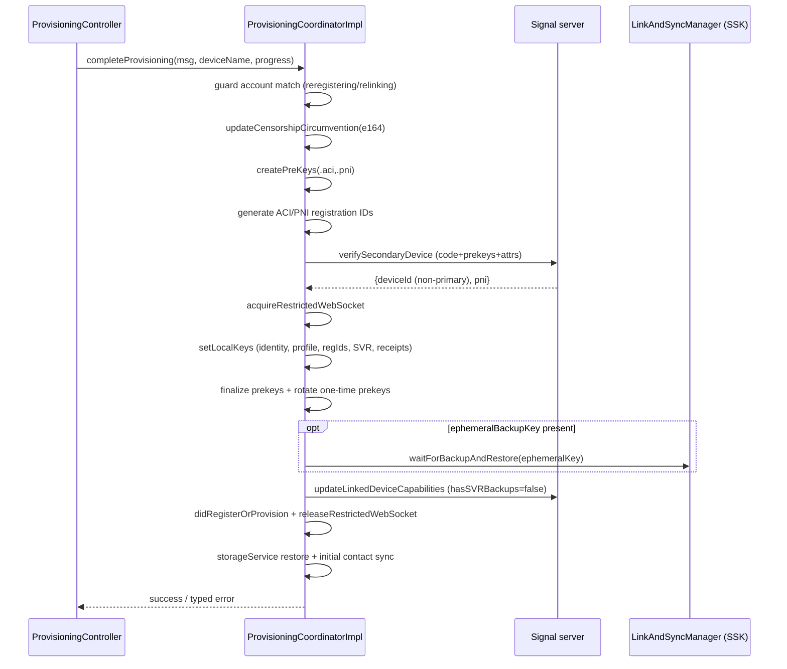
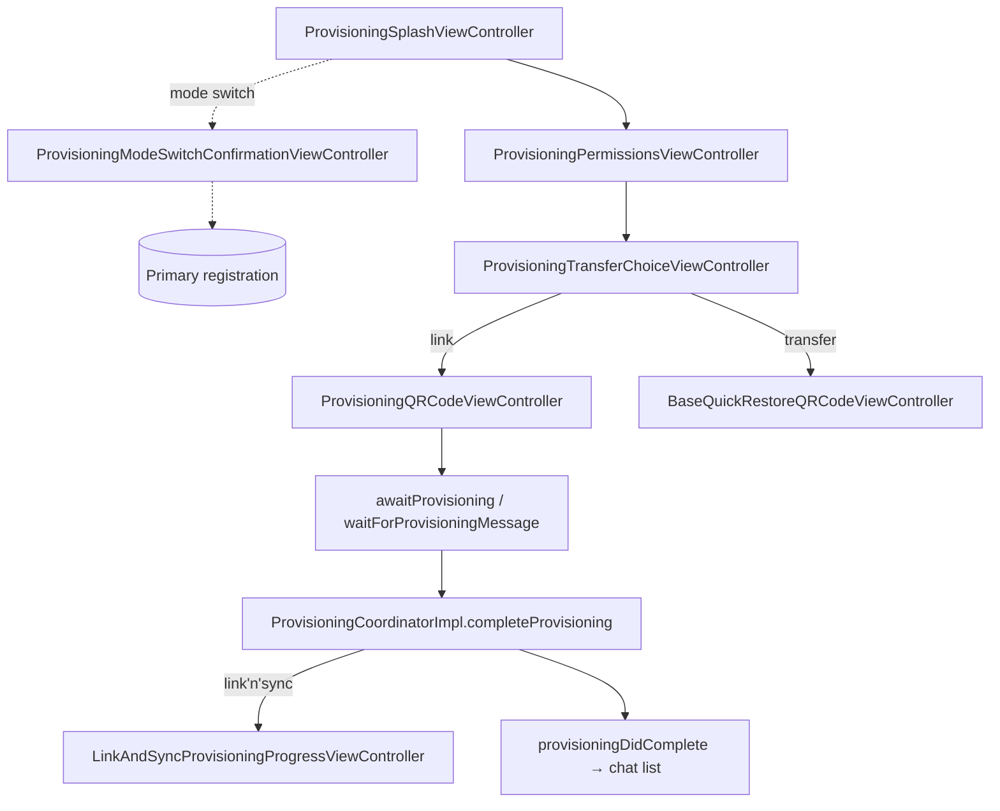

# `Signal/Provisioning/` — Linked-Device Provisioning (secondary side)

Deep documentation of the **first-party `Signal/` app target's `Provisioning/`
subsystem**: the code that runs **on a device being linked** (the *secondary* /
new device) to turn a scanned/displayed QR code into a fully provisioned linked
device. It owns the provisioning QR UI, the provisioning WebSocket lifecycle, the
decryption of the provisioning envelope sent by the primary, and the multi-step
"complete provisioning" state machine (prekeys → server link → local key install →
optional Link'n'Sync → initial syncs).

This set treats `SignalServiceKit/` and `SignalUI/` as **boundaries**: it documents
*how this subsystem uses them*, not their internals. In particular the cryptographic
value types and the *primary-side* Link'n'Sync machinery live in
`SignalServiceKit/Devices/` and are documented at
[../../SignalServiceKit/Devices/device-linking-and-sync.md](../../SignalServiceKit/Devices/device-linking-and-sync.md);
this doc references them where the two sides meet but does not restate them.

## Scope

In scope, all under `Signal/Provisioning/`:

- `ProvisioningSocketManager.swift` — provisioning WebSocket lifecycle, QR-URL
  rotation, envelope receipt + decryption.
- `ProvisioningManager.swift` — the **primary-side** `provision(...)` entry that
  builds and sends the encrypted provision message to a scanned secondary.
- `ProvisioningManager+Shims.swift` — receipt-manager shim/wrapper/mock for the above.
- `ProvisioningCoordinator.swift` — protocol + `CompleteProvisioningError`.
- `ProvisioningCoordinatorImpl.swift` — the secondary-side "complete provisioning"
  step machine with per-step undo.
- `ProvisioningCoordinatorImpl+Service.swift` — the two server requests
  (verify-secondary-device, update-linked-device-capabilities).
- `ProvisioningCoordinator+Shims.swift` — push-registration + receipt shims.
- `DeviceProvisioningURL.swift` — the `sgnl://` QR-code URL model (encode + parse).
- `UserInterface/` — the UIKit/SwiftUI onboarding flow (`ProvisioningController` +
  the view controllers it pushes).

Out of scope (boundaries, documented elsewhere or not at all here): the proto
definitions `ProvisioningProtos_*` / `RegistrationProtos_*`, `ProvisioningCipher`,
`LinkingProvisioningMessage`, `RegistrationProvisioningMessage`, and the
`LinkAndSyncManager` protocol — all in `SignalServiceKit/`.

## Conventions

- **Citations** are `path:line` (specific declaration) or `path` (file). Line
  numbers reflect the working tree at authoring time and may drift; relocate via the
  symbol name. Every factual claim about behavior cites a path.
- **Confidence labels** on claims about *purpose/behavior*:
  - **[High]** — directly observed (file read / declaration located in this session).
  - **[Medium]** — inferred from signatures, names, and cross-file convention; not
    every referenced file was read in full.
  - **[Low]** — educated inference from naming alone.
- Any uncited claim is a defect. Paths without a module prefix are relative to
  `Signal/Provisioning/`.

## One-paragraph orientation

Linking a new device is a two-sided dance. The **primary** scans a QR code the
**secondary** displays; the QR encodes an ephemeral provisioning socket address plus
the secondary's one-time public key (`DeviceProvisioningURL.swift:52-64`). The
primary then encrypts a *provision message* (its ACI/PNI identity keys, AEP, profile
key, MRBK, a provisioning code, and — optionally — an ephemeral backup key for
Link'n'Sync) to that public key and sends it through the server to the secondary's
socket; `ProvisioningManager.provision(...)` is the primary-side builder for this
(`ProvisioningManager.swift:52-172`) **[High]**. The secondary's
`ProvisioningSocketManager` opens/rotates those sockets, receives the envelope, and
decrypts it (`ProvisioningSocketManager.swift:35-312`); the UI
(`ProvisioningController`) hands the decrypted `LinkingProvisioningMessage` to
`ProvisioningCoordinatorImpl.completeProvisioning(...)`, which runs an undoable
step machine: create prekeys → verify+link on the server → install identity/profile
keys locally → optionally Link'n'Sync-restore a backup → non-reversible finalization
(capabilities, registration-state change, storage-service + contact syncs)
(`ProvisioningCoordinatorImpl.swift:77-...`) **[High]**.

Note the file naming is slightly asymmetric: `ProvisioningManager` is the
*primary*-side sender; `ProvisioningCoordinator`/`ProvisioningSocketManager`/the UI
run on the *secondary*. The coordinator's own doc comment stresses it deals only with
the behind-the-scenes mutations/requests *after* the provision message is received,
not UI (`ProvisioningCoordinator.swift:9-31`) **[High]**.

---

## 1. The provisioning QR URL — `DeviceProvisioningURL.swift`

`DeviceProvisioningURL` is the model for the `sgnl://` URL embedded in the QR code
(`DeviceProvisioningURL.swift:9-...`) **[High]**:

- `LinkType` (`:34-37`): `linkDevice = "linkdevice"` (normal linking) or
  `quickRestore = "rereg"` (quick-restore / registration-provisioning). The host of
  the URL is the link type.
- `Capability` (`:16-19`): `linknsync = "backup5"`, `wifiaware = "wifiaware"`. These
  are **provisioning-scoped** capabilities exchanged primary↔secondary, explicitly
  *not* account capabilities (`:12-15`).
- Fields: `ephemeralDeviceId` (the socket address), `publicKey` (the secondary's
  one-time `PublicKey`), `capabilities` (`:21-30`).
- `buildUrl()` hand-builds the string rather than using `URLComponents` because the
  latter percent-encodes `+`/`/` in the base64 `pub_key` in a way **Android won't
  tolerate** (`:52-64`). Query params: `uuid`, `pub_key` (URL-encoded base64), and a
  comma-joined `capabilities` list. **[High]**
- `init?(urlString:)` parses the inverse, dropping unknown capabilities/query items
  with a warning and failing (returns nil) if `uuid` or `pub_key` is missing
  (`:66-118`). **[High]**

> The QR URL carries **no secrets** — only an ephemeral socket address, a one-time
> public key, and capability flags. The sensitive payload travels encrypted *to* that
> public key through the socket (§3, §4). **[High]**

---

## 2. Socket lifecycle & QR rotation — `ProvisioningSocketManager.swift`

`ProvisioningSocketManager` (`ProvisioningSocketManager.swift:35`) is a
`ProvisioningConnectionListener` that owns one or more provisioning WebSockets and the
QR code the secondary shows. It is constructed with a `linkType`
(`.linkDevice` for linking, `.quickRestore` for quick-restore) which it stamps into
every URL it builds. **[High]**

### UI delegate
`@MainActor protocol ProvisioningSocketManagerUIDelegate`
(`:24-33`): `didUpdateProvisioningURL` (new QR to display) and
`provisioningSocketManagerDidPauseQRRotation` (stop auto-rotating, show a manual
refresh button). The concrete delegate is the QR view controller (§6). **[High]**

### Opening a socket & building the URL
`openNewProvisioningSocket()` (`:198-...`): generates a fresh
`IdentityKeyPair`, wraps it in a `ProvisioningCipher` (from `SignalServiceKit`),
connects via `DependenciesBridge.shared.libsignalNet.connectProvisioning()`, waits
(via a `CheckedContinuation`) for the server to hand back a provisioning *address*,
then returns a `DeviceProvisioningURL` built by `buildProvisioningUrl(...)`
(`:165-196`). The URL's capability list is computed from registration state and link
type: **[High]**

- For `.linkDevice`, `linknsync` is advertised only when the device is
  `unregistered` (not for `.delinked`/`.relinking`, where relinked secondaries are
  disallowed from Link'n'Sync, nor for `.transferred`) (`:168-196`).
- For `.quickRestore`, `wifiaware` is advertised only on iOS 26+ when
  `DeviceTransfer.platformSupportsWifiAware()` (`:186-193`). **[High]**

### Timing (networking consideration)
The server **closes provisioning sockets after 90s** (`:198-201` doc comment). To
stay ahead of that, `rotate()` opens a **new** socket and republishes the QR **every
45s, up to 5 times**, then calls the delegate's `…DidPauseQRRotation` to fall back to
a manual refresh button; cancellation and failures bail quietly
(`:280-312`). `start()`/`reset()`/`stop()` drive this task (`:84-96`). **[High]**

### Receiving & decrypting the envelope
Multiple sockets may be live across rotations (each is a
`ProvisioningCommunicationAttempt` with its own cipher, keyed by
`ObjectIdentifier`, `:52-70`). When **any** socket delivers an envelope
(`provisioningConnection(_:didReceiveEnvelope:sendAck:)`, `:112-150`), the manager:
acks, disconnects **all** other attempts (we don't care which socket the primary
used), stops rotation, and resumes the awaiting continuation with a
`DecryptableProvisionEnvelope` bound to *that* socket's cipher. **[High]**

`waitForMessageData(_:)` (`:258-...`) is the async entry the UI awaits; it installs
the single-shot continuation (erroring if awaited twice) and, once an envelope
arrives, decrypts it: `DecryptableProvisionEnvelope.decrypt(_:)` parses the generic
`ProvisioningEnvelope` proto, then calls `cipher.decrypt(data: envelope.body,
theirPublicKey: PublicKey(envelope.publicKey))` (`:38-50`). The `ProvisioningEnvelope`
protocol abstracts over both `ProvisioningProtos_ProvisionEnvelope` and
`RegistrationProtos_RegistrationProvisionEnvelope` so the same socket code serves both
link and quick-restore flows (`:12-18`). **[High]**

> **Crypto boundary.** The actual asymmetric handshake (ECDH + HKDF + AES-CBC +
> HMAC, version byte `1`) lives in `ProvisioningCipher` in `SignalServiceKit`; see
> [../../SignalServiceKit/Devices/device-linking-and-sync.md §3](../../SignalServiceKit/Devices/device-linking-and-sync.md).
> This subsystem only *drives* it (one fresh `IdentityKeyPair` per socket). **[High]**

---

## 3. Primary-side send — `ProvisioningManager.swift`

Despite living in the secondary app target, `ProvisioningManager.provision(with:
shouldLinkNSync:)` is the **primary device's** act of linking a scanned secondary
(`ProvisioningManager.swift:52-172`) **[High]**:

1. Reads local provisioning state in a write transaction — ACI identity key pair
   (required; `owsFail` otherwise), optional PNI identity key pair, read-receipt
   setting, Account Entropy Pool (required), a `getOrGenerate` Media Root Backup Key,
   and the local profile key (required) (`:66-97`).
2. Builds `PhoneNumberState` from the local e164 + PNI + PNI identity key. There is a
   `TODO: [#less] Allow provisioning without a phone number`; today a missing phone
   number is a hard `owsFail` (`:100-120`). **[High]**
3. If `shouldLinkNSync` **and** the scanned URL advertises `.linknsync`, generates an
   ephemeral `MessageRootBackupKey` via `linkAndSyncManager.generateEphemeralBackupKey`
   (`:122-131`). **[High]**
4. Requests a provisioning code from `deviceProvisioningService`, assembles a
   `LinkingProvisioningMessage` (ACI, ACI identity key, AEP, phone-number state,
   profile key, MRBK, optional ephemeral backup key, read-receipt flag, provisioning
   code), encrypts it to the secondary's `publicKey`
   (`buildEncryptedMessageBody(theirPublicKey:)`), and sends it to the secondary's
   `ephemeralDeviceId` socket (`:133-170`). **[High]**
5. Returns `(ephemeralBackupKey?, DeviceProvisioningTokenId)` — the token is later
   used by the primary-side Link'n'Sync long-poll (see Devices doc §4). **[High]**

`ProvisioningManager+Shims.swift` isolates one dependency: a `ReceiptManager` shim
reading `areReadReceiptsEnabled` (with a `TESTABLE_BUILD` mock)
(`ProvisioningManager+Shims.swift:9-56`). **[High]**

---

## 4. Secondary-side state machine — `ProvisioningCoordinatorImpl.swift`

`protocol ProvisioningCoordinator` exposes a single async method,
`completeProvisioning(provisionMessage:deviceName:progressViewModel:)`
(`ProvisioningCoordinator.swift:21-27`), throwing a typed `CompleteProvisioningError`
with cases `previouslyLinkedWithDifferentAccount`, `obsoleteLinkedDeviceError`,
`deviceLimitExceededError`, `linkAndSyncError`, and `genericError`
(`ProvisioningCoordinator.swift:33-45`). **[High]**

`ProvisioningCoordinatorImpl` (`ProvisioningCoordinatorImpl.swift:9`) implements it as
a chain of private `completeProvisioning_*` steps, each returning a
`CompleteProvisioningStepResult { authedAccount; undoBlock }` and appending its own
rollback via `withUndoOnFailureStep(_:)` so that a failure late in the chain can undo
everything before it (`:214-227`). **[High]**

### Up-front account-match guard
Before any mutation, it reads registration state (`:77-110`): **[High]**
- `.reregistering` — allowed only if the **phone number matches** the provision
  message, else `previouslyLinkedWithDifferentAccount`.
- `.relinking`/`.reregistering` with an ACI — allowed only if the **ACI matches**.
- A primary re-registering may provision; a secondary may not re-link to a primary
  with a different ACI.

### Step chain (each with undo)

Step details **[High]**:
1. **`_updateCensorshipCircumvention`** — updates censorship state for the (possibly
   new) e164; undo resets it (`:229-248`).
2. **`_createPreKeys`** — `preKeyManager.createPreKeysForProvisioning` for ACI and PNI
   from the keys in the provision message; undo finalizes them with
   `uploadDidSucceed: false` (`:250-280`).
3. **`_createRegistrationIds`** — generates ACI/PNI registration IDs; undo clears them
   (`:282-...`).
4. **`_verifyAndLinkOnServer`** — APN token (via push-registration shim; absence ⇒
   manual message fetch, tolerated on simulators / notifications-disabled), encrypts
   the device name with `OWSDeviceNames.encryptDeviceName(...)` under the ACI identity
   key, then `verifyAndLinkOnServer(...)`. It validates the server's PNI matches the
   primary's and that the assigned `deviceId` is **non-primary**, else
   `OWSAssertionError`. On success it `acquireRestrictedWebSocket`; undo
   `unlinkLocalDevice` on the server (`:304-...`, `:...` for `verifyAndLinkOnServer`).
   **[High]**
5. **`_setLocalKeys`** — in one write transaction installs the ACI & PNI identity key
   pairs, local profile key, ACI/PNI registration IDs, SVR keys
   (`svr.storeKeys(fromProvisioningMessage:...)`), and the read-receipt flag; undo
   wipes identity keys, randomizes the profile key, resets receipts, and wipes the
   MRBK (`:...`). **[High]**
6. **`_finalizePrekeys`** — finalizes both prekey bundles with `uploadDidSucceed:
   true` and rotates one-time prekeys; undo removes all protocol keys (`:...`).
   **[High]**

### Link'n'Sync branch
`continueFromLinkNSync(...)` runs `_linkAndSync` only when an `ephemeralBackupKey` was
present in the provision message (`:195-212`). `_linkAndSync` wires a
`SecondaryLinkNSyncProgressPhase` sink into the view model and calls
`linkAndSyncManager.waitForBackupAndRestore(...)` (the secondary side of Link'n'Sync,
documented in the Devices doc §4). On failure it wraps the error in a
`LinkAndSyncError` object carrying `retryLinkAndSync()`, `continueWithoutSyncing()`,
and `restartProvisioning()` continuations so the UI can offer retry / skip-sync /
restart without losing state (`:112-194`, `_linkAndSync` body). **[High]**

### Non-reversible finalization
`completeProvisioning_nonReversibleSteps(...)` is the point of no return: it issues an
`updateLinkedDeviceCapabilities` request (`hasSVRBackups: false` — linked devices have
no SVR backups), calls `registrationStateChangeManager.didRegisterOrProvision(...)`,
releases the restricted WebSocket as *registered*, then runs
`performNecessarySyncsAndRestores` (`:...`). The syncs: an initial storage-service
restore (60s timeout) and an initial contact sync. If Link'n'Sync already ran, the
contact sync happens **in the background** (basic contact info already restored; the
sync just fetches avatars) and thread-ordering `syncedThread` info messages are
skipped; otherwise it blocks and inserts ordered `syncedThread` markers to pre-populate
the inbox (`performInitialContactSync`, `:...`). **[High]**

### Account attributes
`makeAccountAttributes(...)` reuses the **same `AccountAttributes` object as primary
registration**, but notes the reglock token is ignored by the server for linked
devices and capabilities carry `hasSVRBackups: false`; it also derives a registration
recovery password from the AEP master key (`:...`). The server auth token is 16 random
bytes hex-encoded (`generateServerAuthToken`, `:...`). **[High]**

---

## 5. Server requests — `ProvisioningCoordinatorImpl+Service.swift`

`enum ProvisioningCoordinatorImpl.Service` holds the two network calls
(`ProvisioningCoordinatorImpl+Service.swift:9-...`) **[High]**:

- **`makeVerifySecondaryDeviceRequest(...)`** — builds the request via
  `ProvisioningRequestFactory.verifySecondaryDeviceRequest(...)`, performs it on the
  main Signal-service URL session, and maps the HTTP status through
  `ProvisioningServiceResponses.VerifySecondaryDeviceResponseCodes` into
  `.success(VerifySecondaryDeviceResponse)`, `.obsoleteLinkedDevice`,
  `.deviceLimitExceeded(DeviceLimitExceededError)`, or `.genericError`. Network
  failures/timeouts and non-`OWSHTTPError`s become `.genericError`; otherwise the
  error's status/body is re-decoded (`:18-100`). **[High]**
- **`makeUpdateSecondaryDeviceCapabilitiesRequest(...)`** — fire-and-forget
  `updateLinkedDeviceCapabilitiesRequest` via `AccountAttributesRequestFactory`; the
  response is discarded (`:102-...`). **[High]**

`ProvisioningCoordinator+Shims.swift` provides the push-registration shim (wrapping
`PushRegistrationManager.requestPushTokens`) and the receipt-manager shim (wrapping
`OWSReceiptManager.setAreReadReceiptsEnabled`)
(`ProvisioningCoordinator+Shims.swift:9-...`). **[High]**

---

## 6. The UI flow — `UserInterface/`

`ProvisioningController` (`UserInterface/ProvisioningController.swift:26`) is the
non-view orchestrator (an `NSObject`, retained strongly by its child view controllers
via `ProvisioningBaseViewController.provisioningController`,
`UserInterface/ProvisioningBaseViewController.swift:11-16`). It lazily builds the
`ProvisioningCoordinatorImpl` with the full `DependenciesBridge`/`SSKEnvironment`
wiring (`:34-57`) and owns the `ProvisioningSocketManager`. **[High]**

### Entry points **[High]**
- `presentProvisioningFlow(skipOnboarding:)` (`:70-115`) — the normal link flow. It
  first checks for an **interrupted Link'n'Sync** (a committed-but-unfinalized backup
  restore in the `.unregistered` state) and, if found,
  `SignalApp.shared.resetAppDataAndExit(...)` to start clean. Then it either jumps
  straight to the QR screen (`skipOnboarding`) or shows the splash.
- `presentRelinkingFlow()` (`:117-...`) — pushes the QR screen directly for relinking.

### Screen sequence

(`ProvisioningController.swift` transition methods: `provisioningSplashDidComplete`,
`pushPermissionsViewOrSkipToRegistration`, `provisioningPermissionsDidComplete`,
`pushTransferChoiceView`, `didConfirmSecondaryDevice` `:302-...`, `transferAccount`
`:240-...`) **[High]**

- **`ProvisioningSplashViewController`** — intro; the "link-slash" button triggers a
  mode switch to primary registration (`UserInterface/ProvisioningSplashViewController.swift:10-...`). **[High]**
- **`ProvisioningModeSwitchConfirmationViewController`** — confirms switching from
  linking to registering (`UserInterface/ProvisioningModeSwitchConfirmationViewController.swift:8-...`). **[High]**
- **`ProvisioningPermissionsViewController`** — asks for notification permission;
  `needsToAskForAnyPermissions()` short-circuits when already determined
  (`UserInterface/ProvisioningPermissionsViewController.swift:8-39`). **[High]**
- **`ProvisioningTransferChoiceViewController`** — choose "link" vs "transfer"
  (`UserInterface/ProvisioningTransferChoiceViewController.swift:9-...`). **[High]**
- **`ProvisioningPrepViewController`** — a Lottie "launch app" prep screen; its
  `didConfirmSecondaryDevice` callback pushes the QR view
  (`UserInterface/ProvisioningPrepViewController.swift:9-...`). **[High]**
- **`ProvisioningQRCodeViewController`** — hosts a SwiftUI `RotatingQRCodeView`,
  acts as the socket manager's UI delegate (loading → loaded(url) → refresh button),
  and starts the socket on `viewDidLoad` / stops on `viewWillDisappear`
  (`UserInterface/ProvisioningQRCodeViewController.swift:10-80`). **[High]**
- **`BaseQuickRestoreQRCodeViewController`** — the quick-restore variant; constructs
  its own `ProvisioningSocketManager(linkType: .quickRestore)` and
  `waitForMessage()` returns a `RegistrationProvisioningMessage`
  (`UserInterface/BaseQuickRestoreQRCodeViewController.swift:10-91`). **[High]**
- **`LinkAndSyncProvisioningProgressViewController`** + its
  `LinkAndSyncSecondaryProgressViewModel` — drive the Link'n'Sync progress UI,
  translating `OWSSequentialProgress<SecondaryLinkNSyncProgressPhase>` (including
  attachment-download byte progress) into an observable model, and gate when
  cancellation is allowed (`UserInterface/LinkAndSyncProvisioningProgressViewController.swift:12-...`). **[High]**

### Receiving & dispatching the message
`awaitProvisioning(from:navigationController:)` awaits
`waitForProvisioningMessage` (which calls
`provisioningSocketManager.waitForMessageData(ProvisioningProtos_ProvisionEnvelope.self)`
then parses a `LinkingProvisioningMessage`), stops the socket, enforces a **minimum
`provisioningVersion`** (showing an "update your primary" sheet otherwise), and hands
the message to the coordinator via `performCoordinatorTaskWithModal(...)`
(`ProvisioningController.swift:314-...`, `waitForProvisioningMessage` `:...`). **[High]**

### Error recovery UI
`performCoordinatorTaskWithModal(...)` presents either the Link'n'Sync progress
screen or a modal activity indicator and maps `CompleteProvisioningError` cases to
action sheets via `errorActionSheet(...)` / `linkAndSyncRetryActionSheet(...)`
(`ProvisioningController.swift:...`). Notable behaviors **[High]**:
- `previouslyLinkedWithDifferentAccount`, `deviceLimitExceededError`,
  `obsoleteLinkedDeviceError`, and `genericError` each produce a tailored sheet; the
  generic retry checks whether the device actually ended up registered before
  deciding to finish vs. reset back to the QR screen.
- Link'n'Sync errors offer **contact-support** (restore failed),
  **network-retry** (`retryLinkAndSync()`), **restart provisioning**
  (`restartProvisioning()` — which runs the accumulated undo blocks), or
  **continue without syncing** (`continueWithoutSyncing()`), plus a special
  "update required" sheet for `BackupImportError.unsupportedVersion`.
- `resetBackToQrCodeController(...)` releases the restricted WebSocket, pops back, and
  re-arms `awaitProvisioning`.

On success `provisioningDidComplete(...)` dismisses any modal and shows the main
conversation split view (`:...`). **[High]**

---

## 7. Cross-module interactions (boundary summary)

| Collaborator | Module | Used for | Confidence |
| --- | --- | --- | --- |
| `ProvisioningCipher`, `LinkingProvisioningMessage`, `RegistrationProvisioningMessage` | SignalServiceKit | envelope encrypt/decrypt + message model | [High] (constructed/called here; internals out of scope) |
| `LinkAndSyncManager` | SignalServiceKit | ephemeral key gen (primary) + backup restore (secondary) | [High] |
| `OWSIdentityManager`, `AccountKeyStore`, `ProfileManager`, `OWSReceiptManager`, `SecureValueRecovery` | SignalServiceKit | reading/installing identity, AEP, MRBK, profile key, SVR keys, receipts | [High] |
| `PreKeyManager` | SignalServiceKit | provisioning prekey bundles + one-time rotation | [High] |
| `TSAccountManager`, `RegistrationStateChangeManager` | SignalServiceKit | registration-state guards + `didRegisterOrProvision` / `unlinkLocalDevice` | [High] |
| `RegistrationWebSocketManager`, `ChatConnectionManager`, `libsignalNet` | SignalServiceKit | restricted WebSocket + provisioning socket | [High] |
| `StorageServiceManager`, `SyncManagerProtocol` | SignalServiceKit | initial storage-service restore + contact sync | [High] |
| `OWSSignalServiceProtocol`, `NetworkManagerProtocol`, `ProvisioningRequestFactory`, `AccountAttributesRequestFactory` | SignalServiceKit | the two provisioning HTTP requests + censorship state | [High] |
| `PushRegistrationManager` | app (`AppEnvironment`) + SSK | APN token for account attributes | [High] |
| `RotatingQRCodeView`, `OWSViewController`, `OWSNavigationController`, action sheets | SignalUI | QR UI + navigation chrome | [High] |
| `SignalApp` | app target | reset-and-exit, show registration, show chat list | [High] |
| `DeviceTransferCoordinator`, `QuickRestoreManager` | app target | the "transfer" branch of the choice screen | [Medium] (invoked from `transferAccount`; those types live outside this folder) |

---

## 8. Notable crypto / networking considerations

- **Asymmetric provisioning handshake.** Each displayed QR carries a *fresh*
  one-time `IdentityKeyPair`'s public key; the primary encrypts the provision message
  to it with `ProvisioningCipher` (ECDH → HKDF → AES-CBC → HMAC, version `1`). The
  QR itself holds no secret. (`ProvisioningSocketManager.swift:198-...`;
  cipher internals in SSK.) **[High]**
- **Socket churn vs. server timeout.** The 45s×5 rotation is deliberately tighter
  than the server's 90s socket close so a scanning primary never writes into a dead
  socket (`ProvisioningSocketManager.swift:198-312`). **[High]**
- **Identity distribution.** The secondary receives both ACI **and** PNI identity key
  pairs plus AEP, MRBK, and profile key inside the encrypted message, so it comes
  online with full identity state without re-deriving anything
  (`ProvisioningManager.swift:133-170`, installed in
  `ProvisioningCoordinatorImpl` `_setLocalKeys`). **[High]**
- **Server-side sanity checks.** After `verifySecondaryDevice`, the coordinator
  asserts the server-returned PNI matches the primary's and that the assigned device
  id is **non-primary** — a defense against a server attempting to link the device as
  a primary (`ProvisioningCoordinatorImpl.swift:...` in `verifyAndLinkOnServer`).
  **[High]**
- **Undoable until the point of no return.** Every mutating step registers a rollback
  so a mid-flow failure (including a failed Link'n'Sync) can be fully reverted via
  `restartProvisioning()`; only `completeProvisioning_nonReversibleSteps` commits the
  registration-state change (`ProvisioningCoordinatorImpl.swift:214-227`, `:...`).
  **[High]**
- **Linked-device account posture.** Linked devices advertise `hasSVRBackups: false`,
  have the reglock token ignored, and start as manual message fetchers when no APN
  token is available (`ProvisioningCoordinatorImpl.swift` `makeAccountAttributes` /
  `getApnRegistrationId`). **[High]**
- **Cross-platform URL encoding.** `DeviceProvisioningURL.buildUrl()` avoids
  `URLComponents` specifically so the base64 public key is byte-compatible with
  Android's parser (`DeviceProvisioningURL.swift:52-64`). **[High]**

---

## 9. File reference checklist

- `DeviceProvisioningURL.swift` — §1, §8
- `ProvisioningSocketManager.swift` — §2, §8
- `ProvisioningManager.swift` — §3, §8
- `ProvisioningManager+Shims.swift` — §3
- `ProvisioningCoordinator.swift` — §4
- `ProvisioningCoordinatorImpl.swift` — §4, §8
- `ProvisioningCoordinatorImpl+Service.swift` — §5
- `ProvisioningCoordinator+Shims.swift` — §5
- `UserInterface/ProvisioningController.swift` — §6
- `UserInterface/ProvisioningBaseViewController.swift` — §6
- `UserInterface/ProvisioningSplashViewController.swift` — §6
- `UserInterface/ProvisioningModeSwitchConfirmationViewController.swift` — §6
- `UserInterface/ProvisioningPermissionsViewController.swift` — §6
- `UserInterface/ProvisioningTransferChoiceViewController.swift` — §6
- `UserInterface/ProvisioningPrepViewController.swift` — §6
- `UserInterface/ProvisioningQRCodeViewController.swift` — §6
- `UserInterface/BaseQuickRestoreQRCodeViewController.swift` — §6
- `UserInterface/LinkAndSyncProvisioningProgressViewController.swift` — §6
