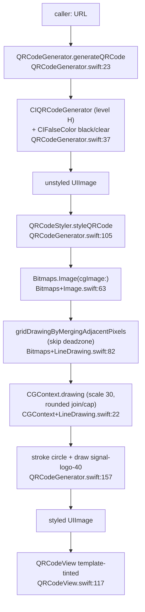

# `Signal/QRCodes/` — Styled QR Code Rendering

Documents the **first-party `Signal/QRCodes/` directory**: a self-contained,
UI-adjacent toolkit for *generating* and *displaying* Signal-branded QR codes.
This is a pure presentation/rendering subsystem — it encodes a `URL` (or raw
`Data`) into a styled bitmap and shows it in a view. It does **not** scan QR
codes, and it owns no persisted state or network logic.

Scope (all files under `Signal/QRCodes/`):

- `QRCodeView.swift` — the display layer: a UIKit `QRCodeView`, a SwiftUI
  `UIViewRepresentable` wrapper, and a higher-level `RotatingQRCodeView`.
- `QRCodeGenerator.swift` — the encoding + styling pipeline (`QRCodeGenerator`
  and the private `QRCodeStyler`).
- `Bitmaps/` — a small bitmap-geometry toolkit (`Bitmaps.Image`,
  `Bitmaps.Point`/`Rect`, `Bitmaps.GridDrawing`, `CGContext` line drawing) used
  by the styler to render rounded "pixels" and the center logo deadzone.

Out of scope but referenced as **boundaries**: `QRCodeColor`
(`SignalServiceKit/QRCodes/QRCodeColor.swift:9`) is the color-preset enum this
code consumes but which lives in `SignalServiceKit`; and the many *consumer*
view controllers (username links, provisioning, group links, payments) that
embed these views, documented here only as *how they use the subsystem*.

## Conventions

- **Citations** are `path:line` (specific declaration) or `path`
  (directory/file). Line numbers reflect the working tree at authoring time and
  may drift; relocate via the symbol name.
- **Confidence labels** on behavioral claims:
  - **[High]** — directly observed (file read / declaration located this session).
  - **[Medium]** — inferred from signatures, names, and cross-file convention.
  - **[Low]** — educated inference from naming alone.
- Any uncited behavioral claim is a defect.

## One-paragraph orientation

A caller hands a `URL` to a view (`QRCodeView.setQRCode(url:stylingMode:)`,
`Signal/QRCodes/QRCodeView.swift:139`) or directly to `QRCodeGenerator`
(`Signal/QRCodes/QRCodeGenerator.swift:12`). The generator uses the system
`CIQRCodeGenerator` CoreImage filter to produce an *unstyled* black-on-clear QR
bitmap (`:37`), then `QRCodeStyler` (`:74`) rewrites it into a smooth,
Signal-branded image: it parses the bitmap into a `Bitmaps.Image`, merges
adjacent "on" pixels into line segments, strokes them with rounded joins/caps so
the dots render as rounded shapes, and (for the logo variant) carves a circular
center *deadzone* and draws the Signal logo inside it **[High]**. The resulting
`UIImage` is rendered as a *template* image so the view can tint it with a
`QRCodeColor` foreground (`QRCodeView.swift:117`) **[High]**.

---

## Display layer — `QRCodeView.swift`

### `QRCodeView: UIView` — `QRCodeView.swift:10`

Confidence: **[High]** (read in full). A UIKit view that shows exactly one of
three states via a private `Mode` enum (`:100`): a loading spinner, the QR image,
or an error glyph (`setMode(_:)`, `:106`). State is driven by three public
entry points — `setLoading()` (`:127`), `setError()` (`:131`),
`setQRCode(image:)` (`:135`), and the convenience `setQRCode(url:stylingMode:)`
(`:139`) which calls `QRCodeGenerator().generateQRCode(...)` and falls back to
the error state if generation returns `nil` **[High]**.

Construction (`init`, `:16`) is configurable: `qrCodeTintColor: QRCodeColor`
(default `.blue`), `contentInset`, `cornerRadius`, `borderWidth` **[High]**.

Notable UI considerations (all **[High]**):

- **Forced light mode.** `overrideUserInterfaceStyle = .light` (`:27`) — QR codes
  are always shown on a light background regardless of system appearance, to keep
  contrast scannable.
- **No antialiasing on the image view.** `magnificationFilter`/`minificationFilter`
  are set to `.nearest` (`:60`) so scaling the already-smoothed bitmap doesn't
  blur the module edges and hurt scannability.
- **Template tinting.** The image is applied via
  `qrCodeImageView.setTemplateImage(image, tintColor: qrCodeTintColor.foreground)`
  (`:117`), so one generated (black) bitmap can be recolored per `QRCodeColor`.
- **Rounded, bordered padding.** `cornerRadius`/`borderWidth` and
  `qrCodeTintColor.paddingBorder` (`:32–33`) draw the familiar card around the
  code; `directionalLayoutMargins` (`:29`) provide the content inset.
- `init?(coder:)` is unsupported — `owsFail("Not implemented!")` (`:95`).

### `QRCodeViewRepresentable: UIViewRepresentable` — `QRCodeView.swift:158`

Confidence: **[High]**. SwiftUI bridge over `QRCodeView`. Holds an
`ObservableObject` `Model` (`:159`) with a `@Published var qrCodeURL: URL?`
(`:160`). `updateUIView` (`:208`) renders the code when a URL is present and
otherwise shows the loading state — so clearing the URL reverts to the spinner
**[High]**. Styling/tint/inset parameters mirror `QRCodeView`'s initializer.

### `RotatingQRCodeView: View` — `QRCodeView.swift:220`

Confidence: **[High]**. A higher-level SwiftUI view whose `Model` (`:221`)
exposes a `URLDisplayMode` enum (`:222`) with three cases: `.loading`,
`.loaded(URL)`, and `.refreshButton`. `updateURLDisplayMode(_:)` (`:242`) maps
the mode onto the embedded `QRCodeViewRepresentable.Model.qrCodeURL` **[High]**.
The name and the `.refreshButton` case (with localized
`SECONDARY_ONBOARDING_SCAN_CODE_REFRESH_CODE_BUTTON` text, `:270`) indicate it is
built for the device-linking / quick-restore flow where provisioning URLs expire
and must be refreshed **[Medium]** — see Consumers below. The body (`:254`) wraps
the code in an ultramarine rounded card (`:257`) and insets it ~10% of the
available height (`:263`) **[High]**. SwiftUI `#Preview`s exercise all three
modes (`:292`) **[High]**.

---

## Encoding + styling — `QRCodeGenerator.swift`

### `QRCodeGenerator` — `QRCodeGenerator.swift:16`

Confidence: **[High]** (read in full). A stateless `struct`. Two entry points:

- `generateQRCode(url:stylingMode:)` (`:23`) — encodes `url.absoluteString` as
  UTF-8 `Data`, generates an unstyled code, then runs it through
  `QRCodeStyler().styleQRCode(...)` **[High]**.
- `generateUnstyledQRCode(data:)` (`:37`) — the raw path. Uses the CoreImage
  `CIQRCodeGenerator` filter at **error-correction level `"H"`** (`:43`), then
  recolors to **black-over-clear** via `CIFalseColor` (`:58`) and rasterizes the
  `CIImage` to a `CGImage`-backed `UIImage` (`:63`) — the comment notes
  CIImage-backed `UIImage`s won't render without antialiasing, so a `CGImage` is
  produced for crisp scaling **[High]**. Callers tint later.

  > The high `"H"` correction level is deliberate: the logo deadzone occludes
  > part of the code, so maximum redundancy keeps it scannable **[Medium]**. (The
  > unit test fixture uses `"L"` for a smaller known pattern —
  > `BitmapsImageParsingTest.swift`, `signalDotOrgQRCode` **[High]**.)

- `StylingMode` enum (`:13`): `.brandedWithLogo` (center logo + deadzone) vs
  `.brandedWithoutLogo` (rounded dots, no deadzone) **[High]**.

Error handling throughout is non-throwing: failures log via `owsFailDebug` and
return `nil` (filter missing, CI image missing, CGImage creation failed) —
`:39, :47, :64` **[High]**.

### `QRCodeStyler` (private) — `QRCodeGenerator.swift:74`

Confidence: **[High]**. The rendering heart. `styleQRCode(unstyledQRCode:stylingMode:)`
(`:105`):

1. Converts the unstyled image to a `Bitmaps.Image` (`:109`); on failure returns
   the unstyled image unchanged (`:114`) **[High]**.
2. For `.brandedWithLogo`, computes a **centered deadzone** sized to
   `deadzoneSizePointsPercentage` (`64/184`) of the code, with 1 point of padding
   (`deadzone` switch at `:117`; `centeredDeadzone(...)` defined as a
   `Bitmaps.Image` extension at `:175`); `.brandedWithoutLogo` uses no deadzone
   **[High]**.
3. Builds a `Bitmaps.GridDrawing` by merging adjacent "on" pixels into line
   segments, skipping any point inside the deadzone circle
   (`gridDrawingByMergingAdjacentPixels(deadzone:)`, `:129`) **[High]**.
4. Paints that grid into a `CGContext` scaled by `imagePixelsPerQRCodePoint`
   (`30`) with rounded line join/cap, which turns runs of modules into smooth
   rounded strokes (`CGContext.drawing(gridDrawing:...)`, `:134`) **[High]**.
5. If there is a deadzone (`:141`), strokes a circle (width =
   `deadzoneCircleStrokePercentage`, `4/64`; `strokeEllipse` at `:151`) and draws
   `signal-logo-40` (`:157`) scaled to `deadzoneLogoSizePercentage` (`38/64`,
   `:158`) inside it (`:159`) **[High]**.

`Constants` (`:78`) documents the "point" (QR coordinate) vs "pixel" (output
image) distinction **[High]**. A `centeredDeadzone` precondition rejects
deadzones ≥ 50% of a dimension — "Deadzoning too much of a QR code means it might
not scan!" (`:179`) **[High]**.

---

## `Bitmaps/` — bitmap geometry toolkit

Confidence: **[High]** (all four files read). A `Bitmaps` namespace enum
(`Bitmaps.swift:9`) with:

| Type | Declaration | Responsibility |
|------|-------------|----------------|
| `Bitmaps.Image` | `Bitmaps+Image.swift:15` | Wraps a `CGImage`'s raw RGBA bytes; `pixel(at:)` (`:117`) / `hasVisiblePixel(at:)` (`:106`) read module state. **Origin is bottom-left** (CoreGraphics convention) and `init?(cgImage:)` (`:63`) flips the (upper-left-origin) source image to match (`:96`). |
| `Bitmaps.Point` / `Bitmaps.Rect` | `Bitmaps+Shapes.swift:9` / `:31` | Integer QR coordinates. `cgPoint(scaledBy:)` (`:23`) centers each module in the scaled output; `Rect.inscribedCircleContains(_:)` (`:61`) powers the circular deadzone test. |
| `Bitmaps.GridDrawing` / `.Segment` | `Bitmaps+LineDrawing.swift:13` / `:14` | A set of horizontal/vertical line segments. `Bitmaps.Image.gridDrawingByMergingAdjacentPixels(deadzone:)` (`:82`) produces it by run-merging visible pixels per row and per column, excluding deadzone points. |
| `CGContext.drawing(gridDrawing:...)` | `CGContext+LineDrawing.swift:22` | Rasterizes a `GridDrawing` into a new `CGContext`, scaling and stroking the segments with rounded join/cap to get the smooth look. |

A `#if TESTABLE_BUILD` initializer on `Bitmaps.Image` (`:46`) lets tests build a
bitmap from raw bytes **[High]**.

### Tests (adjacent, not in this folder)

`Signal/test/QRCodes/BitmapsImageParsingTest.swift` verifies `Bitmaps.Image`
parsing: a known `signal.org` QR code's per-pixel on/off pattern, a solid-blue
PNG, and semi-transparent alpha values **[High]**. (The styling pipeline itself
is not directly unit-tested here.)

---

## Interactions with the rest of the app

The subsystem is a *library* consumed by feature view controllers. Every call
site passes a `URL` (or data) in and gets a view/image out; none of them feed
state back into the subsystem **[High]**.

- **Username links** — the biggest consumer. `QRCodeGenerator` and `QRCodeView`
  render a user's share link, with the user-selectable `QRCodeColor` applied as
  tint:
  - `Signal/Usernames/Links/UsernameLinkPresentQRCodeViewController.swift:31,120,130`
    (`generateQRCode(url:)` → `setQRCode(image:)`) **[High]**.
  - `Signal/Usernames/Links/UsernameLinkQRCodeColorPickerViewController.swift:46,51`
    — rebuilds the view per color choice **[High]**.
  - `Signal/Usernames/Links/UsernameLinkQRCodeContentController.swift` and the
    scan-side `UsernameLinkScanQRCode*` controllers (scanning is *not* part of
    this folder) **[Medium]**.
- **Device linking / provisioning & quick restore** — uses `RotatingQRCodeView`
  for codes that expire and refresh:
  - `Signal/Provisioning/UserInterface/ProvisioningQRCodeViewController.swift:137`
    **[High]**.
  - `Signal/Provisioning/UserInterface/BaseQuickRestoreQRCodeViewController.swift:112`
    **[High]**.
- **Group invite links** — `GroupLinkQRCodeViewController.swift:39–40` builds a
  plain `QRCodeView()` and `setQRCode(url:)` **[High]**.
- **Payments transfer-in** — `PaymentsTransferInViewController.swift:95` uses the
  *unstyled* path (`generateUnstyledQRCode(...)`), i.e. a raw code without the
  Signal logo/rounding **[High]**.

### Boundary: `QRCodeColor`

`QRCodeColor` (`SignalServiceKit/QRCodes/QRCodeColor.swift:9`) is a `public`,
`CaseIterable`, `UnknownEnumCodable` enum of preset colors (blue, white, grey,
olive, green, orange, pink, purple) exposing `background`, `foreground`,
`canvas`, `paddingBorder`, and `username` colors **[High]**. It lives in
`SignalServiceKit` (not this folder) because the chosen color is **persisted and
synced** — it is read/written by the username-link storage path
(`LocalUsernameManager`, `StorageServiceProto+Sync`, and the backup/account
archivers) **[Medium]** (observed via usage search; those files not read in full
this session). This subsystem only *consumes* the enum's `UIColor`s for tinting.

## Data flow (branded, with logo)

## Edge cases & notes (confidence: **[High]** unless marked)

- Generation never throws: any failure logs `owsFailDebug` and yields `nil`
  (generator) or the unstyled image unchanged (styler); `QRCodeView` maps a
  `nil` result to its error glyph (`QRCodeView.swift:151`).
- Deadzone size is capped below 50% per dimension to protect scannability
  (`QRCodeGenerator.swift:179`).
- Bitmaps use a **bottom-left origin** to match CoreGraphics, and
  `Bitmaps.Image.init?(cgImage:)` flips the source to compensate — a common
  source of coordinate confusion when extending this code
  (`Bitmaps+Image.swift:96`).
- `QRCodeView` forces light mode and disables image antialiasing; both are
  scannability measures, not cosmetic defaults (`QRCodeView.swift:27, :60`).
- The folder does **not** scan QR codes — scanning (e.g.
  `UsernameLinkScanQRCodeViewController`) lives with its feature, not here
  **[Medium]**.
