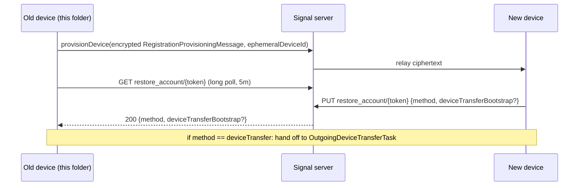

# `Signal/QuickRestore/` — Outgoing Device Restore / Quick Restore

Documents the **first-party `Signal/QuickRestore/` folder only**. This is the
**outgoing (old-device) side** of Signal's "quick restore" flow: the device that
already has an account scans a QR code shown by a *new* device, pushes a
provisioning message to it, and then waits to learn how the new device wants to
restore (remote backup, local backup, device transfer, or decline). If the new
device picks a direct device-to-device transfer, this folder also drives the
transfer-handshake UI.

This set treats `SignalServiceKit/` and the sibling app folders
(`Signal/DeviceTransfer/`, `Signal/Provisioning/`, `Signal/Registration/`) as
**boundaries**: it documents *how QuickRestore uses them*, not their internals.
For the app-target overview see [../README.md](../README.md); for the service
layer see [../../SignalServiceKit/README.md](../../SignalServiceKit/README.md).

## Scope

Files in `Signal/QuickRestore/` (sizes from listing the working tree this session, **[High]**):

- `QuickRestoreManager.swift` (~14 KB) — the service object: builds/sends the
  provisioning message and long-polls the server for the new device's restore choice.
- `OutgoingDeviceRestorePresenter.swift` (~20 KB) — `@MainActor` UI coordinator /
  state machine for the whole outgoing flow.
- `OutgoingDeviceRestoreViewModel.swift` (~9 KB) — `ObservableObject` that bridges
  the manager and the `Signal/DeviceTransfer/` transfer task.
- `OutgoingDeviceRestoreInitialViewController.swift` (~5 KB) — SwiftUI intro screen
  + `OutgoingDeviceRestoreInitialPresenter` protocol.
- `OutgoingDeviceRestoreBackupPromptViewController.swift` (~5 KB) — SwiftUI prompt to
  back up before transferring when the last backup is stale.
- `OutgoingDeviceRestoreProgressViewController.swift` (~1 KB) — thin host for the
  shared transfer-progress UI.

## Conventions

- **Citations** are `path:line` (specific declaration) or `path` (file). Line numbers
  reflect the working tree at authoring time and may drift; relocate via the symbol name.
- **Confidence labels**:
  - **[High]** — directly observed (file read / declaration located this session).
  - **[Medium]** — inferred from signatures, names, and cross-file convention; the
    referenced file was not read in full.
  - **[Low]** — educated inference from naming alone.
- Any uncited claim is a defect. Where source gives no evidence of design intent, the
  text says **"intent undetermined — no evidence in source."**

## One-paragraph orientation

The old device enters this flow from the camera/QR scanner:
`PhotoCaptureViewController` handles a `.quickRestore` scan result and calls
`AppEnvironment.shared.outgoingDeviceRestorePresenter.present(provisioningURL:…)`
(`Signal/src/ViewControllers/Photos/PhotoCaptureViewController.swift:1743`) **[High]**.
Both `QuickRestoreManager` and `OutgoingDeviceRestorePresenter` are singletons
constructed in the main-app dependency container
(`Signal/AppLaunch/AppEnvironment.swift:196` and `:207`) **[High]**. The presenter
owns an `OutgoingDeviceRestoreViewModel`, which calls `QuickRestoreManager.register`
to push an encrypted `RegistrationProvisioningMessage` to the new device, then
`waitForRestoreMethodChoice` to long-poll for the new device's decision, and — if the
choice is device transfer — hands off to `OutgoingDeviceTransferTask` from
`Signal/DeviceTransfer/` **[High]**.

---

## `QuickRestoreManager` — `QuickRestoreManager.swift:10`

Confidence: **[High]** (read in full). A `public class` wiring together backup,
identity, account, provisioning, and networking dependencies via constructor injection
(`:30`–`:48`). Its public surface is three methods plus two nested public enums.

Dependencies (`:23`–`:30`): `AccountKeyStore`, `BackupNonceMetadataStore`,
`BackupSettingsStore`, `any DB`, `DeviceProvisioningService`, `OWSIdentityManager`,
`any NetworkManagerProtocol`, `TSAccountManager` — all from `SignalServiceKit`/
`Signal/Provisioning` (**boundary types**, **[Medium]**).

### `RestoreMethodToken` — `QuickRestoreManager.swift:11`
A `typealias … = String`. A per-session opaque token (a `UUID().uuidString`, minted at
`:131`) that correlates the provisioning message with the later restore-choice poll **[High]**.

### `Error` — `QuickRestoreManager.swift:13`
`errorWaitingForNewDevice`, `invalidRegistrationMessage`, `unsupportedRestoreMethod`,
`missingRestoreInformation`, `unknown`. `missingRestoreInformation` is thrown when any
piece of local account state needed to build the provisioning message is absent **[High]**.

### `register(deviceProvisioningUrl:) async throws -> RestoreMethodToken` — `QuickRestoreManager.swift:52`
Confidence: **[High]**. The heart of the "quick restore" bootstrap. Steps:

1. **One DB read** (`:53`–`:124`) gathers everything needed, each guarded with
   `owsFailDebug` + `throw Error.missingRestoreInformation`:
   - local identifiers (`tsAccountManager.localIdentifiers`), `AccountEntropyPool`
     (`accountKeyStore.getAccountEntropyPool`), and ACI + PNI identity key pairs
     (`identityManager.identityKeyPair(for:)`) (`:59`–`:80`).
   - the registration lock PIN (`ows2FAManagerRef.pinCode`) (`:81`).
   - a `BackupTier` derived from `backupSettingsStore.backupPlan` — `.free`→`.free`,
     any paid variant→`.paid`, disabled/disabling→`nil` (`:83`–`:88`).
   - last-backup time/size, only when a backup tier exists (`:90`–`:99`).
   - **forward-secrecy material**: builds a `MessageRootBackupKey(accountEntropyPool:aci:)`
     (`:101`) and reads `getLastForwardSecrecyToken` (`:105`) and
     `getNextSecretMetadata` (`:109`) from `BackupNonceMetadataStore` (`:101`–`:113`).
2. Validates the local e164 (`E164(localIdentifiers.phoneNumber)`, else throws) (`:127`).
3. Mints the `restoreMethodToken` (`:131`).
4. **WiFi Aware capability negotiation** (`:133`–`:142`): advertises
   `.wifiaware` only if the scanned URL advertises it **and**
   `DeviceTransfer.platformSupportsWifiAware()` **and**
   `RemoteConfig.current.wifiAwareDeviceTransferEnabled`; otherwise empty capabilities.
5. Builds a `RegistrationProvisioningMessage`
   (`SignalServiceKit/Devices/RegistrationProvisioningMessage.swift:21`, **boundary**,
   **[Medium]**) packing ACI, ACI identity key pair, phone-number state (incl. PNI
   identity key pair), the `AccountEntropyPool`, PIN, backup tier/version/timestamp/size,
   the restore-method token, and the forward-secrecy tokens (`:144`–`:163`).
6. **Encrypts to the new device's public key** and sends via provisioning:
   `registrationMessage.buildEncryptedMessageBody(theirPublicKey:)` where the key is
   `deviceProvisioningUrl.publicKey` (`:165`–`:166`), then
   `deviceProvisioningService.provisionDevice(messageBody:ephemeralDeviceId:)`
   (`:167`–`:170`). Returns the token (`:172`).

> **Cryptography note [High/Medium].** The provisioning payload is end-to-end
> encrypted to the *new* device's public key carried in the scanned
> `DeviceProvisioningURL` (`Signal/Provisioning/DeviceProvisioningURL.swift:9`) — the
> plaintext (which includes the `AccountEntropyPool`, PIN, and identity key pairs) is
> never sent to the server in the clear. The actual sealing is delegated to
> `RegistrationProvisioningMessage.buildEncryptedMessageBody` (boundary; sealing
> algorithm not read here — **[Medium]**). The server only relays an opaque ciphertext
> to the `ephemeralDeviceId`.

### `RestoreMethodType` — `QuickRestoreManager.swift:174`
Confidence: **[High]**. `remoteBackup | localBackup | deviceTransfer(URL) | decline`.
A `fileprivate init?(response:)` (`:179`) maps the server/new-device JSON to the enum;
for `deviceTransfer` it base64-decodes (`Data(base64EncodedWithoutPadding:)`) the
`deviceTransferBootstrap` string into a UTF-8 URL, returning `nil` (→ "unsupported")
if any step fails (`:184`–`:197`).

### `reportRestoreMethodChoice(method:restoreMethodToken:) async throws` — `QuickRestoreManager.swift:201`
Confidence: **[High]**. `PUT`s the chosen method for the token; `200/204`→return,
`429`→sleep for the server-provided retry delay and loop, anything else→`Error.unknown`.
This is the path the **new device / registration side** uses to tell the old device's
server endpoint which method was chosen — note it is also called from
`Signal/DeviceTransfer/DeviceTransferCoordinator.swift:141` and
`Signal/Registration/RegistrationCoordinatorImpl.swift:4514` (**[High]** that the calls
exist; those callers not read in full — **[Medium]**).

### `waitForRestoreMethodChoice(restoreMethodToken:) async throws -> RestoreMethodType` — `QuickRestoreManager.swift:221`
Confidence: **[High]**. **Long-poll loop**: `GET`s `restore_account/<token>`, and on
`200` decodes `WaitForRestoreMethodChoice.Response` → `RestoreMethodType` (throwing
`errorWaitingForNewDevice` on decode failure, `unsupportedRestoreMethod` on an
un-mappable method); `400`→`invalidRegistrationMessage`; `204` (server-side timeout
elapsed with no choice yet)→loop again; `429`→retry-delay sleep then loop; any thrown
error is funneled to `Error.unknown` (`:221`–`:260`).

### `Constants` — `QuickRestoreManager.swift:263`
`longPollRequestTimeoutSeconds = 60 * 5` (5-minute server-side long poll),
`defaultRetryTime = 15 s`.

### `Requests` — `QuickRestoreManager.swift:268`
Confidence: **[High]**. `fileprivate` request builders against
`v1/devices/restore_account/<token>`.

| Request | Verb | Line | Notes |
|---|---|---|---|
| `WaitForRestoreMethodChoice.buildRequest` | GET | `:285` | Adds `timeout` query param = 5 min; `auth = .anonymous`; redacts the token in logs via `applyRedactionStrategy(.redactURL(sensitiveValues:))`; local `timeoutInterval` = server timeout + 10 s wiggle room. |
| `ChooseRestoreMethod.buildRequest` | PUT | `:303` | Body `{ "method": … }`; for `deviceTransfer`, adds `deviceTransferBootstrap` as **unpadded base64** of the URL (comment notes the **server enforces a 4096-byte limit**); `auth = .anonymous`; token redacted in logs. |

> **Networking notes [High].** All three endpoints use **anonymous auth** — the token
> is the only correlator, and it is explicitly redacted from logs. The 5-minute GET is a
> server-side long poll; the client distinguishes "still waiting" (`204`) from
> "something is wrong" (`400`) and backs off on `429` using
> `HTTPUtils.retryDelayNanoSeconds` (boundary helper, **[Medium]**).

---

## UI layer

### `OutgoingDeviceRestorePresenter` — `OutgoingDeviceRestorePresenter.swift:18`
Confidence: **[High]** (read in full). A `@MainActor` coordinator conforming to
`OutgoingDeviceRestoreInitialPresenter`; the de-facto **state machine** for the outgoing
flow. Logs under `[DeviceRestore][Outgoing]`.

- **Entry.** `present(provisioningURL:presentingViewController:animated:)` (`:60`)
  builds the `OutgoingDeviceRestoreViewModel`, pushes
  `OutgoingDeviceRestoreIntialViewController` into a private `OWSNavigationController`,
  and presents it.
- **Lifecycle notifications.** `didTapTransfer` posts
  `.outgoingDeviceTransferDidStart` on entry and `.outgoingDeviceTransferDidEnd` via
  `defer` (`:206`–`:210`). The names are declared at `:13`–`:16`; a comment explains
  they exist so `ConversationSplitViewController` can suppress its legacy
  device-transfer listener, and are expected to be removable once that legacy path is
  deprecated **[High]**.
- **Main orchestration — `didTapTransfer()`** (`:204`):
  1. `viewModel.confirmTransfer()` — biometric gate (`:221`); silent return on failure.
  2. `pushBackupPromptViewController` (`:122`): if a (non-disabled) backup plan exists and
     the last backup is older than `lastBackupAgeThreshold = 30 minutes` (`:22`), prompts
     the user to back up first; if they choose to, it dismisses this UI and routes into
     app settings' Backups page with `.automaticallyStartBackup`, later showing a
     "ready to restore" sheet that reopens the camera (`:224`–`:243`, `:379`–`:420`).
  3. Otherwise shows a spinner sheet (`presentSheet`, `:88`) and calls
     `viewModel.waitForRestoreMethodResponse()` (`:246`).
  4. **Branch on restore method** (`:248`–`:299`):
     - `remoteBackup`/`localBackup` → "restore started" sheet (`displayRestoreMessage(isBackup:true)`).
     - `decline` → "registration without restore" sheet (`isBackup:false`).
     - `deviceTransfer` → wires `onPeerDiscovered`/`onPeerSelected` callbacks, pushes the
       progress VC, awaits a peer (either the pre-selected one or via
       `waitForPeerContinuation`), then `waitForDeviceConnection(peer:)` →
       `startTransfer()` → "transfer complete" sheet.
- **Peer-confirmation UX.** `presentTransferConfirmationSheet` (`:335`) shows a
  confirm/cancel sheet naming the peer; `dismissSystemModalIfPresented` (`:302`) works
  around `DeviceDiscoveryUI` dismissing *all* presented UI by re-presenting the progress
  VC (comment at `:321`–`:326`) **[High]**.
- **Errors.** `handleError` (`:347`) maps `DeviceRestoreError.invalidRestoreData`,
  `CancellationError`, and a default/unknown case to localized title/body sheets.

### `OutgoingDeviceRestoreViewModel` — `OutgoingDeviceRestoreViewModel.swift:15`
Confidence: **[High]** (read in full). An `ObservableObject` bridging
`QuickRestoreManager` and `Signal/DeviceTransfer/`. Logs under `[WiFiAware][Outgoing]`.
Owns a `TransferStatusViewModel` (`Signal/DeviceTransfer/TransferStatusState.swift:20`,
**boundary**, **[Medium]**) and an optional `OutgoingDeviceTransferTask`
(`Signal/DeviceTransfer/OutgoingDeviceTransferTask.swift:12`, **boundary**, **[Medium]**).

- `DeviceRestoreError` — `:9`: `.invalidRestoreData`.
- `confirmTransfer()` — `:62`: wraps `LocalDeviceAuthentication().performBiometricAuth()`.
- **`waitForRestoreMethodResponse()`** — `:69` (**[High]**): calls
  `quickRestoreManager.register` then `waitForRestoreMethodChoice`; any failure is mapped
  to `DeviceRestoreError.invalidRestoreData` (`:71`–`:79`). For `.deviceTransfer(url)` it
  picks a `DeviceTransfer.ConnectionFactory` — `WADeviceTransferConnectionFactory`
  (WiFi Aware) when iOS 26+ **and** the URL advertises `.wifiaware` **and**
  `platformSupportsWifiAware()` **and** the remote-config flag, else
  `MPCDeviceTransferConnectionFactory` (Multipeer) — constructs the
  `OutgoingDeviceTransferTask`, and spins up tasks consuming its
  `pairedPeerStream`/`discoveredPeerStream` (`:81`–`:124`).
- **`waitForDeviceConnection(peer:)`** — `:131` (**[High]**): guards state is `.idle`,
  sets `.connecting`, then **drains and suspends message processing**:
  `messageProcessor.waitForFetchingAndProcessing()` followed by
  `messagePipelineSupervisor.suspendMessageProcessingWithoutHandle(for: .deviceTransfer)`,
  then `connectToNewDevice(peer:)`. On error it **unsuspends** processing before
  rethrowing (`:142`–`:155`), so a user who backs out keeps a working app.
- **`startTransfer()`** — `:160` (**[High]**): cancels the paired-peer listener, runs
  `transferAccountToNewDevice { progress … }`, and in a `defer` always unsuspends message
  processing and stops listening. Sets `TransferStatusViewModel.state` to
  `.done`/`.error` and rethrows cancellation.
- `cancelTransfer()` (`:189`) / `stopListeningForTransfer(error:)` (`:197`): cancel
  listeners, resume any pending peer continuation with `CancellationError`, stop the task,
  set state `.cancelled`.
- `updateProgress(progress:)` (`:203`): KVO on `progress.fractionCompleted`; maps `>=1.0`
  to `.finishing`, else `.transferring(fraction)`.

### View controllers (SwiftUI hosts)
Confidence: **[High]** (read in full).

- `OutgoingDeviceRestoreIntialViewController` — `OutgoingDeviceRestoreInitialViewController.swift:14`
  (note the type name is spelled `Intial`): hosts `OutgoingDeviceRestoreInitialView`, a
  "transfer account" intro with a confirm button that calls `presenter.didTapTransfer()`.
  Declares the `OutgoingDeviceRestoreInitialPresenter` protocol (`:11`). Contains a known
  placeholder: a "learn more" link opens `URL(string: "TODO: link to documentation")`
  (`:52`) — **[High]**, a TODO in source.
- `OutgoingDeviceRestoreBackupPromptViewController` — `OutgoingDeviceRestoreBackupPromptViewController.swift:11`:
  shows last-backup date and offers "back up now" vs "skip", returning the choice via a
  `makeBackupCallback: (Bool) -> Void`.
- `OutgoingDeviceRestoreProgressViewController` — `OutgoingDeviceRestoreProgressViewController.swift:11`:
  a thin `HostingController` wrapping the shared `TransferWrapperView(isNewDevice: false)`
  with the navigation bar hidden.

---

## Interactions with the rest of the app (boundaries)

Confidence as noted. The folder is a UI/orchestration layer; the heavy lifting is in
`SignalServiceKit` and sibling app folders.

| Collaborator | Where | Role | Confidence |
|---|---|---|---|
| `AppEnvironment` | `Signal/AppLaunch/AppEnvironment.swift:196`, `:207` | Constructs the `QuickRestoreManager` and `OutgoingDeviceRestorePresenter` singletons with all deps. | [High] |
| `PhotoCaptureViewController` | `Signal/src/ViewControllers/Photos/PhotoCaptureViewController.swift:1743` | QR scan → `outgoingDeviceRestorePresenter.present(...)` — the entry point. | [High] |
| `DeviceProvisioningURL` | `Signal/Provisioning/DeviceProvisioningURL.swift:9` | Carries the new device's public key, ephemeral id, and advertised capabilities (incl. WiFi Aware). | [High]/[Medium] |
| `RegistrationProvisioningMessage` | `SignalServiceKit/Devices/RegistrationProvisioningMessage.swift:21` | The encrypted payload type; owns `buildEncryptedMessageBody`. | [Medium] |
| `OutgoingDeviceTransferTask` / `TransferStatusViewModel` | `Signal/DeviceTransfer/OutgoingDeviceTransferTask.swift:12`, `TransferStatusState.swift:20` | Actual device-to-device transfer over MPC or WiFi Aware, plus progress UI state. | [Medium] |
| `DeviceTransferCoordinator`, `RegistrationCoordinatorImpl` | `Signal/DeviceTransfer/DeviceTransferCoordinator.swift:141`, `Signal/Registration/RegistrationCoordinatorImpl.swift:4514` | Other callers of `reportRestoreMethodChoice` (the *new-device/registration* side of the same protocol). | [High] (call sites) / [Medium] (behavior) |
| `MessageProcessor` / `MessagePipelineSupervisor` | used in `OutgoingDeviceRestoreViewModel.swift:146`–`:149`, `:168` | Drain + suspend/unsuspend message processing around a device transfer. | [High] |
| `BackupSettingsStore` / `BackupNonceMetadataStore` / `AccountKeyStore` | `QuickRestoreManager.swift`, `OutgoingDeviceRestorePresenter.swift` | Supply backup tier/details, forward-secrecy tokens, and the `AccountEntropyPool`. | [Medium] |

## Notable cryptography / networking summary

- **E2E-encrypted provisioning.** The provisioning message — containing the
  `AccountEntropyPool`, PIN, ACI/PNI identity key pairs, and backup forward-secrecy
  tokens — is encrypted to the new device's public key before it ever reaches the server
  (`QuickRestoreManager.swift:144`–`:170`). The server relays opaque ciphertext **[High]**;
  the sealing algorithm lives in the boundary type **[Medium]**.
- **Forward secrecy for backups.** `getLastForwardSecrecyToken` and
  `getNextSecretMetadata` are read from `BackupNonceMetadataStore` keyed by a
  `MessageRootBackupKey` and included so the new device can continue the backup chain
  (`:101`–`:113`) **[High]** (purpose inferred from names — **[Medium]**).
- **Anonymous, token-correlated long polling.** Both server calls are
  `auth = .anonymous`, correlated solely by the per-session restore token which is
  redacted from logs; the GET is a 5-minute server-side long poll with `429` backoff
  (`QuickRestoreManager.swift:285`, `:303`) **[High]**.
- **Transfer transport negotiation.** WiFi Aware vs Multipeer Connectivity is chosen by
  capability + platform + remote-config checks in two places
  (`QuickRestoreManager.swift:133`–`:142` for what is advertised,
  `OutgoingDeviceRestoreViewModel.swift:86`–`:98` for the connection factory) **[High]**;
  the transfer transports themselves live in `Signal/DeviceTransfer/` **[Medium]**.
- **Safety around message processing.** A device transfer drains and suspends the message
  pipeline, and always unsuspends on error/cancel/finish
  (`OutgoingDeviceRestoreViewModel.swift:146`–`:184`) **[High]**.

Intent for the two `outgoingDeviceTransferDidStart/End` notifications is documented in
source as a transitional shim for the legacy transfer listener
(`OutgoingDeviceRestorePresenter.swift:11`–`:16`) **[High]**.
