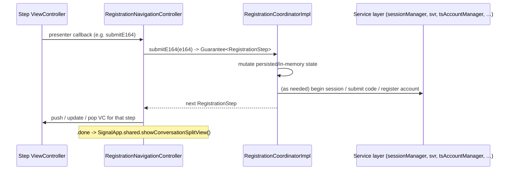

# `Signal/Registration/` — Registration UI & Coordinator (App-Level)

The **app-target** half of registration: the UIKit screens the user sees while
registering, re-registering, or changing their phone number, plus the
`RegistrationCoordinator` state machine that drives those screens. This is
distinct from [`../../SignalServiceKit/Registration/`](../../SignalServiceKit/Registration/registration-sessions.md),
which implements the lower-level **verification-session** protocol (begin
session, satisfy challenges, request/submit SMS codes). This subsystem *uses*
that service layer (via injected dependencies) but owns the end-to-end flow:
pathway selection, UI step sequencing, PIN/SVR recovery, backup restore, device
transfer, and account finalization.

- [1. Scope & boundaries](#1-scope--boundaries)
- [2. Orientation](#2-orientation)
- [3. Key types](#3-key-types)
- [4. How the app enters & exits registration](#4-how-the-app-enters--exits-registration)
- [5. The coordinator / UI loop (step model)](#5-the-coordinator--ui-loop-step-model)
- [6. Pathways & registration state](#6-pathways--registration-state)
- [7. Modes: register / re-register / change number](#7-modes-register--re-register--change-number)
- [8. The UI step catalog](#8-the-ui-step-catalog)
- [9. Interactions with the rest of the app & service layer](#9-interactions-with-the-rest-of-the-app--service-layer)
- [10. Notable considerations](#10-notable-considerations)
- [11. File reference checklist](#11-file-reference-checklist)

## Conventions

Follows [../README.md](../README.md): citations are `path:line` (declaration) or
`path`; line numbers reflect the working tree at authoring time and may drift —
relocate via the symbol name. Confidence labels on claims about *behavior*:
**[High]** directly observed (file read this session); **[Medium]** inferred from
signatures/names/convention; **[Low]** inference from naming alone. Directory and
file listings were produced by listing the working tree this session **[High]**.

---

## 1. Scope & boundaries

In scope — all files under `Signal/Registration/` **[High]** (listed):

- Flow brain: `RegistrationCoordinator.swift` (protocol + public result types),
  `RegistrationCoordinatorImpl.swift` (~222 KB, the state machine),
  `RegistrationCoordinatorImpl+Service.swift` (server-request helpers),
  `RegistrationCoordinatorLoader.swift` (persisted mode + coordinator factory),
  `RegistrationCoodinatorShims.swift` (dependency shims — note the misspelled
  filename), `RegistrationCoordinatorDependencies.swift` (the DI bundle).
- Shared value types: `RegistrationStep.swift`, `RegistrationMode.swift`.
- Helpers: `RegistrationUtils.swift` (re-reg / re-link entry prompts),
  `RegistrationWebSocketManager.swift` (restricted socket during registration),
  `PhoneNumberValidator.swift`, `RegistrationCoordinatorBackupErrorPresenter.swift`.
- `UserInterface/` — the `UIViewController`s, view-states, and shared UI utilities
  (`RegistrationNavigationController.swift`, per-step VCs, `RegistrationViewUtil.swift`,
  `RegistrationUIStyles.swift`, input/view-state structs).

Out of scope (documented elsewhere, treated as boundaries): the SSK verification
session (`../../SignalServiceKit/Registration/`), SVR/`SecureValueRecovery`,
`Account/` identity-and-registration, change-number PNI mechanics
(`../../SignalServiceKit/ChangePhoneNumber/`), Backups, and secondary-device
*provisioning* (`Signal/Provisioning/`, reachable from here but separate).

---

## 2. Orientation

Registration is a **coordinator-driven, stateless-view** flow **[High]**. The
coordinator (`RegistrationCoordinatorImpl`) owns all state; view controllers are
"(mostly) stateless" and simply ask the coordinator what to do next — the
protocol doc says VCs "rely on the coordinator to update its state when actions
are taken, then get the next step to know what view to push next"
(`RegistrationCoordinator.swift:33-41`) **[High]**.

Every user action is a coordinator method that returns a
`Guarantee<RegistrationStep>` (or awaits `nextStep()`); the
`RegistrationNavigationController` consumes that step and pushes/updates/pops the
matching VC (`RegistrationNavigationController.swift`,
`controller(for:)` at the big `switch step` and `_pushNextController`) **[High]**.
The loop is: *action → coordinator mutates state → coordinator computes the next
`RegistrationStep` → nav controller renders it*.



---

## 3. Key types

| Type | File | Role |
| --- | --- | --- |
| `protocol RegistrationCoordinator` | `RegistrationCoordinator.swift:10` | The flow API consumed by the UI (one method per user action; most return `Guarantee<RegistrationStep>`). **[High]** |
| `class RegistrationCoordinatorImpl` | `RegistrationCoordinatorImpl.swift:20` | The ~222 KB state machine implementing the protocol; owns `PersistedState`, `InMemoryState`, pathway selection, and all per-pathway `nextStep…` logic. **[High]** |
| `enum RegistrationStep` | `RegistrationStep.swift:8` | The exhaustive set of UI steps / terminal actions (`.phoneNumberEntry`, `.verificationCodeEntry`, `.pinEntry`, `.showErrorSheet`, `.done`, …), each carrying its view-state. **[High]** |
| `enum RegistrationMode` | `RegistrationMode.swift:9` | `registering` / `reRegistering(ReregistrationParams)` / `changingNumber(ChangeNumberParams)`. **[High]** |
| `protocol RegistrationCoordinatorLoader` + `…LoaderImpl` | `RegistrationCoordinatorLoader.swift:14,37` | Decides whether a coordinator is *needed* (restore in-progress mode) and manufactures one; persists the internal `Mode` (incl. change-number PNI state) to a `KeyValueStore`. **[High]** |
| `struct RegistrationCoordinatorDependencies` | `RegistrationCoordinatorDependencies.swift:8` | The injected dependency bundle; `.from(_:)` wires it from `DependenciesBridge`, `SSKEnvironment`, and `AppEnvironment`. **[High]** |
| `class RegistrationNavigationController` | `RegistrationNavigationController.swift:9` | `OWSNavigationController` subclass; the sole UI driver. Maps each `RegistrationStep` to a VC and adopts every per-step presenter protocol. **[High]** |
| `protocol RegistrationWebSocketManager` + `…Impl` | `RegistrationWebSocketManager.swift:11,35` | Opens a "restricted" chat web socket using the in-flight auth, suspending message processing until registration finishes. **[High]** |
| `enum RegistrationUtils` | `RegistrationUtils.swift:7` | Static entry points for the de-registration → re-register / re-link prompts. **[High]** |
| `RegistrationCoordinatorBackupErrorPresenter` | `RegistrationCoordinatorBackupErrorPresenter.swift` | Maps `RegistrationBackupRestoreError` → user prompt → `RegistrationBackupErrorNextStep`. **[High]** |
| `struct PhoneNumberValidator` | `PhoneNumberValidator.swift:8` | Lightweight per-country E.164 sanity checks (US/BR regexes; others pass). **[High]** |

The large per-step VCs live under `UserInterface/` (e.g.
`RegistrationPhoneNumberViewController`, `RegistrationVerificationViewController`,
`RegistrationPinViewController` ~33 KB, `RegistrationProfileViewController`,
`RegistrationChooseRestoreMethodViewController`,
`RegistrationRestoreFromBackupConfirmationViewController`) plus their view-state
structs (`RegistrationPhoneNumberViewState.swift`, etc.) **[High]** (listed).

---

## 4. How the app enters & exits registration

**Entry.** The launch path selects a `.registration` launch interface and
`SignalApp.showRegistration(loader:desiredMode:in:)` installs a
`RegistrationNavigationController` as the window root
(`Signal/AppLaunch/SignalApp.swift:73-75,99`) **[High]**. The nav controller is
built from a coordinator via `RegistrationNavigationController.withCoordinator(_:)`
(`RegistrationNavigationController.swift:14-17`) **[High]**; the coordinator comes
from `RegistrationCoordinatorLoaderImpl.coordinator(forDesiredMode:…)`, which
loads any persisted mode (preferring it over the desired mode) and writes it back
(`RegistrationCoordinatorLoader.swift`, `coordinator(forDesiredMode:…)`) **[High]**.

Two other app-side entry points live in `RegistrationUtils`
(`RegistrationUtils.swift`) **[High]**: `showReRegistration(deregisteredState:)`
builds a re-reg coordinator and swaps the main window's root
(`RegistrationUtils.swift`), and `showReLinking(deregisteredState:)` resets for
secondary re-registration and hands off to `ProvisioningController`. The
deregistration action sheet in the nav controller
(`handleDeregistrationReset(_:)`) calls `SignalApp.shared.showRegistration(…
.reRegistering(reregParams))` **[High]**.

**Exit.** The flow finishes by reaching `RegistrationStep.done`, at which point
the nav controller calls `SignalApp.shared.showConversationSplitView()`
(`RegistrationNavigationController.swift`, `.done` case) **[High]**. Early exits:
`exitRegistration()` (whether allowed depends on mode — never for initial
registration, see `RegistrationCoordinator.swift:19-26`) and reglock timeout
acknowledgement (`AcknowledgeReglockResult.exitRegistration` →
`showConversationSplitView()`) **[High]**. Switching to secondary-device linking
goes through `switchToSecondaryDeviceLinking()` →
`SignalApp.shared.showSecondaryProvisioning(…)`
(`RegistrationNavigationController.swift`, `beginSecondaryDeviceLinking`) **[High]**.

---

## 5. The coordinator / UI loop (step model)

`RegistrationCoordinator.nextStep()` is `@MainActor` and returns a
`RegistrationStep` (`RegistrationCoordinator.swift:42-44`) **[High]**. In the impl
it (1) short-circuits to `.appUpdateBanner` if the app is expired, (2) restores
state if needed, then (3) delegates to the current *pathway*'s `nextStep…`
(`RegistrationCoordinatorImpl.swift`, `nextStep()` ≈ `:92`, dispatch at the
`nextStep(pathway:)` switch; `nextStep()` at `:96`) **[High]**.

The nav controller renders a step through `_pushNextController`
(`RegistrationNavigationController.swift`) **[High]**:

- It optionally shows a `RegistrationLoadingViewController` while the
  `Guarantee` is unsealed (loading mode varies per action, e.g.
  `.submittingPhoneNumber`, `.submittingVerificationCode`, `.restoringBackup`).
- It looks up a typed `Controller<…>` descriptor from `controller(for: step)` and
  either **updates & pops** to an existing VC of the same type, or **pushes** a
  new one. Cancellable steps (`canCancel`) get a splash VC inserted behind them so
  "back" has a destination (`RegistrationNavigationController.swift`,
  `_pushNextController` splash-insert branch) **[High]**.
- Non-VC steps are handled inline: `.showErrorSheet` presents an **undismissable**
  `ActionSheetController` whose OK handler re-invokes `coordinator.nextStep()`;
  `.appUpdateBanner` presents an alert; `.done` exits to the chat list
  (`RegistrationNavigationController.swift`, `controller(for:)`) **[High]**.

Each VC talks back through a per-step **presenter protocol** that the nav
controller conforms to (e.g. `RegistrationPhoneNumberPresenter.goToNextStep` →
`coordinator.submitE164`, `RegistrationVerificationPresenter.submitVerificationCode`
→ `coordinator.submitVerificationCode`, `RegistrationPinPresenter.submitPinCode` →
`coordinator.submitPINCode`) **[High]**. The interactive pop gesture is disabled so
navigation is coordinator-controlled, not swipe-controlled
(`RegistrationNavigationController.viewDidLoad`) **[High]**. An 8-tap gesture
exposes debug-log submission (`didRequestToSubmitDebugLogs`) **[High]**.

---

## 6. Pathways & registration state

Internally the coordinator picks a **pathway** (`private enum Pathway`,
`RegistrationCoordinatorImpl.swift:1712`) that determines how the account is
actually (re)established **[High]**:

| Pathway | Meaning |
| --- | --- |
| `.opening` | Splash + system-permissions screens before registering. |
| `.quickRestore` | User has their old device → transfer registration info / restore-method choice up front. |
| `.manualRestore` | User lacks old device but wants backup restore → recovery-key / restore-choice early. |
| `.registrationRecoveryPassword(password:)` | Register using the reg-recovery password derived from a local SVR master key. |
| `.svrAuthCredential(_)` | Recover the SVR master key via a verified SVR auth credential, then swap to the recovery-password path. |
| `.svrAuthCredentialCandidates([…])` | Unverified SVR credentials synced from another device; check them with the server first. |
| `.session(RegistrationSession)` | SMS/voice verification via an SSK `RegistrationSession` — the fallback when the above are unavailable or fail. |
| `.profileSetup(AccountIdentity)` | Post-registration: PIN setup, profile name/avatar, discoverability. |

`getPathway()` chooses in priority order (`RegistrationCoordinatorImpl.swift`,
`getPathway()` at `:1757`): opening (if a splash/permissions is pending) → the
restore modes (only in `.registering`) → an active `session` (always wins once
present) → `profileSetup` (if an `accountIdentity` exists) → the PIN/SVR paths
(skipped if the user skipped PIN entry) → otherwise `.opening` **[High]**. Comments
emphasize a key rule: to *leave* a pathway you must wipe the state that selects it
(e.g. clearing the session to proceed to profile setup) **[High]**.

State is split in two **[High]**:

- `PersistedState` (`RegistrationCoordinatorImpl.swift:1030`, `Codable`,
  stored in `KeyValueStore(collection: "RegistrationCoordinator")`): survives app
  relaunch. Holds `hasShownSplash`, `restoreMode`, `e164`, aci/pni registration
  ids, `e164WithKnownReglockEnabled`, `numLocalPinGuesses`, `hasSkippedPinEntry`,
  `hasGivenUpTryingToRestoreWithSVR`, `hasRestoredFromSVR`, a nested
  `SessionState` (with `InitialCodeRequestState` and `ReglockState`), and
  deliberately-persisted recovery material (`backupKeyAccountEntropyPool`). The
  recovered SVR master key is marked "should never be persisted" and is routed
  through a deprecated computed accessor **[High]**.
- `InMemoryState` (`RegistrationCoordinatorImpl.swift:899`): transient per-launch
  state (active `session`, `regRecoveryPw`, `svrAuthCredential`, candidate
  credentials, `accountEntropyPool`, `needsSomePermissions`, `hasEnteredE164`,
  `changeNumberProspectiveE164`, restore-confirmation flags) **[High]**.

The `LoaderImpl.Mode` (a separate `Codable`) persists the *mode* and, for change
number, a `PendingPniState` with the PNI identity key pair and pre-keys, with
careful `Codable` handling that tolerates missing pre-keys rather than failing the
whole restore (`RegistrationCoordinatorLoader.swift`, `PendingPniState` +
`Codable` extension) **[High]**.

---

## 7. Modes: register / re-register / change number

`RegistrationMode` (`RegistrationMode.swift:9`) selects behavior **[High]**:

- **registering** — first-time setup; `exitRegistration()` is never allowed
  ("where would you go anyway?", `RegistrationCoordinator.swift:21`) **[High]**.
- **reRegistering(ReregistrationParams{aci?, e164})** — exit allowed any time but
  in-progress state is preserved for next attempt
  (`RegistrationCoordinator.swift:22-24`) **[High]**.
- **changingNumber(ChangeNumberParams{oldE164, oldAuthToken, localAci,
  localDeviceId})** — exit allowed only before the server change-number request;
  exiting wipes in-progress state (`RegistrationCoordinator.swift:25-26`) **[High]**.

A pending change number suspends message processing: when the loader detects
`hasPendingChangeNumber`, it calls
`messagePipelineSupervisor.suspendMessageProcessingWithoutHandle(for:
.pendingChangeNumber)` and `preKeyManager.setIsChangingNumber(true)`
(`RegistrationCoordinatorLoader.swift`, `coordinator(forDesiredMode:…)` and
`savePendingChangeNumber`) **[High]**. The change-number UI uses dedicated VCs
(`RegistrationChangeNumberSplashViewController`,
`RegistrationChangePhoneNumberViewController`,
`RegistrationChangePhoneNumberConfirmationViewController`), selected via the
`phoneNumberEntry(.changingNumber(…))` sub-state in
`RegistrationNavigationController.controller(for:)` **[High]**.

---

## 8. The UI step catalog

`RegistrationStep` (`RegistrationStep.swift:8`) and its nav-controller mapping
(`RegistrationNavigationController.swift`, `controller(for:)`) **[High]**:

| Step | View controller | Notes |
| --- | --- | --- |
| `.registrationSplash` / `.changeNumberSplash` | `RegistrationSplashViewController` / `RegistrationChangeNumberSplashViewController` | Opening screens. |
| `.permissions` | `RegistrationPermissionsViewController` | Requests notifications then contacts. |
| `.scanQuickRegistrationQrCode` | `RegistrationQuickRestoreQRCodeViewController` | Cancellable; old device scans to send a `RegistrationProvisioningMessage`. |
| `.phoneNumberEntry(state)` | `RegistrationPhoneNumberViewController` (registration) or the change-number pair | Cancellable in registration; sub-switch on `.registration`/`.changingNumber`. |
| `.verificationCodeEntry(state)` | `RegistrationVerificationViewController` | SMS/voice code entry. |
| `.pinEntry(state)` | `RegistrationPinViewController` | Reused across create/confirm/enter-existing; a changed operation forces a fresh VC. |
| `.pinAttemptsExhaustedWithoutReglock(state)` | `RegistrationPinAttemptsExhaustedAndMustCreateNewPinViewController` | Can register but can't recover SVR backups. |
| `.captchaChallenge` | `RegistrationCaptchaViewController` | Fresh VC on each repeated request. |
| `.reglockTimeout(state)` | `RegistrationReglockTimeoutViewController` | Must wait out reglock. |
| `.enterRecoveryKey(state)` | `RegistrationEnterAccountEntropyPoolViewController` | Manual AEP entry when restoring without old device. |
| `.chooseRestoreMethod(restorePath)` | `RegistrationChooseRestoreMethodViewController` | Restore-method selection (uses `securityScopedBookmarkAccess`). |
| `.confirmRestoreFromBackup(state)` | `RegistrationRestoreFromBackupConfirmationViewController` | Confirms a selected backup; drives a `BackupRestoreProgressModal`. |
| `.deviceTransfer(coordinator)` | `RegistrationDeviceTransferStatusViewController` | Device-to-device transfer progress. |
| `.phoneNumberDiscoverability(state)` | `RegistrationPhoneNumberDiscoverabilityViewController` | Post-reg discoverability choice. |
| `.setupProfile(state)` | `RegistrationProfileViewController` | Post-reg profile name/avatar. |
| `.showErrorSheet(ErrorSheet)` | *(inline action sheet)* | Undismissable; OK re-invokes `nextStep()`. `becameDeregistered` triggers the re-reg reset flow. |
| `.appUpdateBanner` | *(inline alert)* | Server response we can't parse ⇒ assume app update needed. |
| `.done` | *(none)* | Exits to `showConversationSplitView()`. |

`ErrorSheet` enumerates the recoverable error conditions
(`sessionCanNeverRequestVerificationCode`, `sessionInvalidated`,
`verificationCodeSubmissionUnavailable`,
`submittingVerificationCodeBeforeAnyCodeSent`, `becameDeregistered`,
`networkError`, `genericError`) with localized copy chosen in the nav controller
(`RegistrationStep.swift`, `ErrorSheet`; `RegistrationNavigationController.swift`
`.showErrorSheet` case) **[High]**.

---

## 9. Interactions with the rest of the app & service layer

**App target.** The nav controller reaches directly into `SignalApp.shared` to
transition out of registration (`showConversationSplitView`,
`showSecondaryProvisioning`, `showRegistration`) **[High]**, and
`RegistrationUtils.showReRegistration` swaps `CurrentAppContext().mainWindow`'s
root directly (`RegistrationUtils.swift`) **[High]**. Dependencies are sourced from
`AppEnvironment.shared` for app-level objects — `deviceTransferRestore`,
`pushRegistrationManager`, `quickRestoreManager`
(`RegistrationCoordinatorDependencies.swift`, `.from(_:)`) **[High]**.

**Service layer (SSK).** `RegistrationCoordinatorDependencies.from(_:)` wires in a
broad slice of `DependenciesBridge.shared` / `SSKEnvironment.shared`: the SSK
`RegistrationSessionManager` (`sessionManager`), `SecureValueRecovery` (`svr`,
`svrLocalStorage`, `svrAuthCredentialManager`), `TSAccountManager`,
`RegistrationStateChangeManager`, `ChangePhoneNumberPniManager`, backup managers,
`PreKeyManager`, `OWSSignalServiceProtocol`, storage/profile/UD/username managers,
and more (`RegistrationCoordinatorDependencies.swift:8-58` and `.from`
body) **[High]**. Many are wrapped behind `RegistrationCoordinatorImpl.Shims` /
`.Wrappers` (`RegistrationCoodinatorShims.swift`) to keep the coordinator testable
**[High]**. `RegistrationCoordinatorImpl+Service.swift` builds the actual HTTP
requests (e.g. `svr2AuthCredentialCheckRequest`) via `RegistrationRequestFactory`
and `signalService.urlSessionForMainSignalService()` **[High]**.

**Restricted web socket.** `RegistrationWebSocketManagerImpl` opens a chat socket
scoped to the in-flight `ChatServiceAuth` while *suspending* message processing
(`.registrationProvisioning` suspension), then on release either keeps messages
(if registered) or drops enqueued envelopes (if not), mimicking REST behavior —
and deliberately bounces through the main queue to avoid racing the
`registrationStateDidChange` notification (`RegistrationWebSocketManager.swift`,
`acquireRestrictedWebSocket` / `releaseRestrictedWebSocket`) **[High]**.

---

## 10. Notable considerations

- **Single source of truth.** All flow state lives in the coordinator; VCs are
  intentionally stateless and re-rendered from `RegistrationStep` payloads. Reusing
  a VC vs. pushing a new one hinges on type identity and the per-step `update`
  closure (`RegistrationNavigationController.swift`, `_pushNextController` /
  `Controller.update`) **[High]**.
- **Crash-on-unreadable mode.** `LoaderImpl.loadMode` calls `owsFail` if a stored
  mode exists but can't be decoded, because an interrupted change-number *must*
  recover (`RegistrationCoordinatorLoader.swift`, `loadMode`) **[High]**.
- **Message processing is gated** during pending change number
  (`.pendingChangeNumber`) and during the restricted-socket window
  (`.registrationProvisioning`); both must be unsuspended correctly or messages
  stall / get dropped **[High]**.
- **Secrets handling.** The recovered SVR master key is explicitly kept out of
  persisted state; only `backupKeyAccountEntropyPool` is persisted (to avoid a
  different AEP being entered after a successful restore)
  (`RegistrationCoordinatorImpl.swift`, `PersistedState` doc comments) **[High]**.
- **`RegistrationCoordinatorImpl.swift` is very large** (~222 KB) — the per-pathway
  `nextStep…` methods and server interactions dominate it; this doc summarizes the
  dispatch structure rather than every branch. Confidence on individual deep
  branches not read in full is **[Medium]**.
- **Filename typo.** `RegistrationCoodinatorShims.swift` is misspelled in the tree
  (missing an `r`); search by content, not by the expected spelling **[High]**.
- `MockRegistrationWebSocketManager` exists under `#if TESTABLE_BUILD`
  (`RegistrationWebSocketManager.swift`) **[High]**; there is no test subdirectory
  inside `Signal/Registration/` itself (app tests live under `Signal/test/`).

---

## 11. File reference checklist

- `RegistrationCoordinator.swift` — §3, §5, §7 (protocol + result enums).
- `RegistrationCoordinatorImpl.swift` — §5, §6, §10 (state machine, pathways, state).
- `RegistrationCoordinatorImpl+Service.swift` — §9 (server request helpers).
- `RegistrationCoordinatorLoader.swift` — §4, §6, §7, §10 (mode persistence/factory).
- `RegistrationCoordinatorDependencies.swift` — §3, §9 (DI bundle).
- `RegistrationCoodinatorShims.swift` — §9 (shims/wrappers; misspelled filename).
- `RegistrationStep.swift` — §5, §8 (step enum + `ErrorSheet`).
- `RegistrationMode.swift` — §7 (mode + params).
- `RegistrationWebSocketManager.swift` — §9, §10 (restricted socket).
- `RegistrationUtils.swift` — §4 (re-reg / re-link entry).
- `RegistrationCoordinatorBackupErrorPresenter.swift` — §3 (backup error mapping).
- `PhoneNumberValidator.swift` — §3 (E.164 validation).
- `UserInterface/RegistrationNavigationController.swift` — §4, §5, §8 (UI driver).
- `UserInterface/Registration*ViewController.swift` + view-state structs — §8 (step VCs).
```