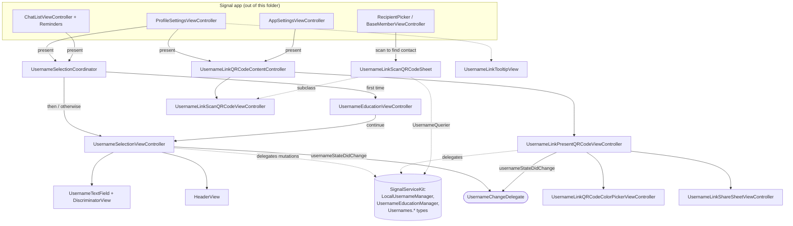
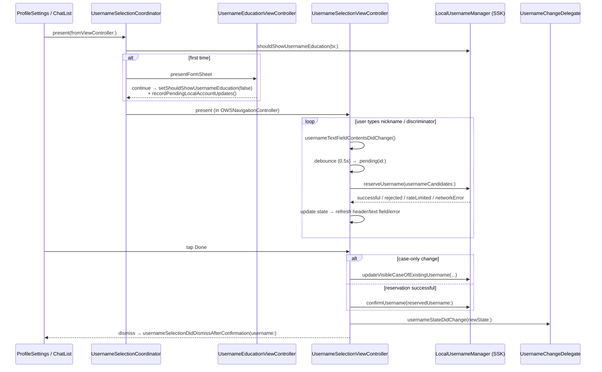
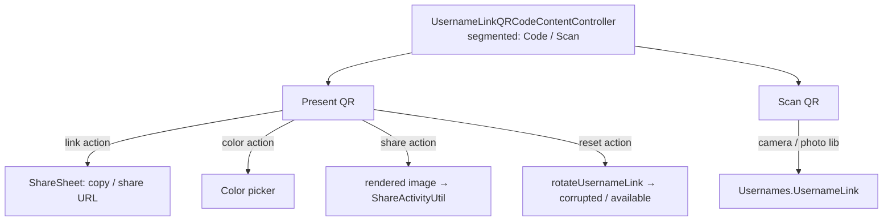

# `Signal/Usernames/` — Username UI (app target)

The **app-level (UIKit) username subsystem**: the view controllers, coordinators,
and views that let a user *create / change / delete* their account username, pick a
custom discriminator, and present / scan / share / recolor their **username-link QR
code**. This is the first-party `Signal/` app's UX layer on top of the username
*service* logic.

This folder is strictly presentation + orchestration. It owns no persistence and no
network calls of its own; every mutation and every piece of durable state is
delegated to `SignalServiceKit`'s `LocalUsernameManager` / `UsernameEducationManager`
and friends (`Usernames.*` value types). The business rules — reservation, hashing,
discriminators, link rotation, storage-service propagation — live in
`SignalServiceKit` and are **out of scope here** (they are the subject of a separate
`docs/SignalServiceKit/Usernames` set, not present at authoring time). This doc
documents *how the app target uses those types*, not their internals.

For the whole-repository map see [../../APPLICATION_MAP.md](../../APPLICATION_MAP.md);
for the app target overview see [../README.md](../README.md).

## Scope

All files under `Signal/Usernames/`:

- `UsernameEducationViewController.swift` — one-time educational sheet shown before
  first username selection.
- `UsernameChangeDelegate.swift` — observer protocol for "username state may have
  changed".
- `Selection/UsernameSelectionCoordinator.swift` — decides education-vs-selection and
  presents the selection flow.
- `Selection/UsernameSelectionViewController.swift` — the nickname/discriminator
  editor and its reservation→confirmation state machine (~41 KB).
- `Selection/UsernameSelectionViewController+UsernameTextField.swift` — the custom
  text field + discriminator sub-field.
- `Selection/UsernameSelectionViewController+HeaderView.swift` — the icon/preview
  header.
- `Links/UsernameLinkQRCodeContentController.swift` — segmented container toggling
  present-vs-scan.
- `Links/UsernameLinkPresentQRCodeViewController.swift` — show/share/recolor/reset the
  link QR code (~24 KB).
- `Links/UsernameLinkQRCodeColorPickerViewController.swift` — QR-code color picker.
- `Links/UsernameLinkScanQRCodeViewController.swift` — camera + photo-library QR scan.
- `Links/UsernameLinkScanQRCodeSheet.swift` — scan sheet + `RecipientPicker`
  integration.
- `Links/UsernameLinkShareSheetViewController.swift` — copy/share the link URL.
- `Links/UsernameLinkTooltipView.swift` — "share your username" tooltip.

## Conventions

- **Citations** are `path:line` (specific declaration) or `path`. Line numbers reflect
  the working tree at authoring time and may drift; relocate via the symbol name.
- **Confidence labels** on claims about *purpose/behavior*:
  - **[High]** — directly observed (file read / declaration located in this session).
  - **[Medium]** — inferred from signatures, names, and cross-file convention.
  - **[Low]** — educated inference from naming alone.
- Where boundaries into `SignalServiceKit` / `SignalUI` are crossed, behavior inside
  those modules is treated as a boundary and labelled accordingly.

## One-paragraph orientation

Two user journeys live here. **(1) Selection:** callers construct a
`UsernameSelectionCoordinator` (`Selection/UsernameSelectionCoordinator.swift:9`) and
call `present(fromViewController:)` (`:40`); it either shows the one-time
`UsernameEducationViewController` (`UsernameEducationViewController.swift:11`) or goes
straight to `UsernameSelectionViewController`
(`Selection/UsernameSelectionViewController.swift:21`), which runs a debounced
reservation state machine against `LocalUsernameManager` and, on "Done", confirms the
reservation **[High]**. **(2) Links:** `UsernameLinkQRCodeContentController`
(`Links/UsernameLinkQRCodeContentController.swift:11`) is a segmented container that
toggles between presenting the user's own link QR code
(`Links/UsernameLinkPresentQRCodeViewController.swift:9`) and scanning someone else's
(`Links/UsernameLinkScanQRCodeViewController.swift:16`) **[High]**. State changes
propagate back to callers through the `UsernameChangeDelegate` protocol
(`UsernameChangeDelegate.swift:10`) **[High]**.

## Component map

**[High]** The folder has no shared singleton; each entry point is constructed by a
caller with an injected dependency `Context`. The two coordinating hubs are
`UsernameSelectionCoordinator` (selection) and `UsernameLinkQRCodeContentController`
(links).

## Dependency injection

**[High]** Nothing here reaches for globals in its primary path; dependencies arrive
through small `Context`/init structs:

- `UsernameSelectionCoordinator.Context`
  (`Selection/UsernameSelectionCoordinator.swift`) bundles `DB`, `NetworkManager`,
  `StorageServiceManager`, `UsernameEducationManager`, and `LocalUsernameManager`.
- `UsernameSelectionViewController.Context`
  (`Selection/UsernameSelectionViewController.swift:24`) bundles `NetworkManager`,
  `DB`, `LocalUsernameManager`, `StorageServiceManager`.
- `UsernameLinkPresentQRCodeViewController` and
  `UsernameLinkQRCodeContentController` take `DB` + `LocalUsernameManager` directly in
  their inits (`Links/UsernameLinkPresentQRCodeViewController.swift:9`,
  `Links/UsernameLinkQRCodeContentController.swift:11`).

**[Medium]** Two leaks of the pattern exist and are worth noting:
`UsernameLinkPresentQRCodeViewController` reads
`AppEnvironment.shared.windowManagerRef.rootWindow.screen` to force max screen
brightness (`Links/UsernameLinkPresentQRCodeViewController.swift`, `setMaxBrightness`),
and its color-finalize path calls
`SSKEnvironment.shared.storageServiceManagerRef.recordPendingLocalAccountUpdates()`
(`:667` extension) rather than going through its injected context. The scan VC uses
`ViewControllerContext.shared` (`Links/UsernameLinkScanQRCodeViewController.swift`).

## Flow 1 — selection (create / change / delete a username)

### `UsernameSelectionCoordinator` — `Selection/UsernameSelectionCoordinator.swift:9`

**[High]** Stateless orchestrator. `present(fromViewController:)` (`:40`) reads
`usernameEducationManager.shouldShowUsernameEducation(tx:)` and branches to education
or selection. On the education "continue" callback it writes
`setShouldShowUsernameEducation(false, tx:)` and calls
`storageServiceManager.recordPendingLocalAccountUpdates()` before presenting selection,
so the education sheet never shows twice and the preference syncs. It wires the
`currentUsername`, `isAttemptingRecovery` flag, and both delegates
(`UsernameChangeDelegate`, `UsernameSelectionDelegate`) into the selection VC and
presents it inside an `OWSNavigationController` as a form sheet **[High]**.

### `UsernameEducationViewController` — `UsernameEducationViewController.swift:11`

**[High]** A static informational sheet (phone-number-privacy / usernames /
links-and-QR rows) with a "Set up" button that fires `continueCompletion` after
dismissing, and a "Not now" dismiss. `prefersNavigationBarHidden` is `true`; it has a
`#Preview` under `#if DEBUG`.

### `UsernameSelectionViewController` — `Selection/UsernameSelectionViewController.swift:21`

**[High]** The heart of the subsystem. A private `UsernameSelectionState` enum
(`:92`) models every observable condition: `noChangesToExisting`,
`caseOnlyChange`, `pending(id:)`, `reservationSuccessful`, `reservationRejected`,
`reservationRateLimited`, `reservationFailedNetworkError`, `reservationFailed`,
`tooShort`, `tooLong`, `cannotStartWithDigit`, `invalidCharacters`,
`customDiscriminatorTooShort`, `customDiscriminatorIs00`, `emptyDiscriminator`.
Setting `currentUsernameState` (main-thread-asserted) drives `updateContent()`, which
refreshes nav items, the header preview, the text field appearance, and animates the
error text in/out.

Key behaviors **[High]**:

- **Debounced reservation.** Each edit sets `.pending(id: UUID)`; after
  `reservationDebounceTimeInternal` (0.5s, `Constants`) it calls
  `localUsernameManager.reserveUsername(usernameCandidates:)`
  (`:920`). An **attempt-ID** disambiguates overlapping requests — results whose
  `pending(id:)` no longer matches `currentUsernameState` are dropped. "Too short" has
  its own 1s debounce (`tooShortDebounceTimeInterval`) so transient short input
  doesn't flash an error.
- **Candidate generation.** Nicknames are validated client-side via
  `Usernames.HashedUsername.generateCandidates(...)`; its `CandidateGenerationError`
  cases map to `cannotStartWithDigit` / `invalidCharacters` / `tooLong` / `tooShort`
  states.
- **Length limits** come from `RemoteConfig.current.minNicknameLength` /
  `maxNicknameLength` (`Constants`), and the text field hard-caps input via
  `TextFieldHelper` so `tooLong` is asserted unreachable in `updateErrorTextViewContent`.
- **Done.** `didTapDone()` acts only on `caseOnlyChange` →
  `updateVisibleCaseOfExistingUsername` (`:651`) or `reservationSuccessful` →
  `confirmUsername(reservedUsername:)` (`:712`), each behind a non-cancelable
  `ModalActivityIndicatorViewController`. Changing an *existing* username (or during
  recovery) first shows a confirmation action sheet warning of side effects.
- **Delegates.** After each mutation it re-reads `usernameState(tx:)` and notifies
  `usernameChangeDelegate?.usernameStateDidChange(newState:)`; a successful
  confirmation also calls
  `usernameSelectionDelegate?.usernameSelectionDidDismissAfterConfirmation(username:)`
  on dismissal.
- **Logging** uses `UsernameLogger.shared` (SSK), suffixed with the attempt ID.

### `UsernameSelectionDelegate` — `Selection/UsernameSelectionViewController.swift:10`

**[High]** Single callback `usernameSelectionDidDismissAfterConfirmation(username:)`,
fired after a *successful* confirmation + dismissal (used by the chat-list recovery
reminder flow, `ChatListViewController+Reminders.swift:392`).

### `UsernameTextField` / `DiscriminatorView` — `Selection/UsernameSelectionViewController+UsernameTextField.swift:13`

**[High]** `UsernameTextFieldWrapper` wraps an `OWSTextField` subclass whose
`rightView` is a `DiscriminatorView` (a `OWSStackView`). The discriminator view has a
four-case `Mode` (`empty` / `spinning` / `spinningWithDiscriminator` / `discriminator`)
and keeps a `lastKnownGoodDiscriminator` so a spinner shows the previous value during
an in-flight reservation rather than blanking. Notable rules:

- The discriminator sub-field is **numeric only**, max 9 digits, filtered by
  `FormattedNumberField`, and strips excess leading zeros while preserving the last two
  digits (so `01` stays valid) (`:331`).
- Typing in the discriminator sets `isUsingCustomDiscriminator = true` and calls
  `DiscriminatorTextFieldDelegate.didManuallyChangeDiscriminator()` (`:9`), which
  re-runs the selection state machine; `customDiscriminator` returns the value only
  when it was user-entered (otherwise the server rolls one).
- A tap gesture plus
  `gestureRecognizer(_:shouldRecognizeSimultaneouslyWith:)` → `true` (`:375`) lets a
  tap focus the discriminator field with the cursor at the end.

### `HeaderView` — `Selection/UsernameSelectionViewController+HeaderView.swift:10`

**[High]** The `at-display-bold` icon over a themed circular background plus a label
previewing the reassembled `nickname.discriminator`. Theme/dynamic-type aware via
`setColorsForCurrentTheme()` / `updateFontsForCurrentPreferredContentSize()`.

## Flow 2 — username-link QR codes

### `UsernameLinkQRCodeContentController` — `Links/UsernameLinkQRCodeContentController.swift:11`

**[High]** Container VC with a two-segment `UISegmentedControl` title view toggling
between a child `UsernameLinkPresentQRCodeViewController` and a child
`UsernameLinkScanQRCodeViewController`, forwarding nav-bar styling to whichever child
is active via `childForOWSNavigationConfiguration`. Locks orientation to portrait. If
constructed with a `nil` link, the present child resets the link on load.

### `UsernameLinkPresentQRCodeViewController` — `Links/UsernameLinkPresentQRCodeViewController.swift:9`

**[High]** An `OWSTableViewController2` presenting the user's QR code with four
actions: open the **share sheet**, **share** a rendered image, **recolor**, **reset**.
Internal `UsernameLinkState` is `available(link, qrCode)` / `resetting` / `corrupted`;
QR images are built with `QRCodeGenerator().generateQRCode(url:)`, and a generation
failure yields `.corrupted`. Notable behavior:

- **Reset** (`resetUsernameLink`, around `:590`) calls
  `localUsernameManager.rotateUsernameLink()`, re-reads `usernameState(tx:)`, updates
  to `available` or `corrupted`, notifies `usernameChangeDelegate`, and surfaces a
  success/failure action sheet. Guarded by a destructive confirmation action sheet.
- **Color** persistence: on load reads `usernameLinkQRCodeColor(tx:)`; finalize writes
  `setUsernameLinkQRCodeColor(color:tx:)` and records pending storage-service updates
  (`:667`).
- **Share image** renders an off-screen `UIView` canvas (QR + username + instructions)
  to a `UIImage` via `renderAsImage()` and hands it to `ShareActivityUtil`.
- **Max brightness.** On appear it forces screen brightness to `1.0` (saving the old
  value) to make the QR easier to scan, restoring it on disappear / resign-active and
  whenever presenting a child sheet; `SheetDismissalDelegate.didDismissPresentedSheet()`
  re-maxes it. **[Medium]** The old-brightness save/restore is guarded against being
  invoked twice to avoid persisting a forced max.
- **Copy username** copies to `UIPasteboard` and shows a toast.

### `UsernameLinkQRCodeColorPickerViewController` — `Links/UsernameLinkQRCodeColorPickerViewController.swift:13`

**[High]** Eight `QRCodeColor.allCases` swatches (`ColorOptionButton`, custom-drawn
selected/unselected circles) over a live QR preview. Only fires
`UsernameLinkQRCodeColorPickerDelegate.didFinalizeSelectedColor(color:)` (`:9`) on Done
*if the color actually changed* from the starting color.

### `UsernameLinkScanQRCodeViewController` — `Links/UsernameLinkScanQRCodeViewController.swift:16`

**[High]** Wraps `SignalUI`'s `QRCodeScanViewController` (framed appearance, upload
button) and conforms to `QRCodeScanDelegate` (`:105`). A scanned string is parsed into
`Usernames.UsernameLink(usernameLinkUrl:)`; success → `scanDelegate.usernameLinkScanned(_:)`
and stops scanning, failures are logged via `UsernameLogger` and continue scanning.
Also supports **photo-library import** via `PHPickerViewControllerDelegate` (`:151`):
it builds an attachment with `TypedItemProvider.buildVisualMediaAttachment`, runs a
`CIDetector` QR pass, and feeds any single detected code back through the same scan
path. Locked to portrait.

### `UsernameLinkScanQRCodeSheet` — `Links/UsernameLinkScanQRCodeSheet.swift:9`

**[High]** A `UsernameLinkScanQRCodeViewController` subclass styled as a dismissible
sheet, plus the glue that lets the **recipient picker / member pickers** scan a QR code
to find a contact. Protocol-extension conformances (`:21`, `:35`, `:45`) give
`RecipientPickerDelegate` + `UsernameLinkScanDelegate` conformers a
`presentUsernameQRCodeScanner()` and a default `usernameLinkScanned(_:)` that dismisses,
runs `UsernameQuerier().queryForUsernameLink(...)` (SSK), and selects the resolved ACI
as a recipient. This is the subsystem's main integration into contact selection
**[High]**.

### `UsernameLinkShareSheetViewController` — `Links/UsernameLinkShareSheetViewController.swift:9`

**[High]** An `OWSTableSheetViewController` showing the link URL text plus "copy link"
(to `UIPasteboard.general.url`, invoking a `didCopyUsername` callback) and "share" (via
`ShareActivityUtil`).

### `UsernameLinkTooltipView` — `Links/UsernameLinkTooltipView.swift:9`

**[High]** A `TooltipView` subclass ("share your username") with a close button and
spring in/out animations; blur bubble with a reduce-transparency fallback. Presented
and retained by `ProfileSettingsViewController` (held in
`currentUsernameLinkTooltip`).

## Interactions with the rest of the app

**[High]** This folder is a leaf UI module invoked from several app surfaces (grep of
`Signal/` at authoring time):

- **`ProfileSettingsViewController`**
  (`Signal/src/ViewControllers/AppSettings/Profile/ProfileSettingsViewController.swift`)
  is the primary host: it builds a `UsernameSelectionCoordinator` and calls
  `present(fromViewController:)` (`:535`, `:548`), presents a
  `UsernameLinkQRCodeContentController` (`:607`), owns the `UsernameLinkTooltipView`
  (`:90`, `:392`), and implements `UsernameChangeDelegate.usernameStateDidChange`
  (`:891`).
- **`AppSettingsViewController`** also presents the link content controller (`:563`)
  and conforms to `UsernameChangeDelegate` (`:587`).
- **`ChatListViewController` + Reminders** presents the selection coordinator for the
  *username-corruption recovery* reminder (`ChatListViewController+Reminders.swift:162`)
  and consumes `usernameSelectionDidDismissAfterConfirmation`
  (`ChatListViewController+Reminders.swift:392`); `+Notifications` observes
  `localUsernameStateDidChange` to refresh reminders.
- **Megaphones** (`Signal/Megaphones/UserInterface/CreateUsernameMegaphone.swift`,
  `ExperienceUpgradeManager.swift`) also drive into the selection flow.
- **Recipient / member pickers** reach the scan sheet via the protocol extensions in
  `UsernameLinkScanQRCodeSheet.swift`.

**[High]** The boundary into `SignalServiceKit` is narrow and explicit: all state and
mutations go through `LocalUsernameManager` (`reserveUsername`, `confirmUsername`,
`updateVisibleCaseOfExistingUsername`, `rotateUsernameLink`, `usernameState(tx:)`,
`usernameLinkQRCodeColor` / `setUsernameLinkQRCodeColor`), `UsernameEducationManager`
(the education flag), `StorageServiceManager.recordPendingLocalAccountUpdates()` for
propagation, and the `Usernames.*` value types (`ParsedUsername`, `HashedUsername`,
`UsernameLink`, `LocalUsernameState`, `RemoteMutationResult`, `ReservationResult`,
`ConfirmationResult`). Those internals are **out of scope** for this doc.

## Important state & UI considerations

- **[High]** `UsernameSelectionViewController` enforces main-thread access to its
  state and only enables **Done** for `caseOnlyChange` / `reservationSuccessful`; every
  other state (including all errors and `pending`) disables it.
- **[High]** `isModalInPresentation` is tied to `hasUnsavedEdits`, so interactive
  swipe-dismiss is blocked once the user has made changes.
- **[High]** Error text animates height/opacity, respecting
  `UIAccessibility.isReduceMotionEnabled`; tooltip and QR-code appearance animations do
  the same.
- **[High]** QR present/scan views lock to portrait; the present view forces full
  screen brightness while visible and restores it afterwards.
- **[High]** Reset-link and reset-color are destructive-style action sheets; link reset
  can transition the state to `corrupted` if the server returns no link.
- **[Medium]** Theming/dynamic-type is handled per-view through
  `setColorsForCurrentTheme()` / `updateFontsForCurrentPreferredContentSize()` and
  `themeDidChange` / `contentSizeCategoryDidChange` overrides, consistent with the rest
  of the app's `OWSViewController` convention.
