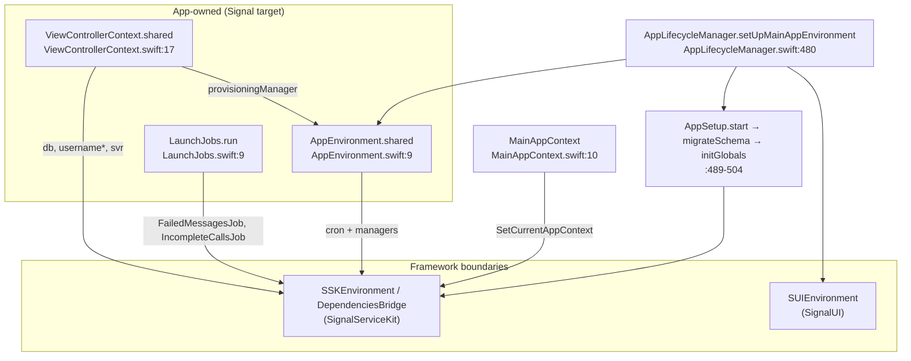

# App Environment & Dependency Wiring

How the `Signal` app target holds its runtime context and dependencies, and how it wires
into `SignalServiceKit` (SSK) and `SignalUI`. All claims cite `path:line`; see
[README.md](README.md) for conventions.

Primary files:
- `Signal/AppLaunch/MainAppContext.swift`
- `Signal/AppLaunch/AppEnvironment.swift`
- `Signal/AppLaunch/ViewControllerContext.swift`
- `Signal/AppLaunch/LaunchJobs.swift`
- `Signal/AppLaunch/AppLifecycleManager.swift` (the wiring call sites)

## The three/four environments

The app target composes several dependency containers. The app code owns two of them and
consumes two from the frameworks (**[High]** for the app-owned ones; the framework
internals are a boundary):

| Container | Defined in | Owns |
|---|---|---|
| `MainAppContext` | `Signal/AppLaunch/MainAppContext.swift:10` (app) | The `AppContext` implementation for the main app process. |
| `AppEnvironment` | `Signal/AppLaunch/AppEnvironment.swift:9` (app) | Main-app-only objects (call service, window manager, badge/backup/provisioning managers, cron jobs). |
| `SSKEnvironment` / `DependenciesBridge` | SignalServiceKit (boundary) | Service/data layer: DB, network, messaging, accounts, crypto. Built via `AppSetup`. |
| `SUIEnvironment` | SignalUI (boundary) | Shared-UI environment. |

The launch pipeline builds all four; see [launch-sequence.md](launch-sequence.md) §3 for
ordering. This doc covers the app-owned ones and the wiring call sites.

## `MainAppContext`

`class MainAppContext: NSObject, AppContext` (`MainAppContext.swift:10`) is the main app's
implementation of SSK's `AppContext` protocol — the abstraction that lets SSK run in the
main app, the Share Extension, and the NSE without hard-coding `UIApplication` behavior
**[High]**. It is installed first thing in launch via `SetCurrentAppContext(...)`
(`AppLifecycleManager.swift:159-160`), and thereafter reachable as `CurrentAppContext()`
**[High]**.

Key members (**[High]**):

- `let type: AppContextType = .main` (`:11`); `let appLaunchTime = Date()` captured in
  `init` (`:13-21`); `_mainApplicationStateOnLaunch = UIApplication.shared.applicationState`
  (`:21`).
- In `init`, observes `UIApplication` `willEnterForeground` / `didEnterBackground` /
  `willResignActive` / `didBecomeActive` (`:25-48`) and re-posts them as SSK's
  `.OWSApplicationWillEnterForeground` / `…DidEnterBackground` / `…WillResignActive` /
  `…DidBecomeActive` inside `BenchManager.bench(...)` blocks that log slow transitions
  (`:69-110`). This is the bridge from UIKit notifications to SSK's app-agnostic ones.
- `reportedApplicationState` is backed by an `AtomicValue` (`:50-62`); updates assert the
  main thread.
- Convenience/state: `isMainAppAndActive` (`:122`), `isRTL` (`:126`), `isInBackground()`
  (`:128`), `isAppForegroundAndActive()` (`:130`), background-task begin/end (`:132-138`),
  `frontmostViewController()` (`:140`), `openSystemSettings()`/`open(_:)` (`:142-144`).
- `runNowOrWhenMainAppIsActive(_:)` queues blocks until active, flushed in
  `didBecomeActive` via `runAppActiveBlocks()` (`:109`, `:150-170`).
- Paths: `appDocumentDirectoryPath()` (`:172`), `appSharedDataDirectoryPath()` =
  the `TSConstants.applicationGroup` container (`:176-178`),
  `appDatabaseBaseDirectoryPath()` = shared data dir (`:180`), `appUserDefaults()` =
  `UserDefaults(suiteName: TSConstants.applicationGroup)` (`:182`) **[High]**.
- `isRunningTests`: under `#if TESTABLE_BUILD`, `getenv("runningTests_dontStartApp") != nil`,
  else `false` (`:131-137`) — this is what short-circuits the launch path.
- Fixed capabilities: `canPresentNotifications()` = true (`:139`),
  `shouldProcessIncomingMessages` = true (`:141`), `hasUI` = true (`:143`);
  `debugLogsDirPath` = `DebugLogger.mainAppDebugLogsDirPath` (`:145`).
- `var mainWindow: UIWindow?` (`:148`) — set by `initializeWindow`
  (`AppLifecycleManager.swift:433`) and read widely via `CurrentAppContext().mainWindow`.

## `AppEnvironment`

`public class AppEnvironment: NSObject` (`AppEnvironment.swift:9`) holds objects that only
the main app needs **[High]**. Access model:

- `private static var _shared`; `setSharedEnvironment(_:)` with
  `owsPrecondition(self._shared == nil)` (`:11-16`); `class var shared { _shared! }`
  (`:18-19`). It is installed in `didFinishLaunching`
  (`AppLifecycleManager.swift:192-195`) **[High]**.
- `@MainActor var ownedObjects = [AnyObject]()` — a retain bag (`:21-23`).

**Eagerly constructed** in `init(appReadiness:deviceTransferRestore:)` (`:57-64`): a
`CVAudioPlayer` (`cvAudioPlayerRef`), the passed-in `deviceTransferRestore`, a
`ScreenLockUI`, a `PushRegistrationManager`, a `SpeechManager` (`speechManagerRef`), and a
`WindowManager` (`windowManagerRef`) (`:25-31`, `:57-64`) **[High]**. These exist before
the database is open because the window manager and screen-lock UI are needed as soon as a
scene connects.

**Lazily set** (declared `private(set) var … !`, assigned in `setUp`): among others
`appIconBadgeUpdater`, `avatarHistoryManager`, `backupAttachmentDownloadTracker`,
`backupAttachmentUploadTracker`, `backupDisablingManager`, `backupEnablingManager`,
`badgeManager`, `callLinkProfileKeySharingManager`, `callService`,
`clockSkewMonitoringManager`, `experienceUpgradeManager`,
`groupSendEndorsementExpirationJob`, `lowDiskSpaceManager`, `provisioningManager`,
`quickRestoreManager`, `outgoingDeviceRestorePresenter`, `registrationIdMismatchManager`,
`screenshotBlockingManager`, `senderKeyExpirationJob` (`:33-55`) **[High]**.

### `AppEnvironment.setUp(appReadiness:callService:)`

`setUp(appReadiness:callService:)` (`AppEnvironment.swift:66-531`) is called from
`setUpMainAppEnvironment` after the schema migration/globals are ready
(`AppLifecycleManager.swift:509`) **[High]**. It does three things:

1. **Construct singletons** (`:68-280` approx): builds stores and managers, injecting
   dependencies from `DependenciesBridge.shared` and `SSKEnvironment.shared` — e.g.
   `BadgeManager`, `BackupDisablingManager`, `BackupEnablingManager`,
   `ExperienceUpgradeManager`, `ProvisioningManager`, `QuickRestoreManager`,
   `OutgoingDeviceRestorePresenter`, `ScreenshotBlockingManager(db:windowManager:)`,
   `ClockSkewMonitoringManager(clockSkewManager:windowManager:)` (the last two wire the
   window manager into SSK monitors) **[High]**. The passed-in `callService` is stored at
   `self.callService` (`:150` approx).
2. **Schedule cron jobs** via `let cron = DependenciesBridge.shared.cron` **[High]**.
   Periodic (`schedulePeriodically`, `approximateInterval: .day` unless noted):
   `.checkUsername` (`usernameValidationManager.validateUsername`), `.fetchDevices`
   (`inactiveLinkedDeviceFinder.refreshLinkedDeviceStateIfNecessary`),
   `.fetchSubscriptionConfig`, `.fetchDonationBadgeAssets`. Frequent
   (`scheduleFrequently`): PNI identity-key mismatch validation (linked devices), Backups
   subscription redemption, Backups TestFlight entitlement renewal, Donations subscription
   redemption — each with a `handleResult` that logs terminal failures (ignoring
   `CancellationError`/`NotRegisteredError`) **[High]**.
3. **Register on-launch jobs** against `appReadiness` **[High]**:
   - `runNowOrWhenAppWillBecomeReady`: start `badgeManager` change observation,
     `appIconBadgeUpdater`, `clockSkewMonitoringManager`, `lowDiskSpaceMonitoringManager`,
     `screenshotBlockingManager`.
   - `runNowOrWhenAppDidBecomeReadyAsync`: builds a `GroupCallRecordRingingCleanupManager`;
     reads `tsAccountManager.registeredState`. **Primary-device-only** tasks:
     `storageServiceRecordIkmMigrator.migrateToManifestRecordIkmIfNecessary`,
     `backupIdService.registerBackupIDIfNecessary`, `backupExportJobRunner.resumeIfNecessary`
     + `localFileBackupExportJobRunner.resumeIfNecessary`,
     `accountEntropyPoolManager.generateIfMissing`,
     `registrationIdMismatchManager.validateRegistrationIds`,
     `attachmentBackfillManager.processEnqueuedInboundRequests`. For all devices:
     ringing-call cleanup, `backupDisablingManager.disableRemotelyIfNecessary`,
     `avatarHistoryManager.cleanupOrphanedImages` **[High]**.

> **Edge case:** the `else { }` branch for linked (non-primary) devices in the
> did-become-ready block is empty (`AppEnvironment.swift`, in the registered-state
> `if … isPrimary { … } else { }`) — i.e. the primary-only tasks simply don't run on
> linked devices **[High]**.

## `ViewControllerContext`

`public class ViewControllerContext` (`ViewControllerContext.swift:17`) is a **scoped
dependency bundle** for view controllers / view models **[High]**. Its doc comment frames
it as an alternative to `MainAppEnvironment` + `Dependencies` with three stated advantages:
it's not a protocol+extension (members accessed explicitly via the shared instance), it's
Swift-only (no `@objc`), and everything in it *should* follow modern DI (no global state,
protocolized, dependencies injected at init for testability) (`:7-16`) **[High]**.

It carries `db`, `editManager`, `svr`, `accountKeyStore`, `usernameApiClient`,
`usernameEducationManager`, `usernameLinkManager`, `usernameLookupManager`,
`localUsernameManager`, and `provisioningManager` (`:19-31`), all taken via its `init`
(`:33-55`) **[High]**.

`static let shared` (`:64-85`) builds the instance from `DependenciesBridge.shared` plus
`AppEnvironment.shared.provisioningManager` — the one place the two app-owned containers and
the SSK bridge are stitched together for VC consumption **[High]**. The doc comment is
explicit that this `shared` is a **temporary stop-gap**: the ultimate goal is to construct a
single `ViewControllerContext` at startup and pass it by reference everywhere (and for
`DependenciesBridge` not to exist either) (`:57-63`) **[High]**.

## `LaunchJobs`

`enum LaunchJobs` (`LaunchJobs.swift:9`) exposes `static func run(databaseStorage:
SDSDatabaseStorage) async` (`:10`) **[High]**. It runs two SSK jobs sequentially:
`FailedMessagesJob().run(...)` marks any still-"attempting out" messages as failed, then
`IncompleteCallsJob().run(...)` marks incomplete (never-connected/failed/hung-up) calls as
missed (`:19-23`) **[High]**. The comment stresses this is high priority because launch
doesn't complete until it finishes, and flags a SpringBoard-watchdog risk if it ran ~15 s
synchronously on the main thread (`:11-18`) **[High]**. It is invoked once, only on the
non-registration path, from `didLoadDatabase`
(`AppLifecycleManager.swift:579-581`, guarded by `if !hasInProgressRegistration`)
**[High]**.

## How the app target wires into SignalServiceKit

The app does not reach into SSK internals; it builds the SSK environment through
`AppSetup`, a staged bootstrap, in `setUpMainAppEnvironment`
(`AppLifecycleManager.swift:480-533`) **[High]**:

1. `AppSetup().start(appContext:databaseStorage:)` → schema-migration continuation
   (`:489-492`).
2. `await …migrateDatabaseSchema()` → globals continuation (`:493`).
3. `globalsContinuation.initGlobals(...)` (`:494-504`) **injects the main-app
   implementations** of SSK-defined roles: `DeviceBatteryLevelManagerImpl`,
   `DeviceSleepManagerImpl` (from `LaunchContext`), `PaymentsEventsMainApp`,
   `MobileCoinHelperSDK`, `WebRTCCallMessageHandler`, a `CurrentCall` provider, and
   `NotificationPresenterImpl` **[High]**. These are the seams where the app supplies
   platform behavior to the service layer.
4. `await dataMigrationContinuation.migrateDatabaseData()` → `finalContinuation` (`:530`),
   then `finalContinuation.runLaunchTasksIfNeededAndReloadCaches()` (`:531`).

Thereafter the app reads the service layer through two global accessors that recur across
`Signal/AppLaunch/` (**[High]**): `SSKEnvironment.shared` (e.g.
`databaseStorageRef`, `messagePipelineSupervisorRef`, `notificationPresenterRef`,
`profileManagerRef`, `groupMessageProcessorManagerRef`) and `DependenciesBridge.shared`
(e.g. `db`, `tsAccountManager`, `cron`, `preKeyManager`, `registrationStateChangeManager`,
`keyTransparencyManager`). `MainAppContext` is handed to SSK as its `AppContext`
(`:159-160`, `:496`).

## How the app target wires into SignalUI

`SUIEnvironment.shared.setUp(appReadiness:authCredentialManager:)`
(`AppLifecycleManager.swift:505-508`) initializes the `SignalUI` environment, taking the
`authCredentialManager` produced by the SSK data-migration continuation **[High]**. The app
also consumes `SignalUI` types directly on the launch path, e.g. `Theme`
(`LoadingViewController.swift`, `WindowManager.swift`), `OWSWindow`
(`AppLifecycleManager.swift:430`, `WindowManager.swift`), and `ScreenshotBlocking`
(`WindowManager.swift`) **[High]**. The precise contents of `SUIEnvironment` are a SignalUI
boundary — not documented here.

## Wiring overview (Mermaid)

