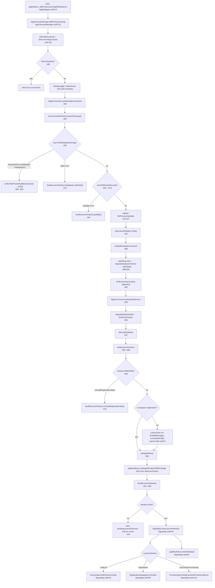

# Launch Sequence

How the `Signal` app target goes from process start to a visible UI. All claims cite
`path:line`; see [README.md](README.md) for conventions and confidence labels.

Primary files:
- `Signal/AppLaunch/AppDelegate.swift`
- `Signal/AppLaunch/AppLifecycleManager.swift` (the launch state machine)
- `Signal/AppLaunch/SignalApp.swift` (final UI presentation)
- `Signal/AppLaunch/AppEnvironment.swift`, `Signal/AppLaunch/LaunchJobs.swift`

## 0. Entry point

`AppDelegate` is the `@main` class (`Signal/AppLaunch/AppDelegate.swift:13-14`,
`@main final class AppDelegate: UIResponder, UIApplicationDelegate`) **[High]**. It
holds `private let lifecycleManager = AppLifecycleManager.shared`
(`Signal/AppLaunch/AppDelegate.swift:16`) and forwards every delegate callback to it
without logic of its own **[High]**:

- `application(_:didFinishLaunchingWithOptions:)` →
  `lifecycleManager.didFinishLaunching(launchOptions:)` (`AppDelegate.swift:18-24`).
- `applicationDidReceiveMemoryWarning` → `didReceiveMemoryWarning()`
  (`AppDelegate.swift:26-28`).
- `applicationWillTerminate` → `willTerminate()` (`AppDelegate.swift:32-34`).
- `application(_:supportedInterfaceOrientationsFor:)` →
  `supportedInterfaceOrientations(for:)` (`AppDelegate.swift:38-44`).
- remote-notification registration + receipt callbacks (`AppDelegate.swift:48-67`).

`AppLifecycleManager` is a `@MainActor final class … : NSObject,
UNUserNotificationCenterDelegate` with a `static let shared`
(`Signal/AppLaunch/AppLifecycleManager.swift:38-41`) **[High]**. UI-adjacent events
instead arrive via `SceneDelegate` (documented in
[scene-window-management.md](scene-window-management.md)).

## 1. `didFinishLaunching` — synchronous setup

`AppLifecycleManager.didFinishLaunching(launchOptions:)` begins at
`AppLifecycleManager.swift:151` and runs synchronously on the main thread. In order
(**[High]** unless noted):

1. `let launchStartedAt = CACurrentMediaTime()` (`:152`) — the time baseline later used
   to log "Presenting app N seconds after launch started."
2. `NSSetUncaughtExceptionHandler(uncaughtExceptionHandler(_:))` (`:154`). The handler
   (`:14-32`) logs full detail when `DebugFlags.internalLogging` (`:15`) is set,
   otherwise logs a truncated reason plus a SHA-256 hash of the reason **[High]**.
3. **Install the app context first:** `let mainAppContext = MainAppContext()`,
   `SetCurrentAppContext(mainAppContext, isRunningTests: false)`, store it on `self`
   (`:158-161`). The comment says "This should be the first thing we do." **[High]**
   See [app-environment.md](app-environment.md) for `MainAppContext`.
4. Debug logging bootstrap: `DebugLogger.shared`, `enableTTYLoggingIfNeeded()`,
   `registerLibsignal()`, `registerRingRTC(appContext:)` (`:163-166`).
5. **Test short-circuit:** `if mainAppContext.isRunningTests { return true }` (`:168`).
   Under `TESTABLE_BUILD` with env `runningTests_dontStartApp`, launch stops here
   (`MainAppContext.swift:131-137`) **[High]**.
6. File logging + Swift logging configured; `"Launching…"` and the launch
   `applicationState` logged; `defer { Logger.info("Launched.") }` (`:171-177`).
7. `BenchEventStart(title: "Presenting HomeView", eventId: "AppStart", …)` and a
   matching `BenchEventComplete` scheduled for when UI becomes ready (`:179-180`).
8. `MessageFetchBGRefreshTask.register(appReadiness:)` (`:182`).
9. Construct `DeviceSleepManagerImpl`, `KeychainStorageImpl(isUsingProductionService:
   TSConstants.isUsingProductionService)`, and `DeviceTransferRestoreImpl` (`:184-190`).
10. **Create `AppEnvironment`** and install it:
    `AppEnvironment.setSharedEnvironment(AppEnvironment(appReadiness:
    deviceTransferRestore:))` (`:192-195`). This only constructs the eagerly-created
    members; the heavy `setUp(...)` happens later (§3).
11. `deviceTransferRestore.launchCleanup()` → `didDeviceTransferRestoreSucceed`
    (`:200`). The comment notes this **must** precede any database access because a
    transfer may have left the DB partially restored (key replaced, files not yet moved)
    **[High]**.
12. **Open the database:** `try SDSDatabaseStorage(appReadiness:databaseFileUrl:
    SDSDatabaseStorage.grdbDatabaseFileUrl, keychainStorage:)` (`:202-208`). Two failure
    branches here — see §6, cases A and B.
13. `UNUserNotificationCenter.current().delegate = self` (`:218`). The comment requires
    this in `didFinishLaunching` or earlier so launch notifications aren't missed and
    legacy callbacks are suppressed **[High]**.
14. If `launchOptions[.remoteNotification]` is present, log "launched in response to an
    APNs push" and spawn a `Task { try await processRemoteNotification(...) }`
    (`:222-232`) **[High]**.
15. App-version bookkeeping: `AppVersionImpl.shared.dumpToLog()`,
    `updateFirstVersionIfNeeded()` (`:234-236`).
16. Build the `LaunchContext` struct (appContext, databaseStorage, deviceSleepManager,
    keychainStorage, launchStartedAt) and store it on `self` (`:238-245`;
    struct defined `:343-349`) **[High]**.
17. Crash-loop bookkeeping: if `lastAppVersionForCrashDetection != currentAppVersion`,
    clear the `AppLaunchesAttempted` counter; then
    `updateLastVersionForCrashDetection()` (`:247-251`). Key name constant is
    `"AppLaunchesAttempted"` (`:49`) **[High]**.
18. **Preflight gate:** `checkIfAllowedToLaunch(...)` (`:256-260`). If it returns an
    error, `handleLaunchFailure(.preflight(error))` and `return true` (`:262-265`).
    See §6 case C.
19. Increment the `AppLaunchesAttempted` counter (`:270-271`). The comment explains the
    crash-loop detector: if we keep starting but never finish launches, we notice in
    `checkIfAllowedToLaunch` **[High]**.
20. **Register BGProcessingTask handlers synchronously** (Apple requires registration in
    `didFinishLaunching`; comment cites the docs and the 10-task limit, `:273-275`):
    `AttachmentValidationBackfillRunner`, `BackupBGProcessingTaskRunner`,
    `LocalFileBackupBGProcessingTaskRunner`, `LazyDatabaseMigratorRunner` — each
    `.registerBGProcessingTask(appReadiness:)` (`:276-317`) **[High]**.
21. Schedule those BG tasks when the app becomes ready; on the **simulator**
    (`#if targetEnvironment(simulator)`, `:318`) the lazy DB migrator is run inline
    because the simulator won't run BGProcessingTasks (`:318-340`) **[High]**.
22. `self.startLaunchPipeline(launchContext:)` (`:342`) and `return true` (`:343`).

Everything above is synchronous; the asynchronous remainder runs from
`startLaunchPipeline`.

## 2. `startLaunchPipeline` — the windowless phase

`startLaunchPipeline(launchContext:)` (`:354-363`) spawns a `Task` that **[High]**:

```
let (finalContinuation, sleepBlockObject) = await setUpMainAppEnvironment(launchContext:)
self.didLoadDatabase(finalContinuation:, launchContext:, sleepBlockObject:)
```

Its doc comment: "Runs the launch steps that don't need a window: setting up the app's
environment, and migrating the database." (`:351-353`) **[High]**. The app may finish
(or fail) launching before any window exists — e.g. a background launch — so these
steps must not assume UI.

## 3. `setUpMainAppEnvironment` — build the dependency graph & migrate schema

`setUpMainAppEnvironment(launchContext:)` (`:480-531`) is `async` and returns
`(AppSetup.FinalContinuation, DeviceSleepBlockObject)` **[High]**. Steps:

1. Add a `DeviceSleepBlockObject(blockReason: "app launch")` to the sleep manager so the
   device won't sleep mid-launch (`:483-484`).
2. Build a `CurrentCall` wrapper around an `AtomicValue<SignalCall?>` (`:486-487`).
3. **`AppSetup().start(appContext:databaseStorage:)`** → a schema-migration
   continuation (`:489-492`). `AppSetup` is the `SignalServiceKit` bootstrap that stages
   environment construction as a chain of continuations **[High]** (SSK boundary).
4. `await …migrateDatabaseSchema()` → `globalsContinuation` (`:493`).
5. `globalsContinuation.initGlobals(...)` (`:494-504`) wires main-app implementations
   into SSK: `DeviceBatteryLevelManagerImpl`, the launch's `deviceSleepManager`,
   `PaymentsEventsMainApp`, `MobileCoinHelperSDK`, `WebRTCCallMessageHandler`,
   `currentCall`, `NotificationPresenterImpl` — producing `dataMigrationContinuation`
   **[High]**.
6. **`SUIEnvironment.shared.setUp(appReadiness:authCredentialManager:)`** (`:505-508`) —
   initialize the `SignalUI` environment **[High]** (SignalUI boundary).
7. **`AppEnvironment.shared.setUp(appReadiness:callService:)`** (`:509-529`),
   constructing a `CallService(...)` with ~20 injected dependencies drawn from the
   continuation (`dependenciesBridge`, `sskEnvironment`, remote config, etc.). See
   [app-environment.md](app-environment.md) for what `AppEnvironment.setUp` does
   (`AppEnvironment.swift:66`).
8. `await dataMigrationContinuation.migrateDatabaseData()` → `finalContinuation`
   (`:530`).
9. `finalContinuation.runLaunchTasksIfNeededAndReloadCaches()` (`:531`).
10. Return `(finalContinuation, sleepBlockObject)` (`:533`).

## 4. `didLoadDatabase` — registration-state decisions

`didLoadDatabase(finalContinuation:launchContext:sleepBlockObject:)` (`:537-593`) runs
on the main thread **[High]**:

1. `registrationStateChangeManager.cleanUpTransferStateOnAppLaunchIfNeeded()` — cleans
   transfer state before any registration check (`:544`).
2. Build `RegistrationCoordinatorLoaderImpl(dependencies: .from(self))` (`:546`).
3. **Pending change-number guard:** if `regLoader.hasPendingChangeNumber(...)`
   (`:549-551`), suspend message processing (`.suspendMessageProcessingWithoutHandle(for:
   .pendingChangeNumber)`) and `preKeyManager.setIsChangingNumber(true)` (`:552-556`).
   The registration loader clears the suspension later **[High]**.
4. **Choose the launch interface:** `let launchInterface =
   buildLaunchInterface(regLoader:)` (`:558`). See §5.
5. Derive `hasInProgressRegistration` (true for `.registration`/`.secondaryProvisioning`,
   false for `.chatList`) (`:560-566`).
6. **`finalContinuation.setUpLocalIdentifiers(willResumeInProgressRegistration:
   canInitiateRegistration: true)`** (`:568-571`):
   - `.corruptRegistrationState` → `handleLaunchFailure(.corruptRegistrationState)`
     (`:572-573`). See §6 case D.
   - `nil` (success) → run a main-actor `Task` under an `OWSBackgroundTask`: if **not** an
     in-progress registration, `await LaunchJobs.run(databaseStorage:)` (§5a), then on
     the main queue call `setAppIsReady(launchInterface:launchContext:)` and remove the
     sleep block (`:574-590`) **[High]**.

### 5a. `LaunchJobs`

`LaunchJobs.run(databaseStorage:)` (`Signal/AppLaunch/LaunchJobs.swift:9-24`) runs two
one-shot jobs sequentially, only on the non-registration (chat-list) path **[High]**:
`FailedMessagesJob()` marks "attempting out" messages as unsent, then
`IncompleteCallsJob()` marks incomplete calls as missed. The comment flags this as high
priority because launch doesn't finish until it completes, and warns of SpringBoard
watchdog risk in the ~15 s worst case **[High]**.

## 5. `buildLaunchInterface` — which UI to show

`buildLaunchInterface(regLoader:)` (`:999-1065`) reads two values in one DB transaction:
`tsAccountManager.registrationState(tx:)` and `regLoader.restoreLastMode(transaction:)`
(`:1001-1009`) **[High]**. Decision table (`:1011-1064`):

| Condition | Result (`LaunchInterface`) |
|---|---|
| `lastMode != nil` (ongoing registration) | `.registration(regLoader, lastMode)` (`:1011-1014`) |
| `.registered`, `.provisioned` | `.chatList` (`:1016-1018`) |
| `.reregistering` with valid E164 | `.registration(regLoader, .reRegistering(...))` (`:1020-1028`) |
| `.reregistering` missing E164 | `.registration(regLoader, .registering)` (`:1029-1032`) |
| `.relinking` | `.secondaryProvisioning` (`:1034-1035`) |
| `.deregistered` | `.chatList` (deregistered state) (`:1037-1040`) |
| `.delinked` | `.chatList` (delinked state) (`:1042-1044`) |
| transfer states / `.transferred` → fall through to `.unregistered` | (`:1046-1051`) |
| `.unregistered` on iPad | `.secondaryProvisioning` (`:1053-1055`) |
| `.unregistered` on iPhone | `.registration(regLoader, .registering)` (`:1055-1057`) |

`LaunchInterface` is `enum LaunchInterface { case registration(RegistrationCoordinatorLoader,
RegistrationMode); case secondaryProvisioning; case chatList }`
(`Signal/AppLaunch/SignalApp.swift:10-14`) **[High]**. **Edge case:** iPad defaults
unregistered users to secondary provisioning (linking) rather than primary registration
(`:1053-1055`) **[High]**.

## 6. `setAppIsReady` — flip readiness and schedule steady-state work

`setAppIsReady(launchInterface:launchContext:)` (`:595-958`) runs once; it asserts
`!appReadiness.isAppReady` and `!isRunningTests` (`:600-601`) **[High]**. Highlights:

- Schedules many **cron** jobs via `DependenciesBridge.shared.cron` (e.g.
  `cleanUpObsoleteKeyValueStores` yearly `:609-618`, `cleanUpMessageSendLog` daily,
  `fetchLocalProfile`, `fetchEmojiSearch` every 3 days `:871-878`, blocklist sync,
  SVR credential refresh every 14 days, backup refresh) **[High]**.
- `keyTransparencyManager.registerSelfCheckForCron(cron:)` (`:820-821`).
- **`appReadiness.setAppIsReadyUIStillPending()`** (`:824`) — "does much more than set a
  flag; it will also run all deferred blocks." This fires the
  `runNowOrWhenAppWillBecomeReady` / `…DidBecomeReady*` blocks registered by
  `AppEnvironment.setUp` and elsewhere **[High]**.
- Spawns a task to clear the `AppLaunchesAttempted` counter ~3 s after launch, guarding
  against crashes that happen just *after* launch (`:826-838`) **[High]**.
- Logs local ACI / device id / linked-device count, or "not yet registered" (`:840-855`).
- If `!appContext.isMainAppAndActive`, `refreshConnection(isAppActive: false)` to fetch
  messages ASAP on background launch (`:915-918`).
- If registered: `SyncPushTokensJob.run()` (`:920-922`) and an APNS-token rotation task
  (`:924-939`).
- `DebugLogger.shared.postLaunchLogCleanup`, `AppVersionImpl.shared.mainAppLaunchDidComplete()`,
  `scheduleBgAppRefresh()`, `updateApplicationShortcutItems(isRegistered:)` (`:941-945`).
- Observes `.registrationStateDidChange` (`:947-953`).
- **Finally:** `handleLaunchInterface(launchInterface, launchStartedAt:)` (`:955`).

## 7. `handleLaunchInterface` → `SignalApp.showLaunchInterface` — present UI

`handleLaunchInterface(_:launchStartedAt:)` (`:440-454`): if there's no window yet, it
stores `pendingLaunchOutcome = .launchInterface(...)` and waits for a scene (`:443-447`);
otherwise it calls `showLaunchInterface(_:inWindow:launchStartedAt:)` (`:456-468`), which
forwards to `SignalApp.shared.showLaunchInterface(...)` **[High]**.

`SignalApp.showLaunchInterface(_:in:appReadiness:launchStartedAt:)`
(`Signal/AppLaunch/SignalApp.swift:54-85`), `@MainActor` **[High]**:

1. `owsPrecondition(appReadiness.isAppReady)` (`:60`).
2. Log startup duration from `CACurrentMediaTime() - launchStartedAt` (`:62-64`).
3. Add observer for `SpamChallengeResolver.NeedsCaptchaNotification` → `spamChallenge`
   (`:66-71`), which presents `SpamCaptchaViewController` in the window manager's captcha
   window (`:87-100`).
4. `switch launchInterface` (`:73-80`):
   - `.registration` → `showRegistration(loader:desiredMode:in:)` (`:99`) builds a
     coordinator in a DB write and sets
     `RegistrationNavigationController.withCoordinator(coordinator)` as
     `window.rootViewController` (`:123-125`).
   - `.secondaryProvisioning` → `showSecondaryProvisioning(skipOnboarding: false)` (`:131`)
     → `ProvisioningController.presentProvisioningFlow()` (`:132`).
   - `.chatList` → `showConversationSplitView(in:)` (`:26`) sets a
     `ConversationSplitViewController` as `window.rootViewController` and stores a weak
     reference (`:30-33`).
5. `appReadiness.setUIIsReady()` (`:81`) — this is what completes the `AppStart`
   bench event (scheduled at `AppLifecycleManager.swift:180`) **[High]**.
6. `UIViewController.attemptRotationToDeviceOrientation()` (`:84`).

The window itself is created by `WindowManager`/`connectUI`; see
[scene-window-management.md](scene-window-management.md).

## Launch flow (Mermaid)



Scene connection (which supplies the window and can arrive before or after the launch
finishes) is a parallel path documented in
[scene-window-management.md](scene-window-management.md). The join point is
`pendingLaunchOutcome`: either `handleLaunchInterface` has a window (present now) or it
stores the outcome and `connectUI` presents it when a scene connects
(`AppLifecycleManager.swift:376-420`, `:443-447`) **[High]**.

## Launch-path error cases

All reached via `handleLaunchFailure(_:)` (`:1093-1106`) unless noted. It sets
`didAppLaunchFail = true`; if there's no window it stores `pendingLaunchOutcome =
.failure(...)` to show once a scene connects (`:1100-1104`) **[High]**. The failure UI is
`showLaunchFailureUI(_:from:)` (`:1108`+) over a Launch-Screen storyboard VC
(`terminalErrorViewController()`, `:1508-1513`).

| Case | Trigger | Handling |
|---|---|---|
| **A. Phone must be unlocked** | `SDSDatabaseStorage` init throws `KeychainError.notAllowed` **while** `applicationState == .background` (`:206`) | `notifyThatPhoneMustBeUnlocked()` (`:963`+): posts a local notification telling the user to unlock, sets badge, sleeps 3 s, `exit(0)`. Not a user-facing sheet. **[High]** |
| **B. Database load failed** | Any other `SDSDatabaseStorage` init error (`:209-213`) | `.databaseLoadFailed(keychainStorage:)`; action sheet "could not load database" with actions `.submitDebugLogsAndCrash`, `.wipeAppDataAndCrash` (`:1113`+) **[High]** |
| **C. Preflight** | `checkIfAllowedToLaunch` returns non-nil (`:262`) | `.preflight(error)` → `showPreflightErrorUI` (`:1218`+). Sub-cases below. **[High]** |
| **D. Corrupt registration state** | `setUpLocalIdentifiers` returns `.corruptRegistrationState` (`:572`) | action sheet "corrupt registration" with `.submitDebugLogsAndCrash` (`:1137`+) **[High]** |

### Preflight sub-cases

`checkIfAllowedToLaunch(mainAppContext:appVersion:didDeviceTransferRestoreSucceed:)`
(`:1176-1214`) returns a `LaunchPreflightError` (enum `:1153`) and is checked in order
**[High]**:

| Preflight error | Trigger | UI / actions (`showPreflightErrorUI`) |
|---|---|---|
| `.lowStorageSpaceAvailable(bytesRequired:)` | `LowDiskSpaceManager.additionalBytesRequiredToLaunch()` non-nil (`:1180-1182`) | sets `shouldKillAppWhenBackgrounded = true`; "not enough storage" sheet with `.submitDebugLogsAndCrash`, `.exitApp` **[High]** |
| `.couldNotRestoreTransferredData` | `didDeviceTransferRestoreSucceed == false` (`:1184-1186`) | "restore failed" sheet; `.submitDebugLogsAndCrash` **[High]** |
| `.unknownDatabaseVersion` | `SSKPreferences.hasUnknownGRDBSchema()` (prevents schema downgrade) (`:1188-1192`) | "invalid database version" sheet; `.submitDebugLogsAndCrash` **[High]** |
| `.databaseCorrupted` | `DatabaseCorruptionState.status` is `.corrupted`/`.corruptedButAlreadyDumpedAndRestored` **and not iPad** (`:1196-1206`) | sheet with `.presentDatabaseRecovery`, `.submitDebugLogsAndCrash`, `.launchApp`, `.wipeAppDataAndCrash` **[High]** |
| `.lastAppLaunchCrashed` | On **iPad**, a corrupt DB maps here (recovery UI not built for iPad, `:1200-1205`); **or** `AppLaunchesAttempted >= threshold` (`:1208-1211`) | "last launch crashed" sheet with `.submitDebugLogsAndLaunchApp`, `.launchApp` **[High]** |

The crash-loop threshold is `DebugFlags.betaLogging ? 2 : 3` (`:1210`) **[High]**.

### Failure action-sheet actions

`LaunchFailureActionSheetAction` (`:1353`) and their effects
(`presentLaunchFailureActionSheet`, `:1362`+) **[High]**:

- `.exitApp` → `owsFail("Exiting.")`.
- `.submitDebugLogsAndCrash` → submit logs then crash.
- `.submitDebugLogsAndLaunchApp` / `.launchApp` → `ignoreErrorAndLaunchApp()`
  (`:1394`+), which clears `didAppLaunchFail`, flags DB not corrupted, swaps in a
  `LoadingViewController`, re-runs `configureGlobalUI` + `startLaunchPipeline`.
- `.presentDatabaseRecovery` → `presentDatabaseRecovery(from:)` (`:1314`+) hosts
  `DatabaseRecoveryViewController`, which can re-run `setUpMainAppEnvironment` and then
  `didLoadDatabase` ("Pretend we didn't fail!").
- `.wipeAppDataAndCrash(keyFetcher:)` → confirm, then
  `SignalApp.shared.resetAppDataAndExit(keyFetcher:)` (`SignalApp.swift` reset path wipes
  keychain, both `UserDefaults`, shared/doc/caches/temp dirs, then `exit(0)`).
- If `DebugFlags.internalSettings`, an extra "Export Database (internal)" action is added
  (`:1372-1385`).

## Other launch-path edge cases

- **Background launch with no window.** The launch can finish or fail before a scene
  connects (comment at `AppLifecycleManager.swift:143-147`, `:369-374`). The outcome is
  parked in `pendingLaunchOutcome` and applied in `connectUI` (`:388-420`) **[High]**.
- **Scene replacement / reconnection.** If `connectUI` is called when `window` already
  exists, it re-parents existing windows to the new scene via
  `windowManager.moveWindows(to:)` instead of rebuilding (`:383-387`) **[High]**.
- **`shouldKillAppWhenBackgrounded`.** Set only by the low-storage preflight path; if set,
  `didEnterBackground()` calls `owsFail("")` to terminate (`:112-117`, set at `:1280`) **[High]**.
- **Launch while running tests.** Both `didFinishLaunching` (`:168`) and `didBecomeActive`
  (`:62-63`) short-circuit when `isRunningTests`; `connectUI` installs a bare
  `UIViewController` (`:378-381`) **[High]**.
- **Remote notification at launch.** Handled off the main flow via
  `processRemoteNotification` after `appReadiness.waitForAppReady()`
  (`:222-232`, `:1805`); silent pushes `rateLimitChallenge` / `challenge` are handled
  in `handleSilentPushContent` (`:1840`) **[High]**.

## Feature flags & build conditionals on the launch path

Observed in `Signal/AppLaunch/` **[High]**:

| Flag / conditional | Location | Effect |
|---|---|---|
| `DebugFlags.internalLogging` | `AppLifecycleManager.swift:15` | Full vs. hashed uncaught-exception logging. |
| `DebugFlags.betaLogging` | `AppLifecycleManager.swift:1210` | Crash-loop threshold 2 (beta) vs. 3. |
| `DebugFlags.internalSettings` | `AppLifecycleManager.swift:1372`; `SignalApp.swift:368` | Adds "Export Database (internal)" to failure sheet; gates `showExportDatabaseUI`. |
| `DebugFlags.verboseNotificationLogging` | `AppLifecycleManager.swift:1770` (in `didReceiveRemoteNotification`) | Extra logging on remote-notification receipt. |
| `#if targetEnvironment(simulator)` | `AppLifecycleManager.swift:318` | Runs lazy DB migrator inline (simulator won't run BGProcessingTasks). |
| `#if DEBUG` | `AppLifecycleManager.swift:1757` | On push-token registration failure, injects a dummy 32-byte token instead of reporting failure. |
| `#if DEBUG` | `LoadingViewController.swift:293` | `#Preview` for the loading screen. |
| `#if TESTABLE_BUILD` + env `runningTests_dontStartApp` | `MainAppContext.swift:131-137` | Drives `isRunningTests`, which short-circuits launch. |
| `TSConstants.isUsingProductionService` | `AppLifecycleManager.swift:185` | Chooses keychain service (prod vs. staging). |

> **Note on scope:** these are the flags *encountered on the launch path in
> `Signal/AppLaunch/`*. The repository-wide `FeatureFlags`/`DebugFlags` definitions live
> in `SignalServiceKit` and are out of scope here; **intent of each flag beyond its
> launch-path use — undetermined, no evidence in these files.**
