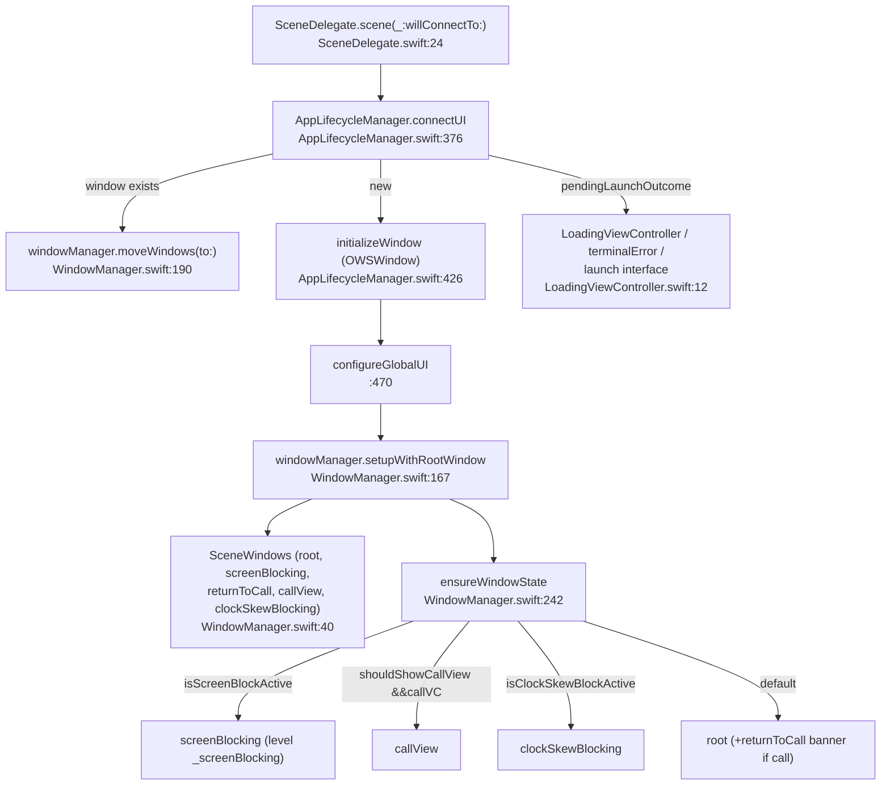

# Scene & Window Management

How the `Signal` app connects a UI scene, creates its window stack, and arbitrates which
window is visible. All claims cite `path:line`; see [README.md](README.md) for
conventions.

Primary files:
- `Signal/AppLaunch/SceneDelegate.swift`
- `Signal/AppLaunch/AppLifecycleManager.swift` (`connectUI`, `initializeWindow`, `configureGlobalUI`)
- `Signal/AppLaunch/WindowManager.swift`
- `Signal/AppLaunch/LoadingViewController.swift`

## 1. `SceneDelegate` — the UI lifecycle entry

`final class SceneDelegate: UIResponder, UIWindowSceneDelegate`
(`Signal/AppLaunch/SceneDelegate.swift:14`), holding
`private let lifecycleManager = AppLifecycleManager.shared` and `var window: UIWindow?`
(`:16-18`) **[High]**. Its doc comment states the app declares a single scene, so this is
the only place UI-adjacent lifecycle events arrive, while app-wide events go to
`AppDelegate` (`:10-13`) **[High]**.

`scene(_:willConnectTo:options:)` (`:24-52`) **[High]**:
1. `guard let windowScene = scene as? UIWindowScene else { owsFailDebug(...) ; return }`
   (`:29-32`).
2. `self.window = lifecycleManager.connectUI(in: windowScene)` (`:34`) — the window is
   produced by the lifecycle manager, not here.
3. Replays anything that caused the scene to connect: each `connectionOptions.urlContexts`
   → `handleOpenUrl` (`:38-41`); each `connectionOptions.userActivities` →
   `handle(userActivity:)` (`:42-45`); a `connectionOptions.shortcutItem` → `performAction`
   (`:46-50`).

Remaining forwards (all one-liners into `AppLifecycleManager`) **[High]**:

| `UIWindowSceneDelegate` callback | Forwards to | Line |
|---|---|---|
| `sceneDidDisconnect` | `disconnectUI()` | `:54-56` |
| `sceneWillEnterForeground` | `willEnterForeground()` | `:58-60` |
| `sceneDidBecomeActive` | `didBecomeActive()` | `:62-64` |
| `sceneWillResignActive` | `willResignActive()` | `:66-68` |
| `sceneDidEnterBackground` | `didEnterBackground()` | `:70-72` |
| `scene(_:continue:)` (Handoff) | `handle(userActivity:)` | `:78-80` |
| `windowScene(_:performActionFor:)` | `performAction(for:completionHandler:)` | `:86-92` |
| `scene(_:openURLContexts:)` | `handleOpenUrl` per URL | `:96-101` |

`scene(_:willConnectTo:)` and `scene(_:continue:)` carry `@available(iOS, deprecated:
13.0)` to silence a warning on the (not actually deprecated) `handle(userActivity:)`
(`:22-23`, `:76-77`) **[High]**.

## 2. `connectUI` — supplying the window

`AppLifecycleManager.connectUI(in windowScene:) -> UIWindow`
(`Signal/AppLaunch/AppLifecycleManager.swift:376-420`) is the join point between the
windowless launch pipeline (see [launch-sequence.md](launch-sequence.md)) and the UI
**[High]**. Its doc comment: a background launch may connect a scene long after the launch
finished, or never (`:369-374`). Branches:

1. **Reconnection:** if `self.window` already exists, log "Reconnecting to a new scene.",
   set `window.windowScene = windowScene`, call
   `AppEnvironment.shared.windowManagerRef.moveWindows(to: windowScene)`, return the
   existing window (`:383-387`) **[High]**.
2. **Tests:** if `isRunningTests`, make a window hosting a bare `UIViewController` and
   return (`:389-392`).
3. Otherwise consume `pendingLaunchOutcome.take()` (`:394-419`):
   - `.failure` → window hosting `terminalErrorViewController()`, then
     `showLaunchFailureUI` (`:394-399`).
   - `.launchInterface` → window hosting `LoadingViewController`, then
     `configureGlobalUI(in:)`, then `showLaunchInterface(...)` (`:401-409`).
   - `nil` (launch not finished) → window hosting `LoadingViewController` +
     `configureGlobalUI(in:)`, and the interface is shown later when the launch completes
     (`:411-417`).

`initializeWindow(in:rootViewController:)` (`:426-437`) creates an `OWSWindow(windowScene:)`,
stores it on `self.window` and `mainAppContext.mainWindow`, sets the root VC, and calls
`makeKeyAndVisible()` (`:430-436`) **[High]**.

`disconnectUI()` (`:422-424`) only logs — "The app's scene went away." **[High]**

`configureGlobalUI(in window:)` (`:470-479`) wires global chrome once a window exists
**[High]**:
`Theme.setupLegacyAppearance()`; `screenLockUI.setupWithRootWindow(window)`;
`windowManager.setupWithRootWindow(window, screenBlockingWindow:
screenLockUI.screenBlockingWindow)`; `screenLockUI.startObserving()`. Both
`screenLockUI` and `windowManagerRef` come from `AppEnvironment.shared` (`:471-472`).

## 3. `WindowManager` — the window stack

`class WindowManager` (`Signal/AppLaunch/WindowManager.swift:30`) owns the app's extra
windows and decides which is visible **[High]**. It is constructed eagerly in
`AppEnvironment.init` (`AppEnvironment.swift:62`, `windowManagerRef = WindowManager()`)
and its `init()` asserts the main thread (`WindowManager.swift:32-34`) **[High]**.

### Window levels

A file-scoped `extension UIWindow.Level` (`WindowManager.swift:11-26`) defines the
z-order **[High]**:

| Level | Raw value | Role (from comments) |
|---|---|---|
| `_background` | `-1` | Behind everything, including the root window (`:12-13`). |
| `_returnToCall` | `statusBar - 1` | The "return to call" banner (`:15`). |
| `_clockSkewBlocking` | `normal + 1` | Clock-skew block; deliberately behind an ongoing call (`:21-23`). |
| `_callView` | `normal + 2` | The in-call UI (`:18-19`). |
| `_screenBlocking` | `statusBar + 2` | Screen-lock/privacy block, in front of everything (`:25-26`). |

### `SceneWindows` — windows belong to a scene

`private final class SceneWindows` (`WindowManager.swift:40-146`) bundles the windows for
one connected scene **[High]**. Its doc comment notes windows can't exist until a scene
connects, and that background launches may delay or skip that, so anything running earlier
must cope with their absence (`:42-47`). Members:

- `root` (`UIWindow.Level.normal`) and `screenBlocking` — passed in at init (`:49-56`).
- `returnToCall` (lazy, `_returnToCall`) hosting a `ReturnToCallViewController`
  (`:76-85`).
- `callView` (lazy, `_callView`) — dark style, `.Signal.background`, `rootViewController =
  nil` initially (`:88-94`).
- `clockSkewBlocking` (lazy, `_clockSkewBlocking`) hosting a
  `ClockSkewAppBlockingViewController` whose "submit debug logs" closure uses
  `DebugLogs(dumper: .fromGlobals())` with support tag `"ClockSkew"` (`:97-110`).
- `newWindow(level:)` (`:112-125`) creates an `OWSWindow(windowScene:)`, sized to
  `root.bounds`, `isHidden = true`, `isOpaque = true`, applies screenshot-blocking, and
  tracks it in `createdWindows`.
- `move(to windowScene:)` (`:128-135`) re-parents every window to a new scene.
- `setBlocksScreenshots(_:)` (`:139-145`) toggles screenshot blocking on all windows.

The manager stores `private var windows: SceneWindows?` (`:148`); `connectedWindows`
(`:151-156`) `owsFail("No scene has connected!")` if nil — so callers that run only once UI
exists use it, while others guard on the optional **[High]**. Accessors: `rootWindow`
(`:158`), `callViewWindow` (`:160`), and `captchaWindow` = `callView` when
`shouldShowCallView` else `root` (`:162-164`) **[High]**.

### Setup, movement, frames, screenshots

- `setupWithRootWindow(_:screenBlockingWindow:)` (`:167-186`): `owsAssertBeta(self.windows
  == nil)`, requires `rootWindow.windowScene` (else `owsFail`), builds `SceneWindows`,
  then `presentCallViewControllerIfNeeded()` (a call may have started before a window
  existed) and `ensureWindowState()` **[High]**.
- `moveWindows(to:)` (`:190-194`) forwards to `windows?.move(to:)` — used by `connectUI`'s
  reconnection branch.
- `updateWindowFrames()` (`:214-222`) sets each window's frame to
  `CurrentAppContext().frame` when it differs; called from `didBecomeActive`
  (`AppLifecycleManager.swift:85`) **[High]**.
- `blocksScreenshots` defaults to `ScreenshotBlockingManager.isAvailable` because the
  driving preference isn't readable until the DB is open — which may be after the windows
  exist (`:230-236`); `setBlocksScreenshots(_:)` (`:240-245`) propagates changes **[High]**.

### `ensureWindowState` — the visibility arbiter

`ensureWindowState()` (`WindowManager.swift:242-306`) is the central state machine; its
`didSet` observers on `isScreenBlockActive` (`:198-203`) and `isClockSkewBlockActive`
(`:206-212`) call it, as do call transitions **[High]**. If no scene has connected it
logs and returns (`:245-249`). Priority order (highest first), with "hide before show"
discipline (`:258`) **[High]**:

1. **Screen block** (`isScreenBlockActive`): show `screenBlocking`, hide root / returnToCall
   / callView / clockSkew (`:260-266`).
2. **Call view** (`shouldShowCallView && callViewController != nil`): show `callView`, hide
   the rest (`:268-274`).
3. **Clock-skew block** (`isClockSkewBlockActive`): show `clockSkewBlocking`, hide the rest
   (`:276-282`).
4. **Root** (default): show `root`; if `callViewController != nil`, also show the
   "return to call" banner, else hide it; hide callView/screenBlock/clockSkew (`:284-304`).

A key implementation detail: the screen-blocking window is **never hidden** (that can
cause bad frames). Instead `ensureScreenBlockWindow{Shown,Hidden}` move its `windowLevel`
between `_screenBlocking` and `_background` (`:379-404`) **[High]**.

### Calls

`WindowManager` also drives the call window (**[High]**):
- `shouldShowCallView` (`:410`), `hasCall` (`:412-415`), and private `callViewController`
  (`:417`).
- `startCall(viewController:)` (`:419-435`): store the VC,
  `presentCallViewControllerIfNeeded()`, `shouldShowCallView = true`, force portrait on
  iPhone (`ows_setOrientation(.portrait)`), then `ensureWindowState()`.
- `presentCallViewControllerIfNeeded()` (`:439-467`): if a scene exists and the call window
  has no root yet, build a `WindowRootNavigationViewController(rootViewController:
  WindowRootViewController())` and push the call VC. Both private VC subclasses override
  `supportedInterfaceOrientations` to `UIDevice.current.defaultSupportedOrientations`
  (`:473-487`).
- `endCall(viewController:)` (`:469-483`), `minimizeCallIfNeeded()` (`:486-489`),
  `leaveCallView()` (PiP via the returnToCall window, `:491-504`), `returnToCallView()`
  (`:506-523`), `isCallInPip` (`:525-527`).

### `workAroundRotationIssue`

`workAroundRotationIssue(_ window:)` (`WindowManager.swift:530-647`) is a file-scoped
function called from `ensureRootWindowShown` (`:321`) **[High]**. A long comment documents
a bug where the main window stays locked in portrait while the status bar / input window
rotate (reproducible on iPhone 6, with "screen protection" on, by interrupting an
interactive keyboard-dismiss then backgrounding/re-entering). The fix calls private UIKit
API via **selector strings encoded to evade static detection** —
`isInterfaceAutorotationDisabled`, then `[[UIScrollToDismissSupport
supportForScreen:window.screen] finishScrollViewTransition]` — each guarded by `responds(to:)`
checks (`:532-647`) **[High]**. Intent beyond fixing that specific rotation bug —
undetermined; no further evidence in source.

## 4. `LoadingViewController` — the launch/loading screen

`class LoadingViewController: UIViewController`
(`Signal/AppLaunch/LoadingViewController.swift:12`) is the root VC installed while the
launch finishes (see `connectUI`, §2) **[High]**. Its header comment: the initial
presentation is intended to be indistinguishable from the Launch Screen; "loading" UI
appears only after a delay so the user doesn't think the app froze (`:10-11`) **[High]**.

- `loadView()` (`:17`): background `Theme.launchScreenBackgroundColor`; centered 128×128
  `signal-logo-128-launch-screen`; a vertical `labelStack` with `topLabel`, `bottomLabel`,
  `progressView`, `percentCompleteLabel`, `unitCountLabel`, `cancelButton`, all initially
  hidden-in-stack. Observes `.OWSApplicationDidBecomeActive`,
  `.OWSApplicationDidEnterBackground`, `.themeDidChange` (`:124-141`) **[High]**.
- `viewWillAppear` (`:144`) schedules three timers — only a slow launch reveals UI
  **[High]**: top label at **5 s** (`kTopLabelThreshold`), bottom label at **10 s**
  (`kBottomLabelThreshold`), cancel button at **60 s** (`kCancelButtonThreshold`)
  (`:149-170`).
- `updateProgress(_ progress: OWSProgress)` (`:247`) drives the progress bar, a localized
  percent label, and a `completed / total` unit-count label; fades them in with the bottom
  label's alpha (`:247-287`) **[High]**.
- `setCancellableTask(_:)` (`:296-299`) + `updateCancelButton()` (`:301-308`): the cancel
  button appears only once both a cancellable task is set and the 60 s threshold passed;
  tapping it cancels the task (`:62-69`) **[High]**.
- `supportedInterfaceOrientations` = `.all` on iPad, else `.portrait` (`:313-315`)
  **[High]**.
- A `#if DEBUG` `@available(iOS 17, *) #Preview` drives it with a simulated progress sink
  (`:291-320`) **[High]**.

## Scene/window relationships (Mermaid)

