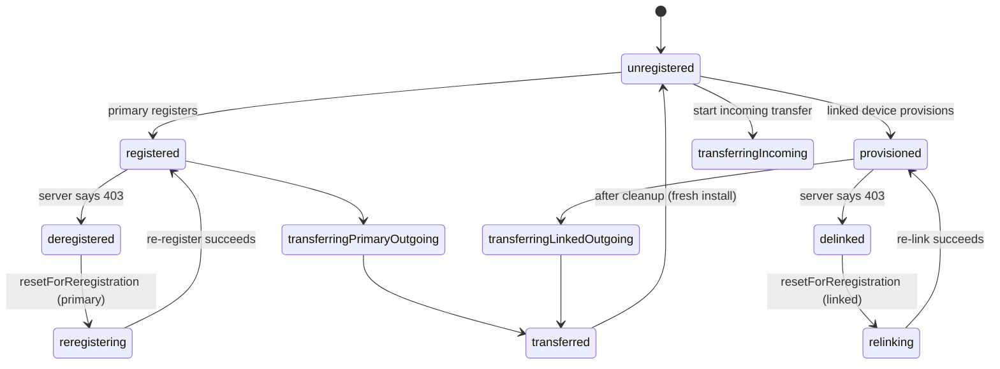
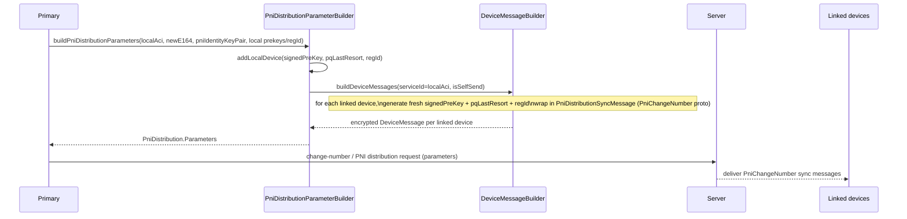
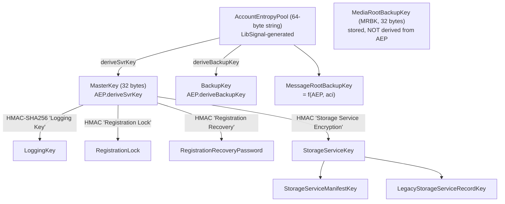

# `SignalServiceKit/Account/` — Identity, Account State & Keys

This directory defines Signal iOS's **identity model** (ACI/PNI/E164), the
**durable registration state** (`TSAccountManager`), the orchestration of
**registration-state transitions** (`RegistrationStateChangeManager`), **phone
number discoverability**, **PNI distribution** to linked devices, and the
**root key material** (`MasterKey` / `AccountEntropyPool` / `AccountKeyStore`).

- [1. Identity primitives](#1-identity-primitives)
- [2. Registration-state model](#2-registration-state-model)
- [3. `TSAccountManager`](#3-tsaccountmanager)
- [4. `RegistrationStateChangeManager`](#4-registrationstatechangemanager)
- [5. Phone Number Discoverability](#5-phone-number-discoverability)
- [6. PNI handling](#6-pni-handling)
- [7. Root key material](#7-root-key-material)
- [8. File reference checklist](#8-file-reference-checklist)

---

## 1. Identity primitives

### `OWSIdentity` — `OWSIdentity.swift`
`@objc enum OWSIdentity: UInt8 { case aci = 0; case pni = 1 }`
(`OWSIdentity.swift:14-18`). Distinguishes the two identities an account owns;
used as a key for identity key pairs, registration IDs, and prekey stores. **[High]**

### `ServiceId.swift` — ACI/PNI parsing, wrappers & DB addresses
Extends LibSignal's `Aci`/`Pni`/`ServiceId` and adds Codable/DB plumbing. **[High]**

| Type / member | Purpose | Citation |
| --- | --- | --- |
| `Aci.parseFrom(aciString:)` | Parse an ACI string, returning nil if it's actually a PNI or malformed. | `ServiceId.swift:10-22` |
| `Pni.parseFrom(pniString:)` / `parseFrom(ambiguousString:)` | Parse a PNI; the ambiguous variant lets LibSignal try the `PNI:`-prefixed form first, then falls back to a bare UUID. | `ServiceId.swift:25-41` |
| `ServiceId.ConcreteType` / `concreteType` | Switchable `.aci`/`.pni` view of a `ServiceId`. | `ServiceId.swift:43-57` |
| `ServiceId.parseFrom(serviceIdBinary:serviceIdString:)` | Parse from binary (preferred) or string. | `ServiceId.swift:59-69` |
| `ProtocolAddress(_:deviceId:)` / `.deviceIdObj` | Bridge between a `ServiceId`+`DeviceId` and LibSignal's `ProtocolAddress`. | `ServiceId.swift:71-81` |
| `AtLeastOneServiceId` | Guarantees at least an ACI or PNI (`aciOrElsePni` non-optional); failable init returns nil if both are nil. | `ServiceId.swift:83-100` |
| `PersistableDatabaseRecordAddress` | The exact `(serviceId?, phoneNumber?)` pair as written to a DB record. | `ServiceId.swift:102-119` |
| `NormalizedDatabaseRecordAddress` | "Normalized" address for legacy record types: prefers ACI alone, else stores PNI+phone; avoids persisting a phone number when the ACI is known. | `ServiceId.swift:121-180` |
| `ServiceIdObjC` / `AciObjC` / `PniObjC` | Obj-C-visible wrappers around the Swift value types. | `ServiceId.swift:182-262` |
| `@AciUuid` / `@PniUuid` | Codable + `DatabaseValueConvertible` property wrappers storing the raw UUID. | `ServiceId.swift:266-321` |
| `@ServiceIdString` / `@ServiceIdUppercaseString` | Codable wrappers storing the string form (the latter uppercased for backwards-compat). | `ServiceId.swift:323-371` |

### `LocalIdentifiers.swift` — the local user's identity bundle
`final class LocalIdentifiers` holds the current user's `aci: Aci`
(non-optional), `pni: Pni?` (optional — see note), and `phoneNumber: String`
(a `String`, not `E164`, because historically-persisted numbers may be invalid)
(`LocalIdentifiers.swift:8-45`). **[High]**

- **Why `pni` is optional:** "Primary & linked devices may not have access to
  their PNI. The primary may need to fetch it from the server, and a linked
  device may be waiting to learn about it from the primary."
  (`LocalIdentifiers.swift:28-37`). **[High]**
- Nested `PhoneNumber { e164: E164; pni: Pni }` pairs an E164 with its PNI
  (`LocalIdentifiers.swift:11-25`). The `init(aci:phoneNumber:)` convenience
  builds a `LocalIdentifiers` from an ACI + `PhoneNumber` (`:47-49`).
- `contains(serviceId:)`, `contains(phoneNumber:)`, `contains(address:)`,
  `containsAnyOf(aci:phoneNumber:pni:)`, `isAciAddressEqualToAddress(_:)`:
  self-identity checks. Notably `contains(address:)` prefers the ServiceId match
  and only falls back to phone number if the address has no ServiceId
  (`LocalIdentifiers.swift:51-115`). **[High]**
- `aciAddress` returns a `SignalServiceAddress(serviceId: aci, phoneNumber:)`
  (`:118-122`).

### `DeviceId.swift` / `DeviceType.swift`
- `DeviceId.primary = DeviceId(validating: 1)!` and `isPrimary` convenience
  (`DeviceId.swift:9-14`). The primary device is always device ID **1**. **[High]**
- `enum DeviceType { case primary; case linked }` (`DeviceType.swift:8-11`).

### `ProfileKey.swift`
Adds `ProfileKey.init(_ profileKey: Aes256Key)` — converts a 32-byte
`Aes256Key` into a LibSignal `ProfileKey` (force-unwrap is safe since both are
32 bytes) (`ProfileKey.swift:9-16`). **[High]**

### `AuthCredentialSalt.swift`
`struct AuthCredentialSalt { rawValue: Data }`; the init **validates the salt is
exactly 16 bytes**, throwing otherwise (`AuthCredentialSalt.swift:8-18`). **[High]**

---

## 2. Registration-state model

### `TSRegistrationState` — `TSAccountManager/TSRegistrationState.swift`
The canonical enumeration of what the device *is* right now. **[High]**

| Case | Meaning | Associated value | Citation |
| --- | --- | --- | --- |
| `unregistered` | Never registered; shows registration flow. | — | `TSRegistrationState.swift:16-21` |
| `reregistering` | Re-registering after deregistration (primary). | `ReregisteringLocalIdentifiers` | `:23-24` |
| `relinking` | Re-linking after delink (linked). | `ReregisteringLocalIdentifiers` | `:25-26` |
| `registered` | Normal primary. | `LocalIdentifiers` | `:28-29` |
| `provisioned` | Normal linked device. | `LocalIdentifiers` | `:30-31` |
| `deregistered` | Primary deregistered by server. | `DeregisteredLocalIdentifiers` | `:33-37` |
| `delinked` | Linked device delinked by server. | `DeregisteredLocalIdentifiers` | `:38-41` |
| `transferringIncoming` | Incoming device transfer in progress. | — | `:43-46` |
| `transferringPrimaryOutgoing` / `transferringLinkedOutgoing` | Outgoing transfer. | — | `:48-54` |
| `transferred` | Outgoing transfer done; device unusable until cleanup. | — | `:56-60` |

Derived helpers (`:63-154`): `registeredState()`, `isRegistered`,
`wasEverRegistered` (false only for `unregistered`/`transferringIncoming`),
`deviceType`, `isPrimaryDevice`, `isRegisteredPrimaryDevice`, `isDeregistered`,
`deregisteredState`, and `logString`. **[High]**

### State-view value types
- **`RegisteredState`** (`RegisteredState.swift:8-24`): projects `registered`→
  `isPrimary=true` and `provisioned`→`isPrimary=false`; any other state throws
  `NotRegisteredError`. **[High]**
- **`DeregisteredState`** (`DeregisteredState.swift:8-23`): failable init mapping
  `deregistered`→primary, `delinked`→linked, nil otherwise. **[High]**
- **`DeregisteredLocalIdentifiers`** (`DeregisteredLocalIdentifiers.swift:8-30`):
  all-optional `aci`/`phoneNumber`/`pni`; "when deregistered, the user was
  previously registered, so some/all former identifiers are available." **[High]**
- **`ReregisteringLocalIdentifiers`** (`ReregisteringLocalIdentifiers.swift:8-11`):
  `phoneNumber: String` + optional `aci` (what we remember when re-registering). **[High]**

### `RegistrationIdGenerator` — `TSAccountManager/RegistrationIdGenerator.swift`
`generate()` returns `UInt32.random(in: 1...0x3fff)` — the registration ID is
bounded to **14 bits** (`RegistrationIdGenerator.swift:11-26`). A
`MockRegistrationIdGenerator` records generated IDs for tests (`:28-40`). **[High]**

---

## 3. `TSAccountManager`

### Protocol — `TSAccountManager/TSAccountManager.swift`
The durable, cached source of truth. Public surface (`TSAccountManager.swift:9-57`): **[High]**
- `warmCaches(tx:)`
- Local identifiers: `localIdentifiers(tx:)` / `…WithMaybeSneakyTransaction`,
  `storedServerUsername`, `storedServerAuthToken`, `storedDeviceId`.
- Registration state: `registrationState(tx:)` / `…WithMaybeSneakyTransaction`,
  `registrationDate(tx:)`.
- Registration IDs: `getRegistrationId(for:tx:)`, `setRegistrationId(_:for:tx:)`
  (per `OWSIdentity`), `clearRegistrationIds(tx:)`. The setter is deliberately a
  dumb persistence operation with **no side effects** — it may be called when we
  *learn* a PNI registration ID from another device (`:33-50`). **[High]**
- Manual message fetch toggle; phone-number discoverability read + last-set date.

Supporting types:
- `NotRegisteredError` (`:59`).
- `LocalDeviceId { case valid(DeviceId); case invalid }` with `.ifValid` and
  `equals(_:)` — the device ID *could* be invalid (unsupported on server), in
  which case the user is effectively deregistered (`:61-104`). **[High]**
- Extension convenience: `mustBeRegisteredState…`, `registeredState…`,
  `localIdentifiers(authedAccount:…)` which honors an explicit `AuthedAccount`
  over the implicit stored state (`:106-150`). **[High]**
- **Setter protocols** that gate side-effectful mutations to specific managers:
  `PhoneNumberDiscoverabilitySetter` (`:152-158`) and `LocalIdentifiersSetter`
  (`:160-...`), the latter declaring `initializeLocalIdentifiers`,
  `changeLocalNumber`, `setIsDeregisteredOrDelinked`, `resetForReregistration`,
  transfer flags, and `cleanUpTransferStateOnAppLaunchIfNeeded`. **[High]**

### Implementation — `TSAccountManager/TSAccountManagerImpl.swift`
- Backed by a `NewKeyValueStore(collection: "TSStorageUserAccountCollection")`
  and an in-memory `AccountState` cache guarded by an `UnfairLock`
  (`TSAccountManagerImpl.swift:9-39`). **[High]**
- `AccountState` is **immutable**; any mutation reloads the whole thing in
  lockstep for consistency (`:321-346`, `mutateWithLock` `:368-379`). It also
  registers as a `DatabaseChangeDelegate` so external DB changes reload the cache
  (`:302-312`). **[High]**
- **Persisted keys** (`AccountState.Keys`, `:565-592`), notably:
  `TSAccountManager_DeviceId`, `TSStorageServerAuthToken`,
  `TSStorageRegisteredNumberKey` (phone), `TSStorageRegisteredUUIDKey` (ACI),
  `TSAccountManager_RegisteredPNIKey` (PNI, stored **without** the `PNI:` prefix
  for backwards-compat — see `initializeLocalIdentifiers` `:181-184`),
  `TSStorageLocalRegistrationId` (ACI regId), `TSStorageLocalPniRegistrationId`,
  reregistration keys, transfer flags, discoverability keys. **[High]**

**Deriving `TSRegistrationState` from storage** (`loadRegistrationState`,
`:470-562`) uses a strict priority order **[High]**:
1. `wasTransferred` ⇒ `.transferred`.
2. `isTransferInProgress` ⇒ outgoing/incoming transferring (based on whether
   primary-ness is known).
3. `reregistrationPhoneNumber` present ⇒ `.reregistering` or `.relinking`
   (primary-ness defaults to `.phone` idiom).
4. `isDeregisteredOrDelinked` ⇒ `.deregistered`/`.delinked`.
5. ACI+phone present ⇒ `.registered`/`.provisioned`.
6. Otherwise ⇒ `.unregistered`.

**Business rules / invariants:**
- If `registrationState.isRegistered`, `localIdentifiers != nil` is a precondition
  (`:454-456`). **[High]**
- `serverUsername` is the ACI string for a registered primary, else
  `"<aci>.<deviceId>"` (`:349-354`). **[High]**
- Registration IDs are stored as `Int64` truncated to `UInt32` (`:95-115`). **[High]**
- `resetForReregistration` keeps only discoverability + reregistration keys and
  removes everything else, asserting any unknown key is in the expected
  remove-set (`:216-258`). **[High]**

`TSAccountManagerObjcBridge` exposes `isRegisteredWithMaybeTransaction`,
`isPrimaryDeviceWithMaybeTransaction` (defaults to `true`), `localAciAddress`,
and `isTransferInProgressWithMaybeTransaction` to Obj-C
(`TSAccountManagerObjcBridge.swift:9-45`). **[High]**

`MockTSAccountManager` (`MockTSAccountManager.swift`) provides overridable
closures for every accessor, defaulting to a registered test account. **[High]**

---

## 4. `RegistrationStateChangeManager`

### Protocol — `TSAccountManager/RegistrationStateChangeManager/RegistrationStateChangeManager.swift`
Owns all **state transitions** and the side effects they entail. **[High]**

Posts two notifications (`RegistrationStateChangeManager.swift:9-24`):
`registrationStateDidChange` and `localNumberDidChange`.

Key methods (`:26-180`):
- `didRegisterOrProvision(aci:phoneNumber:authToken:deviceId:tx:)` — called
  after a successful register/provision.
- `didUpdateLocalPhoneNumber(aci:phoneNumber:tx:)` — after a change-number;
  never changes registration state.
- `resetForReregistration(aci:phoneNumber:isPrimaryDevice:tx:)` — move
  deregistered/delinked → reregistering/relinking.
- Transfer lifecycle: `setIsTransferInProgress`, `setIsTransferComplete(sendStateUpdateNotification:)`,
  `setWasTransferred`, `cleanUpTransferStateOnAppLaunchIfNeeded`.
- `setIsDeregisteredOrDelinked(_:notify:tx:)` — react to a server response that
  tells us we're (un)registered.
- `unregisterFromService()` (primary) / `unlinkLocalDevice(localDeviceId:auth:)`
  (linked) — delete the device/account server-side.

### Implementation — `RegistrationStateChangeManagerImpl.swift`
Has ~24 collaborators (`:9-82`). Highlights: **[High]**

- **`didRegisterOrProvision`** (`:94-128`): calls
  `tsAccountManager.initializeLocalIdentifiers`, then `didUpdateLocalIdentifiers`
  (updating Storage Service only when `deviceId == .primary`), then posts both
  notifications on sync-completion.
- **`didUpdateLocalIdentifiers`** (`:366-410`): removes sender certificates,
  clears "should share phone number", clears profile-key credentials and group/
  call-link auth credentials, resets Cron dates, sets Storage Service local
  identifiers, merges the local recipient (`applyMergeForLocalAccount`), and
  **always adds both the local device ID and `.primary`** to the recipient (so a
  linked device knows to send initial sync messages to the primary). It also
  defensively unblocks the local recipient. **[High]**
- **`setIsDeregisteredOrDelinked`** (`:130-213`): no-ops if unchanged; on becoming
  deregistered it: suppresses the notification if we're unregistering ourselves,
  else optionally shows a local notification; rotates the backup upload era;
  wipes cached Backup credentials; wipes KT self-check state; schedules Backup
  entitlement re-redemption; and on **delink** resets all DM timer versions. **[High]**
- **`resetForReregistration`** (`:215-253`): resets protocol sessions, sender
  keys, sender certificates, profile-key credentials, group/call-link auth
  credentials; clears payments state on linked devices only.
- **`unregisterFromService` / `unlinkLocalDevice`** (`:259-301`): issue
  `OWSRequestFactory.unregisterAccountRequest()` / `TSRequest.deleteDevice`;
  `deleteLocalDevice` sets an `isUnregisteringFromService` flag, **retries once**
  on `SignalError.connectionInvalidated` (expected when the socket closes due to
  deletion), tolerates a `NotRegisteredError` on retry, and waits for the
  identified connection to close before returning (so no spurious deregistration
  notification fires). **[High]**

`MockRegistrationStateChangeManager.swift` supplies overridable closures. **[High]**

---

## 5. Phone Number Discoverability

### `PhoneNumberDiscoverabilityManager/PhoneNumberDiscoverabilityManager.swift`
- `enum PhoneNumberDiscoverability { case everybody; case nobody }` with
  `isDiscoverable` / `isNotDiscoverableByPhoneNumber`
  (`PhoneNumberDiscoverabilityManager.swift:8-18`). **[High]**
- Protocol: `phoneNumberDiscoverability(tx:)` and
  `setPhoneNumberDiscoverability(_:updateAccountAttributes:updateStorageService:authedAccount:tx:)`
  (`:20-30`). **[High]**
- **Defaults (business rule):** `discoverabilityDefault = .everybody`;
  `discoverabilityDuringRegistration = .nobody` — "If PNP is enabled, users
  aren't discoverable during registration." Accessed through
  `Optional.orDefault` / `.orAccountAttributeDefault` (`:32-52`). **[High]**

### `PhoneNumberDiscoverabilityManagerImpl.swift`
`setPhoneNumberDiscoverability` writes through the `PhoneNumberDiscoverabilitySetter`,
and conditionally schedules an account-attributes update and a pending local
Storage-Service account update (`PhoneNumberDiscoverabilityManagerImpl.swift:9-56`).
In `TSAccountManagerImpl`, the setter persists `everybody==true` plus the last-set
date (`TSAccountManagerImpl.swift:145-170`). **[High]**
`MockPhoneNumberDiscoverabilityManager.swift` provides test closures. **[High]**

---

## 6. PNI handling

PNI distribution keeps every device's PNI key material (identity key, signed
prekey, PQ last-resort prekey, registration ID) consistent whenever the PNI
identity rotates. It's used both by **change-number** (new PNI) and by **"PNI
hello world"** repair.

### `PniDistributionParameterBuilder.swift`
- `enum PniDistribution` with nested `struct Parameters` holding
  `pniIdentityKey`, per-device `devicePniSignedPreKeys`,
  `devicePniPqLastResortPreKeys`, `pniRegistrationIds`, and `deviceMessages`
  (`PniDistributionParameterBuilder.swift:7-70`). `addLinkedDevice` asserts the
  `deviceId` matches the `deviceMessage.deviceId` (`:57-69`). **[High]**
- `protocol PniDistributionParamaterBuilder` (note the historical spelling) and
  its `Impl` (`:72-224`). `buildPniDistributionParameters` adds the local device
  then builds per-linked-device params via `buildLinkedDevicePniGenerationParams`,
  which uses `DeviceMessageBuilder.buildDeviceMessages(serviceId: localAci,
  isSelfSend: true, …, sealedSenderParameters: nil)` — sync messages never use
  sealed sender — and for each device generates a fresh signed prekey, PQ
  last-resort prekey (`generateLastResortKyberPreKeyForChangeNumber`), and
  registration ID (`:111-224`). **[High]**

### `PniDistributionSyncMessage.swift`
`final class PniDistributionSyncMessage` — **not** a `TSOutgoingMessage`; it's
part of a PNI-distribution request and distributed by the service
(`PniDistributionSyncMessage.swift:8-18`). `buildSerializedMessageProto()` fills
an `SSKProtoSyncMessagePniChangeNumber` (identity key pair, signed prekey,
last-resort kyber prekey, registration ID, new E164) and wraps it in a
`SSKProtoContent` (`:36-58`). **[High]**

### `RegistrationIdMismatchManager.swift`
Validates (once) that the **local** ACI/PNI registration IDs match the server's
understanding. `validateRegistrationIds()` short-circuits if already checked;
for each identity it fetches *its own* prekey bundle
(`OWSRequestFactory.recipientPreKeyRequest`), reads
`bundle.devices.first?.registrationId`, and if the local ID differs it **updates
local state to match remote** and records a suspected-issue flag
(`RegistrationIdMismatchManager.swift:7-130`). **[High]**

### `IdentityKeyMismatchManager.swift` — "PNI Hello World" repair
Linked devices can end up with a missing/outdated PNI identity key. This manager
(`IdentityKeyMismatchManager.swift:7-200`): **[High]**
- `recordSuspectedIssueWithPniIdentityKey(tx:)` — only sets the flag on **linked**
  devices (`:88-100`).
- `validateLocalPniIdentityKeyIfNecessary()` — serialized via a 1-wide task
  queue; waits for message processing, and only proceeds if the suspected-issue
  flag is set (`:104-130`).
- `validateIdentityKey(for:)` — if the server key doesn't match local, it
  **marks the device deregistered/delinked** (`setIsDeregisteredOrDelinked(true,
  notify: true)`), forcing a re-link that re-provisions correct PNI state
  (`:132-153`).
- `_validateIdentityKey(for:)` — for `.pni`, first re-checks the PNI via a
  `whoAmI` request (the PNI itself may have changed), then compares identity keys
  via `IdentityKeyChecker` (`:155-193`). ACI is assumed immutable. **[High]**

### `IdentityKeyChecker.swift`
`serverHasSameKeyAsLocal(for:localIdentifier:)` fetches the identity key from the
*unversioned profile* and compares it to the locally-stored identity key for the
given `OWSIdentity`; precondition enforces identity/type agreement
(`IdentityKeyChecker.swift:7-33`). The `ProfileFetcher` wrapper hits
`OWSRequestFactory.getUnversionedProfileRequest` (`:52-77`). **[High]**

---

## 7. Root key material

### `MasterKey.swift`
- `struct MasterKey` — **32 bytes** (`MasterKey.swift:20-71`). Derivation helpers
  produce `LoggingKey`, `RegistrationLock`, `RegistrationRecoveryPassword`,
  `StorageServiceKey`, each via `HMAC<SHA256>(info-string, baseKey)`
  (`deriveKey`, `:75-82`). **[High]**
- `RegistrationLock` — key to bypass reglock when registering/changing number;
  `canonicalStringRepresentation` is hex; equality is **constant-time**
  (`:138-162`). **[High]**
- `RegistrationRecoveryPassword` — bypasses SMS verification (independent of
  reglock); base64 representation (`:164-183`). **[High]**
- `StorageServiceKey` → `StorageServiceManifestKey` (per-manifest-version) and
  `LegacyStorageServiceRecordKey` (**decrypt-only**, for records not yet
  re-encrypted under the manifest scheme) (`:185-250`). **[High]**
- `DeprecatedMasterKey` — legacy `{"masterKey": …}` Codable wrapper (`:9-17`).

### `AccountEntropyPool.swift`
- `struct AccountEntropyPool` — a **64-byte** entropy string
  (`AccountEntropyPool.swift:21-70`). Validated by LibSignal
  (`AccountEntropyPool.isValid`), stored lowercased. **[High]**
- `getMasterKey()` = `MasterKey(data: AccountEntropyPool.deriveSvrKey(rawString))`;
  `getBackupKey()` = `AccountEntropyPool.deriveBackupKey(rawString)`;
  `getLoggingKey()` = last 4 hex of the master key's logging key (`:52-73`). **[High]**
- `DeprecatedAccountEntropyPool` — legacy `{"rawData": …}` wrapper (`:9-20`).

### `AccountEntropyPoolManager.swift`
- `RotateAEPRestrictions` option set — a user **can't rotate their AEP** while
  local or remote Backups are enabled (`AccountEntropyPoolManager.swift:8-20`). **[High]**
- Protocol: `generateIfMissing()`, `setAccountEntropyPool(…)`,
  `verifyRequirementsForSettingAccountEntropyPool(tx:)` (`:22-33`). **[High]**
- `Impl.generateIfMissing` — only on a **registered primary main app**; generates
  a new AEP if the key store has none (`:103-137`). **[High]**
- `Impl.setAccountEntropyPool` (`:160-253`) — the **side-effectful** entry point:
  precondition that Backups are disabled; rotates the MRBK (currently always
  rotates related non-derived keys); persists the AEP; and if registered primary:
  refreshes SVR, schedules an account-attributes update (reglock + reg-recovery
  password are downstream of the master key), rotates the Storage Service
  manifest, and sends a keys sync message to linked devices. **[High]**

### `AccountKeyStore.swift`
Pure persistence (no side effects) across three `NewKeyValueStore`s
(`AccountEntropyPool`, `MediaRootBackupKey`, `AccountKey.Sync`)
(`AccountKeyStore.swift:9-33`). **[High]**
- **MRBK** ("Media Root Backup Key") — generated once and used forever to derive
  media backup encryption keys; **stored in the backup proto itself**, not derived
  from the AEP, so changing the AEP doesn't force re-uploading media
  (`:37-73`). `getOrGenerateMediaRootBackupKey` warns that generating a new one
  invalidates all media backups (`:58-66`). **[High]**
- `getMessageRootBackupKey(aci:tx:)` = `MessageRootBackupKey(accountEntropyPool:
  aci:)` (`:78-85`). **[High]**
- `getAccountEntropyPool` / `setAccountEntropyPool` — the setter resets
  `haveSetBackupID` and keeps the `DebugLogger` logging key in sync, but **does
  not** perform the broader rotation side effects (that's
  `AccountEntropyPoolManager`'s job) (`:89-132`). **[High]**
- `isWaitingForKeysSyncMessage` flag used by linked devices awaiting keys from the
  primary (`:136-150`). **[High]**

---

## 8. File reference checklist

Every first-party file in `SignalServiceKit/Account/`:

- `ServiceId.swift` — §1
- `LocalIdentifiers.swift` — §1
- `OWSIdentity.swift` — §1
- `DeviceId.swift` — §1
- `DeviceType.swift` — §1
- `ProfileKey.swift` — §1
- `AuthCredentialSalt.swift` — §1
- `RegisteredState.swift` — §2
- `DeregisteredState.swift` — §2
- `DeregisteredLocalIdentifiers.swift` — §2
- `ReregisteringLocalIdentifiers.swift` — §2
- `TSAccountManager/TSRegistrationState.swift` — §2
- `TSAccountManager/RegistrationIdGenerator.swift` — §2
- `TSAccountManager/TSAccountManager.swift` — §3
- `TSAccountManager/TSAccountManagerImpl.swift` — §3
- `TSAccountManager/TSAccountManagerObjcBridge.swift` — §3
- `TSAccountManager/MockTSAccountManager.swift` — §3
- `TSAccountManager/RegistrationStateChangeManager/RegistrationStateChangeManager.swift` — §4
- `TSAccountManager/RegistrationStateChangeManager/RegistrationStateChangeManagerImpl.swift` — §4
- `TSAccountManager/RegistrationStateChangeManager/MockRegistrationStateChangeManager.swift` — §4
- `PhoneNumberDiscoverabilityManager/PhoneNumberDiscoverabilityManager.swift` — §5
- `PhoneNumberDiscoverabilityManager/PhoneNumberDiscoverabilityManagerImpl.swift` — §5
- `PhoneNumberDiscoverabilityManager/MockPhoneNumberDiscoverabilityManager.swift` — §5
- `PniDistributionParameterBuilder.swift` — §6
- `PniDistributionSyncMessage.swift` — §6
- `RegistrationIdMismatchManager.swift` — §6
- `IdentityKeyMismatchManager.swift` — §6
- `IdentityKeyChecker.swift` — §6
- `MasterKey.swift` — §7
- `AccountEntropyPool.swift` — §7
- `AccountEntropyPoolManager.swift` — §7
- `AccountKeyStore.swift` — §7
