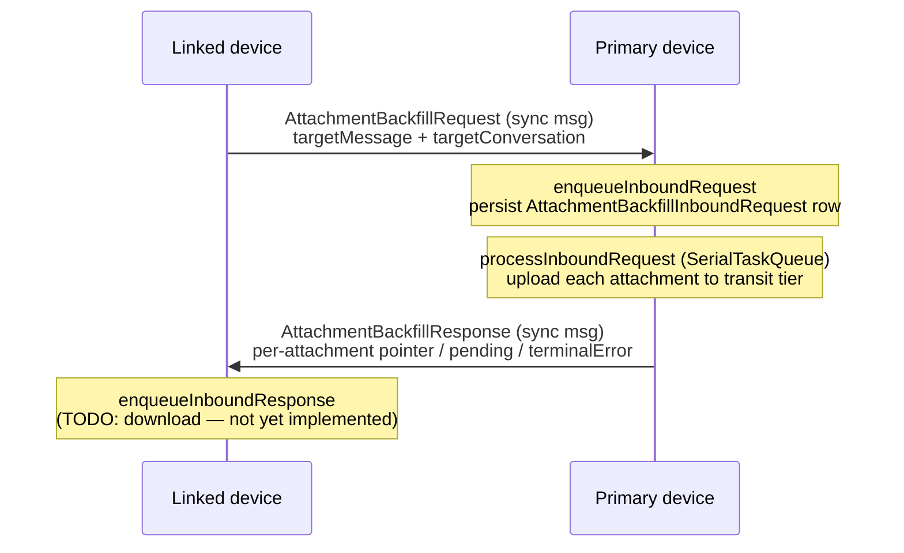

# Attachment Backfill

Covers `SignalServiceKit/AttachmentBackfill/`:

- `AttachmentBackfillManager.swift`
- `AttachmentBackfillRequestSyncMessage.swift`
- `AttachmentBackfillResponseSyncMessage.swift`
- `AttachmentBackfillInboundRequestRecord.swift`

**Attachment backfill** is the mechanism by which a **linked device** that is missing the file
data for a message's attachment(s) asks the **primary device** to re-upload those attachments to
the transit tier so the linked device can download them. The two sides communicate over
`AttachmentBackfillRequest` / `AttachmentBackfillResponse` **sync messages** (device-to-device, via
the self conversation). This is distinct from the Backup media-tier flow: backfill explicitly only
deals with transit-tier re-uploads and will *not* hand out media-tier CDN pointers
(`AttachmentBackfillManager.swift:395`).

The subsystem has four roles, all funneled through `AttachmentBackfillManager`:

1. **Outbound request** (linked-device side): ask the primary to re-upload an attachment —
   `sendOutboundRequest` (`:60`).
2. **Inbound request** (primary side): receive a request, enqueue it durably, upload the
   attachments, and send a response — `enqueueInboundRequest` (`:160`) → `processInboundRequest`
   (`:217`).
3. **Outbound response** (primary side): report per-attachment results (uploaded pointer, pending,
   or terminal error) — `sendBackfillResponse` and friends (`:502`).
4. **Inbound response** (linked-device side): consume the pointers and download — currently a
   **stub** (`enqueueInboundResponse`, `:533`).

Confidence for the overview: HIGH (all four files read in full). Confidence that the
linked-device *request* trigger is unwired: HIGH — `sendOutboundRequest` has no production caller
(grep across `*.swift` finds only its definition); the inbound-response download path is an explicit
`TODO` (`:538`).

---

## `AttachmentBackfillManager` — `AttachmentBackfillManager.swift:8`

Confidence: HIGH (read in full). The single orchestrator. Constructed once in
`AppSetup.swift:1210`, exposed as `DependenciesBridge.shared.attachmentBackfillManager`
(`DependenciesBridge.swift:61`), and passed into `BackgroundMessageFetcherFactory`
(`AppSetup.swift:1747`/`:1816`).

Collaborators (ctor, `:36`): `AttachmentStore`, `AttachmentUploadManager`, `DB`,
`InteractionStore`, `NotificationPresenter`, `RecipientDatabaseTable`, a
`AttachmentBackfillSyncMessageSender`, and `ThreadStore`. It also owns a `SerialTaskQueue`
(`:54`) and a `PrefixedLogger` prefixed `[Backfill]` (`:50`).

### Sync-message sender seam — `AttachmentBackfillSyncMessageSender` protocol `:11`
Confidence: HIGH. A thin wrapper around `MessageSenderJobQueue` (for test substitution). The
production conformance is on `MessageSenderJobQueue` (`:670`); it enqueues the request/response as
a `.preprepared(transientMessageWithoutAttachments:)` outgoing message.

### Outbound requests — `sendOutboundRequest(message:localIdentifiers:tx:)` `:60`
Confidence: HIGH. Assembles an `AttachmentBackfillTarget` from the message (`:621`), gets/creates
the local (self) thread (`:76`), builds an `SSKProtoSyncMessageAttachmentBackfillRequest` with the
target message + conversation, wraps it in an `AttachmentBackfillRequestSyncMessage`, and enqueues
it. Failures to assemble or build are logged (`warn`/`owsFailDebug`) and swallowed.

> Note: no production code currently calls `sendOutboundRequest` (grep). This is the linked-device
> side of the handshake and appears to be awaiting a UI/trigger integration. Confidence: HIGH.

### Inbound requests
The primary device's handler. Entry point from message processing is
`MessageReceiver.swift:853`, which dispatches `syncMessage.attachmentBackfillRequest` into
`enqueueInboundRequest`.

#### `enqueueInboundRequest(attachmentBackfillRequestProto:registeredState:tx:)` `:160`
Confidence: HIGH.
- **Primary-only gate** (`:165`): dropped with a warn if not a registered primary.
- Parses the target (`parseBackfillTarget`, `:549`); invalid → warn + drop.
- Locates the target `TSMessage` (`locateBackfillTargetMessage`, `:573`). **If missing**, it sends a
  `messageNotFound` error response immediately (`sendTargetNotFoundResponse`, `:454`) rather than
  silently dropping — so the linked device learns the message is gone.
- Persists (or reuses) an `AttachmentBackfillInboundRequestRecord` keyed by interaction row id
  (`fetchOrInsertRecord`, `:52` in the record file).
- **Touches** the target message (`db.touch(..., shouldReindex: false)`, `:205`) so the
  conversation view reloads and shows a "backfilling" indicator.
- Schedules `processInboundRequest` on `tx.addSyncCompletion` — i.e. after the write
  commits.

#### `processInboundRequest(requestRecordId:localIdentifiers:)` `:217`
Confidence: HIGH. Enqueues onto the `SerialTaskQueue` (so inbound requests are processed
**one at a time**) and:
1. In an `awaitableWrite`, re-fetches the record + rebuilds the target. If the record or
   message/target is gone, deletes the record (`:259`) and bails without responding.
2. Posts a "syncing" local notification (`notifyUserOfAttachmentBackfill`, `:276`, string
   `ATTACHMENT_BACKFILL_SYNCING_NOTIFICATION`).
3. `attemptBackfill(interactionId:)` (`:344`) uploads the attachments (see below).
4. **Cancellation check** (`:289`): if cancelled, posts an "interrupted" notification
   (`ATTACHMENT_BACKFILL_INTERRUPTED_NOTIFICATION`, `:292`) and throws `CancellationError` — the
   record is **left in place** for retry on next launch.
5. Otherwise, in a final `awaitableWrite`: sends the response
   (`sendBackfillAttemptResponse`), **deletes** the record, and touches the message again (`:329`)
   so the UI clears the indicator.
6. Posts a "finished" notification (`ATTACHMENT_BACKFILL_FINISHED_NOTIFICATION`, `:333`).

#### `attemptBackfill(interactionId:)` `:344`
Confidence: HIGH. Chooses the attachments to re-upload: **message-sticker** attachments if present,
otherwise **message-body** attachments. Empty → returns `[]` (warn). Uploads run
**concurrently** via a `withTaskGroup` (`:368`), but results are re-sorted back into the original
attachment order so the response ordering is deterministic.

#### `uploadAttachmentForBackfill(referencedAttachment:)` `:392`
Confidence: HIGH. Per attachment:
- **Media-tier-only short-circuit** (`:399`): if there's no local `AttachmentStream` but
  `mediaTierInfo` exists, returns a private `BackedUpAttachmentMissingLocalFileError` (`:408`).
  Backfill can't send media-tier pointers, but this is treated as **non-terminal** (maps to
  `pending`) so the linked device may retry later.
- Otherwise uploads to the transit tier via `AttachmentUploadManager.uploadTransitTierAttachment`
  wrapped in `Retry.performWithBackoff(maxAttempts: 4)` (`:412`). That upload call short-circuits if
  the attachment already has recent, reusable transit-tier info.
- On success, **re-fetches** the attachment to pick up fresh transit-tier info and builds a sending
  proto via `ReferencedAttachment.asProtoForSending()` (`:432`).
- On failure: retryable errors are logged `warn`, others `error`; the error is returned in the
  `Result`.

#### `hasEnqueuedInboundRequest(interactionRowId:tx:)` `:103`
Confidence: HIGH. Read-only lookup used by the UI
(`CVComponentState.swift:97`) to decide whether a given message's attachments should render as
"uploading."

#### `processEnqueuedInboundRequests(registeredState:)` `:113`
Confidence: HIGH. Primary-only (`:114`). On app launch, fetches **all** persisted records ascending
and kicks each through `processInboundRequest` — this is the crash/relaunch recovery path. Invoked
from `AppEnvironment.swift:432` once the app is ready and the device is a registered primary.

#### `awaitProcessingEnqueuedInboundRequests()` `:133`
Confidence: HIGH. Used by `BackgroundMessageFetcher` (`BackgroundMessageFetcher.swift:132`) to block
suspension until backfills finish. Enqueues a no-op flush task to wait for the queue to drain; on
**cancellation** it enqueues `enqueueCancellingPrevious` to cooperatively cancel in-flight work,
awaits that teardown, then rethrows `CancellationError`. This is what makes a cancelled
`processInboundRequest` leave its record for later.

### Outbound responses — `:454`–`:531`
Confidence: HIGH. Three layers:
- `sendTargetNotFoundResponse` (`:454`) sets `error = .messageNotFound`.
- `sendBackfillAttemptResponse` (`:469`) maps each per-attachment `Result` into an
  `SSKProtoSyncMessageAttachmentBackfillResponseAttachmentData`:
  - `.success` → the attachment pointer;
  - `BackedUpAttachmentMissingLocalFileError` (`:484`) → `.pending`;
  - retryable error → `.pending`;
  - other error → `.terminalError`.
  (`pending` tells the linked device to try again later; `terminalError` tells it to give up.)
- `sendBackfillResponse` (`:502`) is the common builder: target message + conversation + a
  customize block, wrapped in `AttachmentBackfillResponseSyncMessage` and enqueued.

### Inbound responses — `enqueueInboundResponse(...)` `:533`
Confidence: HIGH. **Stub.** Logs `"AttachmentBackfillResponse not yet supported."` (`:539`) with a
`TODO` to enqueue downloads from the response's attachment pointers (`:538`). Dispatched from
`MessageReceiver.swift:861`.

### Backfill target model — `AttachmentBackfillTarget` `:544`
Confidence: HIGH. A private struct pairing an `AddressableMessage` (author + sent timestamp) and a
`ConversationIdentifier` (serviceId / e164 / groupIdentifier).
- `parseBackfillTarget` (`:549`) builds it from an inbound request proto.
- `assembleBackfillTarget` (`:621`) builds it from a local `TSMessage` + `LocalIdentifiers`
  (contact threads → serviceId or e164; group threads → group identifier).
- `locateBackfillTargetMessage` (`:573`) resolves the thread (via `RecipientDatabaseTable` /
  `ThreadStore`) and then the specific message via
  `InteractionStore.findMessage(withTimestamp:threadId:author:tx:)`.

---

## Sync messages

### `AttachmentBackfillRequestSyncMessage` — `AttachmentBackfillRequestSyncMessage.swift:9`
Confidence: HIGH (read in full). An `@objc` `OutgoingSyncMessage` subclass. Stores the request proto
**serialized to `Data`** (`:13`) rather than the proto object — then re-deserializes it inside
`syncMessageBuilder` (`:28`). Marked `isUrgent = true` (`:26`). Implements `NSSecureCoding`
(`supportsSecureCoding`, encode/decode of `serializedRequestProto`) plus `hash`/`isEqual` over the
serialized bytes — these are what let it be persisted in the `MessageSenderJobQueue` and survive
relaunch.

### `AttachmentBackfillResponseSyncMessage` — `AttachmentBackfillResponseSyncMessage.swift:9`
Confidence: HIGH (read in full). Same shape as the request message, but keeps **both** the live
`responseProto` and its serialized form (`:12`/`:13`); `syncMessageBuilder` uses the live proto
directly (`:29`). Also `isUrgent` (`:27`), secure-coding, and `hash`/`isEqual` over the serialized
bytes.

> The serialize-and-store pattern exists because these are `NSSecureCoding` job-queue messages:
> the proto itself isn't `NSCoding`, so the bytes are archived and the proto is rebuilt on demand.
> Confidence: HIGH (direct read); the *rationale* is inferred — confidence MEDIUM.

---

## Persistence — `AttachmentBackfillInboundRequestRecord` — `AttachmentBackfillInboundRequestRecord.swift:10`

Confidence: HIGH (read in full). A GRDB `Codable`/`FetchableRecord`/`PersistableRecord` row in the
`AttachmentBackfillInboundRequest` table (`:13`). Columns: `id` (autoincrement PK, `:24`) and
`interactionId` (`:25`).

The table is created by migration `.addAttachmentBackfillRequestTable`
(`GRDBSchemaMigrator.swift:5084`): `interactionId` is `NOT NULL`, **`UNIQUE`**, and a foreign key to
`model_TSInteraction(id)` with `onDelete: .cascade` / `onUpdate: .cascade`. Consequences
(confidence: HIGH):
- One pending backfill per interaction (the `UNIQUE` constraint backs `fetchOrInsertRecord`, `:52`).
- If the underlying message is deleted, the pending backfill row is **cascade-deleted** for free.

The table is also listed in `DatabaseRecovery.swift:346` (so it participates in corrupt-DB
recovery). Confidence: HIGH.

Record API: `fetchAllAscending` (`:27`, launch recovery order), `fetchRecord(interactionId:)`
(`:39`), `fetchOrInsertRecord(interactionId:)` (`:52`, an `INSERT ... RETURNING *` that reuses an
existing row).

---

## Concurrency / cryptography / networking considerations

- **Serial processing.** All `processInboundRequest` work runs on a single `SerialTaskQueue`
  (`:54`), so only one inbound request is backfilled at a time; within a single request, individual
  attachment uploads fan out concurrently via `withTaskGroup` (`:368`) and are re-ordered to be
  deterministic. Confidence: HIGH.
- **Durability / idempotency.** State lives in SQLite (`AttachmentBackfillInboundRequest`): a
  crash mid-upload leaves the record behind, and launch recovery (`processEnqueuedInboundRequests`)
  re-drives it. The record is only deleted after a response is sent, or when the target is found to
  be missing. Confidence: HIGH.
- **Cooperative cancellation.** `awaitProcessingEnqueuedInboundRequests` (`:133`) +
  `taskQueue.enqueueCancellingPrevious` let background-fetch suspension cancel in-flight backfills
  cleanly, posting an "interrupted" notification and preserving the record. Confidence: HIGH.
- **Primary-only.** Both `enqueueInboundRequest` (`:165`) and `processEnqueuedInboundRequests`
  (`:114`) early-return unless the device is a registered primary — only the primary ever answers
  backfill requests. Confidence: HIGH.
- **Networking.** The only network I/O is `AttachmentUploadManager.uploadTransitTierAttachment`
  (`:412`), guarded by `Retry.performWithBackoff(maxAttempts: 4)` and short-circuited when reusable
  transit-tier info already exists. Transport goes through the standard `MessageSenderJobQueue`
  (sync messages). Confidence: HIGH.
- **Cryptography.** This folder owns no crypto directly; attachment encryption/key handling is
  delegated to the attachment upload pipeline (see [Attachments](../Attachments/README.md)). The
  deliberate refusal to send **media-tier** pointers (`:399`) is a correctness choice, not a crypto
  one. Confidence: HIGH for "no local crypto"; MEDIUM on the exact upstream key handling (not read
  here).
- **UI coupling.** `db.touch` on the target message (`:205`, `:329`) plus the
  `hasEnqueuedInboundRequest` query drive the conversation-view "uploading/backfilling" indicator
  (`CVComponentState.swift:79`–`:98`). Confidence: HIGH.

> Related: attachments, references, upload pointers, and transit vs. media tier are documented under
> [Attachments](../Attachments/README.md).
