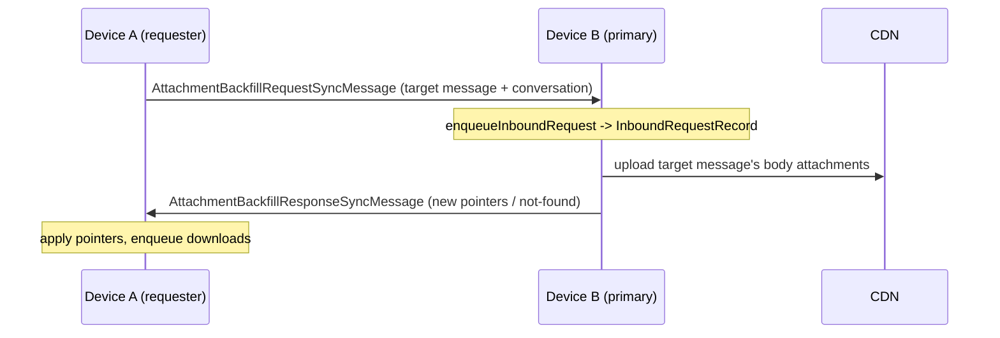
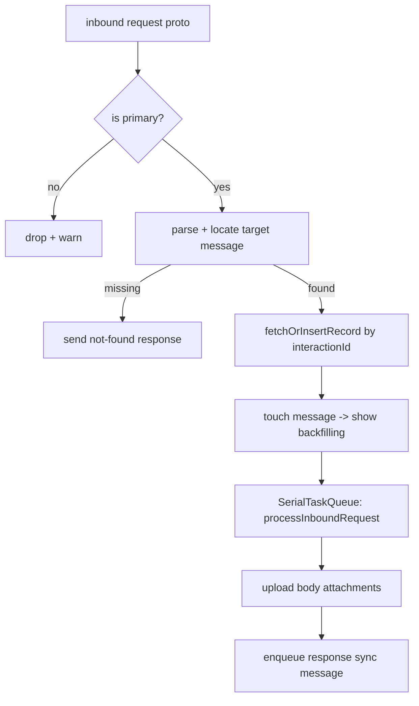

# Attachments — Backfill (linked-device attachment sync)

Covers `SignalServiceKit/AttachmentBackfill/`:

- `AttachmentBackfillManager.swift`
- `AttachmentBackfillRequestSyncMessage.swift`
- `AttachmentBackfillResponseSyncMessage.swift`
- `AttachmentBackfillInboundRequestRecord.swift`

**Purpose.** When one device in an account lacks the bytes for an attachment it knows about (e.g. a
newly linked device, or a device that offloaded fullsize media), it can ask another device in the
same account to re-upload those attachment bytes. This is "backfill": a device-to-device
(sync-message) protocol where the **primary** device fulfills requests by uploading the body
attachments and replying with their new pointer info.

---

## `AttachmentBackfillManager` — `AttachmentBackfillManager.swift:7`

Confidence: HIGH (public API + inbound/outbound flow read).

Dependencies (`:24`): `AttachmentStore`, `AttachmentUploadManager`, `DB`, `InteractionStore`,
`NotificationPresenter`, `RecipientDatabaseTable`, an `AttachmentBackfillSyncMessageSender` (wraps
`MessageSenderJobQueue`, mockable, `:10`), `ThreadStore`, and a `SerialTaskQueue` (`:51`) that
serializes inbound processing.

### Outbound (requesting backfill)
- `sendOutboundRequest(message:localIdentifiers:tx:)` (`:60`): assembles an
  `AttachmentBackfillTarget` (addressable message + conversation identifier). If assembly fails it
  logs and returns. Otherwise it builds a `SSKProtoSyncMessageAttachmentBackfillRequest` and sends
  it to the local thread via `AttachmentBackfillRequestSyncMessage`. Errors building the sync
  message are `owsFailDebug`-logged and swallowed. Confidence: HIGH.

### Inbound (fulfilling backfill — primary only)
- `hasEnqueuedInboundRequest(interactionRowId:tx:)` (`:103`): is there a pending inbound record for
  this interaction?
- `processEnqueuedInboundRequests(registeredState:)` (`:113`): **primary-only**; fetches all
  inbound records ascending and processes each (used to resume after interrupted launches).
- `awaitProcessingEnqueuedInboundRequests()` (`:133`): awaits the serial queue flushing;
  cooperatively cancels and waits for teardown, re-throwing `CancellationError`.
- `enqueueInboundRequest(attachmentBackfillRequestProto:registeredState:tx:)` (`:160`): **primary-
  only**. Parses + locates the target message; if the message is missing it immediately sends a
  "target not found" response. Otherwise it `fetchOrInsertRecord`s an inbound record, touches the
  message (so the conversation view shows "backfilling"), and on `tx.addSyncCompletion` kicks off
  `processInboundRequest`. Confidence: HIGH.
- `processInboundRequest(requestRecordId:localIdentifiers:)` (`:217`): uploads the target message's
  body attachments (via `AttachmentUploadManager`) and enqueues a response sync message. Runs on
  the `SerialTaskQueue` as a `Task`. Confidence: MEDIUM (signature + doc comment; body not read in
  full).
- `enqueueInboundResponse(...)` (`:533`), `add(...)` sender wrappers (`:671`/`:681`), and a logger
  helper `suffixed(inboundRequestRecordId:)` (`:695`).

Edge cases (confidence: HIGH where cited): non-primary devices drop inbound requests; a missing
target message yields a not-found response rather than silence; records are keyed by interaction
id and deduplicated via `fetchOrInsertRecord`.

---

## Sync messages

Both are `OutgoingSyncMessage` subclasses that carry a serialized proto and are marked
`isUrgent = true`. Confidence: HIGH (read in full).

### `AttachmentBackfillRequestSyncMessage` — `AttachmentBackfillRequestSyncMessage.swift:7`
Stores `serializedRequestProto` (a `SSKProtoSyncMessageAttachmentBackfillRequest`). `syncMessageBuilder`
(`:28`) re-deserializes and sets `attachmentBackfillRequest`; deserialization failure returns `nil`
(message won't send) with an `owsFailDebug`. Implements `NSSecureCoding`, `hash`, `isEqual`.

### `AttachmentBackfillResponseSyncMessage` — `AttachmentBackfillResponseSyncMessage.swift:7`
Holds both the live `responseProto` and its serialized form. `syncMessageBuilder` (`:28`) sets
`attachmentBackfillResponse`. Same secure-coding/equality plumbing.

---

## `AttachmentBackfillInboundRequestRecord` — `AttachmentBackfillInboundRequestRecord.swift:9`

Confidence: HIGH. GRDB record; table `AttachmentBackfillInboundRequest` (`:13`).
- Fields: `id`, `interactionId` (`:30`).
- `fetchAllAscending(tx:)` (`:33`) — resume order.
- `fetchRecord(interactionId:tx:)` (`:46`) — existence check.
- `fetchOrInsertRecord(interactionId:tx:)` (`:58`) — insert-or-return via `INSERT ... RETURNING *`,
  ensuring one record per interaction.

