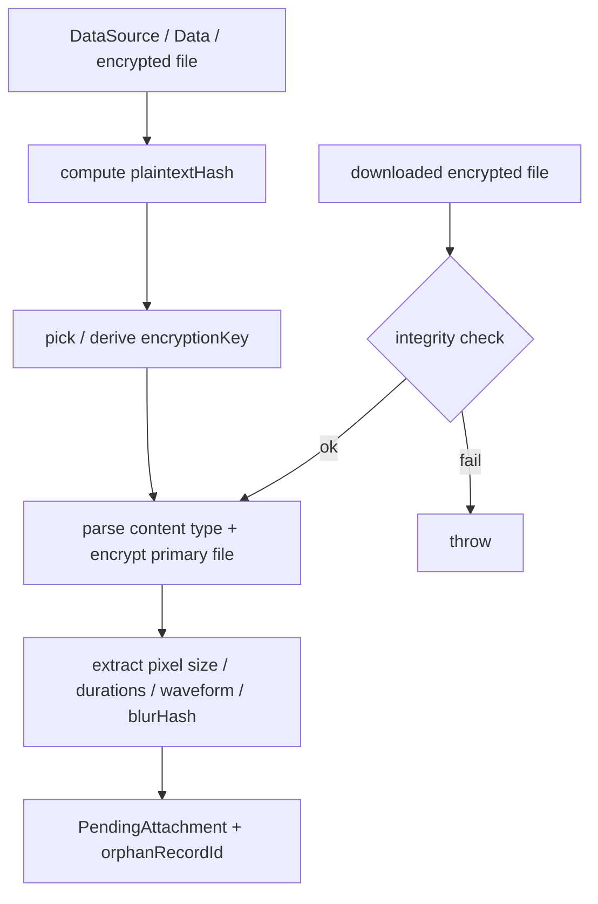
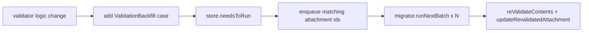

# Attachments — Content Validation & Encryption

Covers:

- `Messages/Attachments/V2/ContentValidation/AttachmentContentValidator.swift`
- `Messages/Attachments/V2/ContentValidation/AttachmentContentValidatorImpl.swift`
- `Messages/Attachments/V2/ContentValidation/AttachmentContentValidatorMock.swift`
- `Messages/Attachments/V2/ContentValidation/AttachmentValidationBackfillStore.swift`
- `Messages/Attachments/V2/ContentValidation/AttachmentValidationBackfillMigrator.swift`

Validation is where plaintext becomes a trustworthy, encrypted, content-addressed
`PendingAttachment`. It is the single place that: parses the file, computes the plaintext hash,
chooses/derives the encryption key, encrypts to a local file, extracts cached media metadata
(dimensions, durations, waveform, blurhash), and verifies integrity for downloads.

---

## Core types — `AttachmentContentValidator.swift`

Confidence: HIGH (read in full).

### `AttachmentIntegrityCheck` — `:11`
How a downloaded attachment is verified:
- `.ciphertextDigest(Data)` — `SHA256(iv + ciphertext + hmac)` (required to *send*).
- `.plaintextHash(Data)` — `SHA256(plaintext)`.
`isEmpty` guards against empty data.

### `PendingAttachment` — `:34`
A validated, encrypted, ready-to-insert attachment: `plaintextHash`, encrypted/unencrypted byte
counts, `mimeType`, `encryptionKey`, `ciphertextDigest`, `localRelativeFilePath`, `renderingFlag`,
`sourceFilename`, an `orphanRecordId` (pending-attachment file reservation — see
[OrphanedAttachments.md](OrphanedAttachments.md)), plus optional `blurHash`, `mediaPixelSize`,
`videoDuration`, `videoStillFrameRelativeFilePath`, `audioDuration`,
`audioWaveformRelativeFilePath`. `mediaName` is computed the same way as `Attachment.mediaName`.

### `RevalidatedAttachment` — `:70`
Results of re-validating an already-stored attachment (new ancillary files + fresh cached
metadata) without re-copying the primary file.

### `ValidatedInlineMessageBody` / `ValidatedMessageBody` — `:80`/`:85`
The (possibly truncated) inline body plus an optional oversize-text `PendingAttachment`.

### Protocol methods — `:92`
| Method | Line | Purpose / validations |
|--------|------|-----------------------|
| `validateDataSourceContents(_:mimeType:renderingFlag:sourceFilename:)` | 96 | Validate+encrypt a file `DataSourcePath`. Content type may end up `invalid` but still usable. Throws on read/parse failure. |
| `validateDataContents(_:mimeType:...)` | 110 | Same for in-memory `Data`. |
| `validateDownloadedContents(ofEncryptedFileAt:attachmentKey:plaintextLength:integrityCheck:mimeType:...)` | 128 | Validate a downloaded **encrypted** file; truncates to `plaintextLength` if provided; **verifies the integrity check**. |
| `reValidateContents(ofEncryptedFileAt:attachmentKey:plaintextLength:mimeType:)` | 142 | Re-validate only (no integrity check, no primary-file copy) → `RevalidatedAttachment`. |
| `validateBackupMediaFileContents(fileUrl:outerAttachmentKey:innerDecryptionMetadata:finalAttachmentKey:mimeType:...)` | 180 | Validate a media-tier file. **Double decryption**: media tier wraps the transit-tier encryption, so the file is decrypted twice. Integrity check not required (file is from the local user). If `finalAttachmentKey` matches the inner key, re-encryption is skipped. |
| `truncatedMessageBodyForInlining(_:tx:)` | 194 | Truncate a body for inlining, dropping overflow (last-resort; prefer the next method). |
| `prepareOversizeTextsIfNeeded(from:attachmentKeys:)` | 205 | Create oversize-text pending attachments + truncated bodies for a keyed batch. |
| `prepareQuotedReplyThumbnail(fromOriginalAttachment:originalReference:)` | 215 | Build a `QuotedReplyAttachmentDataSource` (throws for non-visual). |
| `prepareQuotedReplyThumbnail(fromOriginalAttachmentStream:)` | 221 | Build a `PendingAttachment` thumbnail (throws for non-visual). |

Extension convenience `prepareOversizeTextIfNeeded(_:)` (`:227`) wraps the batch form for a single
body.

---

## `AttachmentContentValidatorImpl` — `AttachmentContentValidatorImpl.swift:10`

Confidence: HIGH (head + key flow read; large file).
Dependencies: `AttachmentStore`, `AudioWaveformManager`, `dateProvider`, `DB`,
`OrphanedAttachmentCleaner` (`:12`–`:16`).

Validation pipeline for a local file (`validateDataSourceContents`, `:32`):
1. `computePlaintextHash(inputType:)` over the (decrypted, if needed) plaintext.
2. `attachmentKeyToUse(primaryFilePlaintextHash:inputAttachmentKey:)` — reuse a passed-in key or
   derive/generate one.
3. `validateContentsAndPrepareAttachmentFiles(input:)` — parse the content type, encrypt the
   primary file to a reserved path, extract cached metadata (and blurhash when requested).
4. `dataSource.consumeAndDeleteIfNecessary()` to release the source.

Edge cases / errors (confidence: HIGH from protocol docs, MEDIUM for impl specifics):
- Content type can be classified `invalid`; an `Attachment` is still created from it.
- Download validation throws if the integrity check (digest or plaintext hash) does not match.
- `validateBackupMediaFileContents` requires correct inner/outer keys and performs two decrypt
  passes.

`AttachmentContentValidatorMock.swift` is the test double. Confidence: MEDIUM.

---

## Re-validation backfill

When validation logic changes (bug fix, new file type), already-validated attachments must be
re-run through the updated validator.

### `AttachmentValidationBackfillStore` — `AttachmentValidationBackfillStore.swift:9`
Confidence: HIGH. A `KeyValueStore` (collection `AttachmentValidationBackfillStore`) plus a SQLite
queue table.
- `needsToRun(tx:)` (`:14`) — true if any backfill still needs enqueuing or the queue is non-empty.
- `backfillsThatNeedEnqueuing(tx:)` (`:28`) — all `ValidationBackfill` cases newer than the last
  enqueued (all of them if never run).
- `enqueue`/`getNextAttachmentIdBatch`/`dequeue` (`:52`/`:62`/`:79`) operate on the
  `AttachmentValidationBackfillQueue` table (ordered by id DESC), `batchSize = 5` (`:88` constant).

### `AttachmentValidationBackfillMigrator` — `AttachmentValidationBackfillMigrator.swift:23`
Confidence: HIGH. `runNextBatch()` (`:27`) runs one batch and returns `true` when finished.
`ValidationBackfill` enum (`:31`) currently has one case: `recomputeAudioDurations = 1`. A
`ContentTypeFilter` (`:40`) narrows which attachments to re-validate (`none` / `contentType` /
`mimeTypes`) to leverage the `(contentType, mimeType)` index. New backfills are appended with the
next raw value.

