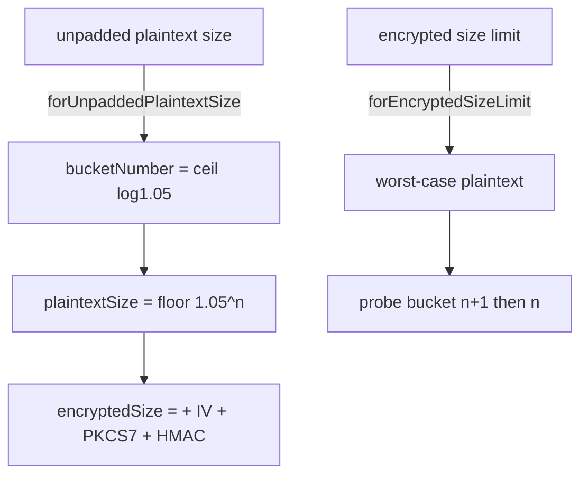

# Attachments — Core (limits, padding, media utils, blurhash)

Covers:

- `SignalServiceKit/Attachments/PaddingBucket.swift`
- `SignalServiceKit/Attachments/AttachmentLimits.swift`
- `SignalServiceKit/Attachments/PaddingBucketTest.swift` (tests)
- `SignalServiceKit/Messages/Attachments/OWSMediaUtils.swift`
- `SignalServiceKit/Messages/Attachments/BlurHash.swift`

---

## PaddingBucket

File: `SignalServiceKit/Attachments/PaddingBucket.swift:18` (confidence: HIGH)

`struct PaddingBucket` computes (and reverses) attachment padding used to obfuscate the real
size of an attachment on the wire. Plaintext bytes are rounded up to the nearest power of
`1.05`.

- Constants (`:19`): `paddingMultiplier = 1.05`; `smallestBucketNumber = 129` (⇒ 541 bytes);
  encryption overhead uses AES-CBC IV length, HMAC-256 output length, and AES block length.
- Stored properties (`:28`–`:34`): `bucketNumber`, `plaintextSize` (padded plaintext),
  `encryptedSize` (padded + encryption overhead).
- `init?(bucketNumber:)` (`:36`) clamps to `smallestBucketNumber`, computes
  `plaintextSize = floor(1.05^bucketNumber)`, returns `nil` on overflow.
- `addingEncryptionOverhead(to:)` (`:52`) adds `IV + (block - value % block) + HMAC` (PKCS7
  padding to the next block boundary, plus IV and HMAC), returning `nil` on overflow.
- `forUnpaddedPlaintextSize(_:)` (`:66`) → bucket for a given plaintext size
  (`ceil(log(size)/log(1.05))`; size `0` ⇒ bucket `0`).
- `forEncryptedSizeLimit(_:)` (`:76`) → the **largest** bucket whose `encryptedSize` fits under a
  given encrypted limit. It computes a worst-case plaintext limit (subtracting IV + a full block +
  HMAC), then probes one bucket *above* the floored estimate to correct for PKCS7 off-by-one and
  the fractional floor (`:92`–`:102`).

Edge cases (confidence: HIGH): overflow in any arithmetic yields `nil` (or bucket `0` for the
encrypted-limit variant); a `0`-byte input maps to bucket `0`.

---

## AttachmentLimits

File: `SignalServiceKit/Attachments/AttachmentLimits.swift` (confidence: HIGH)

### `IncomingAttachmentLimits` (`:9`)
Limits for attachments received from others.
- `currentLimits(remoteConfig:)` (`:12`) factory.
- `addingFudgeFactor(toByteCount:)` (`:16`) adds `byteCount/4` (returns `nil` on overflow) — used
  to tolerate the sender's size being slightly off.
- `maxEncryptedBytes` (`:29`) from remote config `attachmentMaxEncryptedReceiveBytes`.
- `maxEncryptedImageBytes` (`:33`) currently hard-coded to `100 MiB` (TODO in source to compute
  from the outgoing limit).

### `OutgoingAttachmentLimits` (`:42`)
Limits for attachments we send; depends on `RemoteConfig` and the local calling code (for image
quality defaults).
- `currentLimits(remoteConfig:callingCode:)` (`:46`) and `currentLocalCallingCode()` (`:56`).
- `maxPlaintextBytes` (`:74`) = `PaddingBucket.forEncryptedSizeLimit(remoteConfig.attachmentMaxEncryptedBytes).plaintextSize`.
- `maxPlaintextVideoBytes` (`:79`) uses `videoAttachmentMaxEncryptedBytes`.
- `maxPlaintextAudioBytes` (`:84`) == `maxPlaintextBytes`.
- `standardQualityLevel` (`:88`) → `ImageQualityLevel`.

### `MessageBodyAttachmentLimits` (`:118`)
Caps on how many attachments one message body may carry.
- `maxAllowedVisualMedia = 32` (`:120`); `maxAllowedOverall = 33` (`:123`, visual + 1 long-text).
- `validateMessageBodyProtos(_:)` (`:127`) throws `OWSGenericError` if (confidence: HIGH):
  - total > `maxAllowedOverall`,
  - more than 1 oversize-text proto,
  - more than `maxAllowedVisualMedia` visual-media protos,
  - more than 1 non-visual-media proto,
  - **both** visual and non-visual media present at once.
- `ValidatedMessageBodyAttachmentProtos` (`:103`, internal) buckets protos into
  `oversizeText` / `visualMedia` / `nonVisualMedia`.

---

## OWSMediaUtils

File: `SignalServiceKit/Messages/Attachments/OWSMediaUtils.swift` (confidence: HIGH)

`enum OWSMediaUtils` (`:16`) — static media helpers; `OWSMediaError.failure(description:)` (`:12`).
- `thumbnail(forImage:maxDimensionPixels:)` (`:18`) returns the image at native scale if already
  small enough, else resizes; throws if resize or `cgImage` fails.
- `videoStillFrameMimeType = image/jpeg` (`:37`).
- `generateThumbnail(forVideo:maxSizePixels:)` (`:39`) validates the asset, then grabs a frame at
  `t = 1/60s` using `AVAssetImageGenerator` with preferred-track transform.
- `validateVideoExtension(ofPath:)` (`:49`) throws if the extension maps to an unknown or
  unsupported video MIME type.
- `validateVideoAsset(atPath:)` / `validateVideoAsset(_:)` (`:57`/`:62`) throw if a video track is
  smaller than `1x1` or exceeds `kMaxVideoDimensions`.

Size constants (`:84`–`:107`, confidence: HIGH):
| Constant | Value |
|----------|-------|
| `kMaxFileSizeAnimatedImage` | 25 MiB |
| `kMaxFileSizeImage` | 8 MiB |
| `kMaxVideoDimensions` | 4096 (4k) |
| `kMaxImageDimensions` | 12 × 1024 |
| `kOversizeTextMessageSizeThresholdBytes` | 2 KiB (text past this becomes an oversize-text attachment on send) |
| `kMaxOversizeTextMessageSendSizeBytes` | 64 KiB (truncated past this on send) |
| `kMaxOversizeTextMessageReceiveSizeBytes` | 128 KiB (rejected past this on receive) |

---

## BlurHash

File: `SignalServiceKit/Messages/Attachments/BlurHash.swift:9` (confidence: HIGH)

`class BlurHash` wraps the woltapp blurhash algorithm (custom base-83 encoding).
- `maxLength = 100` (`:12`); `validCharacterSet` (`:16`) is the base-83 alphabet.
- `isValidBlurHash(_:)` (`:18`) requires length `[6, 100)` and only valid base-83 characters.
- `computeBlurHashSync(for:)` (`:27`) thumbnails the image down to ≤ 200px (perf), normalizes to
  RGBA8888, then runs a `4x3` DCT (`numberOfComponents: (4, 3)`); throws if normalization, encode,
  or validation fails.
- `image(for:)` (`:62`) renders a `16x16` placeholder image from a blurhash string.
- `normalize(image:backgroundColor:)` (`:76`, private) rescales so the short dimension is
  `kDefaultSize = 16` and converts to the RGBA8888 pixel format the encoder requires.

Edge cases (confidence: HIGH): invalid/zero image size returns `nil`; `computeBlurHashSync`
throws rather than returning an invalid hash.
