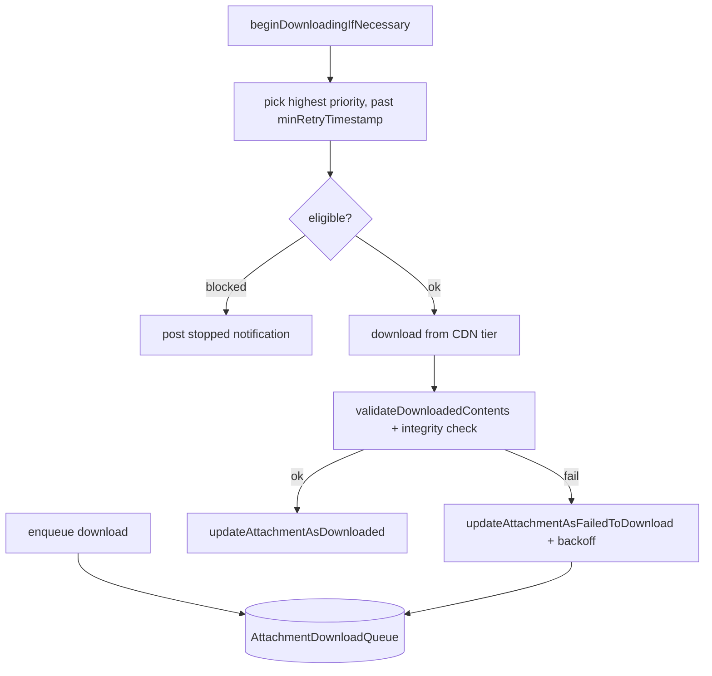

# Attachments — Downloads

Covers:

- `Messages/Attachments/V2/Downloads/AttachmentDownloadManager.swift`
- `Messages/Attachments/V2/Downloads/AttachmentDownloadManagerImpl.swift`
- `Messages/Attachments/V2/Downloads/AttachmentDownloadManagerMock.swift`
- `Messages/Attachments/V2/Downloads/AttachmentDownloadState.swift`
- `Messages/Attachments/V2/Downloads/AttachmentDownloadPriority.swift`
- `Messages/Attachments/V2/Downloads/AutoDownloadPolicy.swift`
- `Messages/Attachments/V2/Downloads/QueuedAttachmentDownloadRecord.swift`
- `Messages/Attachments/V2/Downloads/AttachmentDownloadStoreImpl.swift`
- `Messages/Attachments/V2/Downloads/Preferences/MediaBandwidthPreferenceStore.swift`
- Tests: `AttachmentDownloadStoreTests.swift`, `AttachmentDownloadQueueDBTests.swift`

Downloads are driven by a **persisted queue** (`AttachmentDownloadQueue` table). The manager pulls
eligible records (gated by priority, auto-download policy, call/message-request state, and network
state), downloads from the appropriate CDN tier, validates, and promotes the pointer to a stream.

---

## `AttachmentDownloads` namespace — `AttachmentDownloadManager.swift:7`

Confidence: HIGH (read in full).

- Notifications: `attachmentDownloadProgressNotification` (`:17`),
  `attachmentDownloadStoppedNotification` (`:21`); keys `attachmentDownloadProgressKey` (`:24`),
  `downloadProgressLabel` (`:27`), `attachmentDownloadAttachmentIDKey` (`:30`).
- `DownloadMetadata` (`:32`): `cdnNumber` + `Source`:
  - `.transitTier(cdnKey:)`
  - `.mediaTier(type:cdnReadCredential:mediaId:)` where `MediaTierType` is `.fullsize` / `.thumbnail`.
  - `asQueuedDownloadSource` maps to the queue record's `SourceType`.
- `Error` (`:66`): `expiredCredentials`, `blockedByActiveCall`, `blockedByPendingMessageRequest`,
  `blockedByAutoDownloadSettings`, `blockedByNetworkState`.
- `CdnInfo` (`:74`): `contentLength` + `lastModified`, parsed from `Content-Length` / `Last-Modified`
  response headers (throws if missing).

## `AttachmentDownloadManager` protocol — `:116`

| Method | Line | Purpose |
|--------|------|---------|
| `backupCdnInfo(metadata:)` | 118 | HEAD-style info for a backup. |
| `downloadBackup(metadata:progressBlock:)` | 122 | Download a backup file. |
| `downloadEncryptedTransientAttachment(...)` | 127 | Download a transient attachment, leaving it encrypted. |
| `downloadTransientAttachment(...)` | 132 | Download + decrypt a transient (non-persisted) attachment. |
| `enqueueDownloadOfAttachmentsForMessage(_:priority:useThumbnails:tx:)` | 138 | Enqueue all of a message's attachments. |
| `enqueueDownloadOfAttachmentsForStoryMessage(...)` | 145 | Same for a story. |
| `enqueueDownloadOfReferencedAttachment(...)` | 151 | Enqueue one referenced attachment (`throws(AttachmentDownloads.Error)`). |
| `downloadReferencedAttachment(...)` | 157 | Enqueue + await one referenced attachment. |
| `enqueueCopyOfLocalAttachment(id:tx:)` | 162 | "Download" by copying from a local source. |
| `downloadAttachment(id:priority:source:progress:)` | 174 | Download a specific attachment from a specific source. |
| `beginDownloadingIfNecessary()` | 180 | Kick the queue (respects the parallel-download cap). |
| `cancelDownload(for:tx:)` | 182 | Cancel a queued/active download. |
| `currentProgress(forAttachmentId:)` | 185 | `@MainActor` progress 0–1. |

Default-argument extensions (`:189`) provide `priority: .default` convenience overloads.

The `AttachmentDownloadManagerImpl.swift` (117 KB) contains the queue runner, retry/backoff
scheduling, credential refresh, and CDN interaction. Confidence: MEDIUM (not read line-by-line;
behavior inferred from the protocol, records, and policy types). `AttachmentDownloadManagerMock.swift`
is the test double (confidence: MEDIUM).

---

## State, priority, and the queue record

### `AttachmentDownloadState` — `AttachmentDownloadState.swift:9`
`none` / `enqueuedOrDownloading` / `failed`. **Scoped per source** (transit vs media may differ).
Confidence: HIGH.

### `AttachmentDownloadPriority` — `AttachmentDownloadPriority.swift:16`
`Int`-backed, persisted. Confidence: HIGH.
| Case | Value | Meaning |
|------|-------|---------|
| `backupRestore` | 20 | Lower than default (legacy raw `25` collapses here, `:51`). |
| `default` | 50 | Normal. |
| `userInitiated` | 100 | Bypasses call/message-request/auto-download gating. |
| `localClone` | 200 | Immediate "download" from a local source (sticker pack / downloaded quoted original); on failure re-enqueues at `default`. |

Priority determines ordering, whether to download during an active call, during a message-request
state, and whether to bypass auto-download settings (all require `userInitiated`+).

### `QueuedAttachmentDownloadRecord` — `QueuedAttachmentDownloadRecord.swift:9`
Table `AttachmentDownloadQueue` (`:109`). Confidence: HIGH.
- `attachmentId`, `priority`, `SourceType` (`:23`: `transitTier = 0`, `mediaTierFullsize = 1`,
  `mediaTierThumbnail = 2`).
- Retry/backoff: `minRetryTimestamp?` (don't attempt before this) + `retryAttempts` (`:49`/`:51`).
- `partialDownloadRelativeFilePath` (`:58`) — reserved; partial progress is **not** currently
  reused across launches (TODO at `:56`).
- `forNewDownload(ofAttachmentWithId:priority:sourceType:)` (`:69`) seeds a fresh record (nil retry
  timestamp, 0 attempts).

`AttachmentDownloadStoreImpl.swift` is the GRDB-backed queue store (enqueue, peek, mark
retry/complete). Confidence: MEDIUM (not read line-by-line).

---

## Auto-download policy & bandwidth

### `AutoDownloadPolicy` — `AutoDownloadPolicy.swift:8`
Confidence: HIGH.
- Cases: `.never`, `.preference(mediaType:)`, `.always`.
- `AttachmentContext` (`:12`): `avatar`/`body`/`link`/`reply`/`sticker`/`text`/`wallpaper`.
- Limits (`:21`): `alwaysLimit = 100 KB`, `neverLimit = 200 MB`.
- `build(context:mimeType:renderingFlag:plaintextSize:)` (`:30`): if estimated encrypted size >
  `neverLimit` → `.never`. Otherwise by context: avatar/link/reply/text/wallpaper → `.always`;
  body → per-MIME preference (`.photo`/`.video`/`.audio`/`.document`), with small voice messages
  (< `alwaysLimit`) → `.always`; sticker → `.always` if small, else `.photo` preference.
- `canAutoDownload(mediaType:preferenceStore:isReachableViaWiFi:tx:)` (`:72`): resolves a
  `MediaBandwidthPreferences.Preference` (`never` ⇒ false, `wifiOnly` ⇒ Wi-Fi only, `wifiAndCellular`
  ⇒ always).

### `MediaBandwidthPreferences` + store — `MediaBandwidthPreferenceStore.swift:7`
Confidence: HIGH.
- `Preference` (`:12`, persisted raw): `never = 0`, `wifiOnly = 1`, `wifiAndCellular = 2`.
- `MediaType` (`:20`): `photo`/`video`/`audio`/`document` with defaults — photo & audio
  `wifiAndCellular`, video & document `wifiOnly`.
- `MediaBandwidthPreferenceStore` reads/writes a `NewKeyValueStore` (collection
  `MediaBandwidthPreferences`); `set`/`resetPreferences` post
  `mediaBandwidthPreferencesDidChange` on the main thread.

Gating inputs (confidence: HIGH for the enumerated inputs; MEDIUM for exact runner ordering):
active call, pending message request, auto-download settings, network state, and per-source retry
backoff.
