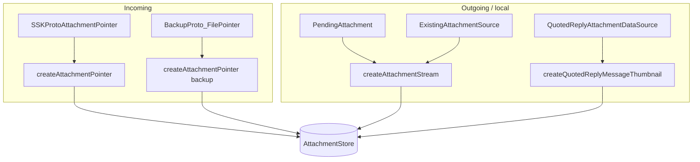

# Attachments — Manager & Data Sources

Covers:

- `Messages/Attachments/V2/AttachmentManager/AttachmentManager.swift`
- `Messages/Attachments/V2/AttachmentManager/AttachmentManagerImpl.swift`
- `Messages/Attachments/V2/AttachmentManager/OwnedAttachmentPointerProto.swift`
- `Messages/Attachments/V2/AttachmentManager/AttachmentManagerMock.swift`
- `Messages/Attachments/V2/DataSource/AttachmentDataSource.swift`
- `Messages/Attachments/V2/DataSource/QuotedReplyAttachmentDataSource.swift`

The **manager** is the high-level write API that creates `Attachment`s (and their owner
references) from either remote protos or local data sources, delegating persistence to
`AttachmentStore` and file bookkeeping to `OrphanedAttachmentCleaner`.

---

## `AttachmentManager` protocol — `AttachmentManager.swift:8`

Confidence: HIGH (read in full).

| Method | Line | Purpose / notes |
|--------|------|-----------------|
| `createAttachmentPointer(from ownedProto:tx:)` | 17 | Create pointer rows from an incoming `SSKProtoAttachmentPointer` (+owner edge). No dedupe until download. **Throws** on invalid protos. |
| `createAttachmentPointer(from ownedBackupProto:uploadEra:attachmentByteCounter:tx:)` | 41 | Create pointer rows from a backup `BackupProto_FilePointer`. Callers **must** roll back the transaction if an error is surfaced (partial state risk). |
| `createAttachmentStream(from ownedDataSource:tx:)` | 61 | Create (or content-dedupe) a stream from a local `PendingAttachment`/existing attachment; adds owner edge. |
| `updateAttachmentWithOversizeTextFromBackup(attachmentId:pendingAttachment:tx:)` | 72 | Fill a placeholder oversize-text attachment restored from backup; may dedupe. |
| `createQuotedReplyMessageThumbnail(from:owningMessageAttachmentBuilder:tx:)` | 86 | Create a quoted-reply thumbnail attachment. |

### Owned-input structs — `OwnedAttachmentPointerProto.swift`
Confidence: HIGH.
- `OwnedAttachmentPointerProto` (`:8`) = proto + `AttachmentReference.OwnerBuilder`.
- `OwnedAttachmentBackupPointerProto` (`:19`) = backup proto + `renderingFlag` + `clientUUID?` +
  owner; `owningMessageReceivedAtTimestamp` (`:44`) extracts the owner's timestamp (asserts that
  Stories never appear in backups).
- `OwnedAttachmentDataSource` (defined in `AttachmentDataSource.swift:90`) = data source + owner.

---

## `AttachmentManagerImpl` — `AttachmentManagerImpl.swift:6`

Confidence: HIGH (head + key paths read).
Dependencies include `AttachmentStore`, `AttachmentDownloadManager`,
`BackupAttachmentUploadScheduler`, `OrphanedAttachmentCleaner`/`OrphanedAttachmentStore`,
`OrphanedBackupAttachmentScheduler`, `RemoteConfigManager`, a `StickerManager` shim, and
`LocalFileBackupStore` (`:7`–`:16`).

- `createAttachmentPointer(from ownedProto:tx:)` (`:45`) sanitizes the oversize-text owner's MIME
  type before delegating to a private `_createAttachmentPointer` (`:59`). Confidence: MEDIUM
  (private helper not read in full).
- Validation / edge cases: proto creation throws for invalid protos; backup proto creation
  surfaces errors so callers abort the transaction (matching the protocol contract). Confidence:
  MEDIUM.

`AttachmentManagerMock.swift` provides a test double. Confidence: MEDIUM.

---

## Data sources

### `AttachmentDataSource` — `AttachmentDataSource.swift:8`
Confidence: HIGH. An enum describing where a *new* local attachment's bytes come from:
- `.existingAttachment(ExistingAttachmentSource)` (`:9`) — reuse an existing attachment's bytes
  (e.g. forwarding). Carries id, mimeType, rendering flag, source filename/size (`:12`).
- `.pendingAttachment(PendingAttachment)` (`:10`) — a freshly validated/encrypted file (see
  [ContentValidation.md](ContentValidation.md)).
- Convenience accessors `mimeType`/`sourceFilename`/`renderingFlag` (`:37`+),
  `forwarding(existingAttachment:with:)` (`:67`), and `removeBorderlessRenderingFlagIfPresent()`
  (`:80`, used when a borderless image is no longer rendered inline).
- `OwnedAttachmentDataSource` (`:90`) pairs a source with an `OwnerBuilder`.

### `QuotedReplyAttachmentDataSource` — `QuotedReplyAttachmentDataSource.swift:7`
Confidence: HIGH. Enum for quoted-reply thumbnails:
- `.pendingAttachment(PendingAttachmentSource)` — a new independent thumbnail created from the
  quoted message's attachment.
- `.originalAttachment(OriginalAttachmentSource)` — references the quoted message's attachment
  directly (carries an optional `thumbnailPointerFromSender`).
- `.notFoundLocallyAttachment(NotFoundLocallyAttachmentSource)` — the original wasn't found
  locally, so use the quote author's provided pointer proto.
- Accessors `originalAttachmentMimeType` / `originalAttachmentRenderingFlag` (`:21`/`:32`).

