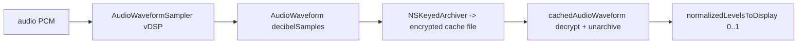
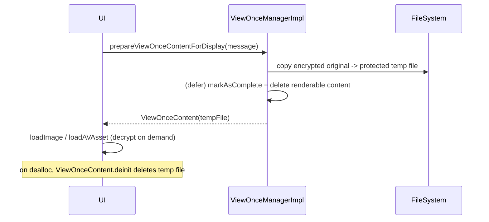

# Attachments — Thumbnails, Audio Waveforms, Playback, View-Once

Covers the media-rendering subfolders of `Messages/Attachments/V2/`:

- `Thumbnails/AttachmentThumbnailService.swift`, `AttachmentThumbnailServiceImpl.swift`,
  `AttachmentThumbnailQuality.swift`, `MockAttachmentThumbnailService.swift`
- `AudioWaveform/AudioWaveform.swift`, `AudioWaveformManager.swift`, `AudioWaveformSampler.swift`,
  `AudioWaveformManagerMock.swift`, `AudioWaveformSamplerTest.swift` (tests)
- `Playback/AVAsset+Attachment.swift`, `UIImage+Attachment.swift`, `SDAnimatedImage+Attachment.swift`
- `ViewOnce/AttachmentViewOnceManager.swift`, `AttachmentViewOnceManagerImpl.swift`,
  `ViewOnceContent.swift`, `AttachmentViewOnceManagerMock.swift`

A common theme: attachment files on disk are **always encrypted**. Rendering paths decrypt
on-the-fly (streaming where possible) using the attachment's `encryptionKey`, and rely on the fact
that integrity was already verified at download time (so most reads use
`Cryptography.decryptFileWithoutValidating`).

---

## Thumbnails

### `AttachmentThumbnailService` — `AttachmentThumbnailService.swift:8`
Confidence: HIGH. `thumbnailImage(for:quality:)` (async), `thumbnailImageSync(for:quality:)`, and
`backupThumbnailData(image:)`.

### `AttachmentThumbnailQuality` — `AttachmentThumbnailQuality.swift:8`
Confidence: HIGH. Cases `small`/`medium`/`mediumLarge`/`large`/`backupThumbnail`.
- Point dimensions (`:46`): small **200**, medium **450**, mediumLarge **600**, large = larger
  screen axis, backupThumbnail = `256px / displayScale`.
- `thumbnailDimensionPointsForQuotedReply` == small (`:51`).
- Backup thumbnail constants (`:62`): `backupThumbnailDimensionPixels = 256`,
  `backupThumbnailMinPixelSize = 64`, `backupThumbnailMaxSizeBytes = 8192`,
  `backupThumbnailMinSizeBytes = 2048`.
- `thumbnailCacheFileUrl(...)` (`:84`) → `caches/<attachmentFile>_<quality>` (losing the cache on a
  description change is acceptable).

### `AttachmentThumbnailServiceImpl` — `AttachmentThumbnailServiceImpl.swift:11`
Confidence: HIGH (head). A `ConcurrentTaskQueue(concurrentLimit: 1)` serializes generation (`:22`).
`thumbnailSpec` short-circuits into: `cannotGenerate`, `originalFits(image)` (no resize needed), or
`requiresGeneration`. Generation decrypts via `UIImage.fromEncryptedFile` then
`resized(maxDimensionPoints:)`, and caches to the caches directory. Confidence: MEDIUM for the
caching helpers beyond the head.

`MockAttachmentThumbnailService.swift` is the test double.

---

## Audio waveforms

### `AudioWaveform` — `AudioWaveform.swift:9`
Confidence: HIGH. Holds `decibelSamples: [Float]`.
- Archiving: `init(archivedData:)` / `archive()` via `NSKeyedArchiver` (secure coding);
  `write(toFile:atomically:)` (`:36`).
- `normalizedLevelsToDisplay(sampleCount:)` (`:44`) normalizes dB into 0–1 between
  `silenceThreshold = -50` and `clippingThreshold = -20` (`:120`/`:121`), downsampling with
  `vDSP_desamp` if there are more samples than requested.
- `sampleCount = 100` (`:134`) caps per-file memory/disk use.

### `AudioWaveformSampler` — `AudioWaveformSampler.swift:7`
Confidence: HIGH. Streams Int16 PCM through `vDSP` to produce exactly `outputCount` averaged
decibel samples, spreading the remainder across segments. Converts to dB (`vDSP_vdbcon`), clips to
`[silenceThreshold, 0]`, and reduces per-segment. Robust to files that under-report their sample
count (short-circuits once complete).

### `AudioWaveformManager` — `AudioWaveformManager.swift:9`
Confidence: HIGH (protocol + head).
- `cachedAudioWaveform(attachmentStream:)` (`:11`) → a `Task` that throws for non-audio content,
  returns an error if no cached waveform path exists (we don't recompute on read), else decrypts
  the cached waveform file (`decryptFileWithoutValidating`) and unarchives it.
- `computeAndCacheAudioWaveform(audioPath:cacheWaveformToPath:)` (`:15`),
  `computeAudioWaveform(audioFilePath:)` (`:21`), and the encrypted variant
  `computeAudioWaveform(encryptedAudioFilePath:attachmentKey:plaintextDataLength:mimeType:)` (`:25`).

---

## Playback (encrypted-file decryption)

Confidence: HIGH (heads read).
- `AVAsset+Attachment.swift:9`: `AVAsset.from(_ stream)` / `fromEncryptedFile(...)` build an
  `AVAsset` backed by `Cryptography.encryptedAttachmentFileHandle` + an
  `EncryptedFileResourceLoader` (streaming decryption, so the whole file need not be in memory). If
  the MIME type has an alternative audio type and the first attempt isn't readable, it retries with
  the override (`:34`).
- `UIImage+Attachment.swift:9`: `UIImage.from(_ stream)` / `from(_ backupThumbnail)` /
  `fromEncryptedFile(...)`. JPEG and PNG use a `CGDataProvider` over the encrypted file so UIKit can
  avoid loading everything into memory where possible; other formats fall back to full decrypt. If
  no `plaintextLength` is given, the file is assumed to use only PKCS7 padding.
- `SDAnimatedImage+Attachment.swift:7`: `SDAnimatedImage.sdImage(from:)` loads
  `decryptedRawData()` fully (YYImage's file initializer would also load it all into memory).

---

## View-once

View-once media is shown exactly once; the design guarantees the original is deleted even on crash.

### `AttachmentViewOnceManager` — `AttachmentViewOnceManager.swift:8`
Confidence: HIGH. `prepareViewOnceContentForDisplay(_ message:)` returns displayable
`ViewOnceContent?` after (1) copying contents to a temp file and (2) deleting the original.

### `AttachmentViewOnceManagerImpl` — `AttachmentViewOnceManagerImpl.swift:9`
Confidence: HIGH (read in full). Key behaviors:
- Requires an inserted message with a row id; re-fetches the message under a read tx.
- A `defer` block **always** marks the message complete (`ViewOnceMessages.markAsComplete`,
  `sendSyncMessages: true`), even on malformed input or file errors (`:47`).
- Determines content type: image → still vs animated (via `imageMetadata().isAnimated`), video →
  `loopingVideo` if the rendering flag is `shouldLoop` else `video`; file/audio are rejected.
- The "file-system dance" (`:95`+): copy the encrypted original to a protected temp file, so that if
  the app dies mid-flow either (a) nothing happened and the user can retry, or (b) the temp file is
  cleaned up like any other temp file.

### `ViewOnceContent` — `ViewOnceContent.swift:17`
Confidence: HIGH. Holds the temp file URL + decryption metadata.
- `ContentType` (`:19`): `stillImage`/`animatedImage`/`video`/`loopingVideo`.
- `loadImage()` / `loadYYImage()` / `loadAVAsset()` (`:60`/`:68`/`:85`) decrypt on demand.
- `deinit` (`:52`) deletes the temp file on a background queue.

