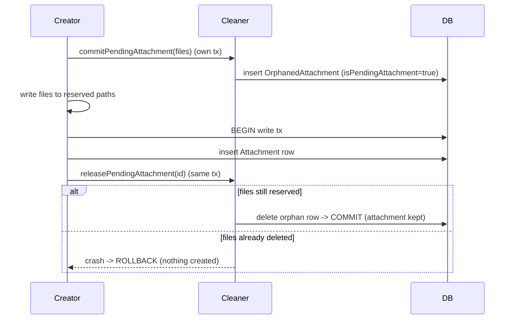

# Attachments — Orphaned File Cleanup

Covers:

- `Messages/Attachments/V2/OrphanedAttachments/OrphanedAttachmentCleaner.swift`
- `Messages/Attachments/V2/OrphanedAttachments/OrphanedAttachmentStore.swift`
- `Messages/Attachments/V2/OrphanedAttachments/OrphanedAttachmentCleanerTest.swift` (tests)
- `Messages/Attachments/V2/Records/OrphanedAttachmentRecord.swift`

Attachment **files** live on disk independently of their database rows. When an `Attachment` row
is deleted (or when attachment creation fails), the associated files must be cleaned up. This is
handled by inserting an `OrphanedAttachmentRecord` and letting a background observer delete the
files, then the row.

---

## `OrphanedAttachmentRecord` — `OrphanedAttachmentRecord.swift:11`

Confidence: HIGH. Table `OrphanedAttachment` (`:52`).
- `id`, `isPendingAttachment` (`:19`: files are for an as-yet-uncreated attachment — give creation
  a chance before deleting), and the four file paths: primary, thumbnail, audio waveform, video
  still frame, plus `timestamp`.
- `InsertableRecord` (`:44`) + `insertRecord(_:tx:)` (`:60`) which `INSERT ... RETURNING *`.

## `OrphanedAttachmentStore` — `OrphanedAttachmentStore.swift:10`

Confidence: HIGH. `orphanAttachmentExists(with:tx:)` (`:13`) checks whether a given orphan row still
exists (used to decide whether a pending attachment's files are still reserved).

## `OrphanedAttachmentCleaner` — `OrphanedAttachmentCleaner.swift:9`

Confidence: HIGH (protocol read in full). Observes inserts to the `OrphanedAttachment` table and
deletes the associated files, then removes the row.
- `beginObserving()` (`:19`) — call on every launch; also sweeps pre-existing rows.
- `runUntilFinished()` (`:21`) — drive to completion (tests / explicit flush).
- `commitPendingAttachment(_:)` (`:30`) / `commitPendingAttachments(_:)` (`:36`) — **reserve** files
  for deletion before they are written, committing in their own write transaction so the files can
  then be safely created at the reserved paths. Returns the orphan row id(s).
- `releasePendingAttachment(withId:tx:)` (`:60`) — un-mark files for deletion once the attachment
  row is created.

### The crash-safe pending-attachment invariant

The ordering (`OrphanedAttachmentCleaner.swift:43`–`:63` doc comment) guarantees file/row
consistency even across crashes:

1. Reserve file locations (random UUID paths).
2. `commitPendingAttachment` — mark them for deletion (own write tx).
3. Write files to the reserved locations.
4. Open a write transaction.
5. Create the `Attachment` row.
6. `releasePendingAttachment` — un-mark for deletion.
7. Commit.

If files are deleted between (2) and (4), step (6) **crashes**, rolling back the (4)/(5)
transaction. Thus you can never end up with "row created but files already deleted" or "files kept
but row never created". Confidence: HIGH (explicitly documented in source).

### Deletion path (row-triggered)

`OrphanedAttachmentCleanerImpl` (`OrphanedAttachmentCleaner.swift:66`) implements the GRDB
observation + file deletion. Confidence: MEDIUM for impl internals (head read; the invariant and
protocol are HIGH). `OrphanedAttachmentCleanerTest.swift` covers the invariant and sweep behavior
(confidence: MEDIUM, test file).
