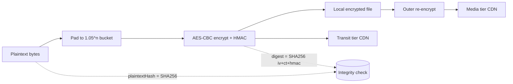
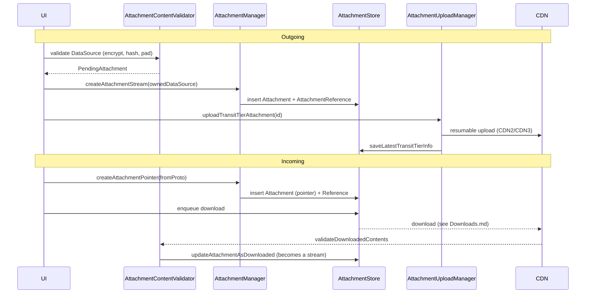

# Attachments

The attachment subsystem stores, validates, encrypts, uploads, and downloads files that are
attached to messages, stories, threads (wallpapers), stickers, quoted replies, link previews,
and contact avatars.

The current ("V2") design models three independent concepts:

- **`Attachment`** — the file itself: its bytes on local disk and/or pointers to copies on a CDN.
  A single `Attachment` is content-addressed and may be shared by many owners.
- **`AttachmentReference`** — an *edge* from an owner (a message, story, thread, …) to an
  `Attachment`. The same `Attachment` can have many references.
- **Tiers** — where an attachment's bytes live remotely:
  - **Transit tier** — the ephemeral CDN used for live message delivery.
  - **Media tier** — the long-lived CDN used for backups.
  - **Local stream** — the downloaded, encrypted file on disk.

## Documents in this folder

| Doc | Covers | Source dirs |
|-----|--------|-------------|
| [Core.md](Core.md) | Padding, limits, media utils, blurhash | `Attachments/`, `Messages/Attachments/` |
| [V2-Model.md](V2-Model.md) | `Attachment`, pointers, stream, references, content types | `Messages/Attachments/V2/` (top-level + `AttachmentReference/`) |
| [Store-and-Records.md](Store-and-Records.md) | `AttachmentStore`, GRDB records, upload record store | `.../V2/AttachmentStore/`, `.../V2/Records/` |
| [Manager.md](Manager.md) | `AttachmentManager`, data sources | `.../V2/AttachmentManager/`, `.../V2/DataSource/`, `.../V2/QuotedMessageAttachment/` |
| [ContentValidation.md](ContentValidation.md) | Validation + encryption, re-validation backfill | `.../V2/ContentValidation/` |
| [Downloads.md](Downloads.md) | Download queue, priority, auto-download policy, bandwidth prefs | `.../V2/Downloads/` |
| [Upload.md](Upload.md) | Upload state machine, CDN0/2/3 endpoints, shims | `Upload/` |
| [Media.md](Media.md) | Thumbnails, audio waveforms, playback decryption, view-once | `.../V2/{Thumbnails,AudioWaveform,Playback,ViewOnce}/` |
| [OrphanedAttachments.md](OrphanedAttachments.md) | Orphan file cleanup, pending-attachment invariant | `.../V2/OrphanedAttachments/`, `.../V2/Records/OrphanedAttachmentRecord.swift` |
| [Backfill.md](Backfill.md) | Attachment backfill sync between linked devices | `AttachmentBackfill/` |

## Encryption model (overview)

Attachments are always stored and transmitted encrypted. The scheme is AES-CBC + HMAC-SHA256
over `iv + ciphertext + hmac`, with a per-attachment `encryptionKey` (really `encryptionKey + hmacKey`
combined, see `AttachmentKey`).

- The **local file**, the **transit-tier** copy, and the **media-tier** copy may each use a
  different key: the transit key can be rotated for re-sending/forwarding, and the media tier
  adds an *outer* layer of encryption on top of the inner (transit-equivalent) encryption.
  Confidence: HIGH — `Attachment.swift` `TransitTierInfo.encryptionKey` doc comment
  (`Messages/Attachments/V2/Attachment.swift:190`) and the double-decrypt note in
  `AttachmentContentValidator.validateBackupMediaFileContents`
  (`.../V2/ContentValidation/AttachmentContentValidator.swift`).
- Plaintext is padded to a bucket (power of `1.05`) before encryption to obfuscate size on the
  wire. See [Core.md § PaddingBucket](Core.md#paddingbucket).
- Integrity is checked at download time via either the **ciphertext digest**
  (`SHA256(iv + ciphertext + hmac)`) or the **plaintext hash** (`SHA256(plaintext)`); see
  `AttachmentIntegrityCheck` in [ContentValidation.md](ContentValidation.md).

## End-to-end lifecycle

