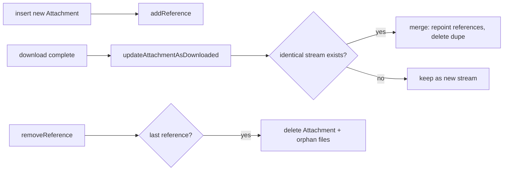

# Attachments — Store & Records

Covers:

- `Messages/Attachments/V2/AttachmentStore/AttachmentStore.swift`
- `Messages/Attachments/V2/AttachmentStore/AttachmentUploadStore.swift`
- `Messages/Attachments/V2/AttachmentStore/AttachmentStoreTests.swift` (tests)
- `Messages/Attachments/V2/Records/AttachmentRecord.swift`
- `Messages/Attachments/V2/Records/AttachmentReference+Records.swift`
- `Messages/Attachments/V2/Records/AttachmentReference+ConstructionParams.swift`
- `Messages/Attachments/V2/Records/OrphanedAttachmentRecord.swift` (see
  [OrphanedAttachments.md](OrphanedAttachments.md))
- `Upload/AttachmentUploadRecord.swift` (see also [Upload.md](Upload.md))

---

## AttachmentStore — `AttachmentStore.swift:17`

> Note: despite the name, `AttachmentStore` is a **`public class`**, not a protocol
> (`AttachmentStore.swift:17`). Confidence: HIGH.

The persistence gateway for `Attachment` rows and `AttachmentReference` edges. It owns reads,
writes, reference bookkeeping, and the content-addressed merge logic. `AttachmentInsertError`
(`:8`) is thrown on insert conflicts.

Public API grouped by purpose (all citations `AttachmentStore.swift`, confidence: HIGH — line
list extracted from source):

### Reads
| Method | Line | Purpose |
|--------|------|---------|
| `fetchMaxRowId(tx:)` | 27 | Highest attachment row id (iteration bounds). |
| `fetchAnyReference(...)` | 46 | One reference for an owner. |
| `fetchReferences(...)` (×2) | 54, 62 | References for owner(s). |
| `fetch(...)` (×2) | 156, 163 | Fetch `Attachment`(s) by id. |
| `fetchAttachmentRecord(...)` | 179 | Raw GRDB record. |
| `fetchAnyReferencedAttachment(...)` | 199 | `ReferencedAttachment` for an owner. |
| `fetchReferencedAttachments(...)` (×2) | 213, 220 | Bulk referenced attachments. |
| `fetchUpdatedReferencedAttachment(...)` | 228 | Re-fetch after update. |
| `fetchReferencedAttachmentsOwnedByMessage(...)` | 250 | All of a message's attachments. |
| `fetchReferencedAttachmentsOwnedByStory(...)` | 286 | All of a story's attachments. |
| `allQuotedReplyAttachments(...)` | 322 | Quoted-reply thumbnails. |
| `quotedAttachmentReference(...)` | 334 | Quoted reference lookup. |
| `attachmentToUseInQuote(...)` | 366 | Pick source attachment for a new quote. |
| `sumEncryptedByteCount(stopAfter:tx:)` | 391 | Running size total (early-out). |
| `enumerateAllReferences(...)` | 418 | Iterate every reference. |
| `oldestStickerPackReferences(...)` | 484 | Sticker GC support. |
| `allAttachmentIdsForSticker(...)` | 518 | Sticker lookups. |

### Writes — references & owners
| Method | Line | Purpose |
|--------|------|---------|
| `cloneMessageOwnerForNewPastEditRevision(...)` | 546 | Duplicate refs when a message is edited. |
| `cloneThreadOwner(...)` | 567 | Copy thread wallpaper ownership. |
| `removeAllThreadOwners(tx:)` | 585 | Clear thread-wallpaper refs. |
| `updateReceivedAtTimestamp(...)` | 594 | Keep denormalized timestamp in sync. |
| `addReference(...)` | 936 | Add an owner → attachment edge. |
| `removeReference(...)` | 992 | Remove an edge (may orphan the attachment). |
| `insert(...)` | 1072 | Insert a new attachment (+reference). |
| `updateMessageAttachmentThreadRowIdsForThreadMerge(...)` | 1192 | Fix denormalized thread ids on merge. |

### Writes — tier info & download/upload state
| Method | Line | Purpose |
|--------|------|---------|
| `updateLocalFileBackupAttachmentAsTransferred(...)` | 620 | Mark local-file-backup copied. |
| `updateAttachmentAsDownloaded(...)` | 640 | Promote a pointer to a stream after download. |
| `merge(...)` | 729 | Content-addressed dedupe: merge a new stream into an existing identical one. |
| `updateAttachmentAsFailedToDownload(...)` | 759 | Record a failed download attempt. |
| `saveLatestTransitTierInfo(...)` | 796 | Persist a transit upload result. |
| `saveMediaTierInfo(...)` | 834 | Persist a media (backup) upload result. |
| `removeTransitTierInfo(...)` | 862 | Drop stale transit info. |
| `removeMediaTierInfo(...)` | 881 | Drop media info. |
| `removeThumbnailMediaTierInfo(...)` | 893 | Drop thumbnail media info. |
| `updateRevalidatedAttachment(...)` | 908 | Apply re-validation results (see ContentValidation). |
| `markOffloaded(...)` | 1153 | Mark fullsize bytes offloaded (kept on media tier only). |
| `markViewedFullscreen(...)` | 1173 | Update `lastFullscreenViewTimestamp`. |

---

## AttachmentUploadStore — `AttachmentUploadStore.swift:9`

A thin GRDB wrapper over `AttachmentUploadRecord` (confidence: HIGH):
- `upsert(record:tx:)` (`:12`) — save/replace an in-flight upload's form, metadata, session URL,
  attempt counter.
- `removeRecord(for:sourceType:tx:)` (`:26`) — clear on success/abandon.
- `fetchAttachmentUploadRecord(for:sourceType:tx:)` (`:40`) — resume support.

---

## Records (GRDB)

### `Attachment.Record` — `AttachmentRecord.swift:9`
`Codable, MutablePersistableRecord, FetchableRecord, Equatable`. Confidence: HIGH.
- Mirrors every `Attachment` field as a column: `plaintextHash`, encrypted/unencrypted byte
  counts, `mimeType`, `contentType` (nullable column but always non-NULL in practice),
  `encryptionKey`, `ciphertextDigest`.
- Transit columns in two sets — `latestTransit*` (cdn number/key/upload timestamp/encryption
  key/byte count/ciphertext digest/last download attempt) and `originalTransit*`.
- Media-tier columns (`mediaTierCdnNumber`, `mediaTierUnencryptedByteCount`, `mediaTierUploadEra`,
  `lastMediaTierDownloadAttemptTimestamp`) and thumbnail columns (`thumbnailCdnNumber`,
  `thumbnailUploadEra`, `lastThumbnailDownloadAttemptTimestamp`).
- Local file paths + cached media metadata (duration/pixel size/still frame/waveform).
- `_mediaName` (`:33`) is **deprecated and always NULL** — `mediaName` is computed in-memory
  (see [V2-Model.md](V2-Model.md#medianameplaintexthashencryptionkey--402)).
- `@DBUInt64Optional` wrappers store `UInt64` timestamps safely in SQLite.

### `AttachmentReference.MessageAttachmentReferenceRecord` — `AttachmentReference+Records.swift:9`
Confidence: HIGH.
- `OwnerType` enum (`:10`, persisted): `bodyAttachment = 0`, `oversizeText = 1`, `linkPreview = 2`,
  `quotedReplyAttachment = 3`, `sticker = 4`, `contactAvatar = 5`.
- Columns include `ownerRowId`, `attachmentRowId`, denormalized `contentType`/`mimeType`,
  `renderingFlag`, `idInMessage`, `orderInMessage`, `threadRowId`, `caption`, source
  filename/size, sticker pack/id, `isViewOnce`, `ownerIsPastEditRevision`.
- Sibling record types exist for story and thread owners (used by the three `AttachmentReference`
  inits).

### `AttachmentReference.OwnerBuilder` + ConstructionParams — `AttachmentReference+ConstructionParams.swift:20`
Confidence: HIGH (enum shape read).
`OwnerBuilder` (`:20`) specifies *which kind* of owner to create, separately from the data source
proto/stream. Cases mirror `Owner.ID`: `messageBodyAttachment`, `messageOversizeText`,
`messageLinkPreview`, `quotedReplyAttachment`, `messageSticker`, `messageContactAvatar`,
`storyMessageMedia`, `storyMessageLinkPreview`, `threadWallpaperImage`,
`globalThreadWallpaperImage`. Nested builders carry per-type construction fields (e.g.
`KnownIdInOwner` for message body attachments).

### Tests
`AttachmentStoreTests.swift` exercises reference bookkeeping, merge/dedupe, and insert error
paths. Confidence: MEDIUM (test file; not read line-by-line).
