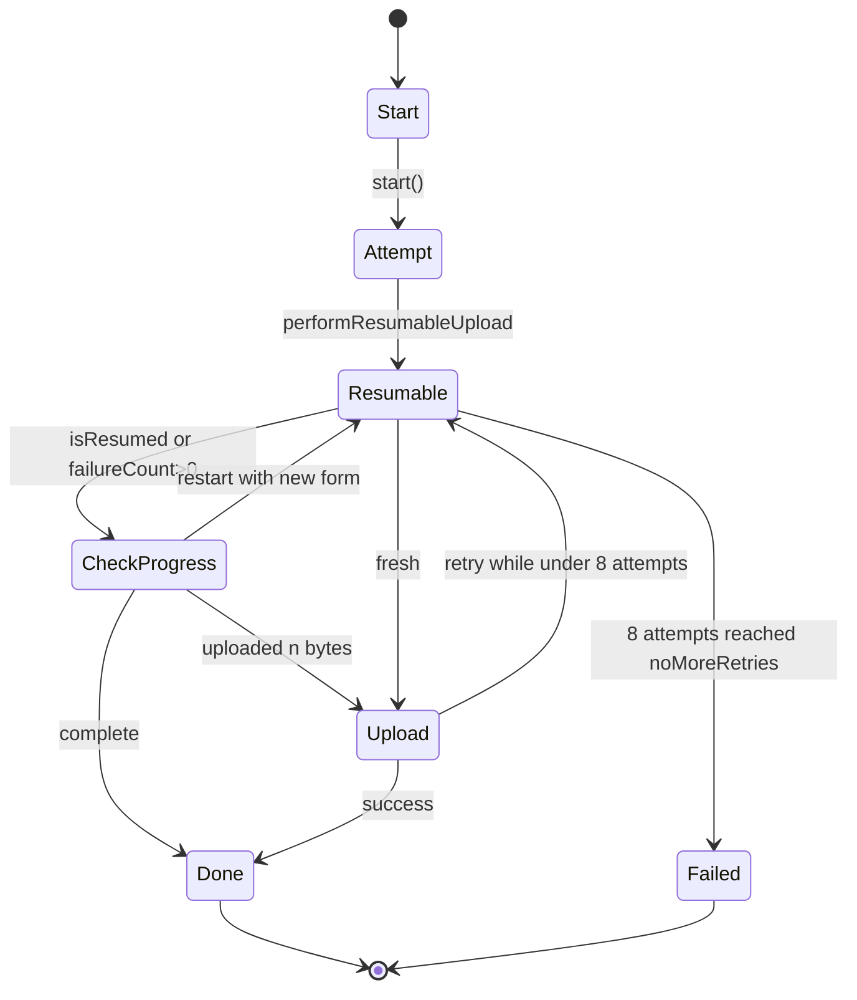
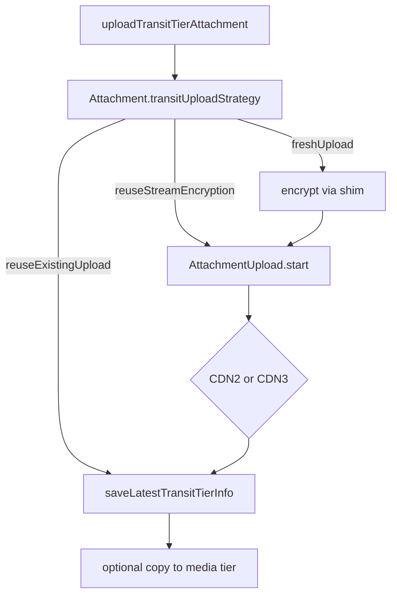

# Attachments — Upload Pipeline & CDN

Covers `SignalServiceKit/Upload/`:

- `Upload.swift` — the `Upload` namespace (constants, metadata, state enums, `Attempt`/`Result`).
- `UploadMetadata.swift` — metadata protocols.
- `UploadEndpoint.swift` — the endpoint protocol.
- `UploadEndpointCDN2.swift` — Google Cloud Storage XML resumable uploads.
- `UploadEndpointCDN3.swift` — TUS resumable upload protocol.
- `UploadV2.swift` — CDN0 (AWS S3) multipart form uploads (avatars).
- `UploadShims.swift` — testable seams (encrypter / filesystem / sleep timer).
- `AttachmentUpload.swift` — the retriable upload state machine.
- `AttachmentUploadManager.swift` — the high-level attachment upload API.
- `AttachmentUploadRecord.swift` — persisted in-flight upload state (see
  [Store-and-Records.md](Store-and-Records.md)).

---

## `Upload` namespace — `Upload.swift:7`

Confidence: HIGH (read in full).

- `uploadQueue` (`:8`): a `ConcurrentTaskQueue` limited to **2** concurrent uploads in the NSE,
  **12** otherwise.
- `Constants` (`:10`): `uploadReuseWindow = 3 days` (reuse an existing transit upload for
  resending), `uploadFormReuseWindow = 6 days` (reuse an upload *form*), `maxUploadAttempts = 5`.
- `FormSource` (`:25`): `.remote` or `.local(Form)`.
- `Form` (`:30`): the server-issued upload form (`headers`, `signedUploadLocation`, `cdnKey`,
  `cdnNumber`).
- `FailureMode` (`:46`): `noMoreRetries`, `resume(RetryMode)`, `restart(RetryMode)` where
  `RetryMode` (`:47`) is `afterServerRequestedDelay(TimeInterval)` (honor Retry-After) or
  `afterBackoff` (internal exponential backoff).
- `ResumeProgress` (`:67`): `restart` / `complete` / `uploaded(UInt64 bytes)`.
- `Error` (`:81`): `invalidUploadURL`, `networkError`, `networkTimeout`,
  `uploadFailure(recovery: FailureMode)`, `partialUpload(bytesUploaded:)`, `unsupportedEndpoint`,
  `unexpectedResponseStatusCode(Int)`, `missingFile`, `unknown`.
- Metadata structs:
  - `EncryptedBackupUploadMetadata` (`:109`) — backup export file, digest, sizes, SVRB nonce.
  - `LocalUploadMetadata` (`:142`) — local encrypted file + key + digest + lengths
    (`isReusedTransitTierUpload == false`). `validateAndBuild(fileUrl:metadata:)` (`:300`) enforces
    non-zero `UInt32` lengths.
  - `LinkNSyncUploadMetadata` (`:159`) — transient link'n'sync backup.
  - `ReusedUploadMetadata` (`:168`) — reuse an existing transit upload
    (`isReusedTransitTierUpload == true`).
- `Result<Metadata>` (`:189`) / `AttachmentResult` (`:200`) — final cdn key/number + timestamps.
- `Attempt<Metadata>` (`:212`) — per-attempt state (file URL, length, endpoint, upload location,
  `isResumedUpload`, logger).
- `UploadEndpoint.readUploadFileChunk(...)` extension (`:325`) memory-maps the file and returns the
  next chunk + whether it was truncated; throws `.missingFile` if absent.

## Metadata protocols — `UploadMetadata.swift:8`
Confidence: HIGH. `UploadMetadata` (just `encryptedDataLength`) → `ValidatedUploadMetadata` (adds
`digest`, `plaintextDataLength`) → `AttachmentUploadMetadata` (adds `key` and
`isReusedTransitTierUpload`).

---

## Endpoints

### `UploadEndpoint` protocol — `UploadEndpoint.swift:8`
Confidence: HIGH. Three operations:
- `fetchResumableUploadLocation()` → target URL.
- `getResumableUploadProgress(attempt:)` → `Upload.ResumeProgress` (how many bytes the server has).
- `performUpload(startPoint:attempt:progressBlock:)` → upload (fresh or resumed), `throws(Upload.Error)`.

### `UploadEndpointCDN2` — `UploadEndpointCDN2.swift:8`
Confidence: HIGH (head). Implements Google Cloud Storage **XML API** resumable uploads.
`fetchResumableUploadLocation()` (`:33`) POSTs to the `signedUploadLocation` (validates `http`
prefix, strips the `Host` header, sets `Content-Length: 0`) to obtain a session URL;
`maxUploadLocationRetries = 2` (`:11`).

### `UploadEndpointCDN3` — `UploadEndpointCDN3.swift:10`
Confidence: HIGH (head). Implements the **TUS** resumable upload protocol (`Tus-Resumable: 1.0.0`).
`getResumableUploadProgress` (`:38`) issues a HEAD; HTTP `404/410/403` are treated as
`.uploaded(0)` (start fresh). Uses an integrity header `x-signal-checksum-sha256`
(`Constants.checksumHeaderKey`, `:13`).

### `UploadV2` / CDN0 — `UploadV2.swift:7`
Confidence: HIGH. `Upload.CDN0.Form` is parsed from `GroupsProtoAvatarUploadAttributes`
(`parse(proto:)`, `:28`). `Upload.CDN0.upload(data:uploadForm:)` (`:55`) performs an AWS S3
multipart POST; the form fields are emitted in a **specific order** (`key` first) because S3 is
order-sensitive (`:116`). Checks app expiry first. Used for avatar-style uploads.

---

## Shims — `UploadShims.swift:9`
Confidence: HIGH. Testable seams: `AttachmentEncrypter` (`encryptAttachment`/`decryptAttachment`
via `Cryptography`), `FileSystem` (`maxFileChunkSizeBytes()` returns **31 MiB** to stay under the
~32 MiB external limit, `:84`; memory-mapped reads), `SleepTimer`.

---

## `AttachmentUpload` state machine — `AttachmentUpload.swift:14`

Confidence: HIGH (head read). The CDN2/CDN3 upload engine, agnostic of the source once given an
`Attempt`.
- Local constants: `uploadMaxRetries = 8` (`:9`), `maxUploadProgressRetries = 2` (`:10`).
- `start(attempt:dateProvider:sleepTimer:progressBlock:)` (`:20`) → `attemptUpload` →
  `performResumableUpload`.
- `attemptUpload` (`:46`) runs the resumable upload and builds a `Upload.Result`.
- `getResumableUploadProgress(forAttempt:)` (`:70`) retries with backoff up to
  `maxUploadProgressRetries + 1` on network failure/timeout.
- `performResumableUpload(...)` (`:81`): throws `.uploadFailure(.noMoreRetries)` once
  `failureCount >= uploadMaxRetries`; otherwise consults the endpoint for already-uploaded bytes
  (unless resuming at a known offset) and uploads the remainder. `.complete` short-circuits.

---

## `AttachmentUploadManager` — `AttachmentUploadManager.swift:8`

Confidence: HIGH (protocol read in full; impl head read).

| Method | Line | Purpose |
|--------|------|---------|
| `uploadBackup(localUploadMetadata:form:progressBlock:)` | 10 | Upload a transient backup file (not an attachment). |
| `uploadTransientAttachment(dataSource:)` | 16 | Upload a transient (unsaved, unsent) attachment. |
| `uploadLinkNSyncAttachment(dataSource:progressBlock:)` | 22 | Upload a transient link'n'sync file. |
| `uploadTransitTierAttachment(attachmentId:)` | 29 | Upload a stored attachment to the transit tier (fails if not local). |
| `uploadMediaTierAttachment(attachmentId:uploadEra:localAci:backupKey:auth:progressBlock:)` | 36 | Upload to the media tier (uploads to transit if needed, then copies to media). |
| `uploadMediaTierThumbnailAttachment(...)` | 46 | Same for the backup thumbnail. |
| `currentProgress(forAttachmentId:)` | 55 | `@MainActor` progress. |

`AttachmentUploadManagerImpl` (`:59`) wires `AttachmentStore`, `AttachmentUploadStore`,
`AttachmentThumbnailService`, `BackupRequestManager`, the upload shims, `dateProvider`, etc. It
chooses the strategy via `Attachment.transitUploadStrategy` (reuse / reuse-stream-encryption /
fresh), encrypts via the shim when needed, drives `AttachmentUpload.start`, and persists results
through `AttachmentStore.saveLatestTransitTierInfo` / `saveMediaTierInfo`. In-flight state (form,
session URL, attempt counter) lives in `AttachmentUploadRecord` via `AttachmentUploadStore`.
Confidence: MEDIUM for the exact impl orchestration (51 KB file not read line-by-line); HIGH for
the public contract and the dependencies.

### `AttachmentUploadRecord` — `AttachmentUploadRecord.swift:9`
Confidence: HIGH. Table `AttachmentUploadRecord`; `SourceType` = `transit` / `media` / `thumbnail`
(`:11`); stores `uploadForm` + `uploadFormTimestamp` (for the 6-day form-reuse window),
`localMetadata`, `uploadSessionUrl`, and `attempt`.

