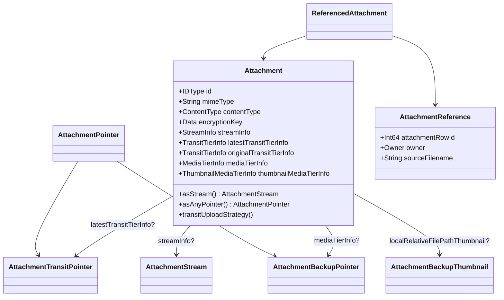

# Attachments — V2 Model

The core data model. Covers:

- `Messages/Attachments/V2/Attachment.swift`
- `Messages/Attachments/V2/Attachment+ContentType.swift`
- `Messages/Attachments/V2/AttachmentStream.swift`
- `Messages/Attachments/V2/AttachmentPointer.swift`
- `Messages/Attachments/V2/AttachmentTransitPointer.swift`
- `Messages/Attachments/V2/AttachmentBackupPointer.swift`
- `Messages/Attachments/V2/AttachmentBackupThumbnail.swift`
- `Messages/Attachments/V2/AttachmentReference/AttachmentReference.swift`
- `Messages/Attachments/V2/AttachmentReference/AttachmentReference+Owner.swift`
- `Messages/Attachments/V2/AttachmentReference/AttachmentReference+RenderingFlag.swift`
- `Messages/Attachments/V2/AttachmentReference/ReferencedAttachment.swift`
- `Messages/Attachments/V2/QuotedMessageAttachment/QuotedMessageAttachmentReference.swift`
- Mocks: `Messages/Attachments/V2/Mocks/MockAttachment.swift`,
  `Messages/Attachments/V2/Mocks/MockAttachmentReference.swift`

> `AttachmentReference+Records.swift` and `AttachmentReference+ConstructionParams.swift` are
> covered in [Store-and-Records.md](Store-and-Records.md).

---

## `Attachment` — `Attachment.swift:10`

The file itself. Confidence: HIGH (read in full).

Key stored properties:
- `id: IDType` (= `Int64`) (`:12`/`:15`).
- `blurHash` (`:20`), `mimeType` (`:26`, **sender-provided & spoofable** until downloaded),
  `contentType` (`:29`, reduction of mimeType).
- `encryptionKey` (`:36`) — used for the local file **and** media tier.
- `streamInfo: StreamInfo?` (`:38`) — present iff downloaded locally.
- `latestTransitTierInfo` (`:43`) / `originalTransitTierInfo` (`:48`) — the latest upload (any key)
  vs. an upload using the local encryption key.
- `originalAttachmentIdForQuotedReply` (`:57`) — for quoted-reply thumbnails that source bytes
  from the quoted message's attachment instead of a transit upload.
- `plaintextHash` (`:61`), computed `mediaName` (`:65`) = `hex(plaintextHash + encryptionKey)`.
- `mediaTierInfo` / `thumbnailMediaTierInfo` (`:72`/`:77`), `localRelativeFilePathThumbnail`
  (`:82`), `lastFullscreenViewTimestamp` (`:89`).

Inner structs:
- `IncrementalMacInfo` (`:98`) — for streamed video MAC validation. **Unsupported on iOS**; the
  private init means the columns are vestigial (`:106` comment).
- `StreamInfo` (`:116`) — `plaintextHash`, `mediaName`, encrypted/unencrypted byte counts, cached
  pixel size / video duration / still-frame path / audio duration / waveform path, `ciphertextDigest`
  (`SHA256(iv+ciphertext+hmac)`), `localRelativeFilePath`.
- `TransitTierInfo` (`:208`) — `cdnNumber`, `cdnKey`, `uploadTimestamp`, `encryptionKey` (may be
  rotated), `unencryptedByteCount`, `integrityCheck` (`AttachmentIntegrityCheck`),
  `incrementalMacInfo?`, `lastDownloadAttemptTimestamp?`.
- `MediaTierInfo` (`:239`) — `cdnNumber?` (nil ⇒ discover via list endpoint),
  `unencryptedByteCount`, `plaintextHash`, `incrementalMacInfo?`, `uploadEra` (compared to the
  current backup subscription era), `lastDownloadAttemptTimestamp?`.
- `ThumbnailMediaTierInfo` (`:270`) — `cdnNumber?`, `uploadEra`, `lastDownloadAttemptTimestamp?`.

`init(record:)` (`:289`) hydrates the model from a `Attachment.Record` (GRDB). Notable logic
(confidence: HIGH):
- `streamInfo` is built only if `plaintextHash`, both byte counts, `ciphertextDigest`, and
  `localRelativeFilePath` are all present (`:303`).
- `originalTransitTierInfo` is set to the latest info when the latest uses the primary encryption
  key **and** the ciphertext digests match (or either is nil) (`:339`–`:360`); otherwise it is
  rebuilt from the `original*` columns.

Projection helpers: `asStream()` (`:383`), `asTransitTierPointer()` (`:387`),
`asBackupTierPointer()` (`:391`), `asAnyPointer()` (`:395`), `asBackupThumbnail()` (`:399`).

### `mediaName(plaintextHash:encryptionKey:)` — `:402`
Returns `hex(plaintextHash ++ encryptionKey)`. This content-addresses an attachment so collisions
only happen for identical bytes encrypted with the same key. Confidence: HIGH.

### `transitUploadStrategy(dateProvider:)` — `:432`
Decides how to (re)upload for sending. Returns a `TransitUploadStrategy` (`:426`):
- `.missingLocalFile` — no local stream, cannot upload.
- `.reuseExistingUpload(ReusedUploadMetadata)` — a prior transit upload exists, has a ciphertext
  **digest**, and is within `Upload.Constants.uploadReuseWindow` (3 days). Confidence: HIGH.
- `.reuseStreamEncryption(LocalUploadMetadata)` — this device never uploaded and there's no media
  tier info; reuse the local encryption key so backups can copy without re-upload. Confidence: HIGH.
- `.freshUpload(AttachmentStream)` — otherwise, upload from scratch.

The private failable inits for `TransitTierInfo` (`:479`), `MediaTierInfo` (`:552`),
`ThumbnailMediaTierInfo` (`:594`), `IncrementalMacInfo` (`:615`) enforce "all-or-nothing" column
presence with `owsAssertDebug` on partial state. Confidence: HIGH.

---

## `Attachment.ContentType` — `Attachment+ContentType.swift:16`

Serialized enum (**raw values are persisted; do not change**, `:11` warning):
`file = 1`, `image = 2`, `video = 3`, `audio = 5`. `init(mimeType:)` (`:22`) classifies by MIME
(video → audio → image/animated → file fallback). Convenience `isImage`/`isVideo`/`isVisualMedia`/
`isAudio` (`:40`+). Confidence: HIGH.

---

## `AttachmentStream` — `AttachmentStream.swift:12`

A downloaded attachment with its fullsize contents on local disk (requires `streamInfo`).
Confidence: HIGH.
- Forwards stream metadata (`ciphertextDigest`, `plaintextHash`, byte counts, cached media info).
- `newRelativeFilePath()` (`:57`) → random `UUID` path with a 2-char subdirectory prefix.
- `attachmentsDirectory()` (`:65`) → `appSharedDataDirectory/attachment_files`.
- `deleteAllAttachmentFiles()` (`:81`) — **danger**: deletes all files without deleting owning
  rows; only safe after deleting all attachments.
- `makeDecryptedCopy(filename:)` (`:95`) decrypts to a temp file; special-cases legacy voice memo
  `aac` → `.m4a` extension (`:117`); sanitizes the filename (strips illegal chars and leading dots
  to avoid hidden/`.`/`..` files). Uses `Cryptography.decryptFileWithoutValidating` — "hmac and
  digest are validated at download time; no need to revalidate every read" (`:146`). Confidence: HIGH.
- `decryptedRawData()` (`:157`), `decryptedLongText()` (`:166`, throws on non-UTF8),
  `imageMetadata()` (`:174`, image-only, via `EncryptedFileHandleImageSource`),
  `decryptedImage()` (`:194`, video uses cached still frame; audio/file throw),
  `decryptedSDAnimatedImage()` (`:210`), `decryptedAVAsset()` (`:219`, video/audio only).
- `thumbnailImage(quality:)` / `thumbnailImageSync` (`:230`/`:235`) delegate to
  `AttachmentThumbnailService`.

---

## Pointers

### `AttachmentPointer` — `AttachmentPointer.swift:7`
"Something downloadable from a CDN": either a transit or media pointer (both may exist).
Confidence: HIGH.
- `Source` enum (`:10`): `.transitTier(AttachmentTransitPointer)` / `.mediaTier(AttachmentBackupPointer)`.
- `init?(attachment:)` (`:36`) prefers media tier if present (either source can recover the file).
- `downloadState(tx:)` (`:70`) → `AttachmentDownloadState`: `.enqueuedOrDownloading` if a queue
  record exists and is past its retry timestamp; `.failed` if a `lastDownloadAttemptTimestamp`
  exists; else `.none`. If called on a stream it `owsFailDebug`s and returns `.enqueuedOrDownloading`.

### `AttachmentTransitPointer` — `AttachmentTransitPointer.swift:10`
Backed by `latestTransitTierInfo` (`:35`). Exposes `cdnNumber`, `cdnKey`, `uploadTimestamp`,
`lastDownloadAttemptTimestamp`, `unencryptedByteCount`. Confidence: HIGH.

### `AttachmentBackupPointer` — `AttachmentBackupPointer.swift:9`
Backed by `mediaTierInfo` (`:31`). `cdnNumber` is **optional** (nil ⇒ not yet discovered). Exposes
`uploadEra`. Confidence: HIGH.

### `AttachmentBackupThumbnail` — `AttachmentBackupThumbnail.swift:9`
A backup-only thumbnail (not for rendering). Requires `localRelativeFilePathThumbnail`.
Confidence: HIGH.
- `thumbnailMediaName(fullsizeMediaName:)` (`:60`) = `fullsize + "_thumbnail"`.
- `canBeThumbnailed(_:)` (`:64`): for streams, `file`/`audio` → false; small already-webP images →
  false (no need); other images and all videos → true. For non-streams, uses mimeType /
  prior-thumbnail presence.

---

## References

### `AttachmentReference` — `AttachmentReference.swift:7`
An edge from an owner to an attachment. Confidence: HIGH.
- `attachmentRowId`, `owner`, and sender-provided (**spoofable**) `sourceFilename`,
  `sourceUnencryptedByteCount`, `sourceMediaSizePixels` (`:14`–`:32`).
- Three inits from `MessageAttachmentReferenceRecord` / `StoryMessageAttachmentReferenceRecord` /
  `ThreadAttachmentReferenceRecord` (`:36`/`:46`/`:56`), each calling `Owner.validateAndBuild`.
- `renderingFlag` (`:118`), `storyMediaCaption` (`:132`), `legacyMessageCaption` (`:142`),
  `orderInOwningMessage` (`:152`), `knownIdInOwningMessage` (`:161`), `hasSameOwner(as:)` (`:170`).

### `AttachmentReference.Owner` — `AttachmentReference+Owner.swift:9`
Confidence: HIGH (partial read of the large file; enum shape confirmed).
- `Owner` enum (`:14`): `.message(MessageSource)`, `.storyMessage(StoryMessageSource)`,
  `.thread(ThreadSource)`.
- `Owner.ID` (`:20`): `messageBodyAttachment`, `messageOversizeText`, `messageLinkPreview`,
  `quotedReplyAttachment` (row id = *containing* message), `messageSticker`, `messageContactAvatar`,
  `storyMessageMedia`, `storyMessageLinkPreview`, `threadWallpaperImage`, `globalThreadWallpaperImage`.
- `MessageSource` (`:60`) with per-type `Metadata` subclasses carrying `messageRowId`,
  `receivedAtTimestamp`, `threadRowId`, `contentType`, `mimeType`, `isPastEditRevision`.

### `RenderingFlag` — `AttachmentReference+RenderingFlag.swift:16`
`Int`-backed, persisted: `default = 0`, `voiceMessage = 1` (audio only), `borderless = 2` (images,
not stories), `shouldLoop = 3` (videos/animated images). `fromProto`/`toProto` map to
`SSKProtoAttachmentPointerFlags`. Mutually exclusive in practice. Confidence: HIGH.

### `ReferencedAttachment` — `ReferencedAttachment.swift:9`
A convenience pairing of `(AttachmentReference, Attachment)`. Confidence: HIGH.
- Typed projections: `asReferencedStream`, `asReferencedTransitPointer`,
  `asReferencedBackupPointer`, `asReferencedAnyPointer`, `asReferencedBackupThumbnail` (`:21`+),
  with subclasses `ReferencedAttachmentStream` etc. (`:109`+).
- Image helpers (`:62`): best-available local image falls back to backup thumbnail, then blurhash.
- `previewText(...)` / `previewEmoji()` (`:195`/`:248`) produce localized labels + emoji per type
  (voice message 🎤, gif/loop 🎡, image 📷, video 🎥, audio 🎧, file 📎).
- `asProtoForSending()` (`:278`) builds a `SSKProtoAttachmentPointer`; **returns nil** unless a
  transit pointer with a ciphertext *digest* exists (plaintext-hash-only cannot be sent).

### `QuotedMessageAttachmentReference` — `QuotedMessageAttachmentReference.swift` (confidence: MEDIUM)
Small type representing the quoted-reply thumbnail/stub reference variants used by the quoted
message rendering path.

---

## Mocks (TESTABLE_BUILD)

- `Mocks/MockAttachment.swift`, `Mocks/MockAttachmentReference.swift` — test factories producing
  `Attachment`/`AttachmentReference` instances without touching the database. Confidence: MEDIUM
  (test support; not part of production API).
