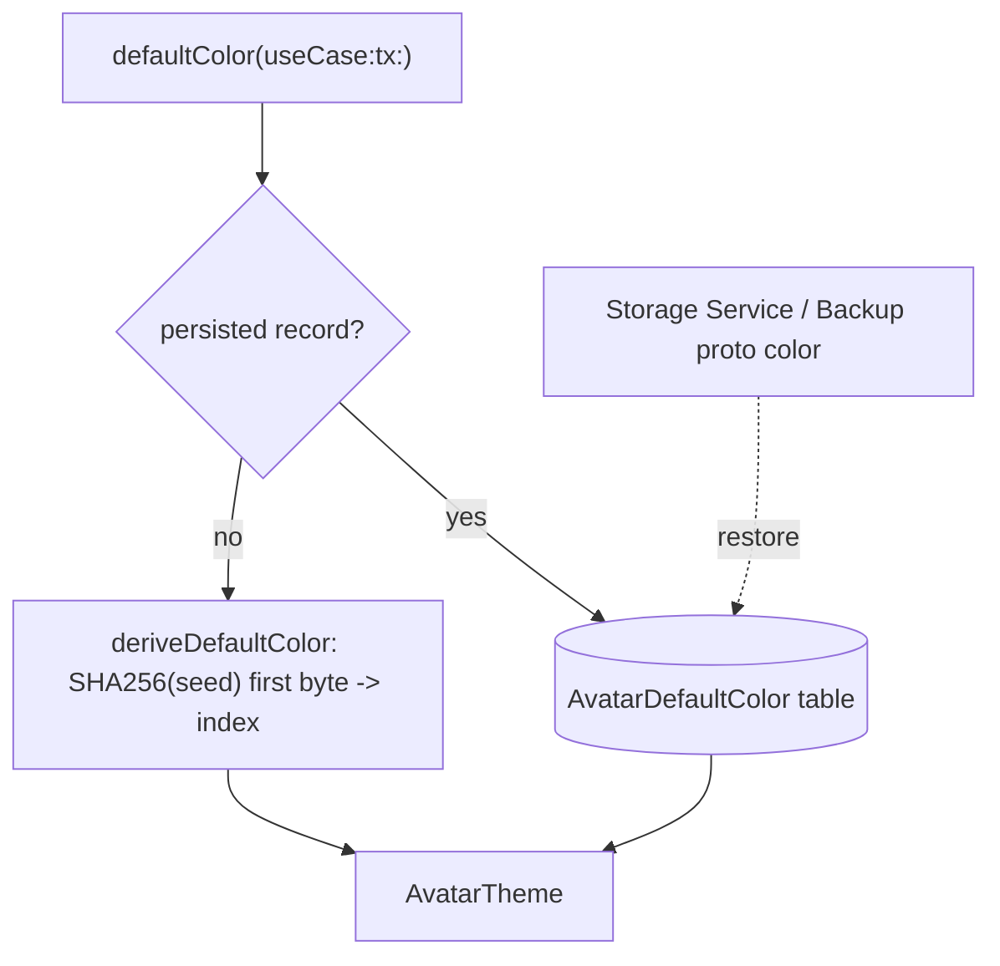
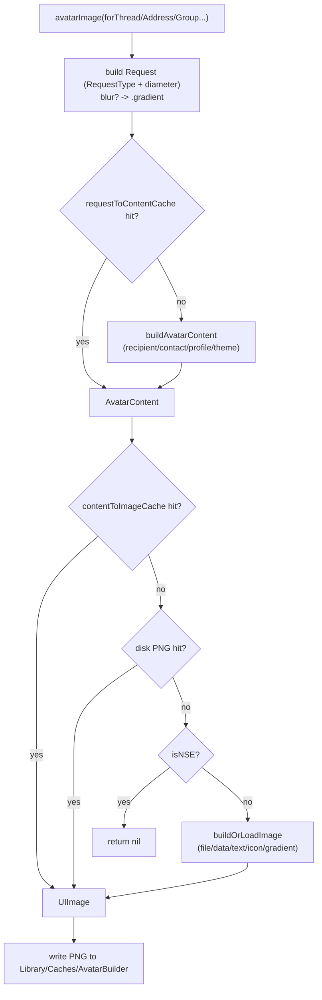

# Avatars

Covers `SignalServiceKit/Avatars/`:

- `AvatarBuilder.swift`
- `AvatarModel.swift`
- `AvatarDefaultColorManager.swift`
- `LocalUserDisplayMode.swift`

This subsystem is responsible for **building, rendering, and caching avatar images** for contacts,
groups, and the local user, and for **choosing the color** of the fallback "initials/icon over a
colored background" avatars shown when there's no custom photo. It is UIKit-dependent (produces
`UIImage`s) and lives in SignalServiceKit so both the main app and extensions can request avatars
through a single, cached path.

Two cooperating concerns:

- **`AvatarBuilder`** — the façade that turns a *request* ("show the avatar for thread/address/group
  X at diameter D") into a `UIImage`, pulling source data (profile photo, system-contact photo,
  group photo, initials, default icon) from the rest of SSK and caching aggressively.
- **`AvatarDefaultColorManager`** — decides which `AvatarTheme` (color) a default avatar uses,
  either by deriving it deterministically from identity bytes or by returning a value synced from
  other clients via Storage Service and persisted locally.

`AvatarModel` / `AvatarType` / `AvatarIcon` / `AvatarTheme` / `AvatarGradient` are the value types
describing a user-chosen or default avatar (used by the avatar-picker UI and persisted/synced
elsewhere). `LocalUserDisplayMode` controls whether the local user renders as themselves or as
"Note to Self".

---

## `LocalUserDisplayMode` — `LocalUserDisplayMode.swift:8`

Confidence: HIGH (read in full). A tiny `enum: UInt` with three cases: `asUser` (default, `0`),
`noteToSelf`, `asLocalUser`. Threaded through most `AvatarBuilder` entry points so callers can
decide whether the local user's avatar should show as the "Note to Self" glyph or as the normal
user avatar. Its `rawValue` is folded into request cache keys (`AvatarBuilder.swift:454`), so the
two renderings are cached separately.

---

## `AvatarModel` and friends — `AvatarModel.swift`

Confidence: HIGH (read in full). These are the serializable value types for a *chosen* avatar
(the avatar-picker experience) plus the shared color/gradient palettes.

- **`AvatarModel`** (`:9`) — `identifier` + `type: AvatarType` + `theme: AvatarTheme`. For
  `.icon`, the identifier is forced to the icon's `rawValue`; otherwise a random UUID is used
  (`:15`). `Equatable`.
- **`AvatarType`** (`:29`) — one of `.image(URL)`, `.icon(AvatarIcon)`, `.text(String)`.
  - `isEditable` / `isDeletable` (`:34`/`:42`) drive picker UI affordances.
  - Custom `==` (`:50`) compares image URLs by `path` rather than object identity, because the
    compiler-synthesized `URL` equality treats same-path URLs as distinct.
- **`AvatarIcon`** (`:67`) — a `String`-backed, `CaseIterable` enum of bundled icon assets. `image`
  loads `UIImage(named: "avatar_<rawValue>")` (`:94`). `defaultGroupIcons` / `defaultProfileIcons`
  (`:98`/`:113`) are the picker's default sets for groups vs. profiles.
- **`AvatarTheme`** (`:129`) — a `String`-backed, `CaseIterable` enum `A100…A210` with a
  `foregroundColor` and `backgroundColor` per case (`:145`/`:162`). `default == .A100` (`:143`).
  - `forIcon(_:)` (`:179`) maps each icon to a hand-picked theme.
  - **Proto bridging.** `asStorageServiceProtoAvatarColor` / `from(storageServiceProtoAvatarColor:)`
    (`:212`/`:229`) and `asBackupProtoAvatarColor` / `from(backupProtoAvatarColor:)`
    (`:288`/`:305`) convert to/from Storage Service and Backup protobuf enums, with `.UNRECOGNIZED`
    mapping to `nil`. This is how a default color survives sync and backup/restore.
- **`AvatarGradient`** (`:250`) — `id` + top/bottom `UIColor`, with a fixed table of 20 gradients
  (`:261`). Used for the *blurred* avatar placeholder (see below).

> Note: the `storageServiceProtoAvatarColor` and `backupProtoAvatarColor` bridges tie this folder to
> [Storage Service](../StorageService/README.md) and [Backups](../Backups/README.md); the proto
> types themselves are generated elsewhere.

---

## `AvatarDefaultColorManager` — `AvatarDefaultColorManager.swift:18`

Confidence: HIGH (read in full). Owns the color for default avatars.

Rationale (from the file's own doc comment, `:15`): clients historically derived default colors with
different algorithms; to keep colors consistent across a user's devices, a chosen color is **synced
across clients and persisted** locally, and only *derived* when nothing is persisted.

### Use cases — `UseCase` (`:19`)
`.contact(recipient:)`, `.contactWithoutRecipient(address:)`, `.group(groupId:)`,
`.callLink(rootKey:)`.

### Derivation (static, no DB) — `deriveDefaultColor` / `deriveGradient` / `deriveIndex`
- `deriveIndex(useCase:)` (`:45`) builds `seedData` from identity bytes: ACI binary, else phone
  number UTF-8, else PNI binary for contacts (`:48`); the raw `groupId` for groups (`:68`).
- It takes a **SHA-256** of the seed and uses the **first byte** as the color index (`:77–:79`); the
  index is applied modulo the palette size, so an arbitrary byte is valid.
- **Call links are special-cased** (`:71`): per spec they skip SHA-256 and index directly by the
  first byte of the `rootKey`.
- `deriveDefaultColor` (`:31`) → `AvatarTheme.forIndex(index)`; `deriveGradient` (`:38`) → a
  `AvatarGradient` by index. Empty-seed/empty-hash fall back to `.default` / `gradients[0]`.

Confidence: HIGH on the crypto detail — `import CryptoKit` (`:6`) and `SHA256()` usage at
`:77–:79`.

### Persisted lookup — `defaultColor(useCase:tx:)` (`:93`)
Instance method taking a `DBReadTransaction`. Returns the persisted color if one exists, else falls
back to derivation:
- `.callLink` and `.contactWithoutRecipient` are **never persisted** (`:99`/`:102`) → always
  derived.
- `.contact` fetches by `recipientRowId` (`:106`); `.group` fetches by `groupId` (`:115`). GRDB
  errors are swallowed with `owsFailDebug` and treated as "no record".

### Persistence — `AvatarDefaultColorRecord` (`:177`)
Confidence: HIGH. A `Codable, PersistableRecord, FetchableRecord` on table **`AvatarDefaultColor`**
(`:178`).
- Stores `recipientRowId?`, `groupId?`, and a private `defaultColorIndex: Int` (an index into
  `AvatarTheme.allCases`, `:200`), exposing `defaultColor` as a computed `AvatarTheme` (`:202`).
- **Upsert semantics:** `persistenceConflictPolicy` is `.replace` on both insert and update
  (`:183`), so `persistDefaultColor(...)` (`:137`/`:151`/`:165`) does `record.insert(...)` and
  treats a conflict as an update.
- Helper extension `AvatarTheme.forIndex/index(of:)` (`:234`) maps theme ↔ index via `allCases`.

---

## `AvatarBuilder` — `AvatarBuilder.swift:36`

Confidence: HIGH (read in full). The public, cached avatar-image factory. Reached via
`AvatarBuilder.shared` (`SSKEnvironment.shared.avatarBuilderRef`, `:38`).

The header comment (`:9–:33`) states the design intent: it DRYs up light/dark theme, avatar
blurring, point↔pixel scaling, color changes, and `LocalUserDisplayMode`, and it uses a **two-tier
cache** keyed by *request* vs. *content* so avatars rebuild only when their inputs actually change.

### Standard sizes
`smallAvatarSizePoints = 36`, `standardAvatarSizePoints = 48`, `mediumAvatarSizePoints = 68`,
`largeAvatarSizePoints = 96` (`:40–:43`), plus `*Pixels` computed via `pointsAsPixels` (`:45–:48`).

### Public API (selected)
| Method | Line | Purpose |
|--------|------|---------|
| `avatarImage(forThread:diameterPoints/Pixels:localUserDisplayMode:transaction:)` | 106 / 120 | Avatar for a `TSThread` (contact or group). |
| `avatarImage(forAddress:... diameterPoints/Pixels:)` | 173 / 188 | Avatar for an address. |
| `avatarImageWithSneakyTransaction(forAddress:...)` | 139 | Address avatar, opens its own read. |
| `precachedAvatarImage(forAddress:/forGroupThread:...)` | 205 / 257 | Return a cached image only; never builds. |
| `avatarImage(forGroupThread:diameterPoints:transaction:)` | 246 | Avatar for a group thread. |
| `avatarImageForLocalUser(...)` (+ `…WithSneakyTransaction`) | 285 / 272 | Local user's avatar. |
| `defaultAvatarImage(personNameComponents:address:...)` | 300 | Initials/default-icon avatar for a name. |
| `defaultAvatarImage(forGroupId:...)` | 330 | Default group icon. |
| `defaultAvatarImageForLocalUser(...)` | 354 / 365 | Local user's default (no photo) avatar. |
| `avatarImage(model:diameterPoints/Pixels:)` | 398 / 403 | Render a chosen `AvatarModel` (picker preview). |
| `releaseNotesIcon()` | 595 | Static: gradient Signal-logo icon for the release-notes chat. |

### Request → Content → Image pipeline
Three private layers (header `:22–:33`):

1. **`Request`** (`RequestType` `:437` + `diameterPixels`, `:478`). Describes *what view wants*:
   `.contactAddress`, `.text`, `.contactDefaultIcon`, `.group`, `.groupDefaultIcon`, `.model`,
   `.gradient`. Blur decisions happen here: `shouldBlurContactAvatar` / `shouldBlurGroupAvatar`
   (via `contactManagerImplRef`, `:160`, `:232`, `:495`, `:512`) turn a request into a
   `.gradient(...)` placeholder instead of the real photo.
2. **`AvatarContent`** (`:691`) wraps a resolved `AvatarContentType` (`:644`) — the concrete source
   (`.file`, `.data`, `.text`, `.tintedImage`, `.avatarIcon`, `.cachedContact`, `.gradient`) plus an
   optional `failoverContentType` used when the primary can't render. `buildAvatarContent`
   (`:829`) resolves a request into content, consulting `recipientDatabaseTable` (`:845`),
   `avatarDefaultColorManager` (`:846`), and `contactManager*` (`:874`, `:883`) for photo data /
   display name / theme.
3. **Image build** — `buildOrLoadImage` (`:951`) dispatches by content type to load+resize files
   (`:1038`), decode+resize `Data` (`:1068`), draw text (`:1257`), draw a tinted icon (`:1112`), draw
   an `AvatarIcon` (`:1141`), or render a gradient (`:1180`). Output is asserted square and
   ≤ target size (`:1016`) and scale-normalized to the screen via `normalizeImageScale` (`:1025`).

### Caching (three caches)
- **`addressToAvatarIdentifierCache`** `LRUCache<SignalServiceAddress, String>` (max 256, `nseMaxSize 0`,
  `:435`): a level of indirection mapping an address to an ephemeral UUID, so that evicting one
  address's avatar only requires dropping its UUID (the request cache keys can't be enumerated).
- **`requestToContentCache`** `LRUCache<String, AvatarContent>` (max 128, NSE 0, `:728`): must be
  **evacuated** when inputs change (see Observers). Keyed by `Request.cacheKey`.
- **`contentToImageCache`** `LRUCache<String, UIImage>` (max 128, NSE 0, `:745`): **never needs
  evacuation** — content cache keys embed a content digest, so changed content yields a new key.
  Only small images (≤ 200px, `maxCacheSizePixels`, `:818`) are memory-cached (`memoryCacheAvatarImageIfEligible`, `:815`).
- **Disk cache**: every built image is also written as a PNG under
  `Library/Caches/AvatarBuilder/<sha1(cacheKey)>.png` (`avatarCacheDirectory`, `:746`). The filename
  is the SHA-1 of the cache key specifically so it's filename-safe (hex only).

### NSE (Notification Service Extension) considerations
Confidence: HIGH.
- All three in-memory LRU caches use `nseMaxSize: 0`, so they're effectively disabled in the NSE.
- **The NSE never builds avatars** — `avatarImage(forAvatarContent:...)` (`:757`) bails with
  `guard !CurrentAppContext().isNSE else { return nil }` (`:790`) after checking the disk cache,
  because building is expensive.
- To let the NSE still show a photo, the main app persists each contact's *content* cache key in a
  `KeyValueStore(collection: "AvatarBuilder.contactCacheKeys")` (`:755`); `saveCacheKeyForNSE`
  (`:764`) async-writes it when it changes (`:772`). In the NSE, `buildAvatarContent` reads that key
  and uses `.cachedContact` (`:869`) to reuse the already-built image, deliberately *not* detecting
  avatar updates (comment at `:862`).

### Cache invalidation via notifications
Confidence: HIGH. On app-will-become-ready (`:54`), `addObservers` (`:61`) subscribes on the main
thread:
- `OWSContactsManagerContactsDidChange` → **clear the entire** `requestToContentCache` (`:85`).
- `UserProfileNotifications.otherUsersProfileDidChange` → drop that address's entry from
  `addressToAvatarIdentifierCache` (`:92`), invalidating its request keys.
- `UserProfileNotifications.localProfileDidChange` → same for the local ACI address (`:100`).

All three handlers `AssertIsOnMainThread()` (`:84`, `:90`, `:98`). Note the `contentToImageCache` is
intentionally left alone (its keys are content-addressed).

### Rendering details
Confidence: HIGH.
- Text avatars use the bundled **"Inter"** font sized relative to diameter (`avatarMaxFont`, `:1240`;
  `UIFont(name: "Inter-Regular_Medium", ...)`, `:1246`), with emoji-only strings scaled larger.
  Initials come from `contactInitials` (`:563` for `DisplayName`, `:580` for `PersonNameComponents`),
  which abbreviates a name and **drops abbreviations ≥ 4 chars** (e.g. Arabic), matching iMessage
  (`:589`).
- Tinted icons are drawn via a CoreGraphics mask with a ULO→LLO vertical flip (`:1349`), and the
  icon is pre-resized before masking to avoid a "Preserve Vector Data" fuzziness bug (comment at
  `:1311`'s `drawIconInAvatar`).
- Gradient placeholders render a `CAGradientLayer` top→bottom (`:1194`, inside the gradient
  `buildAvatar` at `:1180`).
- `#if USE_DEBUG_UI` (`:1390`) adds `buildNoiseAvatar` (`:1394`) / `buildRandomAvatar` for debugging
  only.

### Hashing note
Confidence: HIGH. Private `Data`/`String.sha1HexadecimalDigestString` helpers (`:1376`/`:1382`) use
`Insecure.SHA1` purely for **cache-key / digest** purposes (deduping identical image data and naming
disk-cache files) — not security. Contrast with `AvatarDefaultColorManager`'s SHA-256, which is also
non-security but spec-defined for color derivation.

---

## Interactions with the rest of SSK / the app

Confidence: HIGH (all are direct call sites in this folder).

- **Contacts/profiles**: `contactManagerImplRef.avatarImageData(forAddress:...)`,
  `contactManagerRef.displayName(...)`, and `shouldBlur{Contact,Group}Avatar` provide photo bytes,
  names, and blur policy (`:874`, `:883`, `:160`, `:232`).
- **Recipients / account**: `DependenciesBridge.shared.recipientDatabaseTable` and
  `tsAccountManager.localIdentifiers(...)` resolve recipients and the local user
  (`:311`, `:291`, `:375`).
- **Default colors**: `DependenciesBridge.shared.avatarDefaultColorManager` picks themes
  (`:312`, `:342`, `:846`).
- **Groups**: group photo bytes come from `groupThread.groupModel.avatarDataState` (`:546`); see
  [Groups](../Groups/README.md).
- **Storage Service & Backups**: `AvatarTheme` proto bridges (above) feed default-color sync/backup.
- **UI**: the whole module returns `UIImage` and reads `UITraitCollection.current.displayScale`,
  so it is explicitly a UIKit-coupled part of SSK consumed by the app's chat list, conversation
  views, and the avatar picker.

## Concurrency / correctness notes

Confidence: MEDIUM–HIGH. Notification handlers assert the main thread; the LRU caches are the shared
mutable state. The only off-thread write is `saveCacheKeyForNSE`'s `asyncWrite` for the NSE cache
key (`:772`). Most entry points require a `DBReadTransaction`; the `…WithSneakyTransaction` variants
open their own read (`:139`, `:272`). I did not audit `LRUCache`'s internal thread-safety here
(defined outside this folder), so the exact locking guarantees are not verified from these files.
