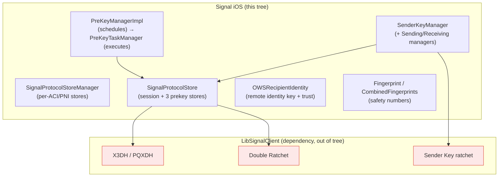

# Axolotl — Signal Protocol integration (identity, pre-keys, sessions, sender keys)

Covers `SignalServiceKit/Axolotl/`. This folder is the **integration layer** between
the app's persistence/account layers and **LibSignalClient** (the Swift binding over
`libsignal`, a dependency that is **not in this tree**). The actual cryptographic
algorithms — X3DH/PQXDH key agreement, the Double Ratchet, Sender Key ratchets,
Curve25519/Ed25519 and Kyber operations — all live inside LibSignalClient. What's here
is the Swift code that **generates and persists key material**, **implements the store
protocols LibSignal calls back into**, and **orchestrates pre-key lifecycle**.

> **Confidence labels.** Each claim is tagged:
> - **[High]** — read directly from source in this folder; behavior explicit in code.
> - **[Medium]** — inferred from code, but depends on collaborators outside this folder
>   (notably LibSignalClient, `OWSIdentityManager`, `MessageSender`).
> - **[Low]** — inferred from naming/comments; not fully verified in-tree.
>
> File+line citations reflect the tree at time of writing; prefer the cited symbol name
> if lines drift.

> **Note on overlap.** The `docs/SignalServiceKit/Cryptography/` doc set already treats
> these files in depth (identity-and-keys, prekeys, sessions-and-ratchet, sealed-sender).
> This README is a **folder-scoped map** of `Axolotl/` itself — the per-file inventory,
> the store/manager wiring, and the data model — and does not modify those docs.

---

## Big picture



**Cross-cutting conventions** observed across the folder:

- **ACI/PNI duality.** Almost everything is parameterized by `OWSIdentity`.
  `SignalProtocolStoreManager` holds a full `SignalProtocolStore` per identity and
  routes by identity (`SignalProtocolStore.swift:31`, `:37`). **[High]**
- **Opaque LibSignal blobs.** Session, sender-key, and pre-key records are stored as
  serialized `Data` the Swift layer never interprets (`SessionStore.swift:18`,
  `SenderKeyStore.swift:21`, `PreKeyRecord.swift:33`). They're round-tripped through
  `LibSignalClient.*Record(bytes:)` / `.serialize()`. **[High]**
- **Corruption tolerance.** An undecodable session is treated as *absent* so a new one
  is created rather than crashing (`SessionStore.swift:118`); malformed sender keys are
  likewise skipped (`SenderKeyManager.swift:94`). **[High]**
- **Serial execution** of state-coordinating pre-key operations via a
  `ConcurrentTaskQueue(concurrentLimit: 1)` (`PreKeyManagerImpl.swift:37`). **[High]**
- **`failIfThrows`** wraps GRDB writes that are considered unrecoverable (crash on DB
  failure), used pervasively in the stores. **[High]**

**Wiring.** All of these are constructed once in `AppSetup` — `PreKeyStore()`,
`SessionStore()`, two `SignalProtocolStore.build(...)` (ACI + PNI), and a
`SignalProtocolStoreManager` (`SignalServiceKit/Environment/AppSetup.swift:278-322`).
**[High]** Consumers are mainly the message pipeline (`MessageSender.swift`,
`OWSMessageDecrypter.swift`, `MessageReceiver.swift`, `MessageSender+SenderKey.swift`)
and provisioning/registration. **[Medium]** (grep of callers; pipeline internals are
out of this folder's scope.)

---

## File inventory

| File | Role |
| --- | --- |
| `SignalProtocolStore.swift` | Per-identity bundle of stores + the ACI/PNI manager. |
| `SessionStore.swift` | 1:1 Double Ratchet session persistence; LibSignal `SessionStore` adapter. |
| `PreKeyStore.swift` | GRDB-backed pre-key table + LibSignal `PreKeyStore`/`SignedPreKeyStore`/`KyberPreKeyStore` adapters. |
| `PreKeyRecord.swift` | The `PreKey` row model (namespace/identity/keyId). |
| `PreKeyStoreImpl.swift` / `SignedPreKeyStoreImpl.swift` / `KyberPreKeyStoreImpl.swift` | Per-identity key generation + metadata (rotation dates, id allocation). |
| `KyberPreKeyUseRecord.swift` | Row recording use of a (non-one-time) Kyber pre-key. |
| `PreKeyId.swift` | Random / sequential pre-key id allocation. |
| `PreKeyManager.swift` / `PreKeyManagerImpl.swift` | Public API + scheduler for pre-key lifecycle. |
| `PreKeyTaskManager.swift` | Stateless executor of the actual pre-key task steps. |
| `PreKeyTaskAPIClient.swift` | Server calls: available-prekey counts + register prekeys. |
| `PreKeyTarget.swift` | `PreKeyTarget` / `PreKeyTargets` option set. |
| `PreKeyUploadBundle.swift` | Upload bundle protocol + partial/registration bundles. |
| `PreKeyBundle.swift` | `Decodable` of a *remote* peer's fetched pre-key bundle. |
| `MockPreKeyManager.swift` | `TESTABLE_BUILD` no-op `PreKeyManager`. |
| `SenderKeyStore.swift` | GRDB `SenderKey` + `SenderKeySentToDevice` tables. |
| `SenderKeyManager.swift` | Sender-key store/load, delivery tracking, SKDM building, migration. |
| `OldSenderKeyStore.swift` | Legacy `KeyValueStore`-based sender-key records + migration model. |
| `OWSRecipientIdentity.swift` | Remote identity-key record + trust/verification queries. |
| `OWSVerificationState.h` | The verification-state enum (default/verified/noLongerVerified/defaultAcknowledged). |
| `Fingerprint.swift` / `CombinedFingerprints.swift` | Safety-number derivation, text + scannable (QR) representation. |

---

## 1. Store topology

### `SignalProtocolStore` — `SignalProtocolStore.swift:8`
Confidence: HIGH (read in full). Bundles the four stores used for 1:1 Signal Protocol
sessions for **one** identity: `SessionManagerForIdentity`, `PreKeyStoreImpl`,
`SignedPreKeyStoreImpl`, `KyberPreKeyStoreImpl` (`:9-12`). `build(...)` (`:14`) wires a
shared `PreKeyStore`/`SessionStore` into per-identity wrappers.

### `SignalProtocolStoreManager` — `:31`
Confidence: HIGH. Holds the ACI and PNI `SignalProtocolStore`s plus the shared
`PreKeyStore`/`SessionStore`. `signalProtocolStore(for:)` (`:37`) routes by `OWSIdentity`.
`removeAllKeys(tx:)` (`:46`) wipes all pre-key/session state across both identities —
used on logout/reset. **[High]**

---

## 2. Sessions (1:1 Double Ratchet)

### `SessionRecord` (row model) — `SessionStore.swift:10`
Confidence: HIGH. GRDB table `Session`. Key columns: `recipientId`
(`SignalRecipient.RowId`), `localIdentity` (ACI/PNI), `deviceId`, and an **optional**
`serializedRecord: Data?` (`:18`, nil only for legacy rows). The serialized blob is an
opaque LibSignal `SessionRecord`.

### `SessionStore` (persistence) — `:36`
Confidence: HIGH (read in full). Pure CRUD keyed by (recipientId, localIdentity,
deviceId):
- `fetchSession(...)` (`:101`) decodes `serializedRecord` into `LibSignalClient.SessionRecord`;
  **on decode failure it logs and returns nil** so the caller rebuilds a session rather
  than crashing (`:118`). **[High]**
- `archiveSessions(...)` / `_archiveSessions(...)` (`:123`/`:131`) decode each record, call
  `archiveCurrentState()` (a LibSignal operation), and persist the result; legacy rows with
  no blob are left as-is (`:145`). This forces a re-handshake, e.g. after a remote identity
  key change. **[Medium]** (the archival semantics live in LibSignal.)
- `upsertSession(...)` (`:175`) uses raw `INSERT OR REPLACE`.
- `mergeRecipientId(...)` (`:50`) reconciles sessions when two `SignalRecipient` rows merge:
  prefers the target's existing sessions, otherwise re-points ours. **[High]**
- `deleteSessions` / `deleteAllSessions` (`:161`/`:202`).

### `SessionManagerForIdentity` — `:207`
Confidence: HIGH. The **LibSignal `SessionStore` adapter** for a fixed identity. Resolves
a `ServiceId` → `SignalRecipient.RowId` via `RecipientIdFinder`, then delegates to
`SessionStore`. Notable:
- The `RecipientIdError.mustNotUsePniBecauseAciExists` case is treated as "no sessions
  possible" for archive/delete (`:246`, `:261`) but **thrown** on load/store (`:286`,
  `:331`). **[High]**
- `storeSession(...)` (`:315`) calls `ensureRecipientId(...)` (create-if-missing) before
  upserting; load paths use the non-creating `recipientId(...)`. **[High]**
- `loadExistingSessions(...)` throws `SignalError.sessionNotFound` if any address lacks a
  session (`:303`). **[High]**

A `MockSessionStore.processPreKeyBundle` helper exists under `TESTABLE_BUILD` (`:340`) that
drives `LibSignalClient.processPreKeyBundle` end-to-end (builds Bob's bundle, Alice
processes it). **[High]**

---

## 3. Pre-keys

### Data model — `PreKeyRecord.swift:8`
Confidence: HIGH. GRDB table `PreKey`. **(identity, namespace, keyId) is UNIQUE** (`:14`).
`Namespace` is `oneTime=0`, `kyber=1`, `signed=2` (`:35-38`). `isOneTime` is redundant for EC
keys (separate namespaces) but **load-bearing for Kyber** (one-time vs last-resort share the
`kyber` namespace) (`:25-27`). `replacedAt` is the Unix time the key became obsolete; the
blob is `serializedRecord: Data?` (`:33`).

### `PreKeyStore` (shared, both identities) — `PreKeyStore.swift:10`
Confidence: HIGH (read in full). Owns id allocation, "replaced-at" marking, and culling:
- `allocatePreKeyIds(...)` (`:37`) persists a monotonic "last id" in a per-store
  `KeyValueStore` and asks `PreKeyId` for the next range.
- `setReplacedAtIfNil(...)` (`:49`) stamps `replacedAt = now` on all keys in a
  namespace **except** the just-uploaded ids. **[High]**
- `cullPreKeys(gracePeriod:)` (`:69`) deletes keys whose `replacedAt` is older than
  `maxUnacknowledgedSessionAge + gracePeriod` (**or implausibly far in the future**).
  `maxUnacknowledgedSessionAge = 30 days` (`PreKeyManagerImpl.swift:30`). **[High]**
- `PreKeyStoreForIdentity` (`:88`) exposes fetch/upsert/remove and the **three LibSignal
  adapters** (`loadPreKey` `:169`, `loadSignedPreKey` `:184`, `loadKyberPreKey` `:195`,
  `markKyberPreKeyUsed` `:199`, `removePreKey`). `store*PreKey` from LibSignal is
  intentionally `owsFail("Not supported")` — the app only *stores* via its own generators,
  not via LibSignal callbacks (`:179`, `:190`, `:228`). **[High]**
- `markKyberPreKeyUsed(...)` (`:199`): one-time Kyber keys are deleted on use; last-resort
  keys instead insert a `KyberPreKeyUseRecord` and surface a `SQLITE_CONSTRAINT` on replay
  (so a reused last-resort/base-key pair is rejected). **[High]**

Writable variants (`storePreKey(_:replacedAt:...)`) exist only under `TESTABLE_BUILD`
(`:244`).

### Per-identity generators / metadata
Confidence: HIGH.
- `PreKeyStoreImpl` (`PreKeyStoreImpl.swift:9`) — one-time EC. `allocatePreKeyIds` grabs
  **100** ids (`:31`); `generatePreKeyRecords` makes LibSignal `PreKeyRecord`s (`:36`).
- `SignedPreKeyStoreImpl` (`SignedPreKeyStoreImpl.swift:11`) — signed EC. Tracks
  `lastKeyRotationDate` in a per-identity `KeyValueStore` (`:40`,`:44`);
  `generateSignedPreKey` signs the new key with the identity key (`:61`).
- `KyberPreKeyStoreImpl` (`KyberPreKeyStoreImpl.swift:9`) — Kyber (post-quantum).
  `generatePreKeyRecord` generates a `KEMKeyPair` and signs it (`:41`); separate
  `storeLastResortPreKeyFromChangeNumber`/`generateLastResortKyberPreKeyForChangeNumber`
  support change-number (`:87`,`:67`). Also tracks a rotation date.
- `PreKeyId` (`PreKeyId.swift`) — ids are random in `1..<0x1000000` (`:10`,`:13`), kept small
  on purpose; sequential allocation wraps to 1 near the upper bound (`:23`).

### Scheduler: `PreKeyManager` / `PreKeyManagerImpl`
Confidence: HIGH (read in full). `PreKeyManager` (`PreKeyManager.swift:9`) is the public
protocol: `checkPreKeysIfNecessary`, `createPreKeysForRegistration`/`...ForProvisioning`,
`finalizeRegistrationPreKeyBundle`, `rotateOneTimePreKeysForRegistration`,
`rotateSignedPreKeysIfNeeded`, `refreshOneTimePreKeys`, `setIsChangingNumber`.

`PreKeyManagerImpl` (`PreKeyManagerImpl.swift:12`) **only schedules** — "this class does not
perform PreKey operations" (`:9` comment). Key facts:
- All real work runs on a **serial** `ConcurrentTaskQueue(concurrentLimit: 1)` (`:37`)
  because client+server pre-key state must be reconciled atomically. **[High]**
- `checkPreKeys` requires main-app-and-active (`:118`), throttles one-time checks to every
  `oneTimePreKeyCheckFrequencySeconds = 12h` (`:18`,`:126`), and runs ACI then PNI, each
  waiting for an identified connection and respecting cancellation. **[High]**
- **App-lock gate**: `isAppLockedDueToPreKeyUpdateFailures` (`:100`) returns true if signed
  **or** last-resort keys for either identity haven't rotated within
  `SignedPreKeyMaxRotationDuration = 14 days` (4 under test intervals) (`:22`,`:87`). **[High]**
- **Change-number interlock**: while `isChangingNumber`, PNI pre-key refreshes are deferred
  via a `Monitor.Condition` (`:251`,`:264`,`:271`), because the active PNI identity key is
  temporarily ambiguous. **[High]**

### Executor: `PreKeyTaskManager` — `PreKeyTaskManager.swift:16`
Confidence: HIGH (read in full). Stateless; implements the 7-step pipeline documented at the
top of the file (`:9-21`). Highlights:
- Registration vs provisioning: `createForRegistration` (`:80`) may create a new identity key;
  `createForProvisioning` (`:92`) uses the primary-supplied key pair; both persist *before*
  upload (`generateKeysForProvisioning :209`, `getOrCreateIdentityKeyPair :239`). **[High]**
- `refresh(...)` (`:123`): waits for message processing (PNI only — ACI can't change by
  message, `:375`), optionally fetches server counts, then `filterToNecessaryTargets`
  decides what actually needs regenerating (`:317`). Thresholds:
  `EphemeralPreKeysMinimumCount = 10`, `PqPreKeysMinimumCount = 10`,
  `SignedPreKeyRotationTime = LastResortPqPreKeyRotationTime = 2 days` (`:57-65`). **[High]**
- Generation counts: one-time EC = 100 (`PreKeyStoreImpl`), one-time Kyber = 100
  (`:297`), last-resort Kyber = 1 (`:300`, `:225`). **[High]**
- `persistKeysPriorToUpload` (`:390`) stores keys before upload; `persistStateAfterUpload`
  (`:409`) records rotation dates, stamps `replacedAt` on the superseded keys, then culls
  with a **grace period** equal to the server message-queue time (clamped 1–90 days,
  `:443`) to avoid deleting pre-keys that in-flight messages still reference. A deferred
  task re-culls with grace period 0 after message processing drains (`cullStateAfterMessageProcessing :451`). **[High]**
- 422 on upload → triggers `identityKeyMismatchManager.validateIdentityKey` then rethrows
  (`:489`). **[Medium]** (mismatch manager is out of folder.)
- `PreKeyTaskAPIClient` (`PreKeyTaskAPIClient.swift`) is the only server surface: a
  count request and a register-prekeys request. **[High]**

### Supporting pre-key types
Confidence: HIGH.
- `PreKeyTarget` / `PreKeyTargets` (`PreKeyTarget.swift`) — bit-flag option set over the
  four key kinds.
- `PreKeyUploadBundle` (`PreKeyUploadBundle.swift:9`) — protocol with `PartialPreKeyUploadBundle`
  (refresh, `:31`) and `RegistrationPreKeyUploadBundle` (reg/provisioning, carries the identity
  key pair, `:58`); `isEmpty()` short-circuits uploads (`:18`).
- `PreKeyBundle` (`PreKeyBundle.swift:9`) — `Decodable` of a **remote** peer's fetched bundle
  (identity key + per-device signed/one-time/pq pre-keys, `:31`), with strict length checks
  (33-byte keys). This is consumed to establish an outbound session (via LibSignal). **[High]**
- `MockPreKeyManager` (`MockPreKeyManager.swift`) — `TESTABLE_BUILD` no-op.

---

## 4. Sender keys (group fan-out)

### Data model — `SenderKeyStore.swift:11`
Confidence: HIGH.
- `SenderKeyRecord` (table `SenderKey`, `:11`): owner recipient/device + `distributionId`
  (UUID) + `deletionType` (`thisDevice=0` for our own sending key, `otherDevice=1` for a
  received key, `:31`,`:36`) + `insertedAt` + opaque `serializedRecord` (`:21`).
- `SenderKeySentToDeviceRecord` **row** (table `SenderKeySentToDevice`, `:108`): tracks, per
  (senderKeyId, recipientId, deviceId, **registrationId**), which devices already have our
  Sender Key. A changed registration id forces re-distribution to avoid a decrypt/resend
  cycle (`:127` comment). 1:N with `SenderKeyRecord`. **[High]**
- `SenderKeyStore` (`:148`) is CRUD: upsert sender key, upsert/fetch/reset "sent to"
  records, fetch oldest by `insertedAt` (for culling). `upsertSentToRecord` (`:162`) throws a
  typed `ConstraintError`. **[High]**

### `SenderKeyManager` — `SenderKeyManager.swift:8`
Confidence: HIGH (read in full). Owns a `KeyValueStore` mapping *threadUniqueId →
distributionId* (`:10`) plus references to the new store, the `OldSenderKeyStore`, recipient
lookups, and the `SessionStore`. Store/load (`:47`/`:75`) require an **ACI** sender
(`:57`,`:81`), fold in the legacy store on load, and treat malformed records as nil
(`:94`). `resetAll` (`:32`) wipes everything (deletes `SentToDevice` before `SenderKey` so
FK lookups are cheap). **[High]**

Two LibSignal `SenderKeyStore` adapters wrap it with extra context:
- `SenderKeyReceivingManager` (`:145`) — stores received keys as `otherDevice`.
- `SenderKeySendingManager` (`:174`, also a `ThreadRemoverObserver`) — stores our own keys
  as `thisDevice`, and provides the **send-path logic**:
  - `fetchOrCreateDistributionId(...)` (`:203`).
  - `readyRecipients(...)` (`:236`) is the core: it fetches our Sender Key, **deletes it if
    older than `maxSenderKeyAge`** (`:279`) or if any recorded recipient is no longer
    acceptable (`:290`), then for each intended recipient compares current device/registration
    state against the "sent to" records; a recipient is *ready* only if **every** current
    device already received the key (new devices / missing registration ids ⇒ not ready, needs
    an SKDM) (`:326`,`sentToRecipientDevices :359`). **[High]**
  - `buildSenderKeyDistributionMessage(...)` (`:382`) builds the SKDM via LibSignal.
  - `recordSentSenderKeys(...)` (`:443`) persists "sent to" records after a successful fan-out;
    a `ConstraintError` (key was deleted meanwhile) is logged, not fatal (`:467`). **[High]**
  - `didRemoveThread(...)` (`:587`) drops the thread's distributionId when the thread is
    removed. **[High]**

### Legacy sender keys — `OldSenderKeyStore.swift`
Confidence: HIGH. Pre-GRDB storage: a `KeyValueStore("SenderKeyStore_KeyMetadata")` keyed by
`"<ACI>.<distributionId>"` (`:13`,`:17`). `KeyMetadata` (`:86`) is `Codable` with
**V1→V3 delivery-tracking migration** baked into its decoder (`:133`,`:154` comments). It's
only read when `BuildFlags.decodeOldSenderKeys` is set;
`SenderKeyManager.migrateSenderKeyIfNeeded` (`SenderKeyManager.swift:480`) lazily migrates a
matching legacy record into the GRDB tables and then deletes it (always, even on error). **[High]**

---

## 5. Remote identity & trust

### `OWSVerificationState` — `OWSVerificationState.h:10`
Confidence: HIGH. The four trust states: `Default` (trusted after an untrusted interval),
`Verified`, `NoLongerVerified` (never trusted on time alone), `DefaultAcknowledged` (user
dismissed the "default" prompt so the interval is skipped). The Swift `VerificationState`
enum (`OWSRecipientIdentity.swift:23`) collapses default/defaultAcknowledged into
`.implicit(isAcknowledged:)`. **[High]**

### `OWSRecipientIdentity` — `OWSRecipientIdentity.swift:56`
Confidence: HIGH. `SDSCodableModel` row (`model_OWSRecipientIdentity`) for a **remote**
peer's identity key + trust fields: `identityKey`, `createdAt`, `isFirstKnownKey` (TOFU
anchor), `verificationState`. `identityKeyObject` reconstructs a LibSignal `IdentityKey`
(`:123`). Class queries drive group-safety UI:
`groupContainsUnverifiedMember` (`:129`) and `noLongerVerifiedIdentityKeys` (`:143`) run a
join across `SignalRecipient`/`OWSRecipientIdentity`/`TSGroupMember` (`:150`). `buildVerifiedProto`
(`:236`) builds the `verified` sync proto (with optional padding to obscure NullMessage
size) — only `.verified`/`.default` are ever synced, never `.noLongerVerified` (`:243`
comment). **[Medium]** (sync delivery is handled by `OWSIdentityManager`, outside this
folder.)

### Safety numbers
Confidence: HIGH.
- `Fingerprint` (`Fingerprint.swift:10`) derives a per-(ACI, identityKey) fingerprint by
  iterating SHA-512 **5200** times (`:18`), and renders it as groups of five decimal digits
  (`stringRepresentation :47`). `dataRepresentation()` is the first 32 bytes (`:43`).
- `CombinedFingerprints` (`CombinedFingerprints.swift:9`) combines local+remote fingerprints
  for display and QR. `checkAgainst(...)` (`:28`) compares a scanned
  `Textsecure_CombinedFingerprints`: version mismatch ⇒ `theyHaveOldVersion`/`weHaveOldVersion`;
  content mismatch ⇒ `theyHaveWrongKeyForUs`/`weHaveWrongKeyForThem` (note local/remote are
  swapped from the scanner's perspective). `displayableText()` lays the digits out
  3 lines × groups of 5 (`:62`); `image()` builds a QR via `CIQRCodeGenerator` from the
  serialized proto (`:80`; scannable format version 2, `:125`). **[High]**

---

## Lifecycle view

```mermaid
sequenceDiagram
    participant Reg as Registration/Provisioning
    participant PKM as PreKeyManagerImpl
    participant PTM as PreKeyTaskManager
    participant Srv as Server
    participant Peer as Peer device
    participant SS as SessionStore
    participant SKM as SenderKeySendingManager

    Reg->>PKM: createPreKeysForRegistration/Provisioning
    PKM->>PTM: generate signed + last-resort Kyber, persist
    Reg->>Srv: upload bundle
    Reg->>PKM: finalizeRegistrationPreKeyBundle(uploadDidSucceed)
    Note over PKM: periodic checkPreKeysIfNecessary (serial queue)
    PKM->>PTM: refresh → filterToNecessaryTargets → upload → stamp replacedAt → cull
    Peer->>Srv: fetch our PreKeyBundle
    Peer->>SS: process bundle (X3DH/PQXDH in LibSignal) → session
    Note over SS: markKyberPreKeyUsed; one-time keys consumed
    SKM->>SKM: readyRecipients (who already has the Sender Key?)
    SKM->>Peer: SKDM to not-yet-ready devices, then multi-recipient send
```

Edge cases worth remembering (all **[High]** unless noted): undecodable session ⇒ treated as
absent and rebuilt; pre-key culling is deferred by a message-queue grace period so in-flight
messages don't hit missing keys; sender keys are deleted when stale, when a recipient becomes
unacceptable, or when a device's registration id changes; last-resort Kyber reuse is rejected
via a DB constraint; PNI pre-key work is deferred while changing number. The underlying key
agreement, ratchets, and record formats are all **[Medium]** because they execute inside
LibSignalClient, which is not in this tree.
