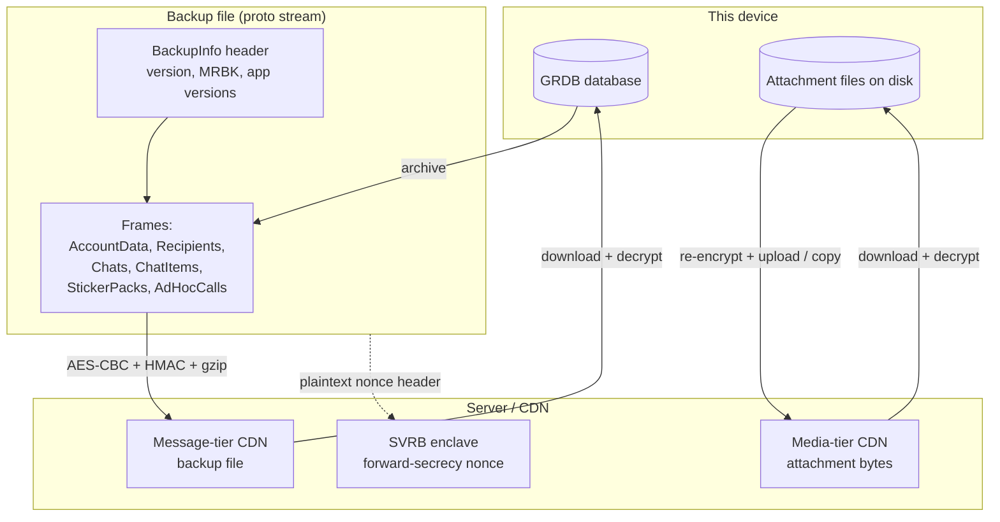
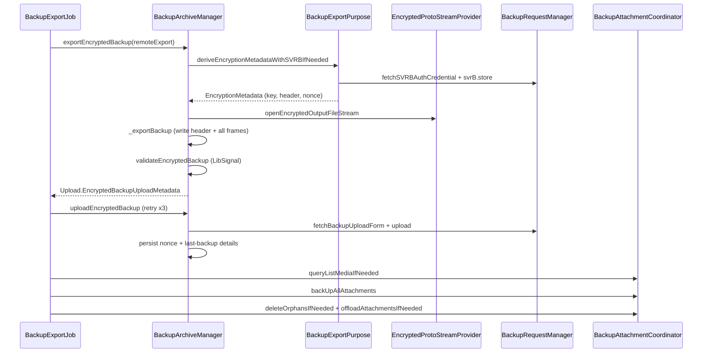

# Signal iOS — Backups Subsystem

This documentation set reconstructs Signal iOS's **Backups** subsystem from the
first-party source in `SignalServiceKit/Backups/` (~40k LOC). Backups let a user
export their entire chat database (and, on the paid tier, their media) to a
server-side **remote backup**, a **local file backup** on a device of their
choosing, or a one-time **Link'n'Sync** transfer to a newly-linked device, and
later restore from any of these.

> **Confidence labels.** Each claim is tagged with a confidence level:
> - **[High]** — directly read from source; behavior is explicit in code.
> - **[Medium]** — inferred from code with reasonable certainty, but depends on
>   collaborators defined outside this directory (notably **LibSignalClient**,
>   the attachment up/download managers, and `AccountKeyStore`).
> - **[Low]** — inferred from naming/comments; not fully verified in-tree.
>
> Where the code does not reveal *why* something is done, this is stated as
> "intent undetermined — no evidence in source".
>
> All file+line citations refer to the state of the tree at the time of writing.
> Line numbers are approximate anchors; use the cited symbol name to locate code
> if lines have drifted.

---

## The central concept: a Backup is a stream of protos, encrypted and tiered

A Backup file is a **header proto followed by a sequence of length-delimited
"frame" protos** (one per recipient, chat, chat-item, sticker pack, …). The
same serialized format is used for all three purposes; what differs is the
**encryption scheme** and the **content filter**. **[High]** —
`BackupArchiveProtoStreamProvider.swift` doc comments; `BackupArchiveManagerImpl._exportBackup`
(`SignalServiceKit/Backups/Archiving/BackupArchiveManagerImpl.swift:450`).

Backups span three independent concerns, each documented separately:

1. **The backup file** — the proto stream itself: archived, encrypted, written
   to disk, uploaded/stored, downloaded, decrypted, and imported frame-by-frame.
2. **Backup media (attachments)** — attachment *files* are **not** in the proto
   stream. The proto references them by `mediaName`; the bytes live on the
   **media tier** CDN (paid tier) and are managed by independent upload/download
   queues, offloading, and orphan cleanup.
3. **Keys, credentials, and server/CDN interaction** — the key material that
   encrypts the file and media, the ZK auth credentials that authorize CDN
   operations, and the forward-secrecy nonce chain backed by SVRB.

---

## Document map

| Doc | Area covered | Primary source |
| --- | --- | --- |
| [archive-and-export.md](archive-and-export.md) | Export orchestration, archiver ordering, content filter, FTS indexing, the backup export job + runner, local file export | `Archiving/BackupArchiveManagerImpl.swift` (export half), `Archiving/BackupArchive+IncludedContentFilter.swift`, `Archiving/BackupArchiveFullTextSearchIndexer.swift`, `BackupExportJob/`, `LocalFileBackup/` (export) |
| [restore-and-import.md](restore-and-import.md) | Import orchestration, frame-by-frame restore, index drop/recreate, finalize, restore state machine, post-restore side effects | `Archiving/BackupArchiveManagerImpl.swift` (import half) |
| [proto-and-record-model.md](proto-and-record-model.md) | The frame/record model, archiver contexts, shims, GRDB record types backing the queues/stores | `Archiving/BackupArchive+Contexts.swift`, `Archiving/Archivers/`, the `Queued*`/`Orphaned*` records |
| [encryption-and-keys.md](encryption-and-keys.md) | Root/media key material, the file-stream transform chain, the forward-secrecy nonce chain + SVRB, backup purposes | `MessageRootBackupKey.swift`, `MediaRootBackupKey.swift`, `BackupKeyMaterial.swift`, `Archiving/BackupPurpose.swift`, `Archiving/BackupNonceMetadataStore.swift`, `Archiving/FileStreams/` |
| [attachment-queues-and-offloading.md](attachment-queues-and-offloading.md) | Backup attachment up/download queues, eligibility, coordinator, list-media reconciliation, offloading, orphan cleanup, upload eras | `Attachments/` |
| [settings-and-plan.md](settings-and-plan.md) | `BackupPlan`, settings store, plan transitions and their download-queue side effects, failure/badge state | `Settings/BackupSettingsStore.swift`, `Settings/BackupPlanManager.swift`, `Settings/BackupFailureStateManager.swift` |
| [server-and-cdn.md](server-and-cdn.md) | ZK auth, backup-id/key registration, upload forms, media copy/list/delete, CDN read credentials + metadata caching | `BackupServiceAuth.swift`, `BackupRequestManager.swift`, `Settings/BackupKeyService.swift`, `Settings/BackupIdService.swift`, `BackupCDN*.swift` |

---

## The three purposes (and why encryption differs)

`BackupExportPurpose` / `BackupImportSource`
(`SignalServiceKit/Backups/Archiving/BackupPurpose.swift:18-62`) each have three
cases, and each maps to a LibSignal `MessageBackupPurpose`
(`:66-92`). **[High]**

| Case | LibSignal purpose | Key derivation | Content filter |
| --- | --- | --- | --- |
| `remoteExport` / `remote` | `.remoteBackup` | `MessageRootBackupKey` (from AEP) + SVRB forward-secrecy token | excludes short-lived DMs, tombstones view-once |
| `localExport` / `local` | `.remoteBackup` | `MessageRootBackupKey` (from AEP), **no** SVRB nonce | same as remote |
| `linkNsync` | `.deviceTransfer` | one-time ephemeral `BackupKey` + ACI, **no** SVRB nonce | includes everything |

See [encryption-and-keys.md](encryption-and-keys.md) for the derivation detail
and [archive-and-export.md § content filter](archive-and-export.md#included-content-filter).

---

## How the pieces fit together (lifecycle view)

---

## Cross-cutting conventions observed in the code

- **Single-transaction archive/restore.** The archive runs inside one
  `db.read` transaction and the restore inside one `db.awaitableWriteWithRollbackIfThrows`
  transaction (with the `DatabaseChangeObserver` disabled), so a backup is a
  consistent point-in-time snapshot
  (`BackupArchiveManagerImpl.swift:452`, `:1009`). **[High]**
- **`ArchivingContext` takes a write tx but exposes only a read tx** — archiving
  must not mutate the DB (except enqueuing attachment uploads), but holds the
  write lock to avoid races with message processing
  (`BackupArchive+Contexts.swift:17-24`). **[High]**
- **Everything is `[Backups]`-prefixed logging** via `PrefixedLogger(prefix: "[Backups]")`
  (e.g. `BackupArchiveManagerImpl.swift:141`). **[High]**
- **Supported backup version is `1`** and mismatches throw
  `BackupImportError.unsupportedVersion`
  (`BackupArchiveManagerImpl.swift:19`, `:971`). **[High]**
- **The proto stream never contains attachment bytes** — only `mediaName`
  references; files are a separate tier
  (`QueuedBackupAttachmentUpload.swift` header comment). **[High]**
- **Idempotency is explicit for finalize** (`finalizeBackupImport` must be safe
  to re-run) but **import is not** (restoring twice throws)
  (`BackupArchiveManagerImpl.swift:819`, `:943`). **[High]**

See each area document for per-type purpose, validation/business rules, error
paths, edge cases, feature flags, and diagrams.
