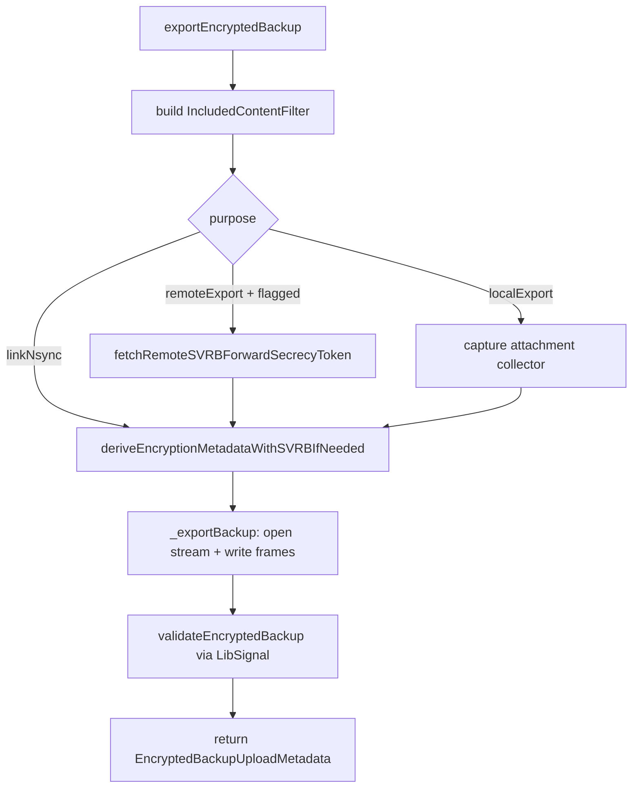
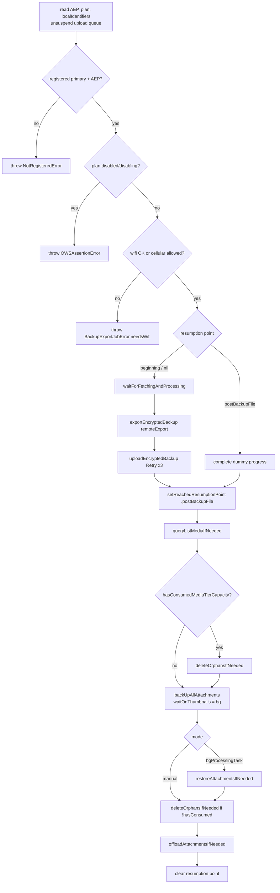

# Backups — Archive & Export

Covers the **export half** of the backup lifecycle: how the database is walked
and serialized into the proto stream, what content is included, how full-text
search is re-indexed, and the job that orchestrates a complete "do a Backup"
operation (file export → upload → attachment upload → cleanup).

Primary source:

- `SignalServiceKit/Backups/Archiving/BackupArchiveManagerImpl.swift` (export half)
- `SignalServiceKit/Backups/Archiving/BackupArchiveManager.swift` (protocol)
- `SignalServiceKit/Backups/Archiving/BackupArchive+IncludedContentFilter.swift`
- `SignalServiceKit/Backups/Archiving/BackupArchiveFullTextSearchIndexer.swift`
- `SignalServiceKit/Backups/Archiving/BackupArchiveErrorStore.swift`
- `SignalServiceKit/Backups/BackupExportJob/{BackupExportJob,BackupExportJobRunner,BackupExportJobStore}.swift`
- `SignalServiceKit/Backups/BackupExportLock.swift`

Encryption, key derivation, and the file-stream transform chain live in
[encryption-and-keys.md](encryption-and-keys.md). Attachment upload is in
[attachment-queues-and-offloading.md](attachment-queues-and-offloading.md).

---

## `BackupArchiveManager` — the top-level API — `BackupArchiveManager.swift:22`

A single protocol covers both export and import. **[High]**

| Method | Line | Purpose |
| --- | --- | --- |
| `backupCdnInfo(backupKey:backupAuth:logger:)` | 27 | HEAD-style info (+ nonce header) for the current remote backup. |
| `downloadEncryptedBackup(...)` | 35 | Download the encrypted backup file to a temp URL. |
| `uploadEncryptedBackup(...)` | 44 | Upload a locally-exported encrypted file. |
| `exportEncryptedBackup(localIdentifiers:backupPurpose:progress:logger:)` | 56 | Produce an encrypted backup file on disk. |
| `backupRestoreState(tx:)` | 71 | `none` / `unfinalized` / `finalized`. |
| `importEncryptedBackup(...)` | 76 | Import from an encrypted file. |
| `finalizeBackupImport(progress:)` | 97 | Idempotent post-import finalization. |
| `scheduleRestoreFromSVRBBeforeNextExport(tx:)` | 101 | Flag that forces an SVRB restore before the next remote export. |

`#if TESTABLE_BUILD` adds plaintext export/import variants for round-trip
integration tests (`:62`, `:91`). **[High]**

---

## Export orchestration — `exportEncryptedBackup` — `BackupArchiveManagerImpl.swift:258`

The public entry point sets up the content filter, resolves encryption
metadata, writes the stream, and validates. **[High]**

1. Create a `BackupArchiveAttachmentByteCounter` and capture `startDate`
   (`:263-264`).
2. Build the `IncludedContentFilter` from the purpose's `libsignalPurpose`
   (`:267`). See [§ Included content filter](#included-content-filter).
3. Branch on purpose (`:271`):
   - **`remoteExport`**: if a prior call flagged `scheduleRestoreFromSVRBBeforeNextExport`,
     first fetch the SVRB forward-secrecy token so the local and remote nonce
     chains agree *before* writing a new backup (`:277-299`). An
     `SVRBError.unrecoverable` here is swallowed (treated as "no prior backup").
   - **`linkNsync`**: no pre-step.
   - **`localExport`**: capture the `LocalFileBackupAttachmentCollector` — its
     presence through the context is what signals "this is a local file backup"
     to downstream archivers (`:304`).
4. `deriveEncryptionMetadataWithSVRBIfNeeded` (`:308`) — for remote, this
   performs the SVRB store and returns the key, the plaintext nonce header, and
   the nonce metadata to persist on upload success. See
   [encryption-and-keys.md § nonce chain](encryption-and-keys.md#the-forward-secrecy-nonce-chain).
5. `_exportBackup(...)` (`:316`) opens the encrypted output stream and writes all
   frames.
6. `validateEncryptedBackup(...)` (`:329`) round-trips the just-written file
   through LibSignal's validator.

### `_exportBackup` outer wrapper — `BackupArchiveManagerImpl.swift:372`

Sets up progress children ("Oversize Text Attachments" = 5 units, "Export Frames"
= 95 units; `:386-401`), pre-populates the oversize-text table (`:409`), ensures
a Media Root Backup Key exists (`getOrGenerateMediaRootBackupKey`, `:413`), then
runs the inner writer inside a `BenchMemory` block within a single `db.read`
(`:418-446`). **[High]**

### `_exportBackup` frame writer — `BackupArchiveManagerImpl.swift:450`

Writes the header and then each archiver's frames **in a fixed order**, each in
its own `autoreleasepool`, checking `Task.checkCancellation()` between stages.
**[High]** The order (`:487-704`):

- The **header** (`writeHeader`, `:721`) writes a `BackupProto_BackupInfo` with
  `version`, `backupTimeMs`, `currentAppVersion`, `firstAppVersion`, and the
  **serialized Media Root Backup Key** (`:730-737`). **[High]** The MRBK travels
  *inside* the (encrypted) backup so a restoring device can derive media keys.
- Recipient archivers return `.success` / `.partialSuccess([errors])` /
  `.completeFailure(error)`; **partial failures are collected but do not abort**,
  while a complete failure throws `BackupError` and aborts (`:584-620`, etc.).
  **[High]**
- All collected errors flow to `processErrors(errors:didFail:)` (`:716`,
  defined `:1461`), which collapses, logs, and — only for internal builds —
  records an error flag.

#### Edge cases / validation (export)

- **MRBK must exist**: if `getMediaRootBackupKey` returns nil mid-export (should
  never happen on a primary), the export throws `OWSAssertionError`
  (`:479`). **[High]**
- **Cancellation**: cooperative; checked between every archiver stage. A
  cancelled export propagates `CancellationError` out of the `Result` catch
  (`:487`+). **[High]**

---

## Included content filter — `BackupArchive+IncludedContentFilter.swift:9`

Decides which messages/attachments are eligible for a given purpose. **[High]**

| Field | `.remoteBackup` | `.deviceTransfer` (Link'n'Sync) |
| --- | --- | --- |
| `minExpirationTimeMs` | `dayInMs` (skip timers ≤ 1 day) | `0` (keep all) |
| `minRemainingTimeUntilExpirationMs` | `dayInMs` (skip msgs expiring < 1 day) | `0` |
| `shouldTombstoneViewOnce` | `true` (treat unviewed as viewed) | `false` |
| `shouldIncludePin` | `true` | `true` |

- `shouldSkipMessageBasedOnExpiration(expireStartDate:expiresInMs:currentTimestamp:)`
  (`:72`): non-expiring messages are never skipped; a timer `≤ minExpirationTimeMs`
  is always skipped; a started timer is skipped if it will expire within
  `minRemainingTimeUntilExpirationMs`. **[High]**
- `shouldSkipAttachment(owningMessage:currentTimestamp:)` (`:103`): skips if the
  owning message is expiration-skipped, or if it's a view-once message and the
  purpose tombstones view-once. Note the doc comment: skipping only affects
  *this* owner's media-tier upload; a de-duplicated attachment with another
  owner may still upload (`:98-102`). **[High]**

> **Rationale (stated in source):** short-lived messages aren't worth backing up
> because they'd likely expire before/soon after restore. **[High]**

---

## Full-text search re-indexing — `BackupArchiveFullTextSearchIndexer.swift:7`

Restoring inserts interactions directly (bypassing normal insert hooks), so the
search index must be rebuilt. The indexer has two halves. **[High]**

- `indexThreads(tx:)` (`:63`): indexes searchable **thread** names synchronously
  inside the restore transaction (cheap; p99 thread count is small — comment at
  `:11`). **[High]**
- `scheduleMessagesJob(tx:)` (`:67`): records the current max interaction row id,
  then on sync-completion enqueues a background job on a `SerialTaskQueue`
  (`:67-85`). **[High]**
- `runMessagesJobIfNeeded()` (`:87`): uses `TimeGatedBatch.processAll`
  (`yieldTxAfter: 0.1`, `delayTwixtTx: 0.2`) to walk interactions from the stored
  min-exclusive to max-inclusive row id, FTS-indexing each `TSMessage` and
  saving `TSMention` rows for body-range mentions (`:170-192`). Progress is
  persisted via `minInteractionRowIdKey` / `maxInteractionRowIdKey` in the
  `BackupFullTextSearchIndexerImpl` kv collection so it survives app restarts
  (`:220-235`). **[High]**
- The job auto-runs on `appReadiness.runNowOrWhenAppDidBecomeReadyAsync`
  (`:56`). **[High]**

---

## The Backup export job — `BackupExportJob/BackupExportJob.swift`

Orchestrates a full "perform a Backup" operation across four progress stages.
**[High]**

### Stages — `BackupExportJob.swift:7`

`BackupExportJobStage: OWSSequentialProgressStep` with `progressUnitCount = 1000`
each (`:16-21`): **[High]**

1. `backupFileExport`
2. `backupFileUpload`
3. `attachmentUpload`
4. `attachmentProcessing`

### Modes — `:25`

`BackupExportJobMode` is `.manual` or `.bgProcessingTask` (`:25-37`). The
background mode wraps the run in `setIsMainAppAndActiveOverride(true/false)` on
both attachment queue status managers so queues believe the app is foregrounded
(`BackupExportJob.swift:107-124`). **[High]**

### `_run` flow — `BackupExportJob.swift:127`

Key facts: **[High]**

- Preconditions read in one write tx (`:131-166`): registered **primary**, an
  `AccountEntropyPool`, and `localIdentifiers`; it also unsuspends the upload
  queue. Missing any → `NotRegisteredError`.
- Plan `.disabled`/`.disabling` → `OWSAssertionError` (`:170-175`).
- **Wifi gate** (`:177-185`): unless `shouldAllowBackupUploadsOnCellular`, if not
  reachable via wifi, throws `BackupExportJobError.needsWifi` *before* generating
  the backup.
- Export uses `.remoteExport(key:, chatAuth: .implicit())` (`:205`).
- Upload wrapped in `Retry.performWithBackoff(maxAttempts: 3, …)` gated by
  `isRetryableNetworkOrUploadError` (`:214`, helper `:338`).
- `.postBackupFile` resumption skips file export/upload by completing "dummy"
  progress (`:230-234`).
- List-media (and, if `hasConsumedMediaTierCapacity`, orphan deletion) is itself
  retried `maxAttempts: 3` (`:246-253`).
- `waitOnThumbnails` is `true` for background, `false` for manual (`:259-264`).
- Post-upload: background mode also runs `restoreAttachmentsIfNeeded`; both modes
  run `deleteOrphansIfNeeded` (if not already run) then `offloadAttachmentsIfNeeded`
  (`:267-281`).

### Error / cancellation accounting — `BackupExportJob.swift:289-316`

- On **cancellation**: clears the resumption point; background increments the
  background error count; manual **suspends** the upload queue. **[High]**
- On **error**: clears the resumption point; increments either the background or
  interactive error count by mode. **[High]**

These counts feed badge logic in
[settings-and-plan.md § failure state](settings-and-plan.md#failure--badge-state).

### Resumption points — `BackupExportJobStore.swift:27`

`ResumptionPoint` is `beginning = 0` / `postBackupFile = 1`, persisted in the
`BackupExportJobStore` kv collection (`:27-42`). **[High]**

### Overlap prevention — `BackupExportJobRunner.swift:12`

`BackupExportJobRunner` wraps `BackupExportJob` to **prevent overlapping runs**,
expose an `AsyncStream` of progress/completion updates, support `resumeIfNecessary`
/ `cancelIfRunning` / `startIfNecessary`, and guard mutual exclusion with
`BackupExportLock` (`:48-80`). **[High]**

---

## Local file export (brief)

A **local file backup** reuses the same archiver pipeline with
`BackupExportPurpose.localExport(key:attachmentCollector:)`. The presence of the
`LocalFileBackupAttachmentCollector` in the archiving context tells attachment
archivers to collect attachments for local storage rather than scheduling
media-tier uploads
(`BackupArchive+Contexts.swift:30`, `BackupPurpose.swift:60`). The file I/O,
`UIDocumentPicker` flow, security-scoped bookmarks, `FileStructure`
(`SignalBackups/files/main/metadata`, `signal-backup-<UTC date>` directories),
`maxAllowedNumberOfBackups = 2`, and `attachmentBatchSize = 50` live in
`LocalFileBackup/LocalFileBackupManager.swift:21-80`. **[High]** This doc set
treats local file backup as a thin wrapper and does not reconstruct it in full;
the orchestration (`LocalFileBackupExportJob`/`Runner`/`Store`) mirrors the
remote `BackupExportJob`. **[Medium]** — inferred from parallel naming/structure.

---

## Feature flags affecting export

From `SignalServiceKit/Environment/BuildFlags.swift:35`: **[High]**

| Flag | Enabled when | Effect |
| --- | --- | --- |
| `Backups.detailedBenchLogging` | `build <= .internal` | Sets `memorySamplerFrameRatio` to `0.001` (vs `0`) for memory sampling (`BackupArchiveManagerImpl.swift:22`). |
| `Backups.archiveErrorDisplay` | `build <= .internal` | Gates `BackupArchiveErrorStore` reads/writes (`BackupArchiveErrorStore.swift:21`, `:29`). |
| `LocalFileBackups.archive` | `true` | Enables local file backup archiving (`BuildFlags.swift:76`). |

See [settings-and-plan.md § feature flags](settings-and-plan.md#feature-flags) for
the full `Backups` flag table.
