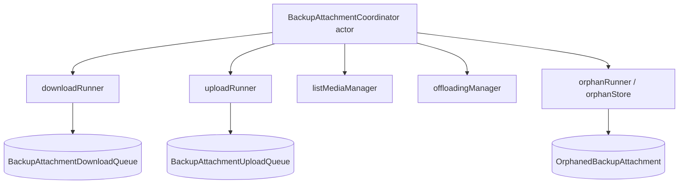
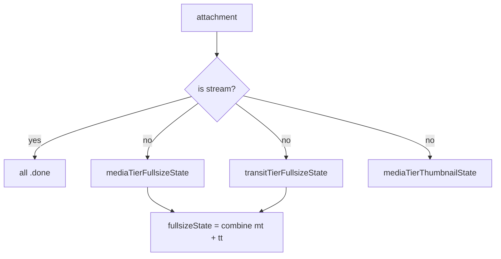
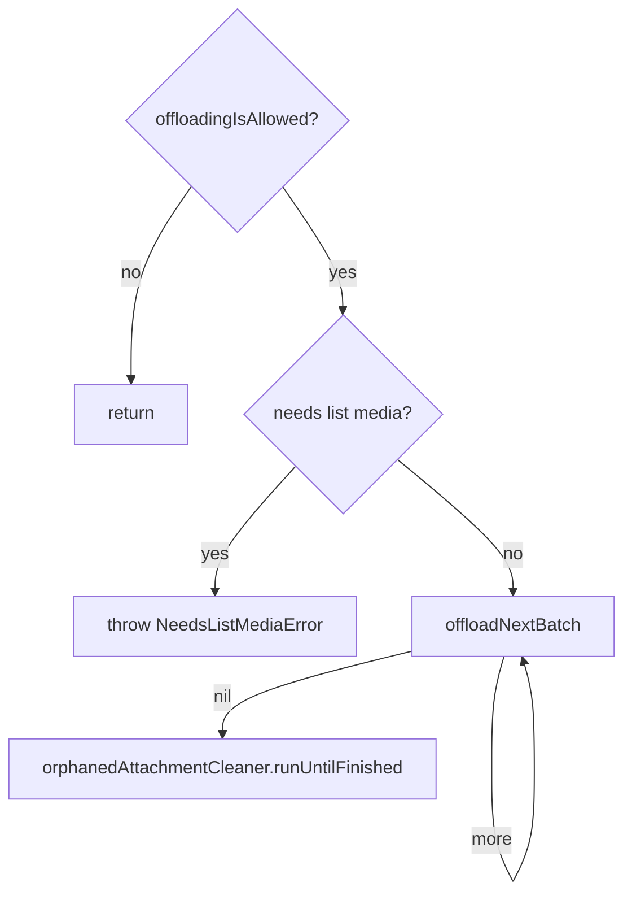

# Backups — Attachment Queues & Offloading

Attachment *files* are not in the backup proto stream. On the paid tier they live
on the **media tier** CDN; this doc covers the queues that upload them there and
download them back, the coordinator that serializes those operations, the
eligibility rules, list-media reconciliation, offloading ("optimize local
storage"), orphan cleanup, and upload eras.

Primary source: `SignalServiceKit/Backups/Attachments/`

- `BackupAttachmentCoordinator.swift`
- `BackupAttachmentDownloadEligibility.swift`
- `BackupAttachmentUploadQueueRunner.swift`, `BackupAttachmentDownloadQueueRunner.swift`
- `BackupAttachment{Upload,Download}Scheduler.swift`, `...Store.swift`, `...Progress.swift`, `...QueueStatusManager.swift`
- `BackupAttachmentUploadEraStore.swift`
- `BackupListMediaManager.swift`, `BackupListMediaStore.swift`
- `AttachmentOffloadingManager.swift`
- `Orphaned*BackupAttachment*.swift`
- Records: see [proto-and-record-model.md](proto-and-record-model.md#grdb-record-types-backing-the-queuesstores)

---

## The coordinator — `BackupAttachmentCoordinator.swift:14`

An **`actor`** (`BackupAttachmentCoordinatorImpl`, `:67`) that serializes all
backup-attachment operations so their async state updates don't race. **[High]**
Callers that want to start/await uploads or downloads go through it.

| Method | Line | Purpose |
| --- | --- | --- |
| `restoreAttachmentsIfNeeded()` | 29 | Drain the download queue (newest-first), fullsize + thumbnail as appropriate. |
| `backUpAllAttachments(waitOnThumbnails:)` | 44 | Drain the upload queue (fresh upload or transit→media copy; thumbnails too). |
| `queryListMediaIfNeeded()` | 51 | Reconcile local state with the server's media list. |
| `deleteOrphansIfNeeded()` | 57 | Run remote deletions; only after uploads to avoid races. |
| `offloadAttachmentsIfNeeded()` | 68 | Delete local files eligible for offloading. |

All methods are cooperatively cancellable and return immediately when there's
nothing to do (per their doc comments). **[High]**

On main-app-ready the coordinator starts observing external events and schedules
the operations in order:
`[.listMedia, .downloadFullsize, .downloadThumbnail, .uploadFullsize, .uploadThumbnail]`
(`:109-117`). **[High]**

The notification `startBackupAttachmentUploadQueue` (`:7`) is a trigger to begin
uploads asynchronously. **[High]**

---

## Download eligibility — `BackupAttachmentDownloadEligibility.swift:10`

For a given attachment, computes three independent states plus a combined
fullsize state. Each is `nil` ("can't download from this tier at all"),
`.ineligible` ("plan currently forbids"), `.ready`, or `.done`. **[High]**

- `thumbnailMediaTierState`, `fullsizeTransitTierState`, `fullsizeMediaTierState`
  (`:13-19`).
- `fullsizeState` (`:21`) combines media + transit: `done` if either is done;
  `ready` if either is ready; `ineligible` if the only available tier is
  ineligible; `nil` if neither tier has the attachment. **[High]**
- `canDownloadMediaTierFullsize` (`:40`): true when media-tier fullsize is
  `ineligible` or `ready`. **[High]**
- If the attachment is already a stream, all three states are `.done` (`:103`). **[High]**

### `mediaTierFullsizeState` — `:135`

Requires `mediaName != nil` and `mediaTierInfo != nil` (else `nil`). Then by plan: **[High]**

| Plan | Result |
| --- | --- |
| `.disabled` | `.ineligible` (never media-tier download when disabled) |
| `.disabling` | `.ready` (download everything while disabling) |
| `.free` | `.ready` (treated like paid-optimize-off for *eligibility*) |
| `.paid*` optimize **off** | `.ready` |
| `.paid*` optimize **on** | `.ineligible` if newest owner older than `Attachment.offloadingThreshold` (30 days), else `.ready` |

### `mediaTierThumbnailState` — `:184`

`nil` if no `mediaName`; `.done` if we already have the stream or a local
thumbnail. Then: **[High]**

- `.disabled`/`.disabling` → `.ineligible`.
- free / optimize-off → thumbnails are **not** downloaded by default; only
  `.ready` if a fullsize download already failed (`mediaTierInfo?.lastDownloadAttemptTimestamp != nil`).
- optimize-on → `.ready` only for attachments **older** than the offloading
  threshold (we keep thumbnails for offloaded media), else `.ineligible`.

### `transitTierFullsizeState` — `:225`

`nil` if no `latestTransitTierInfo`. Then: **[High]**

- paid + optimize-on → `.ineligible` (prefer media tier).
- `.disabled` on a **primary** → `.ineligible`; on a **linked** device it falls
  through (Link'n'Sync can still restore from transit even with backups disabled).
- otherwise → `.ready` if the upload is younger than `remoteConfig.messageQueueTime`
  (~45 days), falling back to the most-recent-reference timestamp; else `nil`.

---

## Upload queue runner — `BackupAttachmentUploadQueueRunner.swift:8`

`backUpAllAttachments(mode:)` drains `BackupAttachmentUploadQueue`, either
**freshly uploading** or **copying transit→media**, generating/uploading
thumbnails as needed (`:10-23`). **[High]**

- **Two separate `TaskQueueLoader`s** — `fullsizeTaskQueue` and
  `thumbnailTaskQueue` — because more thumbnails are allowed in parallel than
  fullsize uploads (`:40-44`). **[High]**
- Delegates actual byte upload to `AttachmentUploadManager`; this queue only
  governs ordering/eligibility (per `QueuedBackupAttachmentUpload` header comment).
  **[High]**

### Upload eras — `BackupAttachmentUploadEraStore.swift:9`

An **upload era** identifies "when something was uploaded relative to events that
might require re-upload". kv collection `BackupUploadEraStore`. **[High]**

- `currentUploadEra(tx:)` (`:24`): persisted string, default `"initialUploadEra"`.
- `rotateUploadEra(tx:)` (`:34`): sets a random 32-byte base64 string. Rotating
  implicitly marks all prior-era attachments as possibly needing re-upload, which
  triggers a list-media on next run (`:5-14`). Rotation happens when the user
  **becomes paid tier** (see
  [settings-and-plan.md § plan transitions](settings-and-plan.md#plan-transitions-and-their-side-effects)). **[High]**

---

## Download queue runner (overview) — `BackupAttachmentDownloadQueueRunner.swift`

Drains `BackupAttachmentDownloadQueue` in LIFO/newest-first order into the real
`AttachmentDownloadQueue`, respecting `BackupAttachmentDownloadEligibility` and
the suspension flag. **[Medium]** — read at the protocol/structure level; the
36 KB runner body was not read line-by-line.

Status managers (`BackupAttachment{Upload,Download}QueueStatusManager.swift`)
track whether the queue is runnable (app-active, network, battery, suspension)
and expose `setIsMainAppAndActiveOverride(_:)` used by the background export job
(`BackupExportJob.swift:116-122`). **[High]** for that call site; **[Medium]** for
the full status-manager state machine.

Progress reporters (`BackupAttachment{Upload,Download}Progress.swift`) aggregate
byte progress for UI. **[Medium]**

---

## List-media reconciliation — `BackupListMediaManager.swift`

Queries the server's media list and reconciles it against local state. **[High]**

- `queryListMediaIfNeeded()` is gated by a "needs" flag; the offloading manager
  throws `NeedsListMediaError` if a list-media is pending (`AttachmentOffloadingManager.swift:117-120`,
  `getNeedsQueryListMedia`). **[High]**
- `ListMediaIntegrityCheckResult` (`BackupListMediaManager.swift:9`) records
  per-size counts: `uploadedCount` / `ineligibleCount` (both "good"),
  `missingFromCdnCount`, `notScheduledForUploadCount`, `discoveredOnCdnCount`
  (all "bad"), each with up-to-10 sample attachment ids (`:11-51`). `hasFailures`
  ignores the very first run (no uploads yet), thumbnail failures, and un-deleted
  orphans (`:60-72`). **[High]**

Reconciliation outcomes feed the two queues (enqueue missing uploads) and the
orphan table (enqueue `discoveredOnServer` deletions). **[Medium]** — inferred
from the result fields + orphan record constructors; the 69 KB manager body was
not read in full.

---

## Offloading ("optimize local storage") — `AttachmentOffloadingManager.swift:40`

Deletes local attachment files that can be re-downloaded from the media tier,
freeing device storage. **[High]**

### Thresholds — `Attachment.offloadingThreshold` / `offloadingViewThreshold`

- `offloadingThreshold = 30 * .day` — measured from the newest owning message's
  receive time (`:9-13`). **[High]**
- `offloadingViewThreshold = 7 * .day` — don't offload something viewed in the
  last week (`:16-20`). **[High]**
- Both collapse to `0` when the internal `offloadingThresholdOverride` debug flag
  is set (`:23-30`). **[High]**

### Batch loop — `offloadAttachmentsIfNeeded` — `:84`

- Batch caps: `maxThumbnailedAttachmentsPerBatch = 5`,
  `maxOffloadedAttachmentsPerBatch = 50`, `maxCheckedAttachmentsPerBatch = 100`
  (`:111-113`). **[High]**
- Candidate query (`:124-150`): only attachments that are **downloaded**
  (`localRelativeFilePath != nil`), in the **current upload era**
  (`mediaTierUploadEra == currentUploadEra`), have a `mediaTierCdnNumber`, and
  were **not viewed since** `now − offloadingViewThreshold`. **[High]**
- Each candidate must still pass `shouldAttachmentBeOffloaded(...)` against its
  most-recent offloadable reference (`:171-178`). **[High]**
- Offloading is "very expensive" and meant for a non-user-blocking context like
  the overnight BG task (doc comment `:33-38`). **[High]**

---

## Orphan cleanup — `Orphaned*BackupAttachment*.swift`

- `OrphanedBackupAttachmentStore` / `OrphanedBackupAttachmentScheduler` /
  `OrphanedBackupAttachmentQueueRunner` manage the `OrphanedBackupAttachment`
  table, deleting media-tier CDN objects. **[Medium]** — read at
  record/structure level.
- The record distinguishes `locallyOrphaned` (we know `mediaName`) from
  `discoveredOnServer` (we only know `mediaId`, can't tell fullsize vs thumbnail)
  — see [proto-and-record-model.md](proto-and-record-model.md#orphanedbackupattachment--attachmentsorphanedbackupattachmentswift11).
  **[High]**
- The coordinator runs deletions **only after uploads** to avoid deleting
  something about to be re-referenced (`BackupAttachmentCoordinator.swift:55-57`).
  **[High]**

---

## Edge cases & feature flags

- **Free tier keeps the upload queue populated but doesn't run it** — only runs
  uploads on paid tier (`QueuedBackupAttachmentUpload.swift:24-28`). **[High]**
- **`hasConsumedMediaTierCapacity`**: when the server rejects a transit→media
  copy for being out of space, this flag is set and uploads stop until cleanup
  (`BackupSettingsStore.swift` `setHasConsumedMediaTierCapacity`); the export job
  front-loads orphan deletion when it's set
  (`BackupExportJob.swift:247-253`). **[High]**
- `BuildFlags.Backups.useLowerDefaultListMediaRefreshInterval` (`build <= .beta`)
  shortens the list-media refresh cadence (`BuildFlags.swift:44`). **[High]**
- `BuildFlags.Backups.mediaErrorDisplay` (`build <= .beta`) gates media error UI
  (`BuildFlags.swift:43`). **[High]**
- `BuildFlags.Backups.showOptimizeMedia` (`build <= .dev`) gates the
  optimize-media setting UI (`BuildFlags.swift:36`). **[High]**
