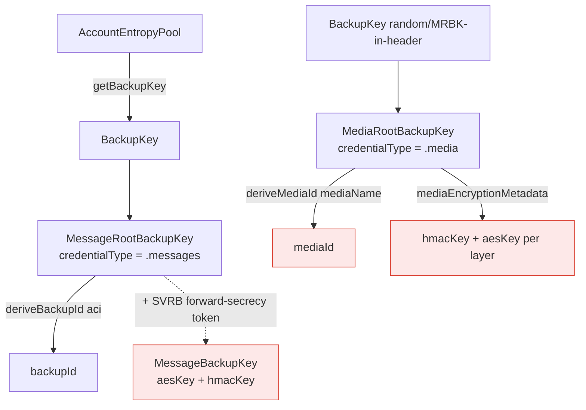
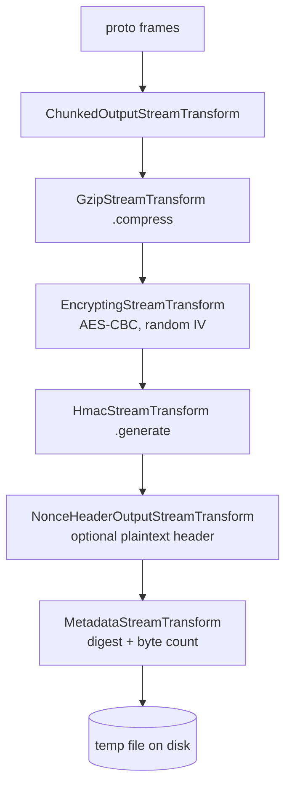
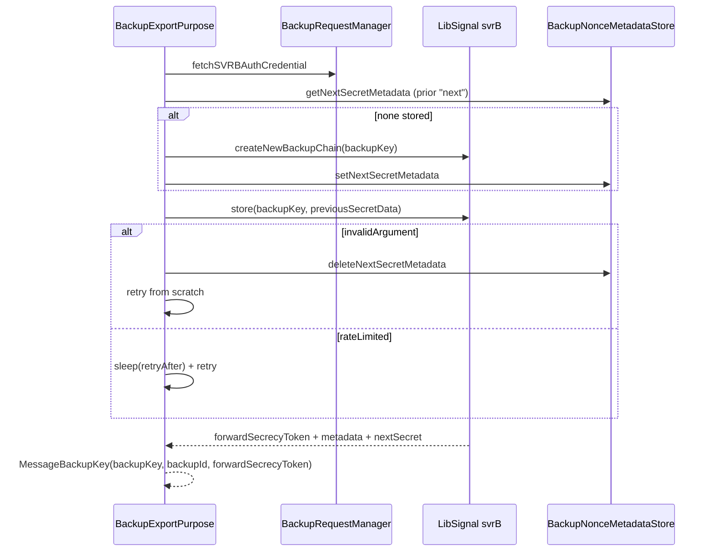

# Backups — Encryption & Key Material

Covers the key material that encrypts the backup file and media, the on-disk
file-stream transform chain, the plaintext forward-secrecy nonce header and the
SVRB-backed nonce chain, and how the three backup purposes derive their keys.

Primary source:

- `SignalServiceKit/Backups/MessageRootBackupKey.swift`
- `SignalServiceKit/Backups/MediaRootBackupKey.swift`
- `SignalServiceKit/Backups/BackupKeyMaterial.swift`
- `SignalServiceKit/Backups/Archiving/BackupPurpose.swift`
- `SignalServiceKit/Backups/Archiving/BackupNonceMetadataStore.swift`
- `SignalServiceKit/Backups/Archiving/FileStreams/BackupArchiveProtoStreamProvider.swift`

> Many cryptographic transforms (the actual `MessageBackupKey` derivation,
> `BackupKey.deriveMediaId`, `svrB.store/restore`, `validateMessageBackup`) live
> inside **LibSignalClient**, which is a dependency and not in this tree. Claims
> about their *inputs/outputs* are **[High]**; claims about their internal
> mechanics are **[Medium]** at best.

---

## Key material hierarchy

### `BackupKeyMaterial` protocol — `BackupKeyMaterial.swift:8`

Common surface for both root keys: `credentialType`, `backupKey`, `serialize()`,
`deriveEcKey(aci:)`, `deriveBackupId(aci:)`. The extension defaults all three
derivations to the underlying `BackupKey` (`:16-27`). **[High]**

### `MessageRootBackupKey` — `MessageRootBackupKey.swift:9`

- `credentialType = .messages` (`:10`). **[High]**
- Constructed from an `AccountEntropyPool` + `Aci`: `backupKey = aep.getBackupKey()`,
  `backupId = backupKey.deriveBackupId(aci:)`, plus `aci` and a `loggingKey`
  (`:17-26`). **[High]**
- The backup file is encrypted with this key for both **remote** and **local**
  exports. **[High]** — see [§ purposes](#the-three-purposes).

### `MediaRootBackupKey` (MRBK) — `MediaRootBackupKey.swift:22`

- `credentialType = .media` (`:23`). **[High]**
- `deriveMediaId(_ mediaName:)` (`:30`) maps a content-addressed media name to a
  server media id. **[High]**
- `mediaEncryptionMetadata(mediaName:type:)` (`:40`) returns a
  `MediaTierEncryptionMetadata` with a derived 64-byte key split into
  `hmacKey = prefix(32)` and `aesKey = next 32` (`owsPrecondition(keyBytes.count >= 64)`,
  `:52-58`). **[High]**
- `MediaTierEncryptionType` (`:8`): **[High]**
  - `.outerLayerFullsizeOrThumbnail` → `deriveMediaEncryptionKey(mediaId)`
  - `.transitTierThumbnail` → `deriveThumbnailTransitEncryptionKey(mediaId)`
- `MediaTierEncryptionMetadata.attachmentKey()` (`:19`) assembles an
  `AttachmentKey(combinedKey: aesKey + hmacKey)`. **[High]**

> The MRBK is generated locally (`getOrGenerateMediaRootBackupKey`) and
> **travels inside the encrypted backup header** so a restoring device can
> re-derive media keys (`BackupArchiveManagerImpl.swift:736`, `:1043`). **[High]**

---

## The on-disk file-stream transform chain — `BackupArchiveProtoStreamProvider.swift`

A backup file is a sequence of varint-length-delimited protos ("frames"). Two
providers exist: **plaintext** (tests only) and **encrypted**. **[High]**

### Encrypted output (export) — `openEncryptedOutputFileStream` — `:106`

Transforms applied in order (data flows top→bottom before hitting disk):

Source: `:120-137`. The metadata provider returns an
`Upload.EncryptedBackupUploadMetadata` with `digest`, `encryptedDataLength`,
remote/local attachment byte sizes, and the `nonceMetadata` to persist on upload
success (`:142-157`). The temp file is created
`isAvailableWhileDeviceLocked: true` (`:302`). **[High]**

### Encrypted input (import) — `openEncryptedInputFileStream` — `:166`

1. **Pre-validate the HMAC** by streaming the whole file through only
   `NonceHeader → Hmac(.validate)` (`validateBackupHMAC`, `:189`). If this fails,
   returns `.hmacValidationFailedOnEncryptedFile` (`:171-173`). **[High]**
2. Then the real read chain: `NonceHeader → (progress) → Hmac(.validate) →
   Decrypting → Gzip(.decompress) → ChunkedInput` (`:177-184`). **[High]**

### `OpenInputStreamResult` — `BackupArchive+Contexts`-adjacent enum — `:17`

`success` / `fileNotFound` / `unableToOpenFileStream` /
`hmacValidationFailedOnEncryptedFile`. **[High]**

---

## The three purposes — `BackupPurpose.swift`

### Export: `BackupExportPurpose` — `:48`

| Case | Key input | SVRB | Content |
| --- | --- | --- | --- |
| `remoteExport(key:chatAuth:)` | `MessageRootBackupKey` | **store** → forward-secrecy token + header | filtered |
| `linkNsync(ephemeralKey:aci:)` | one-time `BackupKey` + ACI | none | everything (`.deviceTransfer`) |
| `localExport(key:attachmentCollector:)` | `MessageRootBackupKey` | none | filtered |

### Import: `BackupImportSource` — `:12`

| Case | Key input | Nonce source |
| --- | --- | --- |
| `remote(key:nonceSource:)` | `MessageRootBackupKey` | `.provisioningMessage(token)` **or** `.svrB(header:auth:)` |
| `linkNsync(ephemeralKey:aci:)` | one-time `BackupKey` + ACI | none |
| `local(key:)` | `MessageRootBackupKey` | none |

`libsignalPurpose` maps `linkNsync → .deviceTransfer`, everything else
`→ .remoteBackup` (`:66-92`). **[High]**

---

## The forward-secrecy nonce chain

Remote backups use SVRB (Secure Value Recovery for Backups) to store a
**forward-secrecy token** so that even if the AEP leaks, prior backups aren't
trivially decryptable without also compromising SVRB. **[Medium]** — the
*purpose* is inferred from naming + comments; the enclave mechanics are in
LibSignal/SVRB.

### `BackupNonce` types — `BackupNonceMetadataStore.swift:11`

- `magicFileSignature` = `SBACKUP\x01` (bytes `[83,66,65,67,75,85,80,01]`, `:29`). **[High]**
- `MetadataHeader` (`:40`): **plaintext**, server-visible, prepended to the
  backup file; a black box to clients that contains what SVRB needs to recover
  the key (`:35-47`). **[High]**
- `NextSecretMetadata` (`:57`): deterministically produces nonce **N+1** so that
  "Backup N can be decrypted using Nonce N or Nonce N+1" — persisted when backup N
  is made so the chain survives a failed upload of backup N+1 (`:50-64`). **[High]**
- `MetadataHeader.from(prefixBytes:)` (`:81`) parses the header from the first
  bytes of the file; `ParsingError` is `unrecognizedFileSignature` /
  `dataMissingOrEmpty` / `headerTooLarge` / `moreDataNeeded(UInt16)` (`:71-77`).
  Because we fetch only the first `metadataHeaderByteLengthUpperBound` bytes
  before downloading the whole file, `moreDataNeeded` tells the caller how many
  more bytes to fetch (`:17-27`). **[High]**

### Store — `BackupNonceMetadataStore` — `:134`

kv collection `"BackupNonceMetadataStore"`. All values are **keyed by
`SHA256(backupKey.serialize())`** so that an AEP rotation (new backup key)
transparently invalidates the stored chain (returns nil). **[High]**

| Method | Line | Note |
| --- | --- | --- |
| `getLastForwardSecrecyToken(for:tx:)` | 143 | nil if backup-key hash mismatches |
| `setLastForwardSecrecyToken(_:for:tx:)` | 170 | call **only** right after a successful CDN upload |
| `getNextSecretMetadata(for:tx:)` | 188 | nil on key mismatch |
| `setNextSecretMetadata(_:for:tx:)` | 214 | call after upload, on first-ever backup, or after restore |
| `deleteNextSecretMetadata(tx:)` | 227 | reset the chain (e.g. SVRB `invalidArgument`) |

### SVRB store on export — `deriveEncryptionMetadataWithSVRBIfNeeded` — `BackupPurpose.swift:291`

Source `:325-399`. On success, returns `EncryptionMetadata{ encryptionKey,
backupId, metadataHeader, nonceMetadata }`; `nonceMetadata` is persisted by
`uploadEncryptedBackup` **only after** the upload succeeds
(`BackupArchiveManagerImpl.swift:238-250`). **[High]**

### SVRB restore on import — `deriveBackupEncryptionKeyWithSVRBIfNeeded` — `BackupPurpose.swift:117`

- `.provisioningMessage(token)` uses the token directly (from Quick Restore
  hand-off; `:124`). **[High]**
- `.svrB(header, auth)` calls `fetchForwardSecrecyTokenFromSvr` (`:168`):
  `svrB.restore(backupKey:, metadata: header.data)`, mapping SVRB errors:
  `invalidArgument`/`svrRestoreFailed` → `SVRBError.unrecoverable`;
  `svrDataMissing` → `SVRBError.incorrectRecoveryKey`; rate-limit → sleep + retry
  (`:187-213`). On success it **immediately persists** the returned
  `nextBackupSecretData` so a subsequent interrupted backup can't lose decryptability
  (`:215-233`). **[High]**

### `SVRBError` — `BackupPurpose.swift:97`

`unrecoverable` (data potentially lost forever) / `incorrectRecoveryKey`
(recoverable by entering a different AEP). **[High]**

---

## Decryption & validation

- **Export** always validates the just-written file via LibSignal's
  `validateMessageBackup(key:purpose:length:makeStream:)`; any unknown fields or
  a `MessageBackupValidationError` sets the internal error flag and throws
  (`BackupArchiveManagerImpl.swift:1487-1515`). **[High]**
- **Import** relies on the HMAC pre-validation in `openEncryptedInputFileStream`
  (above) plus per-frame proto decoding. See
  [restore-and-import.md § validation](restore-and-import.md#validation-summary-import).

---

## Edge cases

- **AEP rotation** silently invalidates the nonce chain (hash-keyed store) — the
  next backup starts a fresh chain via `createNewBackupChain`. **[High]**
- **Upload fails after SVRB store**: because the *next* secret is persisted
  before upload, the previous backup remains decryptable; the comment at
  `BackupPurpose.swift:220-231` documents this intent. **[High]**
- **Link'n'Sync and local exports** never touch SVRB (no `metadataHeader`,
  `nonceMetadata = nil`) — their `openEncryptedOutputFileStream` omits the
  `NonceHeaderOutputStreamTransform` (`BackupArchiveProtoStreamProvider.swift:134`).
  **[High]**
