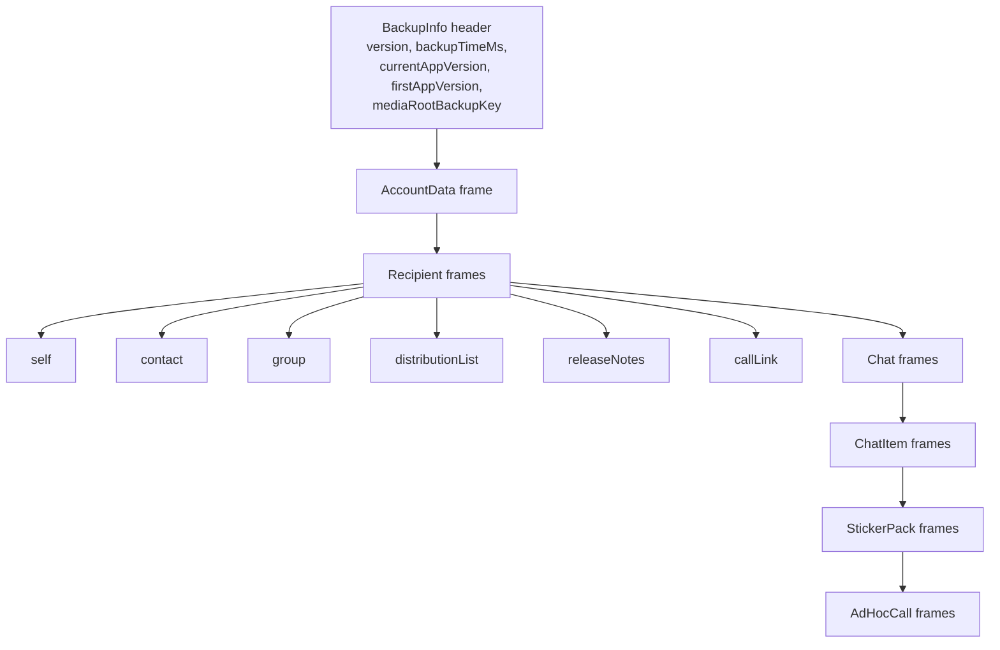

# Backups — Proto & Record Model

Covers the frame/record model of a backup file, the archiver result types, the
archiving/restoring **contexts** passed down to per-type archivers, the **shim**
layer that lets archivers reach the rest of SSK, and the GRDB **record types**
backing the backup queues/stores.

Primary source:

- `SignalServiceKit/Backups/Archiving/BackupArchive+Contexts.swift`
- `SignalServiceKit/Backups/Archiving/Archivers/BackupArchiveProtoStreamWriter.swift`
- `SignalServiceKit/Backups/Archiving/BackupArchive+Shims.swift`
- `SignalServiceKit/Backups/Archiving/Archivers/` (per-type archivers)
- `SignalServiceKit/Backups/Attachments/Queued*`, `Orphaned*`, `BackupLocalFile*` records

> The wire protos themselves (`BackupProto_BackupInfo`, `BackupProto_Frame`,
> `BackupProto_Recipient`, …) are generated types that are **not** in this
> directory; this doc describes how the Swift archiver layer consumes/produces
> them. Claims about proto fields are **[Medium]** unless cited from a `.swift`
> usage.

---

## The frame model

A backup file is: **one `BackupProto_BackupInfo` header**, then a stream of
`BackupProto_Frame` items. Each `Frame` is a oneof over the archived entity
types. The archive/restore order is fixed (see
[archive-and-export.md § frame writer](archive-and-export.md#_exportbackup-frame-writer--backuparchivemanagerimplswift450)).
**[High]** — frame dispatch in `BackupArchiveManagerImpl._importBackup` (`:1225-1320`).

---

## Archiver result types — `BackupArchiveProtoStreamWriter.swift:7`

Archivers report structured results so the orchestrator can decide whether to
continue. **[High]**

| Type | Cases | Line |
| --- | --- | --- |
| `ArchiveSingleFrameResult<T>` | `success(T)` / `failure(ArchiveFrameError)` | 9 |
| `ArchiveMultiFrameResult` | `success` / `partialSuccess([ArchiveFrameError])` / `completeFailure(FatalArchivingError)` | 16 |
| `RestoreFrameResult` | `success` / `unrecognizedEnum(...)` / `partialRestore([...])` / `failure([...])` | 28 |

- **Partial** results are collected but **do not abort** the archive/restore;
  **complete/fatal** failures abort. **[High]** — see the switch arms in
  `_exportBackup` (`BackupArchiveManagerImpl.swift:584-620`) and the
  `restoreFailOnAnyError` gating in `_importBackup`.
- `unrecognizedEnum` on restore means "skip this frame, keep going" — forward
  compatibility for newer proto variants (`:30-32`). **[High]**

---

## Contexts — `BackupArchive+Contexts.swift`

### `ArchivingContext` — `:17`

Base class for all archiver contexts during export. **[High]**

- Holds `localIdentifiers`, `startDate`, `remoteConfig`, `currentUploadEra`,
  the `ArchiveBencher`, the `attachmentByteCounter`, the `IncludedContentFilter`,
  an optional `LocalFileBackupAttachmentCollector`, and `tx` (`:19-45`).
- **Takes a write tx on init but exposes only a `DBReadTransaction`** (`:46-48`):
  archiving holds the write lock (to avoid races with message processing) but is
  not allowed to mutate — the one exception being enqueuing attachment uploads
  (comment `:11-24`). **[High]**
- The presence of `localFileBackupAttachmentCollector` is the signal that "this
  is a local file backup" (`:38`). **[High]**

### `RestoringContext` — `:54`

Base class for restore. Holds `localIdentifiers`, `startDate`, `remoteConfig`,
`attachmentByteCounter`, `isPrimaryDevice`, and a **`DBWriteTransaction`** (`:56-78`).
**[High]**

Specialized subclasses layer on type-specific caches/lookup tables, e.g.
`RecipientArchivingContext`/`RecipientRestoringContext`,
`ChatArchivingContext`/`ChatRestoringContext`,
`ChatItemRestoringContext`, `AccountDataRestoringContext`,
`CustomChatColorArchivingContext` — constructed in `_exportBackup`
(`BackupArchiveManagerImpl.swift:493-575`) and in the `_importBackup` `Contexts`
struct (`:1055-1160`). **[High]**

---

## Shims — `BackupArchive+Shims.swift:11`

Archivers need to read/write state that lives all over SSK (blocking, contacts,
profiles, reactions, receipts, screen-lock, stories, typing indicators, UD, 2FA,
donations, preferences, image quality). To keep archivers testable, each
dependency is accessed through a **`Shim` protocol** with a production
**`Wrapper`** implementation. **[High]**

- `BackupArchive.Shims` (`:12`) and `BackupArchive.Wrappers` (`:30`) are parallel
  `typealias` namespaces. **[High]**
- Example: `_MessageBackup_BlockingManagerShim` exposes
  `blockedRecipientIds`/`blockedGroupIds`/`addBlockedAddress`/`addBlockedGroupId`
  (`:51-58`), with `_MessageBackup_BlockingManagerWrapper` as the real impl
  (`:60`). **[High]**

> This mirrors the dependency-shim pattern used elsewhere in SSK; the goal
> (testability / decoupling) is **[High]** from the comment-free but idiomatic
> structure. **[Medium]**

---

## The per-type archivers (overview) — `Archiving/Archivers/`

Each entity type has an archiver pair (archive + restore) under
`Archivers/`. **[High]** (sizes indicate relative complexity)

| Area | Key files |
| --- | --- |
| Account data | `AccountData/BackupArchiveAccountDataArchiver.swift` |
| Recipients | `Recipient/BackupArchive{Contact,Group,DistributionList,CallLink,LocalRecipient,ReleaseNotes}*.swift` |
| Chats | `Chat/BackupArchiveChatArchiver.swift`, `BackupArchiveChatStyleArchiver.swift` |
| Chat items (messages) | `ChatItem/BackupArchive{ChatItem,TSIncomingMessage,TSOutgoingMessage,TSMessageContents,MessageAttachment,Reaction,Poll,ContactAttachment}Archiver.swift` |
| Sticker packs | `StickerPack/BackupArchiveStickerPackArchiver.swift` |
| Ad-hoc calls | `AdHocCall/BackupArchiveAdHocCallArchiver.swift` |
| Errors | `BackupArchive+Errors.swift` (the `ArchiveFrameError` / `RestoreFrameError` hierarchy, ~58 KB) |
| Post-restore actions | `BackupArchivePostFrameRestoreActionManager.swift` |

> These are documented at the orchestration level here; a per-archiver deep dive
> is out of scope for this doc set. Intent for individual field mappings is
> **undetermined — no evidence in source** beyond the code itself.

---

## GRDB record types backing the queues/stores

These are the persisted shapes used by the attachment subsystem (behavior in
[attachment-queues-and-offloading.md](attachment-queues-and-offloading.md)).

### `QueuedBackupAttachmentDownload` — `Attachments/QueuedBackupAttachmentDownload.swift:17`

Table `BackupAttachmentDownloadQueue` (`:102`). **An intermediary reorder table:**
restore inserts rows here in backup order, then walks them **in reverse (LIFO)**
to enqueue into the real `AttachmentDownloadQueue` (which is FIFO), achieving
newest-first download (`:9-16`). **[High]**

| Field | Line | Note |
| --- | --- | --- |
| `attachmentRowId` | 26 | FK to Attachments |
| `isThumbnail` | 31 | thumbnails only exist on media tier |
| `canDownloadFromMediaTier` | 37 | else transit-tier only; always true for thumbnails |
| `maxOwnerTimestamp` | 46 | newest owning message (nil for non-message) |
| `minRetryTimestamp` | 58 | sort + retry gate; init to `now − maxOwnerTimestamp` |
| `numRetries` | 60 | |
| `state` | 62 | `ineligible = 0` / `ready = 1` / `done = 2` |
| `estimatedByteCount` | 76 | UI estimate only |

### `QueuedBackupAttachmentUpload` — `Attachments/QueuedBackupAttachmentUpload.swift:33`

Table `BackupAttachmentUploadQueue` (`:112`). **The source of truth** for what
needs media-tier upload; also a reorder table (archive order → owner-timestamp
order, newest first). **[High]**

| Field | Line | Note |
| --- | --- | --- |
| `attachmentRowId` | 40 | FK to Attachments |
| `highestPriorityOwnerType` | 48 | `OwnerType.threadWallpaper` (encoded null, "newest") or `.message(timestamp:)` (`:68-73`) |
| `isFullsize` | 53 | both fullsize + thumbnail can be enqueued |
| `estimatedByteCount` | 58 | includes padding + encryption overhead |
| `numRetries` / `minRetryTimestamp` | 61-64 | |
| `state` | 66 | `ready = 0` / `done = 1` (`:75-78`) |

The record comment enumerates insert/remove triggers and notes the queue is
**kept populated even on the free tier** (only *run* on paid) (`:11-32`). **[High]**

### `OrphanedBackupAttachment` — `Attachments/OrphanedBackupAttachment.swift:11`

Table `OrphanedBackupAttachment` (`:94`). Enqueues media-tier CDN objects to
delete. **[High]**

- `locallyOrphaned(cdnNumber:mediaName:type:)` (`:56`): we deleted the local
  attachment and know its `mediaName`.
- `discoveredOnServer(cdnNumber:mediaId:)` (`:71`): list-media found an object
  with no local attachment; we only have the `mediaId` and **cannot tell
  fullsize from thumbnail** (`type = nil`).
- `SizeType`: `fullsize = 0` / `thumbnail = 1` — **hardcoded into SQL triggers;
  changing requires a migration** (comment `:31-33`). **[High]**

### Local file backup records — `Attachments/BackupLocalFileAttachment*Record.swift`

- `BackupLocalFileAttachmentImportRecord` (table `BackupLocalFileAttachmentImport`,
  `:10`): one row per attachment still waiting to be copied *from* a local file
  backup; presence = "not yet copied" (`:7-8`). `insert`/`update` conflict policy
  is `.ignore` (`:15-18`). **[High]**
- `BackupLocalFileAttachmentExportRecord` / `BackupLocalFileAttachmentMetadataRecord`
  are the export-side analogues. **[Medium]** — inferred from file names + the
  import record; not read line-by-line.
