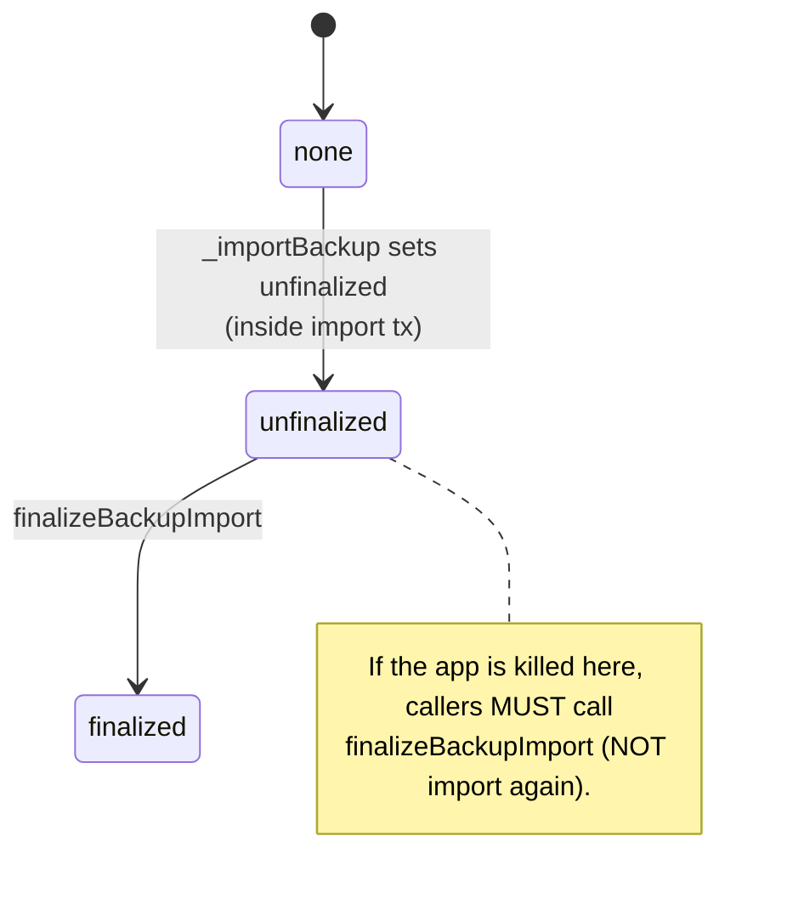
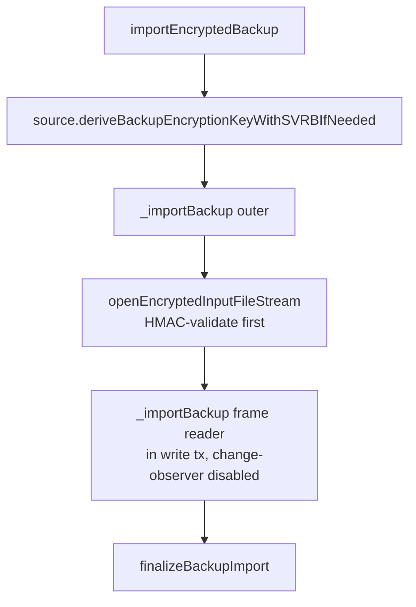
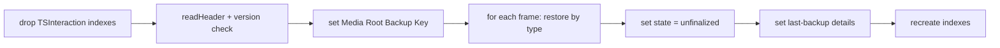
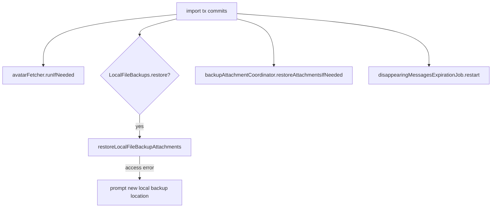

# Backups — Restore & Import

Covers the **import half** of the backup lifecycle: downloading/decrypting is in
[encryption-and-keys.md](encryption-and-keys.md); this doc covers reading the
proto stream frame-by-frame back into the database, the restore state machine,
the index drop/recreate optimization, finalization, and the side effects kicked
off after a restore.

Primary source:

- `SignalServiceKit/Backups/Archiving/BackupArchiveManagerImpl.swift` (import half)

---

## The restore state machine — `BackupArchiveManager.swift:9`

`BackupRestoreState` (persisted raw `Int`): **[High]**

| State | Raw | Meaning |
| --- | --- | --- |
| `none` | `0` | Never restored in this DB's history. |
| `unfinalized` | `100` | Frames imported, but post-restore finalization not done. |
| `finalized` | `200` | Fully restored. |

Stored under `keyValueStoreRestoreStateKey` in the `MessageBackupManager` kv
collection (`BackupArchiveManagerImpl.swift:15-16`, `:748`). **[High]**

- **Importing twice is forbidden**: `_importBackup` throws
  `OWSAssertionError("Restoring from backup twice!")` unless state is `none`
  (`:943-948`). **[High]**
- `finalizeBackupImport` is **idempotent** and only flips state to `finalized`
  after finishing oversize-text restore (`:819-843`). **[High]**

---

## Import orchestration — `importEncryptedBackup` — `BackupArchiveManagerImpl.swift:761`

1. `deriveBackupEncryptionKeyWithSVRBIfNeeded` (`:769`) — for `.remote` with an
   `.svrB` nonce source, fetches the forward-secrecy token from SVRB. See
   [encryption-and-keys.md](encryption-and-keys.md#the-forward-secrecy-nonce-chain).
2. `_importBackup` outer (`:845`) sets up progress children ("Import Frames" = 83,
   "Recreate Indexes" = 12, "Finalize" = 5; `:869-889`), opens the input stream
   inside a `db.awaitableWriteWithRollbackIfThrows` with the
   `DatabaseChangeObserver` disabled (`:909`), and after the tx commits calls
   `appVersion.didRestoreFromBackup(...)` and then `finalizeBackupImport`
   (`:918-925`). **[High]**
3. Stream open failure modes (`:912-921`): `.fileNotFound`,
   `.unableToOpenFileStream`, `.hmacValidationFailedOnEncryptedFile` each throw
   `OWSAssertionError`. **[High]**

### Frame reader — `_importBackup` inner — `BackupArchiveManagerImpl.swift:928`

Runs entirely inside the write transaction. **[High]**

1. Guard restore state is `.none` (`:943`).
2. **Drop all `TSInteraction` indexes** before importing — a major speedup —
   recording the `CREATE INDEX` SQL to recreate later
   (`benchPreFrameRestoreAction(.DropInteractionIndexes)`, `:960`; `dropAllIndexes`,
   `:1408`). SQLite auto-indexes are skipped (`:1417`). **[High]**
3. Read the header (`readHeader`, `:1016`):
   - deserialization failure → records `missingBackupInfoHeader` and throws
     (`:1026-1031`).
   - **version check**: `backupInfo.version == supportedBackupVersion (1)` else
     records `unsupportedBackupInfoVersion` and throws
     `BackupImportError.unsupportedVersion` (`:1035-1040`). **[High]**
   - set the **Media Root Backup Key** from the header
     (`localStorage.setMediaRootBackupKey`, `:1043`); failure records
     `invalidMediaRootBackupKey` and throws (`:1044-1049`). **[High]**
4. Build the restore `Contexts` bundle (account-data, custom-chat-color,
   recipient, chat, chat-item, sticker-pack) sharing one write tx
   (`:1052-1160`). **[High]**
5. **Loop over frames** (`:1170`): per frame, in an `autoreleasepool`, dispatch
   on the frame's `item` oneof — recipient (self/contact/group/distribution-list/
   release-notes/call-link), chat, chat-item, sticker-pack, ad-hoc-call, etc.
   Each archiver returns `.success` / `.partialRestore([errors])` /
   `.unrecognizedEnum` / `.failure([errors])` (`:1255-1330`). **[High]**
6. Set state to `.unfinalized`, populate "last backup details" so the UI doesn't
   imply "no backup", and register sync-completion side effects (`:1330-1393`).
7. **Recreate indexes** that were dropped (`createIndexes`, `:1447`). **[High]**

#### `restoreFailOnAnyError` behavior

Whether a single bad frame aborts the whole restore is gated by
`BuildFlags.Backups.restoreFailOnAnyError` (`build <= .beta`): **[High]**

- A **proto-deserialization error** on a frame: if the flag is set, throws; else
  the frame is skipped (`:1194-1200`). **[High]**
- A recipient/other `.failure`: collected into `frameErrors`; only re-thrown
  (`BackupError`) if the flag is set (`:1322-1328`). **[High]**
- An **empty final frame** cleanly ends the loop (`:1185`). **[High]**

---

## Post-restore side effects (sync-completion) — `BackupArchiveManagerImpl.swift:1346`

Registered via `tx.addSyncCompletion` so they run **after** the import tx
commits. **[High]**

- **Avatar fetches** enqueued during restore are kicked off (`:1352-1357`).
- **Local file backup attachment restore** runs if `BuildFlags.LocalFileBackups.restore`;
  access failures (`.stale`/`.missing`/`.failedToResolveBookmark`/`.trashed`)
  prompt the user to pick a new location; `.noAccess` just logs
  (`:1359-1382`). **[High]**
- **Remote backup attachment restore** via `restoreAttachmentsIfNeeded`
  (`:1385-1390`).
- **Disappearing messages** job is restarted since the import may have inserted
  expiring messages (`:1392`). **[High]**

---

## Finalization — `finalizeBackupImport` — `BackupArchiveManagerImpl.swift:819`

Must be idempotent (partial progress can precede an app kill, per the doc comment
on the protocol method, `BackupArchiveManager.swift:94-96`). **[High]**

1. Finish restoring oversized-text attachments
   (`oversizeTextArchiver.finishRestoringOversizedTextAttachments`, `:832`).
2. Set restore state to `.finalized` (`:836-842`).

> **Operational rule (stated in source):** if `backupRestoreState` returns
> `.unfinalized`, callers MUST call `finalizeBackupImport` and MUST NOT re-import
> (`BackupArchiveManager.swift:92-96`). **[High]**

---

## Validation summary (import)

| Check | Where | Failure |
| --- | --- | --- |
| HMAC of encrypted file | `openEncryptedInputFileStream` → `validateBackupHMAC` | `.hmacValidationFailedOnEncryptedFile` → `OWSAssertionError` (`:919`) |
| File exists / openable | stream open | `.fileNotFound` / `.unableToOpenFileStream` → `OWSAssertionError` (`:914-917`) |
| Not already restored | `_importBackup` | `OWSAssertionError` (`:945`) |
| Header deserializes | `readHeader` | records `missingBackupInfoHeader`, throws (`:1026`) |
| `version == 1` | post-header | `BackupImportError.unsupportedVersion` (`:1039`) |
| MRBK parses | post-header | records `invalidMediaRootBackupKey`, throws (`:1047`) |
| Per-frame proto decode | frame loop | skip or throw per `restoreFailOnAnyError` (`:1194`) |

See [encryption-and-keys.md § validation](encryption-and-keys.md#decryption--validation)
for the LibSignal `validateMessageBackup` pass used on **export** (also reusable
for import integrity).
