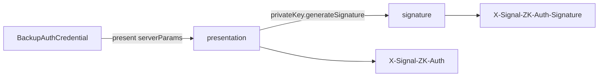
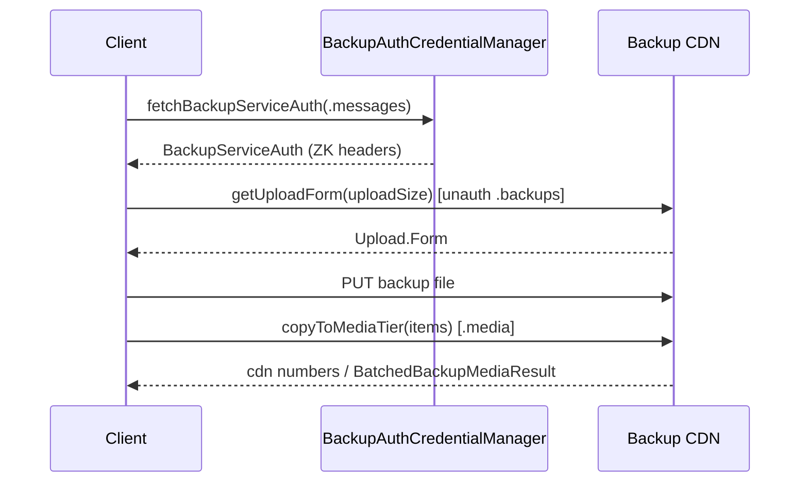
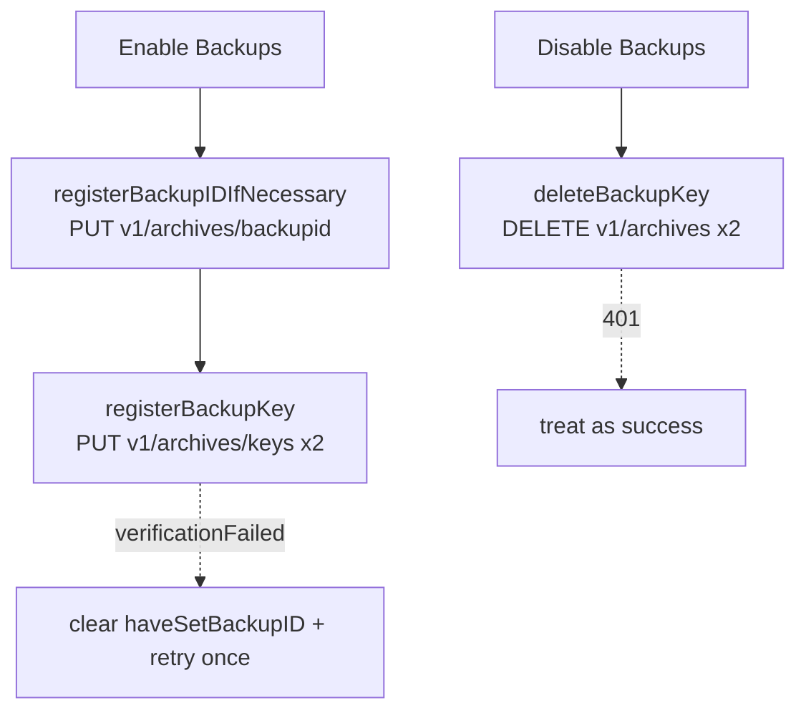
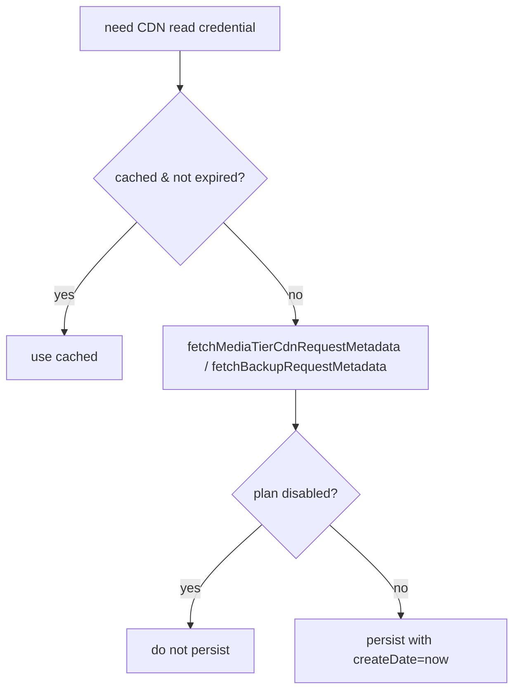

# Backups — Server & CDN Interaction

Covers how the client authenticates to and talks to the Backup service and CDNs:
ZK auth credentials, backup-id/key registration, upload forms, media
copy/list/delete, and the caching of CDN read credentials and metadata.

Primary source:

- `SignalServiceKit/Backups/BackupServiceAuth.swift`
- `SignalServiceKit/Backups/BackupRequestManager.swift`
- `SignalServiceKit/Backups/Settings/BackupKeyService.swift`
- `SignalServiceKit/Backups/Settings/BackupIdService.swift`
- `SignalServiceKit/Backups/BackupCDNReadCredential.swift`
- `SignalServiceKit/Backups/BackupCDNMetadata.swift`
- `SignalServiceKit/Backups/BackupCDNCredentialStore.swift`

> The ZK credential cryptography (`BackupAuthCredential.present`, `BackupAuth`)
> and the chat/CDN transport live in LibSignalClient and the Network layer; the
> actual credential fetch is delegated to `BackupAuthCredentialManager` (outside
> this directory). Those claims are **[Medium]**.

---

## Two credential types, two levels

Backup requests are authenticated with a **ZK auth credential** scoped to a
`BackupAuthCredentialType` (`.messages` or `.media`) and carrying a
`BackupLevel` (`.free` or `.paid`). The message tier (backup file) and media
tier (attachments) have separate credentials. **[High]**

### `BackupServiceAuth` — `BackupServiceAuth.swift:24`

- Built from a `PrivateKey` + `BackupAuthCredential` + `type` (`:38`).
- Produces two headers from the credential presentation + its signature:
  `X-Signal-ZK-Auth` and `X-Signal-ZK-Auth-Signature` (`:55-58`). **[High]**
- Exposes `publicKey`, `type`, and `backupLevel` (`:31-37`), and
  `apply(to httpHeaders:)` to attach the headers (`:81`). **[High]**
- The server public params come from `TSConstants.backupServerPublicParams`
  (`:46`). **[High]**

---

## `BackupRequestManager` — `BackupRequestManager.swift` (protocol ~`:86`)

The façade over all Backup service requests. **[High]**

| Method | Purpose | Notes |
| --- | --- | --- |
| `fetchBackupServiceAuthForRegistration` | ZK auth during registration | passthrough to `BackupAuthCredentialManager` (`:423`) |
| `fetchBackupServiceAuth(for:localAci:auth:forceRefreshUnlessCachedPaidCredential:)` | ZK auth | default overload sets `forceRefresh: false` (`:160-176`) |
| `fetchBackupUploadForm(backupByteLength:)` | CDN upload form for the **backup file** | `owsAssertDebug(auth.type == .messages)`; `SignalError.uploadTooLarge` → `BackupUploadFormError.tooLarge` (`:456-472`) |
| `fetchBackupMediaAttachmentUploadForm(encryptedByteLength:)` | CDN upload form for **media** | asserts `.media` |
| `fetchMediaTierCdnRequestMetadata(cdn:)` | media-tier read credential | returns `MediaTierReadCredential` |
| `fetchBackupRequestMetadata` | backup-file read credential + nonce header | returns `BackupReadCredential` |
| `copyToMediaTier(item:)` / `copyToMediaTier(items:)` | transit→media copy (single/batch) | asserts `.media`; status → `CopyToMediaTierError` (`:400-442`) |
| `listMediaObjects(cursor:limit:)` | list media tier objects | asserts `.media`; returns `ListMediaResult` (`:447-461`) |
| `deleteMediaObjects(objects:)` | delete media tier objects | asserts `.media` (`:463-479`) |
| `fetchSVRBAuthCredential(key:chatServiceAuth:)` | SVRB auth for the nonce chain | passthrough (`:481-490`) |

- `fetchBackupUploadForm` uses the **unauth** backups chat service
  (`chatConnectionManager.withUnauthService(.backups)`, `:460`). **[High]**
- `executeBackupService<T: Decodable>` / `executeBackupServiceRequest` are the
  JSON helpers (`:493-516`). **[High]**

---

## Backup-ID & key registration

Two one-time setup steps gate "enabling Backups". **[High]**

### `BackupIdService` — `BackupIdService.swift:11`

The **Backup-ID** is set on *all* accounts and is a prerequisite for setting a
Backup **key**. **[High]**

- `registerBackupIDIfNecessary(localAci:auth:logger:)` (`:76`): no-op if
  `haveSetBackupID` is already true or if not a registered primary; otherwise
  `PUT v1/archives/backupid` with the message (+ optional media) auth-credential
  requests, then sets `haveSetBackupID = true` (`:76-121`, request `:200-220`).
  **[High]**
- `updateMessageBackupIdForRegistration(key:auth:logger:)` (`:123`): registers
  only the message backup-id (media `nil`). **[High]**
- `fetchBackupIDLimits(auth:logger:)` (`:135`): `GET v1/archives/backupid/limits`
  → `BackupIdLimits{ hasPermitsRemaining, retryAfterSeconds }` (`:30-33`,
  `:222-233`). **[High]**

### `BackupKeyService` — `BackupKeyService.swift:12`

"Enabling"/"disabling" Backups by registering/deleting the public key used to
sign Backup auth credentials. **[High]**

- `registerBackupKey(...)` (`:78`): fetches message + media ZK auth and
  `PUT v1/archives/keys` with `backupIdPublicKey` for each
  (`:95-139`, request `:189-200`). It is **idempotent**. On
  `SignalError.verificationFailed` (backup-id never registered remotely) it
  clears local `haveSetBackupID` and retries **once** (`:124-138`). **[High]**
- `deleteBackupKey(...)` (`:146`): deletes both message and media keys via
  `DELETE v1/archives` (request `:203-220`). **[High]**
  - `timeoutInterval = 30` and the comment warns a second synchronous delete can
    be slow (`:212-217`).
  - A `401` is **treated as success** (the key we auth with was already deleted
    by a prior success) (`:177-186`). **[High]**
  - This is only *part* of "disable Backups"; the user-level operation is
    `BackupDisablingManager` (outside this directory) (`:28-32`). **[Medium]**

---

## CDN read credentials & metadata caching

### `BackupCDNReadCredential` — `BackupCDNReadCredential.swift:5`

A set of HTTP headers with a `createDate`; `lifetime = .day`; `isExpired(now:)`
compares against `createDate + lifetime`. `createDate` defaults to "now" when
decoding if absent (`:16-21`). **[High]**

### `BackupCDNMetadata` — `BackupCDNMetadata.swift:9`

Cacheable server-provided backup info: `cdn`, `backupDir`, `mediaDir`,
`backupName`, `usedSpace`. The backup file is at `/backupDir/backupName`; media
is at `/backupDir/mediaDir/mediaId` (field docs `:11-27`). **[High]**

### `BackupCDNCredentialStore` — `BackupCDNCredentialStore.swift:5`

kv collection `BackupCDNCredentialStore`. **[High]**

- Read-credential key: `"BackupCDN<cdnNumber>:<authType.rawValue>"` (`:23-28`).
- `backupCDNReadCredential(...)` returns the cached credential only if not
  expired (`:30-55`); `setBackupCDNReadCredential(...)` **skips writing when the
  plan is `.disabled`** (can happen during registration) (`:57-83`). **[High]**
- Metadata keys: `"BackupCDNMetadata:<authType>"` + a saved-date key; metadata
  is considered stale after `cdnMetadataLifetime` (= `BackupCDNReadCredential.lifetime`
  = `.day`) (`:85-150`). Writes also skip when plan is `.disabled`. **[High]**
- `wipe(tx:)` clears everything (`:18-20`). **[High]**

---

## Error paths & edge cases

- **Upload too large**: `fetchBackupUploadForm` maps LibSignal
  `uploadTooLarge` to `BackupArchive.Response.BackupUploadFormError.tooLarge`
  (`BackupRequestManager.swift:466-471`). **[High]**
- **Copy-to-media errors** are decoded from the HTTP status into
  `BackupArchive.Response.CopyToMediaTierError` both on success-body and in the
  catch (`:400-425`). **[High]**
- **Credential type asserts**: media operations `owsAssertDebug(auth.type == .media)`;
  the upload form asserts `.messages`. A mismatch is a debug assertion, not a
  thrown error (`:456`, `:435`, `:447`, `:463`). **[High]**
- **No backup to download/delete** surfaces as HTTP `404`/`401`; `404` on CDN
  info during an SVRB restore is mapped to `SVRBError.unrecoverable`
  (`BackupArchiveManagerImpl.swift:1551-1557`). **[High]**
- `MediaTierReadCredential` / `BackupReadCredential` wrap the CDN read headers
  and (for the backup file) the plaintext nonce header
  (`BackupRequestManager.swift:518`, `:547`; `BackupCdnInfo` in
  `BackupArchiveManager.swift:17`). **[High]**
