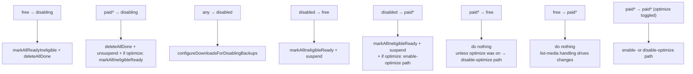
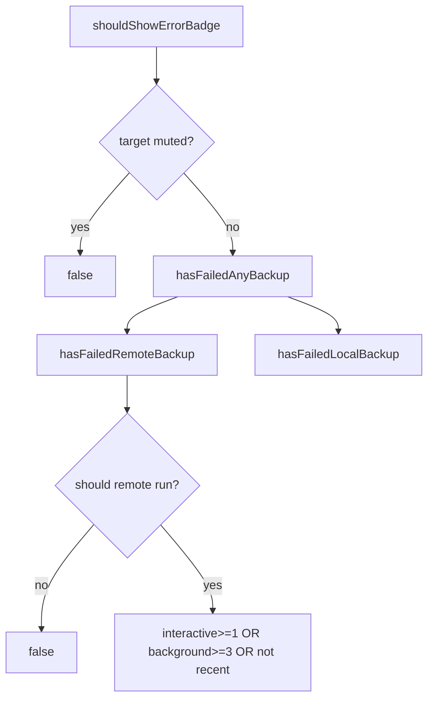

# Backups — Settings & Plan

Covers the user-facing Backup plan model, the settings store, the plan-transition
state machine (and its download-queue side effects), and the failure/badge state
that surfaces backup problems in the UI.

Primary source:

- `SignalServiceKit/Backups/Settings/BackupSettingsStore.swift`
- `SignalServiceKit/Backups/Settings/BackupPlanManager.swift`
- `SignalServiceKit/Backups/Settings/BackupFailureStateManager.swift`

---

## `BackupPlan` — `BackupSettingsStore.swift:7`

A `RawRepresentable` enum persisted as `Int`. **[High]**

| Case | Raw | Meaning |
| --- | --- | --- |
| `free` | 1 | Free tier (backup file only, no media tier). |
| `paid(optimizeLocalStorage: false)` | 2 | Paid, keep local files. |
| `paid(optimizeLocalStorage: true)` | 3 | Paid, offload local files. |
| `paidExpiringSoon(false)` | 4 | Paid but expiring; keep local. |
| `paidExpiringSoon(true)` | 5 | Paid but expiring; offload. |
| `disabled` | 6 | Backups off. |
| `disabling` | 7 | Transitional: tearing down. |
| `paidAsTester(false)` | 8 | Internal tester paid; keep local. |
| `paidAsTester(true)` | 9 | Internal tester paid; offload. |

(`:19-40`.) Unknown raw values decode to `.disabled`
(`backupPlan(tx:)`, `:131-137`). **[High]**

---

## `BackupSettingsStore` — `BackupSettingsStore.swift:58`

Three backing stores (`:81-87`): **[High]**

- `kvStore` — collection `BackupSettingsStore`
- `errorStateStore` — collection `BackupSettingsErrorStateStore`
- `refreshBackupStore` — a `CronStore(uniqueKey: .refreshBackup)`

### State it owns (selected)

| Concept | Keys / methods | Line |
| --- | --- | --- |
| Ever enabled | `haveBackupsEverBeenEnabled` / set on any `setBackupPlan` | 92, 148 |
| Current plan | `backupPlan` / `setBackupPlan` (**no side effects**) | 131, 146 |
| Last backup enabled details | `LastBackupEnabledDetails{enabledTime, notificationDelay}` | 155 |
| Last backup details | `LastBackupDetails{firstBackupDate, date, backupFileSizeBytes, backupTotalSizeBytes?}` | 199 |
| Error counts | `get/incrementInteractiveBackupErrorCount`, `...Background...` | 300-322 |
| Error badge mute | `ErrorBadgeTarget` (`chatListAvatar`/`chatListMenuItem`), `get/setErrorBadgeMuted` | 283-298 |
| Download queue suspended | `isBackupAttachmentDownloadQueueSuspended` / `setIsBackupDownloadQueueSuspended` | 326, 338 |
| Upload queue suspended | `isBackupAttachmentUploadQueueSuspended` / `setIsBackupUploadQueueSuspended` | 383, 391 |
| Consumed media capacity | `hasConsumedMediaTierCapacity` / `setHasConsumedMediaTierCapacity` | 367, 378 |
| Cellular downloads | `shouldAllowBackupDownloadsOnCellular` (temporary override) | 352-363 |
| Cellular uploads | `shouldAllowBackupUploadsOnCellular` | 399-415 |
| Recovery key reminder | `lastRecoveryKeyReminderDate` | 419 |
| Backup-ID set | `haveSetBackupID` / `setHaveSetBackupID` | 429-435 |

### Notifications — `BackupSettingsStore.swift:46`

`lastBackupDetailsDidChange`, `backupAttachmentDownloadQueueSuspensionStatusDidChange`,
`backupAttachmentUploadQueueSuspensionStatusDidChange`,
`hasConsumedMediaTierCapacityStatusDidChange`,
`shouldAllowBackupDownloadsOnCellularChanged`,
`shouldAllowBackupUploadsOnCellularChanged` (`:46-53`). **[High]**

### Business rules worth noting

- `LastBackupDetails.backupTotalSizeBytes` is only populated on paid tiers;
  non-paid returns `nil` (`:234-243`). **[High]**
- `setLastBackupDetails` records first-backup date on first call, bumps the
  `refreshBackup` cron, and **clears all error state**
  (`errorStateStore.removeAll`) — "we did a backup, so clear errors" (`:273-281`).
  **[High]**
- `setIsBackupDownloadQueueSuspended` also **resets** the temporary cellular-downloads
  override to `false` (`:342-346`). **[High]**
- `setBackupPlan` here is deliberately **side-effect-free**; callers should prefer
  `BackupPlanManager` (comment `:140-145`). **[High]**

---

## `BackupPlanManager` — `BackupPlanManager.swift:9`

The side-effecting façade over `setBackupPlan`. **[High]**

- `setBackupPlan(fromStorageService:tx:)` (`:71`): **linked devices only** (asserts
  not-primary). Maps `BackupLevel` → plan (`nil → .disabled`, `.free → .free`,
  `.paid → .paid(optimizeLocalStorage: false)` — linked devices don't support
  optimize). On transition to disabled, configures downloads for disabling
  (`:84-113`). **[High]**
- `setBackupPlan(_:tx:)` (`:116`): **primary devices**. On change it:
  1. persists via `backupSettingsStore.setBackupPlan`,
  2. notifies upload progress (`backupPlanDidChange`),
  3. `rotateUploadEraIfNecessary`,
  4. `configureDownloadsForBackupPlanChange`,
  5. resets `hasConsumedMediaTierCapacity` to `false` when becoming non-paid,
  6. posts `.backupPlanChanged` + `.megaphoneStateDidChange` and re-begins
     download-progress observation on sync-completion (`:116-183`). **[High]**

### Upload-era rotation — `:187`

Rotates the upload era **only** when transitioning **non-paid → paid**, forcing a
list-media to discover uploads (`:188-207`). **[High]**

### Plan transitions and their side effects — `configureDownloadsForBackupPlanChange` — `:211`

This is the core of download-queue management. **[High]** Selected arms:

The helper transitions (`:300-330`): **[High]**

- `configureDownloadsForDisablingBackups`: `deleteAllDone` + `markAllReadyIneligible`
  + suspend.
- `configureDownloadsForDidEnableOptimizeStorage`: mark media-tier fullsize
  downloads **older than** `offloadingThreshold` ineligible (they'd be offloaded
  anyway), **unsuspend** (auto-download newer), reset the done counter.
- `configureDownloadsForDidDisableOptimizeStorage`: `markAllIneligibleReady` but
  **suspend** (user must opt in), reset the "download complete" banner.

> **Design intent (stated in comments):** "suspending" the download queue
> prevents downloads from auto-starting and consuming storage without explicit
> user opt-in; it's un-suspended only on explicit user action (`BackupSettingsStore.swift:331-336`).
> **[High]**

---

## Failure & badge state — `BackupFailureStateManager.swift:8`

Decides whether to show an error badge for remote and/or local backups. **[High]**

Thresholds (`:11-14`): **[High]**

- `requiredInteractiveFailuresForBadge = 1`
- `requiredBackgroundFailuresForBadge = 3`

### Logic

- `hasFailedRemoteBackup(tx:)` (`:32`): only if remote backups *should* be running
  (registered primary + plan not disabled/disabling, `:100-110`). Returns true if
  interactive failures ≥ 1, background failures ≥ 3, **or** the last successful
  backup wasn't "recent" (within `.week`, `:123-150`). **[High]**
- `hasFailedLocalBackup(tx:)` (`:50`): analogous, gated on
  `localFileBackupStore.localBackupsEnabled`, using the local error counts and
  last-local-backup recency (`:152-175`). **[High]**
- `hasFailedAnyBackup(tx:)` (`:68`): OR of the two.
- `shouldShowErrorBadge(target:tx:)` (`:84`): false if that badge target is muted;
  else `hasFailedAnyBackup`. **[High]**

Error counts are incremented by `BackupExportJob` on failure/cancel and cleared
by `setLastBackupDetails` — see
[archive-and-export.md § error accounting](archive-and-export.md#error--cancellation-accounting--backupexportjobswift289-316).

---

## Feature flags

From `SignalServiceKit/Environment/BuildFlags.swift:35` (`Backups`) and `:75`
(`LocalFileBackups`): **[High]**

| Flag | Enabled when | Effect |
| --- | --- | --- |
| `Backups.showOptimizeMedia` | `build <= .dev` | Show optimize-media setting. |
| `Backups.restoreFailOnAnyError` | `build <= .beta` | Abort restore on any frame error (see [restore-and-import.md](restore-and-import.md#restorefailonanyerror-behavior)). |
| `Backups.detailedBenchLogging` | `build <= .internal` | Memory sampling during archive/restore. |
| `Backups.archiveErrorDisplay` | `build <= .internal` | Gate internal error-store UI. |
| `Backups.avoidAppAttestForDevs` | `build <= .dev` | Skip App Attest for devs. |
| `Backups.avoidStoreKitForTesters` | `build <= .beta` | Skip StoreKit for testers. |
| `Backups.mediaErrorDisplay` | `build <= .beta` | Media error UI. |
| `Backups.useLowerDefaultListMediaRefreshInterval` | `build <= .beta` | Faster list-media cadence. |
| `LocalFileBackups.archive` | `true` | Local file backup archiving. |
| `LocalFileBackups.restore` | `true` | Local file backup restore (gates post-import restore, [restore-and-import.md](restore-and-import.md#post-restore-side-effects-sync-completion--backuparchivemanagerimplswift1346)). |
| `LocalFileBackups.settingsUI` | `true` | Local file backup settings UI. |

> `Backups.avoidAppAttestForDevs` and `avoidStoreKitForTesters` relate to the
> subscription/entitlement flow, which is outside this directory; their precise
> consumers are **undetermined — no evidence in `SignalServiceKit/Backups/`**.
> **[Low]**
