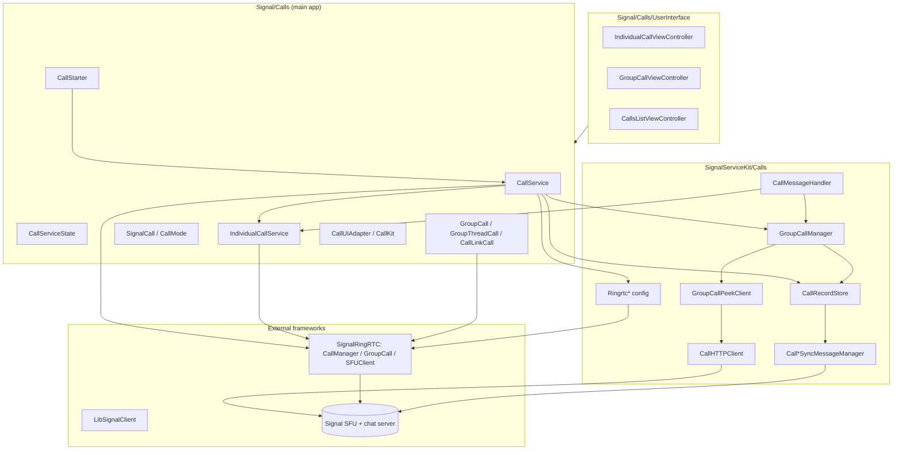

# Signal iOS Calling Subsystem

This directory documents Signal iOS's calling subsystem: the code that places,
answers, peeks, records, and syncs 1:1 calls, group calls, and call-link
("ad-hoc") calls. It spans three source trees:

| Tree | Role |
| --- | --- |
| `SignalServiceKit/Calls/` | Framework-level, UI-independent calling logic: protocols, models, persistence (GRDB), server/SFU clients, sync-message handling, RingRTC configuration. |
| `Signal/Calls/` | Main-app glue: the live `CallService`, per-call state machines, CallKit/WebRTC integration, and the calling UI (`UserInterface/`). |
| `SignalUI/Calls/` | A few shared call-link helper types usable from both the app and share/notification extensions. |

Signalling and media transport are implemented by the external
`SignalRingRTC` framework (a Swift wrapper over RingRTC/WebRTC) and
`LibSignalClient`. This subsystem is primarily the *integration layer* between
Signal's data/model/network stack and RingRTC's `CallManager`, `GroupCall`, and
`SFUClient`.

> **Confidence labels.** Every documented claim carries a confidence label:
> **[High]** = directly read from the cited source; **[Medium]** = inferred
> from strong local evidence (naming, call sites, comments) but not every path
> was traced; **[Low]** = plausible inference that was not fully verified.
> Citations use `path:line` ranges from the state of the tree at the time of
> writing; line numbers may drift as the code changes.

## Document map

| Doc | Covers |
| --- | --- |
| [ringrtc-configuration.md](./ringrtc-configuration.md) | VP9 / SVC / field-trial configuration passed into RingRTC. |
| [call-message-handling.md](./call-message-handling.md) | Inbound `CallMessage` envelope routing and outbound RingRTC signalling messages. |
| [individual-calls.md](./individual-calls.md) | 1:1 call model, offer handling, the `CallState` state machine, error/timeout paths. |
| [group-calls.md](./group-calls.md) | Group-call peeking, SFU/HTTP clients, interactions, ringing, and the app-side `GroupCall` hierarchy. |
| [call-links.md](./call-links.md) | Call-link model, persistence, creation/peek/update, and ad-hoc calls. |
| [call-records-and-sync.md](./call-records-and-sync.md) | `CallRecord`/`DeletedCallRecord` persistence, status model, Calls-Tab queries, and call-event / call-log sync messages. |
| [webrtc-and-app-services.md](./webrtc-and-app-services.md) | `CallService`, `CallServiceState`, `CallStarter`, ICE server fetching, CallKit/audio, and the UI layer. |

## High-level architecture

[High] `CallService` constructs a `CallManager<SignalCall, CallService>` from
`SignalRingRTC`, wires itself as its delegate, and owns the per-mode call
services (`Signal/Calls/CallService.swift:18-205`). [High] Inbound call messages
enter through the `CallMessageHandler` protocol
(`SignalServiceKit/Calls/CallMessageHandler.swift:19-44`), whose production
implementation `WebRTCCallMessageHandler` routes them to the individual-call
service or the group-call manager (`Signal/Calls/WebRTCCallMessageHandler.swift:11-156`).

## First-party file inventory

Every first-party file in the three call directories is referenced by the docs
below. See [webrtc-and-app-services.md § File inventory](./webrtc-and-app-services.md#appendix-first-party-file-inventory)
for the complete cross-referenced list including the UI files.
