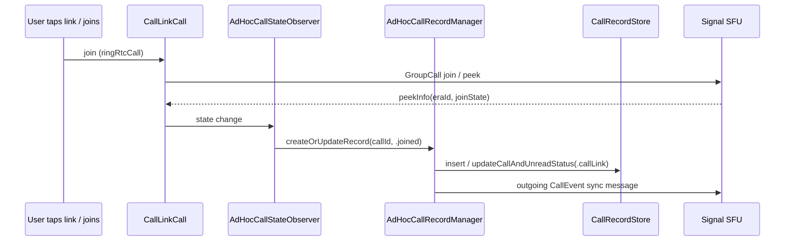

# Call Links & Ad-Hoc Calls

Call links let users join a group call without a group thread. A link is
identified by a `CallLinkRootKey`; from it the client derives a server-side
`roomId`, auth-credential presentations, and the shareable
`https://signal.link/call/#key=…` URL. "Ad-hoc" calls are the `CallRecord`s
produced for call-link participation.

## Shared types — `SignalUI/Calls/`

### `CallLink`

**File:** `SignalUI/Calls/CallLink.swift`

[High] `public struct CallLink: Equatable` wraps a `CallLinkRootKey`
(`CallLink.swift:9-80`):

- `init?(url:)` parses `https://signal.link/call/#key=…` (and the `sgnl` scheme
  and legacy `/call` path), rejecting any URL with the wrong scheme/host/path or
  with user/password/port/query (`CallLink.swift:30-57`).
- `url()` reconstructs the canonical URL, placing the key in the fragment
  (`CallLink.swift:63-76`).
- `generate()` creates a fresh random link (`CallLink.swift:59-61`).

[High] `CallLinkTest` (`SignalUI/Calls/CallLinkTest.swift`) is an `XCTestCase`
covering URL rejection, round-trip, and uniqueness of generated links.

### `CallLinkFetcherImpl`

**File:** `SignalUI/Calls/CallLinkFetcher.swift`

[High] `public class CallLinkFetcherImpl` reads call-link state from the SFU
(`CallLinkFetcher.swift:12-45`). `readCallLink(_:authCredential:)` derives
secret params from the root key, builds an auth-credential presentation, and
calls `sfuClient.readCallLink(sfuUrl:…)`; a `404` becomes `CallLinkNotFoundError`.
It retains a `CallHTTPClient` so the `SFUClient` keeps working. [High] `SFUError`
+ `SFUResult.unwrap()` convert RingRTC error codes into thrown Swift errors
(`CallLinkFetcher.swift:47-60`).

## Persistence — `SignalServiceKit/Calls/`

### `CallLinkState`

**File:** `SignalServiceKit/Calls/CallLinkState.swift`

[High] `public struct CallLinkState` wraps `SignalRingRTC.CallLinkState` with
`name`, `restrictions`, `revoked`, `expiration`, `rootKey`
(`CallLinkState.swift:8-50`). `requiresAdminApproval` is `true` for
`.adminApproval`/`.unknown` restrictions; `Constants.defaultRequiresAdminApproval
= true`; `localizedName` falls back to `CallStrings.signalCall`.

### `CallLinkRecord`

**File:** `SignalServiceKit/Calls/CallLinkRecord.swift`

[High] `public struct CallLinkRecord: Codable, PersistableRecord, FetchableRecord`
(table `CallLink`, `CallLinkRecord.swift:9-233`). Fields: `id`, `roomId`,
`rootKey`, `adminPasskey`, `adminDeletedAtTimestampMs`, `activeCallId`,
`pendingFetchCounter` (persisted column `pendingActionCounter`), `isUpcoming`,
`name`, `restrictions`, `revoked`, `expiration`. Behavior:

- Custom `Codable` stores `UInt64` fields as bit-patterned `Int64`
  (`CallLinkRecord.swift:72-110`).
- `insertRecord` / `insertFromBackup` use SQL `… RETURNING *`
  (`CallLinkRecord.swift:112-170`).
- `Restrictions` enum (`none`/`adminApproval`/`unknown`) bridges to the RingRTC
  enum (`CallLinkRecord.swift:175-200`).
- `updateState(_:)` applies a fetched `CallLinkState`; `didUpdateState()` marks
  an admin link as `isUpcoming` (`CallLinkRecord.swift:202-227`).
- `setNeedsFetch()`/`clearNeedsFetch()` bump/reset `pendingFetchCounter`;
  `didInsertCallRecord()` clears `isUpcoming`; `markDeleted(atTimestampMs:)`
  tombstones the row (`CallLinkRecord.swift:160-233`).

### `CallLinkRecordStore`

**File:** `SignalServiceKit/Calls/CallLinkRecordStore.swift`

[High] `public struct CallLinkRecordStore` (`CallLinkRecordStore.swift:9-150`):
`fetch(rowId:)`/`fetch(roomId:)`, `insertFromBackup`, `fetchOrInsert`, `update`,
`deleteIfPossible` (returns `false` on `SQLITE_CONSTRAINT`, i.e. still
referenced), `fetchAll`/`enumerateAll`, `fetchUpcoming(earlierThan:limit:)`,
`fetchWhere(adminDeletedAtTimestampMsIsLessThan:)`, and
`fetchAnyPendingRecord` (any record with `pendingFetchCounter > 0`).

## Server operations — `CallLinkManager`

**File:** `Signal/Calls/CallLinkManager.swift`

[High] `protocol CallLinkManager` and `CallLinkManagerImpl`
(`CallLinkManager.swift:11-230`) wrap the SFU for mutations:

| Method | Server interaction | Cite |
| --- | --- | --- |
| `peekCallLink` | `sfuClient.peek(sfuUrl:…)`; maps `expired`/`invalid` status codes to `PeekError`; returns `eraId`. | `:66-93` |
| `createCallLink` | Fetches a `CreateCallLinkCredential` via chat-server `TSRequest("v1/call-link/create-auth?v101=true")`, then `sfuClient.createCallLink(…)` with a freshly generated `adminPasskey`. Returns `CreateResult(adminPasskey, callLinkState)`. | `:97-170` |
| `deleteCallLink` | `sfuClient.deleteCallLink(…)` with the admin passkey. | `:172-186` |
| `updateCallLinkName` | `sfuClient.updateCallLinkName(…)`. | `:188-204` |
| `updateCallLinkRestrictions` | `sfuClient.updateCallLinkRestrictions(…)`. | `:206-224` |

[High] `PeekError` enum: `expired`/`invalid`/`other(UInt16)`
(`CallLinkManager.swift:60-65`). All SFU URL selection honors
`DebugFlags.callingUseTestSFU`.

## Concurrency-safe state updates — `CallLinkStateUpdater`

**File:** `Signal/Calls/CallLinkStateUpdater.swift`

[High] An `actor` that serializes reads/updates **per room ID** via a
`KeyedConcurrentTaskQueue`, so a stale read can't clobber a fresh update
(`CallLinkStateUpdater.swift:11-160`).

- `updateExclusively(rootKey:updateAndFetch:)` runs an update closure then
  persists the resulting `CallLinkState` — **only if the record already
  exists**, to avoid orphaned records for links the user never joins
  (`:49-131`).
- On a "delete" outcome it marks the record deleted and purges associated
  `CallRecord`s via `callRecordDeleteManager.deleteCallRecords(…,
  sendSyncMessageOnDelete: true)`.
- `readCallLink` returns `Result<CallLinkState, CallLinkNotFoundError>` — the
  thrown error layer is reserved for *operation* failures (e.g. no network),
  while a cleanly "not found" link is a success that still clears the fetch flag
  (`:133-150`).

## Background refresh — `CallLinkFetchJobRunner`

**File:** `Signal/Calls/CallLinkFetchJobRunner.swift`

[High] An `actor` + `DatabaseChangeDelegate` that refreshes any `CallLinkRecord`
with a pending fetch (`CallLinkFetchJobRunner.swift:8-100`). It coalesces work
with `mightHavePendingFetch`/`isFetching`, loops over
`fetchAnyPendingRecord`, calls `callLinkStateUpdater.readCallLink`, and backs off
exponentially (capped at ~6 h average) on repeated failure. It re-triggers on
`CallLinkRecord`-table database changes.

## Admin UI glue — `CallLinkAdminManager`

**File:** `Signal/Calls/CallLinkAdminManager.swift`

[High] `@MainActor class CallLinkAdminManager` drives the admin editing UI
(`CallLinkAdminManager.swift:11-120`): `updateName` and
`toggleApproveAllMembersWithActivityIndicator` go through
`callLinkStateUpdater.updateExclusively`, and on success also enqueue a
`CallLinkUpdateMessageSender` sync message. It publishes the call name via a
Combine `CurrentValueSubject`. [Medium] On a network-ambiguous failure it leaves
the switch as-is (TODO noted in source); on a definite failure it reverts.

## Sync messages

### `CallLinkUpdateMessageSender`

**File:** `Signal/Calls/CallLinkUpdateMessageSender.swift`

[High] Builds and enqueues an `OutgoingCallLinkUpdateMessage` to the local
thread (`CallLinkUpdateMessageSender.swift:9-30`).

### `OutgoingCallLinkUpdateMessage`

**File:** `SignalServiceKit/Calls/OutgoingCallLinkUpdateMessage.swift`

[High] `@objc(OutgoingCallLinkUpdateMessage) OutgoingSyncMessage`
(`OutgoingCallLinkUpdateMessage.swift:9-76`). `syncMessageBuilder` sets a
`SSKProtoSyncMessageCallLinkUpdate` with `type = .update`, the `rootKey`, and the
optional `adminPasskey`. `isUrgent` is `false`. [Medium] This informs linked
devices about links we created/updated so they appear in their Calls Tab.

## Call-link calls & ad-hoc records

### `CallLinkCall`

**File:** `Signal/Calls/CallLinkCall.swift`

[High] `final class CallLinkCall: Signal.GroupCall` with `callLink`,
`adminPasskey`, `callLinkState` (`CallLinkCall.swift:11-45`). `isAdmin` reflects
possessing an admin passkey; `mayNeedToAskToJoin` is `true` when the link
requires admin approval and we are not an admin.

### `AdHocCallStateObserver`

**File:** `Signal/Calls/AdHocCallStateObserver.swift`

[High] Observes a `CallLinkCall` and records participation
(`AdHocCallStateObserver.swift:9-130`):

- `checkIfJoined()` records the furthest `JoinLevel`
  (`attempted`→`.generic`, `joined`→`.joined`), inserting/fetching the
  `CallLinkRecord`, sending a (non-admin) call-link update message, and calling
  `adHocCallRecordManager.createOrUpdateRecord(…)`.
- `checkIfActive()` tracks the active era and calls
  `adHocCallRecordManager.handlePeekResult(eraId:rootKey:)`.

### `AdHocCallRecordManager`

**File:** `SignalServiceKit/Calls/CallRecord/AdHocCallRecordManager.swift`

[High] `public protocol AdHocCallRecordManager` + `…Impl` + a testable
`MockAdHocCallRecordManager` (`AdHocCallRecordManager.swift:9-160`):

- `createOrUpdateRecord(callId:callLink:status:timestamp:shouldSendSyncMessge:tx:)`
  — refuses deleted links, inserts a `CallRecord` (`.callLink(status)`) or
  transitions an existing one (only toward `.joined`, enforced by
  `CallLinkCallStatus.canTransition`), updates the `CallLinkRecord`, and
  optionally sends an outgoing call-event sync message.
- `handlePeekResult(eraId:rootKey:)` — updates `CallLinkRecord.activeCallId`, and
  for links already in the Calls Tab (`isUpcoming` or already having a record)
  bumps the record's timestamp so it floats to the top.

